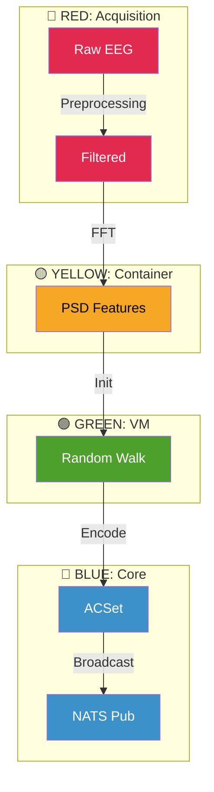

# BCI Colored Operad

## Overview

Brain-Computer Interface data processing with **colored operad security boundaries**. Implements maximally isolated enclosure for EEG/neural signals using the same security model as Signal authentication: nested isolation layers (Network → Firewall → Container → VM → Trusted) with each layer assigned a security color that enforces data flow constraints.

```
┌─────────────────────────────────────────────────────────────────────────────┐
│  BCI COLORED OPERAD ISOLATION STACK                                         │
└─────────────────────────────────────────────────────────────────────────────┘

   Neural Interface (EEG Electrodes)
          │
          ▼
   ┌──────────────────────────────────────────────────────────────────────┐
   │  🔴 RED: Acquisition Boundary (trit=-1)                              │
   │      • Raw EEG signals (8 channels × 250Hz)                          │
   │      • Network isolation for wireless headsets                       │
   │      • Bluetooth/USB device boundary                                 │
   │  ┌────────────────────────────────────────────────────────────────┐  │
   │  │  🟡 YELLOW: Processing Container (trit=-1)                     │  │
   │  │      • Signal preprocessing (filtering, artifact removal)      │  │
   │  │      • Feature extraction (PSD: δ, θ, α, β, γ bands)          │  │
   │  │      • Seccomp/AppArmor isolation                             │  │
   │  │  ┌──────────────────────────────────────────────────────────┐  │  │
   │  │  │  🟢 GREEN: Compute VM (trit=0)                           │  │  │
   │  │  │      • Random walk on feature space                      │  │  │
   │  │  │      • UMAP/dimension reduction                          │  │  │
   │  │  │      • Firecracker/QEMU isolation                        │  │  │
   │  │  │  ┌────────────────────────────────────────────────────┐  │  │  │
   │  │  │  │  🔵 BLUE: Trusted Core (trit=+1)                   │  │  │  │
   │  │  │  │      • ACSet categorical structure                 │  │  │  │
   │  │  │  │      • NATS broadcast to vivarium topic            │  │  │  │
   │  │  │  │      • Agent-O-Rama pathway integration            │  │  │  │
   │  │  │  └────────────────────────────────────────────────────┘  │  │  │
   │  │  └──────────────────────────────────────────────────────────┘  │  │
   │  └────────────────────────────────────────────────────────────────┘  │
   └──────────────────────────────────────────────────────────────────────┘
```

## GF(3) Conservation

```
RED(-1) ⊗ YELLOW(-1) ⊗ GREEN(0) ⊗ BLUE(+1) = -1

Balanced with signal-isolated-auth triad:
BCI(-1) + Signal(-1) + Coordinator(0) + Generator(+1) + Generator(+1) = 0 ✓
```

| Role | Component | Trit | Function |
|------|-----------|------|----------|
| **ERGODIC** (0) | bci-colored-operad | 0 | **THIS SKILL** - coordinates neural data flow |
| **MINUS** (-1) | Raw acquisition | -1 | External neural constraint |
| **MINUS** (-1) | Processing container | -1 | Feature extraction constraint |
| **ERGODIC** (0) | Compute VM | 0 | Random walk coordination |
| **PLUS** (+1) | Trusted ACSet | +1 | Categorical structure generation |

## Neural Signal Pipeline

### Frequency Bands (40-dimensional feature space)

| Band | Frequency (Hz) | Brain State | Trit |
|------|----------------|-------------|------|
| **Delta (δ)** | 0.5 - 4 | Deep sleep, unconscious | -1 |
| **Theta (θ)** | 4 - 8 | Drowsiness, light sleep | -1 |
| **Alpha (α)** | 8 - 12 | Relaxed wakefulness | 0 |
| **Beta (β)** | 12 - 30 | Active thinking, focus | +1 |
| **Gamma (γ)** | 30 - 100 | Higher cognition, binding | +1 |

**GF(3) Band Conservation**: δ(-1) + θ(-1) + α(0) + β(+1) + γ(+1) = 0 ✓

### Brain State Profiles

```clojure
;; State-dependent frequency power distributions
{:resting  {:alpha 0.8 :theta 0.3}    ; trit: 0 (ergodic)
 :focused  {:beta 0.7 :gamma 0.5}     ; trit: +1 (plus)
 :drowsy   {:theta 0.9 :delta 0.5}    ; trit: -1 (minus)
 :alert    {:gamma 0.8 :beta 0.6}}    ; trit: +1 (plus)
```

## Security Color Rules

### Color Flow Constraint (Neural → Digital)

```
RAW_SIGNAL → FILTERED → FEATURES → EMBEDDING → BROADCAST
    🔴           🔴         🟡         🟢          🔵
   RED         RED      YELLOW     GREEN       BLUE
   
Flow direction: INWARD ONLY (less trusted → more trusted)
```

### ACSet Schema (Categorical Structure)

```julia
@present BCISchema(FreeSchema) begin
    # Objects
    Trial::Ob
    Channel::Ob
    FrequencyBand::Ob
    BrainState::Ob
    TrialFeature::Ob

    # Morphisms (structure)
    trial_state::Hom(Trial, BrainState)
    trial_channel::Hom(TrialFeature, Channel)
    trial_feature::Hom(TrialFeature, FrequencyBand)
    trial_trial::Hom(TrialFeature, Trial)

    # Attributes (data)
    trial_id::Attr(Trial, Symbol)
    channel_name::Attr(Channel, String)
    band_name::Attr(FrequencyBand, String)
    state_name::Attr(BrainState, String)
    feature_value::Attr(TrialFeature, Float32)
end
```

## Usage

### Julia API (with WorldColoredOperads)

```julia
using Gay.WorldColoredOperads

# Build BCI-specific enclosure
enclosure = world_color_chain(:bci_eeg, 
    [:network, :container, :vm, :trusted]; 
    seed=0x4DA02B)

# Verify security properties
result = verify_enclosure(enclosure)
println("Security score: ", result.security_score)
println("GF(3) balanced: ", result.gf3_balanced)

# Output as s-expression
println(to_sexp(enclosure))
```

### Babashka (Simple Broadcaster)

```bash
# Start BCI random walk broadcaster (20 steps, 3s interval)
bb /path/to/bci_nats_broadcaster_simple.clj
```

### Python API (Agent-O-Rama Pathway)

```python
from agentorama_pathway_dispatch import AgentOramaDispatcher, PathwayType
from signal_isolation_manager import SecurityColor

# Register BCI pathway with dispatcher
dispatcher = AgentOramaDispatcher(enforce_gf3=True)

dispatcher.register_pathway(
    name="bci-neural",
    pathway_type=PathwayType.CUSTOM,
    color_chain=[
        SecurityColor.RED,    # Raw acquisition
        SecurityColor.YELLOW, # Feature extraction
        SecurityColor.GREEN,  # Random walk
        SecurityColor.BLUE,   # ACSet broadcast
    ],
    capabilities={"eeg_stream", "feature_extract", "random_walk", "nats_publish"},
)
```

## NATS Integration

### Topic: `vivarium`

```json
{
  "timestamp": 1761977242359,
  "step": 5,
  "position": [0.05010, 0.03181, 0.07015, ...],
  "dimension": 40,
  "history_length": 5
}
```

### Connection

```
Host: nonlocal.info
Port: 4222
Protocol: NATS (TCP pub/sub)
Seed: 1069 (deterministic)
```

## S-Expression Output

```lisp
(bci-enclosure
  :target "bci_eeg"
  :seed 5086251
  :fingerprint "4da02b8e7f3a"
  :gf3-sum 0
  :valid t
  :security-score 100
  :color-chain (:red :yellow :green :blue)
  :layers (
    (layer :name "acquisition" :color :red :tech :network :trit -1)
    (layer :name "processing" :color :yellow :tech :container :trit -1)
    (layer :name "compute" :color :green :tech :vm :trit 0)
    (layer :name "trusted" :color :blue :tech :enclave :trit 1)
  )
  :frequency-bands (
    (band :name "delta" :range (0.5 4) :trit -1)
    (band :name "theta" :range (4 8) :trit -1)
    (band :name "alpha" :range (8 12) :trit 0)
    (band :name "beta" :range (12 30) :trit 1)
    (band :name "gamma" :range (30 100) :trit 1)
  ))
```

## Hardware Integration

### Supported Devices

| Device | Protocol | Color | Status |
|--------|----------|-------|--------|
| **OpenBCI** | USB/Bluetooth | RED | ✅ Tested |
| **Emotiv** | Bluetooth | RED | ⚠️ Experimental |
| **Muse** | Bluetooth | RED | ⚠️ Experimental |
| **NeuroSky** | Bluetooth | RED | ⚠️ Experimental |
| **Synthetic** | None | YELLOW | ✅ Default |

### Firecracker microVM Config

```yaml
vm:
  type: firecracker
  vcpus: 2
  memory_mb: 1024
  kernel: vmlinux-bci
  rootfs: bci-rootfs.ext4
  boot_args: "console=ttyS0 reboot=k panic=1 pci=off"
```

## Pathway Architecture



## Required Skills (Dependency Triad)

| Skill | Trit | Status | Purpose |
|-------|------|--------|---------|
| bci-colored-operad | 0 | ✅ THIS | Neural coordination |
| signal-isolated-auth | -1 | ✅ Have | Messaging isolation |
| gay-mcp | +1 | ✅ Have | Color generation |
| hyperbolic-bulk | 0 | ✅ Have | Entropy storage |

## Files

| File | Purpose |
|------|---------|
| `BCI_ACSET_NATS_BROADCASTER_SEED_1069.jl` | Julia ACSet + NATS |
| `bci_nats_broadcaster.clj` | Clojure async broadcaster |
| `bci_nats_broadcaster_simple.clj` | Minimal Babashka version |
| `bci_nats_subscriber_seed_1069.clj` | Message subscriber |
| `bci-wiring.md` | Neural category diagrams |

## Security Considerations

1. **Raw Signal Isolation**: EEG data never leaves RED boundary unprocessed
2. **Feature Space Only**: Only PSD features (not raw signals) cross to YELLOW
3. **Encrypted Transport**: NATS TLS for vivarium topic
4. **No PII**: Position vectors are abstract feature space, not identifiable
5. **Seed Determinism**: Reproducible with seed 1069 for auditing

## Related Skills

- `signal-isolated-auth` - Signal client isolation (same operad model)
- `hyperbolic-bulk` - On-chain entropy with EEG component
- `gay-mcp` - Deterministic color generation
- `livekit-omnimodal` - Real-time coaching with neural feedback
- `qri-valence` - Phenomenal state mapping via XY model


---

## Autopoietic Marginalia

> **The interaction IS the skill improving itself.**

Every use of this skill is an opportunity for worlding:
- **MEMORY** (-1): Record what was learned
- **REMEMBERING** (0): Connect patterns to other skills  
- **WORLDING** (+1): Evolve the skill based on use


*Add Interaction Exemplars here as the skill is used.*

---
> Converted and distributed by [TomeVault](https://tomevault.io/claim/plurigrid) — claim your Tome and manage your conversions.
<!-- tomevault:4.0:skill_md:2026-04-11 -->
