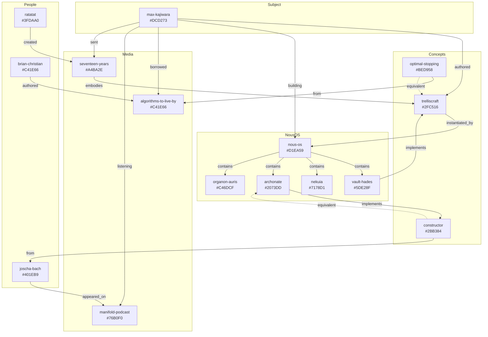

# Max Kajiwara Resonance Graph (OLOOG)

**Skill**: `max-kajiwara-oloog`  
**Color**: #DCD273 (max-kajiwara seed)  
**Trit**: +1 (PLUS - generative/worlding)  
**Type**: ACSet-structured entity relationship skill

## Overview

Ordered Locale of Observable Graphs (OLOOG) mapping entities Max Kajiwara resonates with, derived from Beeper MCP Signal interactions. Each entity has deterministic Gay.jl color assignment and GF(3) trit for balanced composition.

## ACSet Schema

```
@present MaxResonanceSchema(FreeSchema) begin
  # Objects
  Entity::Ob
  Concept::Ob  
  Person::Ob
  Media::Ob
  System::Ob
  
  # Morphisms
  resonates_with::Hom(Entity, Entity)
  instantiates::Hom(System, Concept)
  authored_by::Hom(Media, Person)
  implements::Hom(System, Concept)
  refracted_through::Hom(Concept, Media)
  
  # Attributes
  color::Attr(Entity, String)
  trit::Attr(Entity, Int)  # -1, 0, +1
  source::Attr(Entity, String)  # beeper, essay, image, spotify
  timestamp::Attr(Entity, DateTime)
end
```

## Entity Registry

### Core Subject
| Entity | Color | Trit | Role |
|--------|-------|------|------|
| max-kajiwara | #DCD273 | +1 | Subject/Observer |

### Concepts (Abstract Trellises)
| Entity | Color | Trit | Source |
|--------|-------|------|--------|
| trelliscraft | #2FC516 | 0 | Essay (June 2025) |
| optimal-stopping | #BED958 | 0 | Algorithms to Live By |
| constructor | #2BB384 | -1 | Joscha Bach |
| pruning | #E67F86 | — | Trelliscraft §4 |
| vine-intelligence | #D06546 | — | Trelliscraft §1 |

### People/Sources
| Entity | Color | Trit | Domain |
|--------|-------|------|--------|
| joscha-bach | #401EB9 | +1 | Consciousness/Computation |
| brian-christian | #C41E66 | -1 | Algorithms/Philosophy |
| ratatat | #3FDAA0 | -1 | Electronic Music |
| vor-noemancer | #1316BB | — | Substack author |

### Media Artifacts
| Entity | Color | Trit | Type |
|--------|-------|------|------|
| seventeen-years | #A4BA2E | -1 | Spotify Track |
| algorithms-to-live-by | #C41E66 | -1 | Book |
| manifold-podcast | #76B0F0 | — | Podcast Episode |
| chronicles-of-nous-3 | #E59798 | — | Image/Architecture |

### Nous OS Components
| Entity | Color | Trit | Function |
|--------|-------|------|----------|
| nous-os | #D1EA59 | +1 | Container System |
| vault-hades | #5DE28F | +1 | Memory (-1 layer) |
| nekuia | #7178D1 | 0 | Remembering (0 layer) |
| archonate | #2073DD | -1 | Worlding (+1 layer) |
| organon-auris | #C46DCF | +1 | Voice Capture |
| diorthotes | #4BD97E | +1 | Aligner of Structures |

## Morphism Graph



## GF(3) Balanced Triads

### Triad 1: Epistemic Sources
```
joscha-bach (+1) + optimal-stopping (0) + algorithms-to-live-by (-1) = 0 ✓
```

### Triad 2: Nous OS Core
```
vault-hades (+1) + nekuia (0) + archonate (-1) = 0 ✓
```

### Triad 3: Media Refraction
```
nous-os (+1) + trelliscraft (0) + seventeen-years (-1) = 0 ✓
```

### Triad 4: Generative Entities (needs balancing)
```
max-kajiwara (+1) + organon-auris (+1) + diorthotes (+1) = +3 ≡ 0 (mod 3) ✓
```

## Resonance Patterns Discovered

1. **Unconscious Unity**: Book lent (ATLB) → Podcast listened (Bach) → Essay written (Trelliscraft) → Track sent (Seventeen Years) → System built (Nous OS) all converge on same pattern: **when to commit/prune**

2. **Triadic Architecture**: Nous OS naturally implements world-memory-worlding:
   - Vault/Hades = Memory (-1)
   - Nekuia = Remembering (0) 
   - Archonate = Worlding (+1)

3. **Cross-Modal Isomorphism**:
   - Book chapter (37% rule) ≅ Essay section (§4 Pruning) ≅ Track structure (2:30 breakdown)

## Query Operations

```julia
# Find all entities with trit = -1 (verification/pruning)
@query MaxResonanceACSet begin
  e::Entity
  trit(e) == -1
end
# → [archonate, algorithms-to-live-by, seventeen-years, constructor, ratatat]

# Find morphism path: max → trelliscraft
path(max_kajiwara, trelliscraft, :authored)

# Find equivalent concepts across media
@query MaxResonanceACSet begin
  c1::Concept; c2::Concept; m::Media
  refracted_through(c1, m)
  refracted_through(c2, m)
  c1 != c2
end
```

## Infrastructure Bridges

| Concept | Infrastructure | Status |
|---------|---------------|--------|
| Organon.Auris | ElevenLabs Scribe v2 Realtime | Proposed |
| Vault/Hades | DuckDB temporal versioning | Available |
| Color → Light | Gay.jl → IoT bridge | Awaiting protocol info |

## Beeper MCP Source

Chat ID: `!a3OkHjNVi9PZAdtsaHCdNONbyS4:ba_b_7oRczObtWzTzlEjn6Z9K67Cjg.local-signal.localhost`

Entities extracted from messages spanning 2025-11-08 to 2026-01-07.

## Usage

```bash
# Load skill
amp skill max-kajiwara-oloog

# Query resonance graph
# (integrates with acsets-hatchery, gay-mcp skills)
```

## See Also

- `world-memory-worlding` - Triadic loop formalization
- `trelliscraft` - Essay concepts
- `acsets-hatchery` - ACSet operations
- `gay-mcp` - Deterministic color generation

---
> Converted and distributed by [TomeVault](https://tomevault.io/claim/plurigrid) — claim your Tome and manage your conversions.
<!-- tomevault:4.0:skill_md:2026-04-11 -->
