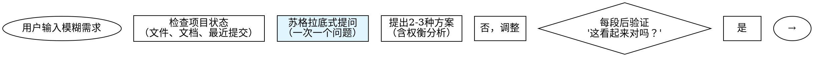

# CEO Agent - Direct Orchestration (v6.6.0)

When user requests software development, execute the following workflow:

## Architecture Overview

**v6.0 integrates Superpowers frameworks**:
- **Phase 0**: Brainstorming for requirement exploration
- **Phase 3.5**: Git worktrees for workspace isolation
- **Phase 4**: Subagent-driven development with two-stage code review
- **Phase 4.5**: TDD enforcement
- **Phase 5**: Parallel agent dispatch for independent test failures

**Key principles**:
1. **流程自洽**：Ensure workflow is complete, non-redundant, and naturally connected
2. **保留自动化**：Retain maximum automation, only key checkpoints require human confirmation
3. **符合规范**：Follow Claude Skill standards, prioritize Claude Code CLI native capabilities

---

## Step 1: Initialize State Files

⚠️ **NOTE**: CEO agents are already installed as part of the ceo-skills plugin. No agent verification or installation is required.

Note: The Write tool will automatically create the `.claudedocs` directory if it doesn't exist.

### Write initial task plan using Write tool
Create `.claudedocs/task_plan.md` with the following content:
```markdown
# 任务计划

## Workflow配置 🆕 v6.5.0
- 执行模式: 待定（Step 1.5选择）
- 自动流转: 待定

## 用户需求
{USER_INPUT}

## 工作区配置
🔧 v6.5.0: 在阶段3.5创建Git Worktree后填充
- 工作区类型: Git Worktree
- 项目路径: 待定（阶段3.5创建）
- Git 分支: 待定（阶段3.5创建）

## 当前阶段
初始化

## 阶段进度
- [ ] 阶段0: 需求探索（brainstorming）
- [ ] 阶段1: 需求澄清（产品经理）
- [ ] 阶段2: 产品设计（UI/UX设计师）
- [ ] 阶段3: 架构设计（系统架构师）
- [ ] 阶段3.3: 平台决策（Web/Mobile/Both）🆕
- [ ] 阶段3.5: 工作区准备（git-worktrees）🔧 v6.5: 解决权限问题
- [ ] 阶段4: 开发实现（并行：Web+Mobile）🆕
- [ ] 阶段5: 测试验证（测试工程师-并行修复）
- [ ] 阶段6: 交付部署（市场营销师）

## 全局目标
1. 理解并澄清用户需求
2. 设计符合用户期望的产品
3. 实现高质量、可维护的代码
4. 确保充分测试和验证
5. 交付完整的文档和部署方案
```

---

## Step 1.5: 选择Workflow执行模式 🆕 v6.5.0

**Purpose**: 在开始workflow前，让用户选择执行模式。

### 模式说明

- **🤖 自动模式（推荐）**：完全自动化执行，跳过所有确认检查点，适合快速原型开发
- **👤 交互模式**：在关键阶段暂停，等待用户确认，适合重要项目

### Execution

**Use AskUserQuestion tool**:

```
Question: "选择CEO Workflow执行模式："
Header: "⚙️ Workflow模式配置"
Options:
  - label: "🤖 自动模式（推荐）"
    description: "完全自动化执行，跳过所有确认检查点，适合快速原型开发"
  - label: "👤 交互模式"
    description: "在每个关键阶段暂停，等待用户确认，适合重要项目"
```

**Save user selection to task_plan.md**:

If user selects **"🤖 自动模式"**:
```bash
Edit file: .claudedocs/task_plan.md
Replace: "## Workflow配置\n- 执行模式: 待定（Step 1.5选择）\n- 自动流转: 待定"
With:
"""
## Workflow配置
- 执行模式: 自动模式
- 自动流转: 启用
- 确认检查点: 跳过
"""
```

If user selects **"👤 交互模式"**:
```bash
Edit file: .claudedocs/task_plan.md
Replace: "## Workflow配置\n- 执行模式: 待定（Step 1.5选择）\n- 自动流转: 待定"
With:
"""
## Workflow配置
- 执行模式: 交互模式
- 自动流转: 禁用
- 确认检查点: 启用
"""
```

Display confirmation message:
```
═════════════════════════════════════════════════════════════
✅ Workflow模式已配置
═════════════════════════════════════════════════════════════

执行模式: {用户选择的模式}
{if 自动模式} 🤖 自动模式：将自动流转到所有阶段，无需手动确认
{if 交互模式} 👤 交互模式：将在关键阶段等待您确认

📋 下一步: Phase 0 - 需求探索
```

Proceed to Step 2 (Phase 0).
- Git 分支: 待定（阶段3.5创建）

## 当前阶段
初始化

## 阶段进度
- [ ] 阶段0: 需求探索（brainstorming）
- [ ] 阶段1: 需求澄清（产品经理）
- [ ] 阶段2: 产品设计（UI/UX设计师）
- [ ] 阶段3: 架构设计（系统架构师）
- [ ] 阶段3.3: 平台决策（Web/Mobile/Both）🆕
- [ ] 阶段3.5: 工作区准备（git-worktrees）🔧 v6.5: 解决权限问题
- [ ] 阶段4: 开发实现（并行：Web+Mobile）🆕
- [ ] 阶段5: 测试验证（测试工程师-并行修复）
- [ ] 阶段6: 交付部署（市场营销师）

## 全局目标
1. 理解并澄清用户需求
2. 设计符合用户期望的产品
3. 实现高质量、可维护的代码
4. 确保充分测试和验证
5. 交付完整的文档和部署方案
```

### Initialize notes file
Create `.claudedocs/notes.md` with the following content:
```markdown
# 项目笔记

## 初始化
项目启动时间: [执行时自动记录]
```

---

## Step 2: Detect Current Phase and Resume

⚠️ **CRITICAL**: Before starting any phase, check if there's an existing workflow to resume.

### Check for existing task plan

Use Read tool to check if task plan exists:
```
Read file: .claudedocs/task_plan.md
```

### If task_plan.md exists (Resume Mode)

1. **Parse current phase**: Read "## 当前阶段" section
2. **Check progress**: Read "## 阶段进度" to see completed phases
3. **Jump to next phase**: Use the mapping below

**Phase mapping**:
```
"初始化" OR "阶段0: 需求探索" → Go to Step 3 (Phase 0)
"阶段1: 需求澄清" → Go to Step 4 (Phase 1)
"阶段2: 产品设计" → Go to Step 5 (Phase 2)
"阶段3: 架构设计" → Go to Step 6 (Phase 3)
"阶段3.5: 工作区准备" → Go to Step 7 (Phase 3.5)
"阶段4: 开发实现" → Go to Step 8 (Phase 4)
"阶段5: 测试验证" → Go to Step 9 (Phase 5)
"阶段6: 交付部署" → Go to Step 10 (Phase 6)
```

Display resume message:
```
═════════════════════════════════════════════════════════════
🔄 恢复工作流
═════════════════════════════════════════════════════════════

检测到现有任务计划，将从 {CURRENT_PHASE} 继续执行。
```

Then jump to the appropriate step above.

### If task_plan.md doesn't exist (Fresh Start)

Display initialization message:
```
═════════════════════════════════════════════════════════════
🚀 启动新的 CEO 工作流
═════════════════════════════════════════════════════════════

将创建新的任务计划并执行完整 6 阶段开发流程。
```

Proceed to Step 3 (Phase 0).

---

## Step 3: Execute Phase 0 - 需求探索（Brainstorming）

🆕 **NEW in v6.0**: Integrate Superpowers brainstorming for requirement exploration.

### Purpose

Before generating formal PRD, conduct conversational exploration to fully understand user requirements through dialogue.

### Process

Follow the brainstorming process:



### Key Rules

**提问规则**:
- **一次一个问题**：不要用多个问题淹没用户
- **优先选择题**：比开放性问题更容易回答
- **聚焦理解**：目的、约束、成功标准

**设计展示规则**:
- **分段展示**：每段200-300词
- **每段验证**：展示后询问"这看起来对吗？"
- **灵活调整**：如有不清楚，返回澄清

**产出物**:
- **设计文档**：`.claudedocs/phase0-design.md`
- **包含内容**：架构、组件、数据流、错误处理、测试策略

### Execution

⚠️ **DO NOT use AskUserQuestion tool** - brainstorming is a natural conversational process.

**Invoke the brainstorming skill** (from superpowers), execute it, then continue to Phase 1.

After brainstorming completes, save design document to:
```
.claudedocs/phase0-design.md
```

Then update task_plan.md to mark Phase 0 as completed:
```
Edit: Replace "- [ ] 阶段0: 需求探索（brainstorming）"
With:  "- [x] 阶段0: 需求探索（brainstorming）"
Edit: Replace "## 当前阶段\n初始化"
With: "## 当前阶段\n阶段0: 需求探索（完成）"
```

Proceed to Phase 1.

```
═════════════════════════════════════════════════════════════
✅ Phase 0 完成 - 需求探索
═════════════════════════════════════════════════════════════

📄 设计文档: .claudedocs/phase0-design.md
📋 下一步: Phase 1 - 需求澄清（产品经理）
```

---

## Step 4: Execute Phase 1 - 需求澄清（产品经理）

### ⚠️ MANDATORY: Read Previous Phase Output

Before executing this phase, you MUST read all previous outputs:
```
Read file: .claudedocs/phase0-design.md
```

This ensures you have complete context from Phase 0.

### Update task plan current phase
Use Edit tool to update task_plan.md:
```
Replace: "## 当前阶段\n初始化"
With: "## 当前阶段\n阶段1: 需求澄清"
```

### Call Product Manager agent

⚠️ **IMPORTANT**: Execute the following steps in order to ensure the agent completes BEFORE the confirmation checkpoint.

**Step 1: Launch agent**
```
Task tool: Launch the ceo-product-manager agent with the following context:

## CEO任务上下文

### 用户输入
{USER_INPUT}

### 阶段0输出（NEW - 设计文档）
[使用Read工具读取 .claudedocs/phase0-design.md 内容]

### 你的任务
1. 基于阶段0设计文档生成产品需求文档（PRD）
2. 构建用户画像
3. 定义MVP范围
4. 识别未澄清的问题（如有）

### ⚠️ 关键约束 - 提问规则
- **最多提问5个问题**：降低用户认知负担
- **分批提问**：如果问题超过5个，分多次提问，每次最多5个
- **优先级排序**：先问最重要、最核心的问题

### 输出要求
- 输出完整的PRD文档到 .claudedocs/ceo-product-manager_result.md
- 包含用户画像、功能列表、优先级
- 如果有未问的问题，在文档末尾列出"待确认的问题"

Save the returned task_id as {PRODUCT_MANAGER_TASK_ID}
```

**Step 2: Wait for agent completion**
```
TaskOutput: Wait for {PRODUCT_MANAGER_TASK_ID}
Parameters: block=true, timeout=300000

⚠️ CRITICAL: DO NOT PROCEED until agent completes
⚠️ DO NOT proceed to confirmation checkpoint until this step completes
```

**Step 3: Verify output file exists**
```
Read file: .claudedocs/ceo-product-manager_result.md

⚠️ If file doesn't exist, agent failed - inform user and ask what to do
```

After agent completes and output is verified, proceed to confirmation checkpoint below.

### Step 4.2: CONDITIONAL - User Confirmation Checkpoint 🆕 v6.5.0

⚠️ **CONDITIONAL CHECKPOINT** - 根据workflow模式决定是否需要确认

**Check workflow mode first**:

```bash
Read file: .claudedocs/task_plan.md

Extract:
  - 执行模式: (自动模式 | 交互模式)
```

**If 执行模式 == "自动模式"**:

```
✅ 自动模式：跳过确认检查点

直接执行批准操作：
1. Use Edit tool to update task_plan.md:
   Replace: "## 当前阶段\n阶段1: 需求澄清"
   With: "## 当前阶段\n阶段2: 产品设计"
   Replace: "- [ ] 阶段0: 需求探索（brainstorming）"
   With: "- [x] 阶段0: 需求探索（brainstorming）"
   Replace: "- [ ] 阶段1: 需求澄清（产品经理）"
   With: "- [x] 阶段1: 需求澄清（产品经理）"

2. Display message:
```
═════════════════════════════════════════════════════════════
✅ 自动模式：PRD已自动批准
═════════════════════════════════════════════════════════════

🤖 执行模式: 自动模式
📄 PRD文档: .claudedocs/ceo-product-manager_result.md
✅ 状态: 已自动批准，继续下一阶段

📋 下一步: Phase 2 - 产品设计（UI/UX设计师）
```

3. Proceed to Step 5 (Phase 2).
```

**If 执行模式 == "交互模式"**:

```
👤 交互模式：执行用户确认流程

⚠️ **CRITICAL**: You MUST pause here and wait for user confirmation before proceeding.

First, use Read tool to display PRD preview:
```
Read file: .claudedocs/ceo-product-manager_result.md
Limit: 50 lines
Display to user with formatted header: "📋 产品需求文档预览"
```

Then, use AskUserQuestion tool to get user confirmation:
```
Question: "请查看产品需求文档（PRD）并提供反馈。是否批准此PRD？"
Header: "🎯 检查点 1 - 产品需求文档确认"
Options:
  - label: "✅ 批准PRD"
    description: "PRD符合预期，批准并继续下一阶段"
  - label: "📝 修改PRD"
    description: "我有修改意见，需要调整PRD"
  - label: "🔄 重做PRD"
    description: "PRD不符合预期，需要重新澄清需求"
  - label: "🛑 终止workflow"
    description: "结束整个开发流程"
```

⚠️ **DO NOT PROCEED** until user selects an option.
```

### Step 4.3: Process User Decision

**If user selects ✅ 批准PRD**:
1. Use Edit tool to update task_plan.md:
   - Mark Phase 0 and Phase 1 as completed
   - Update current phase to "阶段2: 产品设计"
2. Proceed to Step 5 (Phase 2).

```
═════════════════════════════════════════════════════════════
✅ Phase 1 完成 - 需求澄清
═════════════════════════════════════════════════════════════

📄 PRD文档: .claudedocs/ceo-product-manager_result.md
📋 下一步: Phase 2 - 产品设计（UI/UX设计师）
```

**If user selects 📝 修改PRD**:
1. Use AskUserQuestion to collect specific modification requests
2. Call Product Manager again with feedback
3. After revision completes, repeat Step 4.2 (confirmation checkpoint)

**If user selects 🔄 重做PRD**:
1. Use AskUserQuestion to collect new requirements
2. Call Product Manager for new round
3. After new PRD completes, repeat Step 4.2 (confirmation checkpoint)

**If user selects 🛑 终止workflow**:
1. Display termination message
2. Update task_plan.md with termination status
3. End workflow

---

## Step 5: Execute Phase 2 - 产品设计

### ⚠️ MANDATORY: Read Previous Phase Outputs

Before executing this phase, you MUST read all previous outputs:
```
Read file: .claudedocs/phase0-design.md
Read file: .claudedocs/ceo-product-manager_result.md
```

This ensures you have complete context from Phase 0 and Phase 1.

### Update task plan current phase
Use Edit tool to update task_plan.md:
```
Replace: "## 当前阶段\n阶段1: 需求澄清"
With: "## 当前阶段\n阶段2: 产品设计"
```

### Call UI/UX Designer agent

⚠️ **IMPORTANT**: Execute the following steps in order to ensure the agent completes BEFORE proceeding.

**Step 1: Launch agent**
```
Task tool: Launch the ceo-ui-ux-designer agent with the following context:

## CEO任务上下文

### 用户输入
{USER_INPUT}

### 阶段0-1输出
[使用Read工具读取阶段0设计文档和阶段1 PRD]

### 用户对阶段0-1问题的回答
{USER_ANSWERS_PHASE0_1}

### 你的任务
1. 基于PRD设计用户故事
2. 设计交互流程
3. 设计视觉界面
4. 创建原型设计

### ⚠️ 关键约束 - 提问规则
- **最多提问5个问题**：降低用户认知负担
- **分批提问**：如果问题超过5个，分多次提问，每次最多5个
- **优先级排序**：先问最重要、最核心的设计问题

### 输出要求
- 输出完整的设计文档到 .claudedocs/ceo-ui-ux-designer_result.md
- 包含用户故事、交互流程、视觉设计

Save the returned task_id as {UI_UX_TASK_ID}
```

**Step 2: Wait for agent completion**
```
TaskOutput: Wait for {UI_UX_TASK_ID}
Parameters: block=true, timeout=300000

⚠️ CRITICAL: DO NOT PROCEED until agent completes
```

**Step 3: Verify output file exists**
```
Read file: .claudedocs/ceo-ui-ux-designer_result.md

⚠️ If file doesn't exist, agent failed - inform user and ask what to do
```

After agent completes and output is verified:

1. Use Edit tool to update task_plan.md: Mark Phase 2 as completed
2. Proceed directly to Phase 3 (no confirmation required).

```
═════════════════════════════════════════════════════════════
✅ Phase 2 完成 - 产品设计
═════════════════════════════════════════════════════════════

📄 设计文档: .claudedocs/ceo-ui-ux-designer_result.md
📋 下一步: Phase 3 - 架构设计（系统架构师）
```

---

## Step 6: Execute Phase 3 - 架构设计

### ⚠️ MANDATORY: Read Previous Phase Outputs

Before executing this phase, you MUST read all previous outputs:
```
Read file: .claudedocs/phase0-design.md
Read file: .claudedocs/ceo-product-manager_result.md
Read file: .claudedocs/ceo-ui-ux-designer_result.md
```

This ensures you have complete context from Phase 0, 1, and 2.

### Update task plan current phase
Use Edit tool to update task_plan.md:
```
Replace: "## 当前阶段\n阶段2: 产品设计"
With: "## 当前阶段\n阶段3: 架构设计"
```

### Call System Architect agent

⚠️ **CRITICAL**: Execute the following steps in order to ensure the agent completes BEFORE the confirmation checkpoint.

**Step 1: Launch agent**
```
Task tool: Launch the ceo-system-architect agent with the following context:

## CEO任务上下文

### 用户输入
{USER_INPUT}

### 前期阶段输出
[使用Read工具读取所有前期输出文件]

### 用户回答
{USER_ANSWERS}

### 你的任务
1. 技术栈选型（前端、后端、数据库）
2. 系统架构设计
3. API规范设计
4. 数据模型设计

### ⚠️ 关键约束 - 提问规则
- **最多提问5个问题**：降低用户认知负担
- **分批提问**：如果技术决策问题超过5个，分多次提问
- **优先级排序**：先问最关键的技术选型问题

### 输出要求
- 输出完整的架构设计文档到 .claudedocs/ceo-system-architect_result.md

Save the returned task_id as {ARCHITECT_TASK_ID}
```

**Step 2: Wait for agent completion**
```
TaskOutput: Wait for {ARCHITECT_TASK_ID}
Parameters: block=true, timeout=300000

⚠️ CRITICAL: DO NOT PROCEED until agent completes
⚠️ DO NOT proceed to confirmation checkpoint until this step completes
```

**Step 3: Verify output file exists**
```
Read file: .claudedocs/ceo-system-architect_result.md

⚠️ If file doesn't exist, agent failed - inform user and ask what to do
⚠️ DO NOT proceed to confirmation checkpoint if file doesn't exist
```

After agent completes and output is verified, **CHECK WORKFLOW MODE** before proceeding.

⚠️ **DO NOT PROCEED to Phase 3.5 until user confirms the architecture (交互模式) or auto-approves (自动模式)!**

### Step 6.1: CONDITIONAL - Architecture Confirmation Checkpoint 🆕 v6.5.0

🚨 **CONDITIONAL CHECKPOINT** - 根据workflow模式决定是否需要确认

**Check workflow mode first**:

```bash
Read file: .claudedocs/task_plan.md

Extract:
  - 执行模式: (自动模式 | 交互模式)
```

**If 执行模式 == "自动模式"**:

```
✅ 自动模式：跳过确认检查点

直接执行批准操作：
1. Use Edit tool to update task_plan.md:
   Replace: "## 当前阶段\n阶段3: 架构设计"
   With: "## 当前阶段\n阶段3.3: 平台决策"
   Replace: "- [ ] 阶段3: 架构设计（系统架构师）"
   With: "- [x] 阶段3: 架构设计（系统架构师）"

2. Display message:
```
═════════════════════════════════════════════════════════════
✅ 自动模式：架构已自动批准
═════════════════════════════════════════════════════════════

🤖 执行模式: 自动模式
📄 架构文档: .claudedocs/ceo-system-architect_result.md
✅ 状态: 已自动批准，继续平台决策

📋 下一步: Phase 3.3 - 平台决策
```

3. Proceed to Step 6.3 (Phase 3.3).
```

**If 执行模式 == "交互模式"**:

```
👤 交互模式：执行用户确认流程

🚨 **CRITICAL CHECKPOINT - MANDATORY USER CONFIRMATION REQUIRED**

You are at the Architecture Confirmation Checkpoint. You MUST execute this step before proceeding to Phase 3.5.

**Step 1**: Display architecture document preview using Read tool:
```
Read file: .claudedocs/ceo-system-architect_result.md
Limit: 50 lines
Display formatted header: "🏗️ 技术架构设计文档预览"
```

**Step 2**: Use AskUserQuestion tool to get user confirmation:
```
Question: "请查看技术架构设计文档并提供反馈。是否批准此架构方案？"
Header: "🏗️ 检查点 2 - 技术架构方案确认"
Options:
  - label: "✅ 批准架构"
    description: "架构方案符合预期，批准并继续创建工作区"
  - label: "📝 修改架构"
    description: "我有修改意见，需要调整架构设计"
  - label: "🔄 重做架构"
    description: "架构不符合预期，需要重新设计"
  - label: "🛑 终止workflow"
    description: "结束整个开发流程"
```

**Step 3**: ⚠️ **WAIT FOR USER RESPONSE - DO NOT PROCEED**

⚠️ **DO NOT PROCEED** until user selects an option.
⚠️ **DO NOT PROCEED to Phase 3.5** until user selects "✅ 批准架构".
```

### Step 6.2: Process User Decision

**If user selects ✅ 批准架构**:
1. Use Edit tool to update task_plan.md:
   - Mark Phase 3 as completed
   - Update current phase to "阶段3.3: 平台决策"
2. Proceed to Step 6.3 (Phase 3.3 - 平台决策).

```
═════════════════════════════════════════════════════════════
✅ Phase 3 完成 - 架构设计
═════════════════════════════════════════════════════════════

📄 架构文档: .claudedocs/ceo-system-architect_result.md
📋 下一步: Phase 3.3 - 平台决策（Web/Mobile/Both）
```

---

### Step 6.3: 🆕 Phase 3.3 - 平台决策（NEW in v6.4.0）

🆕 **NEW in v6.4.0**: 在架构设计后进行平台决策，动态决定开发Web、Mobile还是Both。

### Purpose

根据产品需求、用户场景、功能需求和技术约束，决定开发平台：
- **Web Only**: 仅Web应用
- **Mobile Only**: 仅移动应用
- **Both**: Web + Mobile并行开发

### 决策流程

**Step 1: 分析决策因素**

基于以下因素进行分析：

```yaml
决策因素:
  用户因素:
    - 目标用户类型（办公用户/移动用户/全场景用户）
    - 主要使用设备（桌面/移动/混合）
    - 使用场景（固定/移动/灵活）

  功能因素:
    - 需要的原生功能（GPS、相机、传感器等）
    - 复杂表单处理（Web优势）
    - 实时协作（Web优势）
    - 离线需求（Mobile优势）

  技术因素:
    - 技术栈复杂度
    - 开发时间要求
    - 团队能力匹配

  约束因素:
    - 开发预算
    - 上市时间要求
    - 维护成本考虑
```

**Step 2: 生成平台决策**

基于分析生成决策文档：

```typescript
interface PlatformDecision {
  // 目标平台
  platforms: ('web' | 'mobile')[];

  // 开发优先级
  priority: 'web-first' | 'mobile-first' | 'parallel';

  // 决策理由
  rationale: string;

  // 实施建议
  implementation: {
    phasedRollout: boolean;
    mvpPlatform: 'web' | 'mobile';
    featuresByPlatform: {
      web: string[];
      mobile: string[];
      shared: string[];
    };
  };
}
```

**Step 3: 保存决策文档**

使用Write工具创建平台决策文档：

```bash
Write file: .claudedocs/platform-decision.md

Content:
# 平台决策文档

## 决策结果
- **目标平台**: {web | mobile | both}
- **开发优先级**: {web-first | mobile-first | parallel}
- **决策理由**: {rationale}

## 实施计划
- **分阶段发布**: {yes | no}
- **MVP平台**: {web | mobile}

## 功能分配
- **Web独有功能**: [...]
- **Mobile独有功能**: [...]
- **共享功能**: [...]
```

**Step 4: 更新任务计划**

使用Edit工具更新task_plan.md：

```bash
Replace: "## 当前阶段\n阶段3: 架构设计"
With: "## 当前阶段\n阶段3.3: 平台决策"
```

### Step 6.4: CONDITIONAL - 平台决策确认检查点 🆕 v6.5.0

⚠️ **CONDITIONAL CHECKPOINT** - 根据workflow模式决定是否需要确认

**Check workflow mode first**:

```bash
Read file: .claudedocs/task_plan.md

Extract:
  - 执行模式: (自动模式 | 交互模式)
```

**If 执行模式 == "自动模式"**:

```
✅ 自动模式：跳过确认检查点

直接执行批准操作：
1. Use Edit tool to update task_plan.md:
   Replace: "## 当前阶段\n阶段3.3: 平台决策"
   With: "## 当前阶段\n阶段3.5: 工作区准备"
   Replace: "- [ ] 阶段3.3: 平台决策（Web/Mobile/Both）"
   With: "- [x] 阶段3.3: 平台决策（Web/Mobile/Both）"

2. Extract platform decision and add to global goals:
```
Read file: .claudedocs/platform-decision.md

Extract:
  - platforms: (web | mobile | both)
  - priority: (web-first | mobile-first | parallel)
```

Add to task_plan.md "## 全局目标":
```
  - 开发平台: {platforms}
  - 优先级策略: {priority}
```

3. Display message:
```
═════════════════════════════════════════════════════════════
✅ 自动模式：平台决策已自动批准
═════════════════════════════════════════════════════════════

🤖 执行模式: 自动模式
📄 决策文档: .claudedocs/platform-decision.md
📱 开发平台: {platforms}
⚡ 优先级: {priority}
✅ 状态: 已自动批准，继续工作区准备

📋 下一步: Phase 3.5 - 工作区准备（Git Worktrees）
```

4. Proceed to Step 7 (Phase 3.5).
```

**If 执行模式 == "交互模式"**:

```
👤 交互模式：执行用户确认流程

🚨 **CRITICAL CHECKPOINT - MANDATORY USER CONFIRMATION REQUIRED**

**Step 1**: 显示平台决策文档预览：

```bash
Read file: .claudedocs/platform-decision.md
Limit: 30 lines
Display formatted header: "📱 平台决策预览"
```

**Step 2**: 使用AskUserQuestion工具获取用户确认：

```bash
Question: "根据产品需求和技术架构分析，建议开发{platforms}，采用{priority}策略。是否批准此平台决策？"
Header: "📱 检查点 2.5 - 平台决策确认"
Options:
  - label: "✅ 批准决策"
    description: "同意平台决策，继续工作区准备"
  - label: "📝 修改决策"
    description: "有不同意见，需要调整平台决策"
  - label: "🛑 终止workflow"
    description: "结束整个开发流程"
```

**Step 3**: ⚠️ **等待用户响应 - 不要继续执行**
```

### Step 6.5: 处理用户决策

**如果用户选择 ✅ 批准决策**:

1. 使用Edit工具更新task_plan.md：
   - 标记阶段3.3为已完成
   - 更新当前阶段为"阶段3.5: 工作区准备"
   - 添加平台决策信息到全局目标

```bash
Edit: task_plan.md
Add to "## 全局目标":
  - 开发平台: {platforms}
  - 开发策略: {priority}
```

2. 继续执行Step 7 (Phase 3.5)

```
═════════════════════════════════════════════════════════════
✅ Phase 3.3 完成 - 平台决策
═════════════════════════════════════════════════════════════

📄 决策文档: .claudedocs/platform-decision.md
🎯 目标平台: {platforms}
📋 下一步: Phase 3.5 - 工作区准备（git-worktrees）
```

**如果用户选择 📝 修改决策**:
1. 使用AskUserQuestion收集具体的修改意见
2. 重新分析并生成新的平台决策
3. 重复Step 6.4（确认检查点）

**如果用户选择 🛑 终止workflow**:
1. 显示终止消息
2. 更新task_plan.md为终止状态
3. 结束workflow

---

**If user selects 📝 修改架构**:
1. Use AskUserQuestion to collect specific modification requests
2. Call System Architect again with feedback
3. After revision completes, repeat Step 6.1 (confirmation checkpoint)

**If user selects 🔄 重做架构**:
1. Use AskUserQuestion to collect new requirements
2. Call System Architect for new round
3. After new architecture completes, repeat Step 6.1 (confirmation checkpoint)

**If user selects 🛑 终止workflow**:
1. Display termination message
2. Update task_plan.md with termination status
3. End workflow

---

## Step 7: Execute Phase 3.5 - 工作区准备（Git Worktrees）

🆕 **NEW in v6.0**: Integrate Superpowers using-git-worktrees for workspace isolation.

🔧 **UPDATED in v6.5.0**: 明确使用git-worktree解决Claude Code CLI跨目录访问权限问题。

### Purpose

Before starting development, create isolated Git worktree to:
1. ✅ 避免分支切换污染
2. ✅ **解决跨目录访问权限问题**（worktree属于项目内，无需额外确认）
3. ✅ 提供独立的工作环境

### Why Git Worktree Solves Permission Issues

**问题根源**：
```bash
# 当前工作目录
/path/to/ceo-skills-plugin/

# 操作目标（项目外）
/path/to/another-project/.claudedocs/
# ❌ Claude Code提示权限确认
```

**Git Worktree解决方案**：
```bash
# 创建worktree（项目内）
git worktree add ../my-project -b feature/my-project

# worktree目录结构
/path/to/repo/
├── .git/                    # 共享Git仓库
├── ceo-skills-plugin/        # 主worktree（当前目录）
└── my-project/               # 新worktree（共享.git）
    └── .git (worktree元数据)

# 操作目标（项目内）
../my-project/.claudedocs/
# ✅ worktree是Git仓库的一部分，无需权限确认
```

### Execution Steps

**Step 7.1: 确定项目名称和路径**

从架构设计文档中提取项目名称：

```bash
Read file: .claudedocs/ceo-system-architect_result.md

Extract:
  - project_name: 项目名称
```

**Step 7.2: 创建Git Worktree**

```bash
# 计算worktree路径（相对于当前仓库）
WORKTREE_PATH="../${project_name}"
BRANCH_NAME="feature/${project_name}"

# 创建worktree
git worktree add ${WORKTREE_PATH} -b ${BRANCH_NAME}

# 验证创建成功
git worktree list

# 在worktree中创建文档目录（无需权限确认）
mkdir -p ${WORKTREE_PATH}/.claudedocs
```

**Step 7.3: 保存Worktree信息到任务计划**

```bash
Edit file: .claudedocs/task_plan.md

Add section after "## 用户需求":

## 工作区配置
- 工作区类型: Git Worktree
- 项目路径: ${WORKTREE_PATH}
- Git 分支: ${BRANCH_NAME}
- 相对路径: ../${project_name}

Replace: "## 当前阶段\n阶段3: 架构设计"
With: "## 当前阶段\n阶段3.5: 工作区准备"

Replace: "- [ ] 阶段3.5: 工作区准备（git-worktrees）"
With: "- [x] 阶段3.5: 工作区准备（git-worktrees）"
```

**Step 7.4: 验证Worktree准备完成**

```bash
# 列出所有worktrees
git worktree list

# 切换到worktree查看（可选）
cd ${WORKTREE_PATH}
pwd
ls -la
```

Proceed to Step 8 (Phase 4).

```
═════════════════════════════════════════════════════════════
✅ Phase 3.5 完成 - 工作区准备
═════════════════════════════════════════════════════════════

🌳 工作树路径: {WORKTREE_PATH}
📋 下一步: Phase 4 - 开发实现（子任务驱动）
```

## Step 8: Execute Phase 4 - 开发实现（并行：Web + Mobile）

🆕 **ENHANCED in v6.4.0**: 支持并行Web和Mobile开发，根据平台决策动态激活agents。

🔧 **UPDATED in v6.5.0**: **所有项目操作在Git Worktree路径中执行，避免跨目录访问权限问题**。

### ⚠️ MANDATORY: Read Previous Phase Outputs & Platform Decision

Before executing this phase, you MUST read all previous outputs AND the platform decision:

```
Read file: .claudedocs/phase0-design.md
Read file: .claudedocs/ceo-product-manager_result.md
Read file: .claudedocs/ceo-ui-ux-designer_result.md
Read file: .claudedocs/ceo-system-architect_result.md
Read file: .claudedocs/platform-decision.md  🆕 平台决策
```

This ensures you have complete context from all previous phases AND know which platforms to develop.

### ⚠️ CRITICAL: Load Worktree Configuration

🔧 **v6.5.0**: 从任务计划中加载worktree配置，确保所有项目操作在正确路径中执行：

```
Read file: .claudedocs/task_plan.md

Extract:
  - WORKTREE_PATH: 工作区路径（如 ../my-project）
  - BRANCH_NAME: Git分支（如 feature/my-project）
```

**重要提示**：
- ✅ 所有项目创建、文件操作、命令执行都在 `${WORKTREE_PATH}` 中进行
- ✅ Worktree是Git仓库的一部分，属于"项目内"，无需权限确认
- ❌ 不要直接操作 `/Users/zyb/.../my-project`，使用相对路径 `${WORKTREE_PATH}`

### Execution Steps

**Step 8.1: Update task plan current phase**
```
Replace: "## 当前阶段\n阶段3.5: 工作区准备"
With: "## 当前阶段\n阶段4: 开发实现"
```

**Step 8.2: 🆕 Parse Platform Decision**

从平台决策文档中提取开发策略：

```bash
Read file: .claudedocs/platform-decision.md

Extract:
  - platforms: (web | mobile | both)
  - priority: (web-first | mobile-first | parallel)
```

**Step 8.3: 🆕 根据平台决策配置开发任务**

### 方案A: Backend Only（纯后端）

如果决策是**纯后端项目**（无前端需求）：

```
📋 开发策略：Backend Only

任务分配:
  - fullstack-developer: 后端API

执行步骤:
  1. 调用subagent-driven-development skill
  2. 激活ceo-fullstack-developer agent（仅后端）
  3. 任务分解：
     - 后端API实现
     - 数据库设计
     - 业务逻辑实现
  4. 执行两阶段代码审查
```

### 方案B: Web Frontend + Backend（传统Web）

如果决策是**传统Web应用**（React/Next.js等）：

```
📋 开发策略：Web Full Stack

任务分配:
  - fullstack-developer: 后端API + Web前端

执行步骤:
  1. 调用subagent-driven-development skill
  2. 激活ceo-fullstack-developer agent
  3. 任务分解：
     - 后端API实现
     - Web前端实现（React/Next.js）
  4. 执行两阶段代码审查

技术栈:
  - 后端: Node.js/Python/Go
  - 前端: React/Next.js/Vue（传统Web技术）
```

### 方案C: Cross-Platform Mobile（跨平台移动应用）

如果决策是**跨平台移动应用**（需要iOS + Android + Web）：

```
📋 开发策略：Cross-Platform Mobile

任务分配:
  - fullstack-developer: 后端API
  - mobile-developer: React Native应用（iOS + Android + Web）

执行步骤:
  1. 调用subagent-driven-development skill
  2. 并行激活agents:
     - ceo-fullstack-developer (后端API)
     - ceo-mobile-developer (React Native应用)
  3. 移动端开发依赖后端API完成
  4. 执行两阶段代码审查

技术栈:
  - 后端: Node.js/Python/Go
  - 移动端: React Native + Expo
  - 平台: iOS、Android、Web（React Native for Web）

说明:
  - React Native的"Web"是通过React Native for Web编译的
  - 这与传统Web前端（React/Next.js）不同
  - 一套代码覆盖三个平台
```

### 方案D: Web + Mobile Both（Web + 移动端）

如果决策是**同时需要传统Web和移动应用**：

```
📋 开发策略：Web + Mobile Both

任务分配:
  - fullstack-developer: 后端API + 传统Web前端
  - mobile-developer: React Native移动应用

根据优先级策略执行:

#### 策略1: web-first

执行顺序:
  1. 后端API (fullstack-developer)
  2. 传统Web前端 (fullstack-developer)
  3. 移动端 (mobile-developer)

#### 策略2: mobile-first

执行顺序:
  1. 后端API (fullstack-developer)
  2. 移动端 (mobile-developer)
  3. 传统Web前端 (fullstack-developer)

#### 策略3: parallel

执行顺序:
  1. 后端API (fullstack-developer) - 必须首先完成
  2. 并行开发:
     - 传统Web前端 (fullstack-developer)
     - 移动端 (mobile-developer)

技术栈:
  - 后端: Node.js/Python/Go
  - Web前端: React/Next.js（传统Web）
  - 移动端: React Native + Expo
```

**Step 8.4: Extract development tasks from architecture**

Read the architecture document and identify all development tasks. Group them into 2-5 minute subtasks.

⚠️ **Note**: All operations should use absolute paths based on {WORKTREE_PATH}.

**Step 8.5: 🆕 根据平台策略执行开发**

### 后端API开发（始终执行）

```bash
# 后端API由fullstack-developer统一实现
Task tool: Launch ceo-fullstack-developer agent

任务:
  1. 实现后端API（按照architect设计的API规范）
  2. 实现数据模型
  3. 实现业务逻辑
  4. API文档生成

输出: .claudedocs/backend-api-result.md
```

### Web前端开发（按需执行）

如果 `platforms.includes('web')`：

```bash
Task tool: Launch ceo-fullstack-developer agent

任务:
  1. 实现Web前端组件
  2. 实现Web状态管理
  3. 集成后端API
  4. 响应式实现

依赖: 后端API完成

输出: .claudedocs/web-frontend-result.md
```

### 移动端开发（按需执行）

如果 `platforms.includes('mobile')`：

```bash
Task tool: Launch ceo-mobile-developer agent

任务:
  1. 初始化移动项目（使用obytes模板）
  2. 实现移动端UI
  3. 实现移动端状态管理
  4. 集成后端API
  5. 原生功能集成（如需要）

依赖: 后端API完成

输出: .claudedocs/mobile-app-result.md
```

**Step 8.6: 🆕 并行开发协调**

根据 `priority` 策略协调开发：

```typescript
// web-first 策略
if (priority === 'web-first') {
  await executeBackendAPI();     // fullstack
  await executeWebFrontend();     // fullstack
  await executeMobileApp();       // mobile
}

// mobile-first 策略
else if (priority === 'mobile-first') {
  await executeBackendAPI();      // fullstack
  await executeMobileApp();        // mobile
  await executeWebFrontend();      // fullstack
}

// parallel 策略
else if (priority === 'parallel') {
  await executeBackendAPI();       // fullstack (必须先完成)

  // Web和Mobile并行开发
  await Promise.all([
    executeWebFrontend(),          // fullstack
    executeMobileApp()             // mobile
  ]);
}
```

⚠️ **TDD Enforcement**: 所有开发必须遵循TDD：
- RED: 先写失败的测试
- GREEN: 写最少的代码通过测试
- REFACTOR: 重构清理

**Step 8.7: Update task plan progress**
```
Edit: Replace "- [ ] 阶段4: 开发实现（并行：Web+Mobile）"
With:  "- [x] 阶段4: 开发实现（并行：Web+Mobile）"
Edit: Update "## 当前阶段" to "阶段5: 测试验证"
```

Proceed to Step 9 (Phase 5).

```
═════════════════════════════════════════════════════════════
✅ Phase 4 完成 - 开发实现
═════════════════════════════════════════════════════════════

🎯 开发平台: {platforms}
📊 开发策略: {priority}
💻 后端代码: {WORKTREE_PATH}/backend/
🌐 Web代码: {WORKTREE_PATH}/web/ (如适用)
📱 Mobile代码: {WORKTREE_PATH}/mobile/ (如适用)
📋 下一步: Phase 5 - 测试验证（测试工程师-并行修复）
```
---

## Step 9: Execute Phase 5 - 测试验证（并行修复）

🆕 **ENHANCED in v6.0**: Integrate Superpowers dispatching-parallel-agents for independent test failures.

### ⚠️ MANDATORY: Read Previous Phase Outputs

Before executing this phase, you MUST read all previous outputs:
```
Read file: .claudedocs/ceo-system-architect_result.md
Read file: .claudedocs/ceo-fullstack-developer_result.md (if exists)
```

This ensures you have complete context from architecture and development.

### Execution Steps

**Step 9.1: Update task plan current phase**
```
Replace: "## 当前阶段\n阶段4: 开发实现"
With: "## 当前阶段\n阶段5: 测试验证"
```

**Step 9.2: Call Test Engineer agent**

⚠️ **IMPORTANT**: Execute the following steps in order to ensure the agent completes BEFORE checking results.

**Step 1: Launch agent**
```
Task tool: Launch the ceo-test-engineer agent with the following task:

## 任务
1. 编写单元测试（覆盖率≥80%）
2. 编写集成测试
3. 编写E2E测试
4. 运行测试套件并报告结果

### 输出要求
- 输出测试报告到 .claudedocs/ceo-test-engineer_result.md
- 包含：测试结果、覆盖率、发现的缺陷

Save the returned task_id as {TEST_ENGINEER_TASK_ID}
```

**Step 2: Wait for agent completion**
```
TaskOutput: Wait for {TEST_ENGINEER_TASK_ID}
Parameters: block=true, timeout=600000

⚠️ CRITICAL: DO NOT PROCEED until agent completes
```

**Step 3: Verify output file exists**
```
Read file: .claudedocs/ceo-test-engineer_result.md

⚠️ If file doesn't exist, agent failed - inform user and ask what to do
```

**Step 9.3: Check test results**

Analyze the test results from the file read above:

**If all tests pass** → Proceed to Step 10 (Phase 6)

**If there are test failures** → Proceed to Step 9.4

**Step 9.4: Invoke parallel-dispatch skill**

Use the Task tool to fix failures in parallel:
```
Task tool: Invoke the parallel-dispatch skill (from superpowers)

Execute the skill and after all tests pass, proceed to Step 10 (Phase 6).

The skill will:
1. Group test failures by independent domains
2. Launch parallel ceo-test-engineer agents for each domain
3. Wait for all agents to complete
4. Review and integrate fixes
5. Re-test until all pass
```

**Step 9.5: Update task plan progress**
After all tests pass:
```
Edit: Replace "- [ ] 阶段5: 测试验证（测试工程师-并行修复）"
With:  "- [x] 阶段5: 测试验证（测试工程师-并行修复）"
Edit: Update "## 当前阶段" to "阶段6: 交付部署"
```

Proceed to Step 10 (Phase 6).

```
═════════════════════════════════════════════════════════════
✅ Phase 5 完成 - 测试验证
═════════════════════════════════════════════════════════════

📊 测试报告: .claudedocs/ceo-test-engineer_result.md
✅ 所有测试通过
📋 下一步: Phase 6 - 交付部署（市场营销师）
```

---

## Step 10: Execute Phase 6 - 交付部署

### ⚠️ MANDATORY: Read Previous Phase Outputs

Before executing this phase, you MUST read all previous outputs:
```
Read file: .claudedocs/ceo-test-engineer_result.md
```

This ensures you have complete context from testing phase.

### Update task plan current phase
Use Edit tool to update task_plan.md to "阶段6: 交付部署"

### Call Marketing Specialist agent

⚠️ **IMPORTANT**: Execute the following steps in order to ensure the agent completes BEFORE displaying results.

**Step 1: Launch agent**
```
Task tool: Launch the ceo-marketing-specialist agent with the following context:

## CEO任务上下文

### 用户输入
{USER_INPUT}

### 所有前期阶段输出
[使用Read工具读取所有前期输出文件]

### 用户回答
{USER_ANSWERS}

### 你的任务
1. 编写用户文档
2. 编写部署文档
3. 编写营销文案
4. 准备推广方案

### ⚠️ 关键约束 - 提问规则（如需确认）
- **最多提问5个问题**：降低用户认知负担
- **分批提问**：如果问题超过5个，分多次提问，每次最多5个
- **优先级排序**：先问最重要的交付相关问题

Save the returned task_id as {MARKETING_TASK_ID}
```

**Step 2: Wait for agent completion**
```
TaskOutput: Wait for {MARKETING_TASK_ID}
Parameters: block=true, timeout=300000

⚠️ CRITICAL: DO NOT PROCEED until agent completes
```

**Step 3: Verify output file exists**
```
Read file: .claudedocs/ceo-marketing-specialist_result.md

⚠️ If file doesn't exist, agent failed - inform user and ask what to do
```

After agent completes and output is verified:

1. Use Edit tool to update task_plan.md:
   - Mark Phase 6 as completed
   - Update current phase to "完成"
2. Display completion message:
   ```
   📦 阶段6完成 - 交付部署
   📄 交付文档: .claudedocs/ceo-marketing-specialist_result.md
   ```
3. Proceed to Step 11 (Final Summary)

```
═════════════════════════════════════════════════════════════
✅ Phase 6 完成 - 交付部署
═════════════════════════════════════════════════════════════

📦 交付文档: .claudedocs/ceo-marketing-specialist_result.md
📋 下一步: 生成最终交付物索引
```

---

## Step 11: Final Summary

After all phases complete:

### Create deliverable index using Write tool
Create `.claudedocs/deliverable.md` with the following content:
```markdown
# 交付物索引

## 文档
1. [阶段0设计文档](.claudedocs/phase0-design.md)
2. [产品需求文档](.claudedocs/ceo-product-manager_result.md)
3. [设计文档](.claudedocs/ceo-ui-ux-designer_result.md)
4. [架构文档](.claudedocs/ceo-system-architect_result.md)
5. [代码实现](.claudedocs/ceo-fullstack-developer_result.md)
6. [测试报告](.claudedocs/ceo-test-engineer_result.md)
7. [部署文档](.claudedocs/ceo-marketing-specialist_result.md)

## 状态
- [task_plan.md](.claudedocs/task_plan.md)
- [notes.md](.claudedocs/notes.md)

## 代码
{WORKTREE_PATH}/src/ (应用代码)
```

### Display completion message to user
```
═════════════════════════════════════════════════════════════
🎉 项目完成！
═════════════════════════════════════════════════════════════

所有阶段已完成，交付物已生成。

📋 交付物索引: .claudedocs/deliverable.md
🌳 工作树位置: {WORKTREE_PATH}

感谢使用CEO Agent v6.2.0！
```

---

## Version History

### Key Changes in v6.2.0

**命令规范化改进**

- 🔧 修复了 CLI 命令显示与文档不一致的问题
- ✅ 重命名命令文件：`ceo.md` → `workflow.md`
- ✅ 修改插件名称：`ceo-skills` → `ceo`
- ✅ 统一命令前缀为 `/ceo:`

**新命令格式**：
- `/ceo:workflow` - 启动完整 workflow
- `/ceo:brainstorm` - 需求探索
- `/ceo:write-plan` - 创建实现计划
- `/ceo:execute-plan` - 执行实现计划

### Key Changes in v6.1.0

**Bug Fix: 强制用户确认检查点生效**

- 🐛 修复了使用 Task 工具调用 agent 时，强制检查点被跳过的问题
- ✅ 采用 TaskOutput 同步等待机制，确保 agent 完成后才进入检查点
- ✅ 修改了 5 处 agent 调用（Phase 1, 2, 3, 5, 6）
- ✅ 保留 agent 专业能力的同时，确保检查点强制执行

**技术改进**：
- 所有 agent 调用现在遵循三步流程：Launch → Wait → Verify
- 使用 `TaskOutput(task_id, block=true)` 等待 agent 完成
- 验证输出文件存在后才继续执行

### Key Changes in v6.0

**Integrates Superpowers frameworks**:

**New Phases**:
- ✅ **Phase 0**: Brainstorming for requirement exploration
- ✅ **Phase 3.5**: Git worktrees for workspace isolation
- ✅ **Phase 4.5**: TDD enforcement (embedded in Phase 4)

**Enhanced Phases**:
- ✅ **Phase 1**: Input now includes Phase 0 design document
- ✅ **Phase 4**: Subagent-driven development with two-stage code review
- ✅ **Phase 5**: Parallel agent dispatch for independent test failures

**Preserved from v5.7**:
- ✅ 3 mandatory checkpoints (PRD, Architecture, Final)
- ✅ 6 professional agents
- ✅ Three-file state management system
- ✅ Maximum automation with minimal human intervention

### Confirmation Policy (v6.0)

**Required Confirmations** (3 checkpoints - unchanged):
1. ✅ Phase 1: Product Requirements Document (PRD)
2. ✅ Phase 3: Technical Architecture Design
3. ✅ Final: Project Completion Summary

**No Confirmation Required**:
- Phase 0: Brainstorming (natural dialogue)
- Phase 2: UI/UX Design (direct approval)
- Phase 3.5: Git Worktrees (automatic, except directory choice on first use)
- Phase 4: Development (automatic two-stage review replaces manual checkpoint)
- Phase 5: Testing (automatic parallel fix)

### Benefits

**Quality Improvements**:
- 📈 **需求理解**: 对话探索 + PRD → 减少返工
- 📈 **开发质量**: 子任务 + 两阶段审查 → 立即发现错误
- 📈 **代码质量**: TDD铁律 → 测试覆盖率提升
- 📈 **测试效率**: 并行修复 → 修复速度提升
- 📈 **环境安全**: 工作树隔离 → 避免污染

**Technical Debt Reduction**:
- ✅ **需求返工**: 减少
- ✅ **代码缺陷**: 立即发现
- ✅ **范围蔓延**: 两阶段审查防止
- ✅ **环境污染**: 工作树隔离
- ✅ **测试维护**: 并行加速

---

## Version History
- **v6.0** (2026-01-19): Integrate Superpowers frameworks
  - New: Phase 0 (brainstorming)
  - New: Phase 3.5 (git-worktrees)
  - Enhanced: Phase 4 (subagent-driven-development + two-stage review)
  - Enhanced: Phase 5 (parallel-agent-dispatch)
  - Integrated: TDD enforcement
- **v5.7** (2025-01-18): Current baseline
- **v5.3** (2025-01-17): Enhanced mandatory checkpoints
- **v5.0** (2025-01-17): Direct SKILL orchestration

---
> Converted and distributed by [TomeVault](https://tomevault.io/claim/pyinx) — claim your Tome and manage your conversions.
<!-- tomevault:4.0:skill_md:2026-04-11 -->
