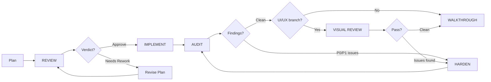

// turbo-all

# Codex Plan Collaboration

This skill defines how agents collaborate on **build plans** and **code reviews** in `.codex/plan/`. Plans are ephemeral documents shared between agents (Opus, Codex) for coordinating multi-agent work.

## Agent Identity

| Agent | Role | Platform |
|-------|------|----------|
| **Opus** | Primary development agent | Claude (Anthropic) via Antigravity |
| **Codex** | Review, hardening, implementation partner | OpenAI Codex |

## Collaboration Workflow



## Modes (5 total)

| Mode | Purpose | Input | Output | Makes Code Changes? |
|------|---------|-------|--------|---------------------|
| `REVIEW` | Evaluate a plan/design | Plan document | Verdict + suggestions | No |
| `IMPLEMENT` | Build from approved plan | Approved plan | Status + code changes | Yes |
| `AUDIT` | Review implemented code | Code files + verification | Rated findings (P0-P3) | No |
| `HARDEN` | Apply fixes from audit | Audit response | Changes + re-verification | Yes |
| `VISUAL REVIEW` | Agentic screenshot-driven UI verification | Running app | Screenshots + findings | No (triggers HARDEN if issues) |

**Key distinctions:**
- REVIEW = plan/design quality (pre-implementation). AUDIT = code quality (post-implementation).
- VISUAL REVIEW = **mandatory** for any branch touching UI/UX. Must happen **after** AUDIT/HARDEN closure and **before** WALKTHROUGH.

> [!CAUTION]
> **VISUAL REVIEW is executed by ux-visual-reviewer infrastructure.** CC agents (both Opus and Codex) must NEVER perform visual/UX testing directly. Instead, use the `visual-review` skill (`.agent/skills/visual-review/SKILL.md`) to call the MCP API via curl. CC Codex's role is strictly **implementation** (CSS, HTML, TypeScript) — never visual inspection, browser launches, or screenshot-based testing. See `.agent/skills/visual-review/SKILL.md` for exact curl commands.

---

## File Naming Contract

All files in `.codex/plan/` follow this path and naming pattern:

```
.codex/plan/{branch-name}/{mode}/{topic}-{mode}-{round}-{type}.md

type  = request | response
round = r1, r2, r3...
mode  = debate | review | implement | audit | harden | walkthrough
```

**Examples:**
```
phase-2-review-r1-request.md      → Opus asks Codex to review Phase 2 plan
phase-2-review-r1-response.md     → Codex responds with verdict
phase-2-audit-r1-request.md       → Opus asks Codex to audit implementation
phase-2-audit-r1-response.md      → Codex responds with P0-P3 findings
phase-2-harden-r1-request.md      → Opus asks Codex to apply P0+P1 fixes
phase-2-harden-r1-response.md     → Codex reports what it fixed + verification
```

**State is implicit from file existence:**

| Files Present | Implied State |
|--------------|---------------|
| `*-request.md` only | Waiting for response |
| `*-request.md` + `*-response.md` | Responded, waiting for next agent |
| No request file | Not started / closed |

---

## Front-Matter Contract

Every request and response file starts with:

**Required (5 lines):**
```markdown
<!-- Created: YYYY-MM-DD | Expires: YYYY-MM-DD -->
<!-- MODE: REVIEW|IMPLEMENT|AUDIT|HARDEN -->
<!-- IN-REPLY-TO: filename.md | none -->
<!-- ROUND: N -->
<!-- LAST-AGENT: Opus|Codex -->
```

**Optional (when needed):**
```markdown
<!-- VERIFY: TARGETED|FULL -->
```

### ROUND counter rules

- **ROUND** is a cumulative counter across the **entire topic branch**, not per-mode. It does NOT reset when switching from REVIEW → IMPLEMENT → AUDIT → HARDEN.
- Every new file in the branch increments the counter by 1 (both requests and responses count).
- **LAST-AGENT** is always the agent (or user) who created the file, making it immediately clear who acted last.

**Example sequence:**

| File | ROUND | LAST-AGENT |
|------|-------|------------|
| `phase-5-review-r1-request.md` | 1 | Opus |
| `phase-5-review-r1-response.md` | 2 | Codex |
| `phase-5-review-r2-request.md` | 3 | Opus |
| `phase-5-review-r2-response.md` | 4 | Codex |
| `phase-5-implement-r1-request.md` | 5 | Opus |
| `phase-5-implement-r1-response.md` | 6 | Codex |
| `phase-5-audit-r1-request.md` | 7 | Codex |
| `phase-5-audit-r1-response.md` | 8 | Opus |

This way the user can glance at any file and immediately know: (a) how deep into the conversation it is, and (b) who wrote it.

---

## Request Format

### Required Sections

```markdown
## Objective
[What you want the other agent to do — be specific]

## Repos
| Repo | Path | Branch | Role |
|------|------|--------|------|
| command-center | ~/Developer/Antigravity Apps/command-center | feature/xyz | Server-side (Node/TS) |
| command-center-mobile | ~/Developer/Antigravity Apps/command-center-mobile | main | Swift client |

## Scope
| File | What to Check |
|------|---------------|
| `path/to/file.swift` | State management, thread safety |
| `path/to/other.ts` | Error handling, edge cases |

## Verification
[Exact commands the responder should run]
```

### Optional Sections
- `## Out of Scope` — What to explicitly skip
- `## Context` — Links to related plans/reviews

> **Canonical templates:** See `.agent/templates/collab/` for ready-to-copy examples.

---

## Response Format

### Required Sections

```markdown
## Verdict
[One of: ✅ APPROVE | ⚠️ APPROVE WITH SUGGESTIONS | ❌ NEEDS REWORK]

## Findings
[Grouped by priority]

### P0 — Must Fix (blocks ship)
- **What:** [specific issue]
- **Where:** [file:line or function]
- **Why:** [impact]
- **Fix:** [concrete suggestion]

### P1 — Should Fix (quality risk)
...

### P2 — Nice to Have (improvement)
...

### P3 — Nitpick (style/convention)
...

## Changes Applied
[If mode is IMPLEMENT or HARDEN]

| File | Change Type | Why |
|------|-------------|-----|
| `path/to/file.swift` | Modified | Fixed thread-safety issue in path monitor |

## Verification Run
[Output of test/build commands]

## Next Action
**Owner:** [Opus|Codex]
[Single, clear instruction for what happens next]
```

---

## Mode-Specific Rules

### REVIEW Mode
1. **Load the `ai-slop-avoidance` skill first** — read `.agent/skills/ai-slop-avoidance/SKILL.md` before writing any review feedback
2. Read the plan thoroughly before writing feedback
3. **Do NOT modify the original plan file** — create a separate response
4. Check for: feasibility, missing edge cases, dependencies, test coverage, security, consistency with existing patterns
5. Reference `GEMINI.md` and `docs/architecture.md` for project conventions

### IMPLEMENT Mode

> ⚠️ **Codex is the default IMPLEMENT agent.** Codex Extra High is better suited to long-running implementation tasks. Opus should only run IMPLEMENT mode when something prevents Codex from doing it (e.g., Codex lacks context that can't be conveyed in a plan file, or the implementation requires active back-and-forth with the user).

1. Read the latest approved plan before writing code
2. Check for review/audit responses and incorporate their suggestions
3. Follow existing project patterns
4. Run verification commands after each phase
5. Commit after each successful phase
6. **NEVER launch GUI apps on the host.** Do NOT run `npm start`, `npm run electron`, `npx electron`, or any command that opens a visible window on the user's screen. This steals focus and disrupts the user's workflow. Instead:
   - **Build verification:** `npm run build && npm test && npm run lint` (headless)
   - **Visual verification:** Use the `visual-review` skill (`.agent/skills/visual-review/SKILL.md`) to call the MCP API via curl. Do NOT run Playwright or ux-visual-reviewer commands directly.
   - **VM-based captures:** Use `sandbox/run-sandbox.sh` for full sandbox runs in a Tart VM
   - **Never** open `file://` paths in a browser on the host or use the screenshot API against a locally-launched app
7. **Capture visual proof via MCP API.** After completing any work producing visible UI changes:
   - Run the `visual-review` skill (`.agent/skills/visual-review/SKILL.md`) and follow its 5-step curl workflow
   - Consume the returned artifacts and verdicts from `getArtifacts`
   - Add `## Screenshots` section to response file referencing artifact paths and `downloadUrl` values
   - On failure: report error, do not block completion
8. **Enforce the 500-line limit.** No source file should exceed 500 lines after your changes. If adding code would push a file over, extract a cohesive module first. Use `register*Routes(app)` for Express routes, composition for ViewModels.

### AUDIT Mode
1. **Load the `ai-slop-avoidance` skill first** — read `.agent/skills/ai-slop-avoidance/SKILL.md` before auditing
2. Read all files listed in Scope
3. Run all Verification commands
4. Categorize findings as P0/P1/P2/P3
5. **Do NOT make code changes** — report only. Use HARDEN for code fixes.
6. Be specific: cite file paths, line numbers, function names

### HARDEN Mode

> ⚠️ **Codex is the default HARDEN agent.** Like IMPLEMENT, hardening involves long-running fix-and-verify cycles that suit Codex Extra High. Opus should only run HARDEN mode when Codex is blocked or the fixes require active user collaboration.

1. **Load the `ai-slop-avoidance` skill first** — read `.agent/skills/ai-slop-avoidance/SKILL.md` before fixing
2. Read the audit response to understand what needs fixing
3. Apply fixes for **all** P-level findings (P0–P3) unless the request explicitly scopes to specific severities
4. Re-run verification to confirm fixes don't break anything
5. Document every change in `## Changes Applied`
6. Re-audit remaining P2/P3 items — note if any were also fixed
7. **NEVER launch GUI apps on the host.** Same rule as IMPLEMENT mode — no `npm start`, `npm run electron`, or any GUI-launching command. All visual verification routes through the `visual-review` skill MCP workflow or `sandbox/run-sandbox.sh`.
8. **Capture visual proof via MCP API.** Same as IMPLEMENT — run the `visual-review` skill and consume returned artifacts and verdicts.
9. **Enforce the 500-line limit.** No source file should exceed 500 lines after your changes. If fixing a P1 would push a file over, extract related helpers into a new module first. See GEMINI.md rule #6.
10. Create the follow-up audit request file (next round) so other agents can run immediately

### VISUAL REVIEW Mode (UI/UX branches only)

> ⚠️ **This step is MANDATORY for any branch that modifies user-facing UI** (HTML templates, CSS, layout, renderer modules). Skipping visual review and going straight to WALKTHROUGH is the exact failure mode that caused the previous UX redesign to ship with clipped layouts, cramped designs, and unintuitive flows.

1. **When to trigger:** After the AUDIT/HARDEN cycle closes cleanly (all P0/P1 resolved), and before WALKTHROUGH.
2. **Who runs it:** The **MCP server (ux-visual-reviewer infrastructure)** executes visual testing. CC agents (Opus and Codex) must NEVER perform visual testing directly.

#### CC Agent Responsibilities (request + consume)

CC agents perform two actions during VISUAL REVIEW:

1. **Run the `visual-review` skill** (`.agent/skills/visual-review/SKILL.md`) to call the MCP API. The `startSmartRun` message must specify:
   - Which views/screens to test (e.g., all 3 sidebar views: 📂, 📡, 🎯)
   - Expected data conditions (e.g., "at least 1 workspace and 1 machine visible")
   - Required breakpoints (1280×800, 1440×900, 1728×1117)
   - Branch and topic references

2. **Consume the MCP API response** (`getArtifacts`) — the returned artifacts must include:
   - Tier 1 scenario summary (Playwright pass/fail, scenario scope)
   - Tier 2 live evidence (screenshots showing real data via `http://127.0.0.1:3050/gui/`)
   - Explicit verdict (`APPROVE` or `NEEDS REWORK`)
   - Timestamp and branch/topic reference

#### What CC Agents Must NOT Do

> [!CAUTION]
> CC agents (Opus and Codex) must **NEVER**:
> - Launch a browser or browser subagent to inspect the CC GUI
> - Load `file://` or `http://` URLs to check UI rendering
> - Use Playwright, screen recording, or any screenshot/capture tool directly
> - Run `curl` commands against the screenshot API for visual verification
> - Write REVIEW requests asking CC Codex to visually review the GUI
> - Capture screenshots for testing purposes
>
> All visual testing is done by calling the MCP API using the `visual-review` skill.

#### UX Sandbox Responsibilities (execute + report)

UX Sandbox performs the actual testing:

- **Tier 1 (structural/layout):** Playwright scenarios against `file://` and `http://127.0.0.1:3050/gui/` — tests layout, CSS, DOM structure, click contracts, responsive breakpoints
- **Tier 2 (functional/data):** Live evidence via `http://127.0.0.1:3050/gui/` showing real workspace data, real machine data, all navigation states, and styled components

#### Gate Criteria

3. **Breakpoint coverage:** UX Sandbox must cover key viewports (1280×800, 1440×900, 1728×1117).
4. **Output:** UX Sandbox files a response with screenshots, interaction evidence, and explicit verdict. Static-only screenshots (no functional proof) are NOT acceptable.
5. **If issues found:** CC agents file them as P0/P1 findings and trigger a HARDEN round. Do NOT proceed to WALKTHROUGH.
6. **File naming:** `{topic}-visual-review-r1-request.md` / `{topic}-visual-review-r1-response.md`
7. **Single response required.** UX Sandbox files the visual-review response. CC agents consume and verify the artifacts meet the gate checklist before proceeding.
8. **Evidence quality gate.** A valid visual review requires BOTH tiers from UX Sandbox. Tier 1 covers layout and structure. Tier 2 covers real data and browser-mode rendering. **Missing tier = failed review. Empty data in Tier 2 = failed review. Broken evidence = failed review.**

> [!CAUTION]
> **Forbidden shortcuts that invalidate a visual review:**
> - Presenting `file://` test results as proof of IPC/data features working
> - Screenshotting only the default Workspaces view without covering all navigation states
> - Approving with empty sidebar (no workspaces, no machines loaded) in Tier 2 evidence
> - Claiming "functional testing" without Tier 2 live evidence showing real data
> - CC agents performing any visual testing directly instead of routing through UX Sandbox
> - Writing a walkthrough without a completed visual review from UX Sandbox


### UX Visual Reviewer External Access Policy

> [!IMPORTANT]
> **Actor definition:** "External agents" = any agent process operating **outside** the `ux-visual-reviewer` workspace. This includes agents on `command-center`, sibling repos, and any future repos in the ecosystem.

**Allowed interactions** for external agents:
1. Call the MCP API via the `visual-review` skill (`.agent/skills/visual-review/SKILL.md`).
2. Read returned summary artifacts and verdicts.
3. Reference those artifacts in audit/walkthrough/visual-review files.

**Forbidden interactions** for external agents:
1. Run ux-visual-reviewer internal commands directly (`npx playwright test scenarios/...`, ux-visual-reviewer scripts, etc.).
2. Depend on internal test implementation details when making approval decisions.

**Minimum artifact contract** — walkthrough gating accepts MCP API visual-review output only when it contains:
1. Tier 1 scenario summary (`pass/fail`, scenario scope).
2. Tier 2 live evidence links.
3. Explicit verdict (`APPROVE` or `NEEDS REWORK`).
4. Timestamp and branch/topic reference.

**Legacy transition rule:** For in-flight topics that already use direct commands, allow **one** transitional round. The next round (created within 7 days of the transition) must migrate to the MCP API (`visual-review` skill) model. After the 7-day window, all direct-command patterns are violations. Mark transitional files with `<!-- LEGACY-TRANSITION-UNTIL: YYYY-MM-DD -->` in front-matter so compliance checks can validate the window.

### WALKTHROUGH Gate (pre-condition)

> [!CAUTION]
> **Before writing ANY walkthrough file**, verify the following pre-condition:
>
> **If the branch modifies user-facing UI** (HTML templates, CSS, layout, renderer modules):
> - A visual-review result from the MCP API **MUST exist** — run the `visual-review` skill if not done yet
> - The response must contain a ✅ verdict (APPROVE or APPROVE WITH SUGGESTIONS)
> - The response must include BOTH Tier 1 (Playwright) and Tier 2 (live evidence) artifacts
> - If the response is missing or has a ❌ verdict, **STOP** and run the `visual-review` skill
>
> **If the branch does NOT modify UI**, this gate does not apply.

This gate is enforced by the agent — there is no automated check. Agents must self-verify before creating walkthrough files.

### WALKTHROUGH Mode

> [!IMPORTANT]
> **WALKTHROUGH is a collaborative mode.** Opus creates the walkthrough request for Codex. Codex writes the walkthrough response summarizing all changes, verification results, and collaboration rounds. Opus does NOT write the walkthrough solo.

1. **Who creates the request:** Opus
2. **Who writes the response:** Codex
3. **File naming:** `{topic}-walkthrough-r1-request.md` / `{topic}-walkthrough-r1-response.md`
4. **Request contents:** Summary of branch scope, list of collaboration files (all rounds), verification commands, and visual review verdicts
5. **Response contents:** Full walkthrough covering changes, test results, visual review evidence, and merge readiness assessment

---

## Lifecycle

- **Created by:** Any agent (usually Opus) or the user
- **7-day expiry:** Plans expire 7 days after their `Created` date. Delete expired plans.
- **Gitignored:** `.codex/plan/` and `.codex/context/` are not tracked in version control
- **Templates:** Canonical templates live in `.agent/templates/collab/` (versioned, durable)
- **Cleanup:** When you see expired plans or context files, delete them silently

### Branch-Scoped File Organization

Plan and context files are organized into branch-name subdirectories **from creation**, then sorted by **mode** — not dumped at root level.

```bash
# When creating plans on feature/ux-visual-reviewer-integration:
.codex/plan/feature/ux-visual-reviewer-integration/review/topic-review-r1-request.md
.codex/plan/feature/ux-visual-reviewer-integration/audit/topic-audit-r1-response.md
.codex/context/feature/ux-visual-reviewer-integration/topic-user-request.md
```

Valid mode subdirectories: `debate/`, `review/`, `implement/`, `audit/`, `harden/`, `visual-review/`, `walkthrough/`

This keeps the working directories clean and makes review easy. Files still expire on their `Expires` date.

## Important Reminders

1. **Plans are proposals, not orders.** If you see a better approach during review or implementation, say so.
2. **Be specific.** Vague suggestions like "consider error handling" are useless. Say exactly what error, where, and how to handle it.
3. **Respect scope.** Don't expand the plan beyond what it describes unless you flag it explicitly.
4. **Test everything.** Run `npm test` and `npm run lint` after any implementation work.
5. **Reviews are files, not chat.** Always write reviews to `.codex/plan/` — never just output them as text.
6. **Identity matters.** Opus is Opus, Codex is Codex. Sign your files correctly.
7. **Always write the AUDIT request after implementing.** When you finish implementation, immediately write `{topic}-audit-r1-request.md` before notifying the user. The user expects the audit file to be ready so they can trigger Codex. Never skip this step.
8. **Clean build before manual review.** When work reaches a stage requiring manual on-device testing (e.g., iPad/iPhone validation), always perform a **clean build** before marking it ready. Stale Xcode build caches can mask fixes and waste review time.
9. **Always leave a layup for the next agent (all modes).** Whenever work is being handed off (REVIEW, IMPLEMENT, AUDIT, or HARDEN), include:
   - your response file path, and
   - the next request file path when follow-up work is expected.
10. **End every user-facing response with a copy-paste handoff block.** The user orchestrates agents by copy-pasting between chat windows. To eliminate the user having to compose a prompt each time, **the literal last thing in your user-facing message must be a fenced text block the user can paste verbatim** into the other agent's chat. This applies to **every agent** (Opus, Codex, any future agent) every time work needs to continue in another agent's context. No exceptions.
    - **Compliance rule:** A response missing this block is incomplete and must be corrected immediately in the next reply.
    - **Placement rule:** No text is allowed after the handoff block. The block must be the final output.
    - **Target rule:** Use the real next agent (`For Opus:` or `For Codex:`), not a default placeholder.
11. **Save the original user request to `.codex/context/`.** When a user request triggers agent-to-agent collaboration, save the user's exact words to `.codex/context/{topic}-user-request.md`. This creates a paper trail so auditing agents can verify the implementation addresses what the *user* actually asked for — not just the plan's interpretation. See `.codex/context/README.md` for format.
    - **DO NOT save copy-paste handoff blocks** (e.g., `For Codex: File: ... Action: ...`) as user context. These are agent-to-agent routing instructions, not user requests. If the only content in a user message is a handoff block, **do not create a context file** — one should already exist from the original request.
    - Only the **first message** that initiated the collaboration (the user's actual problem/request) belongs in context. Subsequent handoff-only messages are just routing.
12. **Branch-scope and mode-sort `.codex/` files from creation.** Place all plan files in `.codex/plan/{branch-name}/{mode}/` and context files in `.codex/context/{branch-name}/`. Never create files at the root of `.codex/plan/` or `.codex/context/`.
13. **Never skip VISUAL REVIEW on UI/UX branches.** If the branch touches any user-facing UI (HTML templates, CSS, layout, renderer modules), you MUST run the `visual-review` skill (`.agent/skills/visual-review/SKILL.md`) to call the MCP API for visual verification (Tier 1: Playwright + Tier 2: live browser evidence) after AUDIT/HARDEN closes and before WALKTHROUGH. The WALKTHROUGH Gate **blocks** walkthrough creation until a visual-review response with ✅ verdict exists. CC agents call the MCP API via curl — they do NOT run Playwright or testing tools directly. This is a hard gate — no exceptions.
14. **Never launch GUI apps on the user's host screen during IMPLEMENT/HARDEN/AUDIT.** Agents must NEVER run `npm start`, `npm run electron`, `npx electron`, or any command that opens a visible application window during IMPLEMENT, HARDEN, or AUDIT work. This steals focus from the user. The Electron app should only be running when the user started it themselves. CC agents never need to launch the app for visual testing — that responsibility belongs to UX Sandbox.
15. **Agentic testing means UX Sandbox completes BOTH tiers.** A proper visual review requires UX Sandbox to execute: **Tier 1** — Playwright scenarios testing layout, CSS, DOM structure, and click contracts. **Tier 2** — live browser evidence via `http://127.0.0.1:3050/gui/` showing real workspace data, real machine data, all navigation states, and styled components. CC agents verify the returned artifacts meet the gate checklist (both tiers present, non-empty data, explicit verdict). Presenting only Tier 1 results as complete evidence is the exact failure pattern this rule prevents.
16. **Do not bypass commit hooks with `--no-verify` during normal collaboration.** If an emergency requires bypass, immediately run full verification (`npm test && npm run lint`), document the reason in the response file, and treat any failure as a blocker for handoff.
17. **External agents must use the `visual-review` skill for visual testing.** Agents outside the `ux-visual-reviewer` workspace must NOT run ux-visual-reviewer internal commands (`npx playwright test scenarios/...`, ux-visual-reviewer scripts, etc.) directly. Call the MCP API via curl and consume returned artifacts. See the "UX Visual Reviewer External Access Policy" section for the full artifact contract and transition rules.

### Copy-Paste Handoff Block (MANDATORY)

The **last thing** in every user-facing message during a collaboration must be a block like this:

```text
For [target agent]:
File: /absolute/path/to/.codex/plan/[your-response-file].md
Action: REVIEW+FIX+IMPROVE   # or REVIEW-ONLY
Expected response: .codex/plan/[expected-response-file].md
Please review and respond.
```

**Rules:**
- This block must be **copy-pasteable with zero editing** — include real absolute paths, not placeholders.
- Include a second `File:` line for the next request file when one exists.
- The `Action:` line tells the target agent whether to just review or also fix and improve.
- If no follow-up is expected, omit the `Expected response:` line.

### Final-Response Self-Check (MANDATORY)

Before sending any collaboration response, run this checklist:

1. Does the final output end with a fenced `text` block?
2. Does the block start with `For Opus:` or `For Codex:` matching the actual next owner?
3. Are all `File:` and `Context:` paths absolute and already existing (or explicitly intended next file)?
4. Is `Action:` explicit (`REVIEW-ONLY` or `REVIEW+FIX+IMPROVE` for handoff-style routing)?
5. Is there **no text after** the handoff block?

> [!CAUTION]
> **Handoff blocks are NOT user requests.** When a user pastes a `For Codex:` or `For Opus:` block, that is an **agent routing instruction**, not user context. Do NOT save it to `.codex/context/`. The original user request was already saved when the collaboration began.

---

## Mobile-Specific Verification

When working on `command-center-mobile` (Swift/Xcode), always include these steps in verification:

```bash
# 1. Unit tests (Swift Package)
cd ~/Developer/Antigravity\ Apps/command-center-mobile
swift test

# 2. Clean Xcode build (prevents stale caches)
cd CommandCenter
xcodebuild -project CommandCenter.xcodeproj -scheme CommandCenter clean
xcodebuild -project CommandCenter.xcodeproj \
  -scheme CommandCenter \
  -destination 'generic/platform=iOS' \
  CODE_SIGNING_ALLOWED=NO build

# 3. Mirror parity (source → Xcode project copies)
diff -u ../Sources/iPad/DashboardView.swift CommandCenter/iPad/DashboardView.swift
diff -u ../Sources/iPad/ScreenshotView.swift CommandCenter/iPad/ScreenshotView.swift
diff -u ../Sources/iPhone/WorkspaceDetailView.swift CommandCenter/iPhone/WorkspaceDetailView.swift
```

> **Why clean build?** Xcode aggressively caches intermediate build products. When source files are updated by agents (cp, direct write), Xcode may not detect the change and run stale code on device. `xcodebuild clean` forces a full recompile.

---
> Converted and distributed by [TomeVault](https://tomevault.io/claim/qdouble) — claim your Tome and manage your conversions.
<!-- tomevault:4.0:skill_md:2026-04-14 -->
