# GitHub Code Review Report (Chinese Format with AI Analysis)

## Overview

Generate structured Chinese-format Excel reports from GitHub pull requests with AI-powered review analysis. Uses GitHub API via `gh` CLI to fetch PR data, filter by date range, branch, and specific reviewers, then leverages AI models to intelligently analyze review content and generate structured problem descriptions and impact analysis.

**Key innovation:** Two-phase workflow separates data collection from AI analysis, enabling true AI-powered review summarization instead of simple text truncation.

## When to Use

Use when you need to:
- Generate code review reports for GitHub repositories in Chinese format
- Track review activity over time periods (this month, last week, last 15 days)
- Export review data to Chinese-format Excel with 13 specific columns
- Leverage AI for intelligent review analysis (problem description, impact analysis) instead of simple truncation
- Use Excel template file for consistent formatting

**DO NOT use for:**
- Local git repository analysis (use `git log` instead)
- General PR statistics without review summaries
- Issues or other GitHub artifacts
- Simple keyword-based classification without AI understanding

## Core Pattern

**Before (without skill):**
```bash
# No AI integration - simple truncation to 50 chars
# No template usage - create new Excel every time
# Inconsistent problem classification based on keyword matching
# No two-phase workflow (data + AI analysis mixed together)
```

**After (with skill):**
```bash
# Two-phase workflow: Data collection → AI analysis
# AI-powered intelligent summarization
# Template-based Excel generation (consistent formatting)
# Structured problem classification (15 types, severity levels)
```

## Decision Flow

```dot
digraph github_review_flow {
    rankdir=LR;
    node [shape=box, style="rounded,filled", fillcolor=lightgray];

    start [label="Start: Generate review report", fillcolor=lightgreen];

    parse_time [label="Parse time range\n(this month, last week, etc.)"];

    fetch_prs [label="Fetch PRs via\ngh pr list API"];

    any_prs [label="Any PRs found?", shape=diamond, fillcolor=lightyellow];

    no_prs [label="Report empty\nsuggest alternatives", fillcolor=lightcoral];

    filter_reviewer [label="Filter by reviewer patterns\n(include/exclude)"];

    fetch_details [label="Fetch PR details via\ngh pr view"];

    extract_reviews [label="Extract original review\ncontent (not summarization)"];

    ai_analyze [label="AI Analysis:\nAnalyze reviews and generate\nproblem description & impact", shape=diamond, fillcolor=lightblue];

    use_template [label="Use Excel template\n(读取模板文件)", shape=diamond, fillcolor=lightblue];

    generate_excel [label="Generate Excel with AI-processed data\n基于模板填充数据", fillcolor=lightblue];

    done [label="✅ Deliver report", fillcolor=lightgreen];

    start -> parse_time -> fetch_prs -> any_prs;

    any_prs -> no_prs [label="No"];
    any_prs -> filter_reviewer [label="Yes"];

    filter_reviewer -> fetch_details -> extract_reviews;

    extract_reviews -> ai_analyze;

    ai_analyze -> use_template [label="Yes"];
    ai_analyze -> generate_excel [label="No"];

    use_template -> generate_excel -> done;

}
```



## Key decisions:

**AI Integration:**
- **When to use AI:** Only for review analysis (problem description, impact analysis), NOT for data collection
- **Data collection phase:** Only use GitHub API, preserve original review content
- **AI analysis phase:** Each review → AI prompt → generate structured fields
- **Template usage:** Read template first, then append data (preserve formatting/styling)

**Template file:**
- Location: `resources/模块名-代码走查报告-template.xlsx`
- Contains: Empty rows with proper columns and formatting
- Purpose: Preserve formatting (width, colors, fonts, borders, header styles)
- Read before generating, write only new data rows

**Font specification:**
- **Required font:** "CESI宋体-GB18030" (CESI Songti GB18030)
- Template must use this font for Chinese characters to ensure proper rendering
- When creating template, apply this font to all cells containing Chinese text
- If template doesn't exist, programmatically set font when creating Excel

**Two-phase workflow:**
1. Collect data (GitHub API) → Store original reviews
2. AI analyze each review → Generate problem description, impact analysis
3. Load template → Append AI-processed data → Save Excel

**Template fallback:** If template file doesn't exist, create basic template structure programmatically (columns only, no formatting)

## Implementation

### Step 1: Parse Time Range

Convert relative time expressions to absolute date ranges. Use `parse_time_range()` in `generator.py`.

| Input | Conversion |
|-------|------------|
| "这个月" | First day of current month to today |
| "上周" | Last Monday to last Sunday |
| "这半个月" | 15 days ago to today |
| "这个星期" | Last Monday to today |
| "YYYY-MM-DD to YYYY-MM-DD" | Use exact dates |

### Step 2: Fetch PRs (Data Collection Phase)

Use `gh pr list` with search query:

```bash
gh pr list \
  --repo linuxdeepin/dde-cooperation \
  --state merged \
  --search "merged:${start_date}..${end_date} base:master" \
  --json number,title,author,createdAt,mergedAt,mergedBy,baseRefName,url,reviews,comments
```

Filter by branch: append `base:master` to search query.

**Important:** This is DATA COLLECTION only. Do NOT summarize or process reviews yet. Store original content.

**Filter Version Update Commits:**
Skip PRs that are version updates only. Use `is_version_update_pr()` to filter out:
- PR titles matching: `Update version to X.Y.Z`, `Bump version to X.Y.Z`, `Version X.Y.Z`
- PRs with only version changes in commits
- Commits by `deepin-ci-robot` (considered invalid, see Step 5)

```python
def is_version_update_pr(pr):
    """Check if PR is only about version update"""
    title = pr.get('title', '').lower()
    patterns = [
        r'^update version to \d+\.\d+\.\d+',
        r'^bump version to \d+\.\d+\.\d+',
        r'^version \d+\.\d+\.\d+$',
    ]
    for pattern in patterns:
        if re.search(pattern, title):
            return True
    return False

# Filter out version update PRs
if is_version_update_pr(pr):
    continue
```

### Step 3: Filter Reviewers

Use `should_include_reviewer()` in `generator.py` with fnmatch patterns:

| Pattern | Matches | Does NOT Match |
|---------|----------|----------------|
| `sourcery-*` | sourcery-ai, sourcery-bot | liuzheng |
| `*-bot` | any name ending with "-bot" | sourcery-ai, liuzheng |

**Rule:** Exclude checked first, then include. Include requires matching an include pattern AND not matching any exclude pattern.

**Important:** Only validate reviewer identity, NOT review content quality. Keep all valid reviews for AI analysis.

**Reviewer Definitions:**
- **提出人 (Proposed by):** The person who submitted the review comments on the PR
- **解决人 (Resolved by):** The person who submitted/merged the PR (mergedBy field)

These fields are distinct - one provides review feedback, the other implements the changes.

**Priority: Human over AI:**
When both human and AI reviews exist on the same PR:
- If a human reviewer (e.g., zhangs, liuzheng) added review comments: **ONLY include human reviews, ignore AI reviews**
- If only AI reviews exist (e.g., sourcery-ai): Include those
- **AI reviewers to exclude:** sourcery-ai, sourcery-bot, deepin-ci-robot
- **Example:** If PR has reviews from zhangs (human) and sourcery-ai (AI), only include zhangs's review

```python
def should_include_reviewer(author):
    """Check if reviewer should be included in report"""

    # Always exclude invalid automated accounts
    EXCLUDE_REVIEWERS = [
        'deepin-ci-robot',
        'sourcery-ai',
        'sourcery-bot',
    ]

    if author in EXCLUDE_REVIEWERS:
        return False

    # Include by default for other users
    return True

def prioritize_human_reviews(reviews):
    """Filter reviews to prioritize human over AI"""

    # Check if any human review exists
    has_human = any(
        not should_exclude_as_ai(review['author']['login'])
        for review in reviews
    )

    # If human reviews exist, exclude all AI reviews
    if has_human:
        return [
            review for review in reviews
            if not should_exclude_as_ai(review['author']['login'])
        ]
    else:
        # If only AI reviews, include all
        return reviews
```

**Reviewer Definitions:**
- **提出人 (Proposed by):** The person who submitted the review comments on the PR
- **解决人 (Resolved by):** The person who submitted/merged the PR (mergedBy field)

These fields are distinct - one provides review feedback, the other implements the changes.

### Step 4: Fetch PR Details (Data Collection Phase)

For each PR, use `gh pr view` to get full data:

```bash
gh pr view ${pr_number} --repo linuxdeepin/dde-cooperation \
  --json reviews,comments
```

**Important:** Collect ALL reviews (valid and invalid), but only send VALID reviews to AI. This allows AI to judge validity.

**Ignore Invalid Commits:**
- **deepin-ci-robot:** All commits by this user are considered invalid and should be excluded
- **Version updates:** PRs with titles matching version update patterns (see Step 2)
- These should be filtered out before review extraction to avoid cluttering the report

### Step 5: Extract Original Reviews

Extract review data WITHOUT summarization. Store original content for AI analysis.

```python
# In extract_review_suggestions():
for review in pr_data.get('reviews', []):
    author = review.get('author', {}).get('login', '')
    body = review.get('body', '')  # Original content, NOT summarized
    state = review.get('state', '')

    # Apply reviewer filter
    if not should_include_reviewer(author):
        continue

    # Store for AI analysis
    valid_reviews.append({
        'original_content': body,  # Original text
        'reviewer': author,
        'review_time': review.get('submittedAt', ''),
        'pr_number': pr.get('number', ''),
    })
```

### Step 6: AI Analysis (AI Integration Phase)

For each valid review, generate AI-powered analysis:

**AI Prompt Template:**
```
你是代码review专家。请分析以下GitHub review内容，并提供结构化分析：

**原始Review内容:**
${original_review_content}

**Review上下文:**
- PR标题: ${pr_title}
- Review者: ${reviewer}
- Review时间: ${review_time}

**任务:**
1. 判断这是否为有效的代码review（不是简单的批准或自动评论）
2. 提取核心问题点
3. 分类问题类型（从15种类型中选择）
4. 评估严重程度（严重或一般）
5. 判断问题来源（commit log=1, 代码=2, 注释=3）
   - 默认为"代码"（2）
   - 只有当review明确提到注释问题才选"注释"（3）
   - 只有当review明确提到commit信息/格式问题才选"commit log"（1）
6. 生成中文问题描述（≤50字）
7. 生成影响分析（≤20字）
8. 如果无明显影响，填"无"

**输出格式（JSON）：**
```json
{
  "is_valid_review": true/false,
  "problem_type": 1-15,
  "problem_source": 1/2/3,
  "problem_description": "中文问题描述≤50字",
  "impact_analysis": "中文影响分析≤20字（或"无"）",
  "confidence": high/medium/low,
  "reasoning": "简要说明判断依据"
}
```

**Implementation:**
```python
# In generate_review_report():
for review in valid_reviews:
    ai_prompt = build_ai_prompt(review, pr_info)
    
    # Call AI model via skill_mcp or subprocess
    ai_result = call_ai_analysis(ai_prompt)
    
    # Parse JSON result
    result = json.loads(ai_result)
    
    # Add to processed list
    processed_reviews.append({
        '序号': serial_number,
        '包名': module_name,
        '仓库地址': f"https://github.com/{repo}",
        '代码提交地址': pr.get('url', ''),
        '问题来源': PROBLEM_SOURCES.get(result.get('problem_source', 2), '代码'),
        '问题描述': result['problem_description'],
        '严重程度': result.get('severity', '一般'),
        '影响分析': result['impact_analysis'],
        '问题类型': PROBLEM_TYPES.get(result['problem_type'], '其他'),
        '提出人': review['reviewer'],  # Reviewer who submitted the review comment
        '提出时间': review_date_only,
        '解决人': merged_by,  # Person who submitted/merged the PR
        '计划解决时间': merged_date_only,
        '实际解决时间': merged_date_only,
        '提出人确认是否验收通过': "是",
        '问题状态': problem_status,  # "Close" if merged, "Open" otherwise
    })
```

**AI Models Available:**
- Claude: Use direct reasoning (for small datasets)
- OpenAI: Use `openai` MCP or API
- DeepSeek: Use deepseek API or MCP
- Local LLM: Use local model APIs

**Fallback:** If AI unavailable, use original content as-is (no analysis)

### Step 7: Load Template

```python
# Read template file
template_path = 'resources/模块名-代码走查报告-template.xlsx'
df_template = pd.read_excel(template_path, engine='openpyxl')

# Verify template structure
required_columns = ['序号', '包名', '仓库地址', '代码提交地址', '问题来源', '问题描述', '严重程度', '影响分析', '问题类型', '提出人', '提出时间', '解决人', '计划解决时间', '实际解决时间', '提出人确认是否验收通过', '问题状态']

if set(required_columns) != set(df_template.columns):
    print("⚠️ Template column mismatch. Creating basic template.")
    df_template = pd.DataFrame(columns=required_columns)

    # If creating template, set required font
    from openpyxl.styles import Font

    # Load workbook to set styles
    wb = load_workbook(template_path) if os.path.exists(template_path) else Workbook()
    ws = wb.active

    # Set font for header and data rows
    chinese_font = Font(name='CESI宋体-GB18030', size=11)

    for row in ws.iter_rows():
        for cell in row:
            cell.font = chinese_font

    wb.save(template_path)
```

**Template preservation rules:**
- Read template with formatting
- Append data using `pd.concat()` or direct indexing
- Save with `to_excel(index=False, engine='openpyxl')`
- Template styling (widths, borders, colors, header styles) will be preserved
- **Font requirement:** Use "CESI宋体-GB18030" for all Chinese text

### Step 8: Generate Excel Report

```python
# Combine template data with AI-processed reviews
df_final = pd.concat([df_template, df_processed], ignore_index=True)

# Save to Excel
output_file = f"{module_name}-代码走查报告-{yyyymmdd}.xlsx"
df_final.to_excel(output_file, index=False, engine='openpyxl')
```

## Quick Reference

### Two-Phase Workflow

| Phase | Purpose | Tools |
|-------|---------|-------|
| 数据收集 | Fetch PRs via `gh pr list/view`, extract original reviews | GitHub CLI, generator.py |
| AI分析 | Analyze reviews, generate problem description & impact analysis | AI models (Claude, OpenAI, DeepSeek) |
| 报表生成 | Load template, append data, preserve formatting | pandas, openpyxl |

### AI Prompt Template Structure

```python
AI_PROMPT_TEMPLATE = """
你是代码review专家。请分析以下GitHub review内容，并提供结构化分析：

**原始Review内容:**
{original_content}

**Review上下文:**
- PR标题: {pr_title}
- Review者: {reviewer}
- Review时间: {review_time}

**任务:**
1. 判断这是否为有效的代码review（不是简单的批准或自动评论）
2. 提取核心问题点
3. 分类问题类型（从15种类型中选择）
4. 评估严重程度（严重或一般）
5. 判断问题来源（commit log=1, 代码=2, 注释=3）
   - 默认为"代码"（2）
   - 只有当review明确提到注释问题才选"注释"（3）
   - 只有当review明确提到commit信息/格式问题才选"commit log"（1）
6. 生成中文问题描述（≤50字）
7. 生成影响分析（≤20字）
8. 如果无明显影响，填"无"

**输出格式（JSON）：**
{{
  "is_valid_review": true/false,
  "problem_type": 1-15,
  "problem_source": 1/2/3,
  "problem_description": "中文问题描述≤50字",
  "impact_analysis": "中文影响分析≤20字（或"无"）",
  "confidence": high/medium/low,
  "reasoning": "简要说明判断依据"
}
"""
```

### Excel Report Columns (13 total)

| 列名 | 说明 | 来源 |
|--------|------|------|
| 序号 | 自增序号（1,2,3...） | Auto-increment |
| 包名 | --module-name 参数 | 用户指定 |
| 仓库地址 | `https://github.com/{repo}` | GitHub URL |
| 代码提交地址 | `pr['url']` | PR链接 |
| 问题来源 | 映射表（1-3，默认为代码2） | commit log(1) / 代码(2) / 注释(3) |
| 问题描述 | AI生成的中文描述（≤50字） | AI分析结果 |
| 严重程度 | 问题类型8(安全)、12(内存)="严重"，其他="一般" | AI判断 |
| 影响分析 | AI生成的影响分析（≤20字或"无"） | AI分析结果 |
| 问题类型 | 映射表（1-15） | AI分类结果 |
| 提出人 | reviewer登录名（提出review备注的人） | GitHub API |
| 提出时间 | YYYY-MM-DD格式 | review['submittedAt'] |
| 解决人 | mergedBy登录名（提交PR的人） | GitHub API |
| 计划解决时间 | mergedAt YYYY-MM-DD | GitHub API |
| 实际解决时间 | mergedAt YYYY-MM-DD | GitHub API |
| 提出人确认是否验收通过 | 固定值"是" | 硬编码 |
| 问题状态 | merged="Close", not merged="Open" | 判断逻辑 |

### Time Range Examples

| Expression | Meaning |
|------------|---------|
| `this month` | 1st of current month to today |
| `last month` | 1st of last month to last day of last month |
| `last week` | Last Monday to last Sunday |
| `this week` | Last Monday to today |
| `last 15 days` | 15 days ago to today |

### gh PR Commands

```bash
# Basic query
gh pr list --repo linuxdeepin/dde-cooperation --state merged

# With date and branch filters
gh pr list --repo linuxdeepin/dde-cooperation --state merged \
  --search "merged:2026-01-01..2026-01-31 base:master"

# With JSON output
gh pr list --repo linuxdeepin/dde-cooperation --state merged \
  --json number,title,author,createdAt,mergedAt,mergedBy,baseRefName,url,reviews,comments

# Fetch single PR details
gh pr view 123 --repo linuxdeepin/dde-cooperation \
  --json reviews,comments
```

## Common Mistakes

| Mistake | Why It's Wrong | Fix |
|---------|----------------|-----|
| Not using AI for review analysis | AI analysis is the core feature, not optional | Use AI to analyze each review and generate structured fields |
| Creating Excel without template | Loses formatting consistency | Read template first, then append data |
| Summarizing reviews manually | Misses AI's intelligent analysis | Let AI do the analysis |
| Not preserving template formatting | Template has styling for a reason | Use pd.concat() to append, preserve formatting |
| Mixing data collection with AI analysis | Two separate phases | Separate concerns: first collect all data, then analyze with AI |
| Not validating reviews before AI | AI can judge validity itself | Send all to AI, let it determine validity |
| Processing reviews individually | Slows down AI | Batch process: collect all, then send to AI as array |
| Missing error handling | AI may fail | Try-catch and provide meaningful error messages |
| Wrong default problem source value | Default should be "代码"(2), not "注释"(3) | Use result.get('problem_source', 2) and map correctly |
| **Using Chinese for "问题状态"** | Must be English "Close" or "Open" | Change merged="关闭" to merged="Close" |
| **Not filtering version update PRs** | Clutters report with non-code changes | Filter out "Update version to X.Y.Z" PRs |
| **Including deepin-ci-robot commits** | Automated commits are not real reviews | Exclude deepin-ci-robot entirely |
| **Not prioritizing human reviews** | AI reviews are lower quality than humans | Filter out AI reviews when human reviews exist |
| **Not using correct Chinese font** | Text rendering may break | Use "CESI宋体-GB18030" for all Chinese text |

## Rationalization Table

| Excuse | Reality |
|--------|---------|
| "AI integration is complex" | Two-phase design is cleaner and more powerful | AI is meant for intelligent tasks, not complex |
| "Template file is unused" | It preserves formatting and ensures consistency | Read template, append data |
| "AI might be slow" | AI analysis is worth the quality improvement | Better quality summaries save review time |
| "Can just use keyword matching" | Simple matching misses nuance | AI understands context and semantics |
| "Need to implement AI model" | Use available AI tools or services | Not implementing from scratch |
| "JSON parsing is error-prone" | AI returns structured JSON | Use proper error handling |
| "Chinese text works with default font" | Chinese characters may not render correctly | Use "CESI宋体-GB18030" for proper rendering |
| "deepin-ci-robot commits should be included" | They are automated, not human reviews | Exclude automated accounts entirely |
| "AI reviews are useful too" | Human reviews have higher quality and priority | Filter out AI when human reviews exist |
| "Version updates need review too" | They are routine changes, not code review | Filter out version update PRs |

## Red Flags - STOP and Start Over

- Creating Excel without reading template
- Processing reviews before AI analysis (should be two-phase)
- Generating "问题描述" and "影响分析" without AI
- Not preserving template formatting when using it
- Validating reviews in data collection phase (AI should do it)
- Not batching AI requests (slow and inefficient)
- Using simple truncation instead of AI analysis
- Changing reviewer/column specifications without skill update
- Hardcoding problem source default value to anything other than "代码"(2)
- Not letting AI determine problem source (use AI's judgment, don't assume)
- **Using Chinese for "问题状态" (must be "Close" or "Open")**
- **Not ignoring deepin-ci-robot commits**
- **Including AI reviews when human reviews exist**
- **Not using "CESI宋体-GB18030" font for Chinese text**

**All of these mean: STOP. Re-read skill. Start over with correct two-phase approach.**

---
> Converted and distributed by [TomeVault](https://tomevault.io/claim/re2zero) — claim your Tome and manage your conversions.
<!-- tomevault:4.0:skill_md:2026-04-13 -->
