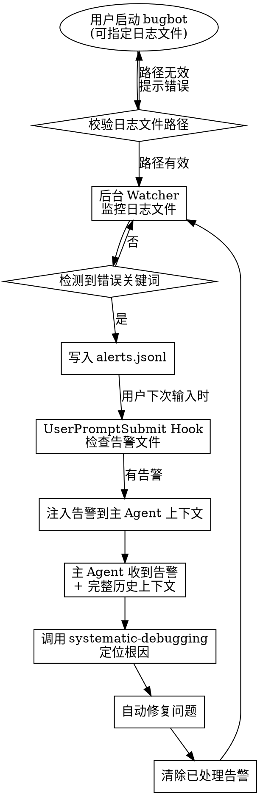

# BugBot - 智能开发日志监控与自动修复系统

实时监控开发日志，自动捕获错误并通知主 Agent 进行修复。

## 命令

| 命令 | 说明 |
|------|------|
| `启动 bugbot` / `start bugbot` | 启动日志监控（使用默认或配置文件中的日志路径） |
| `启动 bugbot /path/to/log` | 启动并监控指定的日志文件 |
| `启动 bugbot /path/log1,/path/log2` | 启动并监控多个日志文件（逗号分隔） |
| `停止 bugbot` / `stop bugbot` | 停止监控 |
| `bugbot 状态` / `bugbot status` | 查看运行状态和待处理告警 |
| `检查错误` / `check errors` | 手动检查并处理告警 |

## 工作流程



## 启动监控

### 方式 1: 指定日志文件（推荐）

```bash
# 监控单个日志文件
"$HOME/.claude/hooks/bugbot-start.sh" /path/to/your/app.log

# 监控多个日志文件（逗号分隔）
"$HOME/.claude/hooks/bugbot-start.sh" /path/to/app.log,/path/to/error.log
```

### 方式 2: 使用配置文件

编辑 `~/.claude/bugbot/config.yaml`：
```yaml
log_files:
  - /path/to/your/app.log
  - /path/to/another/service.log
```

然后启动：
```bash
"$HOME/.claude/hooks/bugbot-start.sh"
```

### 方式 3: 使用默认日志文件

如果不指定路径，将使用默认的 `~/.claude/bugbot/dev.log`：

```bash
"$HOME/.claude/hooks/bugbot-start.sh"
```

启动后，将开发服务器输出导入日志文件：
```bash
bun dev 2>&1 | tee ~/.claude/bugbot/dev.log
# 或
npm run dev 2>&1 | tee ~/.claude/bugbot/dev.log
```

## 查看状态

```bash
"$HOME/.claude/hooks/bugbot-status.sh"
```

## 停止监控

```bash
"$HOME/.claude/hooks/bugbot-stop.sh"
```

## 配置

配置文件: `~/.claude/bugbot/config.yaml`

```yaml
# 监控模式
check_mode: auto      # auto: 每次用户输入自动检查 | manual: 手动触发

# 修复模式
fix_mode: interactive # interactive: 报告后询问 | auto: 自动修复

# 监控的日志文件 (支持多个)
log_files:
  - ~/.claude/bugbot/dev.log
  - ./logs/app.log
  - /var/log/myapp/error.log

# 错误关键词 (正则表达式)
error_patterns:
  - "ERROR"
  - "FATAL"
  - "Exception"
  - "Traceback"
  - "Error:"
  - "panic"
  - "WARN"
  - "WARNING"
  - "TypeError"
  - "ReferenceError"
  - "SyntaxError"
  - "failed"

# 忽略的模式
ignore_patterns:
  - "node_modules"
  - "\.map$"

# 上下文行数
context_lines: 50
```

## Hook 集成

bugbot 通过 `UserPromptSubmit` hook 自动将告警注入到主 Agent：

1. 用户每次输入时，hook 检查 `~/.claude/bugbot/alerts.jsonl`
2. 如果有未处理告警，自动注入到 Claude 上下文
3. 主 Agent 收到告警后，结合完整历史上下文进行分析和修复

## 与 Superpowers 集成

修复时自动调用：

| 场景 | 调用 Skill |
|------|-----------|
| 定位根因 | superpowers:systematic-debugging |
| TDD 修复 | superpowers:test-driven-development |
| 验证修复 | superpowers:verification-before-completion |

## 依赖

- `jq` - JSON 处理工具
- `tail`, `grep` - 标准 Unix 工具
- `yq` (可选) - YAML 处理工具，用于读取配置文件

---
> Converted and distributed by [TomeVault](https://tomevault.io/claim/redleaves) — claim your Tome and manage your conversions.
<!-- tomevault:4.0:skill_md:2026-04-14 -->
