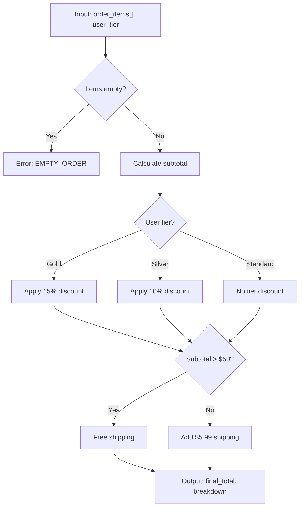
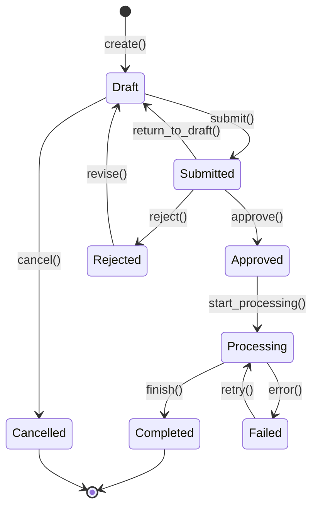
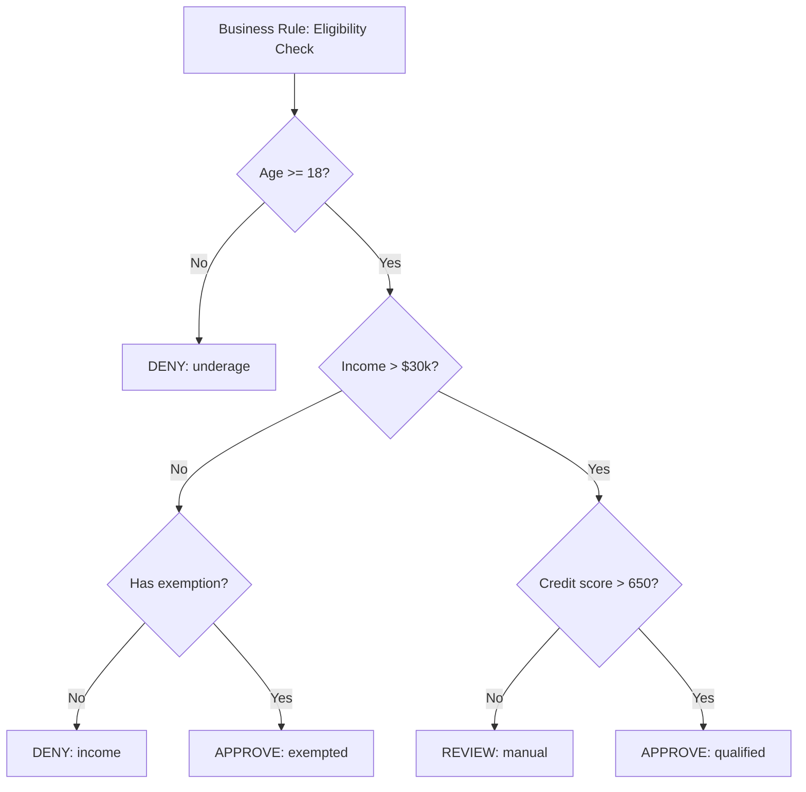

# Vista TDD

Generate test-driven development diagrams for heavy-logic components flagged during planning. These diagrams give implementation agents concrete visual contracts so they write tests first and implement correctly.

## Invocation

```
/vista:tdd <feature-name>
```

## Prerequisites

- Feature must exist at `docs/<name>/`
- `domain-requirements.md` must be filled (run `/vista:plan` first)
- Architecture diagrams should exist in `arch/` (generated by `/vista:plan`)

## Workflow

### Step 1: Load Planning Context

1. Read `docs/<name>/domain-requirements.md`
2. Read `arch/_arch.json` manifest and all referenced `.mmd` files
3. Extract the `## TDD Candidates` section from domain-requirements.md
4. If no TDD candidates section exists, analyze domain-requirements.md and architecture diagrams to identify candidates yourself

Present the list of TDD candidate components to the user:
```
I found these components flagged for TDD:

1. **PricingEngine** — Complex discount stacking with priority rules
2. **WorkflowStateMachine** — 8 states, 15 transitions, conditional branching

Would you like to add or remove any components from this list?
```

Use **AskUserQuestion** to let the user adjust the list.

### Step 2: Analyze Each Component

For each TDD candidate:

1. **Study its context** in the existing architecture diagrams:
   - What role does it play in the system architecture?
   - What inputs does it receive? From which components?
   - What outputs does it produce? To which consumers?
   - What sequence diagrams involve this component?

2. **Identify testable behaviors** via AskUserQuestion:
   - What is the happy path? (normal inputs → expected outputs)
   - What are the boundary conditions? (min/max values, empty inputs, limits)
   - What are the error conditions? (invalid inputs, external failures, timeouts)
   - What are the state transitions? (if stateful)
   - What business rules govern its behavior?

3. **Document edge cases** the user confirms:
   - Null/empty inputs
   - Concurrent operations
   - Overflow/underflow conditions
   - Permission/authorization scenarios
   - Race conditions (if applicable)

### Step 3: Generate TDD Diagrams

For each TDD candidate, generate 1-3 Mermaid diagrams in `arch/`. Choose diagram types based on the component's nature:

#### Logic Flow Diagrams (`tdd-{component}-logic.mmd`)
**Use when:** Component has branching logic, calculations, or decision-making.



Conventions:
- **Input nodes** at the top with data types
- **Output nodes** at the bottom with return types
- **Decision diamonds** for every branch point
- **Error nodes** styled distinctly for failure paths
- **Edge labels** describe the condition

#### State Diagrams (`tdd-{component}-states.mmd`)
**Use when:** Component manages state transitions (workflows, status tracking, lifecycle).



Conventions:
- Every transition labeled with the action/method that triggers it
- All valid transitions shown (anything not shown is invalid — test that it's rejected)
- Terminal states clearly marked

#### Decision Tree Diagrams (`tdd-{component}-decision.mmd`)
**Use when:** Component applies business rules with complex condition combinations.



Conventions:
- Each leaf node is a test case (input combination → expected result)
- Every path through the tree = one test scenario
- Label nodes with the actual decision values

### Step 4: Update Manifest and Report

**4a. Update `arch/_arch.json`:**

Add all TDD diagrams to the manifest with `"category": "tdd"`:

```json
{
  "name": "Pricing Engine Logic Flow",
  "file": "tdd-pricing-logic.mmd",
  "type": "mermaid",
  "diagramType": "logic-flow",
  "category": "tdd",
  "description": "Branching logic for order pricing with tier discounts and shipping rules"
}
```

**4b. Append Test Expectations to domain-requirements.md:**

Add a `## Test Expectations` section:

```markdown
## Test Expectations

### PricingEngine
- **Inputs:** order_items (array), user_tier (enum: gold|silver|standard)
- **Happy path:** Non-empty items + gold tier → 15% discount + free shipping (subtotal > $50)
- **Edge cases:**
  - Empty order_items → EMPTY_ORDER error
  - Subtotal exactly $50 → boundary: shipping threshold
  - Single item order → minimum viable order
- **Error conditions:**
  - Negative item prices → validation error
  - Unknown user tier → default to standard

### WorkflowStateMachine
- **Valid transitions:** Draft→Submitted, Submitted→Approved, Submitted→Rejected, etc.
- **Invalid transitions:** Draft→Approved (must go through Submitted)
- **Edge cases:**
  - Retry from Failed → returns to Processing
  - Cancel from Draft → terminal state
```

**4c. Report to user:**

Tell the user:

1. **TDD diagrams generated** — each diagram is a visual test contract
2. **Review in web dashboard** at `/project/<id>/arch/<name>` (TDD diagrams shown with distinct styling)
3. **Or review** the `.mmd` files directly
4. **Next step:** Run `/vista:specs <name>` to generate detailed specifications. Specs for TDD-flagged components will include a Testing Strategy section derived from these diagrams.
5. **During implementation:** Ralph's build loop will write tests FIRST for TDD-flagged components, using these diagrams as the test contract.

## Output Files

New files added to `docs/<name>/arch/`:
```
arch/
├── _arch.json                      # Updated manifest (TDD entries added)
├── tdd-{component}-logic.mmd       # Logic flow with inputs/outputs/branches
├── tdd-{component}-states.mmd      # State transitions (if stateful)
└── tdd-{component}-decision.mmd    # Decision tree (if rule-heavy)
```

Updated: `docs/<name>/domain-requirements.md` (Test Expectations section appended)

## References

- `vista/skills/tdd/references/tdd-diagram-guide.md` — Detailed guide with more examples and conventions
- `vista/templates/arch-schema.json` — Schema for `_arch.json` manifest (includes TDD diagramTypes)

---
> Converted and distributed by [TomeVault](https://tomevault.io/claim/ribeec20) — claim your Tome and manage your conversions.
<!-- tomevault:4.0:skill_md:2026-04-16 -->
