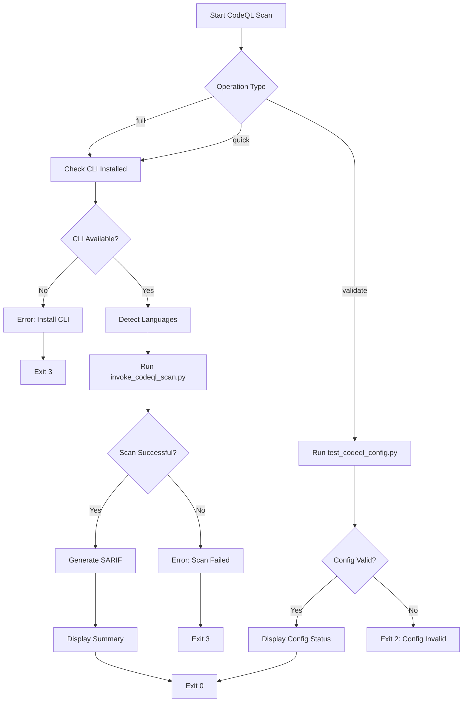

# CodeQL Scan Skill

Execute CodeQL security scans with automated language detection, database caching, and SARIF output generation.

## Quick Start

```bash
# Via Claude Code skill system
/codeql-scan

# Full scan with auto-detected languages
python3 .claude/skills/codeql-scan/scripts/invoke_codeql_scan.py --operation full

# Quick scan with cached databases
python3 .claude/skills/codeql-scan/scripts/invoke_codeql_scan.py --operation quick

# Validate configuration only
python3 .claude/skills/codeql-scan/scripts/invoke_codeql_scan.py --operation validate
```

## Triggers

- `Run CodeQL scan`
- `Check for vulnerabilities`
- `Validate CodeQL configuration`
- `Quick security scan`
- `Scan for security issues`

## Decision Tree

```text
Need CodeQL analysis?
+-- First time setup       --> python3 .codeql/scripts/install_codeql.py
+-- Validate config        --> invoke_codeql_scan.py --operation validate
+-- Full repository scan   --> invoke_codeql_scan.py --operation full
+-- Quick scan (cached)    --> invoke_codeql_scan.py --operation quick
+-- Specific language      --> invoke_codeql_scan.py --operation full --languages python
+-- CI mode                --> invoke_codeql_scan.py --operation full --ci
```

### When to Use Each Operation

| Operation | Use When | Performance | Output |
|-----------|----------|-------------|--------|
| `full` | First scan, major changes, pre-PR validation | 30-60s | SARIF + Console |
| `quick` | Iterative development, minor changes | 10-20s | SARIF + Console |
| `validate` | Config changes, troubleshooting | <5s | Console only |

## Process



### Phase 1: Full Repository Scan

Run a comprehensive security analysis of the entire codebase.

1. **Check Prerequisites:**

   ```bash
   # Verify CodeQL CLI is installed
   test -f .codeql/cli/codeql || echo "CodeQL CLI not found. Run: python3 .codeql/scripts/install_codeql.py"
   ```

2. **Run Scan:**

   ```bash
   python3 .claude/skills/codeql-scan/scripts/invoke_codeql_scan.py --operation full
   ```

3. **Review Results:**
   - SARIF files: `.codeql/results/*.sarif`
   - Console output: Summary of findings by severity
   - Exit code: 0 (success), 1 (findings in CI mode), 3 (scan failed)

### Phase 2: Quick Scan (Cached)

Use for rapid iteration during development. Only re-scans if source files changed.

```bash
python3 .claude/skills/codeql-scan/scripts/invoke_codeql_scan.py --operation quick
```

**Performance comparison:**

- Full scan: 30-60 seconds (creates databases + runs all queries)
- Quick scan (CLI): 10-20 seconds (cached database + all queries)
- Quick scan (PostToolUse hook): 5-15 seconds (cached database + targeted queries only)

### Phase 3: Configuration Validation

Verify CodeQL configuration YAML syntax and query packs.

```bash
python3 .claude/skills/codeql-scan/scripts/invoke_codeql_scan.py --operation validate
```

## Scripts

### invoke_codeql_scan.py

Wrapper script providing skill-specific functionality.

| Parameter | Type | Default | Description |
|-----------|------|---------|-------------|
| `--operation` | choice | `full` | Operation type: `full`, `quick`, `validate` |
| `--languages` | list | (auto-detect) | Languages to scan: `python`, `actions` |
| `--ci` | flag | `false` | Enable CI mode (exit 1 on findings) |

**Exit Codes (ADR-035):**

| Code | Meaning | CI Behavior |
|------|---------|-------------|
| 0 | Success (no findings or findings ignored) | Pass |
| 1 | Findings detected (CI mode only) | Fail |
| 2 | Configuration invalid | Fail |
| 3 | Scan execution failed | Fail |

### Underlying Scripts

This skill wraps these core CodeQL scripts:

| Script | Purpose | Location |
|--------|---------|----------|
| `install_codeql.py` | Download and install CodeQL CLI | `.codeql/scripts/` |
| `invoke_codeql_scan.py` | Execute security scans | `.codeql/scripts/` |
| `test_codeql_config.py` | Validate configuration | `.codeql/scripts/` |
| `get_codeql_diagnostics.py` | Comprehensive health check | `.codeql/scripts/` |

## Anti-Patterns

| Avoid | Why | Instead |
|-------|-----|---------|
| Skip config validation before scan | Wastes time on invalid config | Run `--operation validate` first |
| Ignore exit codes | Silent failures hide security issues | Check `$?` (Bash/Zsh) or `$LASTEXITCODE` (PowerShell) after every invocation |
| Suppress stderr before checking exit code | Loses diagnostic information | Capture output, check exit code, then filter |
| Full scan on every minor change | 3-5x slower than needed | Use `--operation quick` for iteration |
| Mix skill wrapper with direct script calls | Inconsistent behavior | Always use `invoke_codeql_scan.py` |

## Verification Checklist

Before completing a security scan task:

- [ ] CodeQL CLI installed and accessible
- [ ] Configuration validated (`--operation validate`)
- [ ] `invoke_codeql_scan.py` completed successfully (exit code 0; see exit codes in Scripts section)
- [ ] SARIF files generated in `.codeql/results/`
- [ ] Findings reviewed (if any)
- [ ] High/medium severity findings addressed
- [ ] Low severity findings documented or suppressed

## Related Skills

| Skill | Purpose | When to Use |
|-------|---------|-------------|
| `security-detection` | Detect security-critical file changes | Before CodeQL scan to identify high-risk changes |
| `github` | GitHub operations (PR comments, issues) | Report CodeQL findings to PR reviews |
| `session-init` | Initialize session with protocol | Before starting security analysis workflow |

## References

- **CodeQL Documentation:** <https://codeql.github.com/docs/>
- **SARIF Specification:** <https://sarifweb.azurewebsites.net/>
- **ADR-035:** Exit code standardization
- **ADR-005:** PowerShell-only scripting standard
- **Session Protocol:** `.agents/SESSION-PROTOCOL.md`

<details>
<summary><strong>Output Format Examples</strong></summary>

### Console Output

```text
=== CodeQL Security Scan ===

[OK] CodeQL CLI found at .codeql/cli/codeql
[OK] Languages detected: python, actions
[OK] Running full scan (no cache)...

Scanning python...
  Database created: .codeql/db/python
  Queries executed: 89
  Findings: 1 (0 high, 0 medium, 1 low)

Scanning actions...
  Database created: .codeql/db/actions
  Queries executed: 45
  Findings: 0

[OK] SARIF results saved to .codeql/results/
[OK] Scan completed successfully

Total findings: 1 (0 high, 0 medium, 1 low)
```

### SARIF Files

Results are saved in SARIF format for IDE integration.

**Location:** `.codeql/results/<language>.sarif`

```json
{
  "version": "2.1.0",
  "runs": [{
    "tool": {
      "driver": {
        "name": "CodeQL",
        "version": "2.15.0"
      }
    },
    "results": [{
      "ruleId": "py/sql-injection",
      "level": "error",
      "message": {
        "text": "Potential SQL injection vulnerability"
      },
      "locations": [{
        "physicalLocation": {
          "artifactLocation": {
            "uri": "scripts/example.py"
          },
          "region": {
            "startLine": 42
          }
        }
      }]
    }]
  }]
}
```

### JSON Output (CI Mode)

```json
{
  "status": "findings_detected",
  "languages": ["python", "actions"],
  "findings": {
    "total": 1,
    "high": 0,
    "medium": 0,
    "low": 1
  },
  "sarif_files": [
    ".codeql/results/python.sarif",
    ".codeql/results/actions.sarif"
  ]
}
```

</details>

<details>
<summary><strong>PostToolUse Hook (Automatic Scanning)</strong></summary>

### How It Works

The PostToolUse hook automatically triggers targeted CodeQL scans after you write Python files (*.py) or GitHub Actions workflows (*.yml in .github/workflows/). Uses a focused query set (5-10 critical CWEs) to complete within 30 seconds.

**Automatic Triggers:**

- Write a Python file: Quick scan for CWE-078, CWE-089, CWE-079, etc.
- Write a workflow file: Quick scan for command injection, credential leaks

**Configuration:**

- Hook location: `.claude/hooks/PostToolUse/invoke_codeql_quick_scan.py`
- Quick config: `.github/codeql/codeql-config-quick.yml`
- Targeted queries: CWE-078 (command injection), CWE-089 (SQL injection), CWE-079 (XSS), CWE-022 (path traversal), CWE-798 (hardcoded credentials)

**Performance:**

| Scenario | Duration |
|----------|----------|
| Cached DB | 5-15 seconds |
| First run | 20-30 seconds |
| Timeout budget | 30 seconds (graceful) |

**Graceful Degradation:**

- CodeQL CLI not installed: Hook exits silently (non-blocking)
- Scan times out: Warning message displayed, full scan recommended

</details>

<details>
<summary><strong>Diagnostics</strong></summary>

### Running Diagnostics

```bash
# Console output (default)
python3 .codeql/scripts/get_codeql_diagnostics.py

# JSON output (programmatic parsing)
python3 .codeql/scripts/get_codeql_diagnostics.py --output-format json

# Markdown report
python3 .codeql/scripts/get_codeql_diagnostics.py --output-format markdown > diagnostics.md
```

### Checks Performed

| Check | What It Validates |
|-------|-------------------|
| **CLI** | Installation, version, executable permissions |
| **Config** | YAML syntax, query pack availability, language support |
| **Database** | Existence, cache validity, size, creation timestamp |
| **Results** | SARIF files, findings count, last scan timestamp |

### get_codeql_diagnostics.py Exit Codes

| Code | Meaning |
|------|---------|
| 0 | All checks passed |
| 1 | Some checks failed (warnings) |
| 3 | Unable to run diagnostics |

</details>

<details>
<summary><strong>Troubleshooting</strong></summary>

### CodeQL CLI Not Found

```text
Error: CodeQL CLI not found at .codeql/cli/codeql
```

**Solution:**

```bash
python3 .codeql/scripts/install_codeql.py --add-to-path
codeql version
```

### Configuration Validation Failed

```text
Error: Invalid query pack: codeql/unknown-queries
```

**Solution:**

```bash
python3 .codeql/scripts/test_codeql_config.py
codeql resolve qlpacks
```

### Scan Timeout

```text
Error: Query execution timed out after 300s
```

**Solution:** Reduce scope by scanning a specific language.

```bash
python3 .claude/skills/codeql-scan/scripts/invoke_codeql_scan.py --operation full --languages python
```

### Cache Invalidation Issues

```text
Warning: Using cached database, but source files changed
```

**Solution:** Force database rebuild with a full scan.

```bash
python3 .claude/skills/codeql-scan/scripts/invoke_codeql_scan.py --operation full
```

### Hook Not Triggering

PostToolUse hook not running after file writes. Common causes:

- File type not supported (hook only scans `.py` and `.yml` in workflows)
- CodeQL CLI not installed (graceful degradation, no error shown)
- Hook disabled in Claude Code settings

**Verify:**

```bash
python3 .codeql/scripts/get_codeql_diagnostics.py
test -f .claude/hooks/PostToolUse/invoke_codeql_quick_scan.py && echo "Hook exists"
```

</details>

---
> Converted and distributed by [TomeVault](https://tomevault.io/claim/rjmurillo) — claim your Tome and manage your conversions.
<!-- tomevault:4.0:skill_md:2026-04-11 -->
