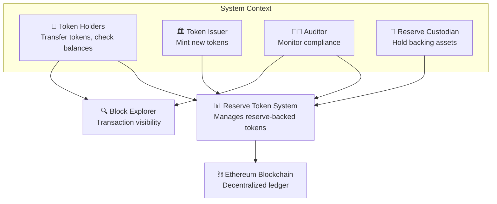
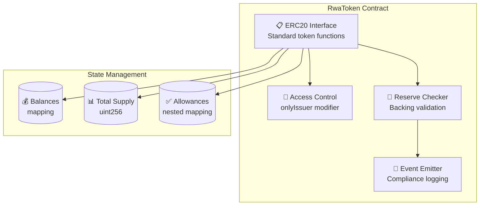
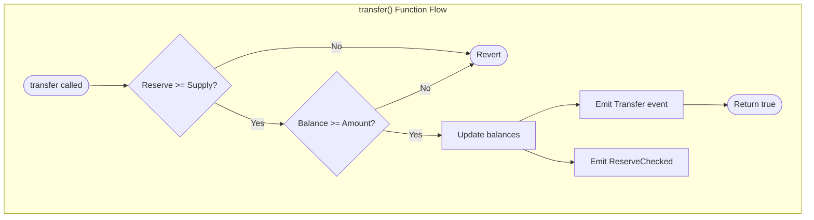

# C4 Architecture Diagrams

Create clear, hierarchical software architecture diagrams using the C4 model (Context, Container, Component, Code). Focus on different levels of abstraction to communicate system design to various stakeholders.

## Examples

### Level 1: Context Diagram


### Level 2: Container Diagram
```mermaid
graph TB
    subgraph "Reserve Token System"
        Smart[📜 Smart Contract<br/>Solidity | EVM<br/>Token logic + reserve checks]
        Events[📢 Event System<br/>Blockchain logs<br/>Compliance monitoring]
    end
    
    subgraph "External Systems"
        Reserve[🏦 Reserve Wallet<br/>EOA/Multisig<br/>Holds backing assets]
        Oracle[🔮 Price Oracle<br/>Chainlink (future)<br/>Real-time pricing]
    end
    
    User[👤 Users] --> Smart
    Smart --> Reserve
    Smart --> Events
    Smart -.-> Oracle
    Auditor[👨‍💼 Auditor] --> Events
```

### Level 3: Component Diagram


### Level 4: Code Diagram


## Guidelines

### C4 Model Levels
1. **Context (Level 1)**: System boundary and external actors
2. **Container (Level 2)**: High-level technology choices
3. **Component (Level 3)**: Internal structure of containers
4. **Code (Level 4)**: Class/function level detail

### Diagram Design Principles
- Use consistent shapes and colors for entity types
- Include technology choices (Solidity, EVM, etc.)
- Show data flow direction with arrows
- Add brief descriptions for each element
- Focus on one abstraction level per diagram

### Stakeholder Targeting
- **Context**: Business stakeholders, product managers
- **Container**: Architects, senior developers
- **Component**: Development team, technical leads
- **Code**: Developers working on specific modules

### Mermaid Best Practices
- Use subgraphs to group related components
- Include emojis for visual clarity
- Add technology stack annotations
- Show both synchronous and asynchronous relationships
- Use different arrow styles for different interaction types

### Documentation Structure
```
docs/architecture/
├── c4-context.md        # Level 1 diagrams
├── c4-container.md      # Level 2 diagrams  
├── c4-component.md      # Level 3 diagrams
└── c4-code.md          # Level 4 diagrams
```

### Common Patterns for Blockchain
- Smart contracts as containers
- External accounts as actors
- Blockchain as external system
- Events as communication mechanism
- Gas costs as non-functional constraints

---
> Converted and distributed by [TomeVault](https://tomevault.io/claim/roguedan) — claim your Tome and manage your conversions.
<!-- tomevault:4.0:skill_md:2026-04-13 -->
