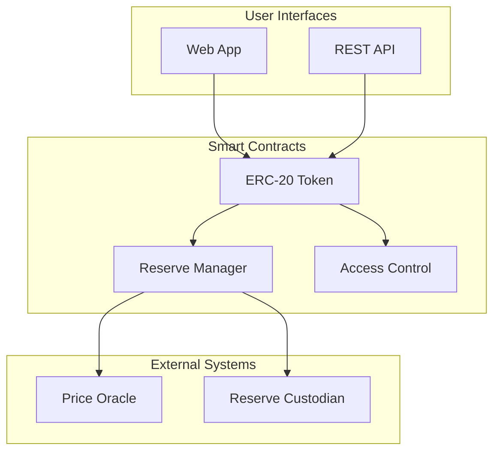

# Technical Documentation for Blockchain Projects

Produce clear, accurate, and comprehensive documentation that serves developers, users, auditors, and regulators. Focus on clarity, completeness, and maintainability.

## Examples

### README Structure
```markdown
# Project Name

Short description of what the project does and its value proposition.

## Features
- ✅ Feature 1: Brief description
- ✅ Feature 2: Brief description
- 🔜 Feature 3: Coming soon

## Quick Start
\`\`\`bash
git clone https://github.com/org/project
cd project
forge install
forge test
\`\`\`

## Architecture
[Include diagram]

## Documentation
- [User Guide](./docs/user-guide.md)
- [Developer Docs](./docs/developer.md)
- [Security](./docs/security.md)
```

### Contract Documentation
```solidity
/// @title Reserve-Backed Token
/// @author Team Name
/// @notice This contract implements an ERC-20 token with reserve requirements
/// @dev All function calls check reserve backing before execution
/// @custom:security-contact security@project.com
contract ReserveToken {
    /// @notice Transfers tokens from sender to recipient
    /// @dev Checks reserve requirement before transfer
    /// @param to The recipient address
    /// @param amount The amount to transfer in wei
    /// @return success Whether the transfer succeeded
    function transfer(address to, uint256 amount) external returns (bool);
}
```

### Architecture Diagram


### API Documentation
```markdown
## API Reference

### Get Balance
Returns the token balance for an address.

**Endpoint:** `GET /api/balance/{address}`

**Response:**
\`\`\`json
{
  "address": "0x...",
  "balance": "1000000000000000000",
  "formatted": "1.0",
  "decimals": 18
}
\`\`\`

**Error Codes:**
- `400`: Invalid address format
- `404`: Address not found
- `500`: Internal server error
```

## Guidelines

### Documentation Principles
- Write for your audience's expertise level
- Use clear, concise language
- Include practical examples
- Keep documentation next to code
- Update docs with every code change

### Audience-Specific Docs
- **Developers**: Technical details, integration guides
- **Users**: Simple instructions, FAQs
- **Auditors**: Security measures, test results
- **Regulators**: Compliance mappings, legal alignments
- **Operators**: Deployment guides, runbooks

### Visual Documentation
- Architecture diagrams for system overview
- Sequence diagrams for complex flows
- State diagrams for contract states
- Flowcharts for decision logic
- Screenshots for UI guides

### Maintenance Strategy
- Version documentation with code
- Automated documentation generation
- Regular review cycles
- Community feedback integration
- Translation management

### Quality Standards
- Spell check and grammar review
- Code example testing
- Link verification
- Consistency in terminology
- Accessibility compliance

---
> Converted and distributed by [TomeVault](https://tomevault.io/claim/roguedan) — claim your Tome and manage your conversions.
<!-- tomevault:4.0:skill_md:2026-04-13 -->
