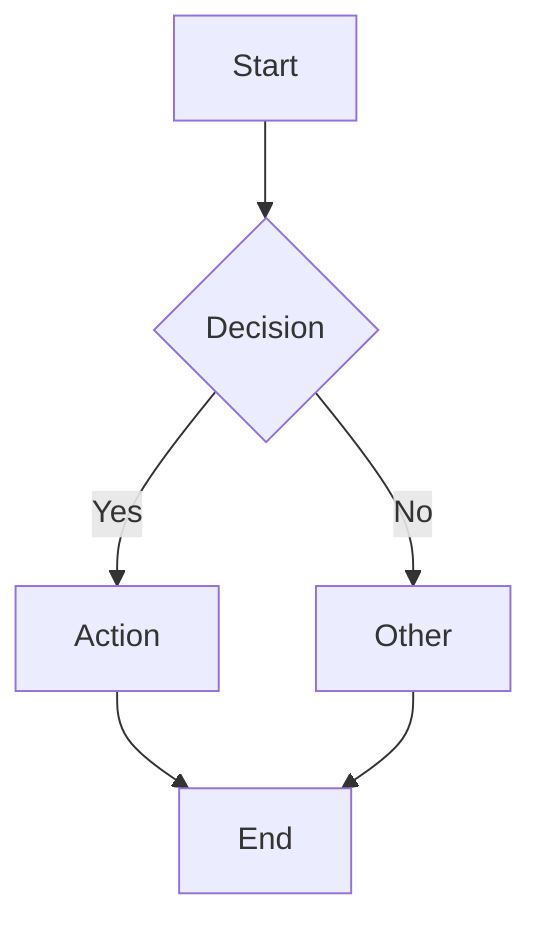
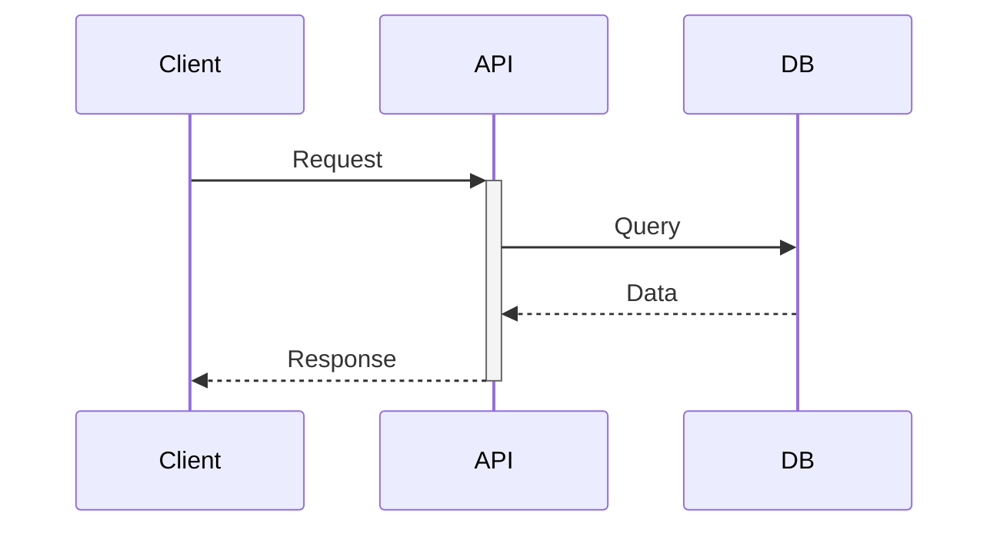
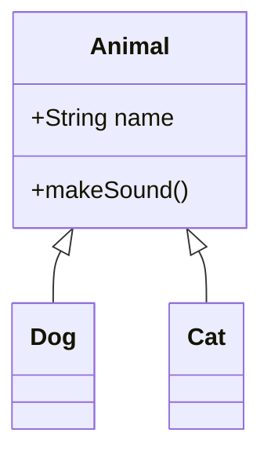
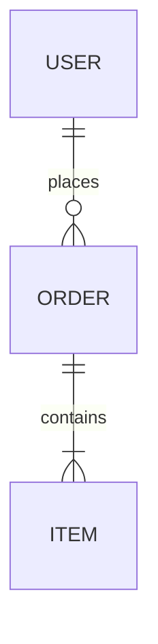

# Mermaid Diagram

Generate proper, well-structured Mermaid diagrams for visual documentation and design presentations.

## Diagram Selection

| Need | Diagram | Reference |
|------|---------|-----------|
| Process flow, decisions | Flowchart | [flowchart.md](references/flowchart.md) |
| API/service interactions | Sequence | [sequence.md](references/sequence.md) |
| Object-oriented design | Class | [class.md](references/class.md) |
| Database schema | ER Diagram | [er.md](references/er.md) |
| State machines, lifecycles | State | [state.md](references/state.md) |
| Software architecture (C4) | C4 | [c4.md](references/c4.md) |
| Cloud/infrastructure | Architecture | [architecture.md](references/architecture.md) |
| Brainstorming, concepts | Mindmap | [mindmap.md](references/mindmap.md) |
| Timelines, charts, git | Other | [other-diagrams.md](references/other-diagrams.md) |

## Quick Examples

### Flowchart


### Sequence


### Class


### ER


## Best Practices

1. **Choose the right diagram** - Match diagram type to what you're representing
2. **Keep it readable** - Limit nodes, use clear labels, avoid crossing lines
3. **Use direction** - `LR` for wide diagrams, `TD` for tall ones
4. **Group related items** - Use subgraphs, boundaries, or namespaces
5. **Add context** - Use notes and labels to explain non-obvious elements
6. **Style sparingly** - Only highlight what needs attention

## Output Format

Always wrap diagrams in fenced code blocks:

````

````

Consult the appropriate reference file for detailed syntax before generating complex diagrams.

---
> Converted and distributed by [TomeVault](https://tomevault.io/claim/romain325) — claim your Tome and manage your conversions.
<!-- tomevault:4.0:skill_md:2026-04-15 -->
