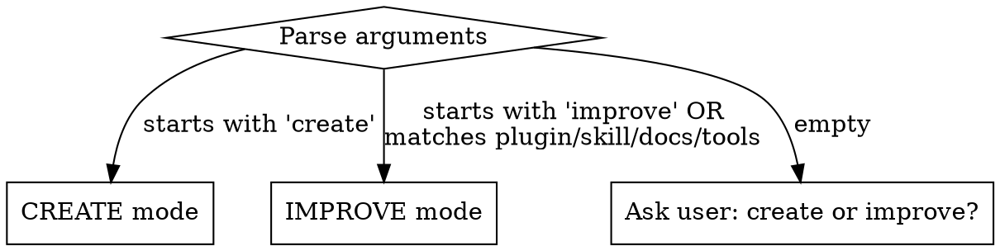

# Skill Workbench

Announce: "I'm using the skill workbench to work on skills in this repository."

## Path Safety

Do not write to managed directories (`~/.claude` or `~/.config/opencode`) without explicit user approval.
These directories are overwritten on plugin sync — changes made there are silently lost.
Reading from them is fine for research.

### Valid write targets

| Target | When to use |
|--------|------------|
| `$REPO_ROOT/{plugin}/...` | Source skills and agents in the current repo |
| `$REPO_ROOT/.opencode/...` | Generated OpenCode assets (via `sync-opencode.sh`, not direct edits) |
| `~/.claude/projects/*/memory/` | MEMORY.md and pending-learnings (these are per-project, not managed by sync) |

### Managed directories — resolve before writing

**Before every Write or Edit call**, verify the target path is a valid write target above.
If a path points to a managed directory, resolve it to the repo-relative equivalent:

| Managed path prefix | Correct write target |
|----------------------|-------------------|
| `~/.claude/plugins/cache/{repo}/{plugin}/...` | `{repo-root}/{plugin}/...` |
| `~/.config/opencode/skills/...` | `{repo-root}/.opencode/skills/...` |
| `~/.claude/settings.*` | Ask the user before modifying |

### If you believe a managed directory needs editing

Do not silently write there.
Instead, explain why and ask the user:

```
AskUserQuestion(
  header: "Write to managed directory?",
  question: "I need to write to <path>, which is a managed directory (overwritten on sync). Reason: <why>. Proceed?",
  options: [
    "Yes — write there" -- I understand this may be overwritten,
    "No — write to repo source instead" -- Resolve to the repo-relative path
  ]
)
```

### Red flags — STOP if you think any of these

| Thought | Reality |
|---------|---------|
| "I'll edit the cached copy directly — it's faster" | Cache is overwritten on sync. Edit the repo source. |
| "This is a quick fix to the installed version" | Installed versions are read-only copies. Fix the source. |
| "The glob result points to `~/.claude`, so I'll edit there" | Glob finds cache copies. Resolve to repo path before editing. |
| "I need to update `~/.config/opencode` to test" | Plugin sync handles deployment. Edit repo source and sync. |
| "It's just one small change, I'll fix the source later" | Later never comes. Edit the source now. |

## Reference Documents

This skill has reference documents for deeper guidance. Load them when needed — not upfront.

| Reference | When to load |
|-----------|-------------|
| [best-practices.md](references/best-practices.md) | Writing or evaluating any skill content |
| [claude-search-optimization.md](references/claude-search-optimization.md) | Writing or improving descriptions and frontmatter |
| [persuasion-principles.md](references/persuasion-principles.md) | Writing discipline-enforcing skills that resist rationalization |
| [testing-with-subagents.md](references/testing-with-subagents.md) | Testing any skill change (all types, not just discipline) with RED-GREEN-REFACTOR |
| [eval-schemas.md](references/eval-schemas.md) | Writing eval definitions or grading assertions |
| [progressive-disclosure.md](references/progressive-disclosure.md) | Deciding file organization and token optimization |
| [skill-quality-checklist.md](references/skill-quality-checklist.md) | Final quality gate before committing |
| [new-skill-template.md](references/new-skill-template.md) | Creating a new skill from scratch |
| [report-template.md](references/report-template.md) | Writing the Step 5 summary report |

## Step 1: Scope and Route

Identify the repo root and detect skill infrastructure:

```bash
REPO_ROOT=$(git rev-parse --show-toplevel)
```

Set `REPO_ROOT` for all subsequent file operations. The skill workbench works in any repository — it adapts to the skill/agent/plugin structure found.

Parse `$ARGUMENTS` to determine the operation mode:



Discover repo assets (run in parallel):

- `Glob("**/skills/*/SKILL.md")` — all skills
- `Glob("**/.claude-plugin/plugin.json")` — plugin manifests
- `Glob("**/agents/*.md")` — agent definitions
- `git log --oneline -20` — recent changes for context
- Check for `Makefile` at repo root (optional — used for structural validation if present)

Read each plugin's `plugin.json` to note current versions (needed for version bumps).

**If no skills, agents, or plugins found:** inform the user that this repo has no skill infrastructure and offer to create initial structure.

**If no arguments:** ask the user whether they want to create a new skill or improve existing ones.

Route to the appropriate mode:
- **CREATE mode** → Step 2
- **IMPROVE mode** → Step 3

---

## Step 2: Create a New Skill

### 2a: Gather Requirements

**Check conversation history first.** The current conversation may already contain a workflow the user wants to capture (e.g., "turn this into a skill"). Extract answers from the conversation: tools used, sequence of steps, corrections the user made, input/output formats observed. Have the user confirm before proceeding.

Determine from arguments and conversation:

| Requirement | How to resolve |
|-------------|---------------|
| **Skill name** | From `$ARGUMENTS` after "create". Must be kebab-case, max 64 chars. |
| **Owning plugin** | Ask user if ambiguous: `productivity`, `git`, or `code`. |
| **Purpose** | What problem does this skill solve? What triggers should invoke it? |
| **Skill type** | Discipline-enforcing, workflow automation, reference, or pattern? |
| **User-invocable?** | Should it appear in the `/` menu? Default: `true`. |
| **Model-invocable?** | Should Claude auto-invoke it? Default: `false` for task skills, `true` for reference skills. |

If the user's request is vague, ask clarifying questions before proceeding. For significant new features, suggest `/do` instead.

### 2b: Research

Before writing, gather context:

1. **Read similar skills** in the repo to match conventions and quality bar.
2. **Search the web** if the skill covers an unfamiliar domain (use WebSearch/WebFetch).
3. **Read [best-practices.md](references/best-practices.md)** for authoring principles: conciseness, degrees of freedom, token optimization.
4. **Read [claude-search-optimization.md](references/claude-search-optimization.md)** for writing discoverable descriptions and choosing keywords.
5. **For discipline-enforcing skills:** read [persuasion-principles.md](references/persuasion-principles.md) for authority, commitment, and rationalization-resistance techniques.

### 2c: Write the Skill

Create directory and SKILL.md:

```bash
mkdir -p {plugin}/skills/{name}
```

Write `{plugin}/skills/{name}/SKILL.md` using the template from [new-skill-template.md](references/new-skill-template.md).

**SKILL.md body rules:**

| Rule | Detail |
|------|--------|
| Announce line | First line after heading: `Announce: "I'm using the {name} skill to {purpose}."` |
| Numbered steps | `## Step N: Title` sections with specific actions and commands |
| Error handling | Final `## Error Handling` section as a table of failure modes and resolutions |
| Description = triggers only | Description says WHEN to use the skill, never summarizes the workflow |
| Concise | One sentence per concept. Tables over paragraphs. No filler words. |
| Semantic line feeds | One sentence per line. Break after clause-separating punctuation (commas, semicolons, colons, em dashes). Target 120 characters per line. Rendered output is unchanged — cleaner diffs and per-sentence review. |
| Specific commands | `Run make all` not "validate your changes" |
| Under 500 lines | Move heavy reference material to separate files in the skill directory |
| Self-contained | Works without external context. Duplication preferred over external dependencies. |
| Degrees of freedom | Low-freedom for fragile ops (exact commands), high-freedom for judgment calls. See [progressive-disclosure.md](references/progressive-disclosure.md). |

**Supporting files** (optional): create in `references/` or `scripts/` subdirectories for templates, examples, or reference docs. Keep references one level deep from SKILL.md. Reference them explicitly so Claude knows when to load them.

**Match writing style to skill type:**

| Skill Type | Style | Rationale |
|------------|-------|-----------|
| **Discipline-enforcing** | Authority language ("NEVER", "YOU MUST"), rationalization tables, red flag lists, loophole closures. See [persuasion-principles.md](references/persuasion-principles.md). | Compliance-carrying skills need bright-line rules. |
| **Technique/workflow** | Explain the **why** behind each instruction. If you find yourself writing ALWAYS/NEVER in all caps for a non-discipline skill, reframe with reasoning instead. | LLMs follow instructions better when they understand the purpose. Heavy-handed MUSTs on judgment calls reduce quality. |
| **Reference/pattern** | Clear, factual prose. No persuasion techniques needed. | Authority language is noise in reference material. |

### 2d: Test the Skill

**Iron Law: No skill without a failing test first.** This applies to ALL skill types — not just discipline-enforcing ones.

Follow the RED-GREEN-REFACTOR cycle from [testing-with-subagents.md](references/testing-with-subagents.md). The test approach varies by skill type:

| Skill Type | RED (Baseline Without Skill) | GREEN (Verify With Skill) |
|------------|------------------------------|---------------------------|
| **Discipline-enforcing** | Pressure scenario (3+ pressures). Document rationalizations verbatim. | Agent complies under same pressure. Cites skill sections. |
| **Technique/workflow** | Application scenario. Does agent apply the technique correctly? | Agent follows technique. Handles edge cases. No gaps in instructions. |
| **Pattern** | Recognition scenario. Does agent know when to apply/not apply? | Agent correctly identifies when pattern applies and uses it. |
| **Reference** | Retrieval scenario. Can agent find and use the right information? | Agent finds correct info and applies it to a new scenario. |

**For all types:**

1. **RED**: Launch a Task subagent with a test scenario WITHOUT the skill. Document what went wrong (rationalizations, incorrect technique, missed info).
2. **GREEN**: Re-run the same scenario WITH the skill loaded. Verify the skill fixes the documented failures.
3. **REFACTOR**: If the agent found loopholes or the skill had gaps, fix and re-test.

**Capture timing data**: When a Task subagent completes, its notification includes `total_tokens` and `duration_ms`. Save these to `timing.json` in each run directory — this data is not persisted elsewhere.

**Read full transcripts**: After runs complete, read execution transcripts (not outputs alone) to identify where the agent got confused, wasted time, or took unproductive paths.

**Stopping criteria**: Stop iterating when the user is satisfied, all feedback is empty, or iterations aren't producing meaningful progress.

### 2e: Optimize Description

The description field determines whether Claude loads the skill. After testing, optimize it for trigger accuracy. Read [claude-search-optimization.md](references/claude-search-optimization.md) for writing rules.

**Generate 20 trigger eval queries** — 10 should-trigger, 10 should-not-trigger:

| Query Type | Count | Guidance |
|------------|-------|----------|
| Should-trigger | 8-10 | Different phrasings of same intent. Mix formal/casual. Include cases where user does not name the skill but needs it. |
| Should-not-trigger | 8-10 | Near-misses sharing keywords but needing something different. Adjacent domains. Ambiguous phrasing. |

Queries must be realistic and substantive — concrete details, file paths, context. Short or generic queries (e.g., "format this data") do not reliably trigger skills and produce false negatives.

Save as JSON:

```json
[
  {"query": "realistic user prompt with details", "should_trigger": true},
  {"query": "near-miss prompt that should NOT trigger", "should_trigger": false}
]
```

**Review with user:** Present the query list and ask for approval before testing.

**Test each query** with `claude -p`:

```bash
claude -p "<query>" --model <current-model-id> 2>&1 | head -20
```

Check whether the skill triggered. Record pass/fail for each query.

**Iterate** (max 3 iterations):
1. Revise description based on which queries failed.
2. Re-test all queries.
3. If accuracy plateaus or reaches 3 iterations, report remaining failures and move on.

**Cleanup:** Delete eval workspace artifacts after optimization completes to avoid token budget waste on future loads.

### 2f: Create OpenCode Command

Create `.opencode/commands/{name}.md` to mirror the skill for OpenCode:

```yaml
---
description: >
  Use when {same triggers as SKILL.md description}.
---

Invoke the `{name}` skill with explicit syntax:

skill({ name: "{name}" })
```

### 2g: Validate and Version Bump

1. Bump the owning plugin's version in `.claude-plugin/plugin.json` if it exists (minor bump for new skills).
2. Run `make all` if a Makefile with that target exists. Otherwise, manually validate frontmatter, cross-references, and JSON.
3. Fix any failures (max 3 iterations).
4. Run the quality gate from [skill-quality-checklist.md](references/skill-quality-checklist.md).
5. Update `README.md` to include the new skill in the Quick Reference table and plugin description (if README exists).

Route to Step 5 (Report).

---

## Step 3: Improve Existing Skills

### 3a: Determine Scope

From `$ARGUMENTS`, identify the target:

| Argument | Scope |
|----------|-------|
| Plugin name (`productivity`, `git`, `code`) | All skills in that plugin |
| Skill name (`commit`, `pr`, `do`) | That single skill |
| `docs` | `AGENTS.md`, `README.md`, skill `SKILL.md` files |
| `tools` | `Makefile`, `init.sh`, config files |
| No argument | Ask user, or audit skills changed in recent commits |

### 3b: Evaluate

Read [best-practices.md](references/best-practices.md) and [skill-quality-checklist.md](references/skill-quality-checklist.md) before evaluating.

For each skill in scope, read it and evaluate against these dimensions:

| Dimension | What to look for |
|-----------|-----------------|
| **Friction** | Vague verbs ("handle", "process") without specific actions. Steps that assume unstated context. |
| **Token waste** | Paragraphs that should be tables. Content Claude already knows. Filler words. SKILL.md over 500 lines. |
| **Missing pieces** | Error cases not covered. Edge cases unhandled. Missing cross-references. |
| **Inconsistency** | Missing announce line, unnumbered steps, no error handling section. |
| **Description quality** | Workflow summary in description (should be triggers only). Missing trigger phrases. See [claude-search-optimization.md](references/claude-search-optimization.md). |
| **File organization** | All content inline when reference files would save tokens. Nested references deeper than one level. See [progressive-disclosure.md](references/progressive-disclosure.md). |
| **Writing style mismatch** | Heavy authority language (MUST/NEVER) on judgment calls in technique/workflow skills. Missing "why" explanations for non-obvious instructions. See [best-practices.md](references/best-practices.md). |

**If test transcripts exist** (from prior runs or this session), read full transcripts — not outputs alone:

- Identify where the agent wastes time or takes unproductive paths (trim those skill sections).
- Look for repeated work across test runs: if multiple runs independently wrote similar helper scripts or took the same multi-step approach, the skill should bundle that script in `scripts/`.

Run a filler word scan on each file in scope:

```
Grep(pattern="\\b(simply|just|easily|basically|actually|really|very|obviously|clearly|of course|in order to|please note)\\b", path="<file>", output_mode="content")
```

Record each finding as: `file | dimension | one-sentence description`.

### 3c: Fix

Apply changes directly. Prioritize:

1. **Critical**: broken cross-references, missing error handling, incorrect instructions
2. **Functional**: vague instructions, missing edge cases, inconsistent patterns, description quality
3. **Polish**: filler word removal, table formatting, redundant content, token optimization

**Generalize, don't overfit.** When fixing issues found in test runs, avoid fiddly changes that only address specific test cases. The skill will be used across many prompts — changes that work only for your test examples are useless. If a stubborn issue resists direct fixes, try different metaphors, reframe instructions, or recommend different working patterns.

**For skills:**

1. Replace vague verbs with specific commands or actions.
2. Convert paragraphs to tables where content is reference-like.
3. Remove filler words found in Step 3b.
4. Verify announce line, numbered steps, error handling section.
5. Verify description starts with "Use when" and contains no workflow summary.
6. Check cross-references resolve: `make check-refs` (if Makefile with that target exists; otherwise manually verify links).
7. Verify SKILL.md body is under 500 lines — extract heavy reference to separate files if needed.
8. For discipline-enforcing skills: verify rationalization tables, red flag lists, and bright-line rules are present (see [persuasion-principles.md](references/persuasion-principles.md)).

**For documentation** (`AGENTS.md`, `README.md`, skill `SKILL.md` files):

- Replace descriptions of actions with specific commands.
- Remove ambiguous instructions discovered in Step 3b.

**For tools** (`Makefile`, `init.sh`, config files):

- Minimal output on success, clear messages on failure.
- Add missing validation targets if gaps found.

**Version bump required (if plugin.json exists):** Any skill or agent change requires a patch bump in the owning plugin's `.claude-plugin/plugin.json`. New skills require a minor bump. Skip if no plugin manifest exists.

### 3d: Test Changes

**Iron Law: No skill change without a failing test first.** Editing a skill without testing is the same violation as creating one without testing. No exceptions — not for "simple additions", not for "just adding a section", not for "documentation updates".

Determine the appropriate test based on what changed:

| Change Type | Required Test |
|-------------|--------------|
| New or modified steps in a workflow skill | Launch Task subagent with a scenario that exercises the changed steps. Verify the agent follows them correctly. |
| Modified discipline rules or rationalization tables | RED-GREEN-REFACTOR: baseline without change → verify with change. Document rationalizations. |
| Description or frontmatter changes | Verify discoverability: launch a Task subagent with a trigger phrase and confirm it loads the skill. |
| Reference file changes | Launch Task subagent with a retrieval scenario. Verify the agent finds and correctly applies the updated info. |
| Filler word removal or formatting only | Structural validation in Step 4 is sufficient. |

**Rationalizations for skipping testing (all invalid):**

| Excuse | Reality |
|--------|---------|
| "The change is obviously clear" | Clear to you ≠ clear to other agents. Test it. |
| "It's just a reference update" | References can have gaps or unclear phrasing. Test retrieval. |
| "Testing edits is overkill" | Untested edits have issues. Always. |
| "I'll test if problems emerge" | Problems = agents failing silently. Test BEFORE deploying. |
| "Academic review is enough" | Reading ≠ using. Test application. |
| "No time to test" | Deploying untested changes wastes more time fixing them later. |

## Step 4: Validate

### 4a: Verify Testing Was Done

Before structural validation, confirm behavioral testing from Step 2d (CREATE) or Step 3d (IMPROVE) was completed. If any skill was modified without testing, go back and test it now.

**Exception:** formatting-only changes (filler word removal, table alignment, whitespace) do not require behavioral testing.

### 4b: Structural Validation

If the repo has a `Makefile` with validation targets:

```bash
make all
```

If `make all` fails:

1. Read the error output — identify which check failed.
2. Fix that specific issue.
3. Re-run `make all`.
4. Maximum 3 iterations. If still failing, report remaining errors to the user.

**If no Makefile exists:** perform manual structural validation using the checks below.

After `make all` passes, verify manually:

| Check | Command or action |
|-------|------------------|
| No filler words | `Grep(pattern="\\b(simply\|just\|easily\|basically)\\b", path="<changed files>")` |
| First-read clarity | Re-read each updated skill as a newcomer — every step unambiguous? |
| Description convention | All descriptions start with "Use when", no workflow summaries |
| Naming conventions | New files follow `{plugin}/skills/{name}/SKILL.md` |
| Token efficiency | SKILL.md body under 500 lines. Heavy reference in separate files. |
| Quality gate | Apply [skill-quality-checklist.md](references/skill-quality-checklist.md) |

## Step 5: Report

Present a summary using the template in [references/report-template.md](references/report-template.md). For non-trivial improvements, include a brief before/after snippet. Omit sections with no entries.

## Error Handling

| Error | Action |
|-------|--------|
| No skills, agents, or plugins found | Inform user and offer to create initial skill infrastructure in the repo. |
| No arguments and no recent skill changes | Ask user: create a new skill or improve existing ones? |
| `make all` fails after 3 attempts | Report remaining failures with specific error output. |
| Multiple plugins need version bumps | Bump each independently. Run `make check-versions` to verify (if Makefile exists). |
| Broken cross-reference | If the target skill should exist, create it. Otherwise fix the reference. |
| Significant interface change | Describe the proposed change and ask the user before applying. |
| Skill name conflicts with existing | Inform the user and suggest an alternative name. |
| Reference file missing | Proceed with inline principles: concise, scannable, complete, consistent, self-contained. |
| Write target under `~/.claude` or `~/.config/opencode` | Resolve to the repo-relative path. If resolution is not possible, ask the user before writing (see Path Safety section). |

---
> Converted and distributed by [TomeVault](https://tomevault.io/claim/rtfpessoa) — claim your Tome and manage your conversions.
<!-- tomevault:4.0:skill_md:2026-04-15 -->
