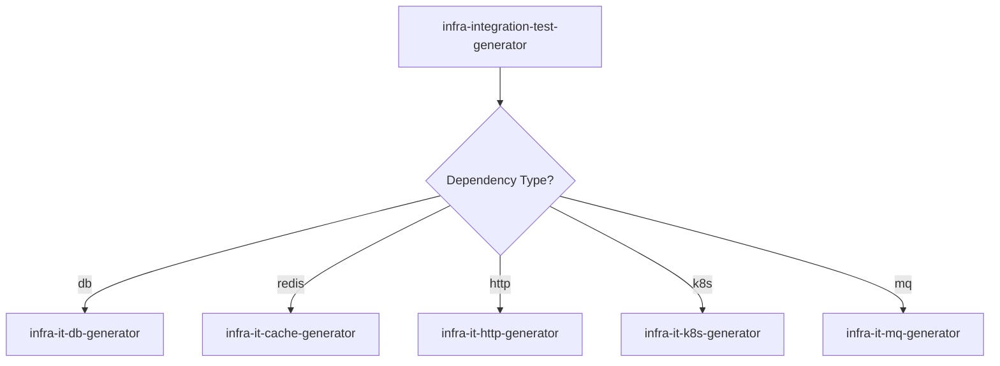

# Infra Integration Test Generator

## Overview
Routes infra integration test generation to the correct sub-skill based on external dependency type. Each dependency boundary (DB, Redis, HTTP, K8s, MQ) has a dedicated generator with Testcontainers conventions.
**REQUIRED:** Follow `GENERATOR_SKILL_STRUCTURE.md`. Variables in `VARIABLES.md`.

## When to Use
- Infra integration tests under `*-infra/src/test/java/**` that verify external dependency semantics.
- This skill is a router. Pick one sub-skill based on dependency type:
  - DB/Flyway/MyBatis: `infra-it-db-generator`
  - Redis: `infra-it-cache-generator`
  - HTTP client: `infra-it-http-generator`
  - Kubernetes SDK: `infra-it-k8s-generator`
  - MQ final-consistency: `infra-it-mq-generator`

### Don't use when
- The test is a unit test (`*Test`) — unit tests belong in the module's regular test tree, not behind the `-Pit` gate.

## Inputs Required
- Dependency type (`db|redis|http|k8s|mq`)
- Target classes and expected semantics (success/failure/retry/timeout/idempotency)
- Test scope (`L2` dependency IT by default; `L3` smoke only when explicitly requested)

## Outputs
- `{{infraModuleDir}}/src/test/java/.../<Xxx>IT.java`
- Optional support tests/classes:
  - `infra/support/BaseIntegrationTest.java`
  - `infra/support/AwaitilitySupport.java`
  - guardrail tests for Flyway/IT conventions

## Naming & Packaging
- Test class name ends with `IT` so it runs under Failsafe in `mvn clean verify`.
- Package by dependency boundary:
  - `infra/repository/**` or `infra/event/**/store/**` for DB
  - `infra/cache/**`
  - `infra/gateway/system/**`
  - `infra/event/mq/**`

## Implementation Rules
- Name tests `*IT`.
- Tests must create/cleanup their own data.
- Avoid dirty-data coupling across test runs:
  - Always cleanup tables you touched in `@BeforeEach` (or `@AfterEach`) using `DELETE`/`TRUNCATE`.
  - Generate unique ids/keys for test rows (UUID/ULID) to avoid unique-constraint conflicts.
  - Assertions must scope to the rows inserted by the test (avoid full-table counts).
- Prefer asserting semantic behavior (claiming, transitions, retries, error translation) over SQL text.
- For async eventual consistency, use Awaitility; do not use `Thread.sleep` as primary assertion.
- Keep dependency strategy aligned with the current repository's agreed integration-test architecture and conventions.
- Verification command for IT-only gate is bound to `-Pit`:
  - `mvn -pl persimmon-scaffold/persimmon-scaffold-infra -Pit clean verify`
  - `-Pit` means Maven `-P it` (profile id is `it`).

## Routing Blueprint
### 1. Route by Dependency Type
- `db` -> `infra-it-db-generator`
- `redis` -> `infra-it-cache-generator`
- `http` -> `infra-it-http-generator`
- `k8s` -> `infra-it-k8s-generator`
- `mq` -> `infra-it-mq-generator`

### 2. Pass Through Context
- Target class/package path.
- Behavior matrix (success/failure/retry/timeout/idempotency).
- Test level and execution gate requirements.

### 3. Enforce Output Contract
- Generated test class suffix must be `*IT`.
- Output package must match dependency boundary in this skill's naming rules.

## Tests
- This skill generates `*IT` tests. Verify with IT-only profile:
  - `mvn -pl persimmon-scaffold/persimmon-scaffold-infra -Pit clean verify`

## Common Mistakes
| Mistake | Why It Happens | Fix |
|---------|---------------|-----|
| Writing ITs as `*Test` | Naming convention oversight | Use `*IT` suffix so Failsafe picks them up under the IT gate |
| Running full `mvn clean verify` when only IT gate is expected | Unclear profile semantics | Use `-Pit` to run only integration tests |
| Missing Flyway baseline properties in DB ITs | Incomplete test configuration | Set `spring.flyway.baseline-on-migrate=true` and `baseline-version=0` |
| Mixing `spring.sql.init.schema-locations` with Flyway in ITs | Two schema init paths conflict | Disable SQL init (`spring.sql.init.mode=never`) when using Flyway |
| Tests that rely on empty DB state without explicitly cleaning up | Assumed clean slate between runs | Always truncate/delete touched tables in `@BeforeEach` |

## Integration
- **Called by:** `scaffold-router`
- **Pairs with:** `infra-it-db-generator`, `infra-it-cache-generator`, `infra-it-http-generator`, `infra-it-k8s-generator`, `infra-it-mq-generator`

## Phase Commit Gate

Before committing generated/updated code:
- Ensure compile and unit tests pass (minimum: `mvn clean test`).
- Run IT-only gate with `-Pit`:
  - `mvn -pl persimmon-scaffold/persimmon-scaffold-infra -Pit clean verify`
- Invoke `requesting-code-review` for the intended commit scope and resolve Critical/Important findings.
- Prefer one focused commit per phase/slice (do not batch unrelated changes).

---
> Converted and distributed by [TomeVault](https://tomevault.io/claim/ryan-alexander-zhang) — claim your Tome and manage your conversions.
<!-- tomevault:4.0:skill_md:2026-04-15 -->
