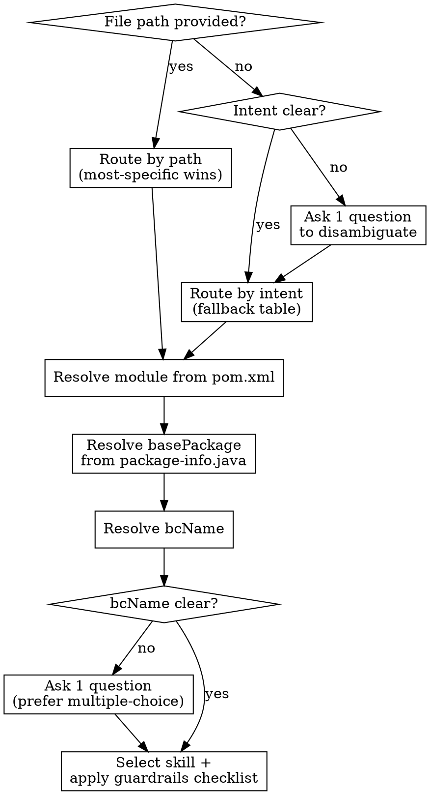

# Scaffold Router

## Overview

The single entry-point for skill selection in the Persimmon scaffold. Given a file path or user intent, it resolves the target module, package, and downstream generator skill.

**Core principle:** Route by path first; fall back to intent only when no path is available. Never guess — ask one question when ambiguous.
**Announce at start:** "I'm using the scaffold-router skill to resolve the target module, package, and downstream skill before implementation."

**REQUIRED:** Variables defined in `VARIABLES.md`. **Pairs with:** `scaffold-architecture-guardrails` (applied as checklist after routing).

## When to Use

- Choosing the Maven module, package path, or next generator skill for any code task
- User provides a vague request without specifying module or layer
- Multiple skills could apply and disambiguation is needed

**Don't use when:**
- The target skill is already known (invoke it directly)
- The task is purely documentation with no code generation

## Process

### Variable Resolution Steps

1. Resolve module directories from `pom.xml` by suffix: `-domain`, `-app`, `-infra`, `-adapter`, `-start`.
2. Resolve `{{basePackage}}` and `{{basePackagePath}}` from `package-info.java`.
3. Resolve `{{bcName}}` strictly:
   - Prefer explicit BC segment from the user path
   - Otherwise infer from first-level app/domain packages excluding `common`
   - If no candidate → ask one question; if multiple → ask with 2-3 choices
   - **Never default to `biz`** — treat `.biz` only as a reference namespace
4. Select one next skill and apply `scaffold-architecture-guardrails` as the checklist.

### Precedence Rule

When multiple path patterns match, choose the **most specific** one:
- `domain/**/model/**` / `domain/**/repository/**` override generic domain
- `app/**/command/**` / `app/**/port/**` / `app/common/event/**` / `app/common/workflow/**` override generic app
- `infra/repository/**` / `infra/query/**` / `infra/gateway/**` override generic `infra/**/po|mapper`
- Infra IT specializations override generic `src/test/java/**`
- `adapter/web/**` / `adapter/mq/**` / `adapter/scheduler/**` override generic adapter
- `start/config/bean/**` overrides generic start
- `db/migration/**` overrides generic infra

## Routing Output Contract

Every successful routing decision should hand downstream skills a compact packet:

- selected skill name
- resolved module directory
- resolved `{{basePackage}}` and `{{basePackagePath}}`
- resolved `{{bcName}}`
- path or intent basis used for the routing decision
- any ambiguity or user-confirmed choices that downstream skills must preserve

## Path → skill mapping
The mapping below is **module-agnostic**. Apply it within the selected module directory.

More specific:
- `docs/changes/**` → `dev-workflow-change-management`
- `docs/design/**` → `dev-workflow-technical-design-generator`
- `docs/implementation/slices/**` → `slice-audit-orchestrator`
- `docs/requirements/**` → `dev-workflow-requirements-doc-generator`
- `docs/stories/**` → `dev-workflow-user-story-generator`
- `**/domain/**/model/**` → `domain-model-generator`
- `**/domain/**/repository/**` → `domain-repository-port-generator`
- `**/app/{{bcName}}/command/**` → `app-usecase-generator`
- `**/app/{{bcName}}/port/**` → `app-port-generator`
- `**/app/common/event/**` → `app-common-event-generator`
- `**/app/common/workflow/**` → `app-common-workflow-generator`
- `**/db/migration/**` → `infra-flyway-migration-generator`
- `**/infra/repository/{{bcName}}/**` → `infra-bc-repository-generator`
- `**/infra/query/{{bcName}}/**` → `infra-bc-query-generator`
- `**/infra/gateway/**` → `infra-system-gateway-generator`
- `**/infra/**/po/**` or `**/infra/**/mapper/**` → `infra-mybatis-po-mapper-generator`
- `**/infra/**/store/**` → `infra-store-implementation-generator`
- `**/src/test/java/**/infra/**/repository/**` or `**/src/test/java/**/infra/**/event/**/store/**` → `infra-it-db-generator`
- `**/src/test/java/**/infra/cache/**` → `infra-it-cache-generator`
- `**/src/test/java/**/infra/gateway/system/**` with HTTP behavior → `infra-it-http-generator`
- `**/src/test/java/**/infra/gateway/system/**` with Kubernetes SDK behavior → `infra-it-k8s-generator`
- `**/src/test/java/**/infra/event/mq/**` → `infra-it-mq-generator`
- `**/src/test/java/**` with unclear dependency type → `infra-integration-test-generator`
- `**/infra/**/event/mq/**` → `infra-mq-transport-generator`
- `**/adapter/web/**` → `adapter-web-controller-generator`
- `**/adapter/mq/**` → `adapter-mq-consumer-generator`
- `**/adapter/scheduler/**` → `adapter-scheduler-job-generator`
- `qa/playwright-api/**` → `playwright-api-test-generator`
- `**/start/config/bean/**` → `start-wiring-config-generator`
- `**/start/src/main/resources/**.yml` / `**.yaml` → `start-yaml-config-generator`

## Intent → skill mapping
Use these fallback routes when the user intent is clear but the path is absent, broad, or spans multiple modules.

- Confirmed stories plus approved technical design and incremental implementation → `dev-workflow-ddd-implementation-workflow`
- EventStorming, domain event mapping, or bounded-context discovery → `dev-workflow-event-storming-workshop`
- Java unit-test authoring or unit-test refactoring → `java-unit-test-authoring`
- Java coverage, mutation, or test quality gate evaluation → `java-test-quality-gate`
- SonarQube scan execution or Sonar result download → `mvn-sonar-scan-download`
- Sonar issue remediation from downloaded results → `sonar-quality-auto-improver`
- Playwright HTTP API black-box tests or startup-after API smoke skeletons → `playwright-api-test-generator`
- Slice records, audit anchors, or implementation traceability updates → `slice-audit-orchestrator`
- Architecture/layer guardrail checks across scaffold modules → `scaffold-architecture-guardrails`
- YAML key naming or configuration schema decisions in start modules → `start-config-schema-guardrails`

## Rules

- Ask one question when routing is ambiguous; prefer multiple-choice.
- Common disambiguations: unit test vs integration test, event retry semantics, storage choice.
- `*.biz.*` packages may be used as reference examples but must not redefine target BC paths.
- This skill routes only — it must not absorb implementation, audit, or guardrail policy.
- **Context propagation:** When routing within the same implementation session (e.g., during `dev-workflow-ddd-implementation-workflow` slices), propagate resolved variables (`{{bcName}}`, `{{basePackage}}`, `{{basePackagePath}}`, module dirs) to downstream skills. Do not re-resolve variables that were already confirmed in the same session.
- **Design document as context source:** If a technical design document path is available, read it first to extract BC name, module boundaries, and domain model inventory before asking the user for disambiguation.
- **Conflict detection:** If a user provides a BC name that differs from the technical design document, flag the inconsistency and ask for clarification — do not silently use either value.
- Treat `<active-skill-root>/scripts` as non-skill support; do not register as routable.

## Stop And Ask

Stop and clarify before handing off when:

- no file path exists and the user intent still maps to multiple equally plausible skills
- the technical design and the user-provided path imply different bounded contexts
- more than one path rule has the same specificity and would choose different downstream skills
- completing the route would require inventing a package path or defaulting `{{bcName}}`

## Common Mistakes

| Mistake | Why It Happens | Fix |
|---------|---------------|-----|
| Defaulting `bcName` to `biz` | Scaffold placeholder looks like a real BC | Ask the user; `biz` is only valid if explicitly confirmed |
| Picking a generic skill when a specific one exists | Path matched multiple patterns | Always apply the most-specific precedence rule |
| Routing + implementing in one step | Eager to produce code quickly | Route first, then hand off to the selected skill |
| Skipping guardrails checklist | Seems redundant after routing | Always apply `scaffold-architecture-guardrails` after selecting a skill |

## Integration

- **Called by:** any task that needs module/skill resolution
- **Pairs with:** `scaffold-architecture-guardrails` (checklist after routing), all generator skills (downstream)

---
> Converted and distributed by [TomeVault](https://tomevault.io/claim/ryan-alexander-zhang) — claim your Tome and manage your conversions.
<!-- tomevault:4.0:skill_md:2026-04-15 -->
