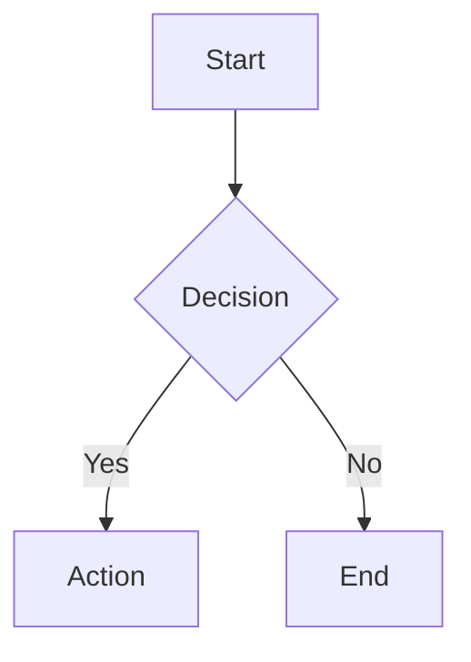

# Visual Explainer

Generate Markdown files for technical diagrams, visualizations, and data tables. Output renders natively in GitHub, GitLab, VS Code, and most Markdown viewers.

**Output language:** All generated documents should be written in Japanese.

**Proactive table rendering.** When you're about to present tabular data as an ASCII box-drawing table in the terminal (comparisons, audits, feature matrices, status reports, any structured rows/columns), generate a Markdown document instead. The threshold: if the table has 4+ rows or 3+ columns, it belongs in a Markdown file. Don't wait for the user to ask — render it as Markdown automatically and tell them the file path. You can still include a brief text summary in the chat, but the table itself should be the Markdown file.

## Workflow

### 1. Think (5 seconds, not 5 minutes)

Before writing Markdown, commit to a direction. Don't default to a generic structure every time.

**Who is looking?** A developer understanding a system? A PM seeing the big picture? A team reviewing a proposal? This shapes information density and structure.

**What type of diagram?** Architecture, flowchart, sequence, data flow, schema/ER, state machine, mind map, data table, timeline, or dashboard. Each has distinct layout needs and rendering approaches (see Diagram Types below).

**What structure?** Pick one and commit:
- Data-dense (maximum information, compact tables, minimal prose)
- Editorial (generous whitespace, clear hierarchy, narrative flow)
- Executive summary (key metrics first, details in collapsible sections)
- Technical reference (structured sections, comprehensive detail, searchable)

Vary the choice based on content. A diff review needs different structure than a project recap. An architecture overview differs from a requirements audit.

### 2. Structure

**Read the reference files** before generating. Don't memorize them — read them each time to absorb the patterns.
- For Mermaid diagram syntax: read `./references/libraries.md`
- For Markdown patterns (tables, collapsibles, status indicators): read `./references/markdown-patterns.md`
- For specific template patterns: read `./templates/*.md`

**Choosing a rendering approach:**

| Diagram type | Approach | Why |
|---|---|---|
| Architecture (topology-focused) | Mermaid `graph` | Automatic edge routing for connections between components |
| Architecture (text-heavy) | Markdown sections + tables | Rich descriptions, code references, tool lists need prose |
| Flowchart / pipeline | Mermaid `graph TD/LR` | Node positioning, decision diamonds, parallel branches |
| Sequence diagram | Mermaid `sequenceDiagram` | Lifelines, messages, and activation boxes |
| Data flow | Mermaid `graph` with edge labels | Data descriptions need automatic edge routing |
| ER / schema diagram | Mermaid `erDiagram` | Relationship lines between entities |
| State machine | Mermaid `stateDiagram-v2` | State transitions with labeled edges |
| Mind map | Mermaid `mindmap` | Hierarchical branching with automatic positioning |
| Data table | Markdown `\| table \|` | Native rendering, copy-paste behavior, accessibility |
| Comparison | Tables or `<details>` | Before/after clarity, side-by-side view |
| Timeline | Table with dates | Simple linear layout |
| Dashboard / KPI | Tables with bold values | Quick metrics overview |

**Mermaid guidelines:**
- Always use `graph TD` for top-down flows, `graph LR` for left-right pipelines
- Use subgraphs to group related components
- Keep node labels short — use a legend table for details
- Use `classDef` sparingly for highlighting important nodes
- Avoid special characters in labels (parentheses, colons, brackets can break parsing)
- For state diagrams with complex labels, use `flowchart` instead of `stateDiagram-v2`

### 3. Visual Elements

**Status indicators** — use emoji consistently throughout:
- ✅ Match / Pass / Complete / Good
- ❌ Gap / Fail / Missing / Bad
- ⚠️ Partial / Warning / Ugly / Concern
- ℹ️ Info / Neutral / Context / Current state
- ❓ Question / Unknown / Needs clarification
- 🔄 In Progress
- 🚫 Blocked
- ✨ New (added)
- 📝 Modified (changed)
- 🗑️ Deleted (removed)

**Severity indicators:**
- 🔴 High — Critical, must address
- 🟡 Medium — Should address
- 🔵 Low — Nice to have

**Tables** — for structured data. Use bold for emphasis, inline code for technical references:
```markdown
| Metric | Value |
|--------|-------|
| Lines Added | **+247** |
| Files Changed | **12** |
| Coverage | **94%** ✅ |
```

**Mermaid diagrams** — wrap in fenced code blocks:
````markdown

````

**Collapsible sections** — for secondary content that shouldn't dominate:
```markdown
<details>
<summary>📁 File Map (14 files)</summary>

Content here...

</details>
```

**Code references** — use file:line format:
```markdown
See `processData` in `src/worker.ts:45`.
```

### 4. Deliver

**Output location:**
- If a plan context exists (e.g., working on a specific plan file like `.claude/plans/YYYYMMDD-*.md`), write to `.claude/work/plans/{plan-name}/` where `{plan-name}` matches the plan filename without extension.
- Otherwise, write to `.claude/work/diagrams/`.

Use a descriptive filename based on content: `architecture.md`, `diff-review.md`, `flow.md`, `schema.md`.

Example paths:
- With plan context: `.claude/work/plans/20260218-review-rosai-diff/diff-review.md`
- Without plan context: `.claude/work/diagrams/auth-architecture.md`

Ensure the directory exists before writing (create if needed).

**Tell the user** the file path so they can open or share it.

## Diagram Types

### Architecture / System Diagrams

Two approaches depending on what matters more:

**Topology-focused diagrams** (connections matter more than descriptions): Use Mermaid. A `graph TD` or `graph LR` with subgraphs produces proper diagrams with automatic edge routing. Use when the point is showing how components connect.

**Text-heavy overviews** (descriptions matter more than connections): Use Markdown sections with tables for component details. Include Mermaid only for the high-level topology, with prose explaining each component.

### Flowcharts / Pipelines

Use Mermaid `graph TD` for top-down or `graph LR` for left-right. Decision points use diamond syntax `{text}`. Parallel branches connect to a single merge point. Color-code node types with `classDef` if needed.

### Sequence Diagrams

Use Mermaid `sequenceDiagram`. Shows actors, lifelines, messages, activation boxes, and notes. Good for API flows, authentication sequences, multi-service interactions.

### Data Flow Diagrams

Use Mermaid `graph` with edge labels for data descriptions. Style primary flows with thick edges `==>`.

### Schema / ER Diagrams

Use Mermaid `erDiagram` with entity attributes. Shows relationships with cardinality markers.

### State Machines / Decision Trees

Use Mermaid `stateDiagram-v2` for state transitions. **Caveat:** Transition labels have a strict parser — avoid colons, parentheses, `<br/>`, and special characters. If you need these, use `flowchart` with rounded nodes instead.

### Mind Maps / Hierarchical Breakdowns

Use Mermaid `mindmap` for hierarchical branching from a root node. Good for project structure, feature breakdowns, concept maps.

### Data Tables / Comparisons / Audits

Use Markdown tables. Features:
- Bold `**value**` for emphasis
- Inline `code` for technical references
- Status emoji for quick scanning
- Alignment (`:---` left, `:---:` center, `---:` right)

Use `<details>` for gap analysis, decision logs, and secondary reference sections.

### Timeline / Roadmap Views

Use a table with date column, or a simple list with timestamps. For complex timelines, consider Mermaid `gantt`.

### Dashboard / Metrics Overview

Use tables with bold values for KPI display. Include status indicators for quick scanning. Group related metrics together.

## File Structure

Every output is a single `.md` file. Structure:

```markdown
# Document Title

Brief description or context.

## 📊 Summary / Overview
Key metrics or high-level view...

## Main Sections
Detailed content with diagrams, tables...

## Reference Sections
<details>
<summary>📁 Collapsed secondary content</summary>

Details...

</details>

---

> **Note:** Callouts for important context.
```

## Quality Checks

Before delivering, verify:
- **Mermaid syntax** — diagrams render without errors. Test complex diagrams locally.
- **Table alignment** — columns properly aligned, content fits reasonably.
- **Status consistency** — same emoji used for same meaning throughout.
- **Information completeness** — document conveys what the user asked for.
- **Heading hierarchy** — logical structure (`#` → `##` → `###`), no skipped levels.
- **Collapsible usage** — secondary content collapsed, primary content visible.
- **Code references** — file paths and function names accurate.
- **Japanese output** — all prose content in Japanese as specified.

---
> Converted and distributed by [TomeVault](https://tomevault.io/claim/ryugen04) — claim your Tome and manage your conversions.
<!-- tomevault:4.0:skill_md:2026-04-13 -->
