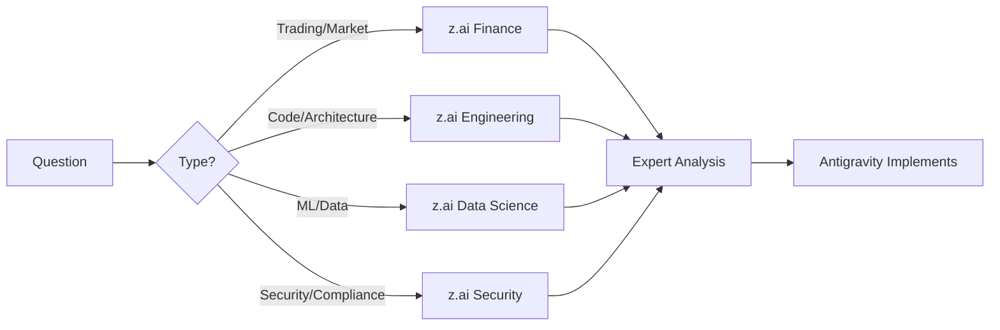

# z.ai Expert Team Integration

z.ai provides a team of domain experts accessible through the `zread` MCP server, working alongside Google Antigravity IDE.

## Configuration ✅

**Status**: Configured and ready to use

### Environment Variable (Windows PowerShell)
```powershell
# Session only
$env:Z_AI_API_KEY = "your-z-ai-key"

# Permanent (User-level)
[Environment]::SetEnvironmentVariable("Z_AI_API_KEY", "your-key", "User")
```

### MCP Server Config
Located in `.antigravity/mcp-config.json`:
```json
{
  "zread": {
    "type": "streamableHttp",
    "url": "https://api.z.ai/api/mcp/zread/mcp",
    "headers": {
      "Authorization": "${Z_AI_API_KEY}"
    }
  }
}
```

---

## Available Experts

| Expert | Domain | Best For |
|--------|--------|----------|
| 💰 **Finance** | Markets, Trading | Strategy, risk management, orderflow patterns |
| ⚙️ **Engineering** | Architecture, Code | System design, performance, debugging |
| 📊 **Data Science** | ML, Analytics | Signal processing, pattern detection, models |
| 🔐 **Security** | Compliance, Safety | API security, secrets, audit logging |

---

## When to Consult z.ai

### High-Value Scenarios

| Scenario | Expert | Example Query |
|----------|--------|---------------|
| Trading logic | Finance | "What orderflow patterns indicate institutional accumulation?" |
| System design | Engineering | "How should I structure WebSocket reconnection for HFT?" |
| ML features | Data Science | "What features best predict short-term price movements?" |
| Security review | Security | "What's the best approach for rotating API keys in production?" |

### Decision Flow



---

## Collaboration Pattern

### z.ai + Antigravity Workflow

1. **Identify domain** → Choose appropriate z.ai expert
2. **Ask specific question** → Include context and constraints
3. **Receive expert analysis** → z.ai provides recommendations
4. **Implement solution** → Antigravity writes the code
5. **Validate** → Test and verify

### Best Practices

- **Be Specific**: Include platform context (latency, scale, market)
- **Provide Constraints**: Mention requirements and limitations
- **Iterate**: Refine approach based on expert feedback
- **Document**: Record recommendations for future reference

---

## Example Usage

### Consulting Finance Expert
```
"I'm building an orderflow system for Indian equities. What footprint 
patterns should I detect to identify institutional activity, given 
the 5% circuit limit and market hours of NSE?"
```

### Consulting Engineering Expert
```
"My WebSocket connection to Alpaca drops every few hours. What's the 
best reconnection strategy for a trading system where I can't miss 
more than 1 second of L2 data?"
```

---

## Guardrails

> [!CAUTION]
> - z.ai provides **expertise**, not financial advice
> - Always validate recommendations against your requirements
> - Test thoroughly in paper trading before live deployment
> - Expert input should inform, not replace, your judgment

---
> Converted and distributed by [TomeVault](https://tomevault.io/claim/saanjaypatil78) — claim your Tome and manage your conversions.
<!-- tomevault:4.0:skill_md:2026-04-16 -->
