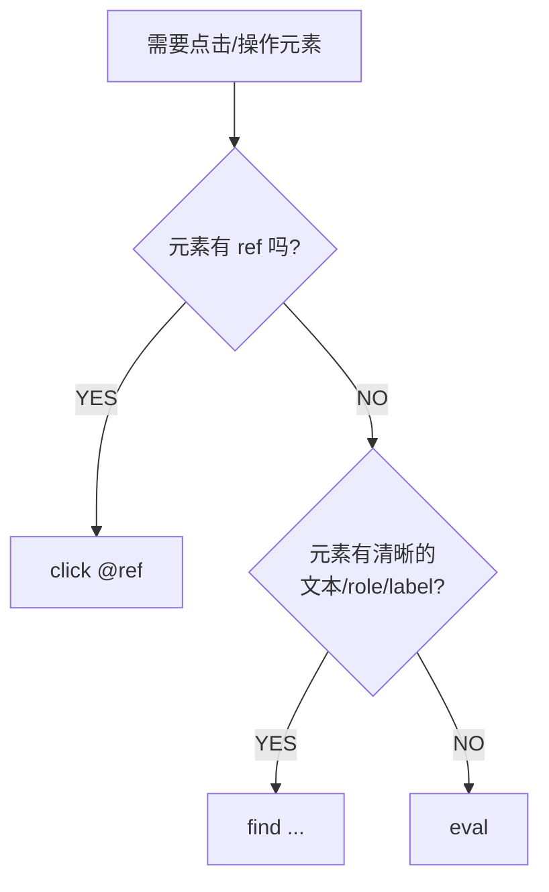

# Agent Browser Integration Testing Skill

## 技能概述

本技能让Agent-browser通过精确的原子命令控制浏览器。它采用可访问性树快照机制，为交互元素分配稳定的临时ref，即使在动态页面上也能确保元素定位的可靠性，从而能够对页面所有功能进行准确且完善的集成测试。

## 核心业务流程

**核心作业流程 (SOP - 渐进式报告)**：

1. **Init**: 参考 `references/REPORT_GUIDE.md` 的头部格式，**立即**创建报告文件，写入 Target URL 和 Date。
   - **强制**：使用 `references/REPORT_TEMPLATE.md` 作为报告骨架（复制为报告文件内容），再对报告进行**实时**填充(**边测试边填充**)。
2. **Open**: 打开目标 URL。
3. **Loop (循环执行)**:
    - **Snapshot**: 获取 ref。
    - **Action**: 执行操作。
    - **Wait & Re-Snapshot**: 处理动态变化（**严禁盲目连续操作**）。
    - **Audit**: 运行 `network requests --json`。
    - **Record (强制即时落盘)**: 依据 `REPORT_GUIDE.md` 要求，**每个关键步骤后**必须**立即写入报告文件**：
        - 关键步骤包括：登录/提交/保存等业务操作完成、页面导航、截图、网络审计获取。
        - 如有关键发现，及时记录到"**2. 关键发现**"。
        - 将操作记录追加到 "**3. 执行日志**" 表格。
        - 将 API 数据追加到 "**4. 网络交互审计**" 表格。
        - 如有截图，**必须**使用 `` 语法嵌入到"**5. 证据**" 部分。
        - **禁止**未更新报告就继续下一步操作。
4. **Finalize**: 测试结束时，完善"**1. 摘要**"、"**2. 关键发现**" 和 "**6. 建议**"，并最终核对格式。
   - **强制**：运行 `node scripts/validate-report.js <report-path>` 进行合规校验，通过后才可输出。
5. **intractable problems**: 及时参考**命令列表**寻求解决方案，或者使用`agent-browser --help`命令进行查询。

**交付标准**：***必须严格遵循*** `references/REPORT_GUIDE.md` 的格式要求生成准确且完善的测试报告。

## 报告模板与字段映射（强制）

**模板要求**：

- 报告必须从 `references/REPORT_TEMPLATE.md` 复制生成。
- **所有** `<<FILL: ...>>` 占位符必须被真实值替换，禁止保留空白或占位符。

**字段来源映射（必须遵循）**：

- **用户原始需求**：用户提问原文。
- **目标 URL**：`agent-browser open` 的 URL。
- **日期与时间**：测试完成时的真实时间（格式 `YYYY-MM-DD HH:MM:SS`）。
- **总体状态**：
  - 失败命令数 > 0 → `FAIL`
  - 失败命令数 = 0 且存在异常 API（4xx/5xx）→ `WARN`
  - 否则 → `PASS`
- **总耗时**：从 `open` 到最后一次操作的累计耗时。
- **执行的总命令数/成功/失败**：来自执行日志表统计。
- **访问的关键页面数**：`document` 导航次数或主要 URL 列表数量。
- **生成的截图数量**：证据区实际嵌入的图片数量。
- **最终页面标题/URL**：`agent-browser get title` / `agent-browser get url`。
- **网络审计 4.1/4.2/4.3**：
  - `xhr` / `fetch` → 4.1（概览）
  - 所有非 2xx + 关键业务接口 → 4.2（详情）
  - `script/stylesheet/image/font` 等静态资源 → 4.3（可选）
  - `document` 仅进入 **执行日志**，不得进入网络审计

## Report Compliance Checklist（Finalize Gate）

**以下条目必须全部满足，否则禁止输出报告**：

- 报告头部 5 项信息全部填写（需求、URL、时间、状态、耗时）。
- 章节结构完整且顺序一致：1~6 及 4.1/4.2/4.3。
- 执行日志表格存在且至少包含 `open` 与最后一步操作。
- 4.1 仅包含 `xhr/fetch`；`document` 只在执行日志。
- 4.2 覆盖所有非 2xx 与关键业务接口。
- 证据区截图全部使用 ``，并配图注。
- 执行日志与网络审计为**逐步增量更新**，不得集中回填。
- 报告中不得残留任何 `<<FILL: ...>>` 占位符。
- 报告必须为最终内容本体，不附加额外解释。

## 命令列表

> **快速导航**：
> - 常用命令 → 见下方各小节
> - 下拉框操作 → [3.5 下拉框操作专项](#35-下拉框操作专项) 或 [完整指南](references/AGENT-BROWSER-DROPDOWN-GUIDE.md)

### 1. 打开页面

打开新的浏览器会话并导航到指定URL。

```Bash
agent-browser open "https://example.com/login"
```

### 2. 页面快照（相当于Inspect）

返回带有唯一ref的交互元素结构视图。

```Bash
agent-browser snapshot -i --json
```

**推荐参数**：

- -i：仅交互元素（输入框、按钮、链接等）
- --json：结构化JSON输出
- -c：紧凑模式（最小化输出）
- -d N：限制树深度

**示例输出（JSON）**：

```JSON
{
  "elements": [
    {
      "ref": "@e1",
      "role": "textbox",
      "name": "Username",
      "placeholder": "Enter username"
    },
    {
      "ref": "@e2",
      "role": "textbox",
      "name": "Password",
      "type": "password"
    },
    {
      "ref": "@e3",
      "role": "button",
      "name": "Login"
    }
  ]
}
```

### 3. 执行动作

所有动作均支持使用ref（@eX）以获得最高可靠性。

**1.使用ref的常见动作**：

```Bash
# ============ click @ref 示例============
agent-browser fill @e1 "testuser"
agent-browser fill @e2 "P@ssw0rd123"
agent-browser click @e3
agent-browser wait --load networkidle
agent-browser screenshot after-login.png
agent-browser snapshot -i
```

**2.语义定位（无ref时的备选方案，**ref操作失败后强制尝试备选方案**）**：

```Bash
 # ============ find 示例============
agent-browser find text "Please select" click
agent-browser find role button click --name "Submit"
agent-browser find label "Email" fill "user@test.com"
agent-browser find placeholder "Search" fill "query"
agent-browser find first ".item" click
agent-browser find nth 2 ".option" click
```

**3.执行JavaScript操作参考（ref和语义定位均失败时，**必须尝试此方法**）**

```bash
  # ============ eval 示例============
  # 点击
  agent-browser eval "document.querySelector('.btn').click()"

  # 填写
  agent-browser eval "document.querySelector('input').value = 'text'"

  # 查找并点击
  agent-browser eval "Array.from(document.querySelectorAll('.item')).find(i => i.textContent
  === 'X').click()"

  # 获取值
  agent-browser eval "document.querySelector('.selected').textContent"

  # 设置状态
  agent-browser eval "window.scrollTo(0, 500)"
```

**4.选择决策树**



**其他实用动作**：

- agent-browser type @e1 "extra text"（不清除直接追加输入）
- agent-browser press Enter
- agent-browser wait 3000（毫秒）
- agent-browser wait --text "Welcome back"
- agent-browser get text @e4（提取文本用于验证）
- agent-browser get url
- agent-browser get title
- agent-browser --help（未知操作查询命令，针对未知操作的命令进行查询）

#### 3.5 下拉框操作专项

下拉框是网页测试中的常见复杂交互，分为**原生下拉框**和**自定义下拉框组件**两种类型。

**快速决策**：
```bash
# 步骤1：识别类型
agent-browser snapshot -i

# 步骤2：根据类型选择操作
原生下拉框（看到 combobox/option）→ agent-browser select @e8 "值"
自定义下拉框（只有触发器）→ 参考[下拉框操作完整指南](references/AGENT-BROWSER-DROPDOWN-GUIDE.md)
```

> **详细指南**：遇到复杂下拉框问题时，请查阅 [`references/AGENT-BROWSER-DROPDOWN-GUIDE.md`](references/AGENT-BROWSER-DROPDOWN-GUIDE.md) 获取完整的操作指南、示例脚本和故障排查方法。

### 4. 网络监控（关键）

获取自页面加载以来捕获的所有网络请求数据。建议在关键操作后调用。

```bash
# 获取请求列表（推荐使用 JSON 以便解析）
agent-browser network requests --json
```

**用途**：用于填充测试报告中的"网络交互审计"部分，特别是检查 4xx/5xx 错误。
**输出示例**：

```json
[
  {
    "url": "https://example.com/api/login",
    "method": "POST",
    "type": "xhr",
    "status": 200,
    "duration": 350
  },
  {
    "url": "https://example.com/static/main.js",
    "method": "GET",
    "type": "script",
    "status": 200,
    "duration": 120
  }
]
```

### 5. 截图与验证

```Bash
agent-browser screenshot result.png --full
agent-browser get text "body" > page-content.txt
```

### 6. 关闭会话

```Bash
agent-browser close
```

## 最佳实践
- **始终先执行快照**：使用最新快照中的ref，绝不猜测选择器。
- **页面变化后必须重新快照**：导航、点击或表单提交会使之前的ref失效。
- **优先使用ref而非CSS/文本**：ref具有确定性和稳定性。
- **将复杂流程拆分为多个步骤**：便于调试和验证中间状态。
- **处理动态元素（如下拉框/弹窗）**：
    - ❌ **错误做法**：试图一次性完成（`click @e1 + click @e2`）。
    - ✅ **正确做法**：分步执行（点击 @e1 -> wait -> **snapshot** -> 点击新生成的 @ref）。
    - 📖 **下拉框专项**：下拉框操作有专门的[完整指南](references/AGENT-BROWSER-DROPDOWN-GUIDE.md)，涵盖原生/自定义下拉框的识别、操作和故障排查。
- **渐进式记录（Progressive Reporting）**：
    - ❌ **错误**：做完所有测试步骤后，凭记忆一次性写报告。
    - ✅ **正确**：每个关键步骤后**立即写入报告文件**（执行日志、网络审计、证据/截图、关键发现同步更新），同时**必须**参考
      `references/REPORT_GUIDE.md` 验证当前填充是否符合指导规范(**强制**)。这样即使中途崩溃，数据也不会丢失。
- **报告生成**：将快照、动作结果和截图汇总为可读的Markdown文件，保存到用户所在项目根目录的
  `testing-report/report-{timestamp}/` 目录下（**强制**务必遵循`references/REPORT_GUIDE.md` 中的格式和要求），文件名格式为
  `yyyyMMddHHmmss-{business name}-report.md`（其中 timestamp 和文件名中的时间戳为测试开始时间，business name
  为根据测试业务主题自定义的名称）。
- **未知操作查询**：如需某个操作却不知道使用什么命令，**必须**优先使用`agent-browser`命令进行查询，再执行或处理。

**示例报告模板**：强制参考 `references/REPORT_GUIDE.md` 中的格式和要求为用户生成完善且符合要求的测试报告 Markdown 文件，方便用户归档和分享。

---
> Converted and distributed by [TomeVault](https://tomevault.io/claim/sancodeee) — claim your Tome and manage your conversions.
<!-- tomevault:4.0:skill_md:2026-04-13 -->
