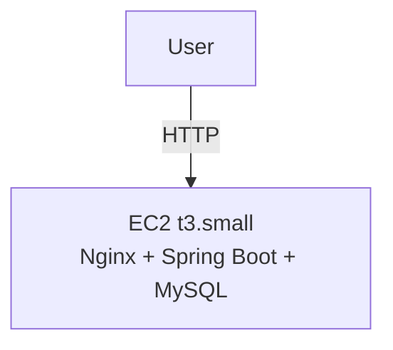
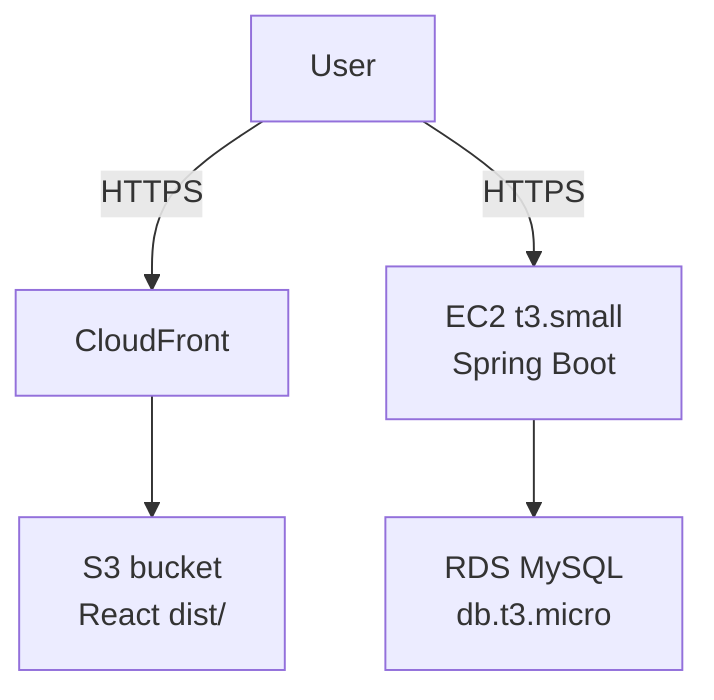

# Terraform Standards

## Deployment Planning

Before writing any Terraform, produce a deployment plan at `generated-docs/architecture/deployment-plan.md`. This is a human gate -- no Terraform code until the human approves.

### Document structure

The plan must open with a consolidated AWS components table immediately after the status header -- before any narrative sections (prerequisites, apply steps, etc.). This is the only place cost information appears; do not add a separate cost section later in the document.

| Component | AWS Service | Configuration | Est. Monthly Cost |
|-----------|-------------|---------------|-------------------|
| App server | EC2 | t3.small, us-west-1 | $15.18 |
| Block storage | EBS | 20 GB gp3, root volume | $1.60 |
| Static IP | Elastic IP | Attached to running instance | $0 |
| Secrets | SSM Parameter Store | Standard tier | $0 |
| **Total** | | | **$16.78** |

Rules for this table:
- One row per provisioned component.
- Use `$0` for free-tier or zero-cost resources -- never write "free" or omit the row.
- Include a **Total** row at the bottom.
- Costs are estimates based on the region and instance type chosen in Step 1.

The plan must also include a `### Local artifacts created` subsection as the **last subsection under the prerequisites section** (`## 1. Prerequisites`). DevOps populates this table as the plan is written -- one row per artifact created locally during setup, whether by the agent or by the human following instructions. This table is the authoritative teardown checklist.

| Artifact | Path / Location | Created by | Notes |
|----------|-----------------|------------|-------|
| SSH private key | `~/.ssh/<key-name>` | Human (section 1.X) | Never commit |
| SSH public key | `~/.ssh/<key-name>.pub` | Human (section 1.X) | Referenced by Terraform |
| terraform.tfvars | `src/infra/terraform.tfvars` | Human (section 1.X) | Gitignored; may contain credentials |
| SSM parameter: `<name>` | `/<prefix>/<name>` (region: X) | Human (section 1.X) | One row per parameter |

Rules for this table:
- Replace all `<placeholders>` with the actual names, paths, and section numbers used in the plan.
- Use "Agent" or "Human (section N)" in the Created by column so the teardown owner knows the origin of each artifact.
- Include every local artifact -- SSH keys, `terraform.tfvars`, SSM parameters, Secrets Manager secrets, any other manually provisioned items.
- Do not omit rows to keep the table tidy. An incomplete table is worse than a long one.

### Step 1: Resolve decisions with the human

Use `AskUserQuestion` to settle these before drafting anything:

- Custom domain or raw AWS URLs?
- Same server or separate BE/FE?
- DB: managed (RDS) or on-EC2 MySQL?
- EC2 instance size and monthly budget ceiling?
- Region?
- HTTPS now or later? (ACM cannot issue certs for raw AWS hostnames -- HTTPS requires a custom domain)
- Database name and DB username the app should connect as? (needed to generate `scripts/db-init.sql`)

### Step 2: Code changes required before provisioning

Call out required code changes in the plan before any AWS work. For a Java/React/MySQL stack:

- Externalize datasource credentials to environment variables per the `java-springboot` skill
- Externalize frontend API base URL to a Vite env var (`VITE_API_URL`)
- Nginx config required if serving FE from EC2

### Step 3: Build strategy

Build locally, deploy artifacts. Run `mvn package -DskipTests` (fat jar) and `npm run build` (`dist/`) on the developer machine, then upload to EC2. Do not install build tools on EC2 -- keeps the instance lean and avoids burning t3.small CPU on Maven. For teams that need CI/CD pipelines, that is a separate infrastructure concern beyond this plan.

### Step 4: Secrets management

Credentials must never be hardcoded in `application.properties`, Terraform, or `user_data`. Store all secrets in AWS SSM Parameter Store (free tier):

- `SPRING_DATASOURCE_URL`
- `SPRING_DATASOURCE_USERNAME`
- `SPRING_DATASOURCE_PASSWORD`

Terraform reads these from SSM at provision time and injects them as environment variables into the BE app via a systemd unit file. The app reads them as standard Spring Boot env vars.

### Step 4a: OTEL agent on EC2

The OTEL Java agent jar must be present on the instance and wired into the systemd unit. Bundle the jar in the deployment artifact (alongside the fat jar) -- do not download it at runtime.

In the systemd unit file (generated by Terraform `user_data` or uploaded via provisioner):

```ini
[Service]
Environment="JAVA_TOOL_OPTIONS=-javaagent:/opt/app/opentelemetry-javaagent.jar"
Environment="OTEL_SERVICE_NAME=my-service"
Environment="OTEL_LOGS_EXPORTER=otlp"
EnvironmentFile=/opt/app/otel.env
ExecStart=/usr/bin/java -jar /opt/app/app.jar
```

Store `OTEL_EXPORTER_OTLP_ENDPOINT` in SSM (not hardcoded) -- it differs between staging and prod -- and write it to `/opt/app/otel.env` at provision time alongside the datasource credentials. This keeps all environment-specific config in one place.

For ECS (Fargate or EC2-backed), set the agent in the container definition environment block and use a sidecar OTEL Collector container in the same task definition:

```json
{
  "environment": [
    { "name": "JAVA_TOOL_OPTIONS", "value": "-javaagent:/opt/otel/opentelemetry-javaagent.jar" },
    { "name": "OTEL_SERVICE_NAME", "value": "my-service" },
    { "name": "OTEL_EXPORTER_OTLP_ENDPOINT", "value": "http://localhost:4317" },
    { "name": "OTEL_LOGS_EXPORTER", "value": "otlp" }
  ]
}
```

The agent jar must be baked into the Docker image -- see the `java-springboot` skill for the Dockerfile pattern.

### Step 5: DB initialisation (on-EC2 MySQL only)

After MySQL is installed, a one-time setup script creates the database and app user. Generate `scripts/db-init.sql` using the database name and username collected in Step 1:

```sql
CREATE DATABASE <db_name>;
CREATE USER '<db_user>'@'localhost' IDENTIFIED BY '<db_password>';
GRANT ALL PRIVILEGES ON <db_name>.* TO '<db_user>'@'localhost';
FLUSH PRIVILEGES;
```

The password is never hardcoded -- it comes from SSM Parameter Store. Run this script once manually after provisioning; do not commit credentials into it.

### Step 6: Always present two options

The plan must offer both:

- **Minimalist** -- lowest cost, fewest AWS services, suitable for testing
- **Production-grade** -- reasonable operational quality, with explicit rationale for each service added beyond minimalist

#### Concrete example: Java + React + MySQL on AWS (us-west-1, past free tier, raw AWS URLs, $30/mo ceiling)

| Decision | Minimalist (~$15/mo) | Production-grade (~$30/mo) |
|---|---|---|
| FE hosting | Nginx on single EC2 | S3 + CloudFront |
| BE hosting | Same EC2 as FE | Separate EC2 |
| DB | MySQL on EC2 | RDS MySQL db.t3.micro |
| EC2 size | t3.small | t3.small |
| Secrets | SSM Parameter Store | SSM Parameter Store |
| HTTPS | HTTP only | Add when custom domain exists |
| Region | us-west-1 | us-west-1 |

Rationale for production extras: S3 + CloudFront separates static asset serving from compute (independent scaling, CDN caching, no EC2 restarts affecting FE); RDS gives automated backups, point-in-time recovery, and eliminates manual MySQL administration on the instance.

### Step 7: Mermaid diagrams

Include a `graph TD` diagram for each option in the plan MD showing components and traffic flow. Example:

````markdown



````

---

## Bootstrap script conventions

### Split installs by concern

Never bundle unrelated packages onto a single install line. One failure must not abort unrelated installs:

```bash
dnf install -y java-21-amazon-corretto   # runtime
dnf install -y mariadb105-server         # database
dnf install -y nginx                     # web server
```

### Use known-good package names for the target OS

Package names differ across distributions. Do not guess from memory -- use the reference below. If the target OS is not listed, state the assumption explicitly in the deployment plan and flag it as unverified.

| Package | AL2023 | Ubuntu 22.04 |
|---------|--------|--------------|
| Java 21 | `java-21-amazon-corretto` | `openjdk-21-jdk` |
| MySQL server | `mariadb105-server` | `mysql-server` |
| MySQL client | `mariadb105` | `mysql-client` |
| Nginx | `nginx` | `nginx` |
| AWS CLI | pre-installed | `awscli` |
| Node.js 20 | `nodejs20` (via `dnf module`) | `nodejs` (via NodeSource PPA) |

Verify whether a package is pre-installed on the AMI before installing (e.g. `aws-cli` ships on AL2023 -- a redundant install is harmless but signals the agent did not check).

---

## Post-apply verification

Terraform exit code 0 confirms resource creation, not that the bootstrap script succeeded or the instance is functional. After every `terraform apply`, the agent must SSH in and verify before marking any delivery tracker step complete.

### Step 1: Check cloud-init

```bash
sudo grep -E "error|fail|Error|Fail" /var/log/cloud-init-output.log
sudo tail -20 /var/log/cloud-init-output.log
```

Look for the final line: `Cloud-init ... finished` with no errors. If errors are present, read the surrounding context to identify which install or command failed.

### Step 2: Verify each expected service is active

```bash
systemctl is-active <service>   # returns "active" or "failed"/"inactive"
```

Run this for every service the bootstrap script was supposed to start (e.g. `mysqld`/`mariadb`, `nginx`, the app service). A `failed` or `inactive` result means the step is not complete.

### Step 3: Verify runtimes and directories

```bash
java -version
node --version       # if applicable
ls /opt/<app>/       # app directory exists
systemctl cat <app>  # systemd unit is registered
```

### Step 4: Agentic recovery on failure

If any verification check fails, attempt one autonomous recovery before escalating:

- Missing package: install it directly via SSH (`sudo dnf install -y <package>`)
- Service not started: check the journal (`sudo journalctl -u <service> -n 50`), fix the root cause, then `sudo systemctl start <service>`
- Missing directory or unit: recreate it

After one recovery attempt, re-run the relevant verification checks. If they pass, continue. If they still fail, stop immediately and notify the human:

> Provisioning verification failed after one recovery attempt.
> Failed check: [what was checked]
> Recovery attempted: [what was done]
> Current state: [what the logs/systemctl show]
> Manual action needed: [specific next step for the human]

### Step 5: Generate the infra verification artifact and open it for human review

Once all verification checks pass, generate `generated-docs/ops/infra-verification.md`, then wait for explicit human approval before advancing the stage.

#### Required sections

**1. Verify these links**

A table of every human-accessible endpoint, populated with the actual provisioned IP or hostname (never placeholders). Derive endpoints from the HLD and API contract -- omit rows that do not apply to the stack.

| What | URL | Expected |
|------|-----|----------|
| Frontend | http://\<ip\> | Login/home page loads |
| API health | http://\<ip\>/api/actuator/health | `{"status":"UP"}` |
| Swagger UI | http://\<ip\>/api/swagger-ui/index.html | Swagger UI loads |

If an endpoint is not yet accessible because app deployment has not happened, note it explicitly (e.g. "Pending app deployment -- expected 403 until JAR is uploaded").

**2. Infrastructure status**

Populated from the verification checks already performed. Flag any failed or missing component.

| Component | Expected | Actual |
|-----------|----------|--------|
| EC2 instance | Running | [from terraform output] |
| Elastic IP | Allocated | [ip] |
| MariaDB | Active | [active / failed] |
| Nginx | Active | [active / failed] |
| Java 21 | Installed | [version or missing] |
| app.service | Registered | [registered / missing] |

**3. Human verification checklist**

```markdown
- [ ] SSH access confirmed
- [ ] Each service listed above is active
- [ ] Each URL in the links table returns the expected result
```

**4. Known issues**

Document any automated check that failed and was recovered, or any component intentionally not yet set up. Plain language, one paragraph per item.

#### Gate behavior

1. Output the full content of `infra-verification.md` in the response, then use `AskUserQuestion` to ask for approval (options: **Approve** / **Request changes**).
3. On approval: write `Status: Approved — Human` and `Approved: YYYY-MM-DD` at the top of `infra-verification.md`.
4. Only then check off the provisioning stage in the delivery tracker.

Do not check off any delivery tracker step or advance the stage until the human explicitly approves this artifact.

---

## Module structure

Split resources into focused modules by concern. Each module uses the standard HashiCorp file layout:

```
infra/
├── modules/
│   ├── network/
│   │   ├── terraform.tf   # version requirements
│   │   ├── providers.tf   # provider configurations
│   │   ├── main.tf        # primary resources and data sources
│   │   ├── variables.tf   # input variable declarations
│   │   ├── outputs.tf     # output value declarations
│   │   └── locals.tf      # local value declarations
│   ├── compute/
│   └── security/
└── environments/
    ├── dev/
    └── prod/
```

| File | Purpose |
|---|---|
| `terraform.tf` | Terraform version + required providers |
| `providers.tf` | Provider configurations |
| `main.tf` | Primary resources and data sources |
| `variables.tf` | Input variable declarations |
| `outputs.tf` | Output value declarations |
| `locals.tf` | Local value declarations |

---

## Parameterize everything

No hardcoded values -- regions, ports, instance types, and names all go in `variables.tf`:

```hcl
variable "instance_type" {
  description = "EC2 instance type for the app server"
  type        = string
  default     = "t3.medium"
}
```

---

## Output contracts

Expose useful outputs (IPs, ARNs, DNS names) via `outputs.tf` so modules compose cleanly:

```hcl
output "db_endpoint" {
  description = "RDS instance endpoint"
  value       = aws_db_instance.main.endpoint
}
```

---

## Provider and version pinning

Version requirements go in `terraform.tf`, provider config goes in `providers.tf`. Always pin both to avoid surprise upgrades.

```hcl
# terraform.tf
terraform {
  required_version = "~> 1.7"

  required_providers {
    aws = {
      source  = "hashicorp/aws"
      version = "~> 6.0"
    }
  }
}
```

```hcl
# providers.tf
provider "aws" {
  region = var.region
}
```

---

## Naming and tagging

Use `var.project`-`var.env` prefixes on all resource names. Tag every resource with at minimum:

```hcl
tags = {
  project    = var.project
  env        = var.env
  managed-by = "terraform"
}
```

---

## Remote state

Use S3 + DynamoDB lock for any shared or production state. Never commit `.tfstate` files.

```hcl
terraform {
  backend "s3" {
    bucket         = "my-project-tfstate"
    key            = "prod/terraform.tfstate"
    region         = "us-east-1"
    dynamodb_table = "terraform-locks"
    encrypt        = true
  }
}
```

---

## IAM -- least privilege

Scope IAM policies to specific actions and resources. No `*` wildcards unless unavoidable and explicitly documented with a justification comment.

```hcl
# Bad
actions   = ["s3:*"]
resources = ["*"]

# Good
actions   = ["s3:GetObject", "s3:PutObject"]
resources = ["arn:aws:s3:::my-bucket/*"]
```

---

## Sensitive variables

Mark secrets with `sensitive = true`. Never set a default. Source values from SSM Parameter Store or Secrets Manager -- never hardcode.

```hcl
variable "db_password" {
  description = "RDS master password"
  type        = string
  sensitive   = true
}
```

---

## Security groups

Explicit ingress and egress rules only. No `0.0.0.0/0` on SSH or admin ports. Prefer referencing security group IDs over CIDR blocks for internal traffic.

```hcl
# Bad -- open SSH to the world
ingress {
  from_port   = 22
  to_port     = 22
  protocol    = "tcp"
  cidr_blocks = ["0.0.0.0/0"]
}

# Good -- SSH only from bastion SG
ingress {
  from_port       = 22
  to_port         = 22
  protocol        = "tcp"
  security_groups = [aws_security_group.bastion.id]
}
```

---

## Before applying

Run these four steps in order every time:

```bash
terraform fmt -recursive   # format all files consistently
terraform validate         # catch syntax and reference errors
terraform plan             # review what will change
terraform apply            # make it so
```

Never skip steps. Never apply without a reviewed plan. Include the `terraform plan` resource summary in the commit body for any resource-affecting change.

---

## Teardown Protocol

Follow these steps in order every time teardown is requested. Do not stop after `terraform destroy`.

### Step 1: Destroy Terraform-managed resources

```bash
terraform destroy -auto-approve
```

### Step 2: Delete external resources not tracked in Terraform state

Resources commonly created alongside infra but not managed by Terraform (e.g. SSM Parameter Store entries, Secrets Manager secrets, manually created IAM policies or roles outside the module). Use the **Local artifacts created** table in the deployment plan's prerequisites section as the authoritative checklist -- delete each item listed there explicitly using the cloud provider CLI.

Example (AWS):
```bash
aws ssm delete-parameters --names "/myapp/db_password" "/myapp/api_key"
aws secretsmanager delete-secret --secret-id myapp/jwt-secret --force-delete-without-recovery
```

### Step 3: Verify via cloud CLI (100% confirmation required)

Do not trust the destroy output alone. Query the provider directly for each resource class that was provisioned. Only proceed to Step 4 after all queries confirm the resources are gone.

Example (AWS):
```bash
# EC2
aws ec2 describe-instances --filters "Name=tag:project,Values=<project>" --query 'Reservations[*].Instances[*].InstanceId'
# Elastic IPs
aws ec2 describe-addresses --filters "Name=tag:project,Values=<project>"
# Security groups
aws ec2 describe-security-groups --filters "Name=tag:project,Values=<project>"
# Key pairs
aws ec2 describe-key-pairs --key-names <name>
# IAM
aws iam get-role --role-name <name>
# SSM parameters
aws ssm get-parameters-by-path --path /<prefix>/
# Terraform state must be empty
terraform state list
```

Adapt the queries to the provider and resource classes actually used in the project. The principle is the same regardless of cloud: query independently, confirm empty results for each class.

### Step 4: Delete local artifacts

| Artifact | Path | Reason |
|---|---|---|
| SSH private key | `~/.ssh/<key-name>` | Host is gone; key has no valid target |
| SSH public key | `~/.ssh/<key-name>.pub` | Same |
| Terraform state | `src/infra/terraform.tfstate` | Stale after destroy |
| Terraform state backup | `src/infra/terraform.tfstate.backup` | Same |
| Terraform vars | `src/infra/terraform.tfvars` | May contain credentials; must not persist after environment is gone |
| Provider cache | `src/infra/.terraform/` | No secrets; safe to keep or delete |

Adjust paths to match the project's actual layout (resolved from `my-project-config.md` File locations table).

---
> Source: [sans-github/agents](https://github.com/sans-github/agents) — distributed by [TomeVault](https://tomevault.io).
<!-- tomevault:4.0:skill_md:2026-06-23 -->
