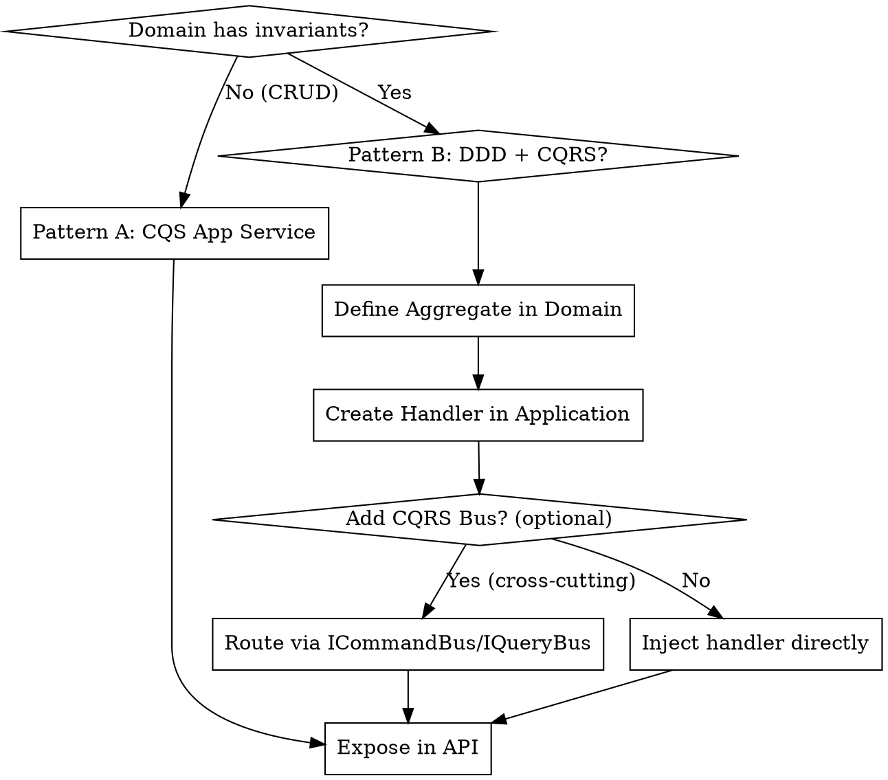

# Clean Architecture in .NET

## Overview

Clean Architecture organizes code into independent layers (Domain → Application → Infrastructure → API).

**The Iron Law**: Violating layer boundaries is a failure. If API references Application or Domain references Infrastructure, delete the change and start over.

> **Concrete violations that break the Iron Law:**
> - `using MyApp.Infrastructure;` in a Domain class — Infrastructure must never flow inward.
> - `using MyApp.Application;` in an API endpoint file — API must only interact via `ICommandBus` / `IQueryBus` or an injected use case interface.
> - `new AppDbContext()` inside a Controller — bypasses both Infrastructure and Application layers.
> - `HttpClient` injected directly into a Domain or Application class — HTTP belongs in Infrastructure behind an interface.
>
> **Fix:** move the dependency to the correct outer layer and expose it through an interface pointing inward.

## When to Use

- Business logic is leaking into Controllers or Repositories
- Circular dependencies occur between projects
- Need to isolate core business rules from external frameworks (EF Core, APIs)
- Autonomy is required: sealed Domain objects, strongly-typed IDs

**When NOT to add CQRS or DDD:**
- The feature is pure CRUD with no business rules, no invariants, and no domain events → use a CQS Application service (see Pattern A below)
- A query only reads data with no domain logic → inject the repository or a read service directly in the Application handler; no `IQueryBus` required
- You have fewer than 3 use cases with no cross-cutting concerns (logging pipeline, validation pipeline) → a CQRS bus adds ceremony without value

## CQS vs CQRS vs DDD — Complexity Threshold

These three patterns are independent tools. Choose based on what the codebase actually needs.

| Pattern | Rule | Add it when… | Skip it when… |
|---------|------|--------------|---------------|
| **CQS** *(always)* | Every handler/method is either a command (void) or a query (returns value) — never both | Always — zero exceptions | Never skip |
| **CQRS + Bus** *(optional)* | Separate `ICommandBus` / `IQueryBus` routing commands and queries through a pipeline | Cross-cutting concerns (validation, logging pipelines), large teams writing many use cases, read/write model asymmetry | Simple CRUD; < 3 use cases; no cross-cutting pipeline needed |
| **DDD** *(optional)* | Aggregates, factory methods, value objects, domain events | Domain has invariants (rules that must be enforced on every state change), state machines, rich business logic | Entities are pure data (no `if`/`throw` to protect state); CRUD-only feature |

**Quick rule of thumb:**
> "Does this feature have a business rule that could be violated?"  
> — No → CQS Application Service (Pattern A).  
> — Yes → Domain Aggregate + CQS or CQRS depending on scale (Pattern B).

## DDD vs POCO — Quick Decision

| Use | When |
|-----|------|
| `sealed class Foo : AggregateRoot` + factory method | The object has domain invariants, raises events, or owns child entities |
| Plain `sealed record Foo(...)` (POCO) | Pure data carrier, no invariants, used only inside Application or API (DTOs, ViewModels) |
| `sealed class Bar : ValueObject` | Immutable, identity-by-value, represents a domain concept (e.g., `PolicyNumber`, `Horsepower`) |

**Rule of thumb:** if you're tempted to add an `if` or `throw` to protect the object's state — it's a Domain object (aggregate or value object), not a POCO.

> **Aggregate vs POCO test:** write the business method first. If you never need `if (condition) throw new DomainException(...)` to protect state, the object has no invariants — make it a plain `sealed record`, not an `AggregateRoot`. DDD complexity is the cure for invariants, not for data.

## Implementation Flow



## Core Patterns

### Pattern A: CQS Application Use Case (Simple / CRUD)

Use when the feature has no business invariants. Layer boundaries are maintained — no CQRS bus needed.

**CQS rule:** each method is either a command (void / `Task`) or a query (returns a value) — never both.

**Naming:** call it `*UseCase`, not `*Service`. "Service" implies stateful or cross-cutting infrastructure; a use case class orchestrates one bounded interaction.

```csharp
// Application/Contacts/ContactUseCase.cs — plain use case, no bus
public sealed class ContactUseCase
{
    private readonly IContactRepository _repository; // interface defined in Application (see Interface Placement)

    public ContactUseCase(IContactRepository repository)
    {
        _repository = repository;
    }

    // Command — void (CQS)
    public async Task CreateAsync(Guid id, string name, CancellationToken ct)
    {
        await _repository.AddAsync(new Contact(new ContactId(id), name), ct);
    }

    // Query — maps domain object to ViewModel in the use case (Option 1)
    public async Task<ContactViewModel?> GetByIdAsync(Guid id, CancellationToken ct)
    {
        var contact = await _repository.FindAsync(new ContactId(id), ct);
        return contact is null ? null : new ContactViewModel(contact.Id.Value, contact.Name);
    }
}

// API/ContactsEndpoints.cs — inject the use case directly (no bus)
app.MapPost("/contacts", async (CreateContactRequest req, ContactUseCase uc) =>
{
    var id = Guid.NewGuid();
    await uc.CreateAsync(id, req.Name, default);
    return Results.Created($"/contacts/{id}", null);
});

app.MapGet("/contacts/{id:guid}", async (Guid id, ContactUseCase uc) =>
    await uc.GetByIdAsync(id, default) is { } vm ? Results.Ok(vm) : Results.NotFound());
```

**Option 2 — read-optimized query:** for read-heavy paths, skip the domain object entirely. Define a dedicated read interface in Application; Infrastructure implements it directly (e.g., a raw SQL/EF projection).

```csharp
// Application/Contacts/IContactReadService.cs — interface in Application, no domain object involved
public interface IContactReadService
{
    Task<ContactViewModel?> GetByIdAsync(ContactId id, CancellationToken ct = default);
}

// Infrastructure/Contacts/ContactReadService.cs — implementation maps directly from DB row to ViewModel
public sealed class ContactReadService : IContactReadService
{
    private readonly AppDbContext _db;

    public ContactReadService(AppDbContext db)
    {
        _db = db;
    }

    public async Task<ContactViewModel?> GetByIdAsync(ContactId id, CancellationToken ct)
    {
        return await _db.Contacts
            .Where(c => c.Id == id.Value)
            .Select(c => new ContactViewModel(c.Id, c.Name))
            .FirstOrDefaultAsync(ct);
    }
}
```

> **Rule of thumb:** `IContactRepository` (write path) returns domain objects. `IContactReadService` (read path) returns ViewModels. Both interfaces live in Application; implementations live in Infrastructure.

### Pattern B: CQRS + DDD (Complex Domains)

Use when the domain has invariants, state transitions, or events. CQRS bus is optional even here — add it when you need a cross-cutting pipeline.

> **Add `ICommandBus` / `IQueryBus` only when ALL of the following are true:**
> 1. You need a **cross-cutting pipeline** for ALL commands/queries (e.g., logging every command, input validation via pipeline behaviours, performance metrics).
> 2. You have **multiple use cases** (>3) that all benefit from this pipeline — the overhead is justified by scale.
> 3. Your read and write models are **structurally different** (CQRS read-model separation), or your team is large enough that different people own the command and query paths.
>
> If only one condition is true, use a decorator or middleware instead — don't build a bus for a single use case.

**CQS rule for commands:** a command must be void — it does not return a value. The caller is responsible for generating the ID and including it in the command.

```csharp
// Application/Features/Orders/PlaceOrderCommand.cs — ID is part of the command
public sealed record PlaceOrderCommand(OrderId OrderId, string CustomerName);

// Application/Features/Orders/PlaceOrderCommandHandler.cs
public sealed class PlaceOrderCommandHandler : ICommandHandler<PlaceOrderCommand>
{
    private readonly IOrderRepository _repository; // IOrderRepository defined in Domain (write path) — see Interface Placement
    
    public async Task HandleAsync(PlaceOrderCommand cmd, CancellationToken ct)
    {
        var order = Order.Create(cmd.OrderId, cmd.CustomerName);
        await _repository.AddAsync(order, ct);
    }
}

// API/OrdersEndpoints.cs — caller generates the ID, sends it via ICommandBus (optional)
app.MapPost("/orders", async (PlaceOrderCommand cmd, ICommandBus bus) =>
{
    await bus.PublishAsync(cmd);
    return Results.Created($"/orders/{cmd.OrderId}");
});

// Queries follow the same rule — inject IQueryBus if using CQRS bus
app.MapGet("/orders/{id}", async (Guid id, IQueryBus bus)
    => Results.Ok(await bus.SendAsync<GetOrderQuery, OrderViewModel>(new GetOrderQuery(new OrderId(id)))));

// Both buses resolve via Infrastructure DI. API never references Application assembly.
```

## Layer Responsibilities

| Layer | Purpose | Allowed Dependencies |
|-------|---------|----------------------|
| **SharedKernel** *(multi-context only)* | Generic interfaces + base classes only — zero domain logic | None |
| **Domain** | Pure business logic, aggregates | SharedKernel *(optional)* |
| **Application** | Use cases, Handler orchestration | Domain, SharedKernel *(optional)* |
| **Infrastructure** | Database, DI registration, CQRS Bus | Application, Domain |
| **API** | Endpoints, JSON mapping | **Infrastructure** (Transitive: Application, Domain) |

## Shared Kernel (Multi-Context Solutions)

Use a `SharedKernel` project when **two or more Bounded Contexts** need to share handler interfaces or base classes. It must contain **zero domain logic**.

```
SharedKernel/
├── Abstractions/
│   ├── ICommandHandler.cs   ← generic interface only
│   ├── IQueryHandler.cs
│   ├── ValueObject.cs       ← base class, no business logic
│   └── AggregateRoot.cs     ← base class, exposes DomainEvents collection
└── Events/
    └── DomainEvent.cs       ← abstract base for all domain events
```

**Dependency rule for SharedKernel:** it depends on **nothing**. Domain and Application reference it, not the other way around.

```csharp
// SharedKernel/Abstractions/ICommandHandler.cs — commands are void (CQS)
public interface ICommandHandler<in TCommand>
{
    Task HandleAsync(TCommand command, CancellationToken ct = default);
}

// SharedKernel/Abstractions/IQueryHandler.cs — queries return a result
public interface IQueryHandler<in TQuery, TResult>
{
    Task<TResult> HandleAsync(TQuery query, CancellationToken ct = default);
}

// Each context's Application layer implements it:
// Orders.Application/Features/PlaceOrder/PlaceOrderCommandHandler.cs
using SharedKernel.Abstractions;
public sealed class PlaceOrderCommandHandler
    : ICommandHandler<PlaceOrderCommand> { }
```

**What NEVER goes in SharedKernel:** concrete value objects like `Money`, `Address` (each context defines its own); aggregate logic; context-specific event types.

## Domain Events

**Rule:** Domain events are **declared in the Domain layer** and **dispatched in the Application layer** (from the handler, after the aggregate operation succeeds).

```csharp
// Domain/Orders/Events/OrderPlacedEvent.cs — sealed, in Domain
public sealed class OrderPlacedEvent : DomainEvent  // DomainEvent base from SharedKernel (or Domain if single-context)
{
    public OrderId OrderId { get; }

    public OrderPlacedEvent(OrderId orderId)
    {
        OrderId = orderId;
    }
}

// Domain/Orders/Order.cs — aggregate raises the event
public sealed class Order : AggregateRoot
{
    public OrderId Id { get; }
    public CustomerId CustomerId { get; }

    // Private constructor — only the factory method can create an instance
    private Order(OrderId id, CustomerId customerId)
    {
        Id = id;
        CustomerId = customerId;
    }

    public static Order Create(OrderId id, CustomerId customerId)
    {
        var order = new Order(id, customerId);
        order.AddDomainEvent(new OrderPlacedEvent(id)); // ← raised in Domain
        return order;
    }
}

// Application/Features/PlaceOrder/PlaceOrderCommandHandler.cs — handler dispatches
public sealed class PlaceOrderCommandHandler : ICommandHandler<PlaceOrderCommand>
{
    private readonly IOrderRepository _repository;
    private readonly IDomainEventDispatcher _dispatcher; // interface in Application/Domain

    public async Task HandleAsync(PlaceOrderCommand cmd, CancellationToken ct)
    {
        var order = Order.Create(cmd.OrderId, cmd.CustomerId); // ← ID comes from the command
        await _repository.AddAsync(order, ct);
        await _dispatcher.DispatchAsync(order.DomainEvents, ct); // ← dispatched in Application
    }
}
```

**Anti-pattern:** Never dispatch events from inside a Domain aggregate method — Domain has no dependency on dispatch infrastructure.

## The Dependency Chain (Transitive Access)

The architecture follows a strict outward-in dependency flow:
**API** → **Infrastructure** → **Application** → **Domain**

- **API** has access to everything below it (Infrastructure, Application, Domain).
- **Infrastructure** has access to Application and Domain.
- **Application** has access to Domain.
- **Domain** remains pure with **zero** project dependencies.

**CRITICAL**: Just because a layer *can* see another via transitive reference doesn't mean it *should* use its concrete types. 
- API should only use **Interfaces** from Application/Domain.
- Always follow the **Iron Law** and **Red Flags** below.

## Interface Placement — Repository, Authorization, and Authentication

See [Interface Placement](references/interface-placement.md) for full decision tables and examples.

| Contract | Define in | Key question |
|----------|-----------|------|
| Write repo for a Domain aggregate | **Domain** | Does it persist an aggregate? |
| Write repo for CRUD entity / read service | **Application** | No aggregate — Application owns the contract |
| `ICurrentUser` / `IUserContext` | **Application** | Use cases need the caller's identity |
| Authentication (token/role gate) | **Infrastructure** | Technical filter, no business logic |

> **Authorization quick rule:** read access gate → Application use case policy. Mutation invariant → Domain aggregate method. Token/role → Infrastructure middleware.

## Rationalization Table

| Excuse | Reality |
|--------|---------|
| "Injecting ICommandHandler<,> directly is simpler" | If you're using a CQRS bus, always route through `ICommandBus` / `IQueryBus` — consistent indirection, easier to intercept. But if you're not using a bus at all (Pattern A), injecting the Application service directly is correct. |
| "It's just one small service" | Small leaks become circular dependency nightmares. |
| "Referencing Application in API is faster" | It bypasses the Bus/Handler pattern and couples contract to implementation. |
| "Domain needs this NuGet package" | If it's not a primitive/System lib, it doesn't belong in Domain. |
| "Every handler needs a CQRS bus" | Only if you need a cross-cutting pipeline or read/write model separation. Simple CRUD with a CQS Application service is valid and cleaner. |
| "Every entity should be an Aggregate" | Only if the entity has invariants to protect. Plain data without business rules → use records and simple repositories. |

## Red Flags - STOP and Start Over

- `using MyApp.Application;` inside API layer files
- `using MyApp.Infrastructure;` inside Domain layer files
- Injecting `ICommandHandler<>` or `IQueryHandler<,>` directly in API endpoints when using a CQRS bus — route through `ICommandBus` / `IQueryBus`
- Command handler returns a domain ID — commands must be void (`Task`); the ID must be part of the incoming command
- Non-sealed classes in Domain
- Handlers performing HTTP calls directly (use an Infrastructure service via interface)
- Adding `ICommandBus` / `IQueryBus` to a simple CRUD API with no domain logic, invariants, or cross-cutting pipeline — use a CQS Application use case (Pattern A) instead
- Application class named `*Service` (e.g., `OrderService`) — rename to `*UseCase`; "Service" implies infrastructure or shared state, not a single bounded interaction

## Common Mistakes

| Mistake | Fix |
|---------|-----|
| Handler not found by DI | Handler must be listed explicitly in `AddInfrastructure()` via `AddHandler<T>()` |
| `using MyApp.Application;` in API | Remove it — inject `ICommandBus` / `IQueryBus` (CQRS) or Application service (CQS) via DI |
| Command handler returns an ID | Commands are void — the caller generates the ID and passes it in the command |
| Read result named `ProductDto` | Name it `ProductViewModel` to distinguish from transfer objects |
| `typeof(Product).Assembly` in tests | Use `typeof(IApplicationMarker).Assembly` for reliable discovery |
| Non-sealed Domain classes | All Domain classes must be `sealed` (enforced by NetArchTest) |
| SharedKernel references Domain | SharedKernel must depend on **nothing** — if it references Domain, invert: Domain references SharedKernel |
| Handler contains `if`/domain invariant logic | Delegate to Domain aggregate methods — handlers orchestrate only. Exception: Application use cases may contain access policy checks (`if (resource.OwnerId != _currentUser.Id) throw`) — that is use-case policy, not domain invariant logic |
| Creating Domain aggregates for CRUD entities with no invariants | Use a plain Application service with direct repository access — no aggregate, no events |
| Adding CQRS bus for < 3 use cases with no cross-cutting concerns | Use Pattern A (CQS Application service) — less indirection, same layer safety |

---

## References

- [Architecture Layers](references/architecture-layers.md) — Dependency rules, marker interfaces, layer tests, and layer validation with NetArchTest
- [CQRS Patterns](references/cqrs-patterns.md) — Handler interfaces, examples, DI discovery, and complete CQRS implementation patterns
- [Convention-Based DI](references/convention-based-di.md) — Auto-discovery, Bus interfaces, full DI setup
- [Layer Responsibilities](references/layer-responsibilities.md) — Full rules for each layer with DDD context
- [Project Structure](references/project-structure.md) — File/folder conventions and layer organization guidance
- [NetArchTest Rules](references/netarchtest-rules.md) — Automated boundary enforcement
- [DDD Patterns](references/ddd.md) — Aggregates, factory methods, value objects, and domain events (optional)
- [Shared Kernel](references/shared-kernel.md) — Shared abstractions for multi-context solutions (optional)
- [Interface Placement](references/interface-placement.md) — Repository, authorization, and ICurrentUser placement with GetOrder (read policy) + CancelOrder (domain invariant) examples
- [Init Script](scripts/init-project.sh) — Bootstrap script for new project setup (`./init-project.sh MyApp`)
- [ArchitectureTests Template](templates/IntegrationTests/ArchitectureTests.cs) — Drop-in architecture test template

---
> Source: [SebastienDegodez/copilot-instructions](https://github.com/SebastienDegodez/copilot-instructions) — distributed by [TomeVault](https://tomevault.io).
<!-- tomevault:4.0:skill_md:2026-06-29 -->
