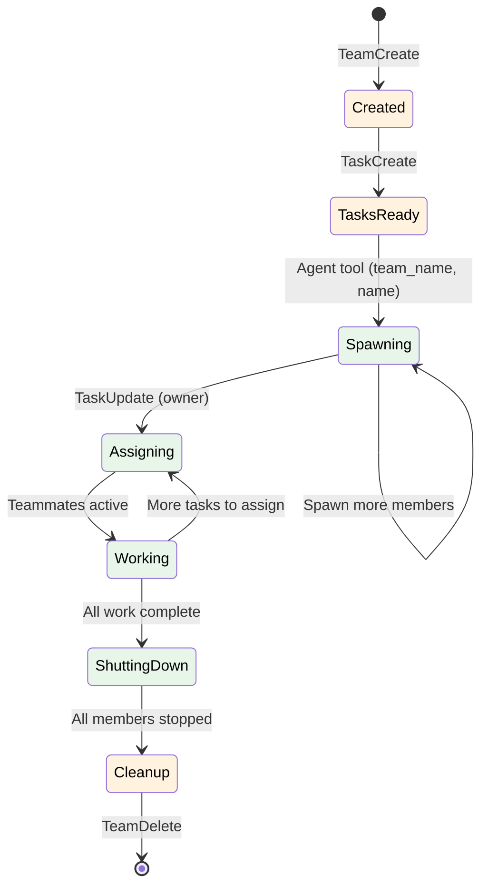

# Claude Code Agent Teams Reference

A shared reference for Claude Code's Agent Teams features. Load this skill when building skills or agents that create teams, spawn teammates, coordinate multi-agent workflows, or integrate with team hooks.

This skill covers team lifecycle, tool parameters, spawning mechanics, and file structure. For deeper topics, load the reference files listed in [Loading Reference Files](#loading-reference-files).

> **Cross-reference**: For Claude Code Tasks (TaskCreate, TaskGet, TaskUpdate, TaskList), see the companion skill: `Read ${CLAUDE_PLUGIN_ROOT}/skills/claude-code-tasks/SKILL.md`

---

## TeamCreate Tool

Creates a new named team and registers the caller as team lead.

| Parameter | Type | Required | Description |
|-----------|------|----------|-------------|
| `team_name` | string | Yes | Unique team identifier. Used in file paths, environment variables, and member discovery. Use kebab-case (e.g., `analysis-team`). |
| `description` | string | No | Human-readable description of the team's purpose. Shown in team config and used by teammates to understand their team's mission. |
| `agent_type` | string | No | The type of agent running as team lead. Informational; stored in config.json for member discovery. |

**Return behavior**: Returns a confirmation with the team name. The team is immediately ready for member spawning after creation. Teams have a 1:1 correspondence with task lists — creating a team also creates a task list at `~/.claude/tasks/{team-name}/`. A `config.json` file is created at `~/.claude/teams/{team-name}/config.json` with team metadata including lead identity, description, and a `members` array where each member has `name`, `agentId`, and `agentType`.

**Constraints**:
- Team names must be unique across all active teams
- The creating agent becomes team lead automatically
- Only team leads can send shutdown requests to members

---

## TeamDelete Tool

Deletes a team and cleans up its resources. Takes no parameters — the team name is determined from the current session's team context.

**Prerequisites**: All team members must be shut down before deletion. Attempting to delete a team with active members will fail.

**Cleanup behavior**: Removes the team directory (`~/.claude/teams/{team-name}/`) and the task directory (`~/.claude/tasks/{team-name}/`), clears inbox directories, and deregisters the team.

---

## Team Lifecycle

The full lifecycle of an agent team follows seven steps:

```
Create Team --> Create Tasks --> Spawn Teammates --> Assign Tasks --> Work --> Shutdown --> Cleanup
```



### Step Details

**1. Create team**: Team lead calls `TeamCreate` with a name. The team config file is written, a task list is created, and the lead is registered.

**2. Create tasks**: Team lead uses `TaskCreate` to add tasks. Tasks auto-use the team's task list at `~/.claude/tasks/{team-name}/`.

**3. Spawn teammates**: Team lead uses the `Agent` tool with `team_name` and `name` parameters to spawn teammates. Each teammate runs as an isolated Claude Code session. Members can be spawned incrementally as work demands change.

**4. Assign tasks**: Team lead uses `TaskUpdate` with `owner` to assign tasks to specific teammates.

**5. Teammates work**: Members complete assigned tasks, communicate via `SendMessage`, and report results. The team lead monitors progress, assigns new work, and handles issues. Members go idle between turns — this is normal, not an error.

**6. Shutdown**: When all work is complete, the team lead sends `shutdown_request` messages to each member. Members acknowledge with `shutdown_response` and terminate. The lead waits for all members to confirm shutdown.

**7. Cleanup**: After all members have stopped, the team lead calls `TeamDelete` to remove the team and task directories.

---

## Teammate Spawning

Teammates are spawned using the **Agent tool** with the `team_name` parameter. Each teammate runs as a separate Claude Code session.

> **Plugin tool name**: In Claude Code plugin frontmatter (`allowed-tools` in skills, `tools` in agents), the Agent tool is listed as `Task`. Both names refer to the same spawning capability with identical parameters (`prompt`, `team_name`, `name`, `description`, `subagent_type`, `run_in_background`). Use `Task` in frontmatter definitions and `Agent` or `Task` in skill/agent body instructions.

### Spawn Parameters

| Parameter | Type | Required | Description |
|-----------|------|----------|-------------|
| `prompt` | string | Yes | The task/prompt for the teammate. This is the initial instruction the teammate receives. |
| `team_name` | string | Yes | Associates the spawned agent with this team. Must match an existing team name. |
| `name` | string | Yes | Human-readable name for the teammate (e.g., `"researcher-1"`). Appears in team config and messages. |
| `description` | string | Yes | Short (3-5 word) description of the agent's task. |
| `subagent_type` | string | No | Model tier for the teammate: `"default"` (Opus), `"fast"` (Sonnet). Choose based on task complexity. |
| `run_in_background` | boolean | No | If `true`, the spawning agent does not block waiting for the teammate to finish. Essential for parallel teammate workflows. Default: `false`. |

### Subagent Type Selection

| Type | Model Tier | Best For |
|------|-----------|----------|
| `"default"` | Opus | Complex reasoning, synthesis, architecture decisions, autonomous multi-step work |
| `"fast"` | Sonnet | Parallel exploration, data gathering, straightforward implementation, high-volume tasks |

### Isolation

Each teammate runs in its own Claude Code session with:
- Independent context window (no shared memory with other teammates)
- Own tool permissions and approval state
- Own working directory (same project root)
- Communication only through `SendMessage` (file-based inbox delivery)

### Background Spawning Pattern

For parallel teammates, spawn all with `run_in_background: true`:

```
Task(prompt="Analyze module A", team_name="analysis-team", name="analyzer-1",
     description="Analyze module A", run_in_background=true)
Task(prompt="Analyze module B", team_name="analysis-team", name="analyzer-2",
     description="Analyze module B", run_in_background=true)
Task(prompt="Analyze module C", team_name="analysis-team", name="analyzer-3",
     description="Analyze module C", run_in_background=true)
```

Note: In skill/agent instructions, this tool may be referenced as either `Task` or `Agent`. Both are equivalent.

The team lead continues running and can coordinate via messages while teammates work.

---

## Idle State Semantics

Understanding idle state is critical for correct team coordination.

**Idle is normal, not an error.** When a teammate finishes its current task and has no pending messages, it enters an idle state. This is expected behavior between work assignments.

**Key rules**:
- Idle teammates can still receive and process messages
- Claude Code sends automatic idle notifications to the team lead when a teammate becomes idle
- Do NOT interpret idle as "broken" or "stuck" — it means the teammate is waiting for work
- Do NOT react to idle notifications unless you have new work to assign
- Send new work to idle teammates via `SendMessage` when ready
- Only send `shutdown_request` when the teammate's role is fully complete

**Anti-pattern**: Immediately shutting down teammates when they go idle. This wastes the spawning cost and prevents reuse for follow-up tasks.

---

## Environment Variables

Claude Code automatically sets these environment variables in every teammate session:

| Variable | Description | Example Value |
|----------|-------------|---------------|
| `CLAUDE_CODE_TEAM_NAME` | Name of the team this agent belongs to | `analysis-team` |
| `CLAUDE_CODE_AGENT_NAME` | This agent's name within the team | `researcher-1` |
| `CLAUDE_CODE_AGENT_TYPE` | Role of this agent (`lead` or `member`) | `member` |
| `CLAUDE_CODE_TASK_LIST_ID` | The task list ID associated with this team | `abc123` |

These variables allow teammates to:
- Know which team they belong to (for SendMessage routing)
- Identify themselves in messages and logs
- Determine if they are lead or member (for permission checks)
- Access the shared task list for the team

---

## Spawn Backends

Claude Code supports multiple backends for running teammate sessions.

| Backend | Environment | Characteristics |
|---------|-------------|-----------------|
| **in-process** | Default | Runs within the same process group. Simplest setup. No external dependencies. Suitable for most workflows. |
| **tmux** | Terminal | Each teammate runs in a separate tmux pane. Requires tmux installed. Provides visual monitoring of teammate sessions. Good for debugging and development. |
| **iTerm2** | macOS | Each teammate runs in a separate iTerm2 tab. macOS only. Provides native tab-based visual monitoring. Requires iTerm2 application. |

### Selection Guidance

- **Use in-process** (default) for production workflows, CI/CD, and when you do not need visual monitoring of individual teammate sessions.
- **Use tmux** when debugging multi-agent workflows and you want to watch each teammate's session in real time. Requires `tmux` to be installed.
- **Use iTerm2** on macOS when you prefer native terminal tabs over tmux panes for visual monitoring during development.

The backend is configured at the Claude Code application level, not per-team or per-spawn call.

---

## File Structure

Agent Teams use a file-based coordination system rooted in the user's home directory.

### Directory Layout

```
~/.claude/
├── teams/
│   └── {team-name}/
│       └── config.json          # Team metadata, member roster, lead identity
├── tasks/
│   └── {team-name}/
│       ├── {task-id}.json       # Individual task files for team members
│       └── ...
└── inboxes/
    └── {team-name}/
        ├── {agent-name}/        # Per-agent inbox directory
        │   ├── msg-001.json     # Delivered message files
        │   └── ...
        └── ...
```

### config.json

The team configuration file at `~/.claude/teams/{team-name}/config.json` contains:
- Team name and description
- Team lead identity and agent type
- Member roster with names, types, and status
- Creation timestamp

Other teammates discover team membership by reading this file.

### Inbox Delivery

Messages sent via `SendMessage` are written as JSON files to the recipient's inbox directory. Claude Code monitors these directories and delivers messages automatically — teammates do not poll for messages.

### Task Files

Each teammate's assigned work is tracked as task files under `~/.claude/tasks/{team-name}/`. These follow the standard Claude Code Tasks format (same as non-team tasks). The task directory is removed when `TeamDelete` is called.

---

## SendMessage Overview

`SendMessage` is the communication tool for inter-agent messaging within a team. It supports five message types, each with different routing and semantics.

| Type | Routing | Purpose |
|------|---------|---------|
| `message` | Direct (one recipient) | Send a targeted message to a specific teammate by name |
| `broadcast` | All members | Send to every team member simultaneously. Costs N messages for N members. |
| `shutdown_request` | Direct (one recipient) | Request a teammate to shut down gracefully. Includes a `request_id`. |
| `shutdown_response` | Direct (requester) | Teammate acknowledges shutdown. Includes matching `request_id`. |
| `plan_approval_response` | Direct (requester) | Approve or reject a teammate's proposed plan with optional feedback. |

**Message delivery is automatic** — Claude Code writes message files to recipient inboxes and notifies them. No polling required.

**Key rules**:
- Don't send structured JSON status messages — use `TaskUpdate` instead
- Idle notifications are sent automatically by the system when a teammate's turn ends
- Prefer `message` over `broadcast` in almost all cases

**Peer DM visibility**: Team leads can see direct messages between team members for oversight and coordination purposes.

For complete field tables, usage guidance, and examples for each message type, load the messaging protocol reference:

```
Read ${CLAUDE_PLUGIN_ROOT}/skills/claude-code-teams/references/messaging-protocol.md
```

---

## Loading Reference Files

This skill provides an overview of Agent Teams. For detailed coverage of specific topics, load these reference files as needed:

### Messaging Protocol

Complete documentation of all 5 SendMessage types with field tables, delivery mechanics, and usage patterns.

```
Read ${CLAUDE_PLUGIN_ROOT}/skills/claude-code-teams/references/messaging-protocol.md
```

### Orchestration Patterns

Proven multi-agent workflow patterns including Parallel Specialists, Pipeline, Swarm, Research-then-Implement, and Plan Approval Gate. Each pattern includes structure, task design, and communication flow.

```
Read ${CLAUDE_PLUGIN_ROOT}/skills/claude-code-teams/references/orchestration-patterns.md
```

### Hooks Integration

TeammateIdle and TaskCompleted hook events for quality gates and automation. Includes hook schemas, exit code behavior, and practical examples.

```
Read ${CLAUDE_PLUGIN_ROOT}/skills/claude-code-teams/references/hooks-integration.md
```

---
> Source: [sequenzia/agent-alchemy](https://github.com/sequenzia/agent-alchemy) — distributed by [TomeVault](https://tomevault.io).
<!-- tomevault:4.0:skill_md:2026-05-23 -->
