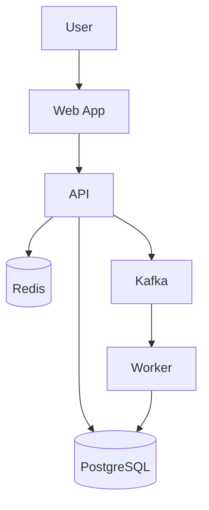

# Documentation Skill

## Documentation Types and When to Use Each

| Type | When | Audience |
|---|---|---|
| README | Always | First-time visitor |
| API docs | Public/shared APIs | API consumers |
| ADRs | After architectural decisions | Future maintainers |
| Architecture diagram | Non-trivial systems | Engineers, ops |
| Runbook | Production systems | On-call, support |
| Getting started | When others will use it | New users / contributors |
| Changelog | Released libraries / apps | Users tracking changes |
| Glossary | Domain-rich projects | Everyone |

## README Structure

For ANY repo:

```markdown
# Project Name

One-sentence description.

## What it does

2-3 paragraphs: problem solved, how it solves it, who it's for.

## Quick start

```bash
# Minimum commands to see it run
git clone ...
cd ...
make setup     # or npm install / pip install / etc.
make dev       # starts the thing
```

Open http://localhost:XXXX, you should see Y.

## Project structure

```
.
├── cmd/         # entry points
├── internal/    # private packages
├── pkg/         # exportable libraries
├── docs/        # docs
└── tests/       # tests
```

## Development

### Setup
- Required: <Go 1.22+ / Python 3.12+ / Node 20+>
- Optional: Docker for integration tests

### Common commands
```bash
make test       # run all tests
make lint       # static checks
make run        # run app
make build      # produce a release artifact
```

## Architecture

See [docs/architecture/overview.md](docs/architecture/overview.md).

## Configuration

See [docs/configuration.md](docs/configuration.md). Environment variables are loaded from `.env` (do not commit).

## Deployment

See [docs/deployment.md](docs/deployment.md).

## Contributing

See [CONTRIBUTING.md](CONTRIBUTING.md).

## License

<short>
```

## API Documentation

For HTTP APIs, generate OpenAPI:
- **Go:** `go-swagger` or `oapi-codegen`
- **Python:** FastAPI generates this automatically; for Django use `drf-spectacular`
- **TypeScript:** `tsoa` or NestJS Swagger

Key principles:
- Every endpoint has: summary, description, request schema, response schema (per status code), example request, example response
- Auth requirements explicit per endpoint
- Error responses documented with codes
- Pagination/filtering documented as separate concept once, then referenced

For internal RPC (gRPC, NATS), use the schema files (`.proto`, JSON Schema) AS the documentation, plus a doc explaining patterns (timeouts, retries, idempotency).

## Architecture Diagrams

Use C4 model (Context, Container, Component, Code).

Tools:
- **Mermaid** in markdown (renders on GitHub) - use for simple cases
- **Structurizr DSL** - for systematic C4
- **draw.io** - for one-off complex diagrams

Mermaid example:


Diagrams should be in `docs/architecture/diagrams/` with the source file (e.g., `.mmd`, `.dsl`) committed alongside any rendered PNG.

## Runbook Structure

For each production service:

```markdown
# Runbook: <Service Name>

## What this service does
2-3 sentences.

## Health check
- URL: https://...
- Expected: 200 OK with body `{"status":"ok"}`

## Dashboards
- Main metrics: <link>
- Logs: <link>
- Traces: <link>

## Common alerts and what to do

### Alert: HighErrorRate
**Symptom:** error rate > 5% for 5 minutes
**Likely causes:**
1. Downstream service down (check <dashboard>)
2. Database overloaded (check connections, slow queries)
3. Bad release (check recent deploys)

**First steps:**
1. Check downstream health: `curl https://downstream/health`
2. Check DB: `SELECT count(*) FROM pg_stat_activity WHERE state='active'`
3. Recent deploy? Roll back: `kubectl rollout undo deployment/<n>`

**Escalation:** if not resolved in 15 min, page <person>.

### Alert: HighLatency
...

## Common operations

### Restart the service
```
kubectl rollout restart deployment/<n>
```

### Drain and stop
...

### Scale up/down
...

## Disaster recovery

### Lost the database
1. ...

### Bad data injected
1. ...
```

## Glossary (for DDD projects)

Lives at `docs/specs/<feature>/glossary.md`. See the `ddd-modeling` skill for format.

## Getting Started Guide

For projects others will use:

```markdown
# Getting Started

## Prerequisites
- ...

## Install
```bash
...
```

## Your first <thing>

Goal: in 10 minutes, you'll have <X> working.

### Step 1: ...
```bash
...
```
You should see:
```
...
```

### Step 2: ...
...

## Next steps

- [ ] Build a real <thing>
- [ ] Deploy to staging
- [ ] ...

## Troubleshooting

### "Error: ..."
Cause: ...
Fix: ...
```

## Documentation Discipline

- **Docs live with code.** Same repo, same PR. Don't merge code without doc updates.
- **Docs run.** Code in docs is tested (use `mdbook test`, `pytest --doctest`, or markdown link checkers in CI).
- **Docs decay.** Set a quarterly review for runbooks and architecture diagrams. Stale docs are worse than no docs.
- **Examples > prose.** Show, then tell.
- **Index everything.** Docs/README.md should index all docs.

## Auto-generation

Where possible, generate from source:
- API: from code annotations
- Glossary: from domain types in code (e.g., scrape struct comments)
- Changelog: from conventional commits (e.g., `git-cliff`, `standard-version`)
- Architecture: from code structure analysis (`go-callvis`, `madge` for JS)

But hand-write the WHY parts. Auto-generated WHATs + hand-written WHYs is the right mix.

## Recommendations

After writing docs:
- Sections that are likely to drift (set up auto-gen for them)
- Missing docs that will hurt later (runbook for any production service)
- Docs that are too long (split or cut)
- Docs that overlap (merge or cross-reference)

---
> Source: [shakhovskiya-create/shakhoff-claude-marketplace](https://github.com/shakhovskiya-create/shakhoff-claude-marketplace) — distributed by [TomeVault](https://tomevault.io).
<!-- tomevault:4.0:skill_md:2026-06-16 -->
