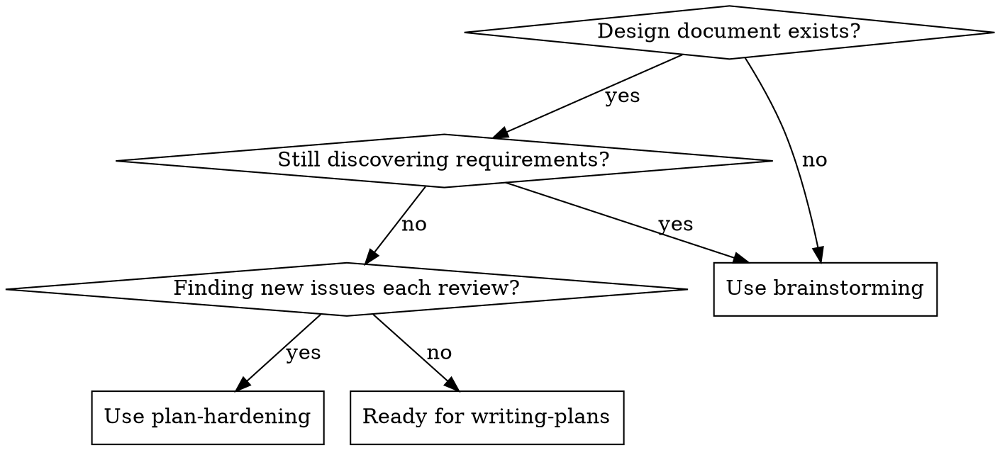
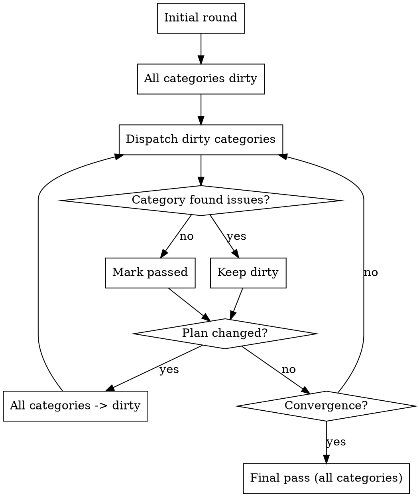

<!--
Word count note: ~1,150 words (2025-01-20)
The <500 word guideline is aspirational for frequently-loaded skills.
Complex process skills (TDD, debugging, subagent-driven-dev) are 1,000-1,500 words.
This skill needs detail to prevent rationalization loopholes.
Only consider reducing when reaching 1,500 words.
-->

# Plan Hardening

## Overview

Systematically validate a draft design until convergence (0 must-fix, 0 should-fix). Creates temporary tracker file during hardening; at finalization, all content migrates to main doc and tracker is deleted.

**Entry:** Brainstorming produced a draft design document
**Exit:** Convergence achieved, tracker content merged to main doc, tracker deleted

## When to Use



**Auto-trigger symptoms:**
- "Ready to finish?" feels premature
- Each review finds new problems
- Issues lost in conversation/compaction
- User micromanaging review process
- Brainstorming loops without progress

## Review Categories

### Core (Always - 10)

| # | Category | Focus |
|---|----------|-------|
| 1 | Gaps | Missing pieces, undefined behaviors, incomplete flows |
| 2 | Edge Cases | Boundary conditions, failure modes, error scenarios |
| 3 | Duplication | Code/data redundancy, maintainability concerns |
| 4 | Defensive Design | Optimistic assumptions, insufficient error handling |
| 5 | Resource Awareness | Memory, cost, quotas, limits, scalability |
| 6 | Impact Analysis | Existing features, models, tests, external dependencies |
| 7 | Best Practices | Market solutions, alternatives, code clarity, maintainability |
| 8 | Documentation | Inline docs needed, .md file consistency, stale context |
| 9 | Testing | E2E, integration, unit per project standards |
| 10 | Observability | Logging strategy, error tracking, debugging support |

### Optional (Context-Dependent - 8)

| # | Category | When to Include |
|---|----------|-----------------|
| 11 | Security | Auth, permissions, user data, input validation, compliance |
| 12 | UX Best Practices | Frontend-heavy plans (includes i18n, accessibility) |
| 13 | Migration | Production-deployed features, data/schema/API changes |
| 14 | API Design | Building/modifying APIs (versioning, conventions, pagination) |
| 15 | Concurrency | Multi-threaded code, concurrent access, race conditions |
| 16 | Third-Party Integrations | External service dependencies (fallbacks, retries, circuits) |
| 17 | Caching Strategy | Systems with caching layers (invalidation, TTL, stale data) |
| 18 | Performance / Benchmarking | Performance-critical features (load testing, bottlenecks) |

**At round start:** Detect context, include relevant optional categories.

## Smart Category Dispatch



**Token optimization:** Categories with 0 findings marked `passed`, skip subsequent rounds unless plan changes.

## Issue Tracker

Create `docs/plans/{plan-name}-tracker.md` alongside design document:

```markdown
## Category Status
| Category | State | Last Run | Findings |
|----------|-------|----------|----------|

## Open Issues
| ID | Severity | Category | Description | Status |

## Resolved
| ID | Severity | Category | Description | Resolution |

## Won't Do
| ID | Severity | Category | Description | Rationale |

## Deferred
| ID | Severity | Category | Description | Why Deferred |

## Future Work
| ID | Category | Description | Prerequisites |
```

**Tracker is temporary scaffolding.** At finalization: content migrates to main doc, tracker file deleted.

**Rules:**
- Every issue gets a decision (no orphans)
- `won't_do` requires documented rationale
- `deferred` requires documented reason
- `future` requires prerequisites
- Critical/important "won't do" → contest with arguments first, then document if user confirms

## Issue Severity

| Severity | Meaning | Gate |
|----------|---------|------|
| must-fix | Blocks implementation | Must be 0 to converge |
| should-fix | Important but not blocking | Must be 0 to converge |
| nice-to-have | Improvement opportunity | Move to Future Work |

## Convergence Protocol

| Round | Expected |
|-------|----------|
| 1 | Many issues (normal) |
| 2 | Fewer (root causes fixed) |
| 3 | Should be clean |
| 3+ with must/should-fix | Design flaw, revisit architecture |

**Convergence = Round with 0 new must-fix AND 0 new should-fix**

## Pre-Finalization Ritual

**Before writing final document version:**

1. **Memory Sweep** - Review full conversation, compaction summary, look for leftover definitions, unsolved questions

2. **Tracker Audit** - Verify 0 open issues, all won't_do/deferred/future have required fields

3. **Document Completeness** - Has all required sections including Future Work, Deferred, Won't Do, Key Decisions?

4. **Final Agent Pass** - All categories (core + applicable optional), must find 0 must-fix/should-fix

5. **Finalization Mindset** - Internal state: "Session closes after commit, everything not written is lost forever"

6. **Merge & Delete Tracker** - Move all tracker content to main doc sections, delete tracker file

## Document Sections (Final)

```markdown
# [Feature] - Design Document
## Status: FINAL
## Problem Statement
## Data Model
## Implementation Flow
## Edge Cases
## Testing Plan
## Files to Change
## Key Decisions Made (with rationale)
## Deferred (with reasons)
## Future Work (with prerequisites)
## Out of Scope / Won't Do (with rationale)
```

## Anti-Patterns Blocked

| Behavior | Block |
|----------|-------|
| "Ready to finish?" before convergence | Gate: 0 must-fix, 0 should-fix |
| Lost issues | Persistent tracker during hardening |
| Ad-hoc agent dispatch | Defined category set |
| Undocumented "won't do" | Required rationale field |
| Discarded nice-to-haves | Must go to Future Work |
| Re-raising resolved issues | In tracker/doc with resolution |
| Rushing to code | Pre-finalization ritual enforced |
| Orphan tracker file | Deleted at finalization |

## Red Flags - STOP

- Wanting to skip categories "this time"
- Marking must-fix as nice-to-have to converge faster
- "We discussed this already" without tracker entry
- Finalizing with open issues
- User says "won't do" on critical without contest + documented rationale
- Leaving tracker file after finalization

---
> Converted and distributed by [TomeVault](https://tomevault.io/claim/sheetgo) — claim your Tome and manage your conversions.
<!-- tomevault:4.0:skill_md:2026-04-15 -->
