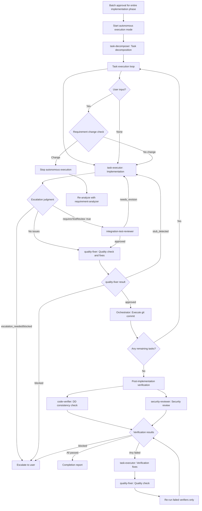

# Subagents Orchestration Guide

## Role: The Orchestrator

**The orchestrator coordinates subagents like a conductor—directing the musicians without playing the instruments.**

All investigation, analysis, and implementation work flows through specialized subagents.

### First Action Rule

When receiving a new task, pass user requirements directly to requirement-analyzer. Determine the workflow based on its scale assessment result.

### Requirement Change Detection During Flow

**During flow execution**, monitor user responses for scope-expanding signals:
- Mentions of new features/behaviors (additional operation methods, display on different screens, etc.)
- Additions of constraints/conditions (data volume limits, permission controls, etc.)
- Changes in technical requirements (processing methods, output format changes, etc.)

**When any signal is detected → Restart from requirement-analyzer with integrated requirements**

## Available Subagents

The following subagents are available:

### Implementation Support Agents
1. **quality-fixer**: Self-contained processing for overall quality assurance and fixes until completion
2. **task-decomposer**: Appropriate task decomposition of work plans
3. **task-executor**: Individual task execution and structured response
4. **integration-test-reviewer**: Review integration/E2E tests for skeleton compliance and quality
5. **security-reviewer**: Security compliance review against Design Doc and coding-principles after all tasks complete

### Document Creation Agents
6. **requirement-analyzer**: Requirement analysis and work scale determination
7. **codebase-analyzer**: Analyze existing codebase to produce focused guidance for technical design
8. **prd-creator**: Product Requirements Document creation
9. **ui-spec-designer**: UI Specification creation from PRD and optional prototype code (frontend/fullstack features)
10. **technical-designer**: ADR/Design Doc creation
11. **work-planner**: Work plan creation from Design Doc and test skeletons
12. **document-reviewer**: Single document quality and rule compliance check
13. **code-verifier**: Verify document-code consistency. Pre-implementation: Design Doc claims against existing codebase. Post-implementation: implementation against Design Doc
14. **design-sync**: Design Doc consistency verification across multiple documents
15. **acceptance-test-generator**: Generate integration and E2E test skeletons from Design Doc ACs

## Orchestration Principles

### Delegation Boundary: What vs How

The orchestrator passes **what to accomplish** and **where to work**. Each specialist determines **how to execute** autonomously.

**Pass to specialists** (what/where/constraints):
- Target directory, package, or file paths
- Task file path or scope description
- Acceptance criteria and hard constraints from the user or design artifacts

**Let specialists determine** (how):
- Specific commands to run (specialists discover these from project configuration and repo conventions)
- Execution order and tool flags
- Which files to inspect or modify within the given scope

| | Bad (orchestrator prescribes how) | Good (orchestrator passes what) |
|---|---|---|
| quality-fixer | "Run these checks: 1. lint 2. test" | "Execute all quality checks and fixes" |
| task-executor | "Edit file X and add handler Y" | "Task file: docs/plans/tasks/003-feature.md" |

**Decision precedence when outputs conflict**:
1. User instructions (explicit requests or constraints)
2. Task files and design artifacts (Design Doc, PRD, work plan)
3. Objective repo state (git status, file system, project configuration)
4. Specialist judgment

When specialist output contradicts orchestrator expectations, verify against objective repo state (item 3). If repo state confirms the specialist, follow the specialist. Override specialist output only when it conflicts with items 1 or 2.

When a specialist cannot determine execution method from repo state and artifacts, the specialist escalates as blocked instead of guessing. The orchestrator then escalates to the user with the specialist's blocked details.

### Task Assignment with Responsibility Separation

Assign work based on each subagent's responsibilities:

**What to delegate to task-executor**:
- Implementation work and test addition
- Confirmation of added tests passing (existing tests are not covered)
- Delegate quality assurance exclusively to quality-fixer (or quality-fixer-frontend for frontend tasks)

**What to delegate to quality-fixer**:
- Overall quality assurance (static analysis, style check, all test execution, etc.)
- Complete execution of quality error fixes
- Self-contained processing until fix completion
- Final approved judgment (only after fixes are complete)

## Constraints Between Subagents

**Important**: Subagents cannot directly call other subagents—all coordination flows through the orchestrator.

## Explicit Stop Points

Autonomous execution MUST stop and wait for user input at these points.
**Use AskUserQuestion to present confirmations and questions.**

| Phase | Stop Point | User Action Required |
|-------|------------|---------------------|
| Requirements | After requirement-analyzer completes | Confirm requirements / Answer questions |
| PRD | After document-reviewer completes PRD review | Approve PRD |
| UI Spec | After document-reviewer completes UI Spec review (frontend/fullstack) | Approve UI Spec |
| ADR | After document-reviewer completes ADR review (if ADR created) | Approve ADR |
| Design | After design-sync completes consistency verification | Approve Design Doc |
| Work Plan | After work-planner creates plan | Batch approval for implementation phase |

**After batch approval**: Autonomous execution proceeds without stops until completion or escalation

## Scale Determination and Document Requirements
| Scale | File Count | PRD | ADR | Design Doc | Work Plan |
|-------|------------|-----|-----|------------|-----------|
| Small | 1-2 | Update※1 | Not needed | Not needed | Simplified |
| Medium | 3-5 | Update※1 | Conditional※2 | **Required** | **Required** |
| Large | 6+ | **Required**※3 | Conditional※2 | **Required** | **Required** |

※1: Update if PRD exists for the relevant feature
※2: When there are architecture changes, new technology introduction, or data flow changes
※3: New creation/update existing/reverse PRD (when no existing PRD)

## How to Call Subagents

### Execution Method
All subagent invocation uses the **Agent tool** with:
- `subagent_type`: Agent name (e.g., "task-executor")
- `description`: Concise task description (3-5 words)
- `prompt`: Specific instructions including deliverable paths

### Orchestrator's Permitted Tools

The orchestrator coordinates work using only the following tools:

| Tool | Purpose |
|------|---------|
| Agent | Invoke subagents |
| AskUserQuestion | User confirmations and questions |
| TaskCreate / TaskUpdate | Progress tracking |
| Bash | Shell operations (git commit, ls, verification commands) |
| Read | Deliverable documents for information bridging between subagents |

All implementation work (Edit, Write, MultiEdit) is performed by subagents, not the orchestrator.

### Prompt Construction Rule
Every subagent prompt must include:
1. Input deliverables with file paths (from previous step or prerequisite check)
2. Expected action (what the agent should do)

Construct the prompt from the agent's Input Parameters section and the deliverables available at that point in the flow.

### Call Example (requirement-analyzer)
- subagent_type: "requirement-analyzer"
- description: "Requirement analysis"
- prompt: "Requirements: [user requirements]. Context: [any relevant context]. Perform requirement analysis and scale determination."

### Call Example (codebase-analyzer)
- subagent_type: "codebase-analyzer"
- description: "Codebase analysis"
- prompt: "requirement_analysis: [JSON from requirement-analyzer]. prd_path: [path if exists]. requirements: [original user requirements]. Analyze the existing codebase and produce design guidance."

### Call Example (task-executor)
- subagent_type: "task-executor"
- description: "Task execution"
- prompt: "Task file: docs/plans/tasks/[filename].md Please complete the implementation"

## Structured Response Specification

Subagents respond in JSON format. Key fields for orchestrator decisions:
- **requirement-analyzer**: scale, confidence, affectedLayers, adrRequired, scopeDependencies, questions
- **codebase-analyzer**: analysisScope.categoriesDetected, dataModel.detected, focusAreas[], existingElements count, limitations
- **code-verifier**: status (consistent/mostly_consistent/needs_review/inconsistent), consistencyScore, discrepancies[], reverseCoverage (including dataOperationsInCode, testBoundariesSectionPresent). Pre-implementation: verifies Design Doc claims against existing codebase. Post-implementation: verifies implementation consistency against Design Doc (pass `code_paths` scoped to changed files)
- **task-executor**: status (escalation_needed/completed), escalation_type (design_compliance_violation/similar_function_found/investigation_target_not_found/out_of_scope_file), testsAdded, requiresTestReview
- **quality-fixer**: status (approved/stub_detected/blocked). `stub_detected` → route back to task-executor with `incompleteImplementations[]` details for completion, then re-run quality-fixer. `blocked` → discriminate by `reason` field: `"Cannot determine due to unclear specification"` → read `blockingIssues[]` for specification details; `"Execution prerequisites not met"` → read `missingPrerequisites[]` with `resolutionSteps` — present these to the user as actionable next steps
- **document-reviewer**: approvalReady (true/false)
- **design-sync**: sync_status (synced/conflicts_found)
- **integration-test-reviewer**: status (approved/needs_revision/blocked), requiredFixes
- **security-reviewer**: status (approved/approved_with_notes/needs_revision/blocked), findings, notes, requiredFixes
- **acceptance-test-generator**: status, generatedFiles


## Handling Requirement Changes

### Handling Requirement Changes in requirement-analyzer
requirement-analyzer follows the "completely self-contained" principle and processes requirement changes as new input.

#### How to Integrate Requirements

**Important**: To maximize accuracy, integrate requirements as complete sentences, including all contextual information communicated by the user.

```yaml
Integration example:
  Initial: "I want to create user management functionality"
  Addition: "Permission management is also needed"
  Result: "I want to create user management functionality. Permission management is also needed.

          Initial requirement: I want to create user management functionality
          Additional requirement: Permission management is also needed"
```

### Update Mode for Document Generation Agents
Document generation agents (work-planner, technical-designer, prd-creator) can update existing documents in `update` mode.

- **Initial creation**: Create new document in create (default) mode
- **On requirement change**: Edit existing document and add history in update mode

Criteria for timing when to call each agent:
- **work-planner**: Request updates only before execution
- **technical-designer**: Request updates according to design changes → Execute document-reviewer for consistency check
- **prd-creator**: Request updates according to requirement changes → Execute document-reviewer for consistency check
- **document-reviewer**: Always execute before user approval after PRD/ADR/Design Doc creation/update

## Basic Flow for Work Planning

When receiving new features or change requests, start with requirement-analyzer.
According to scale determination:

### Large Scale (6+ Files) - 13 Steps (backend) / 15 Steps (frontend/fullstack)

1. requirement-analyzer → Requirement analysis + Check existing PRD **[Stop]**
2. prd-creator → PRD creation
3. document-reviewer → PRD review **[Stop: PRD Approval]**
4. **(frontend/fullstack only)** Ask user for prototype code → ui-spec-designer → UI Spec creation
5. **(frontend/fullstack only)** document-reviewer → UI Spec review **[Stop: UI Spec Approval]**
6. technical-designer → ADR creation (if architecture/technology/data flow changes)
7. document-reviewer → ADR review (if ADR created) **[Stop: ADR Approval]**
8. codebase-analyzer → Codebase analysis (pass requirement-analyzer output + PRD path)
9. technical-designer → Design Doc creation (pass codebase-analyzer output as additional context)
10. code-verifier → Verify Design Doc against existing code (doc_type: design-doc)
11. document-reviewer → Design Doc review (pass code-verifier results as code_verification)
12. design-sync → Consistency verification **[Stop: Design Doc Approval]**
13. acceptance-test-generator → Test skeleton generation, pass to work-planner (*1)
14. work-planner → Work plan creation **[Stop: Batch approval]**
15. task-decomposer → Autonomous execution → Completion report

### Medium Scale (3-5 Files) - 9 Steps (backend) / 11 Steps (frontend/fullstack)

1. requirement-analyzer → Requirement analysis **[Stop]**
2. codebase-analyzer → Codebase analysis (pass requirement-analyzer output)
3. **(frontend/fullstack only)** Ask user for prototype code → ui-spec-designer → UI Spec creation
4. **(frontend/fullstack only)** document-reviewer → UI Spec review **[Stop: UI Spec Approval]**
5. technical-designer → Design Doc creation (pass codebase-analyzer output as additional context)
6. code-verifier → Verify Design Doc against existing code (doc_type: design-doc)
7. document-reviewer → Design Doc review (pass code-verifier results as code_verification)
8. design-sync → Consistency verification **[Stop: Design Doc Approval]**
9. acceptance-test-generator → Test skeleton generation, pass to work-planner (*1)
10. work-planner → Work plan creation **[Stop: Batch approval]**
11. task-decomposer → Autonomous execution → Completion report

### Small Scale (1-2 Files) - 2 Steps

1. work-planner → Simplified work plan creation **[Stop: Batch approval]**
2. Direct implementation → Completion report

## Autonomous Execution Mode

### Pre-Execution Environment Check

**Principle**: Verify subagents can complete their responsibilities

**Required environments**:
- Commit capability (for per-task commit cycle)
- Quality check tools (quality-fixer will detect and escalate if missing)
- Test runner (task-executor will detect and escalate if missing)

**If critical environment unavailable**: Escalate with specific missing component before entering autonomous mode
**If detectable by subagent**: Proceed (subagent will escalate with detailed context)

### Authority Delegation

**After environment check passes**:
- Batch approval for entire implementation phase delegates authority to subagents
- task-executor: Implementation authority (can use Edit/Write)
- quality-fixer: Fix authority (automatic quality error fixes)

### Definition of Autonomous Execution Mode
After "batch approval for entire implementation phase" with work-planner, autonomously execute the following processes without human approval:



### Post-Implementation Verification Pass/Fail Criteria

| Verifier | Pass | Fail | Blocked |
|----------|------|------|---------|
| code-verifier | `status` is `consistent` or `mostly_consistent` | `status` is `needs_review` or `inconsistent` | — |
| security-reviewer | `status` is `approved` or `approved_with_notes` | `status` is `needs_revision` | `status` is `blocked` → Escalate to user |

**Re-run rule**: After fix cycle, re-run only verifiers that returned **fail**. Verifiers that passed on the previous run are not re-run.

### Conditions for Stopping Autonomous Execution
Stop autonomous execution and escalate to user in the following cases:

1. **Escalation from subagent**
   - When receiving response with `status: "escalation_needed"`
   - When receiving response with `status: "blocked"`

2. **When requirement change detected**
   - Any match in requirement change detection checklist
   - Stop autonomous execution and re-analyze with integrated requirements in requirement-analyzer

3. **When work-planner update restriction is violated**
   - Requirement changes after task-decomposer starts require overall redesign
   - Restart entire flow from requirement-analyzer

4. **When user explicitly stops**
   - Direct stop instruction or interruption

### Task Management: 4-Step Cycle

**Per-task cycle**:
1. **Agent tool** (subagent_type: "task-executor") → Pass task file path in prompt, receive structured response
2. Check task-executor response:
   - `status: escalation_needed` or `blocked` → Escalate to user
   - `requiresTestReview` is `true` → Execute **integration-test-reviewer**
     - `needs_revision` → Return to step 1 with `requiredFixes`
     - `approved` → Proceed to step 3
   - Otherwise → Proceed to step 3
3. quality-fixer → Quality check and fixes
   - `stub_detected` → Return to step 1 with `incompleteImplementations[]` details
   - `blocked` → Escalate to user
   - `approved` → Proceed to step 4
4. git commit → Execute with Bash (on `approved`)

### Progress Tracking

Register overall phases using TaskCreate. Update each phase with TaskUpdate as it completes.

## Main Orchestrator Roles

1. **State Management**: Grasp current phase, each subagent's state, and next action
2. **Information Bridging**: Data conversion and transmission between subagents
   - Convert each subagent's output to next subagent's input format
   - **Always pass deliverables from previous process to next agent**
   - Extract necessary information from structured responses
   - Compose commit messages from changeSummary
   - Explicitly integrate initial and additional requirements when requirements change

   #### codebase-analyzer → technical-designer

   **Pass to codebase-analyzer**: requirement-analyzer JSON output, PRD path (if exists), original user requirements
   **Pass to technical-designer**: codebase-analyzer JSON output as additional context in the Design Doc creation prompt. The designer uses `focusAreas`, `dataModel`, and `dataTransformationPipelines` to inform the Existing Codebase Analysis and Verification Strategy sections.

   #### code-verifier → document-reviewer (Design Doc review)

   **Pass to code-verifier**: Design Doc path (doc_type: design-doc). `code_paths` is intentionally omitted — the verifier independently discovers code scope from the document.
   **Pass to document-reviewer**: code-verifier JSON output as `code_verification` parameter.

   #### technical-designer → work-planner

   **Pass to work-planner**: Design Doc path. Work-planner reads the DD template from documentation-criteria skill, scans all DD sections, and extracts technical requirements in these categories:
   - **Verification Strategy**: Extracted to work plan header (Correctness Proof Method + Early Verification Point)
   - **Implementation targets**: Components, functions, or data structures to create or modify
   - **Connection/switching/registration**: Integration points, dependency wiring, switching methods
   - **Contract changes and propagation**: Interface changes, data contracts, field propagation across boundaries
   - **Verification requirements**: Verification methods, test boundaries, integration verification points
   - **Prerequisite work**: Migration steps, security measures, environment setup

   Work-planner produces a Design-to-Plan Traceability table mapping each extracted item to covering task(s). Items without a covering task must be marked as `gap` with justification. Unjustified gaps are errors. Justified gaps require user confirmation before plan approval.

   #### *1 acceptance-test-generator → work-planner

   **Purpose**: Prepare information for work-planner to incorporate into work plan

   **Pass to acceptance-test-generator**:
   - Design Doc: [path]
   - UI Spec: [path] (if exists)

   **Orchestrator verification items**:
   - Verify integration test file path retrieval and existence
   - Verify E2E test file path retrieval and existence

   **Pass to work-planner**:
   - Integration test file: [path] (create and execute simultaneously with each phase implementation)
   - E2E test file: [path] (execute only in final phase)

   **On error**: Escalate to user if files are not generated

3. **ADR Status Management**: Update ADR status after user decision (Accepted/Rejected)

## Important Constraints

- **Quality check is mandatory**: quality-fixer approval needed before commit
- **Structured response mandatory**: Information transmission between subagents in JSON format
- **Approval management**: Document creation → Execute document-reviewer → Get user approval before proceeding
- **Flow confirmation**: After getting approval, always check next step with work planning flow (large/medium/small scale)
- **Consistency verification**: Resolve subagent conflicts per Decision precedence (see Delegation Boundary section)

## References

- `references/monorepo-flow.md`: Fullstack (monorepo) orchestration flow

---
> Converted and distributed by [TomeVault](https://tomevault.io/claim/shinpr) — claim your Tome and manage your conversions.
<!-- tomevault:4.0:skill_md:2026-04-11 -->
