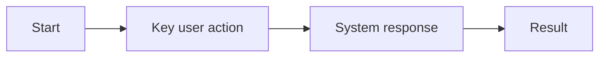
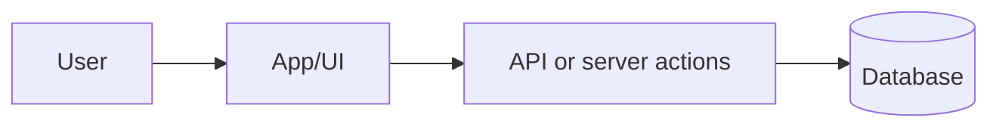
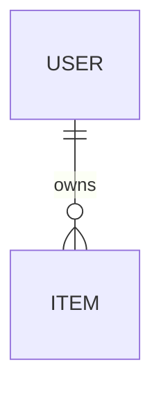
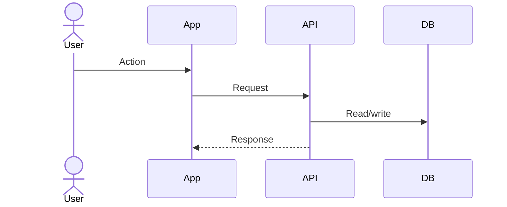

# Documentation

Run after QA passes for a PROJ-X. The goal is not a short changelog; the goal is curated documentation a human can use to understand:

- what the app does and which features exist
- how the main user workflows behave
- which technology choices matter
- how the data model, integrations, and data flows work
- what future agents must remember

Update only what needs updating, but do not keep the docs shallow when the feature or architecture needs explanation.

## Output Files

| File | Role | Update trigger | Length budget |
|---|---|---|---|
| `README.md` | App on-ramp: what it is, how to run it, where deeper docs live | First PROJ, dependency/setup change, deployment change, or explicit user request | <= 80 lines |
| `docs/PROJECT.md` | Human feature guide: implemented capabilities, user workflows, status, links to PRDs | Always when QA passes | grows with PROJs; concise but useful |
| `docs/TECHNICAL.md` | Technical reference: architecture, data model, data flows, integrations, deployment, gotchas | Architecture/data/dependency/agent-note changes, or explicit user request | as long as needed |
| `AGENTS.md` | Durable agent context for all future coding sessions | >= 1 approved candidate from progress.md | <= 40 non-blank lines hard cap |
| `CLAUDE.md` | Pointer-only Claude entry file; must tell Claude to read `AGENTS.md` | Missing, or contains durable rules instead of only a pointer | <= 5 lines; no curated rules |

No per-feature documentation files by default. The PRDs under `specs/PROJ-<X>-<theme>/3_PRDs/` remain the detailed requirement source; link to them instead of copying acceptance criteria.

## Decomposed PROJ Handling

Documentation updates the completed PROJ while preserving the larger decomposition map:

- `docs/PROJECT.md` should show how this PROJ fits sibling PROJs when the concept has `Decomposition Context`.
- Refresh only the current PROJ's detailed section; keep sibling sections intact.
- If this PROJ introduces or consumes shared design language, document the canonical design file and which sibling PROJs it applies to.
- `docs/TECHNICAL.md` should document cross-PROJ contracts only when they are source-backed by concept, architecture, plans, or implementation.
- Do not describe unbuilt sibling PROJs as shipped capabilities.

## Input

Read in this priority order. Structured data first; raw reconstruction only as fallback.

**Structured inputs, filled by Skills 4/5/6:**

1. `specs/PROJ-<X>-<theme>/7_progress/PROJ-<X>-progress.md`
   - `### Wave N Gate - PASSED` blocks: authoritative wave completion proof
   - `## QA Results`: QA summary and residual risk
   - `## PROJ Retrospective`: implementation lessons and durable observations
   - `## AGENTS.md Candidates`: proposed durable agent rules awaiting approval
2. `specs/PROJ-<X>-<theme>/1_brainstorm/PROJ-<X>-concept.md`
   - app/feature purpose, target user, in-scope/out-of-scope boundaries
3. `specs/PROJ-<X>-<theme>/3_PRDs/*.md`
   - user stories, feature names, acceptance criteria, edge cases
4. `specs/PROJ-<X>-<theme>/6_plan/PROJ-<X>-architecture.md`
   - architecture, data model, data flows, cross-cutting decisions
5. `specs/PROJ-<X>-<theme>/6_plan/PROJ-<X>-wave-*-plan.md`
   - shipped user-story scope per wave
6. `src/features/*/agent.md`
   - non-obvious gotchas surfaced during implementation
7. `package.json` at `BASE_SHA` and `HEAD`
   - dependency and script deltas for setup/technical docs

**Fallback only if structured inputs are absent:**

8. `git log --oneline --grep="PROJ-<X>" --reverse`
9. focused code structure scan

Do not re-derive what structured inputs already provide. If a Wave PASSED block lists shipped stories, treat that as canonical.

## Claude Adaptation

This Claude skill uses the Codex documentation skill as the behavioral source of truth. Keep gates, output structure, diagrams, content ownership, and `AGENTS.md` merge behavior aligned with the Codex copy. Claude-specific differences are limited to tool invocation and the pointer-only `CLAUDE.md` file:

- Use project-root `AGENTS.md` for durable agent context.
- Keep project-root `CLAUDE.md` pointer-only. It must reference `AGENTS.md` as required reading and must not contain curated rules.
- Ask the user before merging any `AGENTS.md` candidate unless the current user request explicitly authorizes automatic merging.
- Use Claude `Agent` subagents when available and useful. Otherwise, generate docs locally.
- Keep documentation edits scoped to triggered files.

## Documentation Standard

Write for a human maintainer or product owner who did not implement the feature.

- **Curated, not exhaustive:** explain the current truth of the app; link to PRDs for detailed acceptance criteria.
- **Feature-first:** `PROJECT.md` should answer "what can users do now?" before it talks about implementation.
- **Technical clarity:** `TECHNICAL.md` should explain architecture, technology choices, data model, data flows, deployment, and operational gotchas.
- **Diagrams when useful:** use Mermaid diagrams for system context, data model, state transitions, and critical data flows when the source material supports them.
- **Source-backed:** never invent entities, tables, services, queues, permissions, or flows. If a fact is inferred from code, say so briefly.
- **Incremental curation:** update stale sections, remove contradicted statements, and keep sibling PROJs intact.

## Context Economy

Documentation arrives late in the chain. Keep the main context focused on `progress.md`, the current doc diff, and any user approvals.

- Read `progress.md` first to decide which outputs are triggered.
- Load concept, PRDs, architecture, wave plans, and source files only for the triggered output that needs them.
- If delegation is allowed, assign independent harvest tasks to subagents; otherwise do focused local reads.
- Keep long PRDs, architecture files, screenshots, and raw logs out of the final answer.

## Workflow

### 1. Collect documentation inputs

Start with `7_progress/PROJ-<X>-progress.md`. Then collect only the extra inputs needed for triggered outputs:

1. **Feature purpose and boundaries:** read the concept file if `PROJECT.md` or `README.md` needs human-facing purpose/scope text.
2. **Shipped stories:** parse Wave PASSED blocks first; fall back to `6_plan/PROJ-<X>-wave-*-plan.md` headings matching `## PROJ-<X>-PRD-<Y>-US-<Z>:`.
3. **Feature behavior:** read PRDs only to summarize capabilities, user workflows, edge cases, and links. Do not paste acceptance criteria.
4. **Technical structure:** read architecture and relevant `agent.md` files when `TECHNICAL.md` triggers.
5. **Dependency delta:** compare `package.json` at `BASE_SHA` to `HEAD` using structured JSON over `dependencies` and `devDependencies`.
6. **Runtime/deployment facts:** inspect package scripts, config files, env examples, and deployment notes only when README or TECHNICAL needs them.

**Trigger evaluation:**

- `PROJECT.md`: always true after QA passes
- `README.md`: first PROJ, dependency/setup/deployment delta, missing README, or explicit request
- `TECHNICAL.md`: architecture/data-flow/data-model/integration/dependency/agent-note change, missing technical doc, or explicit request
- `AGENTS.md`: `## AGENTS.md Candidates` has at least one `[PROPOSED]` entry
- `CLAUDE.md`: missing, or contains durable rules instead of only a pointer to `AGENTS.md`

**Missing-sections fallback:** if `## PROJ Retrospective` or `## AGENTS.md Candidates` is absent, proceed anyway and note the degraded input path in the final summary.

Only proceed to sections whose trigger fires.

### 2. Update `docs/PROJECT.md`

Always runs. This is the human feature guide, not a terse release log.

**Required structure:**

````markdown
# Project - Features

**Last updated:** YYYY-MM-DD
**Features implemented:** <count>

---

## PROJ-<X>: <theme>

**Status:** <development | QA-passed | production>
**Purpose:** <one-sentence user/business goal from concept>
**Scope:** <what is included and intentionally excluded>

### Capabilities

- <user-facing thing the app can now do>
- <another capability>

### Primary Workflow

1. <human workflow step>
2. <human workflow step>
3. <outcome>



### User Stories Implemented

- PROJ-<X>-PRD-1-US-1: <title>
- PROJ-<X>-PRD-1-US-2: <title>

### Notes

- **PRDs:** [PRD-1](../specs/PROJ-<X>-<theme>/3_PRDs/PROJ-<X>-PRD-1-<desc>.md)
- **QA:** <pass/bugs/residual-risk summary from QA Results>
- **Known limits:** <only if source-backed>
````

Guidelines:

- New PROJs append. Existing PROJs get only their own section refreshed.
- Include a Mermaid workflow only for meaningful multi-step behavior; skip it for trivial backend or setup-only changes.
- Keep feature text understandable to non-engineers.
- Do not duplicate detailed acceptance criteria, edge-case lists, or implementation plans.

### 3. Update `README.md`

Runs conditionally. README is the front door, not the technical deep dive.

**Required structure:**

````markdown
# <Project Name>

> <one-sentence app purpose>

## What It Does

- <top-level capability>
- <top-level capability>
- <top-level capability>

## Quick Start

```bash
<install command>
<dev command>
```

## Tech Stack

- <framework> - <one-line purpose>
- <database/auth/styling/deployment> - <one-line purpose>

## Documentation

- [Features](docs/PROJECT.md) - human feature guide and workflows
- [Technical](docs/TECHNICAL.md) - architecture, data model, data flows, deployment, gotchas
- [AGENTS.md](./AGENTS.md) - durable conventions for AI-pair coding
````

Guidelines:

- Keep it short enough to scan.
- Mention setup requirements, env files, and scripts only at the level needed to run the app locally.
- Avoid duplicating `TECHNICAL.md`; link to it for architecture/data details.

### 4. Update `docs/TECHNICAL.md`

Runs conditionally. This is the maintainers' technical map of the app.

**Required structure:**

````markdown
# Technical Reference

**Last updated:** YYYY-MM-DD

## System Overview

<short explanation of runtime shape and major modules>



## Architecture

<high-level architecture from PROJ architecture files>

## Technology Choices

| Area | Choice | Why it matters |
|---|---|---|
| Frontend | <tool> | <reason> |
| Data | <tool> | <reason> |

## Data Model

<entities, relationships, ownership, important constraints>



## Data Flows

### <Flow Name>

<when this flow happens and why>



## Integrations and External Services

<APIs, auth providers, storage, payment, queues, model providers, email, analytics>

## Directory Structure

```text
src/
  app/       - <what lives here>
  features/  - <what lives here>
  lib/       - <what lives here>
```

## Dependencies

<runtime and dev dependencies with purpose, especially newly introduced ones>

## Deployment and Runtime

<provider, build command, env-var overview, persistence/runtime constraints>

## Operational Notes and Gotchas

<source-backed notes from agent.md, QA, post-wave notes, and retrospective>
````

Guidelines:

- Prefer Mermaid diagrams over prose when they reduce ambiguity.
- Include at least one diagram when `TECHNICAL.md` is created from scratch and architecture/data-flow information exists.
- Use `flowchart`, `sequenceDiagram`, `erDiagram`, or `stateDiagram-v2` according to the source material.
- Do not create fake diagrams from guesses. If the data model is absent, write "No persistent data model documented yet" rather than inventing one.
- Update stale diagrams when the underlying architecture changes.
- Keep technology explanations practical: what it is used for, why it matters, and where to find it in the repo.

### 5. AGENTS.md merge

Runs only if `## AGENTS.md Candidates` in progress.md has `[PROPOSED]` entries.

**Algorithm:**

1. Parse every `[PROPOSED]` line from progress.md's candidates section. Each line has a stable ID, such as `AGENTS-PROJ1-QA-003`.
2. For each candidate, ask the user directly:
   - Approve
   - Reject
   - Approve with edit
   - Skip
3. For each approved or edited candidate:
   - Append it to project-root `AGENTS.md` under an appropriate short heading.
   - Prefix the line with its ID as a comment anchor: `<!-- AGENTS-PROJ1-QA-003 -->`.
   - In progress.md, flip `[PROPOSED]` to `[MERGED]` by ID. Never delete the candidate line.
4. Enforce the 40-line hard cap on `AGENTS.md`.
   - Count non-blank lines, including headings.
   - If over 40, ask the user which old entries to remove. Do not delete automatically.
5. Rejected candidates are marked `[REJECTED]` in progress.md to prevent re-proposal.

Never edit `AGENTS.md` without explicit approval per entry. The user owns this file; Skill 7 only facilitates.

**Autonomous mode** (`CLAUDE_AUTONOMOUS_LEVEL=balanced` set):

- `balanced`: auto-merge a candidate only if high-confidence: two or more persona sources flagged the same rule, or the source is `Dr. Sarah Chen (Security)` or a DB-schema/RLS finding. Everything else is marked `[REJECTED-BY-POLICY]`.
- `conservative`: reject all candidates for later user review.
- `aggressive`: auto-merge everything.

On 40-line overflow, `balanced` and `aggressive` evict oldest merged entries until within cap; `conservative` halts for user pruning. Log every auto-decision to `7_progress/PROJ-<X>-autonomous-log.md`.

### 6. CLAUDE.md pointer

Runs if `CLAUDE.md` is missing or contains durable rules.

`CLAUDE.md` must stay a tiny pointer file. It should not be curated, should not receive QA candidates, and should not duplicate `AGENTS.md`.

Allowed content:

```markdown
# Claude Instructions

Must read and follow [AGENTS.md](./AGENTS.md) before making changes. All durable agent instructions are curated in AGENTS.md only.
```

If an existing `CLAUDE.md` contains additional durable rules, move proposed durable rules through the normal `AGENTS.md` candidate flow instead of preserving them in `CLAUDE.md`.

### 7. Git commit

One commit for the documentation update:

```text
docs(PROJ-<X>): Update project documentation
```

If `AGENTS.md` was merged or `CLAUDE.md` was normalized to the pointer, include those changes in the same commit.

## Content Ownership

| Info | Lives in |
|---|---|
| "What does this app do?" | `README.md` summary + `docs/PROJECT.md` feature guide |
| "How do I run it?" | `README.md` |
| "Which features exist and how do users use them?" | `docs/PROJECT.md` |
| "What are the detailed ACs of feature X?" | Linked PRD |
| "Why did we choose this architecture or dependency?" | `docs/TECHNICAL.md` |
| "What is the data model?" | `docs/TECHNICAL.md` |
| "How does data move through the system?" | `docs/TECHNICAL.md` with Mermaid flow/sequence diagrams |
| "What should future agents always remember?" | `AGENTS.md`, after user approval |
| "Where should Claude look for durable rules?" | `CLAUDE.md` pointer to `AGENTS.md` |
| "What bugs remain?" | `docs/PROJECT.md` QA note if source-backed |

## Rules

- English for all generated docs, even if the conversation is German.
- Human-readable first; implementation details only where they explain behavior or maintenance.
- Do not duplicate PRDs, architecture plans, or QA logs; summarize and link.
- Prefer source-backed statements over confident reconstruction.
- Keep diagrams valid Mermaid and small enough to read.
- No emojis unless the user explicitly asks.
- Do not fabricate setup commands, environment variables, tables, queues, services, or integrations.

## When to Run

- After Step 6 QA passes for a PROJ-X.
- When the user explicitly asks for documentation, feature docs, technical docs, diagrams, data model explanation, or data-flow explanation.

---
> Source: [silviobeer/agentic-development-skill-chain](https://github.com/silviobeer/agentic-development-skill-chain) — distributed by [TomeVault](https://tomevault.io).
<!-- tomevault:4.0:skill_md:2026-05-22 -->
