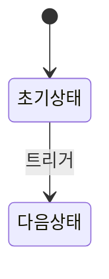

# spec-detail — 스펙 상세 작성

스펙 초안 기반으로 상세 문서(ui/flow/api)를 작성합니다.
페이지 + 문서 종류 지정 가능. 미지정 시 전체 DRAFT 페이지 일괄 처리합니다.
"v1 상세 스펙", "v1 order-management ui" 요청 시 사용합니다.

## Instructions

다음 단계를 순서대로 수행하세요.

### 1. 버전 확인

- 사용자가 버전을 지정한 경우 해당 버전 사용 (예: v1, v2)
- 미지정 시 현재 진행 중인 버전 사용

### 2. 요구사항 맥락 파악

- `.specs/v{N}/PRD.md`를 읽어 요구사항 상세 맥락 파악

### 3. 프로젝트 가이드 파악

- `CLAUDE.md`의 "참고 문서" 섹션에서 `docs/` 가이드 목록 파악

### 4. 대상 결정

- **페이지 + 문서 종류 지정** → 해당 문서만 생성 (예: `v1 order-management ui`)
- **페이지만 지정** → 해당 페이지의 ui.md + flow.md + api.md 일괄 생성
- **미지정** → 전체 DRAFT 상태 페이지의 상세 문서 일괄 생성

### 5. spec.md 기반 상세 문서 작성

- 대상 페이지의 `spec.md`를 읽어 개요 파악 후 상세 문서 작성

### 6. 문서별 작성 기준

#### ui.md — 화면 구성 상세

```markdown
# 화면 구성

## 1. 목록 페이지

### 레이아웃

(ASCII art 또는 구조 설명)

### 테이블 컬럼 / 카드 구성

| 컬럼명 | 필드 | 타입 | 비고 |
| ------ | ---- | ---- | ---- |
| ...    | ...  | ...  | ...  |

## 2. 상세 페이지

### 폼 필드

| 필드명 | 컴포넌트 | 필수 | 검증 규칙 |
| ------ | -------- | ---- | --------- |
| ...    | ...      | ...  | ...       |
```

핵심 내용: 레이아웃, 테이블 컬럼, 폼 필드, 컴포넌트 매핑

#### flow.md — 사용자 흐름 / 상태 전이

````markdown
# 사용자 흐름

## 1. 기본 흐름

1. (단계별 흐름 기술)

## 2. 상태 전이



## 3. 엣지 케이스

- (예외 상황 및 처리 방법)
````

핵심 내용: 기본 흐름(단계별), 상태 전이(mermaid), 엣지 케이스

#### api.md — API 연동 스펙

```markdown
# API 연동

## 조회 API

### {API명}

- 엔드포인트/쿼리: ...
- 파라미터: ...
- 캐시 전략: ...

## 변경 API

### {API명}

- 엔드포인트/뮤테이션: ...
- 부수 효과: ...

## 필터/정렬 매핑

| UI 필터 | API 조건 |
| ------- | -------- |
| ...     | ...      |
```

핵심 내용: 조회/변경 API 정의, 파라미터, 캐시 전략, 필터 매핑

### 7. 일관성 유지

- 관련 프로젝트 가이드(`docs/`)의 패턴 준수
- 기존에 작성된 페이지와 스타일 일관성 유지

### 8. 품질 기준 적용

각 상세 문서에 아래 품질 기준을 반드시 반영합니다:

#### ui.md — 토스급 완성도

- 모든 화면에 **로딩 상태**(스켈레톤/스피너), **빈 상태**(안내 메시지+액션), **에러 상태**(재시도 옵션)를 명세
- 인터랙션 피드백(버튼 클릭, 폼 제출, 삭제 등)과 전환 애니메이션 정의
- 반응형 레이아웃·접근성(키보드 내비게이션, 포커스 관리) 고려사항 포함

#### flow.md — 빠른 체감 속도

- Optimistic UI 적용 대상 액션을 식별하고 낙관적 업데이트 흐름과 롤백 시나리오를 명시
- 사용자가 대기하는 구간을 최소화하는 방향으로 흐름 설계 (prefetch, 백그라운드 동기화 등)
- 실패 시 사용자 경험이 끊기지 않는 에러 복구 흐름 포함

#### api.md — 포브스 TOP 10 기업 수준

- 스펙에 맞는 기능 깊이를 API 레벨까지 관통시킨다. 필요한 경우 집계·필터·정렬·내보내기 API를 명시
- 각 API가 실무 활용에 충분한 수준인지 검증 (파라미터, 응답 형태, 에러 처리)
- 캐싱·페이지네이션·실시간 업데이트 전략을 구체적으로 정의

---
> Source: [subicura/purplemux](https://github.com/subicura/purplemux) — distributed by [TomeVault](https://tomevault.io).
<!-- tomevault:4.0:skill_md:2026-06-18 -->
