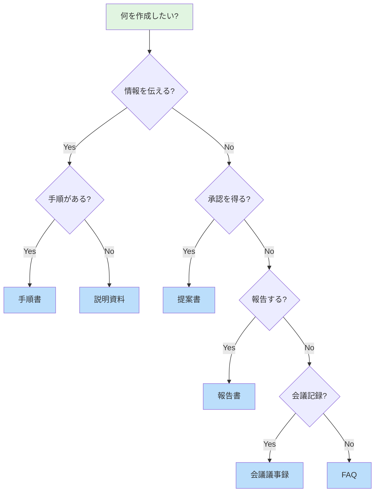
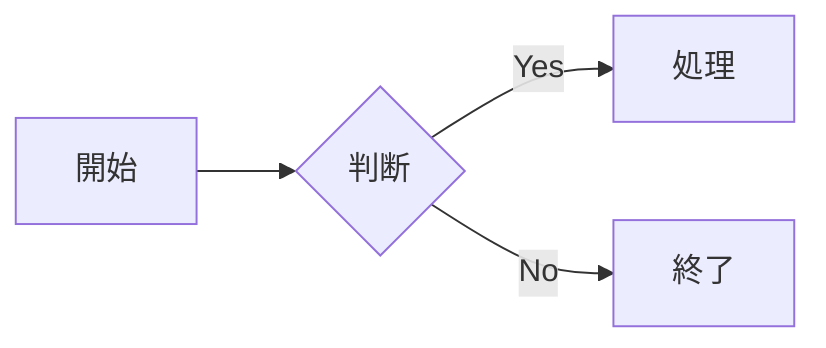
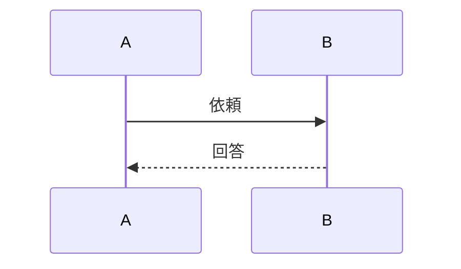
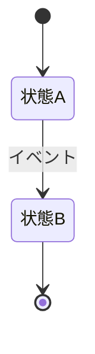
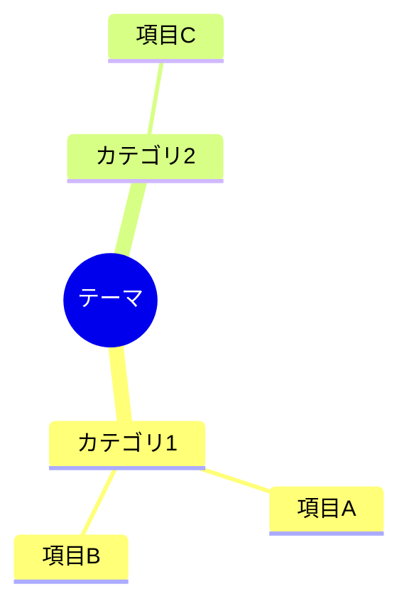
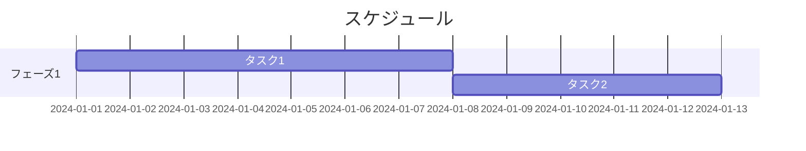
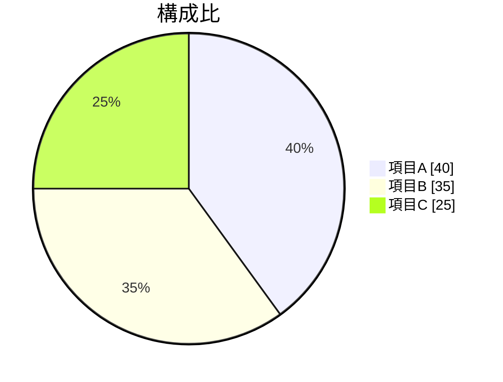

# Markdown資料作成ガイド

Markdown形式で効果的な資料を作成するためのスキルです。適切な章構成とMermaid図解を活用して、読みやすく伝わる資料を作成します。

## ドキュメント種類の選択

作成する資料の目的に応じて、適切なテンプレートを選択してください。



| 資料タイプ | 目的 | 推奨テンプレート |
|-----------|------|-----------------|
| 説明資料 | 概念・仕組み・背景を伝える | [explanation.md](./templates/document-types/explanation.md) |
| 手順書 | 作業手順を案内する | [procedure.md](./templates/document-types/procedure.md) |
| 提案書 | 承認・意思決定を求める | [proposal.md](./templates/document-types/proposal.md) |
| 報告書 | 実績・結果を報告する | [report.md](./templates/document-types/report.md) |
| 会議議事録 | 会議内容を記録する | [meeting-notes.md](./templates/document-types/meeting-notes.md) |
| FAQ | よくある質問に答える | [faq.md](./templates/document-types/faq.md) |

## 章構成の基本パターン

各資料タイプには推奨される章構成があります。

### 説明資料

```
1. はじめに       ← 背景・目的・対象読者を含む
2. Input         ← 参照文書をリンク付きで記載
3. 対象範囲       ← 何を含み、何を含まないか
4. 詳細説明       ← 本題（図解を活用）
5. まとめ         ← 要点の整理
```

### 手順書

```
1. はじめに       ← この手順で何ができるか
2. Input         ← 参照文書をリンク付きで記載
3. 前提条件       ← 必要な準備、権限、環境
4. 作業フロー     ← 全体像を図解
5. 手順          ← ステップバイステップ
6. 確認事項       ← チェックリスト
7. トラブルシューティング ← よくある問題と対処法
```

### 提案書

```
1. エグゼクティブサマリー ← 1ページで全体像（忙しい人向け）
2. 背景/課題       ← なぜ今この提案が必要か
3. 提案内容        ← 何をどうするか
4. 期待効果        ← どんなメリットがあるか
5. 実施計画        ← いつ何をするか（ガントチャート推奨）
6. リスクと対策     ← 想定されるリスクへの備え
```

### 報告書

```
1. サマリー        ← 結論を先に
2. 実績/結果       ← 数値・事実ベース
3. 分析           ← 結果の解釈（グラフ推奨）
4. 課題と対策      ← 問題点と対応方針
5. 次のステップ    ← 今後の予定
```

### 会議議事録

```
1. 会議情報        ← 日時、参加者、目的
2. アジェンダ      ← 議題一覧
3. 議論内容        ← 各議題の詳細
4. 決定事項        ← 確定した内容
5. アクションアイテム ← 担当者、期限付きタスク
```

### FAQ

```
- 目次（カテゴリ一覧）
- カテゴリ1
  - Q1: 質問文
    - A1: 回答
  - Q2: 質問文
    - A2: 回答
- カテゴリ2
  - ...
```

## Mermaid図解のベストプラクティス

### いつ図を使うか

| 表現したい内容 | 推奨する図 | 例 |
|--------------|----------|-----|
| 処理の流れ・手順 | フローチャート | 作業フロー、承認プロセス |
| 時系列のやり取り | シーケンス図 | コミュニケーションフロー |
| 状態の変化 | 状態遷移図 | ステータス管理、ライフサイクル |
| データの関係 | ER図 | 情報構造、関連性 |
| 階層構造 | マインドマップ | 概念整理、分類 |
| スケジュール | ガントチャート | プロジェクト計画 |
| 割合・分布 | 円グラフ | 構成比、統計 |

### 図解の基本ルール

1. **1図1メッセージ**: 1つの図で伝えることは1つに絞る
2. **ノード数は15以下**: 複雑な場合は分割する
3. **ラベルは簡潔に**: 長い説明は本文で補足
4. **色は意味を持たせる**: 統一したカラールール

### カラールール

| 用途 | 色 | 使用場面 |
|-----|-----|---------|
| 開始/終了/成功 | 緑 `#e1f5e1` | ゴール、完了状態 |
| 通常処理 | 青 `#bbdefb` | 一般的なステップ |
| 判断/条件 | 黄 `#fff3cd` | 分岐点、確認ポイント |
| 警告/エラー | 赤 `#f8d7da` | 注意、失敗状態 |
| 強調 | オレンジ `#ffe0b2` | 重要ポイント |

### クイックリファレンス

**フローチャート**


**シーケンス図**


**状態遷移図**


**マインドマップ**


**ガントチャート**


**円グラフ**


詳細な構文は [Mermaidリファレンス](./templates/mermaid/diagram-reference.md) を参照してください。

## Markdownスタイルガイド

### 文体のルール

- **敬語は使用しない**: 技術文書・社内資料は「である調」で統一する
  - ❌ 「〜してください」「〜します」「〜です」
  - ✅ 「〜する」「〜である」「〜とする」
- 簡潔で直接的な表現を心がける

### 見出しの使い方

```markdown
# ドキュメントタイトル（1つのみ）

## 大セクション（章）

### 中セクション（節）

#### 小セクション（項）
```

- `#` はドキュメント全体で1つだけ
- 見出しレベルは飛ばさない（`##` の次は `###`）

### リストの使い方

**箇条書き**: 順序が重要でない列挙
```markdown
- 項目A
- 項目B
- 項目C
```

**番号付き**: 順序が重要な列挙、手順
```markdown
1. 最初のステップ
2. 次のステップ
3. 最後のステップ
```

**チェックリスト**: 確認項目
```markdown
- [ ] 未完了の項目
- [x] 完了した項目
```

### 表の使い方

```markdown
| ヘッダー1 | ヘッダー2 | ヘッダー3 |
|----------|----------|----------|
| データ1  | データ2  | データ3  |
| データ4  | データ5  | データ6  |
```

**使い分け**:
- 比較・対照 → 表
- 手順・順序 → 番号付きリスト
- 列挙・選択肢 → 箇条書き

### 強調の使い方

| 記法 | 表示 | 用途 |
|-----|------|-----|
| `**太字**` | **太字** | 重要な用語、キーワード |
| `*斜体*` | *斜体* | 補足、注釈 |
| `` `コード` `` | `コード` | コマンド、変数名 |
| `> 引用` | 引用ブロック | 他資料からの引用 |

## テンプレート一覧

### ドキュメントテンプレート

- [説明資料](./templates/document-types/explanation.md)
- [手順書](./templates/document-types/procedure.md)
- [提案書](./templates/document-types/proposal.md)
- [報告書](./templates/document-types/report.md)
- [会議議事録](./templates/document-types/meeting-notes.md)
- [FAQ](./templates/document-types/faq.md)

### Mermaidリファレンス

- [図解リファレンス](./templates/mermaid/diagram-reference.md)

## 使用例

- [プロジェクト説明資料](./examples/project-explanation.md)
- [オンボーディング手順書](./examples/onboarding-procedure.md)
- [四半期報告書](./examples/quarterly-report.md)

## 参考リソース

- [Mermaid公式ドキュメント](https://mermaid.js.org/)
- [Mermaid Live Editor](https://mermaid.live/)
- [GitHub Flavored Markdown](https://github.github.com/gfm/)

---
> Converted and distributed by [TomeVault](https://tomevault.io/claim/superpyonchix) — claim your Tome and manage your conversions.
<!-- tomevault:4.0:skill_md:2026-04-15 -->
