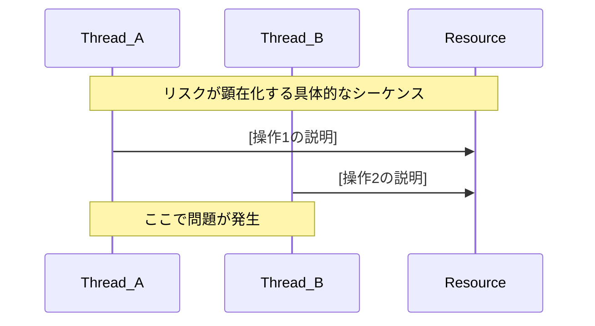

# Embedded C++14 リスク分析スキル

## 概要

このスキルは、車載セントラルECU向けQNX/Linux組み込みC++14コードに対して、
**メモリ安全性**および**並行処理**に関する設計・ロジックレベルのリスク分析を行います。

CodeSonarやQACといった静的解析ツールでは検出困難な、設計上の構造的リスクやロジックの
競合状態を人間が判断するための分析レポートを生成します。

### 対象とする技術領域

- POSIX スレッド（pthread）およびQNX固有スレッドAPI
- C++14標準並行処理（`std::thread`, `std::mutex`, `std::condition_variable` 等）
- 共有メモリによるQNX/Linux間IPC
- QNXメッセージパッシング（`MsgSend`/`MsgReceive`/`MsgReply`）

### 分析の位置づけ

```
静的解析ツール（CodeSonar, QAC）
  → コーディング規約違反、単純なバグパターン検出

本スキル（設計・ロジックレベル）  ← ここを担当
  → ライフタイム設計の妥当性、ロック戦略の整合性、
    IPC設計の競合リスク、リソース管理の構造的問題
```

---

## 使用タイミング

このスキルは以下の3つのシナリオで使用します。

### シナリオ1：コードレビュー前の事前チェック

マージリクエスト対象のファイルや変更差分に対して、レビュー前にリスクを洗い出す。
レビュアーが注目すべきポイントを事前に明確化する。

**トリガー例：**
- 「このファイルのリスク分析をして」
- 「MR対象のコードをリスクチェックして」
- 「レビュー前にこのクラスの安全性を確認して」

### シナリオ2：既存コードベースのリスク棚卸し

既存モジュールやコンポーネント全体を対象に、潜在的なリスクを体系的に洗い出す。

**トリガー例：**
- 「このモジュール全体のリスク棚卸しをして」
- 「共有メモリを使っている箇所を全部リスク分析して」
- 「並行処理周りのリスクを一覧化して」

### シナリオ3：バグ・不具合発生後の原因分析支援

再現困難なバグや間欠障害について、コードから原因候補を推定する。

**トリガー例：**
- 「デッドロックが発生しているが原因がわからない」
- 「メモリ破壊が間欠的に起きる原因を分析して」
- 「このクラッシュダンプに関連するリスクを調査して」

---

## 分析手順

### ステップ1：対象コードのスコープ確定

分析対象のファイル、クラス、関数、またはモジュールを特定する。
ユーザーが指定しない場合は、以下の優先度で対象を提案する。

1. 現在開いているファイル
2. ワークスペース内の並行処理・IPC関連コード
3. ユーザーが言及したモジュール・コンポーネント

### ステップ2：メモリ安全性分析

以下のチェックリスト（[memory-safety-checklist.md](./checklists/memory-safety-checklist.md)）に基づいて分析する。

#### 2-1. ポインタライフタイム分析

- 生ポインタの所有権が曖昧な箇所を検出
- `new`/`delete` の非対称ペアを検出
- ダングリングポインタのリスクがある参照パターンを検出
- スマートポインタ使用時の循環参照リスクを検出
- コールバックやラムダにキャプチャされたポインタのライフタイム超過を検出

#### 2-2. バッファ安全性分析

- 固定長バッファへの動的データ書き込みを検出
- IPC受信バッファのサイズ検証不足を検出
- `memcpy`、`memset` 等のサイズ引数の妥当性を検証
- 配列インデックスの境界チェック漏れを検出

#### 2-3. リソースリーク分析

- RAII非準拠のリソース管理パターンを検出
- 例外パス・エラーパスでのリソース解放漏れを検出
- ファイルディスクリプタ、ソケット、共有メモリハンドルのリーク候補を検出

### ステップ3：並行処理リスク分析

以下のチェックリスト（[concurrency-checklist.md](./checklists/concurrency-checklist.md)）に基づいて分析する。

#### 3-1. デッドロック分析

- ロック獲得順序の不整合を検出（複数mutexの順序）
- ロック保持中のブロッキング操作（IPC送信、I/O待ち等）を検出
- `std::lock_guard` / `std::unique_lock` の適切性を検証
- QNX `MsgSend` 中のmutex保持パターンを検出（send-blocked + mutex = デッドロック候補）

#### 3-2. レースコンディション分析

- ロック保護されていない共有変数アクセスを検出
- TOCTOU（Time Of Check To Time Of Use）パターンを検出
- 共有メモリ上のデータに対するアトミック性不足を検出
- `std::shared_ptr` の参照カウント競合リスクを検出

#### 3-3. IPC安全性分析

- 共有メモリの同期メカニズム（セマフォ、mutex）の妥当性を検証
- QNXメッセージパッシングのブロッキング特性によるスレッド枯渇リスクを検出
- IPC境界でのデータ整合性（部分書き込み、構造体パディング）を検証
- QNX/Linux間IPC時のエンディアン・アライメント問題を検出

### ステップ4：リスク評価とレポート生成

各検出項目について以下の基準でリスクレベルを評価する。

| リスクレベル | 基準 |
|------------|------|
| **High** | システムクラッシュ、データ破壊、デッドロックに直結する可能性が高い。即座の対応が必要。 |
| **Medium** | 特定条件下でのみ顕在化するが、顕在化した場合の影響が大きい。計画的な対応が必要。 |
| **Low** | 防御的プログラミングの観点で改善が望ましい。リファクタリング時に対応。 |

レポートは以下の2つの形式で出力する。

**形式1：リスクサマリーテーブル**
（[risk-table-template.md](./templates/risk-table-template.md) を参照）

**形式2：詳細分析レポート**
（[risk-report-template.md](./templates/risk-report-template.md) を参照）

---

## 出力フォーマット

### リスクサマリーテーブル

以下の形式で出力すること。Confluence貼り付けにも対応するMarkdownテーブルとする。

```markdown
# リスク分析サマリー

| # | リスクレベル | カテゴリ | ファイル:行 | リスク概要 | 影響 |
|---|-----------|---------|-----------|----------|------|
| 1 | 🔴 High | デッドロック | `src/ipc_handler.cpp:142` | MsgSend中にmutex_aを保持 | システムハング |
| 2 | 🟡 Medium | レースコンディション | `src/shared_data.cpp:87` | 共有変数にロックなしアクセス | データ不整合 |
| 3 | 🟢 Low | リソースリーク | `src/file_manager.cpp:203` | エラーパスでfdが未closeの可能性 | リソース枯渇（長期運用時） |
```

### 詳細分析レポート

各リスク項目について以下の構造で詳細を記述する。

````markdown
## リスク #[番号]: [リスク概要]

**リスクレベル:** 🔴 High / 🟡 Medium / 🟢 Low
**カテゴリ:** メモリ安全性 / デッドロック / レースコンディション / IPC安全性
**ファイル:** `[ファイルパス]:[行番号]`

### 該当コード

```cpp
// 問題のあるコードスニペットを引用
// 関連する行を含めて前後のコンテキストも表示
```

### リスク説明

[このコードパターンがなぜ危険なのかを具体的に説明する]

### リスク顕在化シーケンス



### 修正提案

```cpp
// リファクタリング後のコード例
// 安全なパターンへの書き換え例を提示
```

### 修正のポイント

- [修正で何が改善されるか]
- [なぜこのパターンが安全か]
````

---

## 分析パターンの詳細ガイド

### パターン1：QNX MsgSend デッドロック

QNX環境で最も危険なパターン。`MsgSend`はサーバーが`MsgReply`するまで
呼び出しスレッドをブロックする。mutex保持中に`MsgSend`を行うと、
サーバー側が同じmutexを取得しようとした場合にデッドロックが成立する。

**検出キーワード:** `MsgSend`, `MsgSendv`, `MsgSendPulse` がmutexの
lock/unlockスコープ内にあるケース。

### パターン2：共有メモリ TOCTOU

共有メモリ上の値をチェックし、その結果に基づいて操作する場合、
チェックと操作の間に他プロセスが値を書き換える可能性がある。

**検出キーワード:** 共有メモリポインタ経由でのif文チェック後に、
同じ値を使った操作が続くパターン。

### パターン3：コールバック中のダングリングポインタ

非同期コールバックやタイマーハンドラに登録されたオブジェクトが、
コールバック実行前に破棄されるパターン。AUTOSAR AP環境のaraコンポーネントで
サービスディスカバリのコールバック登録時に頻出する。

**検出キーワード:** `std::bind`, ラムダキャプチャでの`this`や生ポインタの
キャプチャ、コールバック登録後のオブジェクト破棄パス。

### パターン4：ロック順序不整合

複数のmutexを異なる順序で獲得するコードパスが存在する場合、
クラス間・モジュール間のロック順序が暗黙的に矛盾していることがある。

**検出キーワード:** 2つ以上の`mutex`の`lock`が同一関数または
呼び出しチェーン内に存在するケース。`std::lock()`による一括獲得がされていないケース。

### パターン5：スレッド間の例外安全性不足

`std::mutex`を`lock()`/`unlock()`で直接操作し、`lock_guard`や
`unique_lock`を使用していない場合、例外発生時にロックが解放されない。

**検出キーワード:** `.lock()` と `.unlock()` の直接呼び出し、
`try`/`catch`ブロック内でのmutex操作。

---

## ベストプラクティス

### 分析時の注意事項

1. **誤検知の可能性を明示すること。** 設計・ロジックレベルの分析は文脈依存であり、
   コードスニペットだけでは判断しきれないケースがある。判断に確信が持てない場合は
   「要確認」として報告し、確認すべき観点を併記すること。

2. **AUTOSAR AP固有のパターンを考慮すること。** ara::comのサービスディスカバリ、
   ara::exec のステートマネジメントなど、AUTOSAR AP固有のフレームワークが
   暗黙的にスレッドを生成する場合がある。フレームワーク起因のスレッドも分析対象に含めること。

3. **QNXとLinuxの差異を意識すること。** 同一コードがQNXとLinuxの両方で動作する場合、
   スケジューリングポリシー（QNXはリアルタイム優先度ベース）の違いにより、
   片方の環境でのみ顕在化するリスクがある。この差異をレポートに明記すること。

4. **レポートの粒度を状況に応じて調整すること。**
   - コードレビュー前：変更差分に関連するリスクに集中し、簡潔に報告
   - リスク棚卸し：網羅的にスキャンし、リスクレベル別に優先順位を明示
   - 原因分析：報告されたバグの症状から逆引きして、候補となるリスクを深掘り

### 修正提案のガイドライン

- 修正案はC++14準拠であること（C++17以降の機能は使用しない）
- AUTOSAR C++14コーディングガイドラインおよびCERT C++に準拠した修正を提案すること
- 可能であればRAIIパターンへの書き換えを優先すること
- パフォーマンスへの影響がある修正は、トレードオフを明記すること

---

## トラブルシューティング

### 「分析対象が広すぎてレポートが長大になる」

対象をモジュール単位やクラス単位に分割し、リスクレベルHighの項目から
段階的に分析してください。以下のように依頼すると効果的です：
- 「Highリスクのみ抽出して」
- 「並行処理リスクだけに絞って分析して」
- 「この関数に限定してリスク分析して」

### 「コンテキストが不足して正確な分析ができない」

分析には呼び出し元、スレッド構成、共有リソースの情報が必要です。
以下の追加情報を提供すると分析精度が向上します：
- スレッド構成（何本のスレッドがどの役割を担うか）
- ロック戦略（どのmutexがどのデータを保護するか）
- IPCのメッセージフロー
- クラス図やシーケンス図（NextDesignからのエクスポートなど）

### 「mermaidシーケンス図が複雑すぎる」

シーケンス図はリスクが顕在化する最小のシナリオに絞って記述します。
3〜4つのparticipantと10ステップ以内を目安にしてください。
全体のフローが必要な場合は別途依頼してください。

---
> Converted and distributed by [TomeVault](https://tomevault.io/claim/superpyonchix) — claim your Tome and manage your conversions.
<!-- tomevault:4.0:skill_md:2026-04-14 -->
