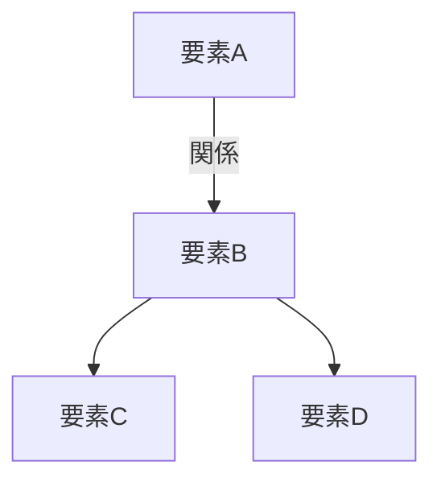
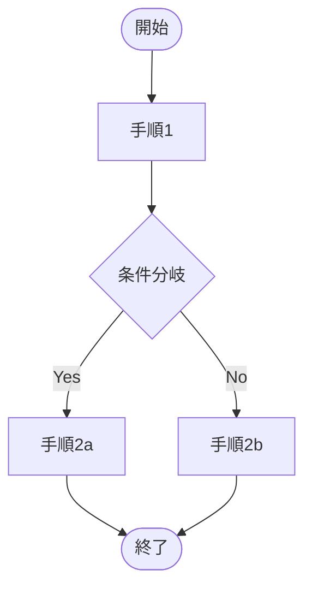
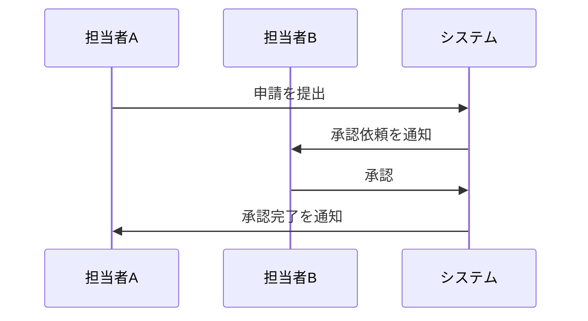
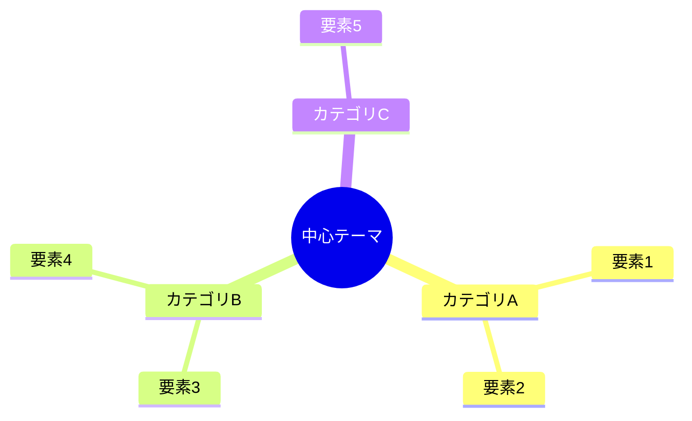
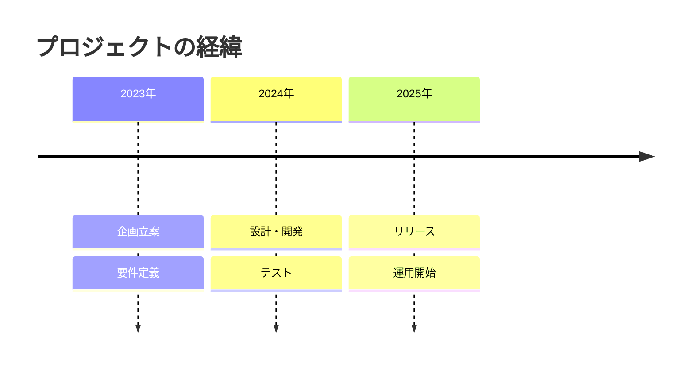

# Markdown 説明資料作成スキル

Markdown形式で説明資料・ナレッジベース記事を作成するスキル。
技術・非技術を問わず、あらゆるテーマの概念・仕組み・制度・プロセス・背景を「構造化された文書」として整理する。mermaid図解を積極的に活用して視覚的理解を促進し、`<details>` / `<summary>` タグによる折りたたみで補足情報を階層化する。

## 使用タイミング

以下のいずれかに該当する場合にこのスキルを使用する：

- 何らかのテーマについて説明資料を作成するとき
- Confluence等のナレッジベースに投稿する記事を作成するとき
- 概念・仕組み・アーキテクチャ・設計思想・制度・プロセス・ルールなどを他者に伝える資料が必要なとき
- 既存の資料やドキュメントの内容を噛み砕いて説明する資料を作成するとき
- 「〜について説明資料を作って」「〜をまとめて」「〜をわかりやすく整理して」といった依頼を受けたとき

## 資料作成前の必須ヒアリング

資料作成に着手する前に、必ず以下をユーザーに確認すること。不明な項目がある場合は質問して解消する。

### 必須確認事項

1. **テーマ**：何について説明する資料か
2. **読者レベル**：以下から選択してもらう
   - **入門者**：対象テーマにほぼ触れたことがない（前提知識の説明を厚くし、専門用語には都度補足を入れる）
   - **中級者**：基本概念は理解している（前提知識は簡潔に、本題を中心に記述する）
   - **上級者**：対象テーマに精通している（前提は省略し、深い考察や応用的な内容を中心に記述する）
   - **非専門家**：対象分野のバックグラウンドがない読者（専門用語を極力避け、比喩や具体例で説明する）
3. **インプット資料**：参照すべき仕様書、公式ドキュメント、URL、既存資料があるか

### 任意確認事項（必要に応じて質問）

- 特に重点的に説明してほしい箇所はあるか
- 記載不要・スコープ外の内容はあるか
- 想定される掲載先（Confluence、GitLabのWiki、README、社内ポータルなど）

## 文書構成テンプレート

以下の構成を標準とする。テーマによってセクションの増減・順序変更は可。

```
# [資料タイトル]

## はじめに
- この資料の目的と背景を述べる
- 読者が「なぜこの資料を読む必要があるのか」を理解できるようにする

## インプット資料
- 参照した資料・関連資料をリストアップする
- URL・ファイルパス・バージョン情報を含める

## 概要
- テーマの全体像を簡潔に説明する
- **ここにmermaid図解を必ず配置する**
- 図解の種類はテーマに応じて最適なものを選択する
- 図解の直後に、図の読み方や要点を簡潔に補足する

## 詳細説明
- 概要で示した各要素を掘り下げて説明する
- 必要に応じてサブセクションに分割する
- 補足的な情報は<details>/<summary>タグで折りたたむ
- 必要に応じて追加のmermaid図解を配置する

## まとめ（任意）
- 要点の整理が有効な場合に配置する
```

テンプレートファイルを参照する場合：[標準テンプレート](./templates/standard-template.md)、[ナレッジベーステンプレート](./templates/knowledge-base-template.md)

## 文体・表記ルール

### 文体

- **常体（である調）** を使用する。「〜である。」「〜となる。」「〜を示す。」
- 「です・ます調」は使用しない
- 簡潔で断定的な表現を心がける
- 一文は長くなりすぎないようにする（目安：60〜80文字以内）

### 表記

- 専門用語は初出時に正式名称と略称を併記する（例：「プロセス間通信（IPC: Inter-Process Communication、以下IPC）」）
- 読者レベルが「入門者」「非専門家」の場合は、専門用語に簡潔な補足を添える
- 略語や頭字語は初出時に展開する

### 見出しレベル

- `#` ：資料タイトル（1つのみ）
- `##` ：主要セクション（はじめに、インプット資料、概要、詳細説明など）
- `###` ：サブセクション
- `####` ：必要に応じて使用するが、深くなりすぎないよう注意する

## mermaid図解ガイドライン

### 基本方針

mermaid図解はすべての資料で積極的に活用する。概要セクションには必ず1つ以上配置し、詳細説明でも理解の助けになる場合は追加する。図解があることで読者の理解度は大きく向上する。

### 選択基準

テーマの性質に応じて最適な図の種類を選択する。以下は判断の目安である。

| 説明したい内容 | 推奨する図の種類 |
|---|---|
| 構成要素と関係性 | `graph TD` / `graph LR`（構成図） |
| 処理・手続き・ワークフローの流れ | `flowchart TD` / `flowchart LR` |
| 関係者・コンポーネント間のやり取り | `sequenceDiagram` |
| 状態の遷移 | `stateDiagram-v2` |
| クラス構造・データ構造・概念の関係 | `classDiagram` |
| 時系列の工程・スケジュール | `gantt` |
| 概念の包含関係・グループ化 | `graph` + `subgraph` |
| 要件と機能の対応 | `requirementDiagram` |
| ユーザー操作の流れ | `journey` |
| 円グラフ的な割合の可視化 | `pie` |
| Git等のブランチ戦略 | `gitgraph` |
| 時系列イベントの整理 | `timeline` |
| 思考の整理・要素の洗い出し | `mindmap` |

### 作成ルール

- 概要セクションには必ず1つ以上のmermaid図を配置する
- ノードやラベルは日本語で記述する
- 複雑になりすぎる場合は図を分割する（1つの図のノード数は目安15個以内）
- 図の直後に「上図は〜を示している。」のように要点を1〜2文で補足する
- 色分けやスタイリングは可読性向上に有効な場合のみ使用する
- テーマに最もふさわしい図の種類を選択する（上記の表は目安であり、柔軟に判断する）

### mermaid記述例

#### 構成図の例

~~~

~~~

#### フローチャートの例

~~~

~~~

#### シーケンス図の例

~~~

~~~

#### マインドマップの例

~~~

~~~

#### タイムラインの例

~~~

~~~

## 折りたたみ補足の活用ガイドライン

### 使用場面

以下のような補足情報は `<details>` / `<summary>` タグで折りたたむ。

- 用語解説や前提知識の補足
- 具体的なコマンド例・設定例・手順の詳細
- トラブルシューティング情報
- 参考リンク集
- 発展的な内容・応用的な話題
- 歴史的経緯・背景の深掘り
- 他の方法との比較情報

### 記述例

```html
<details>
<summary>用語解説：アジャイル開発とは</summary>

アジャイル開発とは、短い開発サイクル（イテレーション）を繰り返しながら、
段階的にソフトウェアを構築していく開発手法の総称である。
2001年に発表された「アジャイルソフトウェア開発宣言」がその基盤となっている。

</details>
```

### ルール

- 本文の流れを阻害する補足情報に使用する
- summaryには折りたたみの内容が推測できるタイトルを付ける
- 資料の核心部分は折りたたまない（読者が必ず読むべき内容は本文に記載する）
- 読者レベルが「入門者」の場合は折りたたみを多めに活用し、本文をシンプルに保つ
- 読者レベルが「上級者」の場合は基本的な用語解説を折りたたみに格納する
- 読者レベルが「非専門家」の場合は専門用語の解説を折りたたみではなく本文中に含める

## 品質チェックリスト

資料生成後、以下の観点でセルフチェックを行う。

- [ ] 「はじめに」で資料の目的と背景が明確に述べられているか
- [ ] 「インプット資料」に参照元が漏れなく記載されているか（参照資料がない場合はその旨を記載）
- [ ] 「概要」にmermaid図解が配置されているか
- [ ] mermaid図解の直後に要点の補足があるか
- [ ] mermaid図解の種類がテーマに対して適切か
- [ ] 読者レベルに合った説明の粒度になっているか
- [ ] 文体が「である調」で統一されているか
- [ ] 補足情報が適切に折りたたまれているか
- [ ] 見出しの階層が論理的に整理されているか
- [ ] 一文が長すぎないか（目安60〜80文字以内）
- [ ] 専門用語の初出時に説明があるか（読者レベルに応じて）
- [ ] 資料全体を通して論理的な流れが維持されているか

## トラブルシューティング

### mermaid図がレンダリングされない場合

- コードブロックの言語指定が `mermaid` になっているか確認する
- ノード名に特殊文字（`(`, `)`, `[`, `]` など）が含まれている場合はクォートで囲む
- 掲載先のプラットフォームがmermaid記法に対応しているか確認する
- mermaidのバージョンによって対応していない図の種類がある場合は代替の図を検討する

### 資料が長くなりすぎる場合

- 詳細説明の一部を折りたたみにする
- 資料を複数に分割し、相互リンクで参照する構成を検討する
- 「この資料のスコープ」を「はじめに」で明示して範囲を絞る

### 読者レベルの判断が難しい場合

- 迷った場合は「中級者」をデフォルトとする
- 重要な前提知識は折りたたみで補足し、必要な読者だけが展開できるようにする

### テーマが広範囲すぎる場合

- ユーザーにスコープの絞り込みを提案する
- 全体像を概要で示した上で、詳細説明では重要な部分にフォーカスする
- 残りの部分は「関連テーマ」や「今後の補足資料」として言及するにとどめる

---
> Converted and distributed by [TomeVault](https://tomevault.io/claim/superpyonchix) — claim your Tome and manage your conversions.
<!-- tomevault:4.0:skill_md:2026-04-15 -->
