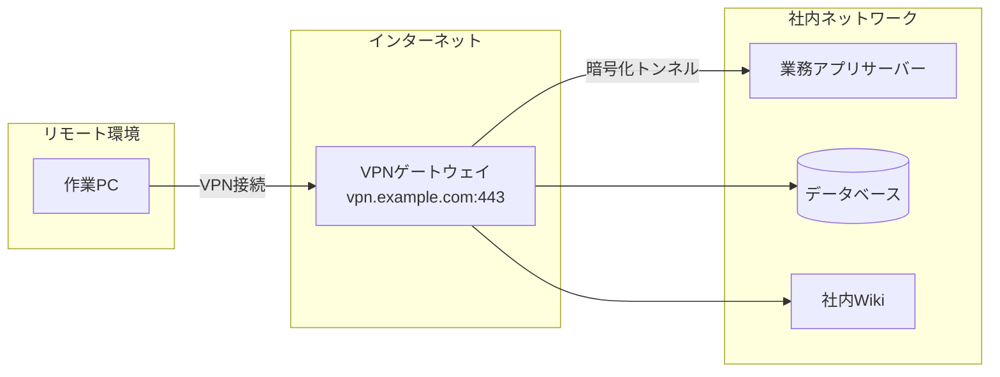
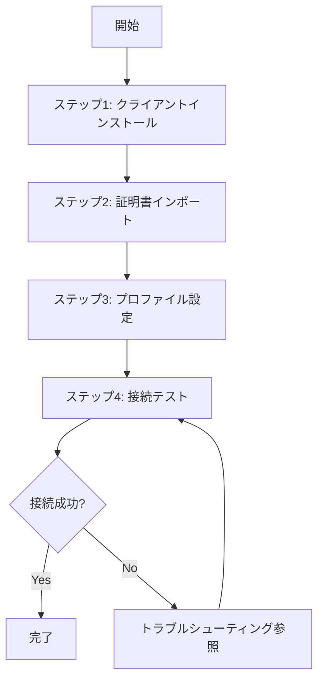

# Markdown 業務手順書作成スキル

## 概要

社内の汎用的な業務手順書を、構造化されたMarkdown形式で対話的に作成するスキルである。
ユーザーへのヒアリングを通じて段階的に手順書を組み立て、Mermaid記法による視覚的な図解、
`<details>` タグによる折りたたみ補足、トラブルシューティングセクションを含む
わかりやすい手順書を生成する。

## 使用タイミング

以下のいずれかに該当する場合にこのスキルを使用すること：

- 「〇〇の手順書を作って」「〇〇のやり方をまとめて」と依頼されたとき
- 既存のメモや箇条書きから手順書を整形するよう求められたとき
- 業務フローのドキュメント化を依頼されたとき
- 作業手順の標準化やナレッジ化が目的のとき

## 手順書テンプレート構造

作成する手順書は、以下のセクション構成に従うこと。
テンプレートファイルも参照：[手順書テンプレート](./templates/procedure-template.md)

### セクション構成

```
# [手順書タイトル]

## 1. はじめに
  - 目的・背景を簡潔に記述（2〜3文程度）
  - 長くなりすぎないこと。導入としての役割に徹する

## 2. インプット資料
  - 事前に読むべき資料、参考リンク、関連ドキュメント

## 3. 前提条件
  - 環境要件、必要なツール、権限、事前準備

## 4. 手順
  ### 4.1 概要
    - Mermaid図解で手順全体の流れやシステム構成を視覚化
    - 図の後に、全体の流れを簡潔にテキストでも補足
  ### 4.2 ステップ1：[ステップ名]
    - 具体的な操作手順
  ### 4.3 ステップ2：[ステップ名]
    - ...以降同様
  ### 4.N 完了確認（必要に応じて）

## 5. トラブルシューティング
  - よくあるエラーと対処法
```

### 「はじめに」の記述方針

「はじめに」は手順書の導入部であり、**簡潔さを最優先**とする。
目的と対象読者が一目で把握できる程度にとどめること。
図解や詳細な背景説明はここには含めない。

良い例：

```markdown
## 1. はじめに

本手順書は、新規メンバーが社内VPNに接続するための初期セットアップ手順をまとめたものである。
本手順を完了すると、リモート環境から社内ネットワークへ安全にアクセスできるようになる。
```

### 「手順 > 概要」の記述方針

手順セクションの冒頭に必ず「概要」サブセクションを設け、
**これから行う作業の全体像を視覚的に示す**こと。
ここが手順書の"地図"の役割を果たす。

Mermaid図は**内容に最も適した図の種類**を選択する：

| 図の種類 | 適しているケース | Mermaid記法 |
|---------|----------------|-------------|
| フローチャート | 作業手順の流れ、分岐のある判断プロセス | `flowchart TD` / `flowchart LR` |
| システム構成図 | サーバー構成、ネットワーク構成、ツール間の関係 | `graph TD` / `graph LR` でブロック構成を表現 |
| シーケンス図 | 複数の人・システム間のやりとりの順序 | `sequenceDiagram` |
| 状態遷移図 | 状態の変化を伴うプロセス | `stateDiagram-v2` |
| C4コンテキスト図 | システム全体の俯瞰、外部連携の把握 | `C4Context` |
| ブロック図 | アーキテクチャ、レイヤー構造 | `block-beta` |

**図の選択基準**：

- 「作業の流れ・順序」が主題 → フローチャート
- 「何と何がどう繋がるか」が主題 → システム構成図 / ブロック図
- 「誰が誰に何を渡すか」が主題 → シーケンス図
- 複数の観点が必要な場合は、**2つ以上の図を組み合わせてもよい**（例：構成図＋フロー図）

例（システム構成図）：

~~~markdown

~~~

例（フローチャート）：

~~~markdown

~~~

Mermaid図の後には、図を補足する簡潔なテキスト説明を必ず添えること。

### 手順書の文体

手順書全体の文体は「である・となる」調（常体）で統一すること。
「です・ます」調（敬体）は使用しない。

良い例：
- 「〇〇をインストールする」
- 「以下のコマンドを実行する」
- 「正常に完了した場合、△△が表示される」
- 「本手順は〇〇を対象としたものである」

悪い例：
- 「〇〇をインストールします」
- 「以下のコマンドを実行してください」
- 「正常に完了した場合、△△が表示されます」

## ヒアリングプロセス

ユーザーから手順書作成を依頼されたら、**一度に全てを聞かず**、以下のフェーズに分けて対話的に情報を収集すること。各ターンの質問は **最大3つ** までとする。

### フェーズ1：基本情報の収集

まず以下を確認する：

1. **手順書のタイトル・対象作業**：何の手順書を作るのか
2. **想定読者**：誰が読むのか（新人、チームメンバー、他部署など）
3. **作業のゴール**：この手順を完了すると何が達成されるのか

### フェーズ2：詳細情報の収集

基本情報をもとに、以下を深掘りする：

1. **インプット資料**：参照すべきドキュメント、URL、社内Wikiなどがあるか
2. **前提条件**：必要な環境、ツール、アカウント、権限
3. **大まかな作業ステップ**：ざっくりとした流れ

### フェーズ3：手順の詳細化

大まかな流れをもとに、各ステップを詳細化する：

1. **具体的なコマンドや操作**：各ステップで実行する具体的な内容
2. **注意点・ハマりポイント**：経験上つまずきやすい箇所
3. **確認方法**：各ステップや最終的な完了確認の方法

### フェーズ4：ドラフト提示とレビュー

収集した情報をもとに手順書のドラフトを生成し、ユーザーにレビューを依頼する。
フィードバックを受けて修正を繰り返す。

## 記述ルール

### 折りたたみ補足（details / summary）

初心者向けの用語解説、背景情報、コマンドの詳細オプション説明など、
本筋の手順を読む上では必須ではないが知っておくと理解が深まる補足情報は、
`<details>` / `<summary>` タグで折りたたみにすること。

```html
<details>
<summary>補足：〇〇とは？</summary>

ここに補足情報を記載する。
コードブロックや箇条書きも使用可能。

</details>
```

**重要**：`<details>` タグの開始タグ直後と `</details>` 閉じタグ直前には**空行を入れる**こと。
空行がないとMarkdownパーサーによっては内部のMarkdown記法が正しくレンダリングされない。

### コマンド・コード記載

- コマンドは必ずコードブロック（` ``` `）で囲み、言語識別子を付与する
- 長いコマンドは改行して可読性を確保する
- 変更すべきパラメータは `<山括弧>` で囲んでプレースホルダーとして明示する

```bash
# 例：接続確認コマンド
ping -c 4 <対象サーバーのIPアドレス>
```

### トラブルシューティング

トラブルシューティングセクションは、以下の形式で記載する：

```markdown
## 5. トラブルシューティング

### 症状：〇〇エラーが表示される

**原因**：△△が正しく設定されていない可能性がある。

**対処法**：

1. □□を確認する
2. ××を修正する
3. 再度手順を実行する
```

症状ごとに見出しを分け、原因と対処法をセットで記載すること。

## 出力品質チェックリスト

手順書のドラフトを生成したら、以下の観点でセルフチェックを行うこと：

- [ ] 「はじめに」が簡潔に目的・導入を述べているか（2〜3文以内）
- [ ] 「はじめに」に図解や詳細説明を含めていないか
- [ ] インプット資料セクションに参照先が記載されているか（なければ「特になし」と明記）
- [ ] 前提条件が漏れなく記載されているか
- [ ] 「手順 > 概要」にMermaid図が含まれているか
- [ ] Mermaid図の種類が内容に適しているか（フロー、構成図、シーケンスなど）
- [ ] Mermaid図の後にテキストによる補足説明があるか
- [ ] 各手順ステップに番号が振られ、1ステップ1操作になっているか
- [ ] コマンドやコードがコードブロックで囲まれているか
- [ ] 変更すべきパラメータがプレースホルダー（`<>`）で明示されているか
- [ ] 補足情報が `<details>` タグで折りたたまれているか
- [ ] トラブルシューティングに最低1つ以上の事例が記載されているか
- [ ] 文体が「である・となる」調で統一されているか（「です・ます」が混在していないか）

## 入出力例

### 入力例

```
VPN接続の手順書を作ってください
```

### 出力の流れ

1. フェーズ1のヒアリングを開始（タイトル確認、読者、ゴール）
2. フェーズ2で詳細を収集（インプット、前提、ステップ概要）
3. フェーズ3で各ステップを深掘り
4. ドラフトを生成し、レビューを依頼

### 生成される手順書の例

完成例は [VPN接続セットアップ手順書の例](./examples/example-vpn-setup.md) を参照。

---
> Converted and distributed by [TomeVault](https://tomevault.io/claim/superpyonchix) — claim your Tome and manage your conversions.
<!-- tomevault:4.0:skill_md:2026-04-15 -->
