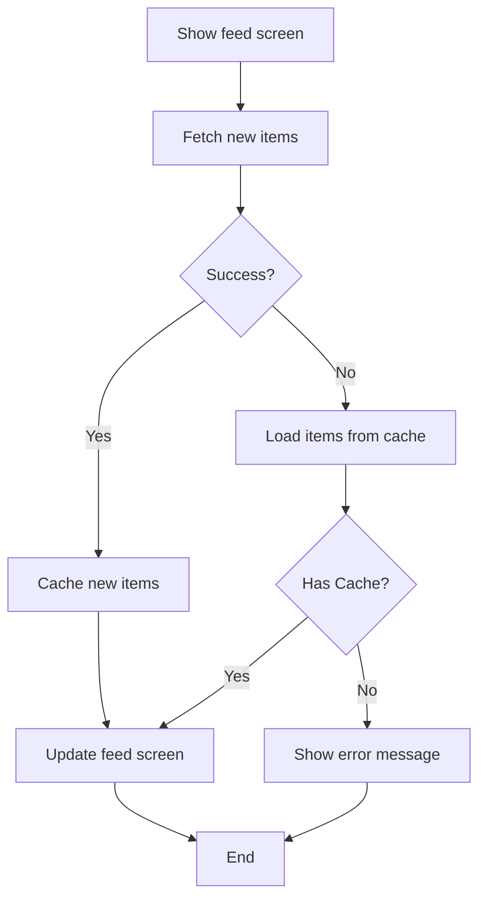

# Requirements Engineering

Transform vague requirements into clear, actionable specifications that bridge business needs and technical implementation.

## Overview

This skill guides the process of refining requirements through a structured approach:

1. **Question lousy requirements** → Eliminate assumptions
2. **Write BDD stories** → Define clear narratives and scenarios
3. **Create use cases** → Document system behavior step-by-step
4. **Generate diagrams** → Visualize workflows and architecture
5. **Document in README** → Create comprehensive project documentation

## When to Use This Skill

Use this skill when you encounter:
- Vague requirements that are "susceptible to personal interpretation"
- Feature requests without clear acceptance criteria
- Need to bridge technical and business propositions
- Requirements that need translation into testable specifications
- Projects requiring structured documentation

## Process: From Vague to Well-Defined

### Step 1: Identify the Problem (Lousy Requirements)

Recognize requirements that lack clarity:

**Example of lousy requirements:**
```
Story: As a user
I want the app to load the feed
So I can see the feed

Acceptance criteria:
Given a user
When the user opens the feed
Then the feed is displayed
```

**Problems:**
- Who is "a user"? (Online? Offline? New? Returning?)
- What does "load" mean? (From where? How?)
- What if there's no connectivity?
- What about caching?
- What defines "success"?

### Step 2: Ask Clarifying Questions

Transform vague requirements by asking:
- **Who** are the different types of users/customers?
- **What** exactly should happen in different scenarios?
- **Where** does the data come from? (Remote, cache, both?)
- **When** does this feature activate? (Always? On-demand?)
- **Why** do users need this? (What value does it provide?)
- **How** should errors be handled?

### Step 3: Write BDD Stories and Scenarios

Create clear narratives with specific acceptance criteria.

**Use the template from references/bdd_templates.md:**
```
Story: [Clear, user-focused title]

Narrative #1
As a [specific user type]
I want [specific feature/functionality]
So I can/that [clear business value]

Scenarios (Acceptance criteria)
Given [specific precondition]
And [additional preconditions]
When [specific action]
Then [specific expected outcome]
And [additional outcomes]
```

**Multiple narratives** for different user types or contexts.

**Example - Refined Feed Requirements:**

Story: Customer requests to see their image feed

Narrative #1
```
As an online customer
I want the app to automatically load my latest image feed
So I can always enjoy the newest images of my friends
```

Scenarios:
```
Given the customer has connectivity
When the customer requests to see the feed
Then the app should display the latest feed from remote
And replace the cache with the new feed
```

Narrative #2
```
As an offline customer
I want the app to show the latest saved version of my image feed
So I can always enjoy images of my friends
```

Scenarios:
```
Given the customer doesn't have connectivity
And there's a cached version of the feed
When the customer requests to see the feed
Then the app should display the latest feed saved

Given the customer doesn't have connectivity
And the cache is empty
When the customer requests to see the feed
Then the app should display an error message
```

**For detailed BDD patterns, see references/bdd_templates.md**

### Step 4: Create Use Cases

Translate BDD scenarios into procedural steps (the "recipes" for implementation).

**Use the template from references/usecase_templates.md:**
```
[Use Case Name]

Data (Input):
- [Parameter 1]
- [Parameter 2]

Primary course (happy path):
1. [Step 1]
2. [Step 2]
3. System delivers [output]

[Error type] – error course (sad path):
1. System delivers [error output]
```

**Example - Feed Feature Use Cases:**

**Load Feed Use Case**
```
Data (Input):
- URL

Primary course (happy path):
1. Execute "Load Feed Items" command with above data
2. System downloads data from the URL
3. System validates downloaded data
4. System creates feed items from valid data
5. System delivers feed items

Invalid data – error course (sad path):
1. System delivers error

No connectivity – error course (sad path):
1. System delivers error
```

**Load Feed Fallback (Cache) Use Case**
```
Data (Input):
- Max age

Primary course (happy path):
1. Execute "Retrieve Feed Items" command with above data
2. System fetches feed data from cache
3. System creates feed items from cached data
4. System delivers feed items

No cache course (sad path):
1. System delivers no feed items
```

**Save Feed Items Use Case**
```
Data (Input):
- Feed items

Primary course (happy path):
1. Execute "Save Feed Items" command with above data
2. System encodes feed items
3. System timestamps the new cache
4. System replaces the cache with new data
5. System delivers success message
```

**For common use case patterns (CRUD, caching, data fetching), see references/usecase_templates.md**

### Step 5: Generate Diagrams

Create visual representations to communicate workflows and architecture.

#### Flowchart (Feature Workflow)

Create a flowchart showing the complete feature flow including happy paths and error handling.

**Use Mermaid format:**


#### Architecture Diagram (Component Structure)

Show the modular architecture and component relationships.

**Use Mermaid format:**
```mermaid
graph TB
    subgraph "Factory/Builder"
        Factory[RemoteWithLocalFallbackFeedLoader<br/>Factory/Builder]
    end
    
    subgraph "Strategies"
        Remote[RemoteFeedLoader]
        Local[LocalFeedLoader]
    end
    
    subgraph "Protocol"
        Protocol[FeedLoader Protocol]
    end
    
    subgraph "Infrastructure"
        Controller[FeedViewController]
        UI[UIViewController]
    end
    
    Factory -.creates.-> Remote
    Factory -.creates.-> Local
    Remote -.implements.-> Protocol
    Local -.implements.-> Protocol
    Controller --> Protocol
    UI --> Controller
```

**For detailed diagram patterns and best practices, see references/diagram_guide.md**

### Step 6: Document in README

Structure all requirements, use cases, and diagrams into a comprehensive README.

**README Structure:**
1. **Project Title and Description**
2. **Use Cases** - All use cases with inputs, happy paths, and error paths
3. **Flowchart** - Feature workflow visualization
4. **Architecture** - Component structure and relationships
5. **BDD Specs** - Complete stories, narratives, and scenarios

**Use the generate_readme.py script** to automate README creation:
```bash
python scripts/generate_readme.py > README.md
```

Or customize the script with your specific requirements data.

## Best Practices

### Communication
- **Minimize assumptions** by asking clarifying questions
- **Use specific language** - avoid vague terms like "user" (specify "online customer", "offline customer")
- **Focus on behavior** not implementation details
- **Think user-first** - requirements should provide customer value

### BDD Stories
- **Write multiple narratives** for different user types or contexts
- **Be specific in scenarios** - "has connectivity" not "is online"
- **Cover error cases** explicitly
- **Use "And" to chain** preconditions and outcomes

### Use Cases
- **Keep steps atomic** - one action per step
- **Use active voice** - "System validates" not "Data is validated"
- **List all inputs** explicitly
- **Document all error paths** - don't just focus on happy path
- **One use case per operation** - don't combine multiple responsibilities

### Diagrams
- **Show both paths** - happy path AND error handling
- **Use consistent naming** across all documents
- **Keep it simple** - focus on essential flow
- **Color code** for clarity (green=success, red=error, blue=data source)

### Documentation
- **Start with overview** - help readers understand the big picture
- **Be comprehensive** - document everything needed to implement
- **Stay organized** - use clear sections and hierarchy
- **Keep it updated** - requirements documentation should evolve

## Example Workflow

**User provides vague requirement:**
> "I need a feed feature"

**You respond with questions:**
> "Let me help clarify the requirements:
> - Who will use this feed? (Different user types?)
> - Where does the feed data come from?
> - What should happen if there's no internet connection?
> - Should the app cache feed data?
> - What constitutes a successful load?"

**After getting answers, you create:**
1. BDD Stories with multiple narratives (online/offline customers)
2. Use Cases (Load Feed, Load Fallback, Save Feed)
3. Flowchart showing the complete workflow
4. Architecture diagram showing components
5. Comprehensive README with all documentation

## Reference Files

- **references/bdd_templates.md** - Complete BDD patterns and anti-patterns
- **references/usecase_templates.md** - Use case templates for common patterns (CRUD, caching, etc.)
- **references/diagram_guide.md** - Diagram types, tools, and conventions

## Scripts

- **scripts/generate_readme.py** - Automate README generation from structured requirements

## Tips

1. **Always question vague requirements** - they're "puzzles to be solved"
2. **Multiple narratives are powerful** - capture different user perspectives
3. **Diagrams communicate quickly** - a flowchart is worth a thousand words
4. **Use cases bridge the gap** - from requirements to code
5. **Document incrementally** - refine as you learn more
6. **Think testable** - every scenario should be verifiable
7. **Focus on value** - always tie features back to user benefits

## Anti-Patterns to Avoid

- ❌ Accepting vague requirements without clarification
- ❌ Writing implementation details in user stories
- ❌ Missing error handling in scenarios
- ❌ Creating use cases without considering all inputs
- ❌ Generating diagrams that only show happy paths
- ❌ Documentation that duplicates without adding value
- ❌ Technical jargon in customer-facing narratives

## Remember

Good architecture is a byproduct of good team processes. The goal is to:
- **Maximize understanding** of how the system should behave
- **Minimize assumptions** through effective communication
- **Bridge the gap** between technical and business propositions
- **Provide maximum value** to customers

With well-defined requirements, you can start writing... tests!

---
> Converted and distributed by [TomeVault](https://tomevault.io/claim/swiftyjourney) — claim your Tome and manage your conversions.
<!-- tomevault:4.0:skill_md:2026-04-13 -->
