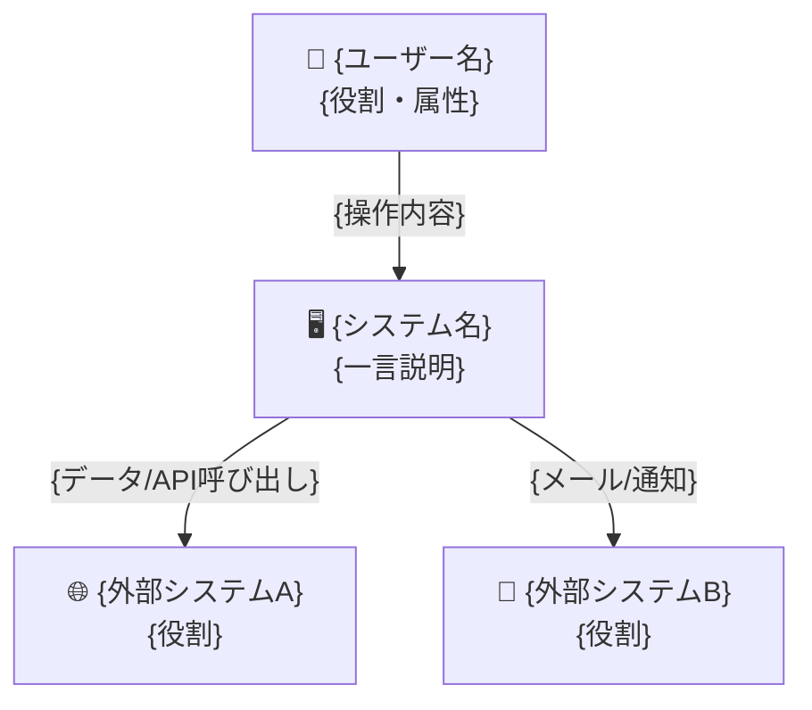
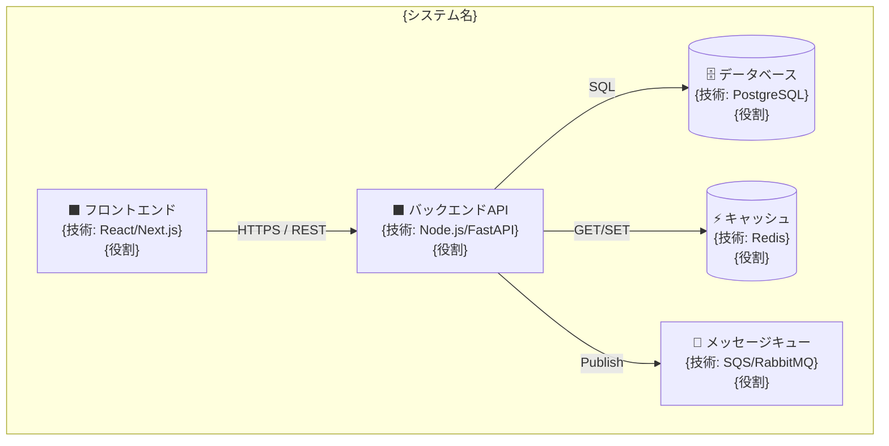
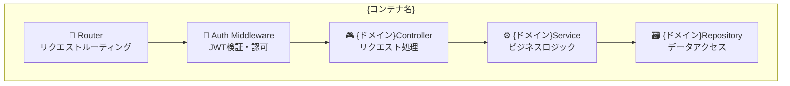
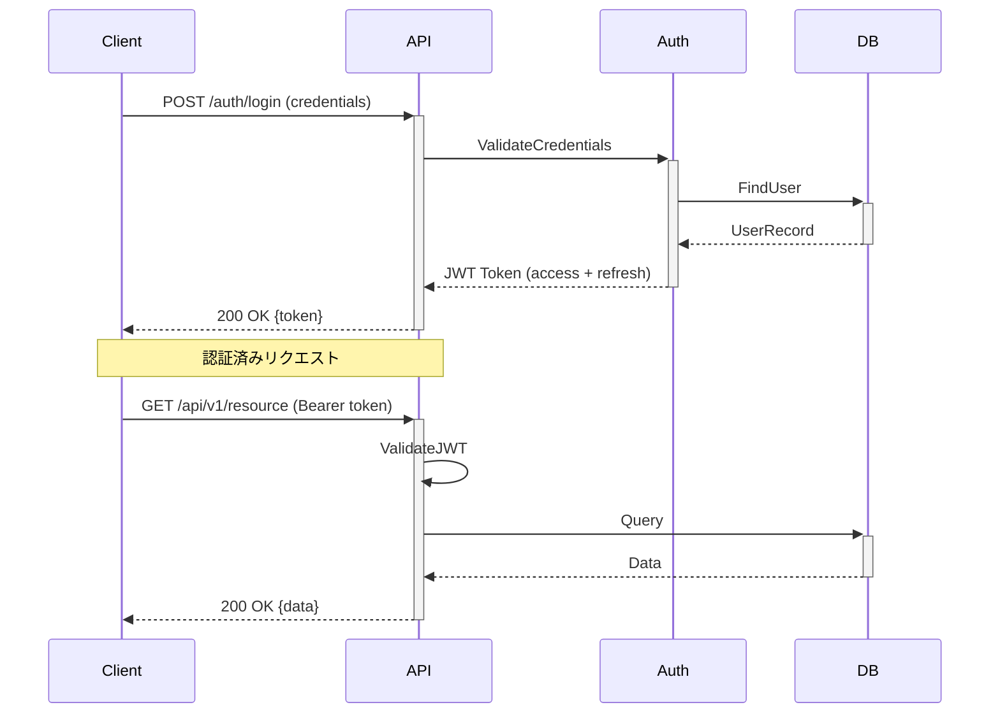
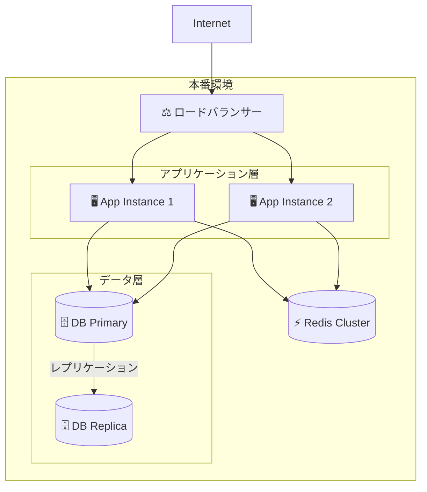

# sdd-design — アーキテクチャ設計書生成（C4 Model + Arc42）

## 0. 目的

C4 Model（Context/Container/Component/Code）と Arc42 テンプレートに基づき、
**「なぜこの設計か」を将来に残せる**包括的な設計書を生成する。

- C4モデルで抽象度別の視点（外部→コンテナ→コンポーネント）を提供する
- API契約・データモデル・セキュリティ設計を一体化する
- glossary.md / event-storming.md の用語・境界をアーキテクチャに反映する
- `sdd-adr` の意思決定トリガーとなるトレードオフを明示する
- `sdd-threat` のDFD（信頼境界）のベースを提供する

**世界標準**: Simon Brown C4 Model, Arc42 Architecture Template, Google Design Doc

## 1. 入力と出力（ファイル契約）

### 入力
- /sdd-design $ARGUMENTS
  - $0 = spec-slug（例: google-ad-report）
  - $1 = target-dir（任意。未指定なら `.kiro/specs/<spec-slug>/` を使う）

### 入力ファイル（あれば読む）
- `<target-dir>/requirements.md`（sdd-req100の出力）— 必須
- `<target-dir>/glossary.md`（sdd-glossaryの出力）— 推奨
- `<target-dir>/event-storming.md`（sdd-event-stormingの出力）— 推奨
- `<target-dir>/business-context.md`（sdd-contextの出力）— 推奨
- コードベースの既存設計（src/, app/, packages/）

### 出力（必須）
- `<target-dir>/design.md`

## 2. 重要ルール（絶対）

- **C4モデル厳守**: Context → Container → Component の順で抽象度を下げる
- **Mermaid形式**: 全図はMermaid記法で記述（プレビュー可能）
- **要件トレーサビリティ**: 各コンポーネントがどのREQ-xxxを実現するか明記
- **セキュリティバイデザイン**: セキュリティ考慮を設計段階で組み込む（後付け禁止）
- **非機能要件の定量化**: 「高速」「スケーラブル」は禁止。数値で記述
- **ADRトリガー**: 重要な技術選択は必ず `sdd-adr` 実行を促す

## 3. 手順（アルゴリズム）

### Pre-Phase: 前提ファイル確認ゲート

実行前に以下を確認する:

1. `<target-dir>/requirements.md` の存在確認（Glob/Read）

**requirements.md が存在しない場合**:
```
⚠️ 警告: 要件定義が未完成です。

推奨: 先に以下のスキルを実行してください:
  /sdd-req100 {spec-slug}   - 要件定義

このまま続けますか？（設計の根拠が薄くなります）
```
ユーザーが続けると言った場合は進めるが、設計書に「⚠️ 要件定義未完成」として警告セクションを追加する。

### Step A: ターゲットディレクトリ決定
- target-dir = $1 があればそれ、なければ `.kiro/specs/$0/`
- 無ければ作成する

### Step B: コンテキスト収集
既存ファイルを探索して読む（Glob/Grep/Read）:
```
- <target-dir>/requirements.md    （機能要件・非機能要件・セキュリティ要件）
- <target-dir>/glossary.md        （用語定義・Bounded Context）
- <target-dir>/event-storming.md  （ドメインモデル・Context Map）
- <target-dir>/business-context.md（制約・技術スタック制約）
- src/ または app/ 配下（既存コードの技術スタック調査）
- package.json, pyproject.toml 等（依存関係調査）
```

情報が不足している場合、以下の質問を提示してユーザーの回答を待つ:

#### アーキテクチャ確認質問（情報不足時のみ）
1. システムを利用するユーザー・外部システムの種類は？（人数・同時接続数）
2. 技術スタックの制約はありますか？（既存システムとの統合等）
3. クラウド vs オンプレミス vs ハイブリッドの方針は？
4. 読み取り重視 vs 書き込み重視 vs バランス型？
5. リアルタイム要件はありますか？（WebSocket/SSE/Polling）
6. データの永続化要件は？（RDB vs NoSQL vs 両方）
7. 認証・認可の方式は？（JWT/OAuth/SAML/独自）
8. 外部API・SaaSとの連携はありますか？
9. マイクロサービス vs モノリス vs モジュラーモノリスの方針は？
10. CI/CD・デプロイパイプラインの制約はありますか？

ユーザーが「仮置きで進めて」と言った場合は業界標準の仮定で埋め、「前提/仮定」に明記する。

### Step C: `design.md` を生成

以下のテンプレートを完全に埋める:

```markdown
# アーキテクチャ設計書 — {プロジェクト名}

> 生成日: {YYYY-MM-DD}
> スペック: {spec-slug}
> バージョン: 1.0
> 手法: Simon Brown C4 Model, Arc42, Google Design Doc

---

## 1. エグゼクティブサマリー

{システムの目的を3文以内で。誰が、何のために、どんな技術で}

### 設計上の主要決定
| 決定 | 選択 | 理由 | ADR |
|------|------|------|-----|
| データベース | {DB名} | {理由} | ADR-001 |
| 認証方式 | {方式} | {理由} | ADR-002 |
| フロントエンド | {技術} | {理由} | ADR-003 |

---

## 2. C4 Level 1 — Context図（システム全体）

誰がこのシステムを使い、何と連携するかを示す。



### アクター一覧
| アクター | 種別 | 主要操作 | 関連REQ |
|---------|------|---------|--------|
| {ユーザー名} | 人間/システム | {操作} | REQ-xxx |

---

## 3. C4 Level 2 — Container図（システム内部構成）

システム内の主要コンテナ（アプリ・DB・キャッシュ等）と通信方式。



### コンテナ一覧
| コンテナ名 | 技術 | 責務 | スケーリング方針 | 関連REQ |
|-----------|------|------|----------------|--------|
| {名前} | {技術スタック} | {責務} | {水平/垂直} | REQ-xxx |

---

## 4. C4 Level 3 — Component図（主要コンテナの内部）

最も重要なコンテナの内部構造。

### {コンテナ名} の内部コンポーネント



### コンポーネント責務
| コンポーネント | 責務 | インターフェース | 関連REQ |
|-------------|------|--------------|--------|
| {名前} | {責務（1文）} | {公開インターフェース} | REQ-xxx |

---

## 5. API契約

### エンドポイント一覧

| Method | Path | 認証 | 説明 | 関連REQ |
|--------|------|------|-----|--------|
| POST | /api/v1/{resource} | Bearer | {説明} | REQ-xxx |
| GET | /api/v1/{resource}/{id} | Bearer | {説明} | REQ-xxx |
| PUT | /api/v1/{resource}/{id} | Bearer | {説明} | REQ-xxx |
| DELETE | /api/v1/{resource}/{id} | Bearer + Admin | {説明} | REQ-xxx |

### 主要エンドポイント詳細

#### POST /api/v1/{resource}

**リクエスト**:
```json
{
  "{field}": "{型}: {説明}",
  "{field}": "{型}: {説明}"
}
```

**レスポンス（200 OK）**:
```json
{
  "success": true,
  "data": {
    "id": "string: UUID",
    "{field}": "{値}"
  }
}
```

**エラーレスポンス**:
| ステータス | コード | 説明 |
|----------|-------|------|
| 400 | VALIDATION_ERROR | バリデーション失敗 |
| 401 | UNAUTHORIZED | 認証失敗 |
| 403 | FORBIDDEN | 権限不足 |
| 404 | NOT_FOUND | リソース未存在 |
| 429 | RATE_LIMIT_EXCEEDED | レート制限超過 |
| 500 | INTERNAL_ERROR | サーバー内部エラー |

---

## 6. データモデル

### ER図（Mermaid）

```mermaid
erDiagram
    {ENTITY_A} {
        uuid id PK
        string {field}
        timestamp created_at
        timestamp updated_at
    }
    {ENTITY_B} {
        uuid id PK
        uuid {entity_a}_id FK
        string {field}
        enum status
        timestamp created_at
    }
    {ENTITY_A} ||--o{ {ENTITY_B} : "has"
```

### テーブル定義

#### {テーブル名}（{役割}）

| カラム | 型 | 制約 | 説明 |
|-------|-----|------|------|
| id | UUID | PK, NOT NULL | 主キー |
| {field} | {型} | {制約} | {説明} |
| created_at | TIMESTAMPTZ | NOT NULL, DEFAULT NOW() | 作成日時（UTC） |
| updated_at | TIMESTAMPTZ | NOT NULL | 更新日時（UTC） |

**インデックス**:
| インデックス名 | カラム | 種別 | 目的 |
|-------------|-------|------|------|
| idx_{table}_{col} | {column} | B-tree | {検索パターン} |

---

## 7. セキュリティ設計

### 認証・認可フロー



### セキュリティ層一覧
| 層 | 実装 | 対象脅威 |
|----|------|---------|
| 通信 | TLS 1.3強制 | 盗聴・中間者攻撃 |
| 認証 | JWT（HS256/RS256） | なりすまし |
| 認可 | RBAC / ABAC | 不正アクセス |
| 入力 | バリデーション（Zod/Pydantic） | インジェクション |
| 出力 | レスポンスフィルタリング | 情報漏洩 |
| レート制限 | {Nリクエスト/秒} | DoS |
| 監査ログ | 全操作記録 | 否認 |

---

## 8. 非機能設計

### スケーラビリティ戦略
| 指標 | 現在設計 | スケールアウト閾値 | スケール方法 |
|------|---------|-----------------|------------|
| 同時ユーザー | {N}人 | {N*2}人 | {水平スケール方法} |
| RPS | {N} | {N*2} | {ロードバランシング方法} |
| データ量 | {N}GB | {N*10}GB | {シャーディング/パーティション} |

### 可観測性設計
| 観点 | ツール | 計測対象 |
|------|-------|---------|
| メトリクス | Prometheus + Grafana | レイテンシ/エラー率/スループット |
| ログ | Loki / CloudWatch | アプリログ・アクセスログ |
| トレーシング | OpenTelemetry | リクエストトレース |
| アラート | Alertmanager | SLO違反・エラー急増 |

### 障害復旧設計
| 障害 | RTO | RPO | 復旧方法 |
|------|-----|-----|---------|
| コンテナクラッシュ | 30秒 | 0 | 自動再起動 |
| DB接続断 | 2分 | 0 | コネクションプール/リトライ |
| 全システム障害 | {N}時間 | {N}時間 | バックアップからリストア |

---

## 9. デプロイメントアーキテクチャ



---

## 10. 技術選択と代替案

| コンポーネント | 選択技術 | 代替案 | 選択理由 | ADR |
|-------------|---------|-------|---------|-----|
| {種別} | {選択} | {代替1}, {代替2} | {理由} | `/sdd-adr` 実行推奨 |

---

## 11. 前提・仮定・未解決事項

### 前提（確定済み）
- {前提1}

### 仮定（未検証）
- {仮定1}（検証方法: {方法}）

### 未解決事項（Open Questions）
- [ ] {質問1}（影響: {コンポーネント名}、判断期限: {日付}）

### ADR実行推奨リスト
- [ ] `/sdd-adr "{技術選択A}" {spec-slug}` — {理由}
- [ ] `/sdd-adr "{技術選択B}" {spec-slug}` — {理由}

---

## 12. 次のステップ

1. `sdd-adr` で主要技術選択をADRとして記録する
2. `sdd-threat` でこの設計のSTRIDE脅威モデルを作成する
3. `sdd-slo` で設計から導出されるSLO/SLIを定義する
4. `sdd-tasks` でコンポーネント単位の実装タスクを生成する
```

### Step D: 品質チェック（自己検証）

生成後に以下を確認する:
- [ ] C4 Level 1/2/3 のMermaid図が全て記述されているか
- [ ] 全コンポーネントにREQ-xxx との対応が記載されているか
- [ ] APIエンドポイントにエラーレスポンス定義があるか
- [ ] ER図のPK/FK/NOT NULL制約が明記されているか
- [ ] セキュリティ層が全て記載されているか（認証/認可/暗号化/監査）
- [ ] 非機能設計に数値が入っているか（「高速」等の曖昧表現がないか）
- [ ] ADR実行推奨リストが記載されているか

## 4. 最終応答（チャットに返す内容）

- C4レベル数と主要コンポーネント数
- APIエンドポイント数
- 特定したADR候補（技術選択）リスト
- 未解決事項リスト
- 生成ファイルパス

## 5. 実行例

```bash
/sdd-design google-ad-report
```

出力:
```
.kiro/specs/google-ad-report/
└── design.md   # C4図 + API契約 + データモデル + セキュリティ設計
```

## 6. 後続スキルへの引き継ぎ

- `sdd-adr`: design.md → 技術選択の意思決定記録
- `sdd-threat`: design.md → DFD（信頼境界）・コンポーネント別脅威分析
- `sdd-slo`: design.md → コンポーネント別SLI/SLO定義
- `sdd-guardrails`: design.md → 権限境界・APIアクセス制御
- `sdd-tasks`: design.md → コンポーネント単位の実装タスク分解

---
> Converted and distributed by [TomeVault](https://tomevault.io/claim/taiyousan15) — claim your Tome and manage your conversions.
<!-- tomevault:4.0:skill_md:2026-04-13 -->
