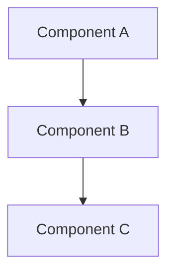
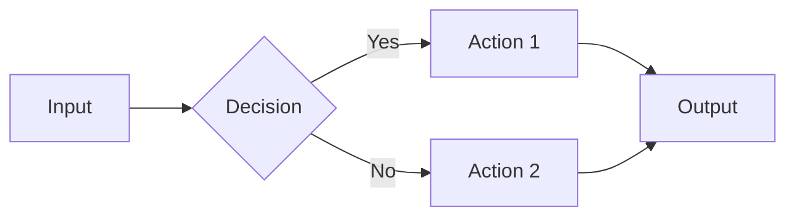
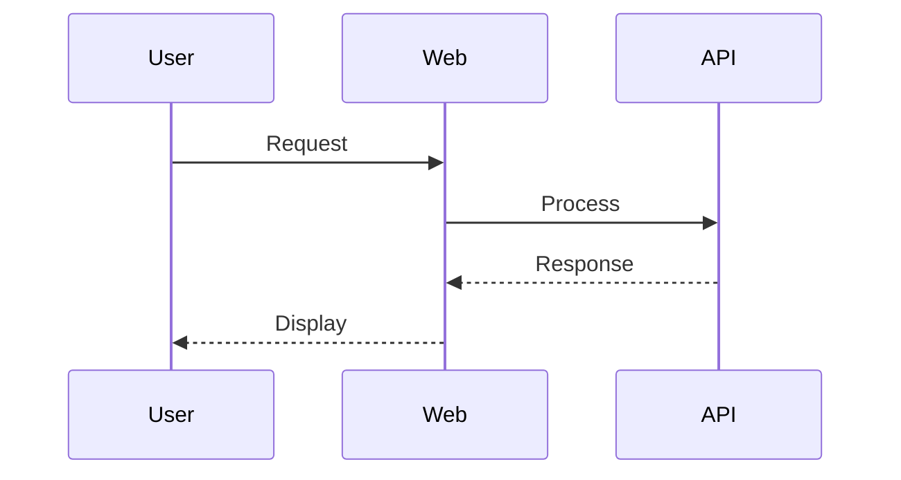
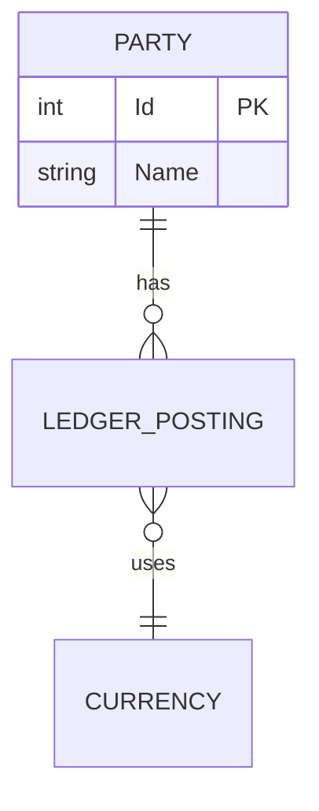

# Document Changes

This command creates structured documentation for changes made during the current coding session. Documentation is placed under the `docs/` folder at the root of the solution.

## When to Use

Run `/document` after completing a feature, refactoring, or significant change that warrants documentation for future reference.

## Related Commands

After documenting, consider whether additional changelog updates are needed:

| Command | Audience | Use When |
|---------|----------|----------|
| `/document` | Developers | Technical documentation for any significant change |
| `/add-changelog` | End users | User-facing features, fixes, improvements |

**Typical flow:**
1. `/document` — Always create technical documentation first
2. `/add-changelog` — If user-facing, add to customer changelog

## Output Structure

```
docs/
├── README.md              # Central index with links to all documentation
├── Changelog.md           # Customer-facing changelog (user-notable features/fixes only)
├── YYYY/
│   └── MM/
│       └── YYYY-MM-DD-<slug>.md   # Individual change documents
└── diagrams/
    └── <feature>-*.md     # Standalone Mermaid diagram files (if large)
```

## Documentation Workflow

### 1. Gather Current State

Before documenting, analyze the current session:

1. **Review git status** - Identify all modified, added, and deleted files
2. **Review git diff** - Understand the actual code changes made
3. **Read existing documentation** - Check `docs/README.md` to understand current state
4. **Check for existing change log** - If documenting a multi-day feature, look for existing docs to update

```bash
# Run these to understand current changes
git status
git diff --stat
git diff HEAD~1..HEAD  # Recent commits
```

### 2. Identify Scope

Determine the scope of changes within the repository. Documentation should be created in the `docs/` directory.

### 3. Create Change Document

Create a new markdown file using this template:

**File:** `docs/YYYY/MM/YYYY-MM-DD-<slug>.md`

```markdown
# <Title: Brief Description of Change>

**Date:** YYYY-MM-DD  
**Author:** AI Assistant  
**Related Issues:** (if any)

## Summary

<1-3 sentence overview of what was accomplished>

## Context & Motivation

- Why was this change needed?
- What problem does it solve?
- What alternatives were considered?

## Plan

<Document the approach taken>

1. Step one taken
2. Step two taken
3. ...

## Architecture / Design

<Include Mermaid diagrams where helpful>



## Changes Made

### Files Modified

| File | Change Type | Description |
|------|-------------|-------------|
| `path/to/file.cs` | Modified | Brief description |
| `path/to/new.cs` | Added | Brief description |
| `path/to/old.cs` | Deleted | Reason for removal |

### Key Code Changes

<Highlight significant code changes with brief explanations>

## Change Log

Document the sequence of changes made during implementation:

| Time | Action | Details |
|------|--------|---------|
| Start | Analysis | Reviewed requirements and existing code |
| ... | Implementation | Created new service class |
| ... | Testing | Verified functionality works |
| End | Documentation | Updated docs and changelog |

## Testing & Verification

- How can this change be verified?
- What tests were added/modified?
- Manual testing steps (if applicable)

## Trade-offs & Limitations

- What trade-offs were made?
- Known limitations
- Future considerations

## Related Documentation

- Links to related docs in this repository
- Links to external documentation
```

### 4. Update Central Index

Update `docs/README.md` to include the new document in the **Recent Changes** table:

```markdown
## Recent Changes

| Date | Title | Category | Description |
|------|-------|----------|-------------|
| YYYY-MM-DD | [Title](./YYYY/MM/YYYY-MM-DD-slug.md) | Category | Brief description |
```

Also add to the appropriate **Category** section table.

### 5. Update Changelogs (If Applicable)

After creating the technical documentation, update the appropriate changelogs.

**Before adding entries, check existing changelogs:**
- Is this feature already mentioned in a recent entry?
- Could this be merged with an existing entry for clarity?
- Would updating an existing entry be better than creating a new one?

#### Customer Changelog (`docs/Changelog.md`)

If the change is **user-notable** (new feature, bug fix, or significant improvement visible to end-users), run `/add-changelog` or manually add:

```markdown
- **YYYY-MM-DD** - Brief one-liner describing the feature or fix
```

**Include:** User-facing features, bug fixes, performance improvements, UI/UX changes
**Exclude:** Internal refactoring, code cleanup, developer tooling, backend-only changes

#### Editing and Merging Entries

Changelogs are not append-only. When updating:
- **Merge related changes** — Multiple changes to the same feature can be combined into one entry
- **Update recent entries** — If a follow-up change relates to a recent entry, update rather than duplicate
- **Consolidate for clarity** — 2-5 consecutive small changes may read better as a single description

## Mermaid Diagram Guidelines

Use Mermaid diagrams to illustrate:
- **Flowcharts** - Process flows, decision trees
- **Sequence diagrams** - Component interactions over time
- **Class diagrams** - Entity relationships
- **ER diagrams** - Database schemas
- **State diagrams** - State machines

### Example Diagrams

**Flowchart:**


**Sequence Diagram:**


**Entity Relationship:**


## Cross-Solution Documentation

When changes span multiple solutions or projects:

1. Create the primary document in the solution with the most changes
2. Create a brief reference document in the other solution linking to the primary
3. Update both indexes
4. Update Changelog in both if user-facing

**Reference document template:**
```markdown
# <Title>

**Primary Documentation:** [Link to primary doc in other solution]

## Changes in This Solution

<Brief summary of changes specific to this solution>

## Files Modified

| File | Description |
|------|-------------|
| ... | ... |
```

## Best Practices

1. **Be Concise** - Focus on the "why" not just the "what"
2. **Use Diagrams** - Visual aids improve comprehension
3. **Link Related Docs** - Build a connected knowledge base
4. **Include Context** - Future readers may not have your context
5. **Document Trade-offs** - Explain decisions and alternatives
6. **Keep Index Current** - The index is the entry point
7. **Log Your Work** - The Change Log section helps trace what was done
8. **Update Changelog** - Don't forget user-facing features/fixes

## Example Execution

```
# After completing session log feature implementation:

1. Run: git status && git diff --stat
2. Read: docs/README.md (current state)
3. Create: docs/2026/01/2026-01-09-session-logging.md
4. Add content following template above (including Change Log table)
5. Update: docs/README.md index with new entry
6. Update: docs/Changelog.md if user-facing
```

## Verification Checklist

Before completing documentation:

- [ ] Change document created with all sections filled
- [ ] Change Log table documents the implementation sequence
- [ ] Files Modified table is complete and accurate
- [ ] docs/README.md updated with new entry
- [ ] docs/Changelog.md updated (if user-facing) — consider merging with recent entries
- [ ] Cross-solution docs updated (if applicable)
- [ ] Diagrams render correctly
- [ ] All links work

---
> Converted and distributed by [TomeVault](https://tomevault.io/claim/tedd) — claim your Tome and manage your conversions.
<!-- tomevault:4.0:skill_md:2026-04-14 -->
