# UX Orchestration

Orchestration skill for comprehensive UX work spanning research, architecture, interaction, visual design, and strategy.

## When to Use

- Starting a new UX project that spans multiple competencies
- Unsure which specialized UX skill to invoke
- Need to coordinate work across UX disciplines
- Planning UX team workflow or handoffs

## When NOT to Use

- Task is clearly within one competency (use sub-skill directly)
- Pure implementation work (coding, deployment)
- Non-design tasks

---

## Sub-Skills

| Skill | Invoke When | Key Deliverables |
|-------|-------------|------------------|
| **research** | Understanding users, testing designs | Personas, journey maps, usability reports |
| **architecture** | Organizing content, navigation | Sitemaps, taxonomies, navigation specs |
| **interaction** | Designing flows, behaviors | Wireframes, prototypes, user flows |
| **visual** | Creating UI, design systems | Components, style guides, design tokens |
| **strategy** | Aligning UX with business | Roadmaps, metrics, maturity assessments |

---

## Quick Decision Guide

```
What do you need to do?
|
+---> Understand users or test designs?
|     +---> Use: research
|
+---> Organize content or navigation?
|     +---> Use: architecture
|
+---> Design flows or prototypes?
|     +---> Use: interaction
|
+---> Create visual UI or design system?
|     +---> Use: visual
|
+---> Align UX with business goals?
|     +---> Use: strategy
|
+---> Multiple areas or unsure?
      +---> Continue reading this skill
```

---

## The UX Process (Double Diamond)

```mermaid
flowchart LR
    subgraph Discover["Discover"]
        D1[Research Users]
        D2[Understand Context]
        D3[Identify Problems]
    end

    subgraph Define["Define"]
        Df1[Synthesize Insights]
        Df2[Define Problems]
        Df3[Set Strategy]
    end

    subgraph Develop["Develop"]
        Dv1[Ideate Solutions]
        Dv2[Create Prototypes]
        Dv3[Test & Iterate]
    end

    subgraph Deliver["Deliver"]
        Dl1[Refine Design]
        Dl2[Specify Details]
        Dl3[Hand Off]
    end

    Discover --> Define --> Develop --> Deliver

    style Discover fill:#e3f2fd
    style Define fill:#fff3e0
    style Develop fill:#e8f5e9
    style Deliver fill:#fce4ec
```



### Competency Mapping by Phase

| Phase | Primary Skill | Supporting Skills |
|-------|---------------|-------------------|
| **Discover** | research | strategy |
| **Define** | architecture | research, strategy |
| **Develop** | interaction | visual, research |
| **Deliver** | visual | interaction |

---

## Orchestration Patterns

### Pattern 1: Sequential (Traditional)

```
Research --> IA --> IxD --> Visual --> Handoff
```

Best for: Well-defined projects, waterfall environments

### Pattern 2: Parallel Tracks

```
Research ---------------------------->
         +-- IA --------------------->
         +-- IxD -------------------->
         +-- Visual ----------------->
Strategy ---------------------------->
```

Best for: Agile sprints, time-constrained projects

### Pattern 3: Iterative Loops

```
Research <--> Define <--> Design <--> Test
```

Best for: High-uncertainty projects, continuous discovery

---

## Agent Coordination for UX Projects

When using multiple agents for parallel UX work:

### Handoff Checkpoints

| From | To | Checkpoint Artifacts |
|------|----|---------------------|
| research | architecture | Personas, mental models, card sort data |
| research | interaction | User flows, task analysis, pain points |
| architecture | interaction | Sitemap, taxonomy, navigation spec |
| interaction | visual | Wireframes, component list, interaction specs |
| strategy | All | OKRs, success metrics, constraints |

### Parallel Execution Rules

1. **strategy** can run parallel to all others (provides constraints)
2. **research** must complete Discovery before Define
3. **architecture** and **interaction** can run parallel after IA basics
4. **visual** needs wireframes before full component design

---

## Full Project Procedure

### Step 1: Project Scoping
- [ ] Define project goals and constraints
- [ ] Identify stakeholders
- [ ] Determine timeline and resources
- [ ] **Invoke: strategy** for roadmap and metrics

### Step 2: Discovery Research
- [ ] Conduct user interviews
- [ ] Analyze existing data
- [ ] Create personas and journey maps
- [ ] **Invoke: research**

### Step 3: Define Structure
- [ ] Create information architecture
- [ ] Design navigation patterns
- [ ] Validate with card sorting
- [ ] **Invoke: architecture**

### Step 4: Design Interactions
- [ ] Map user flows
- [ ] Create wireframes
- [ ] Build prototypes
- [ ] **Invoke: interaction**

### Step 5: Apply Visual Design
- [ ] Establish design tokens
- [ ] Create component library
- [ ] Apply visual styling
- [ ] **Invoke: visual**

### Step 6: Validate & Iterate
- [ ] Conduct usability testing
- [ ] Measure against metrics
- [ ] Iterate based on findings
- [ ] **Invoke: research** for testing

---

## Definition of Done (Full UX Project)

- [ ] User research insights documented
- [ ] Information architecture validated
- [ ] Interaction flows complete and tested
- [ ] Visual design system established
- [ ] Success metrics defined and baseline captured
- [ ] Handoff documentation complete

---

## Guardrails

**Always:**
- Start with understanding users (even briefly)
- Define success metrics before designing
- Test designs with real users
- Document decisions and rationale

**Never:**
- Skip research entirely
- Design in isolation from business goals
- Ignore accessibility requirements
- Assume without validating

---

## Reference Files

- [references/process.md](references/process.md) - End-to-end UX process details
- [references/orchestration.md](references/orchestration.md) - Parallel work patterns
- [references/handoffs.md](references/handoffs.md) - Competency transitions
- [references/competency-matrix.md](references/competency-matrix.md) - Skills overview

---
> Converted and distributed by [TomeVault](https://tomevault.io/claim/teslasoft-de) — claim your Tome and manage your conversions.
<!-- tomevault:4.0:skill_md:2026-04-15 -->
