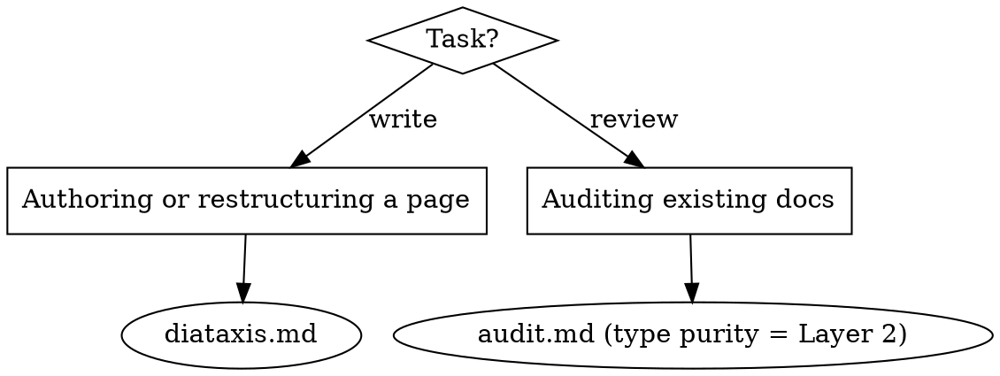

# Documentation

Docs are part of the product. This skill governs their **structure and quality**; for the *voice* of the prose, **REQUIRED SUB-SKILL: marketing-voice**.

## The backbone rule

**Every page is exactly ONE Diátaxis type — tutorial, how-to, reference, or explanation. A page that serves four needs serves none.**

This is the defect agents miss most, because a clean layout *hides* it. Both observed baselines failed here: an authoring agent fused explanation + a "quick-start arc" + four reference tables into one page and called it a "task-completion arc"; an audit agent praised the same fusion as "progressive disclosure" and never flagged it. Comprehensive ≠ correct. Tidy ≠ single-purpose.

So, before writing or reviewing a page, **name its one type out loud.** Then read `diataxis.md` and hold the page to that type's must / must-not list. Content that belongs to another type gets a one-line **cross-link**, never an inlined section.

## Which file

- **Authoring / restructuring / splitting** → `diataxis.md` — the four types, their must/must-not rules, the three-flatland IA mapping, mode-mixing smells, and the split recipe.
- **Auditing** → `audit.md` — the four-layer audit (accuracy, engagement, LLM files, JSDoc). Type purity is Layer 2, criterion #5. Run it *in addition to* accuracy drift, not instead.
- Supporting reference (loaded as needed by `audit.md`): `loved-docs-patterns.md`, `visual-devices.md`, `react-best-practices.md`.

## Red flags — STOP and name the type

| Rationalization | Reality |
|---|---|
| "The page is comprehensive / progressive disclosure." | A clean layout is not a single purpose. Name the one type; the rest is a split candidate. |
| "It's a task-completion arc." | That fuses tutorial + how-to + reference. Pick one; link the others. |
| "Splitting causes duplication." | It doesn't — you cross-link. Each page does one job; the link carries the rest. |
| "One page is more convenient for the reader." | Convenient to skim, useless to *use*. The learner, the task-doer, and the looker-up each need a different page. |
| "A reference table fits naturally in this how-to." | Then the table belongs on the Reference/API page; link to it. A how-to shows the *one* call you need, not every option. |

These all mean: stop, name the page's single type, and move other-type content out per `diataxis.md`.

---
> Source: [thejustinwalsh/three-flatland](https://github.com/thejustinwalsh/three-flatland) — distributed by [TomeVault](https://tomevault.io).
<!-- tomevault:4.0:skill_md:2026-06-15 -->
