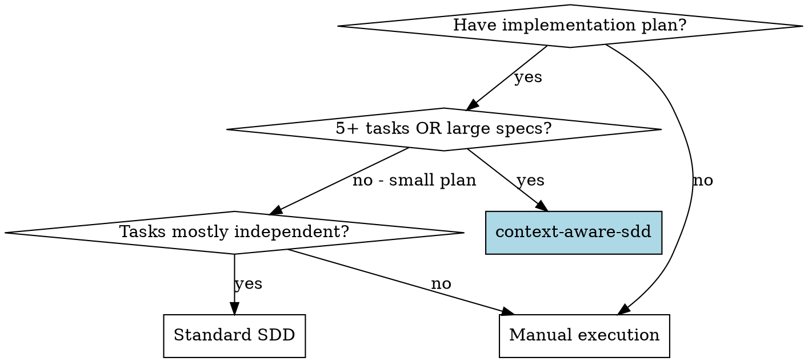
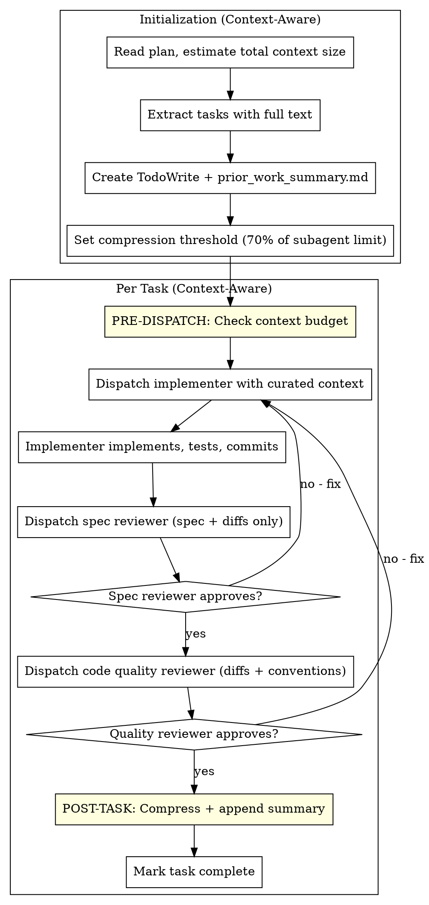

# Context-Aware Subagent-Driven Development

Execute implementation plans with fresh subagent per task, two-stage review, **plus context engineering checkpoints** for optimal token usage and quality.

**Core principle:** Fresh subagent per task + two-stage review + context optimization = high quality, efficient execution

## Why Context-Aware?

Standard SDD implicitly uses context isolation but lacks:
- Token budget awareness before dispatch
- Compression between tasks (controller bloat)
- Minimal-context review handoffs
- Degradation detection

This skill makes context engineering **explicit and systematic**.

## Context Engineering Foundation

This skill applies the **Four-Bucket Strategy**:

| Bucket | SDD Application |
|--------|-----------------|
| **Write** | Extract tasks to TodoWrite, save prior work summaries |
| **Select** | Curate only relevant context per subagent |
| **Compress** | Summarize completed tasks, compact review outputs |
| **Isolate** | Fresh subagent per task (context isolation) |

## When to Use



**Use context-aware-sdd when:**
- Plan has 5+ tasks
- Individual task specs are large (>500 words)
- Plan includes architectural context that accumulates
- Previous SDD runs showed degradation signs

## The Process



## Context Engineering Checkpoints

### Checkpoint 1: Plan Analysis (Before Extraction)

```markdown
Before extracting tasks:
1. Estimate plan size in tokens (~4 chars = 1 token)
2. Count tasks and average spec size
3. Identify shared context vs task-specific context

If total > 80% of your context limit:
- Split plan into phases
- Execute phases in separate sessions
- Use episodic-memory between phases
```

### Checkpoint 2: Pre-Dispatch Budget Check

```markdown
Before dispatching each implementer:

Context budget = task_spec + prior_work_summary + relevant_files

IF budget > 70% of subagent limit:
  - Compress prior_work_summary further
  - Include only files directly referenced in spec
  - Omit architectural context (subagent can explore)

IF budget > 90%:
  - Split task into subtasks
  - Execute subtasks sequentially
  - Merge results
```

### Checkpoint 3: Review Context Optimization

```markdown
Spec Reviewer receives:
- Task spec (FULL - this is what we're verifying)
- Code changes (DIFFS preferred over full files)
- Implementer's report (for comparison, not trust)

Code Quality Reviewer receives:
- Code changes (DIFFS)
- Project conventions summary
- NOT the spec (already verified by spec reviewer)
- NOT the prior work history (irrelevant to quality)
```

### Checkpoint 4: Post-Task Compression

```markdown
After each task completion:

1. Generate 2-3 line summary:
   "Task N: Implemented [feature]. Files: [list]. Key decisions: [any]."

2. Append to prior_work_summary.md

3. IF prior_work_summary > 500 words:
   - Compact older entries (keep last 3 detailed)
   - Summarize older tasks as single line each

4. Discard:
   - Review feedback (already fixed)
   - Implementation details (captured in code)
   - Intermediate states
```

### Checkpoint 5: Degradation Detection

```markdown
Monitor for context degradation signals:

| Signal | Threshold | Action |
|--------|-----------|--------|
| Subagent questions | >3 clarifications | Review context completeness |
| Review iterations | >2 per stage | Check spec clarity |
| Missing requirements | Found by reviewer | Add to prior_work_summary |
| Repeated mistakes | Same issue twice | Add explicit anti-pattern note |

If 2+ signals in one task:
- Invoke context-engineering skill for diagnosis
- Consider compacting aggressively
- Add explicit constraints to next subagent
```

## Prompt Templates

### Implementer (Context-Optimized)

See `./implementer-prompt.md`

Key additions:
- Explicit "curated context" section
- Prior work summary (compressed)
- Budget-aware file inclusion

### Spec Reviewer (Minimal Context)

See `./spec-reviewer-prompt.md`

Key changes:
- Receives diffs, not full files
- No prior work context
- Focused on spec match only

### Code Quality Reviewer (Minimal Context)

See `./code-quality-reviewer-prompt.md`

Key changes:
- No spec (already verified)
- Receives conventions summary
- Focused on quality only

## Example Workflow

```
You: Using Context-Aware SDD for this 8-task plan.

[CHECKPOINT 1: Plan Analysis]
- Plan: ~2000 words, 8 tasks
- Average task: ~250 words
- Shared context: ~500 words (architecture overview)
- Estimate: Well within limits, proceed

[Create prior_work_summary.md - empty initially]
[Create TodoWrite with 8 tasks]

Task 1: Auth middleware

[CHECKPOINT 2: Pre-Dispatch Budget]
- Task spec: ~250 words (~60 tokens)
- Prior work: empty
- Relevant files: 2 (middleware.ts, auth-config.ts)
- Total: ~15% of subagent limit ✅

[Dispatch implementer with curated context]

Implementer: Implemented auth middleware with JWT validation
- Files: src/middleware/auth.ts, src/config/auth.ts
- Tests: 6/6 passing

[Dispatch spec reviewer]
Spec reviewer: ✅ Spec compliant

[CHECKPOINT 3: Review Context]
- Code quality reviewer gets: diffs only, project conventions
- NOT: spec, prior work, implementation details

[Dispatch code quality reviewer]
Quality reviewer: ✅ Approved

[CHECKPOINT 4: Post-Task Compression]
- Summary: "Task 1: Auth middleware with JWT validation. Files: middleware/auth.ts, config/auth.ts"
- Append to prior_work_summary.md

[Mark Task 1 complete]

Task 5: Rate limiting (later in plan)

[CHECKPOINT 2: Pre-Dispatch Budget]
- Task spec: ~200 words
- Prior work: 4 summaries (~100 words compressed)
- Relevant files: 3
- Total: ~25% ✅

[CHECKPOINT 5: Degradation Check]
- Questions asked: 1 (normal)
- Review iterations: 1 (normal)
- No signals detected ✅

...continues...
```

## Integration

### Required skills (context-aware versions)
- **context-engineering** - Diagnosis when degradation detected
- **superpowers:writing-plans** - Creates plans this skill executes
- **superpowers:finishing-a-development-branch** - Complete after all tasks

### Alternative workflows
- **superpowers:subagent-driven-development** - Standard SDD (smaller plans)
- **superpowers:executing-plans** - Parallel session execution

### Context Engineering principles applied
- **Isolate**: Fresh subagent = clean context per task
- **Select**: Controller curates relevant context only
- **Compress**: Prior work summaries, not full history
- **Write**: TodoWrite + prior_work_summary.md

## Token Budget Reference

| Component | Typical Size | Optimization |
|-----------|--------------|--------------|
| Task spec | 100-500 tokens | Keep full |
| Prior work | 50-200 tokens | Compress after 5 tasks |
| Relevant files | 200-2000 tokens | Include only referenced |
| Conventions | 100-300 tokens | Quality reviewer only |
| Review output | 50-200 tokens | Discard after fix |

**Target**: Keep subagent context under 70% of limit

## Anti-Patterns

**Never:**
- Send full file contents when diffs suffice
- Include prior work history in reviewers
- Skip compression after each task
- Ignore degradation signals
- Let controller context exceed 80%

**Always:**
- Check budget before dispatch
- Compress after each task
- Use minimal context for reviewers
- Monitor degradation signals
- Write summaries to external file

## Files

- `./implementer-prompt.md` - Context-optimized implementer template
- `./spec-reviewer-prompt.md` - Minimal-context spec reviewer
- `./code-quality-reviewer-prompt.md` - Minimal-context quality reviewer
- `./prior_work_template.md` - Template for prior work summary file

---
> Converted and distributed by [TomeVault](https://tomevault.io/claim/thienchi2109) — claim your Tome and manage your conversions.
<!-- tomevault:4.0:skill_md:2026-04-13 -->
