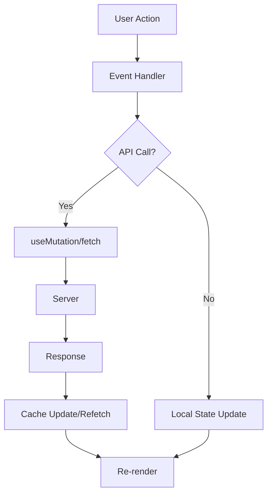
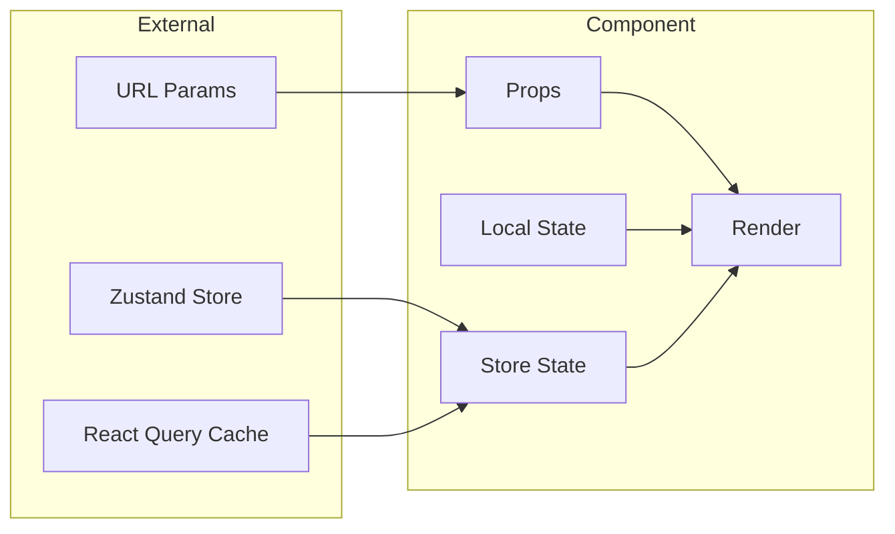

# React Discovery - React Project Research & Understanding

Skill chuyên biệt để nghiên cứu, khám phá và hiểu sâu về dự án React. Giúp AI hiểu rõ codebase trước khi đề xuất hoặc thực hiện thay đổi.

```
┌─────────────────────────────────────────────────────────────────┐
│                 REACT DISCOVERY PIPELINE                        │
├─────────────────────────────────────────────────────────────────┤
│  Detect → Explore → Map → Analyze → Report → Recommend          │
│     ↓        ↓        ↓       ↓         ↓          ↓           │
│ [PROJECT] [SEARCH] [VISUAL] [DEEP]  [SUMMARY] [NEXT STEPS]     │
└─────────────────────────────────────────────────────────────────┘
```

---

## Supported React Stacks

| Stack | Detection | Key Files |
|-------|-----------|-----------|
| **Vite + React** | `vite` in devDeps | `vite.config.ts` |
| **Next.js** | `next` in deps | `next.config.js`, `app/` or `pages/` |
| **Create React App** | `react-scripts` | `public/`, `src/index.tsx` |
| **Remix** | `@remix-run/*` | `remix.config.js` |

---

## Phase 1: Project Detection

**Goal**: Tự động nhận diện loại React project

### Step 1.1: Read package.json
```typescript
// Detect từ dependencies
{
  "dependencies": {
    "react": "^18.x",      // ✅ React project
    "next": "^14.x",       // → Next.js
    "vite": "^5.x",        // → Vite
  }
}
```

### Step 1.2: Identify UI Libraries
| Library | Detection Key | Notes |
|---------|---------------|-------|
| Tailwind CSS | `tailwindcss` | Check `tailwind.config.js` |
| Ant Design | `antd` | Check `ConfigProvider` |
| MUI | `@mui/material` | Check theme setup |
| Shadcn/ui | `components.json` | Check `components/ui/` |
| Chakra UI | `@chakra-ui/react` | Check `ChakraProvider` |

### Step 1.3: Identify State Management
| Library | Detection Key | Typical Location |
|---------|---------------|------------------|
| Zustand | `zustand` | `src/stores/` |
| Redux Toolkit | `@reduxjs/toolkit` | `src/store/`, `src/redux/` |
| React Query | `@tanstack/react-query` | `src/hooks/`, `src/queries/` |
| Jotai | `jotai` | `src/atoms/` |
| Recoil | `recoil` | `src/atoms/`, `src/recoil/` |

### Step 1.4: Identify Routing
| Library | Detection Key | Route Location |
|---------|---------------|----------------|
| React Router | `react-router-dom` | `src/routes/`, `src/App.tsx` |
| Next.js App Router | `next` + `app/` folder | `app/` |
| Next.js Pages Router | `next` + `pages/` folder | `pages/` |
| TanStack Router | `@tanstack/react-router` | `src/routes/` |

### Detection Output
```
═══════════════════════════════════════════════════════════
[PROJECT DETECTED]
═══════════════════════════════════════════════════════════

📦 Project: <project-name>
⚛️  Stack: Vite + React + TypeScript
🎨 UI: Tailwind CSS + Shadcn/ui
📊 State: Zustand + React Query
🧭 Router: React Router v6

Key Config Files:
• vite.config.ts
• tailwind.config.js
• tsconfig.json
• components.json

Folder Structure Pattern: Feature-based

Ready to explore features...
═══════════════════════════════════════════════════════════
```

---

## Phase 2: Project Structure Mapping

### React Project Structures

#### Pattern A: Feature-based (FSD-like)
```
src/
├── features/
│   ├── auth/
│   │   ├── components/
│   │   ├── hooks/
│   │   ├── api/
│   │   └── types.ts
│   └── products/
│       ├── components/
│       ├── hooks/
│       └── api/
├── shared/
│   ├── ui/
│   ├── hooks/
│   └── utils/
└── app/
    ├── routes/
    └── providers/
```

#### Pattern B: Type-based (Traditional)
```
src/
├── components/
│   ├── common/
│   └── features/
├── hooks/
├── services/
├── stores/
├── types/
├── utils/
└── pages/
```

#### Pattern C: Page-based (Next.js style)
```
src/
├── pages/          # or app/
│   ├── index.tsx
│   ├── about/
│   └── products/
├── components/
├── hooks/
├── lib/
└── styles/
```

### Auto-detect Structure Pattern
```markdown
1. Check if `src/features/` exists → Feature-based
2. Check if `app/` exists → Next.js App Router
3. Check if `pages/` exists → Next.js Pages / Page-based
4. Default → Type-based
```

---

## Phase 3: Feature Exploration

### 3.1 Search Strategy by Structure

#### For Feature-based:
```
Feature "auth" location:
1. src/features/auth/
2. src/modules/auth/
3. src/domains/auth/
```

#### For Type-based:
```
Feature "auth" components:
1. src/pages/auth/          # Pages
2. src/components/auth/     # Components  
3. src/hooks/useAuth*.ts    # Hooks
4. src/services/auth*.ts    # Services
5. src/stores/auth*.ts      # Stores
```

#### For Next.js App Router:
```
Feature "auth" location:
1. app/(auth)/              # Route group
2. app/login/, app/register/
3. components/auth/
4. lib/auth.ts
```

### 3.2 Component Discovery Commands

```markdown
## Find all components of a feature

# By folder
Read: src/pages/<feature>/
Read: src/components/<feature>/

# By naming
glob: src/**/*<Feature>*.tsx
glob: src/**/*<feature>*.tsx

# By imports
Grep: "from.*<feature>" trong src/
```

### 3.3 Hook Discovery
```markdown
## Find hooks related to feature

glob: src/hooks/use<Feature>*.ts
glob: src/**/use<Feature>*.ts
Grep: "function use<Feature>"
Grep: "const use<Feature>"
```

### 3.4 API/Service Discovery
```markdown
## Find API calls

glob: src/services/<feature>*.ts
glob: src/api/<feature>*.ts
Grep: "fetch\|axios\|api" trong <feature> files
Grep: "useMutation\|useQuery" trong <feature> files
```

### 3.5 State Discovery
```markdown
## Find state management

# Zustand
glob: src/stores/*<feature>*.ts
Grep: "create\(" trong stores/

# Redux
glob: src/store/*<feature>*.ts
glob: src/redux/*<feature>*.ts

# React Query
Grep: "useQuery.*<feature>"
Grep: "queryKey.*<feature>"
```

---

## Phase 4: Component Analysis

### 4.1 Component Anatomy
```markdown
## Analyzing: <ComponentName>.tsx

### Props Interface
| Prop | Type | Required | Default |
|------|------|----------|---------|
| title | string | ✅ | - |
| onClick | () => void | ❌ | - |

### Hooks Used
| Hook | Purpose |
|------|---------|
| useState | Local state for X |
| useAuth | Get current user |
| useQuery | Fetch data |

### Child Components
- <Button /> from shared/ui
- <Modal /> from shared/ui
- <UserAvatar /> from features/user

### Events/Handlers
| Handler | Triggers | Action |
|---------|----------|--------|
| handleSubmit | form submit | Call API |
| handleClose | click outside | Close modal |

### Renders
| Condition | What renders |
|-----------|--------------|
| loading | Skeleton |
| error | ErrorMessage |
| data | Main content |
| empty | EmptyState |
```

### 4.2 Data Flow Analysis


### 4.3 State Flow Analysis


---

## Phase 5: Feature Completeness Check

### CRUD Checklist
```markdown
## Feature: <FeatureName>

### Operations
| Op | Status | Component | API | Notes |
|----|--------|-----------|-----|-------|
| Create | ✅ | CreateForm.tsx | POST /api/x | With validation |
| Read List | ✅ | List.tsx | GET /api/x | With pagination |
| Read Detail | ✅ | Detail.tsx | GET /api/x/:id | - |
| Update | ⚠️ | EditForm.tsx | PUT /api/x/:id | Missing fields |
| Delete | ❌ | - | - | Not implemented |

### UI States
| State | Status | Component | Notes |
|-------|--------|-----------|-------|
| Loading | ✅ | Skeleton | - |
| Empty | ✅ | EmptyState | - |
| Error | ❌ | - | No error UI |
| Success | ⚠️ | Toast | Basic only |

### UX Features
| Feature | Status | Notes |
|---------|--------|-------|
| Form validation | ✅ | Zod + react-hook-form |
| Optimistic update | ❌ | - |
| Infinite scroll | ❌ | Using pagination |
| Search/Filter | ⚠️ | Search only |
| Sort | ❌ | - |
```

### React-specific Checks
```markdown
## React Best Practices

### Performance
- [ ] React.memo on heavy components
- [ ] useMemo/useCallback where needed
- [ ] Code splitting with lazy()
- [ ] Image optimization

### Accessibility
- [ ] Semantic HTML
- [ ] ARIA labels
- [ ] Keyboard navigation
- [ ] Focus management

### Error Handling
- [ ] Error boundaries
- [ ] API error states
- [ ] Form validation errors
- [ ] 404 pages
```

---

## Phase 6: Report Template

```markdown
═══════════════════════════════════════════════════════════
[REACT DISCOVERY REPORT]
═══════════════════════════════════════════════════════════

# Feature: <Feature Name>

## 📊 Quick Summary

| Aspect | Status |
|--------|--------|
| Feature exists | ✅ Yes / ⚠️ Partial / ❌ No |
| Completeness | X% |
| Code quality | Good / Medium / Needs work |

---

## ⚛️ Project Context

**Stack**: Vite + React 18 + TypeScript
**UI**: Tailwind + Shadcn/ui  
**State**: Zustand + React Query
**Pattern**: Feature-based

---

## 📁 Feature Location

```
src/
├── pages/<feature>/
│   ├── index.tsx           # Entry
│   └── components/
│       ├── List.tsx        # List view
│       ├── Detail.tsx      # Detail view
│       └── Form.tsx        # Create/Edit
├── hooks/
│   └── use<Feature>.ts     # Business logic
├── services/
│   └── <feature>.service.ts # API calls
└── stores/
    └── <feature>.store.ts   # State
```

---

## 🔄 How It Works

### Component Tree
<mermaid graph>

### Data Flow
<mermaid flowchart>

---

## 📋 Feature Inventory

| Function | Status | Location | LOC |
|----------|--------|----------|-----|
| List | ✅ | List.tsx | 120 |
| Create | ✅ | Form.tsx | 80 |
| Update | ⚠️ | Form.tsx | 80 |
| Delete | ❌ | - | - |

---

## 🔍 Key Code

### Main Component
`src/pages/<feature>/index.tsx`
```tsx
export default function FeaturePage() {
  const { data, isLoading } = useFeatureList();
  // ...
}
```

### Main Hook  
`src/hooks/useFeature.ts`
```tsx
export function useFeatureList() {
  return useQuery({
    queryKey: ['features'],
    queryFn: featureService.getAll,
  });
}
```

---

## ⚠️ Gaps Found

| Gap | Impact | Effort |
|-----|--------|--------|
| No error handling | High | S |
| Missing delete | Medium | M |
| No tests | High | L |

---

## 🚀 Recommendations

1. **Quick wins** (< 1h):
   - Add error boundary
   - Add loading skeleton

2. **Should do** (1-4h):
   - Implement delete
   - Add form validation

3. **Nice to have** (> 4h):
   - Add unit tests
   - Add E2E tests

═══════════════════════════════════════════════════════════
```

---

## Quick Commands

### "Tính năng X có chưa?"
```
1. glob: src/**/*<X>*.tsx
2. Grep: "<X>" trong src/
3. → Report: Exists / Partial / Missing
```

### "Giải thích component Y"
```
1. Read: component file
2. Trace: imports & exports
3. Map: props, hooks, children
4. → Report: Anatomy + Flow diagram
```

### "Liệt kê tất cả pages"
```
1. Read: src/pages/ hoặc app/
2. glob: src/pages/**/index.tsx
3. → Report: Page list + routes
```

### "Dự án dùng những gì?"
```
1. Read: package.json
2. Detect: stack, UI, state, router
3. Read: config files
4. → Report: Tech stack summary
```

---

## Save Context (Optional)

Sau khi explore, có thể lưu context vào `.amp/project-context.md`:

```markdown
# Project Context

## Stack
- Framework: Vite + React 18
- Language: TypeScript 5.x
- UI: Tailwind CSS + Shadcn/ui
- State: Zustand + React Query
- Router: React Router v6
- Form: React Hook Form + Zod

## Structure
- Pattern: Feature-based
- Pages: src/pages/
- Components: src/components/
- Hooks: src/hooks/
- Services: src/services/
- Stores: src/stores/

## Key Features
- auth: src/pages/auth/
- products: src/pages/products/
- cart: src/pages/cart/

## Conventions
- Component naming: PascalCase
- Hook naming: use<Name>
- Service naming: <name>.service.ts
- Store naming: <name>.store.ts

Last updated: <date>
```

---

## Anti-Patterns

| ❌ Don't | ✅ Do Instead |
|----------|---------------|
| Assume project structure | Detect first |
| Search without context | Know the stack first |
| Report without evidence | Show code locations |
| Skip diagrams | Always visualize |
| Forget state management | Check stores/queries |

---
> Converted and distributed by [TomeVault](https://tomevault.io/claim/tienchinh21) — claim your Tome and manage your conversions.
<!-- tomevault:4.0:skill_md:2026-04-15 -->
