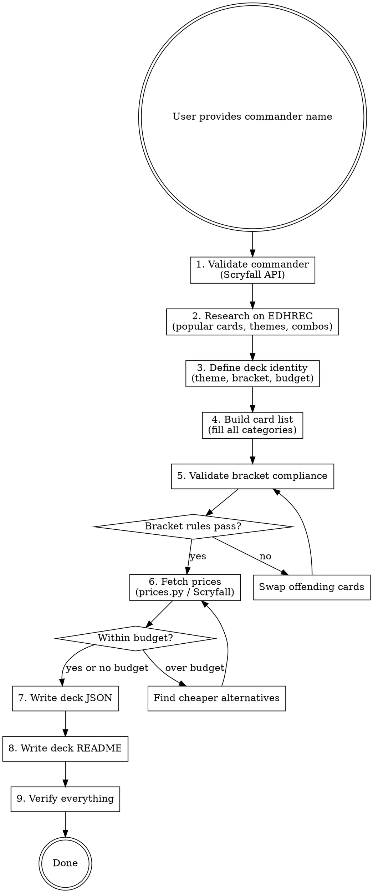

# Creating Commander Decks

## Overview

End-to-end workflow for building a Commander deck from a commander name to finished, validated files. Produces a deck JSON and companion README in `decks/`.

## When to Use

- User names a commander and wants a deck built
- User has a partial card list and wants it completed
- User wants to add a new deck to the `decks/` collection

## Workflow



### Step 1: Validate Commander

Query Scryfall: `GET https://api.scryfall.com/cards/named?exact={name}`

Extract: name, colors, color_identity, mana_cost, type_line, oracle_text. Confirm the card is a legal commander (legendary creature or has "can be your commander").

### Step 2: Research on EDHREC

Fetch the commander's EDHREC page for:
- High synergy cards and staples for the color identity
- Common themes/archetypes
- Typical combo lines
- Average deck composition

Use this as a starting point, not a copy-paste. The user's theme and bracket filter what's appropriate.

### Step 3: Define Deck Identity

Confirm with the user:
- **Theme**: one-sentence concept (e.g., "dwarves tap for Treasures to tutor artifacts and dragons")
- **Target bracket** (1-5): constrains card quality, combos, Game Changers
- **Card count**: 100 standard, 112 for MPC.com printing
- **Budget**: optional ceiling; skip if user doesn't mention it

### Step 4: Build Card List

Fill categories to hit roughly these counts (for 100-card deck):

| Category     | Target Range |
|--------------|-------------|
| Commander    | 1           |
| Creature     | 25-35       |
| Instant      | 5-10        |
| Sorcery      | 5-10        |
| Enchantment  | 5-10        |
| Artifact     | 8-15        |
| Planeswalker | 0-3         |
| Land         | 34-38       |

Categories used in JSON: `commander`, `creature`, `planeswalker`, `sorcery`, `instant`, `enchantment`, `artifact`, `land`.

### Step 5: Validate Bracket Compliance

Cross-reference the card list against bracket rules. For the full bracket rule table and Game Changers list, consult `references/bracket-rules.md`.

Flag Rule 0 considerations: cards that are technically legal for the bracket but may draw table discussion (e.g., From the Ashes as soft mass LD in bracket 3, Blood Moon changing land types).

### Step 6: Fetch Prices

Run the bundled pricing script:

```bash
python3 ${CLAUDE_PLUGIN_ROOT}/scripts/prices.py {deck-slug}
```

Or use Scryfall API directly. Summarize: total cost, top 10 expensive cards, cost by category. If user set a budget, identify cards to swap for cheaper alternatives.

Scryfall rate limit: 50-100ms between requests. Use `User-Agent: MTGDeckTracker/1.0`. On macOS, use SSL context with `/etc/ssl/cert.pem`.

### Step 7: Write Deck JSON

File: `decks/{commander-slug}.json`

For the full JSON schema and color identity reference, consult `references/deck-format.md`.

Group cards by category in the array. Basics use their total quantity (e.g., `"quantity": 24` for Mountains).

### Step 8: Write Deck README

File: `decks/{commander-slug}.md`

Structure:
```
# Commander Name
**Color Identity:** {identity} | **Bracket:** {n} ({name}) | **Cards:** {count}

## Theme
One or two sentences.

## How It Plays
Short paragraph on core game plan.

## Key Cards
5-8 cards with brief notes on why they matter.

## Bracket Notes
Game Changers count, Rule 0 flags.

## Card Breakdown
Table with category counts.

## Decklist

### Commander (1)
1x Commander Name

### Creatures (28)
1x Card Name
1x Card Name

### Instants (10)
1x Card Name
...

### Lands (36)
1x Card Name
14x Mountain
```

Each category header includes the total card count for that category. Cards listed as `{quantity}x {name}`. Categories appear in this order: Commander, Creatures, Planeswalkers, Sorceries, Instants, Enchantments, Artifacts, Lands. Empty categories are omitted.

### Step 9: Verify

- Sum of all card quantities matches `card_count`
- Category counts in README match actual JSON data
- Decklist in README lists every card from the JSON with correct quantities
- Bracket notes accurately reflect Game Changers count
- All card names are real (validated against Scryfall)
- Commander slug in filename matches JSON content

## Common Mistakes

- **Miscounting lands**: basics have high quantity values — don't count them as 1
- **Game Changers misidentification**: always check the official list; many strong cards (Sol Ring, Exploration, Scapeshift) are NOT Game Changers
- **Forgetting Rule 0 flags**: cards like Blood Moon or From the Ashes are bracket-legal but worth noting
- **Wrong color identity names**: it's "Gruul" not "Red/Green" in the JSON field

## Additional Resources

### Reference Files

- **`references/bracket-rules.md`** — Full bracket rule table, Game Changers list, and compliance checking guide
- **`references/deck-format.md`** — Complete JSON schema, color identity names, and example deck structure

### Scripts

- **`${CLAUDE_PLUGIN_ROOT}/scripts/prices.py`** — Fetch card prices from Scryfall API for a deck or all decks

---
> Converted and distributed by [TomeVault](https://tomevault.io/claim/tinycamera) — claim your Tome and manage your conversions.
<!-- tomevault:4.0:skill_md:2026-04-14 -->
