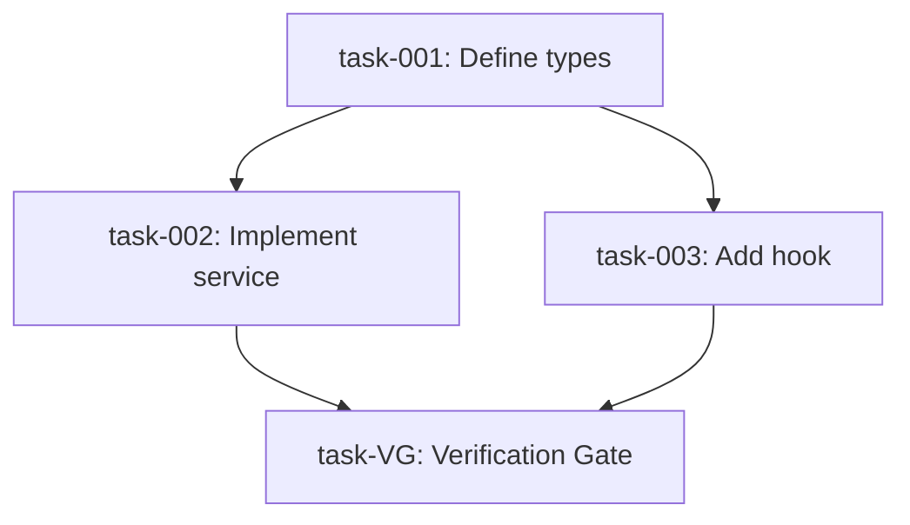

<objective>
Transform an issue into a set of focused, executable sub-tasks through deep codebase exploration. Each sub-task targets a single file or tightly-coupled file pair, sized to fit within one Claude context window. Sub-tasks are created with blocking relationships to enable parallel work where dependencies allow.

Refinement is only complete after documentation artifacts are finalized: task JSON files, `context.json`, and the handoff summary used by `/execute` and `/verify`.
</objective>

<execution_boundaries>
**Refine is planning/decomposition only. Do not implement product code in this skill.**

Hard rules:
- Do **not** edit application/source code while running `/refine`
- Do **not** run build/test/lint except lightweight checks needed to validate refinement artifacts
- Do **not** create commits/branches/PRs from `/refine`
- Only allowed writes are refinement artifacts under `.mobius/issues/{id}/` (`tasks/*.json`, `context.json`, optional parent cache)

If the user asks to refine and implement in one request:
1. Complete refinement and write sub-task artifacts after approval
2. Stop
3. Recommend `/execute {id}` or `mobius loop {id}` for implementation
</execution_boundaries>

<context>
This skill bridges high-level issues and actionable implementation work. It:

1. **Deeply researches** the codebase to understand existing patterns, dependencies, and affected areas
2. **Decomposes** work into single-file-focused tasks that Claude can complete in one session
3. **Identifies dependencies** between tasks to establish blocking relationships
4. **Writes sub-tasks locally** as JSON files in `.mobius/issues/{id}/tasks/` with proper blocking order

Sub-tasks are ALWAYS local files, regardless of backend mode. The backend only determines where the parent issue is fetched from. Sub-tasks are designed for autonomous execution - each should be completable without needing to reference other sub-tasks or gather additional context.
</context>

<backend_detection>
**Ask user which backend to use via AskUserQuestion if not obvious from issue ID format.**

**Auto-detection from issue ID**:
- Linear format: `MOB-123`, `VRZ-456` (typically 2-4 letter prefix)
- Jira format: `PROJ-123` (typically longer project key)
- Local format: `LOC-001`, `LOC-002` (auto-incremented local IDs)

If the format is ambiguous, use AskUserQuestion:

Question: "Which backend are you using?"

Options:
1. **Linear** - Fetch parent from Linear, write sub-tasks locally
2. **Jira** - Fetch parent from Jira, write sub-tasks locally
3. **Local** - Read parent from local file, write sub-tasks locally

Store the selection to use appropriate tools throughout the skill.

**Default**: If not specified, default to `linear`.

**Important**: Regardless of backend, sub-tasks are ALWAYS written as local JSON files to `.mobius/issues/{id}/tasks/`. The backend only affects how the parent issue is loaded.
</backend_detection>

<input_validation>
**Issue ID Validation**:
- Linear: `MOB-123`, `VRZ-456` (team prefix + number)
- Jira: `PROJ-123` (project key + number)
- Pattern: `/^[A-Z]{2,10}-\d+$/`

If issue ID doesn't match expected format, warn user before proceeding:

```
The issue ID "{id}" doesn't match the expected format ({backend} pattern).
Did you mean to use a different backend, or is this a valid issue ID?
```
</input_validation>

<parent_issue_loading>
**Fetch parent issue details based on backend mode.**

The backend determines where the parent issue is loaded from:

**For `backend: local`** - read from local file:

```bash
cat .mobius/issues/{issue-id}/parent.json
```

The local `parent.json` file is created by `/define` in local mode and contains:
- **Title and description**: What needs to be implemented
- **Acceptance criteria**: Checklist of requirements
- **Labels**: Bug/Feature/Improvement for context
- **Priority**: Urgency level for task ordering

If `parent.json` does not exist, report the error:
```
No local parent file found at .mobius/issues/{issue-id}/parent.json
Run /define {issue-id} first to create the issue spec, or check the issue ID.
```

**For `backend: linear`** — use `linearis issues read` CLI:

```bash
# Fetch issue details as JSON
linearis issues read MOB-123
```

**Extract from the response**:
- **Title and description**: What needs to be implemented
- **Acceptance criteria**: Checklist of requirements (look for checkbox patterns in description)
- **Labels**: Bug/Feature/Improvement for context
- **Priority**: Urgency level for task ordering
- **Team/Project**: For sub-task inheritance
- **Existing relationships**: blockedBy, blocks, relatedTo
- **URL**: For reference in sub-tasks

**For `backend: jira`** — use `acli jira workitem show`:

```bash
# Fetch issue details
acli jira workitem show PROJ-123
```

**Extract from the response**:
- **Summary and description**: What needs to be implemented
- **Issue type**: Bug/Story/Task for context
- **Priority**: Urgency level
- **Project key**: For sub-task inheritance
- **Issue links**: blocks, is blocked by relationships

**After loading (all backends)**: Write or update the local parent file for use by later skills:

```bash
mkdir -p .mobius/issues/{parent-id}
```

```
Write tool:
  file_path: .mobius/issues/{parent-id}/parent.json
  content: {parent issue JSON}
```

**If CLI command fails** (linear/jira backends):
1. Report the error to the user
2. If CLI not found, show install instructions:
   - Linear: `npm install -g linearis`
   - Jira: See https://developer.atlassian.com/cloud/acli/
3. Check if the issue ID is valid
4. Verify API permissions/authentication
5. Offer to retry or use a different issue ID
</parent_issue_loading>

<subtask_creation_local>
**Write sub-tasks as local JSON files after user approval.**

Sub-tasks are ALWAYS written locally to `.mobius/issues/{id}/tasks/` — never pushed to Linear/Jira. This applies to ALL backend modes (local, linear, jira).

**Directory setup**: Before writing files, ensure the tasks directory exists:

```bash
mkdir -p .mobius/issues/{parent-id}/tasks
```

**File naming**: Sub-task files use `task-{NNN}.json` format with zero-padded 3-digit numbers:
- `task-001.json`, `task-002.json`, ..., `task-010.json`
- Verification gate uses: `task-VG.json`

**Creation order**: Write sub-tasks in dependency order (leaf tasks first):
1. Write tasks with no blockers first
2. Use `task-{NNN}` identifiers for blocking references
3. Write dependent tasks with `blockedBy` referencing earlier task identifiers

**Sub-task JSON schema**:

```json
{
  "id": "task-001",
  "taskType": "general",
  "title": "[{parent-id}] {sub-task title}",
  "description": "## Summary\n{Brief description}\n\n## Context\nPart of {parent-id}: {parent title}\n\n## Target File(s)\n`{file-path}` ({Create/Modify})\n\n## Action\n{Specific implementation guidance}\n\n## Avoid\n- Do NOT {anti-pattern} because {reason}\n\n## Acceptance Criteria\n- [ ] {Criterion 1}\n  * **Verification**: {how to verify}\n- [ ] {Criterion 2}\n\n## Verify Command\n```bash\n{executable verification command}\n```",
  "status": "pending",
  "blockedBy": [],
  "blocks": ["task-002", "task-003"],
  "labels": ["{inherited-labels}"],
  "parentId": "{parent-id}"
}
```

**Required field**: Every implementation sub-task JSON MUST include `taskType` with one of: `frontend`, `backend`, `general`.

Task-type assignment guidance:
- Use `frontend` for UI/presentation work (components, styling, client interactions)
- Use `backend` for server/runtime/core logic work (API, data, execution internals)
- Use `general` for cross-cutting or neutral orchestration/docs/infra work
- Never emit free-form values outside `frontend|backend|general`

**Write each sub-task using the Write tool**:

```
Write tool:
  file_path: .mobius/issues/{parent-id}/tasks/task-001.json
  content: {JSON content}
```

**Verification Gate creation** (always the last file):

```json
{
  "id": "task-VG",
  "title": "[{parent-id}] Verification Gate",
  "description": "Runs verify to validate implementation meets acceptance criteria.\n\n**Blocked by**: ALL implementation sub-tasks\n**Action**: Run `/verify {parent-id}` after all implementation tasks complete\n\n### Aggregated Verify Commands\n1. task-001: Define types\n   ```bash\n   cd /path && bun run typecheck\n   ```\n2. task-002: Implement service\n   ```bash\n   cd /path && bun test service.test.ts\n   ```\n3. task-003: Add hook\n   ```bash\n   cd /path && bun run typecheck\n   ```",
  "status": "pending",
  "blockedBy": ["task-001", "task-002", "task-003"],
  "blocks": [],
  "labels": [],
  "parentId": "{parent-id}"
}
```

Write as: `.mobius/issues/{parent-id}/tasks/task-VG.json`

**Also update the context file** after writing all tasks:

```
Edit tool:
  file_path: .mobius/issues/{parent-id}/context.json
  # Update subTasks array with all created task references
```

Or if no context.json exists, create one:

```json
{
  "parent": {
    "id": "{parent-uuid}",
    "identifier": "{parent-id}",
    "title": "{parent title}",
    "description": "{parent description}",
    "status": "In Progress",
    "labels": ["{labels}"],
    "url": "{parent url}"
  },
  "subTasks": [
    {
      "id": "task-001",
      "identifier": "task-001",
      "taskType": "general",
      "title": "[{parent-id}] {sub-task title}",
      "status": "pending",
      "blockedBy": [],
      "blocks": ["task-002"]
    }
  ],
  "metadata": {
    "backend": "{linear|jira|local}",
    "fetchedAt": "{ISO-8601 timestamp}",
    "updatedAt": "{ISO-8601 timestamp}"
  }
}
```

**Error handling**:
- If file write fails (e.g., permission error), report and ask user to check directory permissions
- If directory creation fails, offer to create `.mobius/` manually
- All writes are atomic per-file so partial failure is safe
</subtask_creation_local>

<quick_start>
<invocation>
The skill expects an issue identifier as argument:

```
/refine MOB-123    # Linear issue (parent fetched from Linear, sub-tasks written locally)
/refine PROJ-456   # Jira issue (parent fetched from Jira, sub-tasks written locally)
/refine LOC-001    # Local issue (parent read from local file, sub-tasks written locally)
```

Or invoke programmatically:
```
Skill: refine
Args: MOB-123
```
</invocation>

<workflow>
1. **Detect backend** - Infer from issue ID format or ask user
2. **Fetch parent issue** - Load parent issue via CLI commands (linear/jira) or local file (local mode)
3. **Phase 1: Initial exploration** - Single Explore agent identifies affected areas, patterns, dependencies
4. **Phase 2: Identify work units** - Main agent groups affected files into sub-task-sized work units
5. **Phase 3: Per-task subagent research** - Spawn `feature-dev:code-architect` subagents (batched 3 at a time) to deep-dive and write complete sub-task descriptions
6. **Phase 4: Aggregate & present** - Collect subagent write-ups, establish dependency ordering, add verification gate, present full breakdown
7. **Gather feedback** - Use AskUserQuestion for refinement
8. **Phase 5: Write sub-tasks locally** - Write sub-task JSON files to `.mobius/issues/{id}/tasks/` directory
9. **Finalize refinement documentation** - Validate task files + `context.json` consistency and produce a complete handoff summary
10. **Stop after refinement** - Offer `/execute` or `mobius loop`; do not begin coding
</workflow>
</quick_start>

<research_phase>
<load_parent_issue>
Fetch the parent issue based on detected backend:

**For `backend: local`** - read from local file:

```bash
cat .mobius/issues/{issue-id}/parent.json
```

Extract from the JSON: title, description, acceptance criteria, labels, priority.

**For `backend: linear`** — use `linearis issues read` CLI:

```bash
# Fetch issue details as JSON
linearis issues read {issue-id}  # e.g., "MOB-123"
```

**Extract from response**:
- **Title and description**: What needs to be implemented
- **Acceptance criteria**: Checklist of requirements (look for `- [ ]` patterns in description)
- **Labels**: Bug/Feature/Improvement for context
- **Priority**: Urgency level for task ordering
- **Team**: For sub-task inheritance (use same team for all sub-tasks)
- **Existing relationships**: blockedBy, blocks (to maintain)
- **URL**: For linking back to parent

**For `backend: jira`** — use `acli jira workitem show`:

```bash
# Fetch issue details
acli jira workitem show PROJ-123
```

**Extract from response**:
- **Summary and description**: What needs to be implemented
- **Issue type**: Bug/Story/Task for context
- **Priority**: Urgency level for task ordering
- **Project key**: For sub-task inheritance (use same project for all sub-tasks)
- **Issue links**: blocks, is blocked by (to maintain)
- **URL**: For linking back to parent

**After loading (all backends)**: Save parent data locally for use by execute/verify skills:

```bash
mkdir -p .mobius/issues/{parent-id}
```

```
Write tool:
  file_path: .mobius/issues/{parent-id}/parent.json
  content: {parent issue JSON}
```
</load_parent_issue>

<deep_exploration>
Use the Task tool with Explore agent to thoroughly analyze the codebase:

```
Task tool:
  subagent_type: Explore
  prompt: |
    Analyze the codebase to understand how to implement: {issue title and description}

    Research:
    1. Find all files that will need modification
    2. Understand existing patterns in similar areas
    3. Identify dependencies between affected files
    4. Note any shared utilities, types, or services involved
    5. Find test files that will need updates

    For each file, note:
    - What changes are needed
    - What it imports/exports that affects other files
    - Whether it has corresponding test files

    Provide a comprehensive analysis of the implementation approach.
```

Set thoroughness to "very thorough" for complex issues.
</deep_exploration>

<analysis_output>
From the exploration, extract:

- **Affected files**: Complete list with change type (create/modify)
- **Dependency graph**: Which files import from which
- **Shared resources**: Types, utilities, services used across files
- **Test requirements**: Which test files need updates
- **Pattern notes**: Existing conventions to follow
</analysis_output>

<work_unit_identification>
**Phase 2**: After Phase 1 exploration, the main agent groups findings into sub-task-sized work units.

**Process**:
1. Review the Explore agent's file list and dependency graph
2. Group files into work units following the single-file principle (one file or tightly-coupled pair per unit)
3. For each work unit, note:
   - **Target file(s)**: The primary file (and optional test pair)
   - **Rough scope**: Create / Modify / Delete, approximate change size
   - **Related areas**: Nearby files the subagent should examine for patterns and context
   - **Dependency hints**: Which other work units this one likely depends on or enables

**Output**: A list of work unit briefs, each feeding into a Phase 3 subagent.

**Example work unit brief**:
```
Work Unit 3: Create useTheme hook
  Target: src/hooks/useTheme.ts (Create)
  Related: src/hooks/useAuth.ts (pattern reference), src/contexts/ThemeContext.tsx (dependency)
  Scope: ~40 lines, new hook consuming ThemeContext
  Depends on: Work Unit 2 (ThemeContext)
  Enables: Work Units 4, 5, 6 (components consuming the hook)
```
</work_unit_identification>
</research_phase>

<per_task_subagent_phase>
**Phase 3**: Spawn `feature-dev:code-architect` subagents to deep-dive each work unit and produce complete sub-task descriptions.

<subagent_batching>
**Batching rules**:
- Spawn up to **3 subagents simultaneously** per batch
- Wait for all subagents in a batch to complete before launching the next batch
- If a work unit depends on another's output (rare at this stage), place it in a later batch

**Example** (7 work units):
- Batch 1: Work Units 1, 2, 3 (parallel)
- Batch 2: Work Units 4, 5, 6 (parallel)
- Batch 3: Work Unit 7 (final)
</subagent_batching>

<subagent_prompt_template>
Each subagent receives the following context and returns a complete sub-task write-up:

```
Task tool:
  subagent_type: feature-dev:code-architect
  prompt: |
    You are writing a sub-task description for an implementation breakdown.

    ## Parent Issue
    Title: {parent issue title}
    Description: {parent issue description}
    Acceptance Criteria: {acceptance criteria from parent}

    ## Architecture Context (from Phase 1 exploration)
    {Paste the Explore agent's analysis output — affected files, patterns, dependency graph, conventions}

    ## Your Assigned Work Unit
    Target file(s): {target file path(s)} ({Create/Modify})
    Rough scope: {approximate change description}
    Related areas to examine: {nearby files for pattern reference}
    Dependency hints: Depends on {work unit N}, enables {work unit M}

    ## Your Task
    Analyze the target file(s) and related areas deeply. Then produce a complete sub-task description using this exact template:

    ## Summary
    {1-2 sentences: what this sub-task accomplishes}

    ## Context
    Part of {parent-id}: {parent title}

    ## Target File(s)
    `{file-path}` ({Create/Modify})

    ## Task Type
    {Exactly one of: frontend | backend | general}

    ## Action
    {2-4 sentences of specific implementation guidance}
    - Use {library/pattern} following `{existing example file}`
    - Handle {error case} by {specific handling}
    - Return {exact output shape}

    ## Avoid
    - Do NOT {anti-pattern 1} because {reason}
    - Do NOT {anti-pattern 2} because {reason}

    ## Acceptance Criteria
    - [ ] {Criterion 1}
      * **Verification**: {how to verify}
    - [ ] {Criterion 2}
      * **Verification**: {how to verify}

    ## Verify Command
    ```bash
    {executable verification command}
    ```

    ## Dependencies
    - **Blocked by**: {work unit numbers this depends on, or "None"}
    - **Enables**: {work unit numbers this unblocks}

    IMPORTANT: Be specific. Reference actual file paths, function names, and patterns you find in the codebase. Do not use generic placeholders.
```
</subagent_prompt_template>

<subagent_output_handling>
**Validation**: After each subagent returns, verify:
1. All template sections are present (Summary, Context, Target Files, Action, Avoid, Acceptance Criteria, Verify Command, Dependencies)
2. Target file paths are concrete (no placeholders)
3. Verify command is executable (not pseudocode)
4. Acceptance criteria are measurable
5. Task type is present and valid (`frontend|backend|general`)

**On failure**:
- If a subagent returns incomplete or malformed output, retry once with a clarifying note
- If retry also fails, the main agent writes the sub-task description manually using Phase 1 exploration data
- Log which work units required fallback for debugging

**On success**:
- Store the write-up keyed by work unit number
- Pass all collected write-ups to Phase 4 (aggregation)
</subagent_output_handling>

For subagent pattern details, batching strategy, and rationale, see `.claude/skills/refine/parallel-research.md`.
</per_task_subagent_phase>

<decomposition_phase>
<single_file_principle>
Each sub-task should focus on ONE file (or tightly-coupled pair like component + test). This ensures:

- Task fits within one context window
- Clear scope prevents scope creep
- Easy to verify completion
- Enables parallel work on unrelated files
</single_file_principle>

<task_structure>
**Note**: In the standard flow, `feature-dev:code-architect` subagents (Phase 3) produce these sub-task descriptions. The main agent validates completeness and consistency during Phase 4 aggregation.

<task_structure_quick>
Each sub-task must include:
- **Target file(s)**: Single file or source + test pair
- **Action**: 2-4 sentences of specific implementation guidance
- **Verify**: Executable command that proves completion
- **Done**: 2-4 measurable outcomes as checklist
- **Blocked by / Enables**: Dependency relationships
</task_structure_quick>

<task_structure_full>
Full template for detailed sub-tasks:

```markdown
## Sub-task: [Number] - [Brief title]

**Target file(s)**: `path/to/file.ts` (and `path/to/file.test.ts` if applicable)
**Change type**: Create | Modify | Delete

### Action
[2-4 sentences of specific implementation guidance]
- Use {library/pattern} following `src/existing/example.ts`
- Handle {error case} by {specific handling}
- Return {exact output shape}

### Avoid
- Do NOT {anti-pattern 1} because {reason}
- Do NOT {anti-pattern 2} because {reason}

### Verify
```bash
{executable command that proves completion}
```

### Done
- [ ] {Measurable outcome 1}
- [ ] {Measurable outcome 2}
- [ ] {Measurable outcome 3}

**Blocked by**: [Sub-task numbers, or "None"]
**Enables**: [Sub-task numbers this unblocks]
```

Use the "Avoid" section when research phase identified pitfalls specific to this task.
</task_structure_full>
</task_structure>

<ordering_principles>
Determine blocking order based on functional requirements:

1. **Foundation first**: Types, interfaces, schemas before implementations
2. **Dependencies flow down**: If A imports from B, B must be done first
3. **Tests with implementation**: Pair test files with their source files in same task
4. **UI last**: Components after their dependencies (services, hooks, types)
5. **Verification last**: The verification gate is ALWAYS the final sub-task

**Parallelization opportunities**:
- Independent services can run in parallel
- Unrelated UI components can run in parallel
- Tests for different features can run in parallel
</ordering_principles>

<aggregation_phase>
**Phase 4**: Collect all sub-task write-ups from Phase 3 subagents and assemble the final breakdown.

**Aggregation steps**:
1. **Collect write-ups** — Gather all sub-task descriptions from Phase 3 subagents (keyed by work unit number)
2. **Assign ordering numbers** — Use dependency hints from subagent outputs combined with ordering principles to assign sequential order numbers
3. **Establish blockedBy relationships** — Convert dependency hints into formal `blockedBy` references using assigned order numbers
4. **Verify no circular dependencies** — Walk the dependency graph to confirm it is a DAG (directed acyclic graph)
5. **Aggregate verify commands** — For each sub-task write-up from Phase 3 subagents, extract the `### Verify Command` bash code block and collect into a numbered list for the Verification Gate description:
   - Format each entry as: `{N}. {task-id}: {title}\n   ```bash\n   {verify command}\n   ```\n`
   - If a sub-task has no verify command, note: `{N}. {task-id}: {title}\n   (no verify command specified)`
   - Insert the collected list into the VG description's `### Aggregated Verify Commands` section
6. **Identify parallel groups** — Group tasks that share no mutual dependencies for concurrent execution
7. **Add verification gate** — Append the verification gate sub-task blocked by ALL implementation tasks, with the aggregated verify commands from step 5 included in its description
8. **Quality checks**:
    - Each sub-task targets a single file (or tightly-coupled pair)
    - No duplicate target files across sub-tasks
    - Every implementation sub-task includes `taskType` with allowed values `frontend|backend|general`
    - All template sections are complete (Summary, Context, Target Files, Action, Avoid, Acceptance Criteria, Verify Command)
   - Verify commands are executable (not pseudocode)
   - Acceptance criteria are measurable
   - Verification Gate description includes aggregated verify commands from all sub-tasks
</aggregation_phase>

<verification_gate>
**ALWAYS include a Verification Gate as the final sub-task.** This is required for every refined issue.

The verification gate:
- Has title: `[{parent-id}] Verification Gate` (MUST contain "Verification Gate" for mobius routing)
- Is blocked by ALL implementation sub-tasks
- When executed by mobius, routes to `/verify` instead of `/execute`
- Validates all acceptance criteria are met before the parent can be completed

**Template**:
```markdown
## Sub-task: [Final] - Verification Gate

**Target**: Validate implementation against acceptance criteria
**Change type**: Verification (no code changes)

### Action
This task triggers the verify skill to validate all implementation sub-tasks meet the parent issue's acceptance criteria.

### Aggregated Verify Commands
{List of each implementation sub-task's verify command, numbered by sub-task}

### Done
- [ ] All sub-task verify commands pass
- [ ] All tests pass
- [ ] All acceptance criteria verified
- [ ] No critical issues found by code review agents

**Blocked by**: [ALL implementation sub-task IDs]
**Enables**: Parent issue completion
```

</verification_gate>

<sizing_guidelines>
A well-sized sub-task:

- Targets 1 file (or source + test pair)
- Has 2-4 acceptance criteria
- Can be described in 2-3 sentences
- Takes roughly 50-200 lines of changes
- Doesn't require reading many other files to understand

**Split if**:
- File needs multiple unrelated changes
- Description exceeds 5 sentences
- More than 5 acceptance criteria
- Changes span unrelated concerns in the file

**Combine if**:
- Two files are always modified together
- Changes are trivially small (< 10 lines each)
- One file is just re-exporting from another
</sizing_guidelines>

<context_sizing>
**Maximum 3 tasks per batch** to prevent context degradation.

<wave_triggers>
Create multiple waves when:
- More than 3 files affected in a single batch
- Changes span multiple subsystems (e.g., API + UI + database)
- Sub-task description exceeds 10 sentences
</wave_triggers>

<wave_structure>
For features requiring 4+ sub-tasks, organize into waves:

1. **Wave 1: Foundation** - Types, interfaces, schemas (max 3 tasks)
2. **Wave 2: Core Logic** - Services, API endpoints (max 3 tasks)
3. **Wave 3: UI/Presentation** - Components, forms (max 3 tasks)
4. **Wave 4: Integration** - Routing, E2E tests (remaining tasks)

**Batching rules**:
- Group related changes in same wave (e.g., service + its tests)
- Foundation tasks always in first wave
- Integration/E2E tasks always in final wave

See `<examples>` section for complete wave-based breakdown example.
</wave_structure>
</context_sizing>
</decomposition_phase>

<presentation_phase>
<breakdown_format>
Present the complete breakdown:

```markdown
# Implementation Breakdown: {Issue ID} - {Issue Title}

## Overview
- **Total sub-tasks**: {count}
- **Parallelizable groups**: {count}
- **Critical path**: {list of sequential dependencies}
- **Estimated scope**: {total files affected}

## Dependency Graph
```
[1] Types/Interfaces
 └─► [2] Service implementation
      ├─► [3] Hook implementation
      │    └─► [5] Component A
      └─► [4] Repository updates
           └─► [6] Component B

Parallel groups:
- Group 1: [1]
- Group 2: [2]
- Group 3: [3], [4]
- Group 4: [5], [6]
```

## Sub-tasks

### 1. Define TypeScript types for {feature}
**File**: `src/types/feature.ts`
**Blocked by**: None
**Enables**: 2, 3, 4

[Full sub-task details...]

### 2. Implement {feature} service
**File**: `src/lib/services/featureService.ts`
**Blocked by**: 1
**Enables**: 3, 4

[Full sub-task details...]

[Continue for all sub-tasks...]
```
</breakdown_format>

<refinement_questions>
After presenting the initial breakdown, use AskUserQuestion:

Question: "How would you like to proceed with this breakdown?"

Options:
1. **Create all sub-tasks** - Breakdown looks correct, create in issue tracker
2. **Adjust scope** - Some tasks need to be split or combined
3. **Change ordering** - Blocking relationships need adjustment
4. **Add context** - I have additional information to include
5. **Start over** - Need a different approach entirely
</refinement_questions>

<per_subtask_validation>
**For complex breakdowns (4+ sub-tasks), validate each sub-task interactively.**

For each sub-task, use AskUserQuestion to verify:

**Scope validation**:
```
Question: "Is the scope for sub-task {N} ({title}) correct?"
Options:
1. **Correct** - Scope is well-defined
2. **Too broad** - Should be split into smaller tasks
3. **Too narrow** - Can be combined with another task
4. **Needs clarification** - Requirements are unclear
```

**Edge case validation**:
```
Question: "What should happen if {operation} fails in sub-task {N}?"
Options:
1. **Throw error** - Fail fast with clear error message
2. **Return fallback** - Use default value and continue
3. **Retry** - Attempt operation again with backoff
4. **Not applicable** - This operation cannot fail
```

**Acceptance criteria validation**:
```
Question: "How should we verify sub-task {N} is complete?"
Options:
1. **Automated test** - Unit/integration test in CI
2. **Manual verification** - Human checks specific behavior
3. **Type checking** - TypeScript compilation succeeds
4. **All of the above** - Multiple verification methods
```
</per_subtask_validation>

<iterative_refinement>
If user selects adjustment options:

- **Adjust scope**: Ask which specific tasks to modify, then present revised breakdown
- **Change ordering**: Present dependency graph and ask which relationships to change
- **Add context**: Incorporate new information and re-analyze affected tasks

Loop back to presentation after each refinement until user approves.
</iterative_refinement>
</presentation_phase>

<output_phase>
<local_creation_process>
After user approval, write sub-task JSON files to `.mobius/issues/{parent-id}/tasks/`.

**Creation sequence**:

1. **Ensure directory exists**: `mkdir -p .mobius/issues/{parent-id}/tasks`
2. **Write leaf tasks first** (tasks with no blockers) as `task-001.json`, `task-002.json`, etc.
3. **Write dependent tasks** with `blockedBy` referencing earlier `task-{NNN}` identifiers
4. **Write Verification Gate last** as `task-VG.json` with all implementation task IDs as blockers
5. **Write context.json** with full parent + subTasks array for execute/verify skills
6. **Validate documentation consistency** (task files and `context.json` contain matching IDs/status/dependencies)
7. **Report progress** as each file is written

**Example creation flow**:
```
Writing sub-task 1/4: "Define TypeScript types"...
  -> Wrote .mobius/issues/MOB-100/tasks/task-001.json

Writing sub-task 2/4: "Implement feature service" (blocked by task-001)...
  -> Wrote .mobius/issues/MOB-100/tasks/task-002.json

Writing sub-task 3/4: "Add useFeature hook" (blocked by task-001)...
  -> Wrote .mobius/issues/MOB-100/tasks/task-003.json

Writing Verification Gate (blocked by task-001, task-002, task-003)...
  -> Wrote .mobius/issues/MOB-100/tasks/task-VG.json

Writing context.json...
  -> Wrote .mobius/issues/MOB-100/context.json

All sub-tasks written successfully!
```
</local_creation_process>

<documentation_finalization>
**CRITICAL: Do not treat refinement as done until documentation is finalized.**

Before ending `/refine`, confirm all refinement artifacts are complete and consistent:

1. Every planned task has a corresponding `task-{NNN}.json` (plus `task-VG.json`)
2. `context.json` contains the same task set, dependency relationships, and metadata timestamp updates
3. The handoff summary clearly identifies ready-first tasks and dependency order

If any artifact is missing or inconsistent, fix the files first and only then report "Breakdown Complete".
</documentation_finalization>

<completion_summary>
After writing all sub-task files locally, provide a summary:

This summary is the final documentation handoff. It should be complete enough for `/execute` to start without additional clarification.

```markdown
## Breakdown Complete: {parent issue ID}

**Sub-tasks created**: {count}
**Verification gate**: Included
**Location**: `.mobius/issues/{parent-id}/tasks/`

| ID | Title | Blocked By | File |
|----|-------|------------|------|
| task-001 | Define types | - | `tasks/task-001.json` |
| task-002 | Implement service | task-001 | `tasks/task-002.json` |
| task-003 | Add hook | task-001 | `tasks/task-003.json` |
| task-VG | Verification Gate | task-001, task-002, task-003 | `tasks/task-VG.json` |

**Ready to start**: task-001
**Parallel opportunities**: After task-001, task-002 and task-003 can run simultaneously

**Dependency Graph**:


Run `mobius loop {parent-id}` to begin execution, or `/execute {parent-id}` for a single task.
```
</completion_summary>

<post_creation_comment>
Optionally post the dependency graph as a comment on the parent issue (backend modes only):

**For `backend: linear`** — use `linearis comments create`:

```bash
COMMENT_BODY=$(cat <<'COMMENT'
## Sub-task Breakdown

| ID | Title | Blocked By |
|----|-------|------------|
| task-001 | Define types | - |
| task-002 | Implement service | task-001 |
| task-003 | Add hook | task-001 |
| task-VG | Verification Gate | task-001, task-002, task-003 |

**Ready to start**: task-001
**Local files**: `.mobius/issues/{parent-id}/tasks/`
COMMENT
)

linearis comments create {parent-issue-id} --body "$COMMENT_BODY"
```

**For `backend: jira`** — use `acli jira workitem comment add`:

```bash
COMMENT_BODY=$(cat <<'COMMENT'
## Sub-task Breakdown

| ID | Title | Blocked By |
|----|-------|------------|
| task-001 | Define types | - |
| task-002 | Implement service | task-001 |
| task-003 | Add hook | task-001 |
| task-VG | Verification Gate | task-001, task-002, task-003 |

**Ready to start**: task-001
**Local files**: `.mobius/issues/{parent-id}/tasks/`
COMMENT
)

acli jira workitem comment add --issue "{parent-issue-key}" --body "$COMMENT_BODY"
```

**For `backend: local`**: No comment posted (no remote issue tracker). The summary is displayed to the user in the terminal.
</post_creation_comment>
</output_phase>

<error_handling>
<cli_fetch_failure>
If parent issue fetch via CLI fails:

1. **Issue not found**:
   - Verify the issue ID is correct
   - Check if the issue exists in the tracker
   - Try with the full identifier (e.g., "MOB-123" not just "123")

2. **Permission denied**:
   - CLI may not be authenticated or may lack access to this issue
   - Check API token permissions in Linear/Jira settings
   - Verify the issue is not in a restricted project

3. **CLI not installed**:
   - Linearis CLI (`linearis`) not found — install via: `npm install -g linearis`
   - Jira CLI (`acli`) not found — see: https://developer.atlassian.com/cloud/acli/
   - Fall back to asking user to provide issue details manually

**Recovery**: Ask user if they want to retry, use a different issue ID, or provide details manually.
</cli_fetch_failure>

<local_file_write_failure>
If sub-task file creation fails:

1. **Directory creation failed**:
   - `.mobius/` directory may not be writable
   - Check file system permissions
   - Offer to create the directory manually

2. **File write failed**:
   - Disk may be full
   - Path may be invalid
   - Report which files were successfully written and which failed

3. **Partial write**:
   - Some task files may have been written before the failure
   - Report which files exist and which are missing
   - Offer to retry the failed writes

**Recovery options via AskUserQuestion**:
```
Question: "Sub-task file creation failed. How would you like to proceed?"
Options:
1. **Retry failed** - Attempt to write failed task files again
2. **Check permissions** - Verify .mobius/ directory is writable
3. **Cancel** - Don't write any more task files
```
</local_file_write_failure>
</error_handling>

<examples>
<example_breakdown backend="linear">
**Parent issue**: MOB-100 - Add dark mode support
**Backend**: Linear (Jira equivalent: PROJ-100)

**Exploration findings**:
- Need theme types in `src/types/theme.ts`
- ThemeProvider context in `src/contexts/ThemeContext.tsx`
- useTheme hook in `src/hooks/useTheme.ts`
- Settings toggle in `src/components/settings/ThemeToggle.tsx`
- Update 3 components that have hardcoded colors

**Breakdown**:

```markdown
## Sub-task: 1 - Define theme types

**Target file(s)**: `src/types/theme.ts`
**Change type**: Create

### Action
Create TypeScript type definitions for the theme system. Define `Theme` type with light/dark/system modes, `ThemeContextValue` interface with current theme and toggle function.
- Follow existing type patterns in `src/types/` directory
- Export all types for use by ThemeProvider and useTheme hook

### Avoid
- Do NOT include implementation logic in types file because types should be pure declarations
- Do NOT use `any` type because it defeats type safety

### Verify
```bash
grep -q "export type Theme" src/types/theme.ts && \
grep -q "export interface ThemeContextValue" src/types/theme.ts && \
echo "PASS"
```

### Done
- [ ] `Theme` type exported with 'light' | 'dark' | 'system' values
- [ ] `ThemeContextValue` interface exported with theme and setTheme properties
- [ ] File compiles without TypeScript errors

**Blocked by**: None
**Enables**: 2, 3

---

## Sub-task: 2 - Create ThemeProvider context

**Target file(s)**: `src/contexts/ThemeContext.tsx`
**Change type**: Create

### Action
Create React context provider for theme state management. Import types from sub-task 1, implement localStorage persistence, and detect system preference.
- Follow existing context patterns in `src/contexts/` directory
- Use `useEffect` for system preference detection via `matchMedia`

### Avoid
- Do NOT call hooks conditionally because it violates React rules
- Do NOT forget SSR safety check for localStorage because window may not exist

### Verify
```bash
grep -q "createContext" src/contexts/ThemeContext.tsx && \
grep -q "ThemeProvider" src/contexts/ThemeContext.tsx && \
echo "PASS"
```

### Done
- [ ] ThemeContext created with proper default value
- [ ] ThemeProvider component exports and wraps children
- [ ] Theme persisted to localStorage on change
- [ ] System preference detected on mount

**Blocked by**: 1
**Enables**: 3

---

## Sub-task: 3 - Implement useTheme hook

**Target file(s)**: `src/hooks/useTheme.ts`
**Change type**: Create
**Blocked by**: 2
**Enables**: 4, 5, 6, 7

---

## Sub-task: 4 - Add ThemeToggle component

**Target file(s)**: `src/components/settings/ThemeToggle.tsx`
**Change type**: Create
**Blocked by**: 3

---

## Sub-task: 5-7 - Update existing components

Files: Header.tsx, Sidebar.tsx, Card.tsx (modify)
**Blocked by**: 3

---

## Sub-task: 8 - Verification Gate

**Target**: Validate implementation against acceptance criteria
**Change type**: Verification (no code changes)

### Action
This task triggers the verify skill to validate all implementation sub-tasks meet the parent issue's acceptance criteria.

### Done
- [ ] All tests pass
- [ ] All acceptance criteria verified
- [ ] No critical issues found by code review agents

**Blocked by**: 1, 2, 3, 4, 5, 6, 7
**Enables**: Parent issue completion
```

**Dependency graph**:
```
[1] Types ─► [2] ThemeProvider ─► [3] useTheme hook
                                      │
                   ┌──────────────────┼──────────────────┐
                   ▼                  ▼                  ▼
                 [4]                [5]                [6]
             ThemeToggle         Header.tsx        Sidebar.tsx
                   │                  │                  │
                   └──────────────────┼──────────────────┘
                                      ▼
                              [8] Verification Gate
```

**Parallel groups**:
- [1] → [2] → [3] (sequential foundation)
- [4], [5], [6], [7] can all run in parallel after [3]
- [8] runs after ALL other tasks complete

**After user approval, write local task files**:

```bash
# Ensure directory exists
mkdir -p .mobius/issues/MOB-100/tasks
```

```
# Step 1: Write leaf task (no blockers)
Write tool:
  file_path: .mobius/issues/MOB-100/tasks/task-001.json
  content: {
    "id": "task-001",
    "title": "[MOB-100] Define theme types",
    "description": "## Summary\nCreate TypeScript type definitions...\n[full description]",
    "status": "pending",
    "blockedBy": [],
    "blocks": ["task-002", "task-003"],
    "parentId": "MOB-100"
  }

# Step 2: Write task blocked by task-001
Write tool:
  file_path: .mobius/issues/MOB-100/tasks/task-002.json
  content: {
    "id": "task-002",
    "title": "[MOB-100] Create ThemeProvider context",
    "description": "## Summary\nCreate React context provider...",
    "status": "pending",
    "blockedBy": ["task-001"],
    "blocks": ["task-003"],
    "parentId": "MOB-100"
  }

# Continue for all sub-tasks...

# Final: Write Verification Gate blocked by ALL
Write tool:
  file_path: .mobius/issues/MOB-100/tasks/task-VG.json
  content: {
    "id": "task-VG",
    "title": "[MOB-100] Verification Gate",
    "description": "Runs verify to validate implementation meets acceptance criteria.",
    "status": "pending",
    "blockedBy": ["task-001", "task-002", "task-003", "task-004", "task-005", "task-006", "task-007"],
    "blocks": [],
    "parentId": "MOB-100"
  }

# Write context.json with full parent + subTasks array
Write tool:
  file_path: .mobius/issues/MOB-100/context.json
  content: { "parent": {...}, "subTasks": [...], "metadata": {...} }
```

**Report result to user**:

"## Breakdown Complete: MOB-100

**Sub-tasks created**: 8
**Location**: `.mobius/issues/MOB-100/tasks/`

| ID | Title | Blocked By | File |
|----|-------|------------|------|
| task-001 | Define theme types | - | `tasks/task-001.json` |
| task-002 | Create ThemeProvider | task-001 | `tasks/task-002.json` |
| ... | ... | ... | ... |
| task-VG | Verification Gate | task-001 through task-007 | `tasks/task-VG.json` |

**Ready to start**: task-001

Run `mobius loop MOB-100` to begin execution."
</example_breakdown>
</examples>

<anti_patterns>
**Don't create vague sub-tasks**:
- BAD: "Update components for dark mode"
- GOOD: "Update Header.tsx to use theme context for background and text colors"

**Don't skip the research phase**:
- BAD: Guess at file structure and create tasks
- GOOD: Deep exploration to understand actual codebase patterns

**Don't over-split**:
- BAD: Separate task for each function in a file
- GOOD: One task per file with all related changes

**Don't under-split**:
- BAD: "Implement entire feature" as one task
- GOOD: One task per file, each independently completable

**Don't ignore existing patterns**:
- BAD: Create tasks that introduce new patterns
- GOOD: Research existing conventions and match them

**Don't create circular dependencies**:
- BAD: Task A blocks B, B blocks C, C blocks A
- GOOD: Clear hierarchical dependency flow

**Don't start coding from refine**:
- BAD: Editing `src/*` immediately after writing task JSON files
- GOOD: End after refinement artifacts and hand off to `/execute` or `mobius loop`

**Don't skip refinement documentation finalization**:
- BAD: Write a few task files and stop without validating `context.json`
- BAD: Mark refinement complete when dependency links are inconsistent across files
- GOOD: Treat task files + `context.json` + handoff summary as required completion artifacts
</anti_patterns>

<success_criteria>
A successful refinement produces:

- [ ] Backend detected from issue ID format or user input
- [ ] Parent issue fetched via CLI command (linear/jira) or local file (local mode)
- [ ] All affected files identified through deep exploration
- [ ] Each sub-task targets exactly one file (or source + test pair)
- [ ] Every sub-task has clear, verifiable acceptance criteria
- [ ] Every implementation sub-task JSON includes `taskType` set to `frontend`, `backend`, or `general`
- [ ] Each sub-task validated with user via AskUserQuestion (for complex breakdowns)
- [ ] Blocking relationships are logically sound
- [ ] No circular dependencies exist
- [ ] Parallel opportunities are maximized
- [ ] Ready tasks (no blockers) are clearly identified
- [ ] **Verification Gate included as final task** (`task-VG.json`)
- [ ] Verification Gate blocked by ALL implementation sub-tasks
- [ ] User approved breakdown before creation
- [ ] Sub-task files written to `.mobius/issues/{id}/tasks/` as `task-{NNN}.json`
- [ ] `context.json` written with full parent + subTasks array
- [ ] **Refinement documentation finalized** (task files + `context.json` + handoff summary are consistent)
- [ ] Blocking relationships captured in JSON `blockedBy`/`blocks` arrays
- [ ] Summary with dependency graph provided
- [ ] No source code files modified by `/refine` (only `.mobius/issues/{id}/` artifacts)
</success_criteria>

<testing>
**Manual integration testing** for verifying the refine skill works end-to-end.

<verification_steps>
After running `/refine {issue-id}`, verify the results.

<local_file_verification>
**Local file verification**:

1. **Directory exists**: `.mobius/issues/{parent-id}/tasks/` directory was created
2. **Task files written**: Each `task-{NNN}.json` file contains valid JSON
3. **Task types present**: Each implementation `task-{NNN}.json` includes valid `taskType` (`frontend|backend|general`)
4. **Verification gate**: `task-VG.json` exists and is blocked by all implementation tasks
5. **Context file**: `.mobius/issues/{parent-id}/context.json` exists with correct subTasks array
6. **Blocking relationships**: Each task's `blockedBy` array references valid task IDs
</local_file_verification>

<parent_fetch_verification>
**Parent issue fetch verification** (backend-dependent):

- **Local mode**: Verify `.mobius/issues/{id}/parent.json` was read successfully
- **Linear mode**: Verify `linearis issues read` CLI returned expected data
- **Jira mode**: Verify `acli jira workitem show` CLI returned expected data
</parent_fetch_verification>
</verification_steps>

<troubleshooting>
**Common errors and solutions**:

<cli_not_installed>
**CLI tool not available**
```
Error: linearis: command not found
```

**Cause**: Linearis CLI or Jira CLI not installed.

**Solution**:
1. Install Linearis CLI: `npm install -g linearis`
2. Install Jira CLI: See https://developer.atlassian.com/cloud/acli/
3. Verify installation with `command -v linearis` or `command -v acli`
4. Ensure CLI is authenticated (set `LINEAR_API_TOKEN` env var)
</cli_not_installed>

<issue_not_found>
**Issue not found**
```
Error: Issue MOB-999 not found
```

**Cause**: The issue ID doesn't exist or user doesn't have access.

**Solution**:
1. Verify the issue ID is correct
2. Check if the issue exists in Linear/Jira
3. Verify API token has access to the project/team
</issue_not_found>

<file_write_failed>
**Sub-task file write failed**
```
Error: Failed to write file .mobius/issues/{id}/tasks/task-001.json
```

**Cause**: Permission issue, missing directory, or disk full.

**Solution**:
1. Check `.mobius/` directory exists and is writable
2. Verify disk space is available
3. Try creating the directory manually: `mkdir -p .mobius/issues/{id}/tasks`
4. Review the error message for specific details
</file_write_failed>
</troubleshooting>

<end_to_end_test>
**Complete end-to-end verification checklist**:

1. **Setup**:
   - [ ] Backend configured (linear, jira, or local)
   - [ ] For linear/jira: CLI tools installed and authenticated
   - [ ] Test parent issue exists (in tracker or as local file)

2. **Run refine**:
   - [ ] Execute `/refine {test-issue-id}` on a test issue
   - [ ] Observe parent issue fetched (via CLI or local file)
   - [ ] Review the breakdown presentation
   - [ ] Validate each sub-task scope via AskUserQuestion (if prompted)
   - [ ] Approve the breakdown when prompted

3. **Verify local file creation**:
   - [ ] `.mobius/issues/{id}/tasks/` directory exists
   - [ ] Each `task-{NNN}.json` file contains valid JSON with correct schema
   - [ ] `task-VG.json` exists as Verification Gate
   - [ ] `context.json` written with correct subTasks array
   - [ ] Blocking relationships (`blockedBy`/`blocks`) are consistent
   - [ ] Progress reported as files are written

4. **Verify execution compatibility**:
   - [ ] `mobius loop {parent-id}` or `/execute {parent-id}` reads local task files
   - [ ] Blocked tasks cannot start until blockers complete
   - [ ] Verification Gate executes last after all implementation tasks
</end_to_end_test>
</testing>

---
> Converted and distributed by [TomeVault](https://tomevault.io/claim/tubular-health) — claim your Tome and manage your conversions.
<!-- tomevault:4.0:skill_md:2026-04-15 -->
