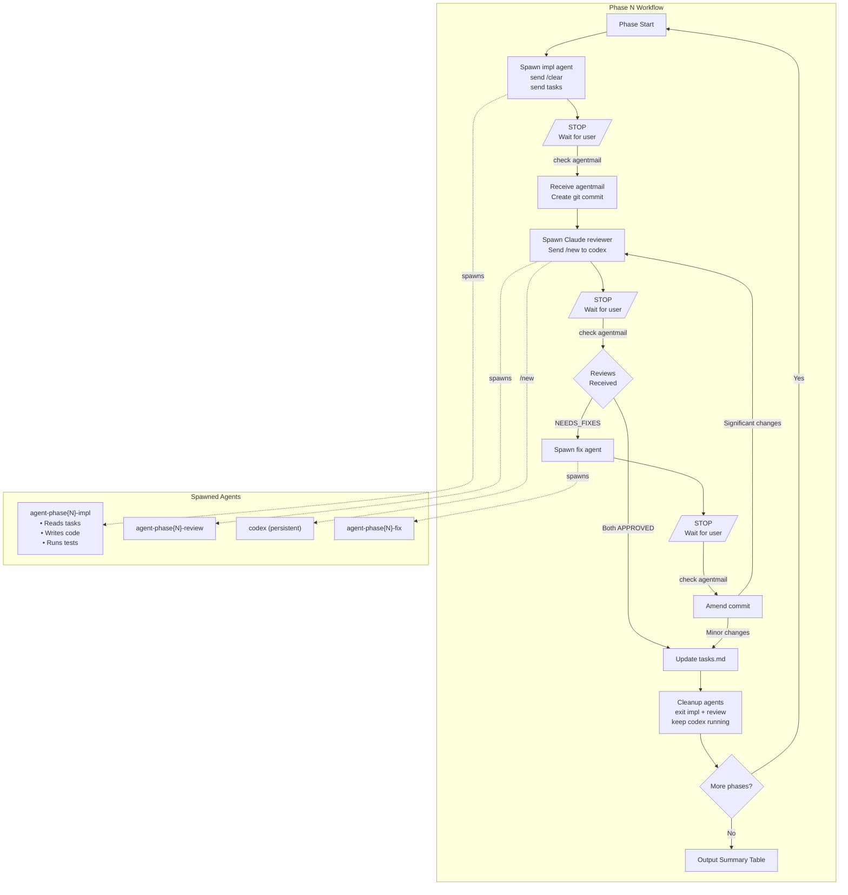
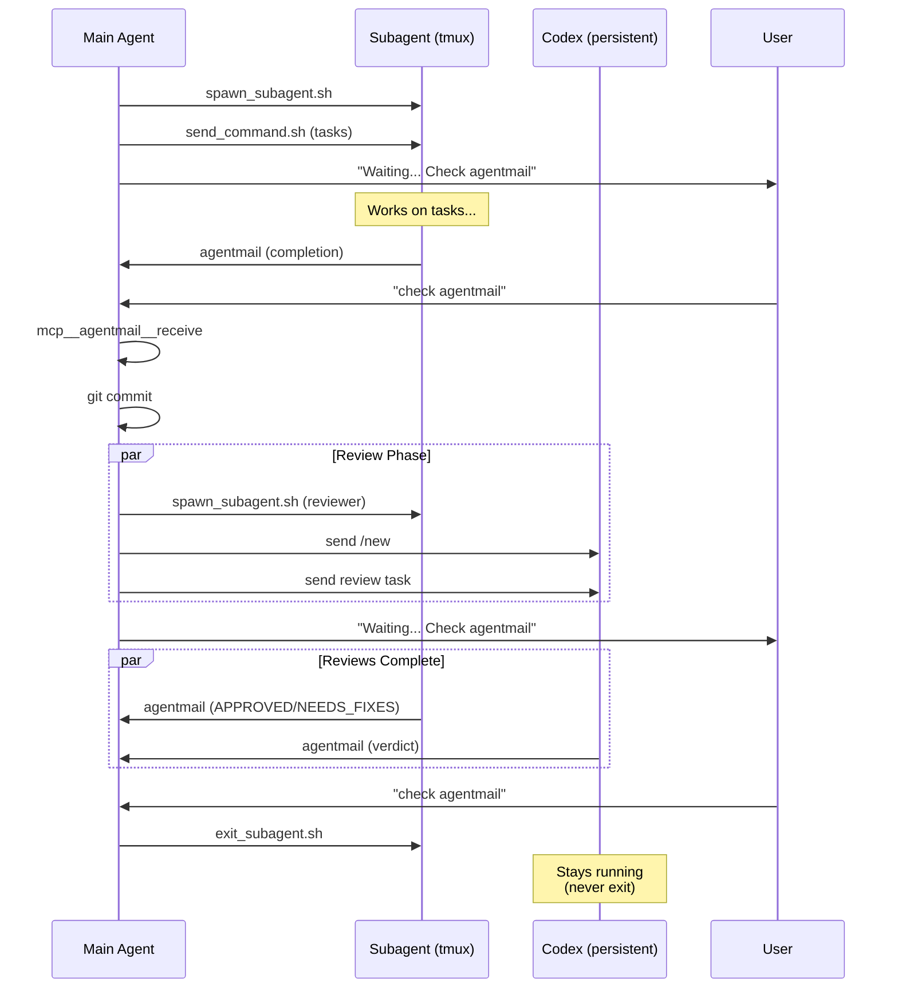

# Implementation Workflow Delegator

Orchestrate feature implementation via tmux subagents. Main agent role: coordinator only.

## Behavioral Requirements (EARS Format)

### Prohibition Requirements [Ubiquitous]

The main agent shall NOT write, edit, or modify application code directly.
The main agent shall NOT run tests, linters, or quality checks directly.
The main agent shall NOT read files for implementation purposes.
The main agent shall delegate ALL implementation work to subagents.

### Phase Initiation [Event-Driven]

When a phase begins, the main agent shall spawn an implementation subagent using `spawn_subagent.sh`.
When the implementation subagent is spawned, the main agent shall send `/clear` to reset context.
When the context is cleared, the main agent shall send the phase tasks via `send_command.sh`.

### Waiting Protocol [Event-Driven]

When task instructions are sent to a subagent, the main agent shall output "Waiting for agent completion. Check agentmail when ready."
When task instructions are sent, the main agent shall STOP and wait for user to say "check agentmail".
When the user says "check agentmail", the main agent shall call `mcp__agentmail__receive`.

### Commit Creation [Event-Driven]

When an implementation subagent reports completion via agentmail, the main agent shall create a git commit.
When creating a commit, the main agent shall include `Co-Authored-By: Claude Opus 4.5 <noreply@anthropic.com>`.

### Review Spawning [Event-Driven]

When a commit is created, the main agent shall spawn a Claude reviewer subagent.
When a commit is created, the main agent shall send `/new` to the existing `codex` window to clear context.
When spawning reviewers, the main agent shall include the commit hash and changed files in the task.
The main agent shall NOT spawn a new codex window; the `codex` window is always running.

### Review Handling [State-Driven]

While both reviewers return APPROVED, the main agent shall proceed to the next phase.
While Claude reviewer returns NEEDS_FIXES, the main agent shall spawn a fix subagent.
While only Codex returns NEEDS_FIXES, the main agent shall ask user whether to fix or proceed.

### Fix Handling [Event-Driven]

When a fix subagent completes, the main agent shall amend the previous commit.
When fixes are applied, the main agent shall re-run reviewers if changes are significant.

### Task Tracking [Event-Driven]

When a phase completes successfully, the main agent shall update tasks.md with session IDs and commit hash.
When updating tasks.md, the main agent shall mark all phase tasks as `[x]` complete.

### Cleanup [Event-Driven]

When a phase is fully complete (reviewed and tracked), the main agent shall exit all phase subagents using `exit_subagent.sh`.
The main agent shall NOT exit the `codex` window; it persists across all phases.

### Agent Resume [Event-Driven]

When follow-up work is needed on a previous agent's task, the main agent shall resume using `--resume {session-id}`.
When resuming an agent, the main agent shall NOT send `/clear` (context must be preserved).
When resuming, the main agent shall provide additional context via `send_command.sh`.
The session ID shall be obtained from the agent's previous agentmail response.

### Completion [Event-Driven]

When all phases complete, the main agent shall output a summary table with phases, commits, and test counts.

## Workflow Diagram



## Agent Communication Flow



## Workflow Per Phase

```text
1. Spawn agent-phase{N}-impl
2. Send /clear
3. Send phase tasks via agentmail
4. STOP - Wait for user "check agentmail"
5. Receive completion message
6. Create git commit
7. Spawn reviewers (parallel)
8. STOP - Wait for user "check agentmail"
9. If NEEDS_FIXES: spawn fix agent, repeat from step 4
10. Update tasks.md with session IDs
11. Clean up agents
12. Proceed to next phase
```

## Agent Spawning

Use tmux skill scripts:

```bash
# Spawn implementation agent
.claude/skills/tmux/scripts/spawn_subagent.sh agent-phase{N}-impl "claude --dangerously-skip-permissions"

# Clear context
.claude/skills/tmux/scripts/send_command.sh agent-phase{N}-impl "/clear"

# Send task
.claude/skills/tmux/scripts/send_command.sh agent-phase{N}-impl "Implement Phase {N}: {description}

## Tasks
{task list from tasks.md}

## Deliverables
{expected outputs}

When complete, send agentmail to 'main' with:
1. YOUR session ID (from scratchpad path)
2. Task completion status
3. Test results summary
4. Issues found"
```

## Resuming Agents

Agents can be resumed with their full conversation context using the `--resume` flag.

### When to Resume

- Agent needs additional context or clarification
- Follow-up task related to previous work
- Agent was exited prematurely
- Need to continue investigation with preserved context

### Resume Pattern

```bash
# Get session ID from previous agentmail response
# Example: "Session ID: b5c9dbe5-86f0-47b7-9552-400cb7acae90"

# Resume agent with previous context
.claude/skills/tmux/scripts/spawn_subagent.sh agent-{name} "claude --dangerously-skip-permissions --resume {session-id}"

# Send follow-up task (no /clear needed - context preserved)
.claude/skills/tmux/scripts/send_command.sh agent-{name} "Additional context:

## New Information
{additional context}

## Updated Task
{follow-up instructions}

When complete, send agentmail to 'main' with:
1. YOUR session ID
2. Updated analysis/results"
```

### Session ID Sources

Session IDs are provided in agentmail responses:
- Implementation agents: include in completion message
- Review agents: include in verdict message
- All agents should report: `Session ID: {uuid}`

### Resume vs Fresh Spawn

| Scenario | Action |
|----------|--------|
| New phase/task | Fresh spawn with `/clear` |
| Follow-up on same task | Resume with `--resume {id}` |
| Additional context needed | Resume with `--resume {id}` |
| Agent crashed/exited | Resume with `--resume {id}` |

**Note**: When resuming, do NOT send `/clear` - this would defeat the purpose of preserving context.

## Reviewer Pattern

Spawn Claude reviewer and use existing codex window in parallel after commit:

```bash
# Claude reviewer (spawn new)
.claude/skills/tmux/scripts/spawn_subagent.sh agent-phase{N}-review "claude --dangerously-skip-permissions"
.claude/skills/tmux/scripts/send_command.sh agent-phase{N}-review "/clear"
.claude/skills/tmux/scripts/send_command.sh agent-phase{N}-review "Review commit {hash} for {feature}.

## Review Scope
{files changed}

## Review Focus
{quality criteria}

When complete, send agentmail to 'main' with:
1. YOUR session ID
2. APPROVED or NEEDS_FIXES
3. Issues list (if any)"

# Codex reviewer (use existing window - NEVER spawn new)
# Prefer using /codex-assistant skill for cleaner integration
.claude/skills/tmux/scripts/send_command.sh codex "/clear"
.claude/skills/tmux/scripts/send_command.sh codex "Use /codex-assistant to review commit {hash}.

Review focus:
1. {criteria 1}
2. {criteria 2}
3. {criteria 3}

Output: APPROVED or NEEDS_FIXES with issues.

When complete, send agentmail to 'main' with:
1. YOUR session ID
2. Codex verdict
3. Issues found (if any)"
```

**Important**: The `codex` window is persistent. Never exit or stop it.
**Preferred**: Use `/codex-assistant` skill instead of raw `codex exec` commands.

## Handling Review Results

| Claude      | Codex       | Action                     |
| ----------- | ----------- | -------------------------- |
| APPROVED    | APPROVED    | Proceed to next phase      |
| APPROVED    | NEEDS_FIXES | Ask user: fix or proceed   |
| APPROVED    | (pending)   | Proceed (Claude is primary)|
| NEEDS_FIXES | *           | Spawn fix agent            |

**Note**: If Claude approves but Codex is slow/pending, proceed to next phase. Late Codex reviews can be addressed in subsequent iterations if issues are significant.

## Fix Agent Pattern

```bash
.claude/skills/tmux/scripts/spawn_subagent.sh agent-phase{N}-fix "claude --dangerously-skip-permissions"
.claude/skills/tmux/scripts/send_command.sh agent-phase{N}-fix "/clear"
.claude/skills/tmux/scripts/send_command.sh agent-phase{N}-fix "Fix issues in {file}

## Issues to Fix
{issue list from review}

## Deliverables
1. Fix all issues
2. Run tests
3. Verify passing

When complete, send agentmail to 'main' with:
1. YOUR session ID
2. Fixes applied
3. Test results"
```

After fix: amend commit, re-run reviewers if needed.

## Task Tracking

Update tasks.md after each phase:

```markdown
## Phase {N}: {Name}

**Implementer Session**: `{session-id}`
**Reviewer Sessions**: `{claude-id}` (claude), `{codex-id}` (codex)
**Commit**: `{hash}`

- [x] T001 Task description
- [x] T002 Task description
```

## Agent Cleanup

Always clean up after phase completion:

```bash
.claude/skills/tmux/scripts/exit_subagent.sh agent-phase{N}-impl
.claude/skills/tmux/scripts/exit_subagent.sh agent-phase{N}-review
# NEVER exit codex - it persists across all phases
```

**Important**: Do NOT exit the `codex` window. It remains running for all phases.

## Commit Pattern

Create commit after implementation agent completes:

```bash
git add {files}
git commit -m "$(cat <<'EOF'
{type}({scope}): {description}

{body}

Co-Authored-By: Claude Opus 4.5 <noreply@anthropic.com>
EOF
)"
```

If fixes applied, amend:

```bash
git add {files}
git commit --amend -m "{updated message}"
```

## Communication Protocol

Main agent outputs to user:

- Phase start announcement
- "Waiting for agent completion. Check agentmail when ready."
- Review results summary table
- Phase completion with commit hash

Never proceed without user saying "check agentmail".

## Naming Conventions

| Agent Type     | Pattern                 | Lifecycle                    | Resumable |
| -------------- | ----------------------- | ---------------------------- | --------- |
| Implementation | `agent-phase{N}-impl`   | Spawn per phase, exit after  | Yes       |
| Claude Review  | `agent-phase{N}-review` | Spawn per phase, exit after  | Yes       |
| Codex Review   | `codex`                 | Persistent, never exit       | N/A       |
| Fix            | `agent-phase{N}-fix`    | Spawn as needed, exit after  | Yes       |
| Ad-hoc         | `agent-{task-name}`     | Spawn as needed, exit after  | Yes       |

## Summary Table Template

After all phases complete:

```markdown
| Phase | Description | Commit | Tests |
|-------|-------------|--------|-------|
| 1 | {desc} | `{hash}` | {count} |
| 2 | {desc} | `{hash}` | {count} |
...
```

## Quality Gates Pattern

After all phases complete, run quality gates sequentially with a dedicated agent:

```bash
.claude/skills/tmux/scripts/spawn_subagent.sh agent-qa-gates "claude --dangerously-skip-permissions"
.claude/skills/tmux/scripts/send_command.sh agent-qa-gates "/clear"
.claude/skills/tmux/scripts/send_command.sh agent-qa-gates "Run all quality gates SEQUENTIALLY:

## Gate 1: Formatting
gofmt -l .

## Gate 2: Dependencies
go mod verify

## Gate 3: Static Analysis
go vet ./...

## Gate 4: Tests
go test -v -race -coverprofile=coverage.out ./...

## Gate 5: Vulnerability Check
govulncheck ./...

## Gate 6: Security Scan
gosec ./...

Report results in table format:
| Gate | Status | Details |
|------|--------|---------|

When complete, send agentmail to 'main' with results."
```

## EARS Requirements Integration

Use `/ears-translator` skill to formalize requirements before implementation:

1. **Before implementation**: Translate spec/plan deliverables to EARS format
2. **During implementation**: Reference REQ-IDs in commits (e.g., "Satisfies: REQ-AM-001")
3. **After implementation**: Verify all EARS requirements satisfied

```bash
# Ask subagent to translate requirements
.claude/skills/tmux/scripts/send_command.sh agent-spec "Use /ears-translator to review {spec-file} and translate deliverables to EARS format"
```

EARS patterns used:
- **Event-Driven**: When {trigger}, the system shall...
- **State-Driven**: While {condition}, the system shall...
- **Ubiquitous**: The system shall... (always active)
- **Unwanted Behavior**: If {error}, then the system shall...

## Spec Amendment Pattern

When adding new features to existing specs:

1. Create amendment file: `specs/{feature}/amendments/{amendment-name}.md`
2. Link from parent spec
3. Include EARS requirements section
4. Include implementation plan with phases

```markdown
# Spec Amendment: {Title}

**Amendment ID**: AM-{feature}-{number}
**Parent Spec**: [spec.md](../spec.md)
**Status**: Draft

## Requirements (EARS Format)
...

## Implementation Plan
...
```

---
> Converted and distributed by [TomeVault](https://tomevault.io/claim/userad) — claim your Tome and manage your conversions.
<!-- tomevault:4.0:skill_md:2026-04-13 -->
