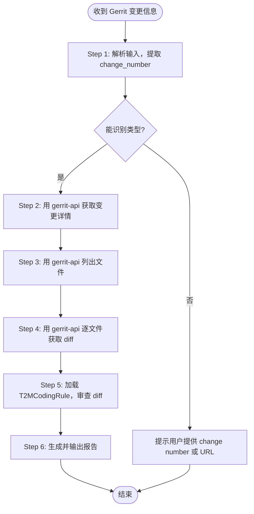

# Code Review Skill

**功能：** 按需 Code Review。收到 Gerrit 变更信息时，通过 **gerrit-api** skill 获取 patch，按 **T2MCodingRule** 审查，生成报告。**不对 Gerrit 做任何写操作。**

**触发条件（收到以下任意内容时使用本 skill）：**
- Gerrit 变更页面链接（`http://...` 或 `https://...`）
- Change number（纯数字，如 `12345`）
- Change-Id（`I` + 40 位十六进制，如 `Iabcdef...`，正则：`^I[0-9a-f]{40}$`）
- Commit SHA（7~40 位十六进制，正则：`^[0-9a-f]{7,40}$`）
- Gerrit stream event JSON 文本

**所有 Gerrit 操作均通过 gerrit-api skill 完成，本 skill 不直接调用 Gerrit API。**

| 脚本 | 用途 | 调用时机 |
|---|---|---|
| `check_env.py` | 检查 gerrit-api 已安装 + code-review 配置存在 | 加载 skill 后运行一次 |

---

> **路径约定**: `scripts/...` 路径均相对于 code-review Skill 目录（`.agents/skills/code-review/`）。  
> `gerrit-api` 脚本路径通过变量 `GERRIT_API_SKILL_DIR` 引用，默认为 `.agents/skills/gerrit-api`（OpenClaw 标准安装路径）。

```bash
# OpenClaw 中 gerrit-api 的默认安装路径（通常已由平台自动设置）
GERRIT_API_SKILL_DIR="${GERRIT_API_SKILL_DIR:-.agents/skills/gerrit-api}"
```

## Step 1 — 环境检查（首次加载 skill 时运行一次）

```bash
python3 scripts/check_env.py
```

脚本检查：Python 版本、gerrit-api 已安装、T2MCodingRule 已安装、Gerrit 环境变量已设置。

**如果 gerrit-api 或 T2MCodingRule 未安装，脚本会输出安装命令：**
```
❌ gerrit-api skill 未安装（必须安装）
   安装命令: npx skills add https://github.com/vancebs/skills --skill gerrit-api
❌ T2MCodingRule skill 未安装（必须安装）
   安装命令: npx skills add https://github.com/vancebs/skills --skill T2MCodingRule
```

---

## Step 2 — Configure (optional)

配置字段（可选）：

| 配置项 | 默认值 | 说明 |
|---|---|---|
| `CODE_REVIEW_SKIP_PATTERNS` | — | 跳过的文件 glob，逗号分隔，如 `*.md,*.xml,*.json` |

**Option A — Config file**

Create `$WORKSPACE/.config/code-review.json` (or `~/.config/code-review.json`):

```json
{
  "CODE_REVIEW_SKIP_PATTERNS": "*.min.js,*.generated.*"
}
```

**Option B — Environment variables**

```bash
export CODE_REVIEW_SKIP_PATTERNS="*.min.js,*.generated.*"
```

### Dependencies

| Dependency | Type | Install |
|---|---|---|
| `gerrit-api` | skill | `npx skills add https://github.com/vancebs/skills --skill gerrit-api` |
| `T2MCodingRule` | skill | `npx skills add https://github.com/vancebs/skills --skill T2MCodingRule` |

---

## 📋 工作流（收到 Gerrit 变更信息时执行）



---

### 阶段一 — 解析输入，提取 change_number

根据收到的信息类型，提取 `change_number`（Gerrit 变更的数字 ID）：

| 输入类型 | 提取方法 |
|---|---|
| Gerrit 页面 URL | 从 URL 中提取数字：`/c/proj/+/NUMBER` 或 `#/c/NUMBER` |
| 纯数字 | 直接使用，格式正则：`^\d+$` |
| Change-Id | 格式正则：`^I[0-9a-f]{40}$`，需通过 query 命令查找对应 change number（见下方） |
| Commit SHA | 格式正则：`^[0-9a-f]{7,40}$`，需通过 query 命令查找（见下方） |
| Stream event JSON | 读取 `change.number` 字段；`patchSet.revision` 字段为 commit SHA |

**URL 提取示例：**
```
https://gerrit.example.com/c/platform/frameworks/base/+/12345      → 12345
https://gerrit.example.com/c/platform/frameworks/base/+/12345/2    → 12345（patchset 2）
https://gerrit.example.com/#/c/12345/                              → 12345
```

**通过 Change-Id 查询 change number：**
```bash
python3 "$GERRIT_API_SKILL_DIR/scripts/gerrit_api.py" \
  query "change:Iabcdef1234567890abcdef1234567890abcdef12+limit:1"
```

**通过 commit SHA 查询 change number：**
```bash
python3 "$GERRIT_API_SKILL_DIR/scripts/gerrit_api.py" \
  query "commit:abc123def456+limit:1"
```

---

### 阶段二 — 通过 gerrit-api 获取 Patch 数据

以下命令全部使用 `gerrit-api` skill 的脚本（路径: `$GERRIT_API_SKILL_DIR/scripts/`）。

#### 2A — 获取变更详情

```bash
python3 "$GERRIT_API_SKILL_DIR/scripts/gerrit_api.py" get-change <change_number>
```

**从输出中提取：**
- `subject` — 提交标题
- `project` — 项目名
- `branch` — 目标分支
- `owner.username` 或 `owner.name` — 提交者
- `current_revision` — 当前 patchset 的 commit SHA（后续步骤需要）

#### 2B — 列出变更文件

```bash
python3 "$GERRIT_API_SKILL_DIR/scripts/gerrit_api.py" list-files <change_number>
```

输出为文件路径列表。跳过以下文件（对应 `skip_file_patterns` 配置）：
- 配置文件（如 `*.json`, `*.xml`, `*.yaml`）按 `skip_file_patterns` 跳过

#### 2C — 获取每个文件的 Diff

对 `list-files` 返回的每个文件路径执行：

```bash
python3 "$GERRIT_API_SKILL_DIR/scripts/gerrit_api.py" \
  get-diff <change_number> "path/to/file.java"
```

**Windows 将 `python3` 替换为 `python`，路径分隔符用 `%`：**
```batch
python "%GERRIT_API_SKILL_DIR%\scripts\gerrit_api.py" get-diff <change_number> "path/to/file.java"  :: OpenClaw standard path
```

收集所有文件的 diff 后，进入阶段三。

---

### 阶段三 — Code Review（对所有收集到的 diff）

加载 **T2MCodingRule** skill，按以下步骤审查。

#### Checklist: 审查前准备

- [ ] `get-change` 已成功，已知 `subject`、`project`、`branch`、`current_revision`
- [ ] `list-files` 已返回文件列表（过滤掉 `skip_file_patterns` 中的文件）
- [ ] 所有文件的 `get-diff` 已完成
- [ ] T2MCodingRule skill 已加载

#### 3A — 提交信息（Commit Message）审查

依据 **T2MCodingRule 一、Git Commit Message 规范**逐条检查：

| 编号    | 检查项                                  | 正则 / 规则                                                                                      | 问题级别       |
| ----- | ------------------------------------ | -------------------------------------------------------------------------------------------- | ---------- |
| CM-1  | 首行格式：`<Issue Key> <Summary>` 或 `[<Issue Key>] <Summary>` | 首行必须匹配 `^(\[?[A-Z0-9]+-\d+\]?)\s+\S+.*`；Issue Key 可带或不带中括号，均视为合法 | 🟠 ERROR   |
| CM-2  | Issue Key 格式                         | `^\[?[A-Z0-9]+-\d+\]?`；带括号形式（`[FPS-100]`）与不带括号形式（`FPS-100`）均合法           | 🟡 WARNING |
| CM-3  | 首行与正文之间有空行                           | 第 2 行须为空行（如有正文）                                                                              | 🟠 ERROR   |
| CM-4  | 包含 `* Root Cause` 字段                 | 正文中存在 `^\* Root Cause`                                                                       | 🟠 ERROR   |
| CM-5  | 包含 `* Solution` 字段                   | 正文中存在 `^\* Solution`                                                                         | 🟠 ERROR   |
| CM-6  | 包含 `* Test Steps` 字段                 | 正文中存在 `^\* Test Steps`                                                                       | 🟠 ERROR   |
| CM-7  | 包含 `* Test Result` 字段                | 正文中存在 `^\* Test Result`                                                                      | 🟠 ERROR   |
| CM-8  | `* Solution` 描述具体技术改动                | 内容不得为泛化表述（如 "Fix code"、"代码优化"、"按要求修改"）；正则排除：`(?i)(fix code\|代码优化\|按.*要求\|meet.*requirement)` | 🟠 ERROR   |
| CM-9  | 涉及安全变更时有 `* Security Check` 字段       | 若 diff 含安全相关改动，需检查是否包含 `^\* Security Check`                                                  | 🟡 WARNING |
| CM-10 | 涉及兼容性变更时有 `* Compatibility Check` 字段 | 若 diff 含接口/API 改动，需检查是否包含 `^\* Compatibility Check`                                          | 🟡 WARNING |
| CM-11 | 涉及 AOSP 框架/系统服务/架构变更时引用 ADR          | commit message 中包含 ADR 文档引用                                                                  | 🔵 INFO    |

> **注意：** `get-change` 返回的 `subject` 字段仅为首行。如需检查完整 commit message，可在报告中注明"无法获取完整 message"并仅基于 subject 审查 CM-1 ~ CM-3。

#### 3B — 文件 Diff 审查

**只审查 diff 中新增/修改的行（`+` 开头的行）**，根据扩展名选择规范：

| 扩展名 | 规范 |
|---|---|
| `.java` | T2MCodingRule 四（Java 编码规范）|
| `.c`, `.h` | T2MCodingRule 五（C 编码规范）|
| `.cpp`, `.cc`, `.hpp` | T2MCodingRule 六（C++ 编码规范）|
| 其他 | 通用质量检查 |

审查重点：
- [ ] 命名规范（类/变量/函数）
- [ ] 注释完整性（公共 API、复杂逻辑）
- [ ] 安全规范（T2MCodingRule 七）：无硬编码密码、日志无敏感信息
- [ ] 兼容性规范（T2MCodingRule 八）：无废弃 API、接口向后兼容
- [ ] 逻辑错误、资源泄漏、死锁风险

#### 3C — 问题定级与 PASS/FAIL 判断

| 级别 | 说明 | 影响结果 |
|---|---|---|
| 🔴 CRITICAL | 编译错误、安全漏洞、严重数据风险 | 导致 FAIL |
| 🟠 ERROR | 违反 T2MCodingRule 强制规则 | 导致 FAIL |
| 🟡 WARNING | 建议改进、风格问题 | 不影响 PASS/FAIL |
| 🔵 INFO | 可选建议 | 不影响 PASS/FAIL |

**判断：** 有任意 🔴 或 🟠 → **FAIL**，否则 **PASS**。

#### 3D — 生成报告（固定格式）

> ⚠️ **严格按以下格式输出报告，不允许附加任何格式外的内容（无引言、无总结、无 markdown 代码块包裹）。**

```
**PASS** 或 **FAIL**

| 级别 | 文件 | 问题 |
|---|---|---|
| 🔴 CRITICAL | {file}:{line} | [{编号}] {一句话描述，≤30字} |
| 🟠 ERROR | commit-message:1 | [CM-1] 首行缺少有效 Issue Key |
| 🟡 WARNING | {file}:{line} | [{编号}] {描述，≤30字} |
| 🔵 INFO | {file}:{line} | {描述，≤30字} |

# Patch信息
URL: {gerrit_url}/c/{project}/+/{change_number}
Change-Id: {change_id}
Owner: {owner_email}
Repo: {project}
Branch: {branch}

# 问题清单
## {file_path}:{line}
[{级别}] [{编号}]{问题描述}
- **原因:** {违反的规范条目及理由}
- **建议:** {具体修改建议}
```

**格式规则（严格执行）：**
- 第一行必须是 `**PASS**` 或 `**FAIL**`，不得有其他内容
- 问题列表（表格）只包含有问题的行，无问题时整个表格省略（只保留 PASS/FAIL + Patch信息 + 空的"问题清单"）
- `# Patch信息` 必须包含 URL、Change-Id、Owner、Repo、Branch 五个字段
- `# 问题清单` 每个问题以 `## {文件}:{行号}` 为标题（commit message 使用 `## commit-message:1`）
- 每个问题项必须包含 `- **原因:**` 和 `- **建议:**` 两行
- 问题列表（表格）每条问题描述不超过 30 字；如有规范编号（CM-1 等），在描述头部标出
- 问题清单每条问题要求简洁，无字数限制

**无问题时的输出示例（PASS）：**

```
**PASS**

# Patch信息
URL: https://gerrit.example.com/c/myproject/+/12345
Change-Id: Iabcdef1234567890abcdef1234567890abcdef12
Owner: john.doe@example.com
Repo: myproject
Branch: main

# 问题清单
（无问题）
```

---


## 异常处理

| 异常情况 | 触发条件 | 处理动作 |
|---|---|---|
| gerrit-api 未安装 | `check_env.py` 输出 ❌ | 运行安装命令后重新检查 |
| gerrit-api 安装路径不正确 | 调用 gerrit_api.py 报错 | 重新安装 gerrit-api skill，确认路径 |
| `get-change` 返回空或错误 | change_number 不存在 | 确认 change_number 正确 |
| `list-files` 返回空 | 纯文档变更 | 输出"无代码文件，跳过审查" |
| `get-diff` 失败 | 文件已删除或 revision 不对 | 跳过该文件，继续其他文件 |
| `query` 无结果 | Change-Id 或 commit SHA 不存在 | 提示用户确认信息来源 |


## ⛔ 约束与禁止事项

### 不支持的场景

| 场景 | 原因 | 处理动作 |
|---|---|---|
| 输入无法解析为任何已知类型 | URL 格式非标准、JSON 结构不匹配 | 停止并提示用户提供 change number（纯数字）或标准 Gerrit URL |
| `query` 返回 0 条结果 | Change-Id / commit SHA 不在此 Gerrit 实例 | 停止并提示"在此 Gerrit 实例中未找到对应变更，请确认信息来源" |
| `query` 返回多条结果 | 不同项目含相同 Change-Id 的历史提交 | 使用第一条，日志输出 WARNING；若结果超过 5 条则停止并请用户提供 change number |
| 所有文件被 `skip_file_patterns` 过滤 | 纯文档/配置变更 | 输出"所有文件均被跳过，无可审查代码文件"，**PASS**（不 FAIL） |
| `get-diff` 对二进制文件或新增文件返回空 | 二进制内容不可 diff | 跳过该文件，报告中标注"[🔵 INFO] 二进制文件，跳过审查" |
| gerrit-api skill 未安装 | 依赖缺失 | 停止并输出：`❌ 需要 gerrit-api skill。安装命令: npx skills add https://github.com/vancebs/skills --skill gerrit-api` |
| T2MCodingRule skill 未安装 | 依赖缺失 | 停止并输出：`❌ 需要 T2MCodingRule skill。安装命令: npx skills add https://github.com/vancebs/skills --skill T2MCodingRule` |
| Gerrit 环境变量未设置 | `GERRIT_URL`/`GERRIT_USERNAME`/`GERRIT_HTTP_PASSWORD` 未配置 | 运行 `check_env.py` 查看哪些变量缺失 |

### 明确禁止的操作

- ⛔ **禁止将 diff 内容（含用户代码）发送到外部服务或第三方 API**
- ⛔ **禁止对 Gerrit 做任何写操作**（review、comment、Verified 标签等）

### 幂等性声明

| 操作 | 幂等性 | 说明 |
|---|---|---|
| 解析输入 / 获取 patch | ✅ 幂等 | 只读操作 |
| 生成报告 | ✅ 幂等 | 仅输出文本，不写任何外部状态 |

---

## 配置参考

### Config Reference

| 环境变量 | 必填 | 默认值 | 说明 |
|---|---|---|---|
| `CODE_REVIEW_SKIP_PATTERNS` | ❌ | — | 逗号分隔的文件 glob，如 `*.md,*.json` |

> Gerrit 连接配置（`GERRIT_URL`/`GERRIT_USERNAME`/`GERRIT_HTTP_PASSWORD`）在 **gerrit-api** skill 中管理。

---

## 与其他 skill 的关系

| Skill | 关系 | 说明 |
|---|---|---|
| `gerrit-api` | **必须** | 所有 Gerrit 只读操作（get-change/list-files/get-diff）均通过它完成 |
| `T2MCodingRule` | **必须** | 提供审查规范 |
| `skill-guide` | 建议安装 | 解决路径和环境问题 |

---

## 📚 参考文件

| 文件 | 内容 |
|---|---|
| [`references/review-workflow.md`](references/review-workflow.md) | 完整审查流程和报告格式模板（含 FAIL/PASS 示例） |
| [`references/error-handling-guide.md`](references/error-handling-guide.md) | 各阶段错误场景、诊断步骤和恢复措施 |

---

## 文件清单

```
code-review/
├── SKILL.md
├── README.md
├── references/
│   ├── review-workflow.md    ← 审查流程 + 报告格式模板
│   └── error-handling-guide.md ← 错误处理指南
└── scripts/
    └── check_env.py          ← 环境检查（验证 gerrit-api、T2MCodingRule 已安装，Gerrit 环境变量已设置）
```

---

## 快速排错

| 症状 | 处理 |
|---|---|
| `check_env.py` 报 gerrit-api 未安装 | `npx skills add https://github.com/vancebs/skills --skill gerrit-api` |
| `get-change` 返回 404 | change number 不存在，确认 Gerrit URL 和 change number |
| `list-files` 返回空列表 | 纯文档/配置变更，报告输出 PASS + "无可审查代码文件" |
| `get-diff` 对某文件返回空 | 二进制文件或新增空文件，跳过并在报告中标注 🔵 INFO |
| Change-Id 或 SHA 查不到 | `query` 返回 0 条，提示用户确认 Gerrit 实例和 change 来源 |

详细错误处理见 [`references/error-handling-guide.md`](references/error-handling-guide.md)。

---
> Source: [vancebs/skills](https://github.com/vancebs/skills) — distributed by [TomeVault](https://tomevault.io).
<!-- tomevault:4.0:skill_md:2026-05-22 -->
