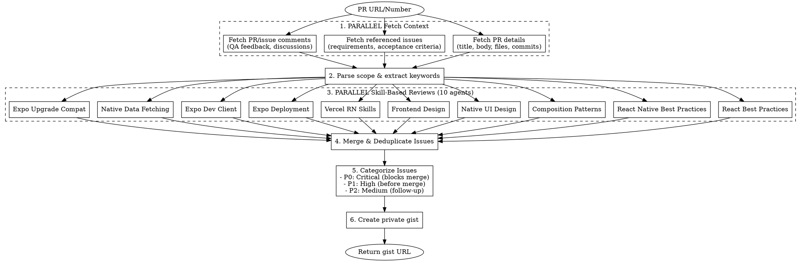
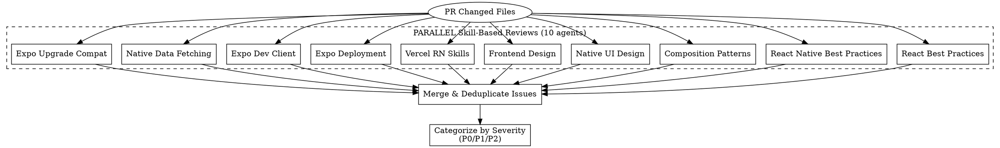
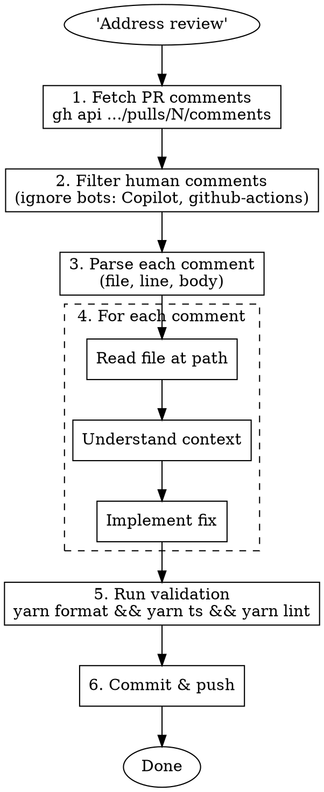

# Review PR

Deep-dive PR analysis with parallel codebase exploration, consistency checking, and private gist output.

Also supports **addressing human review comments** - filtering out AI/bot reviewers and implementing only human feedback.

## Overview

### Mode 1: Generate PR Review
Systematically review PRs by:
1. Fetching PR details and referenced issues from GitHub
2. Launching parallel exploration agents across all affected packages
3. Analyzing consistency with existing codebase patterns
4. Categorizing issues by severity (P0/P1/P2)
5. Creating a shareable private gist with full analysis

### Mode 2: Address Human Review Comments
When asked to "address review", "fix review comments", or "address human review":
1. Fetch all PR review comments from GitHub API
2. Filter out bot/AI reviewers (Copilot, github-actions, etc.)
3. Address only human reviewer feedback
4. Run validation and commit changes

## Workflow



## Step-by-Step

### 1. Fetch PR Context (PARALLEL)

Use a SINGLE message with MULTIPLE tool calls:

```bash
# PR details
gh pr view <NUMBER> --json title,body,commits,files,comments,reviews,labels,state,headRefName,baseRefName

# Referenced issues (parse from PR body "fixes #XXXX")
gh issue view <ISSUE_NUMBER> --json title,body,comments,labels,state

# Get diff stats
gh pr diff <NUMBER> --stat
```

### 2. Parse Scope & Extract Keywords

From PR body and commits, identify:
- **Feature scope**: What's being added/changed
- **Affected packages**: api-core, web-client, mobile-client, api-contracts
- **Key entities**: New models, components, services
- **Referenced issues**: Requirements and acceptance criteria
- **QA feedback**: Bug reports from comments

### 3. Launch Parallel Skill-Based Review Agents

**CRITICAL**: Use a SINGLE message with MULTIPLE Task tool calls for true parallelism.

Launch these specialized review agents in parallel, each applying domain-specific best practices:

#### Agent 1: React Best Practices Review

```
Review the PR changes against React best practices from the vercel-react-best-practices skill.

Check:
1. Component composition patterns
2. State management (useState, useReducer)
3. Effect cleanup and dependencies
4. Memoization (useMemo, useCallback, React.memo)
5. Key prop usage in lists
6. Prop drilling vs context
7. Error boundaries
8. Suspense and lazy loading

Report violations with file paths and line numbers.
```

#### Agent 2: React Native Best Practices Review

```
Review the PR changes against React Native best practices from the react-native-best-practices skill.

Check:
1. FPS and performance (avoid JS thread blocking)
2. FlashList vs FlatList usage
3. Native driver animations
4. Bridge overhead minimization
5. Memory leaks (cleanup, subscriptions)
6. Image optimization
7. Hermes-specific optimizations
8. Bundle size impact

Report violations with file paths and line numbers.
```

#### Agent 3: Composition Patterns Review

```
Review the PR changes against React composition patterns from the vercel-composition-patterns skill.

Check:
1. Boolean prop proliferation
2. Compound component patterns
3. Render props usage
4. Context provider design
5. Slot patterns
6. Inversion of control
7. Component API flexibility
8. Reusability vs specificity

Report violations with file paths and line numbers.
```

#### Agent 4: Native UI Design Review

```
Review the PR changes against Native UI design guidelines from the building-native-ui skill.

Check:
1. Expo Router patterns
2. Navigation structure
3. Animation implementation
4. Native tabs configuration
5. Component styling patterns
6. Layout consistency
7. Platform-specific handling
8. Accessibility considerations

Report violations with file paths and line numbers.
```

#### Agent 5: Frontend Design Review

```
Review the PR changes against frontend design guidelines from the frontend-design skill.

Check:
1. Visual hierarchy
2. Spacing and typography
3. Color usage and theming
4. Responsive design patterns
5. Interactive states (hover, press, focus)
6. Loading and error states
7. Empty states
8. Design system consistency

Report violations with file paths and line numbers.
```

#### Agent 6: Vercel React Native Skills Review

```
Review the PR changes against Vercel React Native skills from the vercel-react-native-skills skill.

Check:
1. List virtualization
2. Animation performance
3. Native module integration
4. Gesture handling
5. Image caching
6. Network request patterns
7. Offline support
8. Platform-specific code organization

Report violations with file paths and line numbers.
```

#### Agent 7: Expo Deployment Review

```
Review the PR changes against Expo deployment guidelines from the expo-deployment skill.

Check:
1. EAS Build configuration
2. App store deployment readiness
3. Environment variables handling
4. OTA update compatibility
5. Native module compatibility
6. Build profiles configuration
7. Submission credentials
8. Release channel management

Report violations with file paths and line numbers.
```

#### Agent 8: Expo Dev Client Review

```
Review the PR changes against Expo dev client guidelines from the expo-dev-client skill.

Check:
1. Development build configuration
2. Custom native module integration
3. Debug vs release behavior
4. TestFlight/Internal distribution setup
5. Local development workflow
6. Native dependency management
7. Build caching strategies
8. Development plugin usage

Report violations with file paths and line numbers.
```

#### Agent 9: Native Data Fetching Review

```
Review the PR changes against native data fetching guidelines from the native-data-fetching skill.

Check:
1. Fetch API usage patterns
2. Error handling and retries
3. Caching strategies
4. Offline support implementation
5. Request cancellation
6. Loading state management
7. Optimistic updates
8. Background refresh patterns

Report violations with file paths and line numbers.
```

#### Agent 10: Expo Upgrade Compatibility Review

```
Review the PR changes against Expo upgrade guidelines from the upgrading-expo skill.

Check:
1. SDK version compatibility
2. Deprecated API usage
3. Breaking change impact
4. Native module version alignment
5. Config plugin compatibility
6. Dependency version conflicts
7. Migration path requirements
8. Testing requirements post-upgrade

Report violations with file paths and line numbers.
```

### Parallel Skill Review Diagram



### Example Parallel Task Invocation

```
Use a SINGLE message with 10 Task tool calls:

Task 1:  { subagent_type: "superpowers:code-reviewer", prompt: "Review against vercel-react-best-practices skill..." }
Task 2:  { subagent_type: "superpowers:code-reviewer", prompt: "Review against react-native-best-practices skill..." }
Task 3:  { subagent_type: "superpowers:code-reviewer", prompt: "Review against vercel-composition-patterns skill..." }
Task 4:  { subagent_type: "superpowers:code-reviewer", prompt: "Review against building-native-ui skill..." }
Task 5:  { subagent_type: "superpowers:code-reviewer", prompt: "Review against frontend-design skill..." }
Task 6:  { subagent_type: "superpowers:code-reviewer", prompt: "Review against vercel-react-native-skills skill..." }
Task 7:  { subagent_type: "superpowers:code-reviewer", prompt: "Review against expo-deployment skill..." }
Task 8:  { subagent_type: "superpowers:code-reviewer", prompt: "Review against expo-dev-client skill..." }
Task 9:  { subagent_type: "superpowers:code-reviewer", prompt: "Review against native-data-fetching skill..." }
Task 10: { subagent_type: "superpowers:code-reviewer", prompt: "Review against upgrading-expo skill..." }
```

### 4. Consistency Analysis

Compare PR implementation against discovered patterns:

| Category | Existing Pattern | PR Implementation | Status |
|----------|------------------|-------------------|--------|
| File naming | `kebab-case.type.ts` | ? | ✅/⚠️ |
| Interface naming | `*Interface` suffix | ? | ✅/⚠️ |
| Component structure | Hierarchical folders | ? | ✅/⚠️ |
| Validation | Zod with translation keys | ? | ✅/⚠️ |
| Translations | Namespaced keys | ? | ✅/⚠️ |

### 5. Categorize Issues

#### P0 - Critical (Blocks Merge)
- API crashes/errors
- Security vulnerabilities
- Data corruption risks
- Breaking changes without migration

#### P1 - High (Before Merge)
- Consistency violations with existing patterns
- Missing validation
- QA-reported bugs affecting core functionality
- Incomplete translations
- Spec compliance issues

#### P2 - Medium (Follow-up Tickets)
- Edge case handling
- UX improvements
- Performance optimizations
- Code style preferences

### 6. Create Private Gist

```bash
gh gist create -d "PR #<NUM>: <Title> - Review" analysis.md
```

## Gist Template

```markdown
# PR #<NUM>: <Title>

## Overview

**PR:** <url>
**Issue:** <referenced issue url>
**Branch:** `<branch name>`
**Files Changed:** <count>
**Author:** @<username>

### Feature Summary
<1-3 sentence description of what the PR implements>

---

## Architecture

### Data Model
\`\`\`
<ASCII diagram of entities/relationships>
\`\`\`

### Component Structure
\`\`\`
<directory tree of new components>
\`\`\`

### New Files Summary
| Package | New Files | Purpose |
|---------|-----------|---------|
| api-core | X | <summary> |
| web-client | X | <summary> |
| api-contracts | X | <summary> |

---

## QA Issues Analysis

| # | Issue | Severity | Category | Status |
|---|-------|----------|----------|--------|
| 1 | <description> | P0/P1/P2 | <category> | Open/Fixed |

---

## Consistency Analysis

### ✅ Following Existing Patterns
<list of things done correctly>

### ⚠️ Consistency Issues Found

#### 1. <Issue Title>
**Location:** `<file path>`
**Problem:** <description>
**Existing Pattern:** <how it's done elsewhere>
**Fix:**
\`\`\`typescript
<code fix>
\`\`\`

---

## Recommendations

### P0 - Critical (Block Merge)
1. <issue with fix>

### P1 - High (Before Merge)
1. <issue with fix>

### P2 - Medium (Follow-up)
1. <issue>

---

## Files Changed Summary

### API Core (<count> files)
**New:**
- `<path>` - <purpose>

**Modified:**
- `<path>` - <changes>

### Web Client (<count> files)
**New:**
- `<path>` - <purpose>

**Modified:**
- `<path>` - <changes>

### API Contracts (<count> files)
- `<path>` - <purpose>

---

## Testing Recommendations

### Integration Tests
- [ ] <specific test scenario>

### E2E Tests
- [ ] <specific test scenario>

---

## Summary

<2-3 sentences with overall assessment and key recommendations>

**Recommendation:** Approve / Request Changes / Needs Discussion

---

*Review generated: <date>*
```

## Consistency Checklist

### Naming Conventions

| Element | Convention | Example |
|---------|------------|---------|
| Vue components | `kebab-case.vue` | `rule-entry-builder.vue` |
| TypeScript files | `kebab-case.type.ts` | `rule-entry-data.interface.ts` |
| Interfaces | `*Interface` suffix | `RuleEntryDataInterface` |
| Enums | `*Enum` suffix | `RuleEntryTypeEnum` |
| Composables | `use-*.ts` | `use-rule-entry-form.ts` |
| Constants | `*.constant.ts` or `get-*.constant.ts` | `get-empty-state.constant.ts` |
| Mappers | `map-*-to-*.mapper.ts` | `map-dto-to-data.mapper.ts` |
| Schemas | `*.schema.ts` | `rule-entry-input.schema.ts` |
| Fragments | `*.fragment.ts` | `rule-entry.fragment.ts` |

### Code Patterns

| Pattern | Check |
|---------|-------|
| No `as` type assertions | Look for `as` keyword |
| No eslint-disable | Look for `eslint-disable` |
| No comments in code | Look for `//` comments |
| Type guards from @rnw-community | `isDefined()`, `isNotEmptyArray()` |
| Translations in en.json | No hardcoded strings |
| One export per file | Check barrel exports |
| Max 310 lines per file | Check file length |
| No lodash | Use native JS |
| Vue 3 Composition API only | No Options API |

### API Patterns

| Pattern | Check |
|---------|-------|
| `@Transactional()` on create/update/delete | Services that write |
| `@Log()` decorator | All service methods |
| REQUEST scope for DataLoaders | `@Injectable({ scope: Scope.REQUEST })` |
| Access services for permissions | `*AccessService` |
| Feature flag guards | `@HasFeatureFlags()` |

### Web Patterns

| Pattern | Check |
|---------|-------|
| `defineModel()` for two-way binding | Form components |
| Scoped SCSS | `<style scoped lang="scss">` |
| BEM naming | `.block__element--modifier` |
| CSS variables | `var(--gap-m)`, `var(--c-primary)` |
| Deep copy for objects | `deepCopy(toRaw(value))` |

## Common Issues to Flag

| Issue | Why It Matters |
|-------|----------------|
| Hardcoded brand name | White-label customers see wrong branding |
| Missing default values | Spec compliance, UX consistency |
| Unsorted dropdown options | UX consistency across app |
| Validation inconsistency | Different limits in similar features |
| Array index vs display number | Off-by-one bugs on delete |
| Missing mutual exclusivity | Logic bugs allowing invalid states |
| Dynamic text not using context | "maintenance" vs "check" based on type |

## Example Invocation

```
User: /review-pr 305

Claude:
1. Fetches PR #305 details (title, body, files, commits)
2. Fetches referenced issues from PR body
3. Parses scope: PrivatBank XLSX import, 47 files changed
4. Launches 10 PARALLEL skill-based review agents:
   - React Best Practices: Checks hooks, memoization, effects
   - React Native Best Practices: Checks performance, lists, animations
   - Composition Patterns: Checks component API design
   - Native UI Design: Checks navigation, styling, accessibility
   - Frontend Design: Checks visual hierarchy, theming
   - Vercel RN Skills: Checks platform-specific patterns
   - Expo Deployment: Checks EAS config, OTA updates
   - Expo Dev Client: Checks dev build, native modules
   - Native Data Fetching: Checks API calls, caching, offline
   - Expo Upgrade Compat: Checks SDK compatibility, deprecations
5. Merges and deduplicates issues from all agents
6. Categorizes: 2 P0, 5 P1, 8 P2
7. Creates gist with full analysis
8. Returns: https://gist.github.com/...
```

## Tips

- **Always check QA comments** - They contain real-world bug reports
- **Compare with similar features** - @rule, @procedures have similar patterns
- **Check translations** - Missing keys cause runtime errors
- **Verify default values** - Spec often specifies defaults
- **Look for hardcoded values** - Brand names, magic numbers
- **Check mutual exclusivity** - Radio-like choices shouldn't allow multiple
- **Verify sorting** - Dropdowns usually alphabetically sorted
- **Test edge cases** - Day 31 in February, etc.

---

## Addressing Human Review Comments

When asked to "address review", "fix review comments", or "address human review", follow this workflow:

### 1. Fetch Review Comments

```bash
# Get PR review state
gh pr view <NUMBER> --json number,url,reviews --jq '{number, url, reviews: [.reviews[] | {author: .author.login, state: .state, body: .body}]}'

# Get all review comments (inline comments on code)
gh api repos/<OWNER>/<REPO>/pulls/<NUMBER>/comments
```

### 2. Filter Human vs Bot Comments

**CRITICAL**: Only address comments from human reviewers. Ignore AI/bot reviewers unless explicitly asked.

**Known Bot/AI Reviewers to Ignore:**
- `Copilot` / `copilot-pull-request-reviewer`
- `github-actions[bot]`
- `dependabot[bot]`
- `claude-review` / any `*-review` bot
- Any user with `type: "Bot"` in the API response

**Human Review Indicators:**
- `user.type === "User"` (not "Bot")
- Real usernames (not ending in `[bot]`)
- Review state is `CHANGES_REQUESTED` or `APPROVED` from humans

### 3. Parse Human Comments

For each human comment, extract:
- **File path**: `comment.path`
- **Line number**: `comment.line` or `comment.original_line`
- **Comment body**: `comment.body`
- **Author**: `comment.user.login`

### 4. Address Each Comment

For each human review comment:

1. **Read the file** at the specified path
2. **Understand the context** around the line number
3. **Implement the requested change**
4. **Run validation** (`yarn format && yarn ts && yarn lint && yarn deadcode && yarn cpd`)

### 5. Commit and Push

After addressing all comments:

```bash
git add <changed files>
git commit -m "$(cat <<'EOF'
fix(<scope>): address PR review comments

- <summary of change 1>
- <summary of change 2>

Generated with [Claude Code](https://claude.ai/code)
via [Happy](https://happy.engineering)

Co-Authored-By: Claude <noreply@anthropic.com>
Co-Authored-By: Happy <yesreply@happy.engineering>
EOF
)"
git push
```

### Example: Filtering Human Comments

```bash
# Raw API call
gh api repos/owner/repo/pulls/123/comments

# Response includes both bot and human comments:
# - Copilot (bot): "Consider validating numeric fields..."
# - liaugust (human): "Enum instead"  <-- ADDRESS THIS
# - github-actions[bot]: "Coverage report..."

# Only address the human comment from liaugust
```

### Common Human Review Patterns

| Comment | Typical Fix |
|---------|-------------|
| "Enum instead" | Replace string literal with enum |
| "No need for this" | Remove the unnecessary code/comment |
| "Extract to constant" | Move value to `constant/` folder |
| "Use existing util" | Replace with existing utility function |
| "Missing translation" | Add i18n wrapper |
| "Type assertion" | Remove `as` and fix properly |

### Workflow Diagram



---
> Converted and distributed by [TomeVault](https://tomevault.io/claim/vitalyiegorov) — claim your Tome and manage your conversions.
<!-- tomevault:4.0:skill_md:2026-04-11 -->
