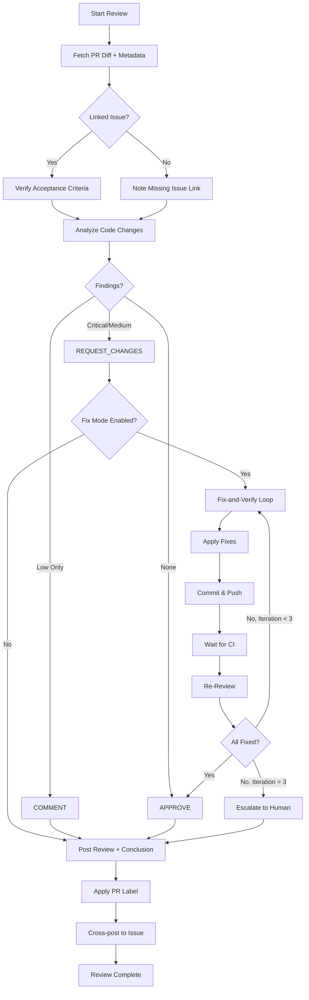

# ai-pr-review

**Description**: AI-powered pull request review with inline comments, severity classification, acceptance criteria verification, and optional fix-and-verify loop

**Category**: Code Quality Assurance / Governance

**Complexity**: High (multi-step review workflow + GitHub API integration)

---

## Purpose

Perform comprehensive AI-powered PR reviews following the governance workflow defined in `governance/AI_PR_Review/`. The skill:

1. Fetches PR diff and metadata
2. Verifies linked issue acceptance criteria (when applicable)
3. Analyzes code for bugs, security issues, performance problems
4. Posts formal GitHub reviews with inline comments
5. Applies appropriate PR labels
6. Optionally enters fix-and-verify loop for REQUEST_CHANGES

---

## Capabilities

### 1. PR Analysis
- **Diff parsing**: Analyze unified diff for code changes
- **Context reading**: Read full source files for deeper understanding
- **Metadata extraction**: PR title, body, linked issues, labels, reviewers

### 2. Code Review Focus Areas
- **Bugs**: Logic errors, off-by-one, null/None handling
- **Security**: Injection, credential leaks, auth bypass, OWASP Top 10
- **Performance**: N+1 queries, unbounded loops, memory leaks
- **Error handling**: Bare except, swallowed exceptions, missing retries
- **Type safety**: API contract violations, missing type hints

### 3. Severity Classification
| Severity | Definition | Review Event |
|:---------|:-----------|:-------------|
| **Critical** | Security vulnerabilities, data loss, crashes | REQUEST_CHANGES |
| **Medium** | Bugs, missing error handling, resource leaks | REQUEST_CHANGES or COMMENT |
| **Low** | Minor improvements, best practices | COMMENT |

### 4. Linked Issue Verification
- Parse PR body for `Closes #N`, `Fixes #N`, `Resolves #N`
- Fetch issue acceptance criteria
- Verify each criterion against PR changes
- Include verification table in review output

### 5. Review Output
- **Formal GitHub Review**: Inline comments in "Files changed" tab
- **Summary Comment**: Visibility in PR conversation
- **Conclusion Comment**: Merge decision with JSON metadata
- **PR Labels**: `ai:review-passed` or `ai:review-failed`
- **Issue Cross-post**: Review record on linked issue (audit trail)

### 6. Fix-and-Verify Loop (On-Demand)
- Checkout PR branch
- Apply fixes to identified findings
- Commit with `Co-Authored-By` attribution
- Push and wait for CI
- Re-review (max 3 iterations)

---

## Review Workflow



---

## Usage Instructions

### Basic PR Review

```
Review PR #<NUMBER> following the AI PR Review workflow.
```

The agent will:
1. Fetch PR diff and metadata using `gh` CLI
2. Analyze code changes
3. Post formal review with inline comments
4. Post conclusion comment
5. Apply `ai:review-passed` or `ai:review-failed` label

### Review with Issue Verification

```
Review PR #<NUMBER> and verify it against linked issue #<ISSUE>.
```

Adds acceptance criteria verification to the review output.

### Review with Fix-and-Verify

```
Review PR #<NUMBER> with fix-and-verify enabled.
```

If REQUEST_CHANGES is posted, the agent will attempt to fix findings and re-review (up to 3 iterations).

### Manual Trigger Example

```bash
# Using gh CLI directly
gh workflow run ai-pr-review.yml \
  --field pr_number=42 \
  --field model=sonnet
```

---

## Severity Tag Format

Inline comments use severity tags in the body:

```markdown
**[Critical]** SQL injection vulnerability in user query.

Suggested fix:
```python
# Use parameterized queries instead of string concatenation
cursor.execute("SELECT * FROM users WHERE id = %s", (user_id,))
```
```

```markdown
**[Medium]** Bare `except` swallows all exceptions including KeyboardInterrupt.

```python
# Replace with specific exception handling
except Exception as e:
    logger.error(f"Operation failed: {e}")
    raise
```
```

```markdown
**[Low]** Consider using `pathlib.Path` instead of `os.path` for path operations.
```

---

## Review Event Decision Tree

```
Has Critical findings?
 YES → REQUEST_CHANGES
 NO
    Has Medium findings?
     YES
       Affects correctness or security?
        YES → REQUEST_CHANGES
        NO (performance/style only) → COMMENT
     NO
        Has Low findings?
         YES → COMMENT
         NO → APPROVE
```

---

## Conclusion Comment Format

```markdown
## Review Conclusion

**Decision**: Approved to merge

| Metric | Value |
|:-------|:------|
| Findings | 0 Critical, 0 Medium, 2 Low |
| Review event | APPROVE |
| Model | claude-sonnet-4-5 |

No blocking issues found. Code changes look correct.

---
_AI Code Review (Claude) | 2026-02-17_

<!-- AI_REVIEW_METADATA {"decision":"approved","model":"claude-sonnet-4-5","pr":42,"repo":"owner/repo","findings":{"critical":0,"medium":0,"low":2},"review_event":"APPROVE","timestamp":"2026-02-17T15:30:00-05:00"} AI_REVIEW_METADATA -->
```

---

## PR Labels

| Label | When Applied | Color |
|:------|:-------------|:------|
| `ai:review-passed` | APPROVE or COMMENT with zero critical/medium | Green |
| `ai:review-failed` | REQUEST_CHANGES | Red |
| `skip-ai-review` | Added by user to bypass automated review | Gray |

Labels are replaced on each review (not accumulated).

---

## Skip Patterns

The following are excluded from code analysis:

**File types**:
- `*.md`, `*.txt`, `*.json`, `*.toml`, `*.yaml`, `*.yml`, `*.lock`
- `*.svg`, `*.png`, `*.jpg`, `*.jpeg`, `*.gif`, `*.ico`
- `*.woff*`, `*.eot`, `*.ttf`

**Directories**:
- `docs/`, `.github/`, `governance/`
- `LICENSE`, `.gitignore`, `.gitmodules`

**Exception**: Include filtered files when performing documentation-specific review.

---

## Tool Access

Required tools:
- `Read`: Read source code files and PR diff
- `Bash`: Execute `gh` CLI commands for GitHub API operations
- `Grep`: Search for patterns in code
- `Glob`: Find relevant source files

Required environment:
- `gh` CLI authenticated to GitHub
- `ANTHROPIC_API_KEY` for Claude API access
- Repository write access for posting reviews

---

## Integration Points

### With code-review Skill
- Uses same severity classification
- Shares analysis patterns for bugs, security, performance
- Complements local code review with PR-level review

### With test-automation Skill
- Verifies CI checks pass before APPROVE
- Identifies uncovered code paths in PR

### With security-audit Skill
- Shares security vulnerability findings
- Coordinates on CRITICAL security issues

### With trace-check Skill
- Verifies traceability from PR to requirements
- Checks acceptance criteria alignment

---

## Governance Integration

### Issue Label Lifecycle
| Review Outcome | Issue Label Action |
|:---------------|:-------------------|
| REQUEST_CHANGES (entering fix loop) | Keep `ai:in-progress` |
| Fix loop complete, APPROVE posted | Apply `ai:review-requested` |
| Human merges PR | (auto) → Done |

### PR Label Lifecycle
| Review Event | PR Label |
|:-------------|:---------|
| APPROVE | `ai:review-passed` |
| COMMENT (low-only) | `ai:review-passed` |
| REQUEST_CHANGES | `ai:review-failed` |

---

## Security Constraints

| Constraint | Detail |
|:-----------|:-------|
| Review authority | AI reviews are **advisory**; human review mandatory |
| Self-review rule | PR author cannot self-review; assign different reviewer |
| Commit attribution | Fix commits include `Co-Authored-By: Claude <noreply@anthropic.com>` |
| Scope containment | Fixes only address identified findings; no unrelated changes |

---

## Limits

| Limit | Value |
|:------|:------|
| Max inline comments per review | 15 |
| Default cost cap per review | $1.00 USD |
| Review timeout | 5 minutes |
| Fix-verify iterations | 3 max |

---

## Configuration

### Repository Secrets
| Secret | Description |
|:-------|:------------|
| `ANTHROPIC_API_KEY` | Anthropic API key for Claude |

### Workflow Inputs
| Input | Default | Description |
|:------|:--------|:------------|
| `model` | `sonnet` | Claude model (sonnet, haiku, opus) |
| `max-budget-usd` | `1.00` | Cost cap per review |

---

## Error Handling

| Scenario | Behavior |
|:---------|:---------|
| Empty or trivial diff | Skip review, exit 0 |
| Inline comments get 422 | Retry with summary-only review |
| Review exceeds budget | Partial review posted |
| Fix loop cap reached | Escalate to human reviewer |
| CI failure after fix | Do not APPROVE; post COMMENT with details |

---

## Related Documents

| Document | Purpose |
|:---------|:--------|
| [README.md](../../../governance/AI_PR_Review/README.md) | System overview |
| [AI_AGENT_REVIEW_WORKFLOW.md](../../../governance/AI_PR_Review/AI_AGENT_REVIEW_WORKFLOW.md) | On-demand review protocol |
| [LOCAL_SETUP.md](../../../governance/AI_PR_Review/LOCAL_SETUP.md) | Local environment setup |
| [ONBOARDING.md](../../../governance/AI_PR_Review/ONBOARDING.md) | Add to new repositories |

---

## Success Criteria

- Zero CRITICAL findings pass undetected
- Review posted within 5 minutes
- Inline comments reference correct line numbers
- Conclusion comment includes valid JSON metadata
- PR labels applied correctly
- Issue cross-post created (when linked issue exists)

---

## Notes

- Automated reviews trigger on `pull_request` events
- Manual reviews invoked via `/ai-pr-review` command or workflow dispatch
- Reviews are advisory; human approval still required
- Fix-verify loop requires explicit enablement

---
> Converted and distributed by [TomeVault](https://tomevault.io/claim/vladm3105) — claim your Tome and manage your conversions.
<!-- tomevault:4.0:skill_md:2026-04-11 -->
