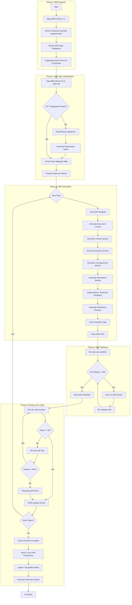
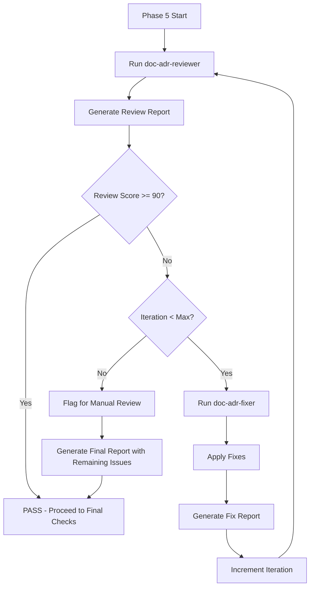
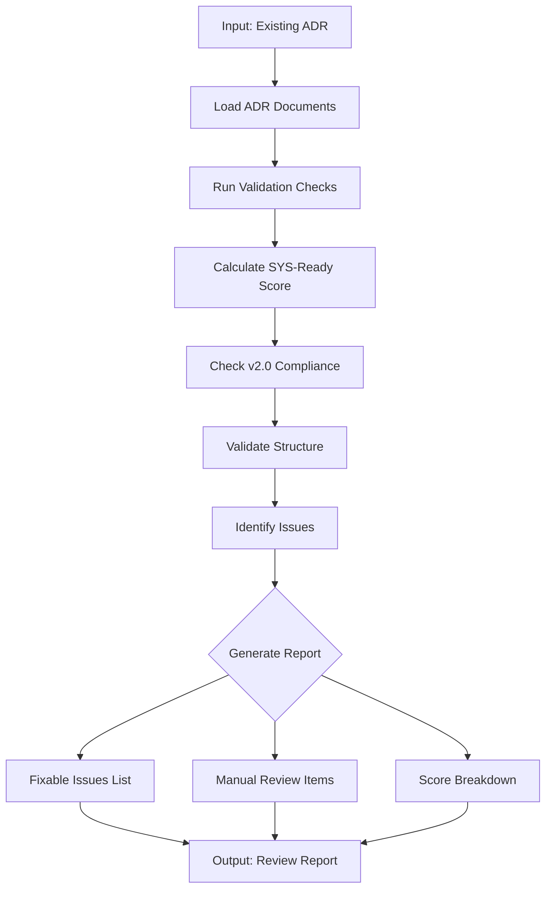
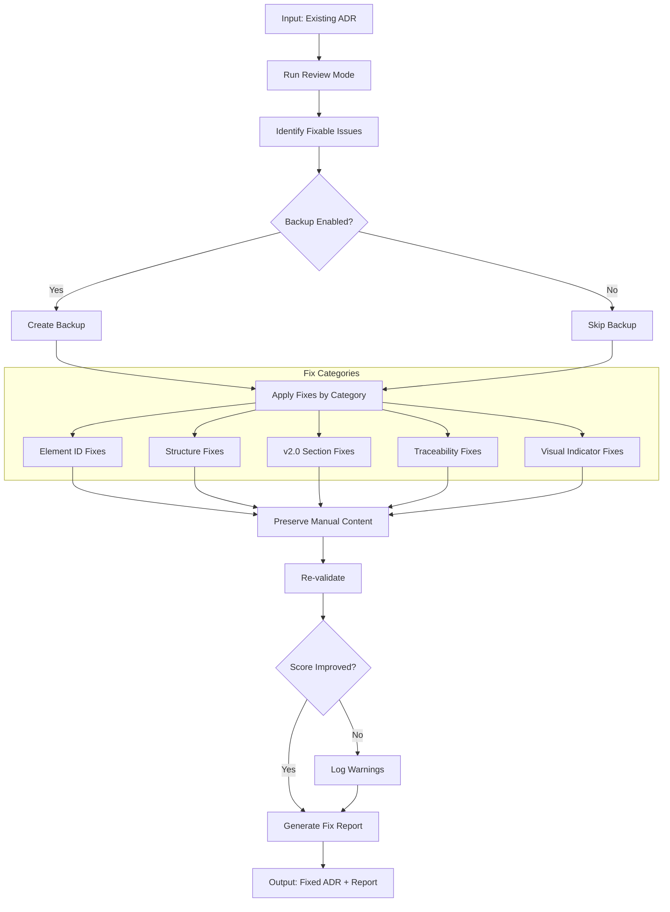

# doc-adr-autopilot

## Purpose

Automated **Architecture Decision Record (ADR)** generation pipeline that processes BRD Section 7.2 Architecture Decision Requirements to generate comprehensive ADRs with Context-Decision-Consequences format, validation, and traceability.

**Layer**: 5 (Architecture Decision Records)

**Upstream**: BRD (Layer 1), PRD (Layer 2), EARS (Layer 3), BDD (Layer 4)

**Downstream Artifacts**: SYS (Layer 6), REQ (Layer 7)

---

## Input Contract (IPLAN-004 Standard)

- Supported modes:
  - `--ref <path>`
  - `--prompt "<text>"`
  - `--iplan <path|IPLAN-NNN>`
- Precedence: `--iplan > --ref > --prompt`
- IPLAN resolution order:
  1. Use explicit file path when it exists
  2. Resolve `work_plans/IPLAN-NNN*.md`
  3. Resolve `governance/plans/IPLAN-NNN*.md`
  4. If multiple matches exist, fail with disambiguation request
- Merge conflict rule:
  - Objective/scope conflicts between primary and supplemental sources are blocking and require user clarification.

---

## Input Contract (IPLAN-004 Standard)

- Supported modes:
  - `--ref <path>`
  - `--prompt "<text>"`
  - `--iplan <path|IPLAN-NNN>`
- Precedence: `--iplan > --ref > --prompt`
- IPLAN resolution order:
  1. Use explicit file path when it exists
  2. Resolve `work_plans/IPLAN-NNN*.md`
  3. Resolve `governance/plans/IPLAN-NNN*.md`
  4. If multiple matches exist, fail with disambiguation request
- Merge conflict rule:
  - Objective/scope conflicts between primary and supplemental sources are blocking and require user clarification.

---

## Skill Dependencies

This autopilot orchestrates the following skills:

| Skill | Purpose | Phase |
|-------|---------|-------|
| `doc-naming` | Element ID format (ADR.NN.xxxx), threshold tags, legacy pattern detection | All Phases |
| `doc-adr` | ADR creation rules, 11-section MVP structure, lifecycle states | Phase 3: ADR Generation |
| `quality-advisor` | Real-time quality feedback during ADR generation | Phase 3: ADR Generation |
| `doc-adr-validator` | Validate ADR structure, content, SYS-Ready score | Phase 4: ADR Validation |
| `doc-adr-reviewer` | Content review, link validation, quality scoring | Phase 5: Review |
| `doc-adr-fixer` | Apply fixes from audit/review report, create missing files | Phase 5: Fix |

**Delegation Principle**: The autopilot orchestrates workflow but delegates:
- ADR structure/content rules -> `doc-adr` skill
- Real-time quality feedback -> `quality-advisor` skill
- ADR validation logic -> `doc-adr-validator` skill
- Content review and scoring -> `doc-adr-reviewer` skill
- Issue resolution and fixes -> `doc-adr-fixer` skill
- Element ID standards -> `doc-naming` skill

---

## Document Type Contract (MANDATORY)

When generating ADR document instances, the autopilot MUST:

1. **Read** `instance_document_type` from template:
   - Source: `ai_dev_ssd_flow/05_ADR/ADR-MVP-TEMPLATE.yaml`
   - Field: `metadata.instance_document_type: "adr-document"`

2. **Set** `document_type` in generated document frontmatter:
   ```yaml
   custom_fields:
     document_type: adr-document    # NOT "template"
     artifact_type: ADR
     layer: 5
   ```

3. **Validation**: Generated documents MUST have `document_type: adr-document`
   - Templates have `document_type: template`
   - Instances have `document_type: adr-document`
   - Schema validates both values

**Error Handling**: If `instance_document_type` is missing from template, default to `adr-document`.

---

## Smart Document Detection

The autopilot automatically determines the action based on the input document type.

### Input Type Recognition (Multiple Upstreams)

ADR can be derived from BRD, PRD, EARS, or BDD. Detection accepts any:

| Input | Detected As | Action |
|-------|-------------|--------|
| `ADR-NN` | Self type | Review existing ADR document |
| `BDD-NN` | Primary upstream | Generate if missing, review if exists |
| `EARS-NN` | Alternative upstream | Generate if missing, review if exists |
| `PRD-NN` | Alternative upstream | Generate if missing, review if exists |
| `BRD-NN` | Alternative upstream | Generate if missing, review if exists |

### Detection Algorithm

```
1. Parse input: Extract TYPE and NN from "{TYPE}-{NN}"
2. Determine action:
   - IF TYPE == "ADR": Review Mode
   - ELSE IF TYPE in ["BDD", "EARS", "PRD", "BRD"]: Generate/Find Mode
   - ELSE: Error (invalid type for this autopilot)
3. For Generate/Find Mode:
   - Check: Does ADR-{NN} exist in docs/05_ADR/?
   - IF exists: Switch to Review Mode for ADR-{NN}
   - ELSE: Proceed with Generation from {TYPE}-{NN}
```

### File Existence Check

```bash
# Check for nested folder structure (mandatory)
ls docs/05_ADR/ADR-{NN}_*/
```

### Examples

```bash
# Review mode (same type - ADR input)
/doc-adr-autopilot ADR-01           # Reviews existing ADR-01

# Generate/Find mode (upstream types)
/doc-adr-autopilot BDD-01           # Generates ADR-01 if missing, or reviews existing ADR-01
/doc-adr-autopilot EARS-01          # Generates ADR-01 if missing, or reviews existing ADR-01
/doc-adr-autopilot PRD-01           # Generates ADR-01 if missing, or reviews existing ADR-01
/doc-adr-autopilot BRD-01           # Generates ADR-01 if missing, or reviews existing ADR-01

# Multiple inputs
/doc-adr-autopilot BDD-01,BDD-02    # Generates/reviews ADR-01 and ADR-02
/doc-adr-autopilot ADR-01,ADR-02    # Reviews ADR-01 and ADR-02
```

### Action Determination Output

```
Input: BDD-01
├── Detected Type: BDD (primary upstream)
├── Expected ADR: ADR-01
├── ADR Exists: Yes → docs/05_ADR/ADR-01_f1_iam/
└── Action: REVIEW MODE - Running doc-adr-reviewer on ADR-01

Input: BRD-05
├── Detected Type: BRD (alternative upstream)
├── Expected ADR: ADR-05
├── ADR Exists: No
└── Action: GENERATE MODE - Creating ADR-05 from BRD-05

Input: ADR-03
├── Detected Type: ADR (self)
└── Action: REVIEW MODE - Running doc-adr-reviewer on ADR-03
```

---

## When to Use This Skill

**Use `doc-adr-autopilot` when**:
- BRD Section 7.2 Architecture Decision Requirements is complete
- Need to generate all 7 mandatory ADR topic categories
- Want automated Context-Decision-Consequences generation
- Ensuring consistent ADR quality across the project
- Automating ADR generation in CI/CD pipelines

**Do NOT use when**:
- Manually creating a single ADR with extensive customization (use `doc-adr` directly)
- BRD Section 7.2 is incomplete or missing ADR topics
- Editing specific ADR sections (use `doc-adr` for guidance)
- Validating existing ADRs only (use `doc-adr-validator`)

---

## Workflow Overview



---

## Detailed Workflow

### Phase 1: BRD Analysis

Analyze BRD Section 7.2 to extract Architecture Decision Requirements.

**Input Sources**:

| Priority | Source | Location | Content Type |
|----------|--------|----------|--------------|
| 1 | BRD Section 7.2 | `docs/01_BRD/BRD-NN_{slug}/` | Architecture Decision Requirements |
| 2 | PRD Section 18 | `docs/02_PRD/PRD-NN_{slug}/` | Architecture Decision Requirements (inherited) |
| 3 | Technology Stack | `docs/05_ADR/ADR-00_technology_stack.md` | Approved technologies |

**Analysis Process**:

```bash
# Locate BRD Section 7.2
find docs/01_BRD/ -name "*.md" -exec grep -l "7.2.*Architecture Decision Requirements" {} \;

# Check for ADR topics in BRD
grep -E "BRD\.[0-9]+\.32\.[0-9]+" docs/01_BRD/BRD-NN_*.md
```

**Required BRD Section 7.2 Structure**:

| Subsection | Element ID Pattern | Content |
|------------|-------------------|---------|
| 7.2.1 Infrastructure | BRD.NN.32.01 | Cloud, compute, networking decisions |
| 7.2.2 Data Architecture | BRD.NN.32.02 | Database, storage, data flow decisions |
| 7.2.3 Integration | BRD.NN.32.03 | API, messaging, integration patterns |
| 7.2.4 Security | BRD.NN.32.04 | Authentication, authorization, encryption |
| 7.2.5 Observability | BRD.NN.32.05 | Logging, monitoring, tracing |
| 7.2.6 AI/ML | BRD.NN.32.06 | ML models, inference, training |
| 7.2.7 Technology Selection | BRD.NN.32.07 | Framework, language, tool choices |

**Output**: ADR topic catalog with business drivers, constraints, and status.

### Phase 1.5: Folder Structure Analysis (NEW in v2.0)

Determine whether ADR should use flat file or nested folder structure.

**Cardinality Detection**:

| BRD Cardinality | ADR Structure | Example |
|-----------------|---------------|---------|
| 1-to-1 (single decision) | Flat file | `ADR-02_Session_Architecture.md` |
| 1-to-many (multiple decisions) | Nested folder | `ADR-01_iam/ADR-01.01_jwt.md`, `ADR-01.02_mfa.md` |

**Nested Folder Structure** (when >2 decisions per topic):

```
docs/05_ADR/
├── ADR-00_Technology_Stack_Foundation.md     # Flat (foundation)
├── ADR-01_iam/                                # Nested folder
│   ├── ADR-01.00_index.md                     # Index file
│   ├── ADR-01.01_jwt_authentication.md
│   ├── ADR-01.02_4d_authorization.md
│   └── ADR-01.03_mfa_integration.md
├── ADR-02_Session_Memory_Architecture.md      # Flat (single topic)
└── ADR-08_trading_intelligence/               # Nested folder
    ├── ADR-08.00_index.md
    ├── ADR-08.01_Agent_Orchestration.md
    └── ADR-08.02_Risk_Management.md
```

**Detection Rules**:
1. Count distinct decisions in BRD Section 7.2.X
2. If >2 decisions → create nested folder with index
3. If ≤2 decisions → create flat file

---

### Phase 2: ADR Topic Identification

Map BRD Section 7.2 topics to ADR documents.

> **Skill Delegation**: Element ID validation follows rules in `doc-naming` skill.
> See: `.claude/skills/doc-naming/SKILL.md` for element type codes.

**BRD to ADR Mapping**:

| BRD Element ID | ADR Document | Topic Category | ADR Element Prefix |
|----------------|--------------|----------------|-------------------|
| BRD.NN.32.01 | ADR-01 | Infrastructure | ADR.01.10.xx |
| BRD.NN.32.02 | ADR-02 | Data Architecture | ADR.02.10.xx |
| BRD.NN.32.03 | ADR-03 | Integration | ADR.03.10.xx |
| BRD.NN.32.04 | ADR-04 | Security | ADR.04.10.xx |
| BRD.NN.32.05 | ADR-05 | Observability | ADR.05.10.xx |
| BRD.NN.32.06 | ADR-06 | AI/ML | ADR.06.10.xx |
| BRD.NN.32.07 | ADR-07 | Technology Selection | ADR.07.10.xx |

**Topic Status Values** (from BRD Section 7.2):

| Status | Meaning | ADR Action |
|--------|---------|------------|
| Selected | Decision made, ready for ADR | Generate full ADR |
| Pending | Under evaluation | Generate ADR with Proposed status |
| N/A | Not applicable to project | Skip or generate minimal ADR with explanation |

**Required BRD Fields per Topic**:

| Field | Required | Description |
|-------|----------|-------------|
| Status | Yes | Selected/Pending/N/A |
| Business Driver | Yes | Why this decision matters |
| Business Constraints | Yes | Limitations affecting decision |
| Alternatives Overview | If Selected | Option comparison table |
| Cloud Provider Comparison | If Selected | GCP/Azure/AWS comparison |

**Topic Prioritization**:

```python
def prioritize_topics(topics: list) -> list:
    """
    Priority order:
    1. Selected topics (ready for full ADR)
    2. Pending topics (ADR with Proposed status)
    3. N/A topics (minimal ADR with explanation)
    """
    return sorted(topics, key=lambda t: (
        0 if t.status == "Selected" else
        1 if t.status == "Pending" else 2
    ))
```

### Phase 3: ADR Generation

Generate ADR documents with Context-Decision-Consequences format.

> **Skill Delegation**: This phase follows rules defined in `doc-adr` skill.
> See: `.claude/skills/doc-adr/SKILL.md` for complete ADR creation guidance.
>
> **Quality Guidance**: Uses `quality-advisor` skill for real-time feedback during generation.
> See: `.claude/skills/quality-advisor/SKILL.md` for quality monitoring.

**Generation Process**:

1. **Reserve ADR ID**:
   ```bash
   # Check for next available ID
   ls docs/05_ADR/ADR-*.md docs/05_ADR/ADR-*/ADR-*.0_*.md 2>/dev/null | \
     grep -oP 'ADR-\K\d+' | sort -n | tail -1
   # Increment for new ADR
   ```

2. **Load ADR Template**:
  - Primary: `ai_dev_ssd_flow/05_ADR/ADR-MVP-TEMPLATE.md`
  - Validation schema: `ai_dev_ssd_flow/05_ADR/ADR_MVP_SCHEMA.yaml`

3. **Generate Document Control Section**:

   | Field | Value |
   |-------|-------|
   | Project Name | From BRD |
   | Document Version | 0.1.0 |
   | Date Created | Current date (YYYY-MM-DD) |
   | Last Updated | Current date (YYYY-MM-DD) |
   | Document Owner | From BRD stakeholder analysis |
   | Prepared By | AI Assistant |
   | Status | Proposed (or Accepted if Selected) |
   | SYS-Ready Score | Calculated after generation |

4. **Generate Context Section (Section 4)**:

   **Section 4.1 Problem Statement** (from BRD):
   - Business Driver (BRD.NN.32.XX Business Driver field)
   - Business Constraints (BRD.NN.32.XX Constraints field)
   - Technical Options Evaluated (from PRD Section 18)
   - Evaluation Criteria (from PRD Section 18)

   **Section 4.2 Background**:
   - Current state description
   - Why decision is needed now
   - Stakeholder concerns

   **Section 4.3 Driving Forces**:
   - Business requirements pushing this decision
   - Technical requirements
   - Regulatory/compliance needs

   **Section 4.4 Constraints**:
   - Budget limitations
   - Timeline constraints
   - Technology restrictions
   - Team skills/capacity

5. **Generate Decision Section (Section 5)**:

   **Section 5.1 Chosen Solution**:
   - Clear statement of what is decided
   - Reference to technology stack (ADR-00)

   **Section 5.2 Key Components**:
   - Components involved in decision
   - Integration points
   - Dependencies

   **Section 5.3 Implementation Approach**:
   - High-level implementation strategy
   - Phasing if applicable
   - Migration considerations

6. **Generate Consequences Section (Section 7)**:

   **Section 7.1 Positive Outcomes**:
   - Benefits of the decision
   - Improvements enabled
   - Risk reductions

   **Section 7.2 Negative Outcomes**:
   - Trade-offs accepted
   - New risks introduced
   - Technical debt implications

7. **Generate Alternatives Section (Section 12)**:

   From BRD Alternatives Overview table:

   | Alternative | Description | Pros | Cons | Fit Score | Why Rejected |
   |-------------|-------------|------|------|-----------|--------------|
   | Option A | ... | ... | ... | Better | Selected |
   | Option B | ... | ... | ... | Good | Cost concerns |
   | Option C | ... | ... | ... | Poor | Scalability limits |

8. **Real-Time Quality Feedback** (via `quality-advisor` skill):
   - Monitor section completion as content is generated
   - Detect anti-patterns (AP-001 to AP-017) during creation
   - Validate element ID format compliance (ADR.NN.xxxx)
   - Check for placeholder text ([TBD], TODO, XXX)
   - Verify Mermaid diagram presence (required for ADR)
   - Flag issues early to reduce post-generation rework

9. **Generate Remaining Sections**:
   - Section 6: Requirements Satisfied (link to BRD/PRD)
   - **Section 7: MVP/Next Cycle Scope** (NEW in v2.0)
   - Section 8: Architecture Flow (Mermaid diagram REQUIRED)
   - Section 9: Implementation Assessment (complexity, dependencies)
   - Section 10: Impact Analysis
   - **Section 11: Risk Thresholds** (NEW in v2.0)
   - Section 12: Verification Approach
   - Section 13: Security Considerations
   - **Section 14: Circuit Breaker Recovery** (if applicable, NEW in v2.0)
   - Section 15: Related Decisions
   - Section 16: Implementation Notes
   - Section 17: Traceability
   - Section 18: References

10. **Generate MVP/Next Cycle Scope Section** (Section 7 - NEW in v2.0):

    ```markdown
    ### 7.1 MVP Scope (Phase 1)

    - Coordinator with basic intent classification
    - Risk Agent with position size circuit breaker
    - Execution Agent with IB order submission

    ### 7.2 Next Cycle Scope

    - Full multi-agent orchestration
    - All 7 circuit breakers active
    - Machine learning optimization
    ```

    **Validation**: Cross-check with parent PRD MVP scope for consistency.

11. **Generate Risk Thresholds Section** (Section 11 - NEW in v2.0):

    **Table 1: Risk Assessment**:
    ```markdown
    | Risk | Probability | Impact | Mitigation |
    |------|-------------|--------|------------|
    | Coordinator overload | Medium | High | Queue management, rate limiting |
    | Database unavailable | Low | Critical | Redis fallback, circuit breaker |
    ```

    **Table 2: Risk Thresholds** (quantified parameters):
    ```markdown
    | Parameter | Value | Description |
    |-----------|-------|-------------|
    | `max_concurrent_requests` | 100 | Maximum simultaneous requests |
    | `queue_max_size` | 500 | Maximum pending requests |
    | `backpressure_threshold` | 80% | Queue utilization trigger |
    ```

12. **Generate Circuit Breaker Recovery Section** (Section 14 - if applicable, NEW in v2.0):

    Only include if ADR mentions circuit breakers, rate limits, or control mechanisms.

    **Table 1: Circuit Breaker Definitions**:
    ```markdown
    | Circuit Breaker | Trigger | Action | Recovery |
    |-----------------|---------|--------|----------|
    | CB-01: Rate Limit | >100 req/min | Block requests | Auto-reset after 1 min |
    | CB-02: Error Rate | >5% errors | Degrade service | Manual reset |
    ```

    **Table 2: Reset Procedures**:
    ```markdown
    | Circuit Breaker | Authorization Level | Required Documentation | Cooldown Period |
    |-----------------|---------------------|------------------------|-----------------|
    | CB-01 (Rate Limit) | Auto | None | 60 seconds |
    | CB-02 (Error Rate) | Operator | Incident review | 15 minutes |
    ```

10. **Add Cumulative Tags (Section 16)**:

    **Layer 5 Required Tags**:
    ```markdown
    @brd: BRD.NN.32.XX
    @prd: PRD.NN.18.XX
    @ears: EARS.NN.25.XX
    @bdd: BDD.NN.14.XX
    ```

11. **File Output** (ALWAYS use nested folder):
    - **Monolithic** (<20k tokens): `docs/05_ADR/ADR-NN_{slug}/ADR-NN_{slug}.md`
    - **Sectioned** (≥20k tokens): `docs/05_ADR/ADR-NN_{slug}/ADR-NN.0_index.md`, `ADR-NN.1_core.md`, etc.
    - **Master Index** (always): `docs/05_ADR/ADR-00_index.md` (create or update)

    **Nested Folder Rule**: ALL ADRs use nested folders (`ADR-NN_{slug}/`) regardless of size. This keeps companion files (review reports, fix reports, drift cache) organized with their parent document.

**Element ID Format** (per `doc-naming` skill):

| Element Type | Code | Example |
|--------------|------|---------|
| Decision | 10 | ADR.02.1001 |
| Alternative | 12 | ADR.02.1201 |
| Consequence | 13 | ADR.02.1301 |

### Phase 4: ADR Validation

After ADR generation, validate structure and SYS-Ready score.

> **Skill Delegation**: This phase uses validation rules from `doc-adr-validator` skill.
> See: `.claude/skills/doc-adr-validator/SKILL.md` for complete validation rules.

**Validation Command**:

```bash
python ai_dev_ssd_flow/05_ADR/scripts/validate_adr.py docs/05_ADR/ADR-NN_{slug}.md --verbose
```

**Validation Checks** (8 Total):

| Check | Type | Description |
|-------|------|-------------|
| CHECK 1 | Error | Required Document Control Fields (7 fields) |
| CHECK 2 | Error | ADR Structure Completeness (required sections) |
| CHECK 3 | Error | SYS-Ready Score Validation (format, threshold) |
| CHECK 4 | Error | Upstream Traceability Tags (@brd, @prd, @ears, @bdd) |
| CHECK 5 | Warning | Decision Quality Assessment |
| CHECK 6 | Warning | Architecture Documentation (Mermaid diagrams) |
| CHECK 7 | Warning | Implementation Readiness |
| CHECK 8 | Error | Element ID Format Compliance (unified 3-segment) |

**SYS-Ready Scoring Criteria (100%)**:

| Category | Weight | Criteria |
|----------|--------|----------|
| Decision Completeness | 30% | Context/Decision/Consequences/Alternatives documented |
| Architecture Clarity | 35% | Mermaid diagrams (REQUIRED), component responsibilities |
| Implementation Readiness | 20% | Complexity assessment, dependencies, rollback strategies |
| Verification Approach | 15% | Testing strategy, success metrics, operational readiness |

**Minimum Score**: 90%

**Auto-Fix Actions**:

| Issue | Auto-Fix Action |
|-------|-----------------|
| Invalid element ID format | Convert to ADR.NN.xxxx format |
| Missing traceability section | Insert from template |
| Missing Document Control fields | Add placeholder fields |
| Legacy patterns (DEC-XXX, ALT-XXX, CON-XXX) | Convert to unified format |
| Missing SYS-Ready Score | Calculate and insert |
| Missing Mermaid diagram | Insert template diagram |

**Validation Loop**:

```
LOOP (max 3 iterations):
  1. Run doc-adr-validator
  2. IF errors found: Apply auto-fixes
  3. IF warnings found: Review and address if critical
  4. IF SYS-Ready Score < 90%: Enhance sections
  5. IF clean: Mark VALIDATED, proceed
  6. IF max iterations: Log issues, flag for manual review
```

### Phase 5: Review & Fix Cycle (v2.1)

Iterative review and fix cycle to ensure ADR quality before completion.



#### 5.1 Initial Review

Run `doc-adr-reviewer` to identify issues.

```bash
/doc-adr-reviewer ADR-NN
```

**Output**: `ADR-NN.A_audit_report_v001.md` (legacy-compatible reviewer report may still exist)

#### 5.2 Fix Cycle

If review score < 90%, invoke `doc-adr-fixer`.

```bash
/doc-adr-fixer ADR-NN --revalidate
```

**Fix Categories**:

| Category | Fixes Applied |
|----------|---------------|
| Missing Files | Create glossary, reference docs |
| Broken Links | Update paths, create targets |
| Element IDs | Convert legacy patterns (DEC-XXX, ALT-XXX, CON-XXX), fix invalid type codes |
| Content | Replace template placeholders, update dates |
| References | Update traceability tags |
| Diagrams | Add missing Mermaid diagrams |

**Output**: `ADR-NN.F_fix_report_v001.md`

#### 5.3 Re-Review

After fixes, automatically re-run reviewer.

```bash
/doc-adr-reviewer ADR-NN
```

**Output**: `ADR-NN.A_audit_report_v002.md`

#### 5.4 Iteration Control

| Parameter | Default | Description |
|-----------|---------|-------------|
| `max_iterations` | 3 | Maximum fix-review cycles |
| `target_score` | 90 | Minimum passing score |
| `stop_on_manual` | false | Stop if only manual issues remain |

**Iteration Example**:

```
Iteration 1:
  Review v001: Score 85 (2 errors, 4 warnings)
  Fix v001: Fixed 5 issues, added 1 diagram

Iteration 2:
  Review v002: Score 94 (0 errors, 2 warnings)
  Status: PASS (score >= 90)
```

#### 5.5 Quality Checks (Post-Fix)

After passing the fix cycle:

1. **All ADRs Complete**:
   - All 7 mandatory topic categories addressed
   - Each ADR has SYS-Ready score >= 90%
   - No placeholder text remaining

2. **Cross-ADR Consistency**:
   - No conflicting decisions between ADRs
   - Technology choices align with ADR-00 stack
   - Dependencies between ADRs documented

3. **Traceability Matrix Update**:
   ```bash
   # Update ADR-00_TRACEABILITY_MATRIX.md
  python ai_dev_ssd_flow/scripts/update_traceability_matrix.py \
     --type ADR \
     --matrix docs/05_ADR/ADR-00_TRACEABILITY_MATRIX.md
   ```

4. **SYS-Ready Report**:
   ```
   SYS-Ready Score Breakdown
   =========================
   Decision Completeness:      30/30 (Context/Decision/Consequences)
   Architecture Clarity:       33/35 (Mermaid diagrams present)
   Implementation Readiness:   19/20 (Complexity assessment)
   Verification Approach:      14/15 (Testing strategy)
   ----------------------------
   Total SYS-Ready Score:      96/100 (Target: >= 90)
   Status: READY FOR SYS GENERATION
   ```

5. **Summary Report Generation**:
   ```
   ADR Generation Summary
   ======================
   Total ADRs Generated: 7

   Status Distribution:
     Accepted: 5
     Proposed: 2
     N/A: 0

   SYS-Ready Scores:
     ADR-01 (Infrastructure):     95%
     ADR-02 (Data Architecture):  92%
     ADR-03 (Integration):        94%
     ADR-04 (Security):           96%
     ADR-05 (Observability):      91%
     ADR-06 (AI/ML):              90%
     ADR-07 (Technology):         93%

   Average SYS-Ready Score: 93%

   Next Steps:
     1. Review Proposed ADRs for stakeholder approval
     2. Run doc-sys-autopilot to generate SYS from ADRs
   ```

---

## Execution Modes

### Single ADR Mode

Generate one ADR from a specific BRD topic.

```bash
# Example: Generate ADR-01 from Infrastructure topic
/doc-adr-autopilot BRD.01.3201

# Output:
# Analyzing BRD.01.3201 (Infrastructure)...
# Status: Selected
# Generating ADR-01_infrastructure.md...
# SYS-Ready Score: 94%
# Complete.
```

### Batch Mode (All 7 Topics)

Generate all ADRs from BRD Section 7.2.

```bash
# Example: Generate all ADRs from BRD-01
/doc-adr-autopilot BRD-01 --all-topics

# Output:
# Scanning BRD-01 Section 7.2...
# Found 7 ADR topics:
#   BRD.01.3201 (Infrastructure) - Selected
#   BRD.01.3202 (Data Architecture) - Selected
#   BRD.01.3203 (Integration) - Selected
#   BRD.01.3204 (Security) - Selected
#   BRD.01.3205 (Observability) - Pending
#   BRD.01.3206 (AI/ML) - Pending
#   BRD.01.3207 (Technology) - Selected
#
# Generating ADRs...
# [================>          ] 5/7 Complete
```

### Dry Run Mode

Preview ADR generation plan without creating files.

```bash
/doc-adr-autopilot BRD-01 --dry-run

# Output:
# ADR Generation Plan (Dry Run)
# ============================
# Source: BRD-01 Section 7.2
#
# Planned ADRs:
# 1. ADR-01 (Infrastructure) - Full generation
# 2. ADR-02 (Data Architecture) - Full generation
# 3. ADR-03 (Integration) - Full generation
# 4. ADR-04 (Security) - Full generation
# 5. ADR-05 (Observability) - Proposed status
# 6. ADR-06 (AI/ML) - Proposed status
# 7. ADR-07 (Technology) - Full generation
#
# No files will be created in dry-run mode.
```

### Review Mode (v2.1)

Validate existing ADR documents and generate a quality report without modification.

**Purpose**: Audit existing ADR documents for compliance, quality scores, and identify issues.

**Command**:

```bash
# Review single ADR
/doc-adr-autopilot ADR-01

# Review all ADRs
/doc-adr-autopilot ADR-ALL --mode review --output-report tmp/adr_review_report.md
```

**Review Process**:



**Review Report Structure**:

```markdown
# ADR Review Report: ADR-01_infrastructure

## Summary
- **SYS-Ready Score**: 87% 🟡
- **Total Issues**: 11
- **Auto-Fixable**: 7
- **Manual Review**: 4

## Score Breakdown
| Category | Score | Status |
|----------|-------|--------|
| Decision Completeness | 27/30 | 🟡 |
| Architecture Clarity | 32/35 | 🟡 |
| Implementation Readiness | 18/20 | ✅ |
| Verification Approach | 12/15 | 🟡 |

## v2.0 Compliance
| Check | Status | Details |
|-------|--------|---------|
| Folder Structure | ✅ | Nested structure used correctly |
| Visual Score Indicator | ❌ | Missing emoji indicator |
| Risk Thresholds Table | ❌ | Section 11 missing quantified parameters |
| Circuit Breaker Recovery | 🟡 | CB mentioned but no recovery table |
| MVP/Next Cycle Scope | ✅ | Section 7 present |
| Traceability Format | 🟡 | 2 tags missing hierarchical format |
| Index File | ✅ | ADR-01.00_index.md present |

## Structure Validation
| Section | Present | Status |
|---------|---------|--------|
| Context | ✅ | Complete |
| Decision | ✅ | Complete |
| Consequences | ✅ | Complete |
| Alternatives | 🟡 | Missing "Why Rejected" column |
| Architecture Flow | ❌ | Mermaid diagram missing |

## Auto-Fixable Issues
| # | Issue | Location | Fix Action |
|---|-------|----------|------------|
| 1 | Missing visual indicator | Document Control | Add ✅/🟡/❌ to SYS-Ready Score |
| 2 | Legacy element ID | Section 5:L45 | Convert DEC-001 to ADR.01.1001 |
| 3 | Missing traceability tag | Section 17 | Add @bdd tag |
| ... | ... | ... | ... |

## Manual Review Required
| # | Issue | Location | Reason |
|---|-------|----------|--------|
| 1 | Incomplete context | Section 4.2:L78 | Domain knowledge needed |
| 2 | Missing Mermaid diagram | Section 8 | Architecture decision required |
| ... | ... | ... | ... |

## Recommendations
1. Run fix mode to address 7 auto-fixable issues
2. Add Mermaid architecture diagram
3. Complete Risk Thresholds table (Section 11)
4. Add Circuit Breaker Recovery table if applicable
```

**Review Configuration**:

```yaml
review_mode:
  enabled: true
  checks:
    - structure_validation      # Document control, required sections
    - element_id_compliance     # ADR.NN.xxxx format
    - mermaid_diagrams          # Architecture flow presence
    - v2_compliance             # New v2.0 sections
    - cumulative_tags           # 4 upstream tags
    - score_calculation         # SYS-Ready score
    - folder_structure          # Nested vs flat
  output:
    format: markdown           # markdown, json, html
    include_line_numbers: true
    include_fix_suggestions: true
  thresholds:
    pass: 90
    warning: 85
    fail: 0
```

### Fix Mode (v2.1)

Auto-repair existing ADR documents while preserving manual content.

**Purpose**: Apply automated fixes to ADR documents to improve quality scores and compliance.

**Command**:

```bash
# Fix single ADR
/doc-adr-autopilot ADR-01 --mode fix

# Fix with backup
/doc-adr-autopilot ADR-01 --mode fix --backup

# Fix specific issue types only
/doc-adr-autopilot ADR-01 --mode fix --fix-types "element_ids,tags,v2_sections"

# Dry-run fix (preview changes)
/doc-adr-autopilot ADR-01 --mode fix --dry-run
```

**Fix Process**:



**Fix Categories and Actions**:

| Category | Issue | Auto-Fix Action | Preserves Content |
|----------|-------|-----------------|-------------------|
| **Element IDs** | Legacy DEC-XXX format | Convert to ADR.NN.10.SS | ✅ |
| **Element IDs** | Legacy ALT-XXX format | Convert to ADR.NN.12.SS | ✅ |
| **Element IDs** | Legacy CON-XXX format | Convert to ADR.NN.13.SS | ✅ |
| **Structure** | Missing Document Control fields | Add from template | ✅ |
| **Structure** | Missing traceability section | Insert from template | ✅ |
| **Structure** | Missing SYS-Ready Score | Calculate and insert | ✅ |
| **v2.0 Sections** | Missing visual indicator | Add ✅/🟡/❌ based on score | ✅ |
| **v2.0 Sections** | Missing Risk Thresholds | Add template table | ✅ |
| **v2.0 Sections** | Missing MVP Scope | Add Section 7 template | ✅ |
| **v2.0 Sections** | Missing CB Recovery | Add template if CB mentioned | ✅ |
| **Traceability** | Missing cumulative tags | Add with placeholder references | ✅ |
| **Traceability** | Non-hierarchical format | Convert to BRD.NN.xxxx format | ✅ |
| **Diagrams** | Missing Mermaid | Insert template diagram | ✅ |

**Content Preservation Rules**:

1. **Never delete** existing decision content
2. **Never modify** Context section text
3. **Never change** Alternatives evaluation
4. **Only add** missing sections and metadata
5. **Only replace** legacy element IDs
6. **Backup first** if `--backup` flag is set

**Fix Report Structure**:

```markdown
# ADR Fix Report: ADR-01_infrastructure

## Summary
- **Before SYS-Ready Score**: 87% 🟡
- **After SYS-Ready Score**: 94% ✅
- **Issues Fixed**: 7
- **Issues Remaining**: 4 (manual review required)

## Fixes Applied
| # | Issue | Location | Fix Applied |
|---|-------|----------|-------------|
| 1 | Legacy element ID | Section 5:L45 | Converted DEC-001 → ADR.01.1001 |
| 2 | Missing visual indicator | Document Control | Added ✅ 94% (Target: ≥90%) |
| 3 | Missing @bdd tag | Section 17 | Added @bdd: BDD.01.1401 |
| 4 | Missing Risk Thresholds | Section 11 | Added template table |
| ... | ... | ... | ... |

## Files Modified
- docs/05_ADR/ADR-01_infrastructure/ADR-01.00_index.md
- docs/05_ADR/ADR-01_infrastructure/ADR-01.1_context.md
- docs/05_ADR/ADR-01_infrastructure/ADR-01.5_decision.md

## Backup Location
- tmp/backup/ADR-01_infrastructure_20260209_143022/

## Remaining Issues (Manual Review)
| # | Issue | Location | Reason |
|---|-------|----------|--------|
| 1 | Incomplete context | Section 4.2:L78 | Domain knowledge needed |
| 2 | Missing Mermaid diagram | Section 8 | Architecture decision required |
| ... | ... | ... | ... |

## Score Breakdown Impact
| Category | Before | After | Delta |
|----------|--------|-------|-------|
| Decision Completeness | 27/30 | 29/30 | +2 |
| Architecture Clarity | 32/35 | 33/35 | +1 |
| Implementation Readiness | 18/20 | 19/20 | +1 |
| Verification Approach | 12/15 | 13/15 | +1 |

## Next Steps
1. Add Mermaid architecture diagram to Section 8
2. Review and complete context in Section 4.2
3. Re-run validation to confirm score
4. Commit changes if satisfied
```

**Fix Configuration**:

```yaml
fix_mode:
  enabled: true
  backup:
    enabled: true
    location: "tmp/backup/"
    retention_days: 7

  fix_categories:
    element_ids: true        # Legacy ID conversion
    structure: true          # Document sections
    v2_sections: true        # New v2.0 sections
    traceability: true       # Cumulative tags
    visual_indicators: true  # Score emoji indicators
    mermaid: false           # Diagram insertion (risky)

  preservation:
    context_section: true    # Never modify context
    decision_section: true   # Never modify decision
    alternatives: true       # Never modify evaluation
    comments: true           # Preserve user comments

  validation:
    re_validate_after_fix: true
    require_score_improvement: false
    max_fix_iterations: 3

  element_id_migration:
    DEC_XXX_to_ADR_NN_10_SS: true   # DEC-001 → ADR.01.1001
    ALT_XXX_to_ADR_NN_12_SS: true   # ALT-001 → ADR.01.1201
    CON_XXX_to_ADR_NN_13_SS: true   # CON-001 → ADR.01.1301
```

**Command Line Options (Review/Fix)**:

| Option | Mode | Default | Description |
|--------|------|---------|-------------|
| `--mode review` | Review | - | Run review mode only |
| `--mode fix` | Fix | - | Run fix mode |
| `--output-report` | Both | auto | Report output path |
| `--backup` | Fix | true | Create backup before fixing |
| `--fix-types` | Fix | all | Comma-separated fix categories |
| `--dry-run` | Fix | false | Preview fixes without applying |
| `--preserve-all` | Fix | false | Extra cautious preservation |
| `--min-score-gain` | Fix | 0 | Minimum score improvement required |

---

## Output Artifacts

### Generated Files

**All ADRs use nested folders** (`ADR-NN_{slug}/`) regardless of size. Document sectioning (monolithic vs sectioned) depends only on document size (>20k tokens = sectioned).

| File | Purpose | Location |
|------|---------|----------|
| ADR-NN_{slug}/ | ADR folder (ALWAYS created) | `docs/05_ADR/` |
| ADR-NN_{slug}.md | Main ADR document (monolithic <20k tokens) | `docs/05_ADR/ADR-NN_{slug}/` |
| ADR-NN.0_index.md | Section index (sectioned ≥20k tokens) | `docs/05_ADR/ADR-NN_{slug}/` |
| ADR-NN.S_{section}.md | Section files (sectioned ≥20k tokens) | `docs/05_ADR/ADR-NN_{slug}/` |
| ADR-NN.A_audit_report_v{VVV}.md | Combined audit report (preferred) | `docs/05_ADR/ADR-NN_{slug}/` |
| ADR-NN.R_review_report_v{VVV}.md | Reviewer report (legacy-compatible) | `docs/05_ADR/ADR-NN_{slug}/` |
| ADR-NN.F_fix_report_v{VVV}.md | Fix report | `docs/05_ADR/ADR-NN_{slug}/` |
| .drift_cache.json | Drift detection cache | `docs/05_ADR/ADR-NN_{slug}/` |

### Validation Reports

| Report | Purpose | Location |
|--------|---------|----------|
| adr_validation_report.json | Validation results | `tmp/` |
| sys_ready_scores.json | SYS-Ready breakdown | `tmp/` |
| adr_autopilot_log.md | Execution log | `tmp/` |

---

## Error Handling

### Error Categories

| Category | Handling | Example |
|----------|----------|---------|
| BRD Section 7.2 Missing | Abort with message | No Architecture Decision Requirements found |
| Topic Status Invalid | Flag for manual review | Status not Selected/Pending/N/A |
| Validation Failure | Auto-fix, retry | Missing required section |
| SYS-Ready Below 90% | Enhance sections, retry | Score at 85% |
| Max Retries Exceeded | Flag for manual review | Persistent validation errors |

### Recovery Actions

```python
def handle_error(error_type: str, context: dict) -> Action:
    match error_type:
        case "BRD_SECTION_MISSING":
            return Action.ABORT_WITH_MESSAGE
        case "TOPIC_STATUS_INVALID":
            return Action.FLAG_MANUAL_REVIEW
        case "VALIDATION_FAILURE":
            if context["retry_count"] < 3:
                return Action.AUTO_FIX_RETRY
            return Action.FLAG_MANUAL_REVIEW
        case "SYS_READY_LOW":
            return Action.ENHANCE_SECTIONS
        case _:
            return Action.FLAG_MANUAL_REVIEW
```

---

## Configuration

### Default Configuration

```yaml
# config/adr_autopilot.yaml
adr_autopilot:
  version: "1.0"

  scoring:
    sys_ready_min: 90
    strict_mode: false

  execution:
    max_parallel: 3        # HARD LIMIT - do not exceed
    chunk_size: 3          # Documents per chunk
    pause_between_chunks: true
    auto_fix: true
    continue_on_error: false
    timeout_per_topic: 180  # seconds

  output:
    structure: auto  # auto, monolithic, sectioned
    size_threshold_kb: 25
    report_format: markdown

  validation:
    skip_validation: false
    fix_iterations_max: 3
    require_mermaid: true

  topics:
    generate_all: true
    skip_na_topics: false
```

### Command Line Options

| Option | Default | Description |
|--------|---------|-------------|
| `--min-sys-ready` | 90 | Minimum SYS-Ready score |
| `--no-auto-fix` | false | Disable auto-fix (manual only) |
| `--continue-on-error` | false | Continue if one topic fails |
| `--dry-run` | false | Preview execution plan only |
| `--output-format` | auto | Force monolithic or sectioned output |
| `--skip-na` | false | Skip N/A topics entirely |

---

## Context Management

### Chunked Parallel Execution (MANDATORY)

**CRITICAL**: To prevent conversation context overflow errors ("Prompt is too long", "Conversation too long"), all autopilot operations MUST follow chunked execution rules:

**Chunk Size Limit**: Maximum 3 documents per chunk

**Chunking Rules**:

1. **Chunk Formation**: Group ADR topics into chunks of maximum 3 at a time
2. **Sequential Chunk Processing**: Process one chunk at a time, completing all ADRs in a chunk before starting the next
3. **Context Pause**: After completing each chunk, provide a summary and pause for user acknowledgment
4. **Progress Tracking**: Display chunk progress (e.g., "Chunk 2/3: Processing ADR-04, ADR-05, ADR-06")

**Execution Pattern**:

```text
ADR Topics: ADR-01, ADR-02, ADR-03, ADR-04, ADR-05, ADR-06, ADR-07

Chunk 1: [ADR-01, ADR-02, ADR-03] → Process → Summary → Pause
Chunk 2: [ADR-04, ADR-05, ADR-06] → Process → Summary → Pause
Chunk 3: [ADR-07]                  → Process → Summary → Complete
```

**Chunk Completion Summary Template**:

```text
Chunk N/M Complete:
├── Generated: ADR-01, ADR-02, ADR-03
├── SYS-Ready Scores: 94%, 92%, 91%
├── Status: All validated
└── Next: Continue with Chunk N+1? [Y/n]
```

**Why Chunking is Required**:

- Prevents "Conversation too long" errors during batch processing
- Allows context compaction between chunks
- Enables recovery from failures without losing all progress
- Provides natural checkpoints for user review

---

## Integration Points

### Pre-Execution Hooks

```bash
# Hook: pre_adr_generation
# Runs before ADR generation starts
./hooks/pre_adr_generation.sh

# Example: Verify BRD Section 7.2 exists
grep -q "7.2.*Architecture Decision Requirements" docs/01_BRD/BRD-*.md || {
  echo "ERROR: BRD Section 7.2 required"
  exit 1
}
```

### Post-Execution Hooks

```bash
# Hook: post_adr_generation
# Runs after ADR generation completes
./hooks/post_adr_generation.sh

# Example: Trigger SYS autopilot for validated ADRs
if [ "$ALL_ADRS_VALIDATED" = "true" ]; then
  echo "Invoke downstream workflow: /doc-sys-autopilot ADR-ALL"
fi
```

### CI/CD Integration

```yaml
# .github/workflows/adr_autopilot.yml
name: ADR Autopilot

on:
  push:
    paths:
      - 'docs/01_BRD/**/BRD-*.md'

jobs:
  generate-adr:
    runs-on: ubuntu-latest
    steps:
      - uses: actions/checkout@v4

      - name: Run ADR Autopilot
        run: |
          echo "/doc-adr-autopilot BRD-01 --all-topics --validate"

      - name: Upload Validation Report
        uses: actions/upload-artifact@v4
        with:
          name: adr-validation
          path: tmp/adr_validation_report.json
```

---

## Quality Gates

### Phase Gates

| Phase | Gate | Criteria |
|-------|------|----------|
| Phase 1 | BRD Gate | BRD Section 7.2 exists with ADR topics |
| Phase 2 | Topic Gate | All 7 categories identified |
| Phase 3 | Generation Gate | All sections generated per topic |
| Phase 4 | Validation Gate | SYS-Ready Score >= 90% |
| Phase 5 | Review Gate | No blocking issues remaining |

### Blocking vs Non-Blocking

| Issue Type | Blocking | Action |
|------------|----------|--------|
| Missing Context section | Yes | Must fix before proceeding |
| Missing Decision section | Yes | Must fix before proceeding |
| SYS-Ready Score < 90% | Yes | Must enhance sections |
| Invalid element ID format | Yes | Must convert to unified format |
| Missing Mermaid diagram | Yes | Must add architecture flow |
| Missing optional section | No | Log warning, continue |
| Style/formatting issues | No | Auto-fix, continue |

---

## Related Resources

- **ADR Creation Skill**: `.claude/skills/doc-adr/SKILL.md`
- **ADR Validator Skill**: `.claude/skills/doc-adr-validator/SKILL.md`
- **Quality Advisor Skill**: `.claude/skills/quality-advisor/SKILL.md`
- **Naming Standards Skill**: `.claude/skills/doc-naming/SKILL.md`
- **ADR Template**: `ai_dev_ssd_flow/05_ADR/ADR-MVP-TEMPLATE.md`
- **ADR Creation Rules**: `ai_dev_ssd_flow/05_ADR/ADR-MVP-TEMPLATE.md`
- **ADR Validation Rules**: `ai_dev_ssd_flow/05_ADR/ADR_MVP_SCHEMA.yaml`
- **Technology Stack**: `docs/05_ADR/ADR-00_technology_stack.md`
- **BRD Autopilot Skill**: `.claude/skills/doc-brd-autopilot/SKILL.md`
- **PRD Autopilot Skill**: `.claude/skills/doc-prd-autopilot/SKILL.md`

---

## Quick Reference

| Input | Output | Key Metric |
|-------|--------|------------|
| BRD Section 7.2 | ADR-01 to ADR-07 | SYS-Ready >= 90% |

**Usage**:
```
/doc-adr-autopilot <BRD-ID> [OPTIONS]
```

**Common Commands**:
```bash
# Generate all ADRs from BRD-01
/doc-adr-autopilot BRD-01 --all-topics

# Generate single ADR from specific topic
/doc-adr-autopilot BRD.01.3201

# Preview only
/doc-adr-autopilot BRD-01 --dry-run

# Resume after failure
/doc-adr-autopilot resume
```

**BRD Section 7.2 to ADR Mapping**:

| BRD Element | ADR | Topic |
|-------------|-----|-------|
| BRD.NN.32.01 | ADR-01 | Infrastructure |
| BRD.NN.32.02 | ADR-02 | Data Architecture |
| BRD.NN.32.03 | ADR-03 | Integration |
| BRD.NN.32.04 | ADR-04 | Security |
| BRD.NN.32.05 | ADR-05 | Observability |
| BRD.NN.32.06 | ADR-06 | AI/ML |
| BRD.NN.32.07 | ADR-07 | Technology Selection |

---

## Validation Rules (v2.0)

| Check | Requirement | Error Code |
|-------|-------------|------------|
| Folder Structure | Nested for >2 decisions per topic | ADR-E030 |
| Visual Score | Emoji indicator (✅/🟡/❌) present | ADR-E031 |
| Risk Thresholds | Quantified parameter table in Section 11 | ADR-E032 |
| Circuit Breaker | Recovery table if CB mentioned | ADR-E033 |
| MVP Scope | Section 7.1/7.2 present | ADR-E034 |
| Traceability Format | Hierarchical dot notation (@brd:BRD.NN.xxxx) | ADR-E035 |
| Index File | ADR-NN.00_index.md for nested folders | ADR-E036 |

---

## SYS-Ready Score Display (v2.0)

**Visual Status Indicators**:

```markdown
| **SYS-Ready Score** | ✅ 92% (Target: ≥90%) |  # Passing
| **SYS-Ready Score** | 🟡 87% (Target: ≥90%) |  # Near threshold
| **SYS-Ready Score** | ❌ 75% (Target: ≥90%) |  # Failing
```

---

## Review Document Standards (v2.2)

**IMPORTANT**: Review reports generated by this autopilot are formal project documents.

See: `.claude/skills/REVIEW_DOCUMENT_STANDARDS.md` for complete standards.

### Quick Reference

| Requirement | Value |
|-------------|-------|
| Storage Location | Same folder as reviewed ADR |
| File Name | `ADR-NN.A_audit_report_vNNN.md` (preferred), `ADR-NN.R_review_report_vNNN.md` (legacy) |
| YAML Frontmatter | MANDATORY - see shared standards |
| Parent Reference | MANDATORY - link to ADR document |

**Example Location**:

```
docs/05_ADR/
├── ADR-03_data_architecture.md
├── ADR-03.A_audit_report_v001.md    # ← Preferred report stored here
└── ADR-03.R_review_report_v001.md    # ← Legacy-compatible reviewer report
```

---

## Version History

| Version | Date | Changes |
|---------|------|---------|
| 2.6 | 2026-02-27 | Migrated frontmatter to `metadata`; removed non-existent script/template references; normalized ADR MVP paths to `ai_dev_ssd_flow`; aligned output/report contracts to prefer `ADR-NN.A_audit_report_vNNN.md` with legacy reviewer compatibility |
| 2.5 | 2026-02-26 | Updated skill dependency reference from 17-section to 11-section MVP structure (aligned with ADR-MVP-TEMPLATE.md v1.1) |
| 2.4 | 2026-02-11 | **Smart Document Detection**: Added automatic document type recognition; Self-type input (ADR-NN) triggers review mode; Multiple upstream-type inputs (BDD/EARS/PRD/BRD-NN) trigger generate-if-missing or find-and-review; Updated input patterns table with type-based actions |
| 2.3 | 2026-02-10 | **Review & Fix Cycle**: Replaced Phase 5 with iterative Review -> Fix cycle using `doc-adr-reviewer` and `doc-adr-fixer`; Added `doc-adr-fixer` skill dependency; Phase 5 now includes flowchart, iteration control, and quality checks sections (5.1-5.5) |
| 2.2 | 2026-02-10 | Added Review Document Standards: review reports stored alongside reviewed documents with YAML frontmatter and parent references |
| 2.1 | 2026-02-09 | Added Review Mode for validating existing ADR documents without modification; Added Fix Mode for auto-repairing ADR documents while preserving manual content; Added fix categories (element_ids, structure, v2_sections, traceability, visual_indicators); Added content preservation rules; Added backup functionality for fix operations; Added review/fix report generation with score breakdown impact; Added element ID migration support (DEC_XXX, ALT_XXX, CON_XXX to unified format) |
| 2.0 | 2026-02-09 | Added Phase 1.5: Folder Structure Analysis with nested folder support; Added Section 7: MVP/Next Cycle Scope; Added Section 11: Risk Thresholds with quantified parameters; Added Section 14: Circuit Breaker Recovery; Added visual SYS-Ready score indicators (✅/🟡/❌); Added validation rules ADR-E030 to ADR-E036; Added hierarchical traceability format |
| 1.0 | 2026-02-08 | Initial skill creation with 5-phase workflow; Integrated doc-naming, doc-adr, doc-adr-validator, quality-advisor skills; Added BRD Section 7.2 to ADR mapping; Context-Decision-Consequences generation |

---
> Converted and distributed by [TomeVault](https://tomevault.io/claim/vladm3105) — claim your Tome and manage your conversions.
<!-- tomevault:4.0:skill_md:2026-04-11 -->
