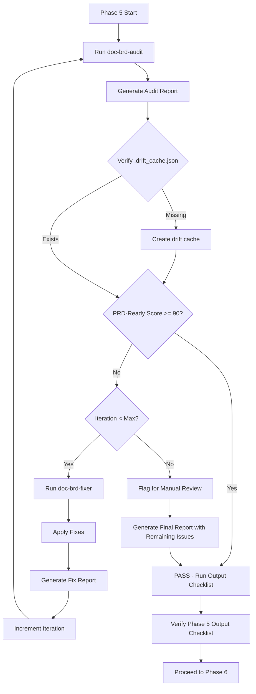
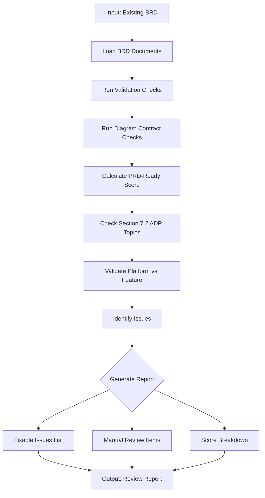
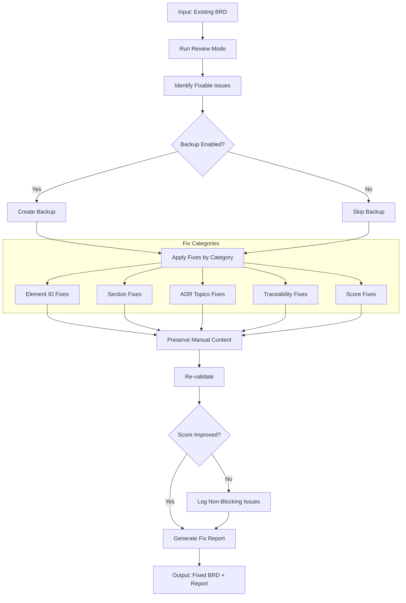
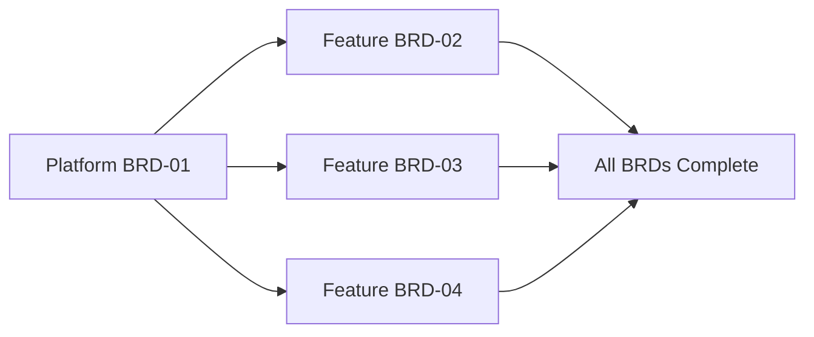

# doc-brd-autopilot

## Purpose

Automated **Business Requirements Document (BRD)** generation pipeline that processes reference documents (`docs/00_REF/` or `REF/`), user prompts, or implementation plans (`IPLAN-*`) to generate comprehensive BRDs with type determination, readiness validation, master index management, and parallel execution support.

**Layer**: 1 (Entry point - no upstream document dependencies)

**Downstream Artifacts**: PRD (Layer 2), EARS (Layer 3), BDD (Layer 4), ADR (Layer 5)

---

## MVP → PROD → NEW MVP Lifecycle

The autopilot supports the iterative **MVP → PROD → NEW MVP** lifecycle:

```
BRD-01 → Production v1 → Feedback → BRD-02 → Production v2 → BRD-03 → ...
```

| Phase | Autopilot Role |
|-------|----------------|
| **MVP** | Generate BRD-NN with 5-15 core features |
| **PROD** | N/A (production operations) |
| **NEW MVP** | Generate NEW BRD-NN+1 for next features |

**Lifecycle Rules**:
- Each invocation creates ONE BRD for ONE cycle
- New features = invoke autopilot for NEW BRD
- Link cycles via `@depends: BRD-NN` in Section 16.2
- Don't modify existing production BRDs for new features

---

## Skill Dependencies

This autopilot orchestrates the following skills:

| Skill | Purpose | Phase |
|-------|---------|-------|
| `doc-naming` | Element ID format (BRD.NN.xxxx), threshold tags, legacy pattern detection | All Phases |
| `doc-brd` | BRD creation rules, template, section structure, Platform vs Feature guidance | Phase 3: BRD Generation |
| `quality-advisor` | Real-time quality feedback during BRD generation | Phase 3: BRD Generation |
| `doc-brd-audit` | **Unified quality gate**: structure validation + content review + PRD-Ready scoring | Phase 4-5: Audit |
| `doc-brd-fixer` | Apply fixes from audit report, create missing files | Phase 5: Fix |

**2-Skill Model**: `doc-brd-validator` and `doc-brd-reviewer` are DEPRECATED and merged into `doc-brd-audit`.

**Delegation Principle**: The autopilot orchestrates workflow but delegates:
- BRD structure/content rules → `doc-brd` skill
- Real-time quality feedback → `quality-advisor` skill
- All validation and review → `doc-brd-audit` skill (unified quality gate)
- Issue resolution and fixes → `doc-brd-fixer` skill
- Element ID standards → `doc-naming` skill

## BRD Template Compliance Contract

All generation/review/fix orchestration MUST align to:

- `ai_dev_ssd_flow/01_BRD/BRD-MVP-TEMPLATE.md` (human-readable source of truth)
- `ai_dev_ssd_flow/01_BRD/BRD-MVP-TEMPLATE.yaml` (autopilot template)
- `ai_dev_ssd_flow/01_BRD/BRD_MVP_SCHEMA.yaml` (shared validation contract)

**Mandatory Alignment Areas**:
- 18-section structure and subsection numbering
- MVP-critical anchors (`2.1`, `3.2`, `9.1`, `14.5`, `15.3`, `16.1-16.4`, `17.1-17.6`)
- Template naming for glossary and appendices (`17.5 Cross-References`, `17.6 External Standards`, `18.1-18.5`)

Any deviation found in reviewer/fixer outputs must trigger fix cycle before PASS.

---

## Document Metadata Contract (MANDATORY)

When generating BRD document instances, the autopilot MUST:

### 1. Document Type

**Read** `instance_document_type` from template:
- Source: `ai_dev_ssd_flow/01_BRD/BRD-MVP-TEMPLATE.yaml`
- Field: `metadata.instance_document_type: "brd-document"`

**Set** `document_type` in generated document frontmatter:
```yaml
custom_fields:
  document_type: brd-document    # NOT "template"
  artifact_type: BRD
  layer: 1
```

**Validation**: Generated documents MUST have `document_type: brd-document`
- Templates have `document_type: template`
- Instances have `document_type: brd-document`
- Schema validates both values

**Error Handling**: If `instance_document_type` is missing from template, default to `brd-document`.

---

### 2. Deliverable Type

**Read** `deliverable_type` from template:
- Source: `ai_dev_ssd_flow/01_BRD/BRD-MVP-TEMPLATE.md`
- Field: `custom_fields.deliverable_type: "code"`
- Valid values: `code`, `document`, `ux`, `risk`, `process`

**Set** `deliverable_type` in generated document frontmatter:
```yaml
custom_fields:
  document_type: brd-document
  artifact_type: BRD
  layer: 1
  deliverable_type: code    # From template or input analysis
```

**Auto-Detection** (if not in template):

When `deliverable_type` is missing from template or input sources, auto-detect from BRD content:

```python
def detect_deliverable_type(brd_content: str, input_sources: dict) -> str:
    """Auto-detect deliverable_type from BRD content and input."""
    content_lower = brd_content.lower()

    # Check UX indicators
    if any(kw in content_lower for kw in [
        'wireframe', 'mockup', 'user interface', 'ui/ux',
        'design system', 'user experience', 'prototype'
    ]):
        return 'ux'

    # Check documentation indicators
    if any(kw in content_lower for kw in [
        'user guide', 'api documentation', 'technical manual',
        'help content', 'documentation', 'knowledge base'
    ]):
        return 'document'

    # Check risk/compliance indicators
    if any(kw in content_lower for kw in [
        'risk assessment', 'compliance framework', 'audit trail',
        'security audit', 'risk management', 'compliance'
    ]):
        return 'risk'

    # Check process indicators
    if any(kw in content_lower for kw in [
        'workflow automation', 'process improvement',
        'business process', 'operational procedure', 'workflow'
    ]):
        return 'process'

    # Default to code
    return 'code'
```

**Validation**: Generated documents MUST have a valid `deliverable_type`
- Values: `code`, `document`, `ux`, `risk`, `process`
- Default: `code`
- Determines downstream SPEC subtype generation

**Error Handling**: If `deliverable_type` is invalid, default to `code` and log warning.

---

## Input Contract (Canonical + Backward-Compatible)

Canonical invocation formats:

```bash
/doc-brd-autopilot --ref <path>
/doc-brd-autopilot --prompt "<business objective and scope>"
/doc-brd-autopilot --iplan <path|IPLAN-NNN>
```

Backward compatibility:

- Positional invocation remains supported (`/doc-brd-autopilot BRD-01`, `/doc-brd-autopilot docs/00_REF/...`).
- If flag-style input and positional input are both provided, **flag-style input is authoritative**.
- Positional-only generation mode should emit a compatibility note recommending canonical flags.

Input precedence (highest to lowest):

1. `--iplan`
2. `--ref`
3. `--prompt`

If multiple inputs are provided, the highest-precedence input becomes **primary source** and others are treated as **supplemental context**.

Supplemental merge semantics:

- Supplemental sources may fill missing context only.
- Supplemental sources must not override primary source objectives/scope/constraints.
- Conflicts in objectives/scope are blocking and require user clarification.

IPLAN resolution order:

1. If `--iplan` is an existing file path, use it.
2. If `--iplan` value matches `IPLAN-NNN` (no path), resolve in order:
  - `work_plans/IPLAN-NNN*.md`
  - `governance/plans/IPLAN-NNN*.md`
3. If multiple matches are found, fail with disambiguation output listing candidate files.

---

## Smart Document Detection

The autopilot automatically determines the action based on the input document type.

### Input Type Recognition (No Upstream - Layer 1)

BRD has no upstream document type. Smart detection works differently:

| Input | Detected As | Action |
|-------|-------------|--------|
| `BRD-NN` (exists) | Self type | Review & Fix existing BRD |
| `BRD-NN` (missing) | Self type | Search refs → Generate BRD |
| `BRD-NN BRD-MM ...` | Multiple BRDs | Process each (chunked by 3) |
| `docs/00_REF/...` | Reference docs | Generate BRD from reference |
| `--ref <path>` | Reference docs | Generate BRD from reference |
| `REF/...` | Reference docs | Generate BRD from reference |
| `--prompt "..."` | User prompt | Generate BRD from prompt |
| `--iplan <path|IPLAN-NNN>` | Implementation plan | Generate BRD from implementation plan |

### Detection Algorithm

```
1. Parse input into buckets: BRD IDs, ref paths, prompt, implementation plan
2. Resolve canonical primary source using precedence:
  - `--iplan` > `--ref` > `--prompt`
3. IF primary source is `--iplan`:
  - Resolve IPLAN path (direct path or `IPLAN-NNN` lookup)
  - Validate required IPLAN fields: title, scope, phases/steps, constraints, dependencies, validation/testing approach
  - Transform IPLAN content to BRD sections (1,2,3,8,9,10,11,12,15)
  - **MANDATORY ID TRANSFORMATION** (per `doc-naming` skill):
    a. Detect ALL legacy/source ID patterns in IPLAN content:
       - Simple patterns: `FR-XXX`, `AC-XXX`, `BO-XXX`, `NFR-XXX`
       - Compound patterns: `FR-{DOMAIN}-XXX` (e.g., `FR-CICD-001`, `FR-AUTH-002`)
       - Any pattern matching: `(FR|AC|BO|NFR|QA|BC)(-[A-Za-z0-9]+)*-[0-9]+`
    b. Convert ALL detected IDs to BRD.NN.xxxx format:
       - `FR-*` → `BRD.NN.01.SS` (Functional Requirement)
       - `NFR-*` → `BRD.NN.02.SS` (Quality Attribute)
       - `AC-*` → `BRD.NN.06.SS` (Acceptance Criteria)
       - `BO-*` → `BRD.NN.23.SS` (Business Objective)
    c. Validate ALL element IDs against `doc-naming` patterns BEFORE writing
    d. BLOCK generation if any legacy patterns remain after transformation
  - Run Generate Mode (Phase 1-5)
4. IF primary source is reference path (`--ref` or positional docs/00_REF|REF path):
  - Detect small-ref mode (<=3 files and <=100KB total, markdown/text/reStructuredText only)
  - Small-ref mode: run extraction table (objective, scope, constraints, assumptions, acceptance criteria)
  - Standard-ref mode: run full source analysis pipeline
  - Run Generate Mode (Phase 1-5)
5. IF primary source is `--prompt`:
  - Validate prompt quality (objective + scope + at least one constraint or success signal)
  - If low-information prompt, request guided prompt enrichment
  - Run Generate Mode (Phase 1-5)
6. IF input matches "BRD-NN" pattern (single or multiple) and no generation source provided:
   - Process in chunks of 3 (max parallel)
   - For each BRD-NN:
     a. Check: Does BRD-{NN} exist in docs/01_BRD/?
     b. IF exists:
        - Run Review & Fix Cycle (Phase 5):
          1. Run doc-brd-audit (validator → reviewer) → Generate combined report
          2. IF status FAIL: Run doc-brd-fixer
          3. Re-run audit until status PASS or max_iterations (3)
          4. Enforce confidence gate: no `manual-required` fixes unresolved
          5. Normalize generated review/fix markdown artifacts
          6. Generate final PRD-Ready report
     c. IF not exists:
        - Search for reference docs:
          1. Check BRD-00_index.md for module mapping
          2. Search docs/00_REF/ for matching specs
          3. Match by module ID (F1-F10, D1-D7) or topic name
        - IF reference found:
          - Run Generate Mode (Phase 1-5)
        - ELSE:
          - Prompt user: "No reference found for BRD-NN. Provide --ref, --prompt, or --iplan"
7. Generate summary report for all processed BRDs
```

### File Existence Check

```bash
# Check for nested folder structure (mandatory)
ls docs/01_BRD/BRD-{NN}_*/
```

### Examples

```bash
# Single BRD - Review & Fix (if exists) or Generate (if missing)
/doc-brd-autopilot BRD-01            # Reviews existing BRD-01, runs fix cycle
/doc-brd-autopilot BRD-99            # BRD-99 missing → searches refs → generates

# Multiple BRDs - processed in chunks of 3
/doc-brd-autopilot BRD-46 BRD-47 BRD-48 BRD-49 BRD-50   # Chunk 1: 46-48, Chunk 2: 49-50

# Generate mode (explicit reference input)
/doc-brd-autopilot docs/00_REF/foundation/F1_IAM_Technical_Specification.md
/doc-brd-autopilot all               # Process all reference documents

# Generate mode (prompt input)
/doc-brd-autopilot --prompt "Create a BRD for user authentication system"

# Generate mode (implementation plan input)
/doc-brd-autopilot --iplan work_plans/IPLAN-002_brd_skill_input_expansion.md
/doc-brd-autopilot --iplan IPLAN-002

# Mixed input (primary + supplemental)
/doc-brd-autopilot --iplan IPLAN-002 --ref docs/00_REF/foundation/
```

### Action Determination Output

```
Input: BRD-01
├── Detected Type: BRD (self)
├── BRD Exists: Yes → docs/01_BRD/BRD-01_f1_iam/
├── Action: AUDIT & FIX CYCLE
│   ├── Step 1: Run doc-brd-audit → Score: 85%
│   ├── Step 2: Score < 90% → Run doc-brd-fixer
│   ├── Step 3: Re-audit → Score: 94%
│   └── Step 4: PASS - PRD-Ready
└── Output: BRD-01.A_audit_report_v002.md, BRD-01.F_fix_report_v001.md

Input: BRD-15
├── Detected Type: BRD (self)
├── BRD Exists: No
├── Reference Search: Found docs/00_REF/domain/D5_Reporting_Technical_Specification.md
├── Action: GENERATE MODE - Creating BRD-15 from reference
│   ├── Phase 1-3: Generate BRD
│   ├── Phase 4: Validate → PRD-Ready: 88%
│   └── Phase 5: Review & Fix → Final: 92%
└── Output: docs/01_BRD/BRD-15_reporting/

Input: BRD-99
├── Detected Type: BRD (self)
├── BRD Exists: No
├── Reference Search: No matching reference found
└── Action: PROMPT USER - "Provide --ref, --prompt, or --iplan for BRD-99"

Input: BRD-46 BRD-47 BRD-48 BRD-49 BRD-50
├── Detected Type: Multiple BRDs (5)
├── Chunking: Chunk 1 (BRD-46, 47, 48), Chunk 2 (BRD-49, 50)
└── Processing:
    ├── Chunk 1: All exist → Review & Fix cycle (parallel)
    ├── Chunk 1 Complete: Summary + pause
    └── Chunk 2: All exist → Review & Fix cycle (parallel)

Input: docs/00_REF/foundation/F1_IAM_Technical_Specification.md
├── Detected Type: Reference document
└── Action: GENERATE MODE - Creating BRD from reference specification

Input: --iplan IPLAN-002
├── Detected Type: Implementation plan
├── Resolved Path: work_plans/IPLAN-002_brd_skill_input_expansion.md
├── Validation: Required fields present
├── Action: GENERATE MODE - Creating BRD from implementation plan
└── Mapping: IPLAN sections -> BRD sections (1,2,3,8,9,10,11,12,15)
```

---

## When to Use This Skill

**Use `doc-brd-autopilot` when**:
- Starting a new project and need to create the initial BRD
- Converting business requirements, strategy documents, or implementation plans to formal BRD format
- Creating multiple BRDs for a project (platform + feature BRDs)
- Automating BRD generation in CI/CD pipelines
- Ensuring consistent BRD quality across team members

**Do NOT use when**:
- Manually reviewing an existing BRD (use `doc-brd-audit`)
- Creating a simple single-section BRD (use `doc-brd` directly)
- Editing specific BRD sections (use `doc-brd` for guidance)

---

## Workflow Overview

```mermaid
flowchart TD
    subgraph Phase1["Phase 1: Input Analysis"]
        A[Start] --> B[Read Strategy Documents]
        B --> C[Identify Stakeholder Requirements]
        C --> D[Extract Business Context]
        D --> E[Catalog Input Sources]
        E --> E1[Validate @ref Targets]
        E1 --> E2{All refs valid?}
        E2 -->|No| E3[Flag missing docs]
        E3 --> E4{Required doc?}
        E4 -->|Yes| E5[ABORT: Create missing doc first]
        E4 -->|No| E6[Continue with note]
        E2 -->|Yes| E6
    end

    subgraph Phase2["Phase 2: BRD Type Determination"]
        E6 --> F[Run Platform vs Feature Questionnaire]
        F --> G{Platform BRD?}
        G -->|Yes| H[Configure Platform BRD Mode]
        G -->|No| I[Configure Feature BRD Mode]
        H --> J[Check for Platform BRD Dependencies]
        I --> K[Verify Platform BRD Exists]
        K -->|Missing| L[Queue Platform BRD First]
        L --> J
        K -->|Exists| J
    end

    subgraph Phase3["Phase 3: BRD Generation"]
        J --> M[Load BRD Template]
        M --> N[Generate Document Control]
        N --> O[Generate Core Sections 1-9]
        O --> O2[Generate Section 7.2: ADR Topics]
        O2 --> P[quality-advisor: Real-time Feedback]
        P --> Q[Generate Sections 10-18]
        Q --> Q2[Handle Master Glossary]
        Q2 --> Q3{Glossary exists?}
        Q3 -->|No| Q4[Create BRD-00_GLOSSARY.md]
        Q3 -->|Yes| Q5[Update path reference]
        Q4 --> Q5
        Q5 --> R[Add Traceability References]
        R --> S[Write BRD Files]
    end

    subgraph Phase4["Phase 4-5: Audit & Fix Cycle"]
        S --> T[Run doc-brd-audit]
        T --> U{PRD-Ready >= 90?}
        U -->|No| V[Run doc-brd-fixer]
        V --> W[Re-run doc-brd-audit]
        W --> U
      U -->|Yes| X[Run Template Conformance Check against BRD-MVP-TEMPLATE]
      X --> X2{Template aligned?}
      X2 -->|No| V
      X2 -->|Yes| X3[Mark BRD Validated]
    end

    subgraph Phase6["Phase 6: Final Review"]
      X3 --> Y[Verify Quality Checks]
        Y --> Y2{All checks pass?}
      Y2 -->|No| Y3[Flag Manual Review]
      Y3 --> Y3a[Semantic MVP header normalization]
      Y3a --> Y3b[Safe subsection renumbering]
      Y3b --> Y3c[Apply fix confidence tags]
      Y3c --> Y3d[Normalize generated markdown reports]
      Y3d --> Y4{Iteration < Max?}
        Y4 -->|Yes| Y
        Y4 -->|No| Y5[Flag Manual Review]
        Y2 -->|Yes| Z[Verify Quality Checks]
        Y5 --> Z
        Z --> AA[Generate PRD-Ready Report]
        AA --> AB[Update Traceability Matrix]
    end

    AB --> AC[Complete]
```



---

## Detailed Workflow

### Phase 1: Input Analysis

Analyze available input sources to extract business requirements.

**Input Sources** (priority order):

| Priority | Source | Location | Content Type |
|----------|--------|----------|--------------|
| 1 | Implementation Plan | `work_plans/` or `governance/plans/` | Planned scope, constraints, dependencies, validation approach |
| 2 | Reference Documents | `docs/00_REF/` | Technical specs, gap analysis, architecture |
| 3 | Reference Documents (alt) | `REF/` | Alternative location for reference docs |
| 4 | Existing Documentation | `docs/` or `README.md` | Project context, scope |
| 5 | User Prompts | Interactive | Business context, objectives, constraints |

#### 0.1 Small Reference Mode (Deterministic)

Use small-reference mode when all conditions are true:

- Source set includes <=3 files
- Total size <=100KB
- All files are `.md`, `.txt`, or `.rst`

Small-reference extraction table (mandatory):

| Extraction Field | Output Target |
|------------------|---------------|
| objective | BRD sections 1-2 |
| scope | BRD section 3 |
| constraints | BRD section 8 |
| assumptions | BRD section 8 |
| acceptance criteria | BRD section 9 |

If any threshold is exceeded, route to standard reference processing mode.

#### 0.2 IPLAN Validation Severity Matrix

| Check | Severity | Behavior |
|------|----------|----------|
| Missing IPLAN title | Error | Abort generation |
| Missing IPLAN scope | Error | Abort generation |
| Missing phases/steps | Error | Abort generation |
| Missing constraints/dependencies | Warning | Continue with explicit BRD assumptions |
| Missing validation/testing approach | Warning | Continue and flag BRD QA gap |
| Ambiguous IPLAN identifier | Error | Abort and request disambiguation |

#### 1.0 Determine Upstream Mode (First Step)

**Check for reference documents**:

1. Scan for `docs/00_REF/`
2. If found, list available subfolders:
   ```bash
  ls -la docs/00_REF/
   ```
3. If user specifies source docs from REF folder:
   - Set `upstream_mode: "ref"`
   - Set `upstream_ref_path` to specified subfolder(s)
4. If primary source is `--iplan` and no reference docs are primary:
  - Set `upstream_mode: "none"`
  - Optionally attach `upstream_ref_path` only when supplemental `--ref` context is used
5. If not found or user creating from scratch:
   - Set `upstream_mode: "none"` (default)
   - Set `upstream_ref_path: null`

**Prompt user if REF folder exists**:

```
Reference documents found in docs/00_REF/:
- source_docs/ (15 files)
- foundation/ (10 files)
- internal_ops/ (8 files)

Is this BRD derived from reference documents?
1. No - creating from scratch (default)
2. Yes - select reference folder(s)
```

**YAML Generation Based on Mode**:

```yaml
# If generating from REF docs:
custom_fields:
  upstream_mode: "ref"
  upstream_ref_path: "../../00_REF/source_docs/"

# If generating from user prompt only:
custom_fields:
  upstream_mode: "none"
```

**Analysis Process**:

```bash
# Check for reference documents (primary location)
ls -la docs/00_REF/

# Alternative location
ls -la REF/

# Expected structure:
# docs/00_REF/
# ├── foundation/           # Foundation module specs (F1-F7)
# │   ├── F1_IAM_Technical_Specification.md
# │   ├── F2_Session_Technical_Specification.md
# │   └── GAP_Foundation_Module_Gap_Analysis.md
# ├── domain/               # Domain module specs (D1-D7)
# │   ├── D1_Agent_Technical_Specification.md
# │   └── architecture/     # Architecture documents
# └── external/             # External references
```

**Output**: Input catalog with extracted requirements, objectives, and constraints.

#### 1.1 Source Document Link Validation (NEW in v2.3)

**Purpose**: Validate that all referenced source documents exist before proceeding to generation. This prevents broken `@ref:` links in the generated BRD.

**Validation Checks**:

| Check | Action | Severity |
|-------|--------|----------|
| Reference documents exist (ref mode only) | Verify files in `docs/00_REF/` or `REF/` | Error - blocks generation in ref mode |
| `@ref:` targets in source docs | Verify referenced files exist | Error - blocks generation |
| Gap analysis documents | Verify `GAP_*.md` files if referenced | Note - flag for creation |
| Cross-reference documents | Verify upstream docs exist | Note - document dependency |

**Validation Process**:

```bash
# Check for referenced documents
grep -h "@ref:" docs/00_REF/**/*.md REF/**/*.md 2>/dev/null | \
  grep -oP '\[.*?\]\(([^)]+)\)' | \
  while read link; do
    file=$(echo "$link" | grep -oP '\(([^)]+)\)' | tr -d '()')
    if [ ! -f "$file" ]; then
      echo "NOTE: Referenced file not found: $file"
    fi
  done
```

**Error Handling**:

| Scenario | Action |
|----------|--------|
| Required source doc missing | Abort with clear error message |
| Optional reference missing | Log note, continue with placeholder note |
| Gap analysis doc missing | Prompt user: create doc or update references |

**Example Output**:

```
Phase 1: Input Analysis
=======================
Reference documents found: 5
  ✅ docs/00_REF/foundation/F1_IAM_Technical_Specification.md
  ✅ docs/00_REF/foundation/F2_Session_Technical_Specification.md
  ✅ docs/00_REF/foundation/F3_Observability_Technical_Specification.md
  ✅ docs/00_REF/domain/D1_Agent_Technical_Specification.md
  ✅ docs/00_REF/GLOSSARY_Master.md

Reference Validation:
  ✅ docs/00_REF/foundation/F1_IAM_Technical_Specification.md
  ❌ docs/00_REF/foundation/GAP_Foundation_Module_Gap_Analysis.md (NOT FOUND)

ACTION REQUIRED: Create missing reference document or update source references.
```

### Phase 2: BRD Type Determination

Determine if creating a Platform BRD or Feature BRD.

> **Skill Delegation**: This phase follows rules defined in `doc-brd` skill.
> See: `.claude/skills/doc-brd/SKILL.md` Section "BRD Categorization: Platform vs Feature"

**Questionnaire** (automated):

| Question | Platform Indicator | Feature Indicator |
|----------|-------------------|-------------------|
| Defines infrastructure/technology stack? | Yes | No |
| Describes specific user-facing workflow? | No | Yes |
| Other BRDs will depend on this? | Yes | No |
| Establishes patterns/standards for multiple features? | Yes | No |
| Implements functionality on existing platform? | No | Yes |

**Auto-Detection Logic**:

```python
def determine_brd_type(title: str, content: str) -> str:
    platform_keywords = ["Platform", "Architecture", "Infrastructure", "Integration", "Foundation"]
    feature_keywords = ["B2C", "B2B", "Workflow", "User", "Feature", "Module"]

    if any(kw in title for kw in platform_keywords):
        return "PLATFORM"
    if any(kw in title for kw in feature_keywords):
        return "FEATURE"
    if references_platform_brd(content):
        return "FEATURE"
    return "PLATFORM"  # Default to Platform for new projects
```

**Feature BRD Dependency Check**:

```bash
# Verify Platform BRD exists before creating Feature BRD
ls docs/01_BRD/BRD-01_* 2>/dev/null || echo "ERROR: Platform BRD-01 required"
```

### Phase 3: BRD Generation

Generate the BRD document with real-time quality feedback.

> **Skill Delegation**: This phase follows rules defined in `doc-brd` skill.
> See: `.claude/skills/doc-brd/SKILL.md` for complete BRD creation guidance.
>
> **Quality Guidance**: Uses `quality-advisor` skill for real-time feedback during generation.
> See: `.claude/skills/quality-advisor/SKILL.md` for quality monitoring.

**Generation Process**:

1. **Reserve BRD ID**:
   ```bash
   # Check for next available ID
   ls docs/01_BRD/BRD-*.md docs/01_BRD/BRD-*/BRD-*.0_*.md 2>/dev/null | \
     grep -oP 'BRD-\K\d+' | sort -n | tail -1
   # Increment for new BRD
   ```

2. **Load BRD Template**:
   - Primary: `ai_dev_ssd_flow/01_BRD/BRD-MVP-TEMPLATE.md`
   - Comprehensive: `ai_dev_ssd_flow/01_BRD/BRD-MVP-TEMPLATE.md`

3. **Generate Document Control Section**:
   | Field | Value |
   |-------|-------|
   | Project Name | From input analysis |
   | Document Version | 0.1.0 |
   | Date Created | Current date (YYYY-MM-DD) |
   | Last Updated | Current date (YYYY-MM-DD) |
   | Document Owner | From stakeholder input |
   | Prepared By | AI Assistant |
   | Status | Draft |
   | PRD-Ready Score | Calculated after generation |

3a. **Set Metadata Fields**:
   ```yaml
   custom_fields:
     document_type: brd-document      # From instance_document_type
     artifact_type: BRD
     layer: 1
     deliverable_type: code           # From template or auto-detected
   ```

   **deliverable_type Selection Process**:
   1. Check template (`BRD-MVP-TEMPLATE.md`) for `deliverable_type` field
   2. If missing, run auto-detection on generated content
   3. If still unclear, default to `code`
   4. Log the selection reason for audit trail

4. **Generate Core Sections (1-9)**:
   - Section 1: Executive Summary
   - Section 2: Business Context
   - Section 3: Stakeholder Analysis
   - Section 4: Business Requirements (using BRD.NN.01.SS format)
   - Section 5: Success Criteria
   - Section 6: Constraints and Assumptions
   - Section 7: Architecture Decision Requirements
   - Section 8: Risk Assessment
   - Section 9: Traceability

5. **Generate Section 7.2: Architecture Decision Requirements**:

   **7 Mandatory ADR Topic Categories** (per `doc-brd` skill):

   | # | Category | Element ID | Fields Required |
   |---|----------|------------|-----------------|
   | 1 | Infrastructure | BRD.NN.32.01 | Status, Business Driver, Constraints, Alternatives, Cloud Comparison |
   | 2 | Data Architecture | BRD.NN.32.02 | Status, Business Driver, Constraints, Alternatives, Cloud Comparison |
   | 3 | Integration | BRD.NN.32.03 | Status, Business Driver, Constraints, Alternatives, Cloud Comparison |
   | 4 | Security | BRD.NN.32.04 | Status, Business Driver, Constraints, Alternatives, Cloud Comparison |
   | 5 | Observability | BRD.NN.32.05 | Status, Business Driver, Constraints, Alternatives, Cloud Comparison |
   | 6 | AI/ML | BRD.NN.32.06 | Status, Business Driver, Constraints, Alternatives, Cloud Comparison |
   | 7 | Technology Selection | BRD.NN.32.07 | Status, Business Driver, Constraints, Alternatives, Cloud Comparison |

   **Status Values**: `Selected`, `Pending`, `N/A`

   **Required Tables** (for Status=Selected):
   - Alternatives Overview table (Option | Function | Est. Monthly Cost | Selection Rationale)
   - Cloud Provider Comparison table (Criterion | GCP | Azure | AWS)

6. **Real-Time Quality Feedback** (via `quality-advisor` skill):
   - Monitor section completion as content is generated
   - Detect anti-patterns (AP-001 to AP-017) during creation
   - Validate element ID format compliance (BRD.NN.xxxx)
   - Check for placeholder text ([TBD], TODO, XXX)
   - Flag issues early to reduce post-generation rework

7. **Generate Sections 10-18**:
   - Section 10: Market Context
   - Section 11: Regulatory Compliance
   - Section 12: Integration Requirements
   - Section 13: Data Requirements
   - Section 14: Performance Requirements
   - Section 15: Security Requirements
   - Section 16: Operational Requirements
   - Section 17: Glossary
   - Section 18: Appendices

8. **Platform vs Feature Section Handling**:

   | BRD Type | Section 3.6 | Section 3.7 |
   |----------|-------------|-------------|
   | Platform | MUST populate with technology details | MUST populate with conditions |
   | Feature | "N/A - See Platform BRD-NN Section 3.6" | "N/A - See Platform BRD-NN Section 3.7" |

9. **Traceability References**:
   ```markdown
   ## 9. Traceability

   ### Upstream Sources
   | Source | Type | Reference |
   |--------|------|-----------|
   | docs/00_REF/foundation/F1_Technical_Specification.md | Reference Document | Technical specifications |
   | docs/00_REF/foundation/GAP_Analysis.md | Reference Document | Gap analysis |
   | [Stakeholder] | Business Input | Initial requirements |

   ### Downstream Artifacts
   | Artifact | Type | Status |
   |----------|------|--------|
   | PRD-NN | Product Requirements | Pending |
   | ADR-NN | Architecture Decisions | Pending |
   ```

10. **Master Glossary Handling** (NEW in v2.3):

    The BRD template references a master glossary. The autopilot MUST handle this reference correctly.

    **Glossary Check Process**:

    | Scenario | Action |
    |----------|--------|
    | `docs/BRD-00_GLOSSARY.md` exists | Use correct relative path in Section 14 |
    | Glossary missing, first BRD | Create `docs/01_BRD/BRD-00_GLOSSARY.md` with template |
    | Glossary missing, subsequent BRD | Reference existing glossary or create if missing |

    **Glossary Creation Template**:

    ```markdown
    ---
    title: "BRD-00: Master Glossary"
    tags:
      - brd
      - glossary
      - reference
    custom_fields:
      document_type: glossary
      artifact_type: BRD-REFERENCE
      layer: 1
    ---

    # BRD-00: Master Glossary

    Common terminology used across all Business Requirements Documents.

    ## Business Terms

    | Term | Definition | Context |
    |------|------------|---------|
    | MVP | Minimum Viable Product | Scope definition |
    | SLA | Service Level Agreement | Quality requirements |

    ## Technical Terms

    | Term | Definition | Context |
    |------|------------|---------|
    | API | Application Programming Interface | Integration |
    | JWT | JSON Web Token | Authentication |

    ## Domain Terms

    [Add project-specific terminology here]
    ```

    **Section 14 Glossary Reference Format**:

    ```markdown
    ## 14. Glossary

    📚 **Master Glossary**: For common terminology, see `BRD-00_GLOSSARY.md`

    ### {BRD-NN}-Specific Terms

    | Term | Definition | Context |
    |------|------------|---------|
    | [Term 1] | [Definition] | [Where used] |
    ```

    **Path Resolution**:

    | BRD Location | Glossary Path |
    |--------------|---------------|
    | `docs/01_BRD/BRD-01.md` (monolithic) | `BRD-00_GLOSSARY.md` |
    | `docs/01_BRD/BRD-01_slug/BRD-01.3_*.md` (sectioned) | `../BRD-00_GLOSSARY.md` |

11. **BRD Index Handling** (NEW in v2.4):

    The autopilot MUST create or update `BRD-00_index.md` to serve as the master index for all BRD documents.

    **Index Check Process**:

    | Scenario | Action |
    |----------|--------|
    | `docs/01_BRD/BRD-00_index.md` exists | Update with new BRD entry |
    | Index missing | Create `docs/01_BRD/BRD-00_index.md` with template |

    **BRD-00_index.md Creation Template**:

    ```markdown
    ---
    title: "BRD-00: Business Requirements Document Index"
    tags:
      - brd
      - index
      - layer-1-artifact
    custom_fields:
      document_type: brd-index
      artifact_type: BRD-INDEX
      layer: 1
      last_updated: "YYYY-MM-DDTHH:MM:SS"
    ---

    # BRD-00: Business Requirements Document Index

    Master index of all Business Requirements Documents for the project.

    ---

    ## Document Registry

    | BRD ID | Module | Type | Status | PRD-Ready | Location |
    |--------|--------|------|--------|-----------|----------|
    | BRD-01 | F1 IAM | Foundation | Draft | 97% | `BRD-01` |

    ---

    ## Module Categories

    ### Foundation Modules (F1-F7)

    Domain-agnostic, reusable infrastructure modules.

    | ID | Module Name | BRD | Status |
    |----|-------------|-----|--------|
    | F1 | Identity & Access Management | `BRD-01` | Draft |
    | F2 | Session Management | Pending | - |
    | F3 | Observability | Pending | - |
    | F4 | SecOps | Pending | - |
    | F5 | Events | Pending | - |
    | F6 | Infrastructure | Pending | - |
    | F7 | Configuration | Pending | - |

    ### Domain Modules (D1-D7)

    Business-specific modules for cost monitoring.

    | ID | Module Name | BRD | Status |
    |----|-------------|-----|--------|
    | D1 | Agent Orchestration | Pending | - |
    | D2 | Cloud Accounts | Pending | - |
    | D3 | Cost Analytics | Pending | - |
    | D4 | Recommendations | Pending | - |
    | D5 | Reporting | Pending | - |
    | D6 | Alerting | Pending | - |
    | D7 | Budgets | Pending | - |

    ---

    ## Quick Links

    - **Glossary**: `BRD-00_GLOSSARY.md`
    - **Reference Documents**: `00_REF/`
    - **PRD Layer**: `02_PRD/`

    ---

    ## Statistics

    | Metric | Value |
    |--------|-------|
    | Total BRDs | 1 |
    | Foundation Modules | 1/7 |
    | Domain Modules | 0/7 |
    | Average PRD-Ready Score | 97% |

    ---

    *Last Updated: YYYY-MM-DDTHH:MM:SS*
    ```

    **Index Update Logic**:

    After generating each BRD:
    1. Read existing `BRD-00_index.md`
    2. Parse Document Registry table
    3. Add or update entry for new BRD
    4. Update Statistics section
    5. Update `last_updated` timestamp
    6. Write updated index

    **Entry Format**:

    ```markdown
    | BRD-NN | {Module Name} | {Foundation/Domain} | {Status} | {Score}% | `BRD-NN` |
    ```

12. **File Output** (ALWAYS use nested folder):
    - **Monolithic** (<20k tokens): `docs/01_BRD/BRD-NN_{slug}/BRD-NN_{slug}.md`
    - **Sectioned** (>=20k tokens): `docs/01_BRD/BRD-NN_{slug}/BRD-NN.0_index.md`, `BRD-NN.1_core.md`, etc.
    - **Master Index** (always): `docs/01_BRD/BRD-00_index.md` (create or update)

    **Nested Folder Rule**: ALL BRDs use nested folders (`BRD-NN_{slug}/`) regardless of size. This keeps companion files (review reports, fix reports, drift cache) organized with their parent document.

### Phase 4: BRD Validation

After BRD generation, validate structure and PRD-Ready score.

> **Skill Delegation**: This phase uses validation rules from `doc-brd-audit` skill (unified quality gate).
> See: `.claude/skills/doc-brd-audit/SKILL.md` for complete validation and review rules.

**Validation Command**:

```bash
# Unified BRD core validation (primary)
bash ai_dev_ssd_flow/01_BRD/scripts/validate_brd_wrapper.sh docs/01_BRD --skip-advisory

# Optional full tiered validation (includes advisory checks)
bash ai_dev_ssd_flow/01_BRD/scripts/validate_brd_wrapper.sh docs/01_BRD
```

**Validation Checks**:

| Check | Requirement | Error Code |
|-------|-------------|------------|
| YAML Frontmatter | Valid metadata fields | BRD-E001 to BRD-E005 |
| Section Structure | 18 required sections | BRD-E006 to BRD-E008 |
| Document Control | All required fields | BRD-E009 |
| Business Objectives | BRD.NN.23.SS format | BRD-W001 |
| Business Requirements | BRD.NN.01.SS format | BRD-W002 |
| Section 7.2 ADR Topics | All 7 categories present | BRD-E013 to BRD-E018 |
| Element ID Format | BRD.NN.xxxx (3-segment) | BRD-E019 to BRD-E021 |
| PRD-Ready Score | >= 90% | BRD-W004 |

**Auto-Fix Actions**:

| Issue | Auto-Fix Action |
|-------|-----------------|
| Invalid element ID format | Convert to BRD.NN.xxxx format |
| Missing traceability section | Insert from template |
| Missing Document Control fields | Add placeholder fields |
| Deprecated ID patterns (BO-XXX, FR-XXX) | Convert to unified format |
| Missing PRD-Ready Score | Calculate and insert |

**Validation Loop**:

```
LOOP (max 3 iterations):
  1. Run doc-brd-audit (unified quality gate)
  2. IF errors found: Apply auto-fixes via doc-brd-fixer
  3. IF non-blocking issues found: Review and address if critical
  4. IF PRD-Ready Score < 90%: Enhance sections
  5. IF clean: Mark VALIDATED, proceed
  6. IF max iterations: Log issues, flag for manual review
```

### Phase 5: Audit & Fix Cycle (v2.4 - 2-Skill Model)

Iterative audit and fix cycle to ensure BRD quality before completion.

**Note**: This phase uses `doc-brd-audit` (unified quality gate) and `doc-brd-fixer`. The deprecated `doc-brd-validator` and `doc-brd-reviewer` skills are merged into `doc-brd-audit`.



#### 5.1 Initial Audit

Run `doc-brd-audit` to identify issues (unified quality gate).

```bash
/doc-brd-audit BRD-NN
```

**Output**: `BRD-NN.A_audit_report_v001.md`

#### 5.2 Fix Cycle

If review score < 90%, invoke `doc-brd-fixer`.

```bash
/doc-brd-fixer BRD-NN --revalidate
```

**Fix Categories**:

| Category | Fixes Applied |
|----------|---------------|
| Missing Files | Create glossary, GAP placeholders, reference docs |
| Broken Links | Update paths, create targets |
| Element IDs | Convert legacy patterns, fix invalid type codes |
| Content | Replace template placeholders, dates |
| References | Update traceability tags |

**Output**: `BRD-NN.F_fix_report_v001.md`

#### 5.3 Re-Audit

After fixes, automatically re-run audit (FROM SCRATCH per Fresh Audit Policy).

```bash
/doc-brd-audit BRD-NN
```

**Output**: `BRD-NN.A_audit_report_v002.md`

#### 5.4 Iteration Control

| Parameter | Default | Description |
|-----------|---------|-------------|
| `max_iterations` | 3 | Maximum fix-review cycles |
| `target_score` | 90 | Minimum passing score |
| `stop_on_manual` | false | Stop if only manual issues remain |

**Iteration Example**:

```
Iteration 1:
  Review v001: Score 85 (2 errors, 4 non-blocking issues)
  Fix v001: Fixed 5 issues, created 2 files

Iteration 2:
  Review v002: Score 94 (0 errors, 2 non-blocking issues)
  Status: PASS (score >= 90)
```

#### 5.5 Quality Checks (Post-Fix)

After passing the fix cycle:

1. **Section Completeness**:
   - All 18 sections present and populated
   - No placeholder text remaining ([TBD], TODO, XXX)
   - Minimum content length per section

2. **ADR Topics Coverage**:
   - All 7 mandatory categories addressed
   - Selected topics have Alternatives Overview table
   - Selected topics have Cloud Provider Comparison table
   - N/A topics have explicit reasons

3. **Element ID Compliance** (per `doc-naming` skill):
   - All IDs use BRD.NN.xxxx format
  - Element type codes valid for BRD (01, 02, 03, 04, 05, 06, 07, 08, 09, 10, 22, 23, 24, 32)
   - No legacy patterns (BO-XXX, FR-XXX, AC-XXX, BC-XXX)

4. **PRD-Ready Report**:
   ```
  PRD-Ready Score Calculation
  ===========================
  Formula: 100 - Total Deductions

  Deductions by Category:
  - PRD-level contamination (max 50):   -0
  - FR completeness (max 30):           -0
  - Structure/quality (max 20):         -0
  ----------------------------
  Total Deductions:        0
  Total PRD-Ready Score:   100/100 (Target: >= 90)
   Status: READY FOR PRD GENERATION
   ```

5. **Traceability Matrix Update**:
   ```bash
   # Update BRD-00_TRACEABILITY_MATRIX.md
   python ai_dev_ssd_flow/scripts/validate_all.py ai_dev_ssd_flow --layer BRD
   ```

#### 5.6 Drift Cache Verification (MANDATORY)

**After EVERY review cycle**, verify the drift cache file exists and is updated.

```
VERIFICATION ALGORITHM:
=======================
1. Check: Does .drift_cache.json exist in BRD folder?
   - Path: docs/01_BRD/BRD-NN_{slug}/.drift_cache.json

2. IF not exists:
   - CREATE drift cache with current review data
   - Schema version: 1.1
   - Include: document_id, last_reviewed, reviewer_version, review_history

3. IF exists:
   - UPDATE with new review entry in review_history array
   - Update last_reviewed timestamp

4. VERIFY cache contains:
  - [ ] schema_version: "1.2"
   - [ ] document_id matches folder (BRD-NN)
   - [ ] last_reviewed is current timestamp
   - [ ] review_history includes this review's score and report version
```

**Drift Cache Schema** (minimal required fields):

```json
{
  "schema_version": "1.1",
  "document_id": "BRD-NN",
  "document_version": "1.0",
  "upstream_mode": "none",
  "drift_detection_skipped": true,
  "skip_reason": "upstream_mode set to none (default)",
  "last_reviewed": "YYYY-MM-DDTHH:MM:SS",
  "reviewer_version": "2.8",
  "upstream_documents": {},
  "review_history": [
    {
      "date": "YYYY-MM-DDTHH:MM:SS",
      "score": NN,
      "drift_detected": false,
      "report_version": "vNNN",
      "status": "PASS|FAIL|NEEDS_ATTENTION"
    }
  ],
  "fix_history": []
}
```

#### 5.6.1 Hash Computation Contract (MANDATORY)

When creating or updating `.drift_cache.json`, the autopilot MUST compute actual SHA-256 hashes.

##### At Initial BRD Generation (Phase 3-4)

If `upstream_mode: "ref"` is set:

1. **Compute hash immediately** for each upstream document using bash:
   ```bash
   sha256sum <upstream_file_path> | cut -d' ' -f1
   ```

2. **Store in drift cache** with format:
   ```json
   "upstream_documents": {
     "<filename>": {
       "path": "<relative_path>",
       "hash": "sha256:<64_hex_characters>",
       "last_modified": "<ISO_timestamp>",
       "file_size": <bytes>
     }
   }
   ```

3. **Never use placeholders** - The following are INVALID and must not be written:
   - `sha256:verified_no_drift`
   - `sha256:pending_verification`
   - `pending_verification`
   - `sha256:TBD`

##### At Review Time (Phase 5)

1. **Re-compute hash** for each upstream document via bash
2. **Compare** with stored hash
3. **Update cache** with new hash
4. **Flag drift** if hash differs

##### Validation Requirements

| Check | Requirement |
|-------|-------------|
| Format | Hash must match regex `^[0-9a-f]{64}$` |
| Prefix | Store as `sha256:<hash>` |
| Reject | Any placeholder values |

##### Verification Step

After writing drift cache, verify all hashes are valid:

```bash
# Count valid hashes
grep -oP '"hash":\s*"sha256:[0-9a-f]{64}"' .drift_cache.json | wc -l
# Must equal number of upstream documents tracked

# Check for placeholder values (must return empty)
grep -E 'pending_verification|verified_no_drift' .drift_cache.json
```

**FAILURE MODE**: If any hash fails validation, the Phase 5 cycle is INCOMPLETE. Re-run `sha256sum` and update cache before proceeding.

---

#### 5.7 Phase 5 Output Checklist (MANDATORY)

Before proceeding to Phase 6, verify ALL outputs exist:

```
PHASE 5 OUTPUT CHECKLIST
========================
BRD Folder: docs/01_BRD/BRD-NN_{slug}/

Required Files:
[ ] BRD-NN.R_review_report_v001.md    (initial review)
[ ] BRD-NN.R_review_report_vNNN.md    (final review, if iterations > 1)
[ ] BRD-NN.F_fix_report_vNNN.md       (if fixes applied)
[ ] .drift_cache.json                  (MANDATORY - drift detection cache)

Drift Cache Verification:
[ ] File exists
[ ] schema_version is "1.1"
[ ] document_id matches "BRD-NN"
[ ] last_reviewed is current timestamp
[ ] review_history contains entry for this review

Quality Gates:
[ ] Final review score >= 90
[ ] No critical errors remaining
[ ] Diagram contract pass (`@diagram: c4-l1`, `@diagram: dfd-l0`; sequence tag if sequence diagram used)
[ ] PRD-Ready status confirmed
```

**FAILURE MODE**: If `.drift_cache.json` is missing after review, the Phase 5 cycle is INCOMPLETE. Create the drift cache before proceeding.

---

## Execution Modes

### Single BRD Mode

Generate one BRD from input sources.

```bash
# Example: Generate Platform BRD from reference documents
/doc-brd-autopilot \
  --ref docs/00_REF/ \
  --type platform \
  --output docs/01_BRD/ \
  --id 01 \
  --slug platform_architecture

# Alternative: Generate from REF/ directory
/doc-brd-autopilot \
  --ref REF/ \
  --type platform \
  --output docs/01_BRD/ \
  --id 01 \
  --slug platform_architecture
```

### Batch Mode

Generate multiple BRDs in sequence with dependency awareness.

```bash
# Example: Generate Platform BRD then Feature BRDs
/doc-brd-autopilot \
  --batch config/brd_batch.yaml \
  --output docs/01_BRD/
```

**Batch Configuration** (`config/brd_batch.yaml`):

```yaml
brds:
  - id: "01"
    slug: "f1_iam"
    type: "platform"
    priority: 1
    sources:
      - docs/00_REF/foundation/F1_IAM_Technical_Specification.md
      - docs/00_REF/foundation/GAP_Foundation_Module_Gap_Analysis.md

  - id: "02"
    slug: "f2_session"
    type: "platform"
    priority: 1
    sources:
      - docs/00_REF/foundation/F2_Session_Technical_Specification.md

  - id: "03"
    slug: "f3_observability"
    type: "platform"
    priority: 1
    sources:
      - docs/00_REF/foundation/F3_Observability_Technical_Specification.md

execution:
  parallel: true
  max_parallel: 3        # HARD LIMIT - do not exceed
  chunk_size: 3          # Documents per chunk
  pause_between_chunks: true
  max_workers: 2
  fail_fast: false
```

### Dry Run Mode

Preview execution plan without generating files.

```bash
/doc-brd-autopilot \
  --ref docs/00_REF/ \
  --output docs/01_BRD/ \
  --dry-run
```

### Review Mode (v2.1)

Validate existing BRD documents and generate a quality report without modification.

**Purpose**: Audit existing BRD documents for compliance, quality scores, and identify issues.

**Command**:

```bash
# Review single BRD
/doc-brd-autopilot \
  --brd docs/01_BRD/BRD-01_platform.md \
  --mode review

# Review all BRDs
/doc-brd-autopilot \
  --brd docs/01_BRD/ \
  --mode review \
  --output-report tmp/brd_review_report.md
```

**Review Process**:



**Review Report Structure**:

```markdown
# BRD Review Report: BRD-01_platform

## Summary
- **PRD-Ready Score**: 87% 🟡
- **Total Issues**: 14
- **Auto-Fixable**: 10
- **Manual Review**: 4

## Score Calculation (Deduction-Based)
| Category | Deduction | Max | Status |
|----------|-----------|-----|--------|
| PRD-level contamination | -6 | 50 | 🟡 |
| FR completeness | -5 | 30 | 🟡 |
| Structure/quality | -2 | 20 | 🟡 |
| **Total Deductions** | **-13** | **100** | - |
| **Final Score** | **87/100** | **Target >= 90** | 🟡 |

## Diagram Contract Check
| Check | Status | Details |
|-------|--------|---------|
| `@diagram: c4-l1` | ✅ | Present |
| `@diagram: dfd-l0` | ✅ | Present |
| Sequence contract tags | 🟡 | Required only when sequence diagram exists |
| Diagram intent header fields | ✅ | Present for mandatory diagram blocks |

## Section 7.2 ADR Topics Check
| Category | Status | Details |
|----------|--------|---------|
| Infrastructure | ✅ | Complete with tables |
| Data Architecture | ✅ | Complete with tables |
| Integration | 🟡 | Missing Cloud Comparison |
| Security | ✅ | Complete with tables |
| Observability | ❌ | Missing alternatives table |
| AI/ML | ✅ | Complete with tables |
| Technology Selection | ✅ | Complete with tables |

## Platform vs Feature Check
| Check | Status | Details |
|-------|--------|---------|
| BRD Type | Platform | Correctly identified |
| Section 3.6 | ✅ | Technology details present |
| Section 3.7 | ✅ | Conditions populated |
| Cross-references | ✅ | Valid references |

## Auto-Fixable Issues
| # | Issue | Location | Fix Action |
|---|-------|----------|------------|
| 1 | Legacy element ID | Section 4:L45 | Convert BO-001 to BRD.01.2301 |
| 2 | Missing PRD-Ready score | Document Control | Calculate and insert |
| 3 | Invalid ID format | Section 5:L78 | Convert FR-001 to BRD.01.0101 |
| ... | ... | ... | ... |

## Manual Review Required
| # | Issue | Location | Reason |
|---|-------|----------|--------|
| 1 | Incomplete risk assessment | Section 8:L102 | Domain knowledge needed |
| 2 | Missing Observability tables | Section 7.2.5 | Architecture decision required |
| ... | ... | ... | ... |

## Recommendations
1. Run fix mode to address 10 auto-fixable issues
2. Complete Observability ADR topic tables
3. Review and complete risk assessment section
```

**Review Configuration**:

```yaml
review_mode:
  enabled: true
  checks:
    - structure_validation      # 18 sections, Document Control
    - element_id_compliance     # BRD.NN.xxxx format
    - adr_topics_validation     # 7 ADR categories in Section 7.2
    - platform_feature_check    # Correct section handling
    - cumulative_tags           # Traceability references
    - score_calculation         # PRD-Ready score
  output:
    format: markdown           # markdown, json, html
    include_line_numbers: true
    include_fix_suggestions: true
  thresholds:
    pass: 90
    fail: 90
```

### Fix Mode (v2.1)

Auto-repair existing BRD documents while preserving manual content.

**Purpose**: Apply automated fixes to BRD documents to improve quality scores and compliance.

**Command**:

```bash
# Fix single BRD
/doc-brd-autopilot \
  --brd docs/01_BRD/BRD-01_platform.md \
  --mode fix

# Fix with backup
/doc-brd-autopilot \
  --brd docs/01_BRD/BRD-01_platform.md \
  --mode fix \
  --backup

# Fix specific issue types only
/doc-brd-autopilot \
  --brd docs/01_BRD/BRD-01_platform.md \
  --mode fix \
  --fix-types "element_ids,sections,adr_topics"

# Dry-run fix (preview changes)
/doc-brd-autopilot \
  --brd docs/01_BRD/BRD-01_platform.md \
  --mode fix \
  --dry-run
```

**Fix Process**:



**Fix Categories and Actions**:

| Category | Issue | Auto-Fix Action | Preserves Content |
|----------|-------|-----------------|-------------------|
| **Element IDs** | Legacy BO-XXX format | Convert to BRD.NN.23.SS | ✅ |
| **Element IDs** | Legacy FR-XXX format | Convert to BRD.NN.01.SS | ✅ |
| **Element IDs** | Legacy AC-XXX format | Convert to BRD.NN.06.SS | ✅ |
| **Element IDs** | Legacy BC-XXX format | Convert to BRD.NN.03.SS | ✅ |
| **Element IDs** | Invalid type code for BRD | Suggest context-appropriate valid BRD code (manual classification if ambiguous) | ✅ |
| **Sections** | Missing Document Control fields | Add from template | ✅ |
| **Sections** | Missing traceability section | Insert from template | ✅ |
| **Sections** | Missing PRD-Ready score | Calculate and insert | ✅ |
| **ADR Topics** | Missing category | Add template entry | ✅ |
| **ADR Topics** | Missing Alternatives table | Add table template | ✅ |
| **ADR Topics** | Missing Cloud Comparison table | Add table template | ✅ |
| **Traceability** | Missing upstream sources | Add template structure | ✅ |
| **Traceability** | Missing downstream artifacts | Add template structure | ✅ |
| **Score** | Missing PRD-Ready breakdown | Calculate and add | ✅ |
| **Broken Links** | Missing glossary file | Create BRD-00_GLOSSARY.md | ✅ |
| **Broken Links** | Missing reference doc | Prompt to create or update link | ⚠️ |
| **Broken Links** | Invalid relative path | Fix path based on BRD location | ✅ |

**Content Preservation Rules**:

1. **Never delete** existing business requirements
2. **Never modify** executive summary content
3. **Never change** stakeholder analysis details
4. **Only add** missing sections and metadata
5. **Only replace** legacy element IDs with unified format
6. **Backup first** if `--backup` flag is set

**Element ID Migration**:

| Legacy Pattern | New Format | Example |
|----------------|------------|---------|
| `BO-XXX` | `BRD.NN.23.SS` | BO-001 → BRD.01.2301 |
| `FR-XXX` | `BRD.NN.01.SS` | FR-001 → BRD.01.0101 |
| `AC-XXX` | `BRD.NN.06.SS` | AC-001 → BRD.01.0601 |
| `BC-XXX` | `BRD.NN.03.SS` | BC-001 → BRD.01.0301 |
| `ADR-T-XXX` | `BRD.NN.32.SS` | ADR-T-001 → BRD.01.3201 |

**Element Type Code Migration** (v2.3):

| Invalid Code | Correct Action | Context | Example |
|--------------|----------------|---------|---------|
| 25 in BRD | Manual reclassification to context-appropriate valid BRD code (`23`, `24`, `22`, `08`, etc.) | Business content section | BRD.01.2501 → BRD.01.2301 (if business objective) |

**Note**: Code 25 is valid only for EARS documents (EARS Statement). In BRD, code 33 is not accepted by the standardized BRD validator; use a context-appropriate valid BRD code.

**Broken Link Fixes** (v2.3):

| Issue | Fix Action | Creates File |
|-------|------------|--------------|
| Missing `BRD-00_GLOSSARY.md` | Create from template | ✅ Yes |
| Missing reference doc (GAP, REF) | Prompt user with options: (1) Create placeholder, (2) Update link, (3) Remove reference | ⚠️ Optional |
| Wrong relative path | Recalculate path based on BRD location | ❌ No |
| Cross-BRD reference to non-existent BRD | Log note, suggest creating BRD | ❌ No |

**Fix Report Structure**:

```markdown
# BRD Fix Report: BRD-01_platform

## Summary
- **Before PRD-Ready Score**: 87% 🟡
- **After PRD-Ready Score**: 94% ✅
- **Issues Fixed**: 10
- **Issues Remaining**: 4 (manual review required)

## Fixes Applied
| # | Issue | Location | Fix Applied |
|---|-------|----------|-------------|
| 1 | Legacy element ID | Section 4:L45 | Converted BO-001 → BRD.01.2301 |
| 2 | Missing PRD-Ready score | Document Control | Added 94% with breakdown |
| 3 | Missing Cloud Comparison | Section 7.2.3 | Added template table |
| ... | ... | ... | ... |

## Files Modified
- docs/01_BRD/BRD-01_platform.md

## Backup Location
- tmp/backup/BRD-01_platform_20260209_143022.md

## Remaining Issues (Manual Review)
| # | Issue | Location | Reason |
|---|-------|----------|--------|
| 1 | Incomplete risk assessment | Section 8:L102 | Domain knowledge needed |
| 2 | Missing Observability tables | Section 7.2.5 | Architecture decision required |
| ... | ... | ... | ... |

## Deduction Impact
| Category | Before | After | Delta |
|----------|--------|-------|-------|
| PRD-level contamination deduction | -12 | -6 | +6 |
| FR completeness deduction | -8 | -5 | +3 |
| Structure/quality deduction | -4 | -2 | +2 |
| **Total deductions** | **-24** | **-13** | **+11** |

## Next Steps
1. Review manually flagged items
2. Complete Observability ADR topic
3. Re-run validation to confirm score
```

**Fix Configuration**:

```yaml
fix_mode:
  enabled: true
  backup:
    enabled: true
    location: "tmp/backup/"
    retention_days: 7

  fix_categories:
    element_ids: true        # Legacy ID conversion
    sections: true           # Missing sections
    adr_topics: true         # Section 7.2 ADR topics
    traceability: true       # Upstream/downstream refs
    score: true              # PRD-Ready score

  preservation:
    executive_summary: true      # Never modify
    business_requirements: true  # Never modify content
    stakeholder_analysis: true   # Never modify
    comments: true               # Preserve user comments

  validation:
    re_validate_after_fix: true
    require_score_improvement: false
    max_fix_iterations: 3

  element_id_migration:
    BO_XXX_to_BRD_NN_23_SS: true   # BO-001 → BRD.01.2301
    FR_XXX_to_BRD_NN_xxxx: true   # FR-001 → BRD.01.0101
    AC_XXX_to_BRD_NN_06_SS: true   # AC-001 → BRD.01.0601
    BC_XXX_to_BRD_NN_03_SS: true   # BC-001 → BRD.01.0301
```

**Command Line Options (Review/Fix)**:

| Option | Mode | Default | Description |
|--------|------|---------|-------------|
| `--mode review` | Review | - | Run review mode only |
| `--mode fix` | Fix | - | Run fix mode |
| `--output-report` | Both | auto | Report output path |
| `--backup` | Fix | true | Create backup before fixing |
| `--fix-types` | Fix | all | Comma-separated fix categories |
| `--dry-run` | Fix | false | Preview fixes without applying |
| `--preserve-all` | Fix | false | Extra cautious preservation |

### Parallel Execution

Execute independent BRDs concurrently after Platform BRD.



**Dependency Rules**:
- Platform BRD (BRD-01) must complete first
- Feature BRDs can execute in parallel after Platform BRD
- Cross-dependent Feature BRDs execute sequentially

---

## Output Artifacts

### Generated Files

**All BRDs use nested folders** (`BRD-NN_{slug}/`) regardless of size. Document sectioning (monolithic vs sectioned) depends only on document size (>20k tokens = sectioned).

| File | Purpose | Location |
|------|---------|----------|
| BRD-00_index.md | Master BRD index (created/updated) | `docs/01_BRD/` |
| BRD-00_GLOSSARY.md | Master glossary (created if missing) | `docs/01_BRD/` |
| BRD-NN_{slug}/ | BRD folder (ALWAYS created) | `docs/01_BRD/` |
| BRD-NN_{slug}.md | Main BRD document (monolithic <20k tokens) | `docs/01_BRD/BRD-NN_{slug}/` |
| BRD-NN.0_index.md | Section index (sectioned ≥20k tokens) | `docs/01_BRD/BRD-NN_{slug}/` |
| BRD-NN.S_{section}.md | Section files (sectioned ≥20k tokens) | `docs/01_BRD/BRD-NN_{slug}/` |

### Review Reports (v2.3)

**IMPORTANT**: Review reports are project documents and MUST be stored alongside the reviewed documents in the nested folder, not in temporary folders.

| Report Type | File Name | Location |
|-------------|-----------|----------|
| BRD Audit Report | `BRD-NN.A_audit_report_v{VVV}.md` | `docs/01_BRD/BRD-NN_{slug}/` |
| BRD Fix Report | `BRD-NN.F_fix_report_v{VVV}.md` | `docs/01_BRD/BRD-NN_{slug}/` |
| Drift Cache | `.drift_cache.json` | `docs/01_BRD/BRD-NN_{slug}/` |

**Note**: ALL BRDs (both monolithic and sectioned) use nested folders, so all companion files go in the same location.

### Report Cleanup Policy (MANDATORY)

**After generating a new report, delete all previous versions of that report type.** This policy applies to both audit and fix reports. Old reports serve no purpose since:
- Fresh Audit Policy means old audit reports are never reused
- Each fix cycle produces a complete new report
- Only the latest report reflects current document state
- Multiple old reports clutter the BRD folder

**Cleanup Rules**:

| File Pattern | Action | Reason |
|--------------|--------|--------|
| `BRD-NN.A_audit_report_v*.md` (older) | **DELETE** | Superseded by new audit |
| `BRD-NN.R_review_report_v*.md` (legacy) | **DELETE** | Deprecated format |
| `BRD-NN.F_fix_report_v*.md` (older) | **DELETE** | Superseded by new fix report |
| `.drift_cache.json` | **KEEP** | Tracks review/fix history metadata |

**Cleanup Execution** (after each report generation):

```bash
# In the BRD folder
BRD_FOLDER="$1"
NEW_REPORT="$2"

# Determine report type and clean up old versions
if [[ "$NEW_REPORT" == *".A_audit_report_"* ]]; then
    # Delete old audit reports (keep only new)
    find "${BRD_FOLDER}" -name "BRD-*.A_audit_report_v*.md" ! -name "$(basename ${NEW_REPORT})" -delete
    # Delete legacy review reports (deprecated)
    find "${BRD_FOLDER}" -name "BRD-*.R_review_report_v*.md" -delete
elif [[ "$NEW_REPORT" == *".F_fix_report_"* ]]; then
    # Delete old fix reports (keep only new)
    find "${BRD_FOLDER}" -name "BRD-*.F_fix_report_v*.md" ! -name "$(basename ${NEW_REPORT})" -delete
fi
```

**After Cleanup, BRD Folder Contains**:

```
docs/01_BRD/BRD-NN_{slug}/
├── BRD-NN_{slug}.md              # Main BRD document
├── BRD-NN.A_audit_report_vNNN.md # Latest audit report (ONLY ONE)
├── BRD-NN.F_fix_report_vNNN.md   # Latest fix report (ONLY ONE)
└── .drift_cache.json             # Drift detection cache
```

**Cleanup Summary in Reports**:

Each report should include a cleanup summary section:

```markdown
## Cleanup Summary
- Deleted: 3 old audit reports (v009, v010, v011)
- Deleted: 4 legacy review reports
```

**Review Document Requirements**:

Review reports are formal project documents and MUST comply with all project document standards:

1. **YAML Frontmatter** (MANDATORY):

   ```yaml
   ---
   title: "BRD-NN.R: {Module Name} - Review Report"
   tags:
     - brd
     - {module-type}
     - layer-1-artifact
     - review-report
     - quality-assurance
   custom_fields:
     document_type: review-report
     artifact_type: BRD-REVIEW
     layer: 1
     parent_doc: BRD-NN
     reviewed_document: BRD-NN_{slug}
     module_id: {module_id}
     module_name: {module_name}
     review_date: "YYYY-MM-DD"
     review_tool: doc-brd-autopilot
     review_version: "{version}"
     review_mode: read-only
     prd_ready_score_claimed: {claimed}
     prd_ready_score_validated: {validated}
     validation_status: PASS|FAIL
     errors_count: {n}
    non_blocking_count: {n}
     info_count: {n}
     auto_fixable_count: {n}
   ---
   ```

2. **Parent Document Reference** (MANDATORY):
   - Navigation link to parent document index
   - `@parent-brd: BRD-NN` tag in Traceability section
   - Cross-references using relative paths

3. **Section Structure** (MANDATORY):

   | Section | Content |
   |---------|---------|
   | 0. Document Control | Report metadata, review date, tool version |
   | 1. Executive Summary | Score, status, issue counts |
   | 2. Document Overview | Reviewed document details, files reviewed |
  | 3. Score Calculation | Deduction-based formula, category deductions, final score |
   | 4-N. Validation Details | Section-specific validation results |
  | N+1. Issues Summary | Errors, non-blocking issues, info categorized |
   | N+2. Recommendations | Priority-ordered fix recommendations |
   | N+3. Traceability | Parent document reference |

4. **File Naming Convention**:
   - Pattern: `{ARTIFACT}-NN.R_review_report.md`
   - `R` suffix indicates Review document type
   - Example: `BRD-03.R_review_report.md`

**Example Folder Structures**:

```
# Monolithic BRD (document <20k tokens)
docs/01_BRD/
├── BRD-07_f7_config/
│   ├── BRD-07_f7_config.md              # ← Monolithic document
│   ├── BRD-07.R_review_report_v001.md   # ← Review report
│   ├── BRD-07.F_fix_report_v001.md      # ← Fix report
│   └── .drift_cache.json                 # ← Drift cache

# Sectioned BRD (document ≥20k tokens)
docs/01_BRD/
├── BRD-01_f1_iam/
│   ├── BRD-01.0_index.md                # ← Section index
│   ├── BRD-01.1_core.md                 # ← Section 1
│   ├── BRD-01.2_requirements.md         # ← Section 2
│   ├── BRD-01.3_quality_ops.md          # ← Section 3
│   ├── BRD-01.R_review_report_v001.md   # ← Review report
│   ├── BRD-01.F_fix_report_v001.md      # ← Fix report
│   └── .drift_cache.json                 # ← Drift cache
```

### Temporary Files

| Report | Purpose | Location |
|--------|---------|----------|
| brd_validation_report.json | Machine-readable validation data | `tmp/` |
| prd_ready_score.json | PRD-Ready score calculation | `tmp/` |
| autopilot_log.md | Execution log | `tmp/` |

**Note**: JSON reports in `tmp/` are for programmatic access. Human-readable review reports MUST be stored with the reviewed documents.

---

## Error Handling

### Error Categories

| Category | Handling | Example |
|----------|----------|---------|
| Input Missing | Abort with message | No strategy documents found |
| Validation Failure | Auto-fix, retry | Missing required section |
| PRD-Ready Below 90% | Enhance sections, retry | Score at 85% |
| Platform BRD Missing | Queue Platform BRD first | Feature BRD without BRD-01 |
| Max Retries Exceeded | Flag for manual review | Persistent validation errors |

### Recovery Actions

```python
def handle_error(error_type: str, context: dict) -> Action:
    match error_type:
        case "INPUT_MISSING":
            return Action.ABORT_WITH_MESSAGE
        case "VALIDATION_FAILURE":
            if context["retry_count"] < 3:
                return Action.AUTO_FIX_RETRY
            return Action.FLAG_MANUAL_REVIEW
        case "PRD_READY_LOW":
            return Action.ENHANCE_SECTIONS
        case "PLATFORM_BRD_MISSING":
            return Action.QUEUE_PLATFORM_FIRST
        case _:
            return Action.FLAG_MANUAL_REVIEW
```

---

## Context Management

### Chunked Parallel Execution (MANDATORY)

**CRITICAL**: To prevent conversation context overflow errors ("Prompt is too long", "Conversation too long"), all autopilot operations MUST follow chunked execution rules:

**Chunk Size Limit**: Maximum 3 documents per chunk

**Chunking Rules**:

1. **Chunk Formation**: Group documents into chunks of maximum 3 at a time
2. **Sequential Chunk Processing**: Process one chunk at a time, completing all documents in a chunk before starting the next
3. **Context Pause**: After completing each chunk, provide a summary and pause for user acknowledgment
4. **Progress Tracking**: Display chunk progress (e.g., "Chunk 2/5: Processing BRD-04, BRD-05, BRD-06...")

**Why Chunking is Required**:

- Prevents "Conversation too long" errors during batch processing
- Allows context compaction between chunks
- Enables recovery from failures without losing all progress
- Provides natural checkpoints for user review

**Execution Pattern**:

```
For BRD batch of N documents:
  Chunk 1: BRD-01, BRD-02, BRD-03 → Complete → Summary
  [Context compaction opportunity]
  Chunk 2: BRD-04, BRD-05, BRD-06 → Complete → Summary
  [Context compaction opportunity]
  ...continue until all documents processed
```

**Chunk Completion Template**:

```markdown
## Chunk N/M Complete

Generated:
- BRD-XX: PRD-Ready Score 94%
- BRD-YY: PRD-Ready Score 92%
- BRD-ZZ: PRD-Ready Score 95%

Proceeding to next chunk...
```

---

## Integration Points

### Pre-Execution Hooks

```bash
# Hook: pre_brd_generation
# Runs before BRD generation starts
./hooks/pre_brd_generation.sh

# Example: Validate input sources exist
if [ -z "$BRD_INPUT_MODE" ]; then
  echo "ERROR: one input mode required (--ref, --prompt, --iplan, or BRD-NN review mode)"
  exit 1
fi

if [ "$BRD_INPUT_MODE" = "ref" ] && [ ! -d "docs/00_REF/" ] && [ ! -d "REF/" ]; then
  echo "ERROR: docs/00_REF/ or REF/ directory required for ref mode"
  exit 1
fi
```

### Post-Execution Hooks

```bash
# Hook: post_brd_generation
# Runs after BRD generation completes
./hooks/post_brd_generation.sh

# Example: Trigger PRD autopilot for validated BRD
if [ "$BRD_VALIDATED" = "true" ]; then
  /doc-prd-autopilot \
    --brd "$BRD_PATH" \
    --output docs/02_PRD/
fi
```

### CI/CD Integration

```yaml
# .github/workflows/brd_autopilot.yml
name: BRD Autopilot

on:
  push:
    paths:
      - 'docs/00_REF/**'
      - 'REF/**'

jobs:
  generate-brd:
    runs-on: ubuntu-latest
    steps:
      - uses: actions/checkout@v4

      - name: Run BRD Autopilot
        run: |
          /doc-brd-autopilot \
            --ref docs/00_REF/ \
            --output docs/01_BRD/ \
            --validate

      - name: Upload Validation Report
        uses: actions/upload-artifact@v4
        with:
          name: brd-validation
          path: tmp/brd_validation_report.json
```

---

## Quality Gates

### Phase Gates

| Phase | Gate | Criteria |
|-------|------|----------|
| Phase 1 | Input Gate | Valid input provided via `--iplan`, `--ref`, `--prompt`, or BRD-ID review mode |
| Phase 2 | Type Gate | BRD type determined (Platform/Feature) |
| Phase 3 | Generation Gate | All 18 sections generated |
| Phase 4 | Validation Gate | PRD-Ready Score >= 90% + template conformance pass |
| Phase 5 | Review Gate | No blocking issues remaining + no unresolved `manual-required` fix items |

### Blocking vs Non-Blocking

| Issue Type | Blocking | Action |
|------------|----------|--------|
| Missing required section | Yes | Must fix before proceeding |
| PRD-Ready Score < 90% | Yes | Must enhance sections |
| Invalid element ID format | Yes | Must convert to unified format |
| Unresolved `manual-required` fix confidence | Yes | Must route to manual review before PASS |
| Missing optional section | No | Log note, continue |
| Style/formatting issues in generated reports | No | Auto-normalize markdown, continue |

---

## Related Resources

- **BRD Creation Skill**: `.claude/skills/doc-brd/SKILL.md`
- **BRD Audit Skill**: `.claude/skills/doc-brd-audit/SKILL.md` (unified quality gate)
- **Quality Advisor Skill**: `.claude/skills/quality-advisor/SKILL.md`
- **Naming Standards Skill**: `.claude/skills/doc-naming/SKILL.md`
- **BRD Template**: `ai_dev_ssd_flow/01_BRD/BRD-MVP-TEMPLATE.md`
- **BRD Creation Rules**: `ai_dev_ssd_flow/01_BRD/BRD-MVP-TEMPLATE.md`
- **BRD Validation Rules**: `ai_dev_ssd_flow/01_BRD/BRD_MVP_SCHEMA.yaml`
- **Platform vs Feature Guide**: `ai_dev_flow/PLATFORM_VS_FEATURE_BRD.md`
- **PRD Autopilot Skill**: `.claude/skills/doc-prd-autopilot/SKILL.md`

---

## Version History

| Version | Date | Changes |
|---------|------|---------|
| 3.8 | 2026-03-05 | **Deliverable Type Implementation**: Added deliverable_type metadata handling; Reads from template, auto-detects from content, or defaults to 'code'; Valid values: code, document, ux, risk, process; Determines downstream SPEC subtype; Updated Document Type Contract → Document Metadata Contract with 2 subsections; Added Phase 3 step 3a for metadata field generation |
| 3.7 | 2026-03-05 | **Report Cleanup Policy**: Added mandatory cleanup of old audit/fix reports after generating new ones; Deletes previous `BRD-NN.A_audit_report_v*.md`, `BRD-NN.R_review_report_v*.md` (legacy), and `BRD-NN.F_fix_report_v*.md` files; Keeps only latest report of each type; Added cleanup summary section to reports |
| 3.6 | 2026-03-01 | **2-Skill Model**: Migrated from deprecated `doc-brd-validator`/`doc-brd-reviewer` to unified `doc-brd-audit`; Updated Skill Dependencies, flowcharts, Phase 5 → Audit & Fix Cycle; All references now use `doc-brd-audit` as the single quality gate |
| 3.5 | 2026-02-28 | **Standardized validator parity**: Removed BRD code `33` from valid code lists and replaced legacy `25→33` guidance with manual context-based remapping to valid BRD codes, aligned to `validate_standardized_element_codes.py`. |
| 3.4 | 2026-02-27 | **Mandatory IPLAN ID Transformation**: Added explicit ID transformation step for IPLAN-sourced generation; Detects simple patterns (`FR-XXX`) AND compound patterns (`FR-CICD-XXX`, `NFR-PERF-XXX`); Blocks generation if legacy patterns remain after transformation; Enforces `doc-naming` compliance before writing BRD files |
| 3.3 | 2026-02-27 | **Input Contract Expansion**: Added canonical grammar and compatibility (`--ref`, `--prompt`, `--iplan`); implemented deterministic precedence and supplemental merge semantics; added IPLAN resolution order and validation matrix; added small-reference mode thresholds/extraction table; updated input gate and examples for implementation-plan-driven generation while preserving BRD-ID review flow. |
| 3.2 | 2026-02-27 | **Hash Computation Contract**: Added Section 5.6.1 with mandatory bash `sha256sum` execution at generation and review; Hash format validation; Placeholder rejection (verified_no_drift, pending_verification); Verification step to confirm valid hashes in drift cache |
| 3.1 | 2026-02-26 | **Template compliance enforcement**: Added explicit BRD template contract to `BRD-MVP-TEMPLATE.md/.yaml` and schema; inserted Phase 4 template conformance gate before validation pass; required review/fix loop closure now includes template naming and subsection alignment checks. |
| 3.0 | 2026-02-26 | **Fix-loop hardening**: Enhanced Phase 5 orchestration to include semantic MVP heading normalization, safe subsection renumbering, fix confidence tagging, and markdown normalization for generated review/fix reports; Added gating rule requiring no unresolved `manual-required` fix items before PASS. |
| 2.9 | 2026-02-25 | **Template alignment**: Updated for 18-section structure with sections 12 (Support), 14 (Governance/Approval), 15 (QA), 16 (Traceability 16.1-16.4), 17 (Glossary 17.1-17.6); Synced with BRD-MVP-TEMPLATE.md v1.1 |
| 2.8 | 2026-02-25T11:50:00 | **Drift Cache Verification**: Added mandatory drift cache verification after every review cycle (Section 5.6); Added Phase 5 Output Checklist (Section 5.7) with explicit `.drift_cache.json` verification; Updated flowchart to include verification step; Added FAILURE MODE documentation for missing drift cache. |
| 2.7 | 2026-02-25T08:30:00 | **Detection Algorithm Fix**: Fixed 3 critical gaps: (1) BRD not found now triggers reference search + generate instead of error; (2) Review Mode now includes full Review & Fix cycle (reviewer → fixer → re-review until score >= 90%); (3) Added multi-BRD input handling with chunking (max 3 parallel). Updated Input Type Recognition table, Examples, and Action Determination Output to reflect correct behavior. |
| 2.6 | 2026-02-24T21:30:00 | **Upstream Mode Detection**: Added Phase 1.0 to detect and prompt for upstream_mode; Auto-detects REF folder and prompts user for path selection; Generates upstream_mode and upstream_ref_path fields; Defaults to upstream_mode: "none" when no REF folder or creating from scratch |
| 2.5 | 2026-02-11 | **Smart Document Detection**: Added automatic document type recognition; Self-type input (BRD-NN) triggers review mode; Reference docs and prompts trigger generation; Special handling for Layer 1 (no upstream documents) |
| 2.4 | 2026-02-10 | **Source Directory Update**: Changed input sources from `strategy/`, `docs/inputs/` to `docs/00_REF/` (primary), `REF/` (alternative), user prompts (fallback); **BRD Index**: Added automatic creation/update of `BRD-00_index.md` master index with Document Registry, Module Categories, Statistics; Updated all examples and CI/CD configurations |
| 2.3 | 2026-02-10 | **Review & Fix Cycle**: Replaced Phase 5 with iterative Review → Fix cycle using `doc-brd-reviewer` and `doc-brd-fixer`; Added `doc-brd-fixer` skill dependency; **Link Validation**: Added Phase 1.1 Source Document Link Validation to verify `@ref:` targets exist before generation; **Glossary Handling**: Added Phase 3 Step 10 Master Glossary Handling with automatic creation/path resolution; **Element ID Fixes**: Added type code remediation and broken link fix categories (legacy `25→33` guidance superseded in 3.5) |
| 2.2 | 2026-02-10 | Added Review Document Standards: review reports stored alongside reviewed documents (not in tmp/); review reports require YAML frontmatter, parent document references, and structured sections; file naming convention `{ARTIFACT}-NN.R_review_report.md` |
| 2.1 | 2026-02-09 | Added Review Mode for validating existing BRD documents without modification; Added Fix Mode for auto-repairing BRD documents while preserving manual content; Added fix categories (element_ids, sections, adr_topics, traceability, score); Added content preservation rules; Added backup functionality; Added element ID migration (BO_XXX, FR_XXX, AC_XXX, BC_XXX to unified format) |
| 1.0 | 2026-02-08 | Initial skill creation with 5-phase workflow; Integrated doc-naming, doc-brd, doc-brd-validator, quality-advisor skills; Added Platform vs Feature BRD handling; Added Section 7.2 ADR Topics generation |

---
> Converted and distributed by [TomeVault](https://tomevault.io/claim/vladm3105) — claim your Tome and manage your conversions.
<!-- tomevault:4.0:skill_md:2026-04-11 -->
