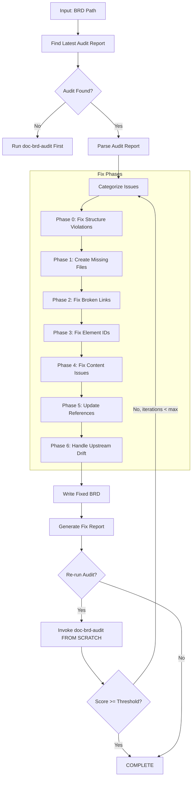
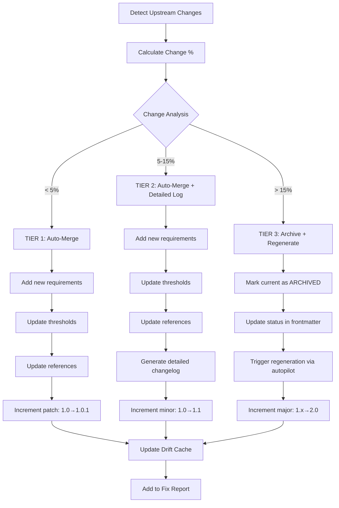
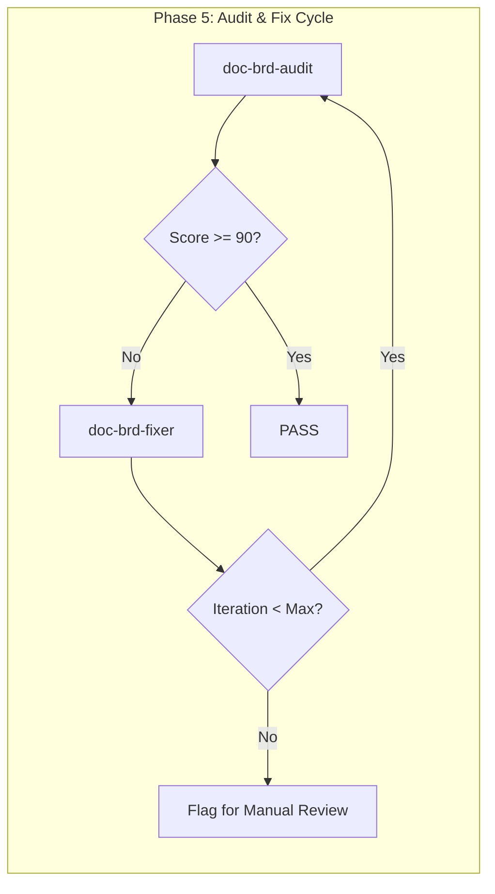

# doc-brd-fixer

## Purpose

Automated **fix skill** that reads the latest audit report and applies fixes to BRD documents. This skill bridges the gap between `doc-brd-audit` (which identifies issues) and the corrected BRD, enabling iterative improvement cycles.

**Layer**: 1 (BRD Quality Improvement)

**Upstream**: BRD document, Audit Report (`BRD-NN.A_audit_report_vNNN.md`)

**Downstream**: Fixed BRD, Fix Report (`BRD-NN.F_fix_report_vNNN.md`)

**2-Skill Model**: Only `doc-brd-audit` and `doc-brd-fixer` exist. The deprecated `doc-brd-validator` and `doc-brd-reviewer` are merged into `doc-brd-audit`.

---

## When to Use This Skill

Use `doc-brd-fixer` when:

- **After Audit**: Run after `doc-brd-audit` identifies issues (FAIL status)
- **Iterative Improvement**: Part of Audit → Fix → Audit cycle
- **Automated Pipeline**: CI/CD integration for quality gates
- **Batch Fixes**: Apply fixes to multiple BRDs based on audit reports

**Do NOT use when**:
- No audit report exists (run `doc-brd-audit` first)
- Creating new BRD (use `doc-brd` or `doc-brd-autopilot`)
- BRD already passes audit (score >= 90)

---

## Skill Dependencies

| Skill | Purpose | When Used |
|-------|---------|-----------|
| `doc-brd-audit` | Source of issues to fix (REQUIRED) | Input (reads audit report) |
| `doc-naming` | Element ID standards | Fix element IDs |
| `doc-brd` | BRD creation rules | Create missing sections |

**2-Skill Model**:
| Skill | Purpose |
|-------|---------|
| `doc-brd-audit` | All validation + scoring (runs FROM SCRATCH) |
| `doc-brd-fixer` | Apply fixes from audit report (this skill) |

**Deprecated**: `doc-brd-validator` and `doc-brd-reviewer` are merged into `doc-brd-audit`.

**Input**: Latest `BRD-NN.A_audit_report_vNNN.md`

---

## Workflow Overview



---

## Fix Phases

### Phase 0: Fix Structure Violations (CRITICAL)

Fixes BRDs that are not in nested folders. This phase runs FIRST because all subsequent phases depend on correct folder structure.

**Nested Folder Rule**: ALL BRDs MUST be in nested folders regardless of document size.

**Required Structure**:
| BRD Type | Required Location |
|----------|-------------------|
| Monolithic | `docs/01_BRD/BRD-NN_{slug}/BRD-NN_{slug}.md` |
| Sectioned | `docs/01_BRD/BRD-NN_{slug}/BRD-NN.0_index.md`, `BRD-NN.1_*.md`, etc. |

**Fix Actions**:

| Issue Code | Issue | Fix Action |
|------------|-------|------------|
| REV-STR001 | BRD not in nested folder | Create folder, move file, update all links |
| REV-STR002 | BRD folder name doesn't match BRD ID | Rename folder to match |
| REV-STR003 | Monolithic BRD >25KB should be sectioned | Flag for manual review |

**Structure Fix Workflow**:

```python
def fix_brd_structure(brd_path: str) -> list[Fix]:
    """Fix BRD structure violations."""
    fixes = []

    filename = os.path.basename(brd_path)
    parent_folder = os.path.dirname(brd_path)

    # Extract BRD ID and slug from filename
    match = re.match(r'BRD-(\d+)_([^/]+)\.md', filename)
    if not match:
        return []  # Cannot auto-fix invalid filename

    brd_id = match.group(1)
    slug = match.group(2)
    expected_folder = f"BRD-{brd_id}_{slug}"

    # Check if already in nested folder
    if os.path.basename(parent_folder) != expected_folder:
        # Create nested folder
        new_folder = os.path.join(os.path.dirname(parent_folder), expected_folder)
        os.makedirs(new_folder, exist_ok=True)

        # Move file
        new_path = os.path.join(new_folder, filename)
        shutil.move(brd_path, new_path)
        fixes.append(f"Moved {brd_path} to {new_path}")

        # Update reference links in moved file
        content = Path(new_path).read_text()
        updated_content = content.replace('../00_REF/', '../../00_REF/')
        Path(new_path).write_text(updated_content)
        fixes.append(f"Updated relative links for nested folder structure")

    return fixes
```

**Link Path Updates After Move**:

| Original Path | Updated Path |
|---------------|--------------|
| `../00_REF/foundation/spec.md` | `../../00_REF/foundation/spec.md` |
| `BRD-00_GLOSSARY.md` | `../BRD-00_GLOSSARY.md` |

---

### Phase 1: Create Missing Files

Creates files that are referenced but don't exist.

**Scope**:

| Missing File | Action | Template Used |
|--------------|--------|---------------|
| `BRD-00_GLOSSARY.md` | Create master glossary | Glossary template |
| `GAP_*.md` | Create placeholder with TODO sections | GAP template |
| Reference docs (`*_REF_*.md`) | Create placeholder | REF template |

**Glossary Template**:

```markdown
---
title: "BRD-00: Master Glossary"
tags:
  - brd
  - glossary
  - reference
custom_fields:
  document_type: glossary
  artifact_type: BRD-REFERENCE
  layer: 1
---

# BRD-00: Master Glossary

Common terminology used across all Business Requirements Documents.

## Business Terms

| Term | Definition | Context |
|------|------------|---------|
| MVP | Minimum Viable Product | Scope definition |
| SLA | Service Level Agreement | Quality requirements |
| KPI | Key Performance Indicator | Success metrics |

## Technical Terms

| Term | Definition | Context |
|------|------------|---------|
| API | Application Programming Interface | Integration |
| JWT | JSON Web Token | Authentication |
| OIDC | OpenID Connect | Identity federation |

## Domain Terms

<!-- Add project-specific terminology below -->

| Term | Definition | Context |
|------|------------|---------|
| [Term] | [Definition] | [Where used] |
```

**GAP Analysis Placeholder Template**:

```markdown
---
title: "GAP Analysis: [Module Name]"
tags:
  - gap-analysis
  - reference
custom_fields:
  document_type: gap-analysis
  status: placeholder
  created_by: doc-brd-fixer
---

# GAP Analysis: [Module Name]

> **Status**: Placeholder - Requires completion

## 1. Current State

[TODO: Document current implementation state]

## 2. Identified Gaps

| Gap ID | Description | Priority | Status |
|--------|-------------|----------|--------|
| GAP-XX-01 | [Description] | P1/P2/P3 | Open |

## 3. Remediation Plan

[TODO: Document remediation approach]

---

*Created by doc-brd-fixer as placeholder. Complete this document to resolve broken link issues.*
```

---

### Phase 2: Fix Broken Links

Updates links to point to correct locations.

**Fix Actions**:

| Issue Code | Issue | Fix Action |
|------------|-------|------------|
| REV-L001 | Broken internal link | Update path or create target file |
| REV-L002 | External link unreachable | Add warning comment, keep link |
| REV-L003 | Absolute path used | Convert to relative path |

**Path Resolution Logic**:

```python
def fix_link_path(brd_location: str, target_path: str) -> str:
    """Calculate correct relative path based on BRD location."""

    # Monolithic BRD: docs/01_BRD/BRD-01.md
    # Sectioned BRD: docs/01_BRD/BRD-01_slug/BRD-01.3_section.md

    if is_sectioned_brd(brd_location):
        # Need to go up one more level
        return "../" + calculate_relative_path(brd_location, target_path)
    else:
        return calculate_relative_path(brd_location, target_path)
```

**Glossary Link Fix**:

| BRD Type | Original Link | Fixed Link |
|----------|---------------|------------|
| Monolithic | `BRD-00_GLOSSARY.md` | `BRD-00_GLOSSARY.md` |
| Sectioned | `BRD-00_GLOSSARY.md` | `../BRD-00_GLOSSARY.md` |

---

### Phase 3: Fix Element IDs

Converts invalid element IDs to correct format.

**Conversion Rules**:

| Pattern | Issue | Conversion |
|---------|-------|------------|
| `BRD.NN.25.SS` | Code 25 invalid for BRD | Manual remap to context-appropriate valid BRD code (`23`, `24`, `22`, `08`, etc.) |
| `BO-XXX` | Legacy pattern | `BRD.NN.23.SS` |
| `FR-XXX` | Legacy pattern | `BRD.NN.01.SS` |
| `AC-XXX` | Legacy pattern | `BRD.NN.06.SS` |
| `BC-XXX` | Legacy pattern | `BRD.NN.03.SS` |

**Type Code Mapping** (BRD-specific):

| Invalid Code | Valid Code | Element Type |
|--------------|------------|--------------|
| 19 | 22 | Feature Item (deprecated 19) |
| 31 | 32 | Architecture Topic (deprecated 31) |

For code `25` in BRD context, do not auto-convert to a fixed code; classify by section semantics and remap manually.

**Regex Patterns**:

```python
# Find element IDs with invalid type codes for BRD
invalid_brd_type_25 = r'BRD\.(\d{2})\.25\.(\d{2})'
# No fixed replacement for BRD type 25; requires section-aware remapping

# Find legacy patterns
legacy_bo = r'###\s+BO-(\d+):'
legacy_fr = r'###\s+FR-(\d+):'
```

---

### Phase 4: Fix Content Issues

Addresses placeholders and incomplete content.

**Fix Actions**:

| Issue Code | Issue | Fix Action |
|------------|-------|------------|
| REV-P001 | `[TODO]` placeholder | Flag for manual completion (cannot auto-fix) |
| REV-P002 | `[TBD]` placeholder | Flag for manual completion (cannot auto-fix) |
| REV-P003 | Template date `YYYY-MM-DD` | Replace with current date |
| REV-P004 | Template name `[Name]` | Replace with metadata author or flag |
| REV-P005 | Empty section | Add minimum template content |
| REV-MVP001 | Missing `2.1 MVP Hypothesis` | Add explicit subsection with hypothesis and measurable validation signals |
| REV-MVP002 | Missing `3.2 MVP Core Features` | Add explicit subsection and checklist; preserve existing scope details |
| REV-MVP003 | Missing `9.1 MVP Launch Criteria` | Add explicit go/no-go launch gate table |
| REV-MVP004 | Missing `14.5 Approval and Sign-off` | Add stakeholder sign-off table |
| REV-MVP008 | Missing test coverage traceability | Add explicit `16.3 Test Coverage Traceability` view |
| REV-MVP010 | Missing glossary structure 17.1-17.6 | Add missing glossary subsections without deleting existing terms |

**Auto-Replacements**:

```python
replacements = {
    'YYYY-MM-DDTHH:MM:SS': datetime.now().strftime('%Y-%m-%dT%H:%M:%S'),
    'YYYY-MM-DD': datetime.now().strftime('%Y-%m-%d'),
    'MM/DD/YYYY': datetime.now().strftime('%m/%d/%Y'),
    '[Current date]': datetime.now().strftime('%Y-%m-%dT%H:%M:%S'),
}
```

#### 4.1 MVP Subsection Semantic Normalization (NEW in v2.4)

Before adding new subsections, detect equivalent headings and normalize in place to avoid duplicate content.

| Required Header | Acceptable Equivalent Patterns |
|-----------------|-------------------------------|
| `2.1 MVP Hypothesis` | `2.1 Background and Context`, `2.1 Hypothesis` |
| `3.2 MVP Core Features` | `3.2 In-Scope Items`, `3.2 Scope Items` |
| `9.1 MVP Launch Criteria` | `9.1 Business Acceptance Criteria`, `9.1 Launch Readiness` |

**Normalization Rule**:
1. If equivalent heading exists, rename heading to required canonical title.
2. Preserve existing table/list content under that section.
3. Insert template block only when section content is missing or below minimum structure.

#### 4.2 Safe Subsection Renumbering (NEW in v2.4)

When inserting missing required subsection numbers, perform deterministic renumbering for subsequent sibling subsections.

```python
def renumber_sibling_headings(content: str, section_prefix: str, insert_at: float) -> str:
  """Shift sibling subsection numbers after insertion point.
  Example: insert 9.1 -> existing 9.1 becomes 9.2, 9.2 becomes 9.3.
  """
  # 1) parse headings matching '^##\s+{section_prefix}\.\d+'
  # 2) process from highest to lowest subsection number
  # 3) increment only siblings >= insert_at
  # 4) do not modify sub-subsection identifiers beyond parent prefix
  return content
```

**Safety Constraints**:
- Apply only within same section file.
- Skip renumbering when explicit cross-reference anchors would break (flag manual review).
- Log all renumber actions in fix report.

#### 4.3 Template Compliance Contract (NEW in v2.5)

All content fixes MUST align to the canonical template:

- `docs_flow_framework/ai_dev_ssd_flow/01_BRD/BRD-MVP-TEMPLATE.md`
- `docs_flow_framework/ai_dev_ssd_flow/01_BRD/BRD-MVP-TEMPLATE.yaml`

**Canonical Subsection Anchors (MVP)**:

| Section | Required Anchors |
|---------|------------------|
| 1 | 1.1-1.4 |
| 2 | 2.1-2.5 |
| 3 | 3.1-3.5, **3.4.1**, **3.4.2** |
| 5 | 5.1-5.2 |
| 6 | 6.1-6.5 |
| 8 | 8.1-8.2 |
| 9 | 9.1-9.2 |
| 11 | 11.1-11.2 |
| 12 | 12.1-12.3 |
| 14 | 14.1-14.5 |
| 15 | 15.1-15.3 |
| 16 | 16.1-16.4 |
| 17 | 17.1-17.6 (17.5 Cross-References, 17.6 External Standards) |
| 18 | 18.1-18.5 |

If existing headings use legacy names, normalize to template-canonical labels before validation.

---

### Phase 5: Update References

Ensures traceability and cross-references are correct.

**Fix Actions**:

| Issue | Fix Action |
|-------|------------|
| Missing `@ref:` for created files | Add reference tag |
| Incorrect cross-BRD path | Update to correct relative path |
| Missing traceability entry | Add to traceability matrix |

#### 5.1 Markdown Normalization for Generated Reports (NEW in v2.4)

Normalize fixer-generated markdown artifacts to reduce lint friction.

**Scope**:
- Fix/Fix-validation report headings (`##` title under YAML frontmatter)
- Table separator style normalization
- Blank lines around lists and tables

**Applies To**:
- `BRD-NN.F_fix_report_vNNN.md`
- Any fixer-generated supplemental notes

---

### Phase 5.5: Fix Confidence Classification (NEW in v2.4)

Each fix action is tagged for downstream gating.

| Confidence | Meaning | Typical Examples |
|------------|---------|------------------|
| `auto-safe` | Deterministic structural/text fix with low semantic risk | link path correction, section header normalization, ID conversion |
| `auto-assisted` | Template insertion with partial semantic assumptions | generated launch criteria table, glossary subsection scaffolding |
| `manual-required` | Domain-specific content cannot be reliably inferred | unresolved TODO/TBD, business strategy rationale gaps |

**Fix Report Requirement**:
- Add `confidence` column in `Fixes Applied` table.
- Include summary counts by confidence level.

---

### Phase 6: Handle Upstream Configuration

Fixes upstream configuration issues before handling drift.

#### 6.0 Metadata Fixes

**FIX-M001: Add Missing deliverable_type**

**Trigger**: BRD has no `deliverable_type` in YAML frontmatter

**Fix Action**: Add `deliverable_type: code` (default) to `custom_fields`

```yaml
# Before
custom_fields:
  document_type: brd-document
  artifact_type: BRD

# After
custom_fields:
  document_type: brd-document
  artifact_type: BRD
  deliverable_type: code
```

**FIX-M002: Fix Invalid deliverable_type**

**Trigger**: `deliverable_type` value is not one of: `code`, `document`, `ux`, `risk`, `process`

**Fix Action**: Suggest correct value based on BRD content analysis or reset to `code` (default)

```yaml
# Before
custom_fields:
  deliverable_type: software  # Invalid

# After (auto-detect or default)
custom_fields:
  deliverable_type: code
```

**Content-Based Detection Logic**:

```python
def detect_deliverable_type(brd_content: str) -> str:
    """Detect appropriate deliverable_type from BRD content."""
    # Check for UX indicators
    if any(kw in brd_content.lower() for kw in ['wireframe', 'mockup', 'user interface', 'ui/ux', 'design system']):
        return 'ux'

    # Check for documentation indicators
    if any(kw in brd_content.lower() for kw in ['user guide', 'api documentation', 'technical manual', 'help content']):
        return 'document'

    # Check for risk/compliance indicators
    if any(kw in brd_content.lower() for kw in ['risk assessment', 'compliance framework', 'audit trail', 'security audit']):
        return 'risk'

    # Check for process indicators
    if any(kw in brd_content.lower() for kw in ['workflow automation', 'process improvement', 'business process', 'operational procedure']):
        return 'process'

    # Default to code
    return 'code'
```

**FIX-M003: Fix document_type for Instance**

**Trigger**: BRD instance has `document_type: template` instead of `document_type: brd-document`

**Fix Action**: Change to `brd-document`

```yaml
# Before
custom_fields:
  document_type: template  # Wrong for instance

# After
custom_fields:
  document_type: brd-document
```

---

#### 6.1 Upstream Configuration Fixes

**FIX-U001: Add Missing upstream_mode**

**Trigger**: BRD has no `upstream_mode` in YAML frontmatter

**Fix Action**: Add `upstream_mode: "none"` to `custom_fields`

```yaml
# Before
custom_fields:
  artifact_type: BRD

# After
custom_fields:
  artifact_type: BRD
  upstream_mode: "none"
```

**FIX-U002: Suggest upstream_ref_path**

**Trigger**: BRD has `@ref:` tags pointing to `00_REF/` but `upstream_mode: "none"`

**Detection**:
1. Scan BRD content for `@ref:` tags
2. Extract referenced paths
3. Determine common parent directory in `00_REF/`

**Fix Action**: Suggest updating to `upstream_mode: "ref"` with detected path

```yaml
# Suggested fix (requires confirmation)
custom_fields:
  upstream_mode: "ref"
  upstream_ref_path: "../../00_REF/source_docs/"
```

**FIX-U003: Remove Invalid upstream_ref_path**

**Trigger**: `upstream_mode: "none"` but `upstream_ref_path` is set

**Fix Action**: Remove `upstream_ref_path` field (it's ignored anyway)

```yaml
# Before
custom_fields:
  upstream_mode: "none"
  upstream_ref_path: "../../00_REF/"  # Ignored

# After
custom_fields:
  upstream_mode: "none"
```

**Metadata Fix Codes**:

| Code | Description | Auto-Fix |
|------|-------------|----------|
| FIX-M001 | Add deliverable_type: code | Yes |
| FIX-M002 | Fix invalid deliverable_type | Auto-detect or prompt |
| FIX-M003 | Fix document_type to brd-document | Yes |

**Upstream Configuration Fix Codes**:

| Code | Description | Auto-Fix |
|------|-------------|----------|
| FIX-U001 | Add upstream_mode: "none" | Yes |
| FIX-U002 | Suggest upstream_mode: "ref" with detected path | Prompt |
| FIX-U003 | Remove unnecessary upstream_ref_path | Yes |

---

#### 6.2 Hash Validation Fixes

Fixes invalid hash values in `.drift_cache.json` that prevent drift detection from working correctly.

**FIX-H001: Invalid Hash Placeholder**

| Field | Value |
|-------|-------|
| Trigger | Hash field contains placeholder instead of actual SHA-256 |
| Detection | Hash matches: `verified_no_drift`, `pending_verification`, `TBD`, or length != 64 hex |
| Severity | Error |
| Auto-Fix | Yes |

**Detection Algorithm**:
```bash
# Check for placeholder values in drift cache
grep -E '"hash":\s*"(sha256:)?(verified_no_drift|pending_verification|TBD)"' .drift_cache.json
```

**Fix Action**:
```bash
# Compute actual hash for upstream file
HASH=$(sha256sum <upstream_file_path> | cut -d' ' -f1)
# Update cache with: "hash": "sha256:$HASH"
```

**Example**:
```json
// Before (INVALID)
"hash": "sha256:pending_verification"

// After (VALID)
"hash": "sha256:a9ca05f4e9b2379465526221271672954feff29e40c57f2a91fe8a050eb46105"
```

---

**FIX-H002: Missing Hash Prefix**

| Field | Value |
|-------|-------|
| Trigger | Hash value is 64 hex chars but missing `sha256:` prefix |
| Detection | Matches `^[0-9a-f]{64}$` without prefix |
| Severity | Warning |
| Auto-Fix | Yes |

**Fix Action**: Prepend `sha256:` to existing hash value

```json
// Before
"hash": "a9ca05f4e9b2379465526221271672954feff29e40c57f2a91fe8a050eb46105"

// After
"hash": "sha256:a9ca05f4e9b2379465526221271672954feff29e40c57f2a91fe8a050eb46105"
```

---

**FIX-H003: Upstream File Not Found**

| Field | Value |
|-------|-------|
| Trigger | Cannot compute hash because upstream file does not exist |
| Detection | File at `upstream_ref_path` returns error from sha256sum |
| Severity | Error |
| Auto-Fix | Partial |

**Fix Action**:
1. Log warning: `Upstream file not found: <path>`
2. Set `drift_detected: true` in cache
3. Set hash to `sha256:FILE_NOT_FOUND`
4. Add note to manual review queue

---

**Hash Fix Codes Summary**:

| Code | Description | Auto-Fix | Severity |
|------|-------------|----------|----------|
| FIX-H001 | Replace placeholder hash with actual SHA-256 | Yes | Error |
| FIX-H002 | Add missing sha256: prefix | Yes | Warning |
| FIX-H003 | Upstream file not found | Partial | Error |

---

### Phase 6.3: Handle Upstream Drift (Auto-Merge)

Automatically merges upstream changes into the document based on change percentage thresholds.

**Note**: This phase only runs when `upstream_mode: "ref"`. When `upstream_mode: "none"` (default), drift detection is skipped.

**Drift Detection Workflow**:



---

#### 6.3.1 Change Percentage Calculation

```python
def calculate_change_percentage(upstream_old: str, upstream_new: str) -> dict:
    """
    Calculate change percentage between upstream versions.

    Returns:
        {
            'total_change_pct': float,      # Overall change percentage
            'additions_pct': float,          # New content added
            'modifications_pct': float,      # Existing content modified
            'deletions_pct': float,          # Content removed (tracked, not applied)
            'change_type': str               # 'minor' | 'moderate' | 'major'
        }
    """
    old_lines = upstream_old.strip().split('\n')
    new_lines = upstream_new.strip().split('\n')

    # Use difflib for precise change detection
    import difflib
    diff = difflib.unified_diff(old_lines, new_lines)

    additions = sum(1 for line in diff if line.startswith('+') and not line.startswith('+++'))
    deletions = sum(1 for line in diff if line.startswith('-') and not line.startswith('---'))

    total_lines = max(len(old_lines), len(new_lines))
    total_change_pct = ((additions + deletions) / total_lines) * 100 if total_lines > 0 else 0

    return {
        'total_change_pct': round(total_change_pct, 2),
        'additions_pct': round((additions / total_lines) * 100, 2) if total_lines > 0 else 0,
        'modifications_pct': round((min(additions, deletions) / total_lines) * 100, 2) if total_lines > 0 else 0,
        'deletions_pct': round((deletions / total_lines) * 100, 2) if total_lines > 0 else 0,
        'change_type': 'minor' if total_change_pct < 5 else 'moderate' if total_change_pct < 15 else 'major'
    }
```

---

#### 6.3.2 Tier 1: Auto-Merge (< 5% Change)

**Trigger**: Total change percentage < 5%

**Actions**:

| Change Type | Auto-Action | Example |
|-------------|-------------|---------|
| New requirement added | Append with generated ID | `BRD.01.0113` |
| Threshold value changed | Find & replace value | `timeout: 30 → 45` |
| Reference updated | Update `@ref:` path | Path correction |
| Version incremented | Update version reference | `v1.2 → v1.3` |

**ID Generation for New Requirements**:

```python
def generate_next_id(doc_type: str, doc_num: str, element_type: str, existing_ids: list) -> str:
    """
    Generate next sequential ID for new requirement.

    Args:
        doc_type: 'BRD', 'PRD', etc.
        doc_num: '01', '02', etc.
        element_type: '01' (Functional), '02' (Quality), etc.
        existing_ids: List of existing IDs in document

    Returns:
        Next available ID (e.g., 'BRD.01.0113')
    """
    pattern = f"{doc_type}.{doc_num}.{element_type}."
    matching = [id for id in existing_ids if id.startswith(pattern)]

    if not matching:
        return f"{pattern}01"

    max_seq = max(int(id.split('.')[-1]) for id in matching)
    return f"{pattern}{str(max_seq + 1).zfill(2)}"
```

**Auto-Merge Template for New Requirements**:

```markdown
### {GENERATED_ID}: {Requirement Title}

**Source**: Auto-merged from {upstream_doc} ({change_date})

**Requirement**: {requirement_text}

**Acceptance Criteria**:
{acceptance_criteria}

**Priority**: {priority}

<!-- AUTO-MERGED: {timestamp} from {upstream_doc}#{section} -->
```

**Version Update**:
- Increment patch version: `1.0` → `1.0.1`
- Update `last_updated` in frontmatter
- Add changelog entry

---

#### 6.3.3 Tier 2: Auto-Merge with Detailed Log (5-15% Change)

**Trigger**: Total change percentage between 5% and 15%

**Actions**: Same as Tier 1, plus:

| Additional Action | Description |
|-------------------|-------------|
| Detailed changelog | Section-by-section change log |
| Impact analysis | Which downstream artifacts affected |
| Merge markers | `<!-- MERGED: ... -->` comments |
| Version history | Detailed version history entry |

**Changelog Entry Format**:

```markdown
## Changelog

### Version 1.1 (2026-02-10T16:00:00)

**Upstream Sync**: Auto-merged 8.5% changes from upstream documents

| Change | Source | Section | Description |
|--------|--------|---------|-------------|
| Added | F1_IAM_Technical_Specification.md | 3.5 | New passkey authentication requirement |
| Updated | F1_IAM_Technical_Specification.md | 4.2 | Session timeout changed 30→45 min |
| Added | GAP_Analysis.md | GAP-F1-07 | New gap identified for WebAuthn |

**New Requirements Added**:
- BRD.01.0113: Passkey Authentication Support
- BRD.01.0114: WebAuthn Fallback Mechanism

**Thresholds Updated**:
- BRD.01.0205: session_idle_timeout: 30→45 min

**Impact**: PRD-01, EARS-01, ADR-01 may require review
```

**Version Update**:
- Increment minor version: `1.0` → `1.1`
- Update `last_updated` in frontmatter
- Add detailed changelog entry

---

#### 6.3.4 Tier 3: Archive and Regenerate (> 15% Change)

**Trigger**: Total change percentage > 15%

**Actions**:

| Step | Action | Result |
|------|--------|--------|
| 1 | Mark current version as ARCHIVED | Status update in frontmatter |
| 2 | Create archive copy | `BRD-01_v1.0_archived.md` |
| 3 | Update frontmatter status | `status: archived` |
| 4 | Trigger autopilot regeneration | New version generated |
| 5 | Increment major version | `1.x` → `2.0` |

**Archive Frontmatter Update**:

```yaml
---
title: "BRD-01: F1 Identity & Access Management"
custom_fields:
  version: "1.2"
  status: "archived"                    # Changed from 'current'
  archived_date: "2026-02-10T16:00:00"
  archived_reason: "upstream_drift_major"
  superseded_by: "BRD-01_v2.0"
  upstream_change_pct: 18.5
---
```

**Archive File Naming**:

```
docs/01_BRD/BRD-01_f1_iam/
├── BRD-01.0_index.md              # Current (v2.0)
├── BRD-01.1_core.md               # Current (v2.0)
├── .archive/
│   ├── v1.2/
│   │   ├── BRD-01.0_index.md      # Archived v1.2
│   │   ├── BRD-01.1_core.md
│   │   └── ARCHIVE_MANIFEST.md    # Archive metadata
```

**ARCHIVE_MANIFEST.md**:

```markdown
# Archive Manifest: BRD-01 v1.2

| Field | Value |
|-------|-------|
| Archived Version | 1.2 |
| Archived Date | 2026-02-10T16:00:00 |
| Reason | Upstream drift > 15% (18.5%) |
| Superseded By | v2.0 |
| Upstream Changes | F1_IAM_Technical_Specification.md (major revision) |

## Change Summary

| Upstream Document | Change % | Key Changes |
|-------------------|----------|-------------|
| F1_IAM_Technical_Specification.md | 18.5% | New auth methods, revised security model |

## Downstream Impact

Documents requiring update after regeneration:
- PRD-01 (references BRD-01)
- EARS-01 (derived from PRD-01)
- ADR-01 (architecture decisions)
```

**No Deletion Policy**:

- Upstream content marked as deleted is **NOT** removed from document
- Instead, marked with `[DEPRECATED]` status:

```markdown
### BRD.01.0105: Legacy Authentication Method [DEPRECATED]

> **Status**: DEPRECATED (upstream removed 2026-02-10T16:00:00)
> **Reason**: Replaced by BRD.01.0113 (Passkey Authentication)
> **Action**: Retain for traceability; do not implement

**Original Requirement**: {original_text}
```

---

#### 6.3.5 Drift Cache Update

After processing drift, update `.drift_cache.json`:

```json
{
  "document_version": "1.1",
  "last_synced": "2026-02-10T16:00:00",
  "sync_status": "auto-merged",
  "upstream_state": {
    "../../00_REF/foundation/F1_IAM_Technical_Specification.md": {
      "hash": "sha256:a1b2c3d4e5f6...",
      "version": "2.3",
      "last_modified": "2026-02-10T15:30:00",
      "change_pct": 4.2,
      "sync_action": "tier1_auto_merge"
    },
    "../../00_REF/foundation/GAP_Analysis.md": {
      "hash": "sha256:g7h8i9j0k1l2...",
      "version": "1.5",
      "last_modified": "2026-02-10T14:00:00",
      "change_pct": 8.7,
      "sync_action": "tier2_auto_merge_detailed"
    }
  },
  "merge_history": [
    {
      "date": "2026-02-10T16:00:00",
      "tier": 1,
      "change_pct": 4.2,
      "items_added": 1,
      "items_updated": 2,
      "version_before": "1.0",
      "version_after": "1.0.1"
    }
  ],
  "deprecated_items": [
    {
      "id": "BRD.01.0105",
      "deprecated_date": "2026-02-10T16:00:00",
      "reason": "Upstream removal",
      "replaced_by": "BRD.01.0113"
    }
  ]
}
```

---

#### 6.3.6 Fix Report: Drift Section

**Drift Summary in Fix Report**:

```markdown
## Phase 6: Upstream Drift Resolution

### Drift Analysis Summary

| Upstream Document | Change % | Tier | Action Taken |
|-------------------|----------|------|--------------|
| F1_IAM_Technical_Specification.md | 4.2% | 1 | Auto-merged |
| GAP_Analysis.md | 8.7% | 2 | Auto-merged (detailed) |
| F2_Session_Specification.md | 18.5% | 3 | Archived + Regenerated |

### Tier 1 Auto-Merges (< 5%)

| ID | Type | Source | Description |
|----|------|--------|-------------|
| BRD.01.0113 | Added | F1_IAM:3.5 | Passkey authentication support |
| BRD.01.0205 | Updated | F1_IAM:4.2 | Session timeout 30→45 min |

### Tier 2 Auto-Merges (5-15%)

| ID | Type | Source | Description |
|----|------|--------|-------------|
| BRD.01.0114 | Added | GAP:GAP-F1-07 | WebAuthn fallback mechanism |
| BRD.01.0704 | Added | GAP:GAP-F1-08 | New risk: credential phishing |

### Tier 3 Archives (> 15%)

| Document | Previous Version | New Version | Reason |
|----------|------------------|-------------|--------|
| BRD-01.2_requirements.md | 1.2 | 2.0 | 18.5% upstream change |

**Archive Location**: `docs/01_BRD/BRD-01_f1_iam/.archive/v1.2/`

### Deprecated Items (No Deletion)

| ID | Deprecated Date | Reason | Replaced By |
|----|-----------------|--------|-------------|
| BRD.01.0105 | 2026-02-10T16:00:00 | Upstream removed | BRD.01.0113 |

### Version Changes

| File | Before | After | Change Type |
|------|--------|-------|-------------|
| BRD-01.1_core.md | 1.0 | 1.0.1 | Patch (Tier 1) |
| BRD-01.2_requirements.md | 1.0 | 1.1 | Minor (Tier 2) |
| BRD-01.3_quality_ops.md | 1.2 | 2.0 | Major (Tier 3) |
```

---

## Command Usage

### Basic Usage

```bash
# Fix BRD based on latest review
/doc-brd-fixer BRD-01

# Fix with explicit review report
/doc-brd-fixer BRD-01 --review-report BRD-01.R_review_report_v001.md

# Fix and re-run review
/doc-brd-fixer BRD-01 --revalidate

# Fix with iteration limit
/doc-brd-fixer BRD-01 --revalidate --max-iterations 3
```

### Options

| Option | Default | Description |
|--------|---------|-------------|
| `--review-report` | latest | Specific review report to use |
| `--revalidate` | false | Run reviewer after fixes |
| `--max-iterations` | 3 | Max fix-review cycles |
| `--fix-types` | all | Specific fix types (comma-separated) |
| `--create-missing` | true | Create missing reference files |
| `--backup` | true | Backup BRD before fixing |
| `--dry-run` | false | Preview fixes without applying |
| `--normalize-markdown` | true | Normalize generated report markdown style |
| `--acknowledge-drift` | false | Interactive drift acknowledgment mode |
| `--update-drift-cache` | true | Update .drift_cache.json after fixes |

### Fix Types

| Type | Description |
|------|-------------|
| `missing_files` | Create missing glossary, GAP, reference docs |
| `broken_links` | Fix link paths |
| `element_ids` | Convert invalid/legacy element IDs |
| `content` | Fix placeholders, dates, names |
| `references` | Update traceability and cross-references |
| `drift` | Handle upstream drift detection issues |
| `all` | All fix types (default) |

---

## Report Cleanup Policy (MANDATORY)

**After generating a new fix report, delete all previous fix reports.** Old reports serve no purpose since:
- Each fix cycle produces a complete new report
- Only the latest report reflects current document state
- Multiple old reports clutter the BRD folder

### Cleanup Rules

| File Pattern | Action | Reason |
|--------------|--------|--------|
| `BRD-NN.F_fix_report_v*.md` (older versions) | **DELETE** | Superseded by new fix report |
| `BRD-NN.A_audit_report_v*.md` | **KEEP** | Managed by `doc-brd-audit` |
| `.drift_cache.json` | **KEEP** | Tracks review/fix history metadata |

### Cleanup Execution

After writing the new fix report, run:

```bash
# In the BRD folder (e.g., docs/01_BRD/BRD-50_octo_agent_orchestration/)
BRD_FOLDER="$1"
NEW_REPORT="$2"  # e.g., BRD-50.F_fix_report_v003.md

# Delete old fix reports (keep only the new one)
find "${BRD_FOLDER}" -name "BRD-*.F_fix_report_v*.md" ! -name "$(basename ${NEW_REPORT})" -delete
```

### Cleanup Confirmation

The fix report should include a cleanup summary:

```markdown
## Cleanup Summary
- Deleted: 2 old fix reports (v001, v002)
```

---

## Output Artifacts

### Fix Report

**Nested Folder Rule**: ALL BRDs use nested folders (`BRD-NN_{slug}/`) regardless of size. Fix reports are stored alongside the BRD document in the nested folder.

**File Naming**: `BRD-NN.F_fix_report_vNNN.md`

**Location**: Inside the BRD nested folder: `docs/01_BRD/BRD-NN_{slug}/`

**Structure**:

```markdown
---
title: "BRD-NN.F: Fix Report v001"
tags:
  - brd
  - fix-report
  - quality-assurance
custom_fields:
  document_type: fix-report
  artifact_type: BRD-FIX
  layer: 1
  parent_doc: BRD-NN
  source_review: BRD-NN.R_review_report_v001.md
  fix_date: "YYYY-MM-DDTHH:MM:SS"
  fix_tool: doc-brd-fixer
  fix_version: "1.0"
---

# BRD-NN Fix Report v001

## Summary

| Metric | Value |
|--------|-------|
| Source Review | BRD-NN.R_review_report_v001.md |
| Issues in Review | 12 |
| Issues Fixed | 10 |
| Issues Remaining | 2 (manual review required) |
| Files Created | 2 |
| Files Modified | 4 |

## Files Created

| File | Type | Location |
|------|------|----------|
| BRD-00_GLOSSARY.md | Master Glossary | docs/01_BRD/ |
| GAP_Foundation_Module_Gap_Analysis.md | GAP Placeholder | docs/00_REF/foundation/ |

## Fixes Applied

| # | Issue Code | Issue | Fix Applied | File |
|---|------------|-------|-------------|------|
| 1 | REV-L001 | Broken glossary link | Created BRD-00_GLOSSARY.md | BRD-01.3_quality_ops.md |
| 2 | REV-L001 | Broken GAP link | Created placeholder GAP file | BRD-01.1_core.md |
| 3 | REV-N004 | Element type 25 invalid | Manual remap using section context | BRD-01.1_core.md |
| 4 | REV-L003 | Absolute path used | Converted to relative | BRD-01.2_requirements.md |

## Issues Requiring Manual Review

| # | Issue Code | Issue | Location | Reason |
|---|------------|-------|----------|--------|
| 1 | REV-P001 | [TODO] placeholder | BRD-01.2:L45 | Domain knowledge needed |
| 2 | REV-R001 | Missing acceptance criteria | BRD-01.2:L120 | Business input required |

## Validation After Fix

| Metric | Before | After | Delta |
|--------|--------|-------|-------|
| Review Score | 92 | 97 | +5 |
| Errors | 2 | 0 | -2 |
| Warnings | 4 | 1 | -3 |

## Next Steps

1. Run unified BRD core validation wrapper:
  `bash ai_dev_ssd_flow/01_BRD/scripts/validate_brd_wrapper.sh docs/01_BRD --skip-advisory`
2. Complete GAP_Foundation_Module_Gap_Analysis.md placeholder
3. Address remaining [TODO] placeholders
4. Run `/doc-brd-audit BRD-01` to verify fixes
```

---

## Integration with Autopilot

This skill is invoked by `doc-brd-autopilot` in the Audit → Fix cycle:



**Autopilot Integration Points**:

| Phase | Action | Skill |
|-------|--------|-------|
| Phase 5a | Run initial audit | `doc-brd-audit` |
| Phase 5b | Apply fixes if issues found | `doc-brd-fixer` |
| Phase 5c | Re-run unified core validation wrapper | `validate_brd_wrapper.sh` |
| Phase 5d | Re-run audit | `doc-brd-audit` |
| Phase 5e | Repeat until pass or max iterations | Loop |

---

## Diagram Contract Fix Rules

Apply these fixes when reviewer/audit reports include diagram contract findings.

| Issue Code | Fix Action |
|------------|------------|
| REV-DC001 | Insert missing mandatory BRD tags: `@diagram: c4-l1` and `@diagram: dfd-l0` |
| REV-DC002 | If sequence diagram exists, insert one sequence contract tag: `@diagram: sequence-sync|sequence-async|sequence-error` |
| REV-DC003 | Add missing intent header fields above mandatory diagram blocks: `diagram_type`, `level`, `scope_boundary`, `upstream_refs`, `downstream_refs` |
| REV-DC004 | Add trust-boundary annotation where data-boundary movement is described |

**Safety Rule**:
- Do not rewrite diagram logic unless syntax is invalid.
- Prefer minimal edits to headers/tags and preserve existing narrative semantics.

---

## Error Handling

### Recovery Actions

| Error | Action |
|-------|--------|
| Audit report not found | Prompt to run `doc-brd-audit` first |
| Cannot create file (permissions) | Log error, continue with other fixes |
| Cannot parse review report | Abort with clear error message |
| Max iterations exceeded | Generate report, flag for manual review |

### Backup Strategy

Before applying any fixes:

1. Create backup in `tmp/backup/BRD-NN_YYYYMMDD_HHMMSS/`
2. Copy all BRD files to backup location
3. Apply fixes to original files
4. If error during fix, restore from backup

---

## Related Skills

| Skill | Relationship |
|-------|--------------|
| `doc-brd-audit` | Provides audit report (input) - unified validation + scoring |
| `doc-brd-autopilot` | Orchestrates Audit → Fix cycle |
| `doc-naming` | Element ID standards |
| `doc-brd` | BRD creation rules |

**2-Skill Model**: Only `doc-brd-audit` and `doc-brd-fixer` are active. The deprecated `doc-brd-validator` and `doc-brd-reviewer` are merged into `doc-brd-audit`.

---

## Version History

| Version | Date | Changes |
|---------|------|---------|
| 3.1 | 2026-03-05 | **Metadata Fixes**: Added Phase 6.0 for deliverable_type validation fixes (FIX-M001, FIX-M002, FIX-M003); Auto-detects deliverable_type from content (`code`, `document`, `ux`, `risk`, `process`); Fixes document_type for instances; Renumbered Phase 6 subsections (6.1→6.1, 6.0.1→6.2, 6.1→6.3) |
| 3.0 | 2026-03-05 | **Report Cleanup Policy**: Added mandatory cleanup of old fix reports after generating new one; Deletes previous `BRD-NN.F_fix_report_v*.md` files; Added cleanup summary section to fix report |
| 2.9 | 2026-03-01 | **2-Skill Model**: Updated Related Skills to reference `doc-brd-audit` only; deprecated `doc-brd-validator` and `doc-brd-reviewer` merged into unified audit |
| 2.7 | 2026-02-28 | **Standardized validator parity**: Removed `25→33` auto-conversion guidance; code `25` in BRD now requires manual context-based remapping to valid BRD codes, aligned with `validate_standardized_element_codes.py`. |
| 2.6 | 2026-02-27 | **Hash Validation Fixes**: Added Section 6.0.1 with FIX-H001 (placeholder replacement via sha256sum), FIX-H002 (missing prefix), FIX-H003 (file not found); Auto-fix invalid hash placeholders like `verified_no_drift` and `pending_verification` |
| 1.2 | 2026-02-26 | **Unified template-based versioning**: Skill version now tracks `ai_dev_ssd_flow/01_BRD/BRD-MVP-TEMPLATE` schema version for reviewer/fixer/autopilot consistency. |
| 2.5 | 2026-02-26 | **Template contract enforcement**: Added explicit compliance anchors to `ai_dev_ssd_flow/01_BRD/BRD-MVP-TEMPLATE.md` + YAML variant; required subsection map now includes 3.4.1/3.4.2, 12.1-12.3, and 18.1-18.5 for fixer normalization and insertion logic. |
| 2.4 | 2026-02-26 | **Fix quality upgrade**: Added semantic normalization for MVP subsection headers (REV-MVP001/002/003), safe sibling subsection renumbering, explicit auto-fixes for REV-MVP004/008/010, markdown normalization for generated fix artifacts, and confidence tagging (`auto-safe`, `auto-assisted`, `manual-required`) for each applied fix. |
| 2.3 | 2026-02-25 | **Template alignment**: Updated for 18-section structure with sections 12 (Support), 14 (Governance/Approval), 15 (QA), 16 (Traceability 16.1-16.4), 17 (Glossary 17.1-17.6); Added fixes for missing section subsections |
| 2.2 | 2026-02-24T21:30:00 | **Upstream Configuration Fixes**: Added Phase 6.0 for upstream_mode fixes (FIX-U001, FIX-U002, FIX-U003); Detects @ref: tags and suggests upstream_mode: "ref"; Cleans up ignored upstream_ref_path when mode is "none" |
| 2.1 | 2026-02-11 | **Structure Compliance**: Added Phase 0 for nested folder rule enforcement (REV-STR001-STR003); Runs FIRST before other fix phases |
| 2.0 | 2026-02-10T16:00:00 | **Major**: Implemented tiered auto-merge system - Tier 1 (<5%): auto-merge additions/updates; Tier 2 (5-15%): auto-merge with detailed changelog; Tier 3 (>15%): archive current version and trigger regeneration; No deletion policy (mark as DEPRECATED instead); Auto-generated IDs for new requirements; Archive manifest creation; Enhanced drift cache with merge history |
| 1.1 | 2026-02-10T14:30:00 | Added Phase 6: Handle Upstream Drift - processes REV-D001-D005 issues from reviewer Check #9; drift marker insertion; drift cache management; acknowledgment workflow |
| 1.0 | 2026-02-10T12:00:00 | Initial skill creation; 5-phase fix workflow; Glossary and GAP file creation; Element ID conversion (type 25→33); Broken link fixes; Integration with autopilot Review→Fix cycle |

---
> Converted and distributed by [TomeVault](https://tomevault.io/claim/vladm3105) — claim your Tome and manage your conversions.
<!-- tomevault:4.0:skill_md:2026-04-11 -->
