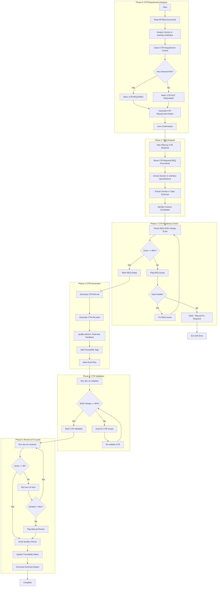
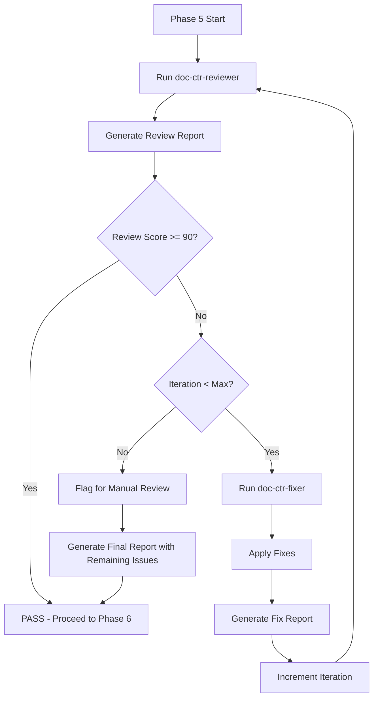
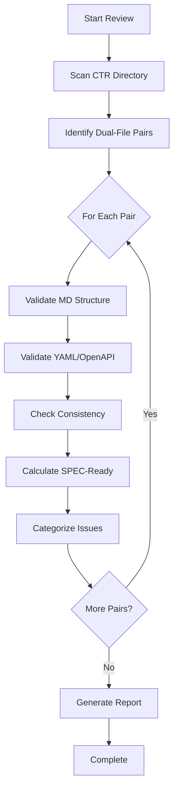
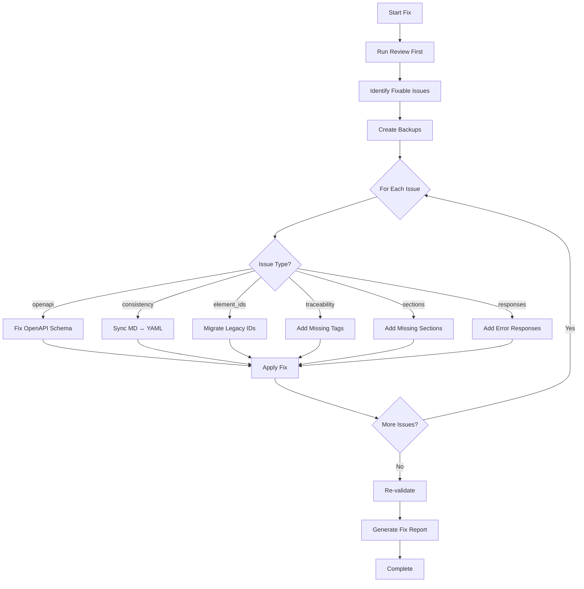

# doc-ctr-autopilot

## Purpose

Automated **Data Contracts (CTR)** generation pipeline that first analyzes which modules require CTR documents, then processes REQ documents to generate dual-file contracts (markdown + YAML) with SPEC-Ready scoring.

**Layer**: 8 (Optional layer for API/data contracts)

**Upstream**: REQ (Layer 7) - Section 3 Interface Specifications, Section 4 Data Schemas

**Downstream**: SPEC (Layer 9), TSPEC (Layer 10), TASKS (Layer 11)

---

## Input Contract (IPLAN-004 Standard)

- Supported modes:
  - `--ref <path>`
  - `--prompt "<text>"`
  - `--iplan <path|IPLAN-NNN>`
- Precedence: `--iplan > --ref > --prompt`
- IPLAN resolution order:
  1. Use explicit file path when it exists
  2. Resolve `work_plans/IPLAN-NNN*.md`
  3. Resolve `governance/plans/IPLAN-NNN*.md`
  4. If multiple matches exist, fail with disambiguation request
- Merge conflict rule:
  - Objective/scope conflicts between primary and supplemental sources are blocking and require user clarification.

---

## Input Contract (IPLAN-004 Standard)

- Supported modes:
  - `--ref <path>`
  - `--prompt "<text>"`
  - `--iplan <path|IPLAN-NNN>`
- Precedence: `--iplan > --ref > --prompt`
- IPLAN resolution order:
  1. Use explicit file path when it exists
  2. Resolve `work_plans/IPLAN-NNN*.md`
  3. Resolve `governance/plans/IPLAN-NNN*.md`
  4. If multiple matches exist, fail with disambiguation request
- Merge conflict rule:
  - Objective/scope conflicts between primary and supplemental sources are blocking and require user clarification.

---

## Skill Dependencies

| Skill | Purpose | Phase |
|-------|---------|-------|
| `doc-naming` | Element ID format (CTR.NN.xxxx, codes 16, 17, 20) | All Phases |
| `doc-req-validator` | Validate REQ SPEC-Ready score | Phase 2 |
| `doc-ctr` | CTR creation rules, dual-file format | Phase 3 |
| `quality-advisor` | Real-time quality feedback | Phase 3 |
| `doc-ctr-validator` | Validation with SPEC-Ready scoring | Phase 4 |
| `doc-ctr-reviewer` | Content review, link validation, quality scoring | Phase 5: Review |
| `doc-ctr-fixer` | Apply fixes from review report, create missing files | Phase 5: Fix |

---

## Document Type Contract (MANDATORY)

When generating CTR document instances, the autopilot MUST:

1. **Read** `instance_document_type` from template:
   - Source: `ai_dev_ssd_flow/08_CTR/CTR-MVP-TEMPLATE.yaml`
   - Field: `metadata.instance_document_type: "ctr-document"`

2. **Set** `document_type` in generated document frontmatter:
   ```yaml
   custom_fields:
     document_type: ctr-document    # NOT "template"
     artifact_type: CTR
     layer: 8
   ```

3. **Validation**: Generated documents MUST have `document_type: ctr-document`
   - Templates have `document_type: template`
   - Instances have `document_type: ctr-document`
   - Schema validates both values

**Error Handling**: If `instance_document_type` is missing from template, default to `ctr-document`.

---

## Smart Document Detection

The autopilot automatically determines the action based on the input document type.

### Input Type Recognition

| Input | Detected As | Action |
|-------|-------------|--------|
| `CTR-NN` | Self type | Review existing CTR document |
| `REQ-NN` | Upstream type | Generate if missing, review if exists |

### Detection Algorithm

```
1. Parse input: Extract TYPE and NN from "{TYPE}-{NN}"
2. Determine action:
   - IF TYPE == "CTR": Review Mode
   - ELSE IF TYPE == "REQ": Generate/Find Mode
   - ELSE: Error (invalid type for this autopilot)
3. For Generate/Find Mode:
   - Check: Does CTR-{NN} exist in docs/08_CTR/?
   - IF exists: Switch to Review Mode for CTR-{NN}
   - ELSE: Proceed with Generation from REQ-{NN}
```

### File Existence Check

```bash
# Check for nested folder structure (mandatory)
ls docs/08_CTR/CTR-{NN}_*/
```

### Examples

```bash
# Review mode (same type - CTR input)
/doc-ctr-autopilot CTR-01           # Reviews existing CTR-01

# Generate/Find mode (upstream type - REQ input)
/doc-ctr-autopilot REQ-01           # Generates CTR-01 if missing, or reviews existing CTR-01

# Multiple inputs
/doc-ctr-autopilot REQ-01,REQ-02    # Generates/reviews CTR-01 and CTR-02
/doc-ctr-autopilot CTR-01,CTR-02    # Reviews CTR-01 and CTR-02
```

### Action Determination Output

```
Input: REQ-01
├── Detected Type: REQ (upstream)
├── Expected CTR: CTR-01
├── CTR Exists: Yes → docs/08_CTR/CTR-01_f1_iam/
└── Action: REVIEW MODE - Running doc-ctr-reviewer on CTR-01

Input: REQ-05
├── Detected Type: REQ (upstream)
├── Expected CTR: CTR-05
├── CTR Exists: No
└── Action: GENERATE MODE - Creating CTR-05 from REQ-05

Input: CTR-03
├── Detected Type: CTR (self)
└── Action: REVIEW MODE - Running doc-ctr-reviewer on CTR-03
```

---

## Workflow Overview



---

## Detailed Workflow

### Phase 0: CTR Requirement Analysis (MANDATORY FIRST STEP)

Determine which REQ documents require CTR (Data Contracts) generation.

**IMPORTANT**: Not all modules need CTR documents. CTR is only required for modules with external-facing APIs or contracts.

#### CTR Requirement Criteria

| Criterion | Detection Method | CTR Required? |
|-----------|------------------|---------------|
| **REST API Endpoints** | Section 4 contains `Endpoint:` or HTTP methods with `/api/` paths | ✅ YES |
| **SSE/Streaming APIs** | Section 4 contains SSE, streaming, or `/chat` endpoints | ✅ YES |
| **Webhook Contracts** | Section 4 contains webhook configurations or `/webhooks/` | ✅ YES |
| **A2A Gateway** | Section 4 contains `/a2a/` or agent-to-agent protocols | ✅ YES |
| **External Integration** | Section 4 references external service contracts | ✅ YES |
| **Internal Protocol Only** | Section 3.4 has Python Protocol, no HTTP endpoints | ❌ NO |
| **Infrastructure Only** | No client-facing APIs, internal infrastructure | ❌ NO |
| **Prometheus /metrics** | Only `/metrics` endpoint (standard Prometheus format) | ❌ NO |
| **Frontend Consumer** | Consumes APIs but doesn't define backend APIs | ❌ NO |
| **Internal Middleware** | Security/validation middleware, no external API | ❌ NO |

#### CTR Requirement Keywords (Detection Patterns)

**POSITIVE Indicators** (CTR Required):
```regex
# REST API patterns
Endpoint:\s*(POST|GET|PUT|DELETE|PATCH)
(POST|GET|PUT|DELETE|PATCH)\s+/api/
/api/v[0-9]+/

# Streaming patterns
SSE|Server-Sent Events
/chat|/stream
EventSource|text/event-stream

# Webhook patterns
/webhooks/
webhook.*configuration
webhook.*endpoint

# Contract patterns
OpenAPI|openapi:
Request:|Response:
Response \(Success\):|Response \(Error\):
```

**NEGATIVE Indicators** (CTR NOT Required):
```regex
# Internal only
internal only|internal interface|internal use
consumed by|consumer of

# Standard endpoints (no contract needed)
/metrics|/health|/ready|/live

# Infrastructure
infrastructure platform|internal platform
repository pattern|storage layer

# Middleware
middleware|security layer|validation layer
```

#### Phase 0 Execution Steps

1. **Read All REQ Documents**
   ```bash
   # Read docs/07_REQ/REQ-*.md files
   ```

2. **For Each REQ Document, Check**:
   - Does Section 4 (Interface Definition) contain HTTP endpoints?
   - Does Section 4.1 (API Contract) define request/response formats?
   - Are there external-facing API surfaces?

3. **Generate CTR Requirement Matrix**:

```markdown
## CTR Requirement Analysis Matrix

| REQ ID | Module | Has External API? | Key Indicators | CTR Required? |
|--------|--------|-------------------|----------------|---------------|
| REQ-01 | F1 IAM | ✅ | `POST /api/v1/auth/login`, `POST /api/v1/auth/refresh` | ✅ YES |
| REQ-02 | F2 Session | ✅ | `POST /api/v1/sessions`, session management endpoints | ✅ YES |
| REQ-03 | F3 Observability | ❌ | Only `/metrics` (Prometheus standard) | ❌ NO |
| REQ-04 | F4 SecOps | ❌ | Internal security operations, audit APIs internal | ❌ NO |
| REQ-05 | F5 SelfOps | ❌ | Internal automation, health checks internal | ❌ NO |
| REQ-06 | F6 Infrastructure | ❌ | Internal infrastructure platform | ❌ NO |
| REQ-07 | F7 Config | ❌ | Internal configuration management | ❌ NO |
| REQ-08 | D1 Agent Orch | ✅ | AG-UI SSE `/api/v1/chat`, streaming protocol | ✅ YES |
| REQ-09 | D2 Cost Analytics | ✅ | `/api/v1/costs/*` query endpoints | ✅ YES |
| REQ-10 | D3 User Experience | ❌ | Frontend - consumes APIs, no backend | ❌ NO |
| REQ-11 | D4 Multi-Cloud | ❌ | Internal cloud integration layer | ❌ NO |
| REQ-12 | D5 Data Persistence | ❌ | Internal storage, repository pattern | ❌ NO |
| REQ-13 | D6 REST APIs | ✅ | Primary API gateway, all external endpoints | ✅ YES |
| REQ-14 | D7 Security | ❌ | Internal security middleware | ❌ NO |
```

4. **Present Summary and Request Confirmation**:

```markdown
## Phase 0 Complete: CTR Requirement Analysis

### Modules Requiring CTR (External APIs)

| CTR ID | Source REQ | Module | Key API Surfaces |
|--------|------------|--------|------------------|
| CTR-01 | REQ-01 | F1 IAM | Authentication, token refresh, session APIs |
| CTR-02 | REQ-02 | F2 Session | Session CRUD, context management |
| CTR-08 | REQ-08 | D1 Agent Orch | AG-UI SSE streaming, chat endpoints |
| CTR-09 | REQ-09 | D2 Cost Analytics | Cost query, breakdown, forecast endpoints |
| CTR-13 | REQ-13 | D6 REST APIs | Full API gateway (aggregates all endpoints) |

### Modules NOT Requiring CTR (Internal Only)

| REQ ID | Module | Reason |
|--------|--------|--------|
| REQ-03 | F3 Observability | Prometheus /metrics only (standard format) |
| REQ-04 | F4 SecOps | Internal security operations |
| REQ-05 | F5 SelfOps | Internal automation |
| REQ-06 | F6 Infrastructure | Internal platform |
| REQ-07 | F7 Config | Internal configuration |
| REQ-10 | D3 User Experience | Frontend consumer |
| REQ-11 | D4 Multi-Cloud | Internal integration |
| REQ-12 | D5 Data Persistence | Internal storage |
| REQ-14 | D7 Security | Internal middleware |

### Summary
- **CTR Required**: 5 modules
- **CTR Not Required**: 9 modules
- **Total CTR Documents to Generate**: 5 (dual-file: 10 files total)

Proceed with CTR generation for 5 modules? [Y/n]
```

---

### Phase 1: REQ Analysis

Extract interface and data schema information from **CTR-required** REQ documents only.

**REQ Sections to Extract**:

| REQ Section | Content | CTR Element |
|-------------|---------|-------------|
| Section 3.4: Interface Protocol | Python Protocol interfaces | Reference only |
| Section 4.1: API Contract | HTTP endpoints, request/response | CTR.NN.16.SS (Interface) |
| Section 4.2: Data Schema | Pydantic models, JSON Schema | CTR.NN.17.SS (Data Model) |
| Section 5: Error Handling | Error responses, RFC 7807 | CTR.NN.20.SS (Contract Clause) |

---

### Phase 2: CTR Readiness Check

Validate that source REQ documents meet quality thresholds.

**Validation Criteria**:
- REQ SPEC-Ready Score ≥ 90%
- REQ CTR-Ready Score ≥ 90%
- Section 4 (Interface Definition) complete
- Error catalog defined in Section 5

---

### Phase 3: CTR Generation

Generate dual-file contracts for each CTR-required module.

**Dual-File Structure** (ALWAYS use nested folders):

```
docs/08_CTR/
├── CTR-01_f1_iam_api/
│   ├── CTR-01_f1_iam_api.md         # Documentation file
│   ├── CTR-01_f1_iam_api.yaml       # OpenAPI specification
│   ├── CTR-01.R_review_report_v001.md
│   ├── CTR-01.F_fix_report_v001.md
│   └── .drift_cache.json
├── CTR-02_f2_session_api/
│   ├── CTR-02_f2_session_api.md
│   └── CTR-02_f2_session_api.yaml
├── CTR-08_d1_agent_api/
│   ├── CTR-08_d1_agent_api.md
│   └── CTR-08_d1_agent_api.yaml
└── ...
```

**Nested Folder Rule**: ALL CTRs use nested folders (`CTR-NN_{slug}/`) regardless of size. This keeps dual files (.md + .yaml) and companion files (review reports, fix reports, drift cache) organized together.

**Markdown File Structure** (CTR-NN_{slug}.md):
- Document Control
- Contract Overview
- Business Context
- Interface Documentation
- Usage Examples
- Error Handling
- Traceability

**YAML File Structure** (CTR-NN_{slug}.yaml):
```yaml
openapi: "3.0.3"
info:
  title: "Contract Title"
  version: "1.0.0"
  description: "Contract description"
  contact:
    name: "API Team"
servers:
  - url: "https://api.example.com/v1"
paths:
  /api/v1/resource:
    get:
      operationId: getResource
      summary: "Get resource"
      security:
        - bearerAuth: []
      responses:
        '200':
          description: Success
          content:
            application/json:
              schema:
                $ref: '#/components/schemas/ResourceModel'
        '401':
          $ref: '#/components/responses/Unauthorized'
components:
  securitySchemes:
    bearerAuth:
      type: http
      scheme: bearer
      bearerFormat: JWT
  schemas:
    ResourceModel:
      type: object
      properties: {}
  responses:
    Unauthorized:
      description: Authentication required
      content:
        application/problem+json:
          schema:
            $ref: '#/components/schemas/ProblemDetails'
```

### Cumulative Tags (7 Required)

```markdown
@brd: BRD-NN
@prd: PRD-NN
@ears: EARS-NN
@bdd: BDD-NN
@adr: ADR-NN
@sys: SYS-NN
@req: REQ-NN
```

---

### Phase 4: CTR Validation

Run `doc-ctr-validator` on each generated CTR document.

**Validation Criteria**:
- SPEC-Ready Score ≥ 90%
- OpenAPI schema valid
- All endpoints documented
- Error responses complete
- Security schemes defined

---

### Phase 5: Review & Fix Cycle (v2.3)

Iterative review and fix cycle to ensure CTR quality before completion.



#### 5.1 Initial Review

Run `doc-ctr-reviewer` to identify issues.

```bash
/doc-ctr-reviewer CTR-NN
```

**Output**: `CTR-NN.R_review_report_v001.md`

#### 5.2 Fix Cycle

If review score < 90%, invoke `doc-ctr-fixer`.

```bash
/doc-ctr-fixer CTR-NN --revalidate
```

**Fix Categories**:

| Category | Fixes Applied |
|----------|---------------|
| Missing Files | Create glossary, reference docs |
| Broken Links | Update paths, create targets |
| Element IDs | Convert legacy patterns, fix invalid type codes |
| OpenAPI | Fix schema references, add missing responses |
| Dual-File Sync | Synchronize MD and YAML content |
| Traceability | Update cumulative tags |

**Output**: `CTR-NN.F_fix_report_v001.md`

#### 5.3 Re-Review

After fixes, automatically re-run reviewer.

```bash
/doc-ctr-reviewer CTR-NN
```

**Output**: `CTR-NN.R_review_report_v002.md`

#### 5.4 Iteration Control

| Parameter | Default | Description |
|-----------|---------|-------------|
| `max_iterations` | 3 | Maximum fix-review cycles |
| `target_score` | 90 | Minimum passing score |
| `stop_on_manual` | false | Stop if only manual issues remain |

**Iteration Example**:

```
Iteration 1:
  Review v001: Score 85 (2 errors, 4 warnings)
  Fix v001: Fixed 5 issues, created 1 file

Iteration 2:
  Review v002: Score 94 (0 errors, 2 warnings)
  Status: PASS (score >= 90)
```

#### 5.5 Quality Checks (Post-Fix)

After passing the fix cycle:

1. **Dual-File Consistency**:
   - MD and YAML files synchronized
   - All endpoints documented in both files
   - Schema definitions match

2. **OpenAPI Compliance**:
   - Valid OpenAPI 3.0.3 schema
   - All operations have operationId
   - Error responses complete (401, 403, 500)

3. **Element ID Compliance** (per `doc-naming` skill):
   - All IDs use CTR.NN.xxxx format
   - Element type codes valid for CTR (16, 17, 20)
   - No legacy patterns (IF-XXX, DM-XXX, CC-XXX)

4. **SPEC-Ready Report**:
   ```
   SPEC-Ready Score Breakdown
   =========================
   OpenAPI Validity:       25/25
   Schema Completeness:    18/20
   Error Responses:        15/15
   Security Schemes:       15/15
   Dual-File Consistency:  10/10
   Traceability (7 tags):  10/10
   Element IDs:            5/5
   ----------------------------
   Total SPEC-Ready Score: 98/100 (Target: >= 90)
   Status: READY FOR SPEC GENERATION
   ```

5. **Traceability Matrix Update**:
   ```bash
   # Update CTR traceability
   python ai_dev_flow/scripts/update_traceability_matrix.py \
     --ctr docs/08_CTR/CTR-NN_{slug}.md \
     --matrix docs/08_CTR/CTR-00_TRACEABILITY_MATRIX.md
   ```

---

## Element Type Codes

| Code | Element Type | Example |
|------|--------------|---------|
| 16 | Interface | CTR.01.1601 |
| 17 | Data Model | CTR.01.1701 |
| 20 | Contract Clause | CTR.01.2001 |

---

## Configuration

### Default Configuration

```yaml
ctr_autopilot:
  version: "2.0"

  phase0:
    enabled: true  # Always analyze CTR requirements first
    user_confirmation: true  # Pause for user approval

  scoring:
    spec_ready_min: 90
    ctr_ready_min: 90
    strict_mode: false

  execution:
    max_parallel: 3        # HARD LIMIT - do not exceed
    chunk_size: 3          # Documents per chunk
    pause_between_chunks: true
    auto_fix: true
    continue_on_error: false
    timeout_per_req: 180  # seconds

  output:
    dual_file: true  # md + yaml
    report_format: markdown

  validation:
    skip_validation: false
    fix_iterations_max: 3
```

---

## Context Management

### Chunked Parallel Execution (MANDATORY)

**CRITICAL**: To prevent conversation context overflow errors ("Prompt is too long", "Conversation too long"), all autopilot operations MUST follow chunked execution rules:

**Chunk Size Limit**: Maximum 3 documents per chunk

**Chunking Rules**:

1. **Chunk Formation**: Group CTR-required modules into chunks of maximum 3 at a time
2. **Sequential Chunk Processing**: Process one chunk at a time, completing all documents in a chunk before starting the next
3. **Context Pause**: After completing each chunk, provide a summary and pause for user acknowledgment
4. **Progress Tracking**: Display chunk progress (e.g., "Chunk 2/2: Processing CTR-08, CTR-09, CTR-13...")

**Why Chunking is Required**:

- Prevents "Conversation too long" errors during batch processing
- Allows context compaction between chunks
- Enables recovery from failures without losing all progress
- Provides natural checkpoints for user review

**Chunk Completion Template**:

```markdown
## Chunk N/M Complete

Generated:
- CTR-XX: SPEC-Ready Score 94% (md + yaml)
- CTR-YY: SPEC-Ready Score 92% (md + yaml)
- CTR-ZZ: SPEC-Ready Score 95% (md + yaml)

Proceeding to next chunk...
```

---

## Command Usage

### Analyze CTR Requirements Only
```bash
/doc-ctr-autopilot --analyze
```
Runs Phase 0 only, outputs CTR Requirement Matrix without generating files.

### Generate CTR for Specific Modules
```bash
/doc-ctr-autopilot REQ-01 REQ-13
```
Generates CTR for specified REQ documents (skips Phase 0 analysis for these).

### Generate All Required CTR
```bash
/doc-ctr-autopilot --all
```
Runs full workflow: Phase 0 analysis → user confirmation → generate all CTR-required modules.

### Skip Phase 0 (Force Generate)
```bash
/doc-ctr-autopilot --all --skip-analysis
```
Skip Phase 0 and generate CTR for ALL REQ documents (not recommended).

### Dry Run Mode
```bash
/doc-ctr-autopilot --all --dry-run
```
Preview execution plan without generating or modifying files.

---

## Review Mode

Validate existing CTR documents and generate quality reports without modification.

### Review Mode Command
```bash
/doc-ctr-autopilot --review docs/08_CTR/
```

### Review Mode Process



### Review Mode Output

**No files modified** - Read-only analysis with detailed report.

#### Review Report Template

```markdown
## CTR Review Report

**Generated**: YYYY-MM-DD HH:MM:SS
**Mode**: Review (Read-Only)
**Scope**: docs/08_CTR/

### Document Summary

| CTR ID | Module | MD | YAML | Consistency | SPEC-Ready | Status |
|--------|--------|---|----|-------------|------------|--------|
| CTR-01 | F1 IAM | ✅ | ✅ | ✅ | 94% ✅ | Passed |
| CTR-02 | F2 Session | ✅ | 🟡 | 🟡 | 87% 🟡 | Needs Review |
| CTR-08 | D1 Agent | ✅ | ❌ | ❌ | 72% ❌ | Failed |
| CTR-09 | D2 Cost | ✅ | ✅ | ✅ | 92% ✅ | Passed |
| CTR-13 | D6 Gateway | ✅ | ✅ | ✅ | 95% ✅ | Passed |

### Score Breakdown (Aggregate)

| Component | Weight | Score | Status |
|-----------|--------|-------|--------|
| OpenAPI Validity | 25% | 23/25 | ✅ |
| Schema Completeness | 20% | 18/20 | ✅ |
| Error Responses | 15% | 12/15 | 🟡 |
| Security Schemes | 15% | 15/15 | ✅ |
| Dual-File Consistency | 10% | 8/10 | 🟡 |
| Traceability (7 tags) | 10% | 9/10 | ✅ |
| Element IDs | 5% | 5/5 | ✅ |
| **Total** | **100%** | **90/100** | **✅** |

### Issues Detected

#### Auto-Fixable Issues
| CTR | Issue | Fix Action |
|-----|-------|------------|
| CTR-02 | Missing @ears tag | Add placeholder reference |
| CTR-02 | YAML schema $ref mismatch | Sync with MD definitions |
| CTR-08 | Invalid OpenAPI operationId | Generate from path |
| CTR-08 | Missing 401 response | Add from error template |

#### Manual Review Required
| CTR | Issue | Reason |
|-----|-------|--------|
| CTR-08 | Incomplete streaming spec | Business logic unclear |
| CTR-08 | Missing SSE event types | Requires domain knowledge |

### Recommendations

1. Run Fix Mode to auto-repair 4 issues
2. Manual review needed for CTR-08 streaming specification
3. Consider regenerating CTR-08 from REQ-08

### Fix Mode Command

To auto-fix detected issues:
\`\`\`bash
/doc-ctr-autopilot --fix docs/08_CTR/
\`\`\`
```

### Review Configuration

```yaml
review_mode:
  enabled: true
  scope: directory  # single, directory, all
  report_output: tmp/ctr_review_report.md
  checks:
    openapi_validation: true
    schema_completeness: true
    error_responses: true
    security_schemes: true
    dual_file_consistency: true
    traceability: true
    element_ids: true
  thresholds:
    pass: 90
    warning: 85
    fail: 0
```

### Review Command Options

| Option | Default | Description |
|--------|---------|-------------|
| `--review` | - | Enable review mode (required) |
| `--report` | tmp/ctr_review_report.md | Output report path |
| `--format` | markdown | Report format (markdown, json) |
| `--verbose` | false | Include detailed issue descriptions |
| `--check-openapi` | true | Validate OpenAPI schema |
| `--check-consistency` | true | Verify md ↔ yaml sync |

---

## Fix Mode

Auto-repair existing CTR documents while preserving manually-created content.

### Fix Mode Command
```bash
/doc-ctr-autopilot --fix docs/08_CTR/
```

### Fix Mode Process



### Fix Categories

| Category | Fixes Applied | Risk Level |
|----------|---------------|------------|
| `openapi` | Missing operationId, invalid $refs, schema errors | Low |
| `consistency` | MD ↔ YAML endpoint mismatch, schema sync | Low |
| `element_ids` | CTR_XXX → CTR.NN.xxxx format | Low |
| `traceability` | Add missing cumulative tags (7 required) | Low |
| `sections` | Add missing document sections from template | Low |
| `responses` | Add standard error responses (401, 403, 500) | Low |
| `security` | Add missing security schemes | Medium |
| `paths` | Standardize path naming conventions | Medium |

### Content Preservation Rules

**NEVER Modified**:
- Manually written endpoint descriptions
- Custom schema properties
- Business-specific error messages
- Existing operationIds (unless invalid)
- Custom security scheme configurations
- API versioning in paths

**Always Preserved**:
- Existing endpoint definitions
- Custom schema validators
- Response examples
- Manually added headers
- Custom component definitions

### Element ID Migration

Legacy patterns are converted to unified format:

| Legacy Pattern | New Format | Example |
|----------------|------------|---------|
| `IF-XXX` | `CTR.NN.16.SS` | IF-001 → CTR.01.1601 |
| `DM-XXX` | `CTR.NN.17.SS` | DM-003 → CTR.01.1703 |
| `CC-XXX` | `CTR.NN.20.SS` | CC-005 → CTR.01.2005 |
| `CTR_XXX` | `CTR.NN.xxxx` | CTR_001 → CTR.01.1601 |

### Dual-File Consistency Fixes

| Issue | Auto-Fix Action |
|-------|-----------------|
| Endpoint in MD not in YAML | Add path stub to YAML |
| Endpoint in YAML not in MD | Add documentation to MD |
| Schema mismatch | Sync YAML schema to MD definitions |
| Response code mismatch | Add missing responses to YAML |
| Security scheme mismatch | Sync security definitions |

### OpenAPI Auto-Fixes

| Issue | Fix Applied |
|-------|-------------|
| Missing operationId | Generate from HTTP method + path |
| Invalid $ref | Correct path to components/schemas |
| Missing 401 response | Add from standard template |
| Missing 500 response | Add RFC 7807 ProblemDetails |
| Empty description | Copy from MD section |
| Missing tags | Generate from path prefix |

### Fix Report Template

```markdown
## CTR Fix Report

**Generated**: YYYY-MM-DD HH:MM:SS
**Mode**: Fix (Auto-Repair)
**Scope**: docs/08_CTR/

### Backup Created
Location: `tmp/ctr_backup_YYYYMMDD_HHMMSS/`

### Fixes Applied

| CTR | Category | Issue | Fix Applied | Result |
|-----|----------|-------|-------------|--------|
| CTR-02 | traceability | Missing @ears | Added @ears: EARS.02.2501 | ✅ |
| CTR-02 | consistency | Schema mismatch | Synced SessionModel | ✅ |
| CTR-08 | openapi | Missing operationId | Added getChatStream | ✅ |
| CTR-08 | responses | Missing 401 | Added Unauthorized | ✅ |
| CTR-08 | element_ids | IF-001 format | → CTR.08.1601 | ✅ |

### Before/After Scores

| CTR | Before | After | Change |
|-----|--------|-------|--------|
| CTR-02 | 87% | 94% | +7% ✅ |
| CTR-08 | 72% | 91% | +19% ✅ |

### Issues Requiring Manual Review

| CTR | Issue | Reason |
|-----|-------|--------|
| CTR-08 | SSE event type definitions | Requires business input |
| CTR-08 | Streaming protocol details | Domain-specific |

### Summary
- **Total Issues Detected**: 7
- **Auto-Fixed**: 5
- **Manual Review Required**: 2
- **Documents Modified**: 2 (CTR-02, CTR-08)
- **Documents Unchanged**: 3 (passed validation)
```

### Fix Configuration

```yaml
fix_mode:
  enabled: true
  create_backup: true  # Always backup before fix
  backup_location: tmp/ctr_backup_{timestamp}/
  categories:
    openapi: true
    consistency: true
    element_ids: true
    traceability: true
    sections: true
    responses: true
    security: false  # Requires review - medium risk
    paths: false     # Requires review - medium risk
  max_iterations: 3
  dry_run: false
  preserve_content: true
```

### Fix Command Options

| Option | Default | Description |
|--------|---------|-------------|
| `--fix` | - | Enable fix mode (required) |
| `--backup` | true | Create backup before fixing |
| `--category` | all | Specific fix category |
| `--dry-run` | false | Preview fixes without applying |
| `--max-iter` | 3 | Maximum fix iterations |
| `--report` | tmp/ctr_fix_report.md | Output report path |
| `--preserve` | true | Preserve existing content |
| `--force` | false | Apply medium-risk fixes |

### Fix Mode Examples

```bash
# Fix all auto-fixable issues
/doc-ctr-autopilot --fix docs/08_CTR/

# Fix specific CTR document
/doc-ctr-autopilot --fix docs/08_CTR/CTR-08_d1_agent_api.md

# Preview fixes without applying
/doc-ctr-autopilot --fix docs/08_CTR/ --dry-run

# Fix only OpenAPI issues
/doc-ctr-autopilot --fix docs/08_CTR/ --category openapi

# Fix with force (includes medium-risk fixes)
/doc-ctr-autopilot --fix docs/08_CTR/ --force

# Fix and regenerate if needed
/doc-ctr-autopilot --fix docs/08_CTR/ --regenerate-on-fail
```

---

## Related Resources

- **CTR Skill**: `.claude/skills/doc-ctr/SKILL.md`
- **CTR Validator**: `.claude/skills/doc-ctr-validator/SKILL.md`
- **Naming Standards**: `.claude/skills/doc-naming/SKILL.md`
- **Quality Advisor**: `.claude/skills/quality-advisor/SKILL.md`
- **CTR Template**: `ai_dev_ssd_flow/08_CTR/CTR-MVP-TEMPLATE.md`

---

## Review Document Standards (v2.2)

Review reports generated by this skill are formal project documents and MUST comply with shared standards.

**Reference**: See `REVIEW_DOCUMENT_STANDARDS.md` in the skills directory for complete requirements.

**Key Requirements**:

1. **Storage Location**: Same folder as the reviewed CTR document
2. **File Naming**: `CTR-NN.R_review_report.md`
3. **YAML Frontmatter**: Required with `artifact_type: CTR-REVIEW`, `layer: 8`
4. **Score Field**: `spec_ready_score_claimed` / `spec_ready_score_validated`
5. **Parent Reference**: Must link to parent CTR document

**Example Location**:

```
docs/08_CTR/CTR-03-001_provider_api/
├── CTR-03-001.md
├── CTR-03-001.yaml
└── CTR-03-001.R_review_report.md    # ← Review stored here
```

---

## Version History

| Version | Date | Changes |
|---------|------|---------|
| 2.4 | 2026-02-11 | **Smart Document Detection**: Added automatic document type recognition; Self-type input (CTR-NN) triggers review mode; Upstream-type input (REQ-NN) triggers generate-if-missing or find-and-review; Updated input patterns table with type-based actions |
| 2.3 | 2026-02-10 | **Review & Fix Cycle**: Replaced Phase 5 with iterative Review -> Fix cycle using `doc-ctr-reviewer` and `doc-ctr-fixer`; Added `doc-ctr-fixer` skill dependency; Added iteration control (max 3 cycles); Added quality checks (dual-file consistency, OpenAPI compliance, element ID compliance, SPEC-Ready report); Added traceability matrix update step |
| 2.2 | 2026-02-10 | Added Review Document Standards section; Review reports now stored alongside reviewed documents with proper YAML frontmatter and parent references |
| 2.1 | 2026-02-09 | Added Review Mode (read-only validation with dual-file consistency checks); Added Fix Mode (auto-repair with OpenAPI validation, element ID migration, traceability fixes); Added backup/restore capability; Content preservation rules |
| 2.0 | 2026-02-09 | Added Phase 0: CTR Requirement Analysis; Added detection criteria for external APIs; Added user confirmation step; Renumbered phases; Added command options |
| 1.0 | 2026-02-08 | Initial skill creation with 5-phase workflow; Integrated doc-naming, doc-ctr, quality-advisor, doc-ctr-validator |

---
> Converted and distributed by [TomeVault](https://tomevault.io/claim/vladm3105) — claim your Tome and manage your conversions.
<!-- tomevault:4.0:skill_md:2026-04-11 -->
