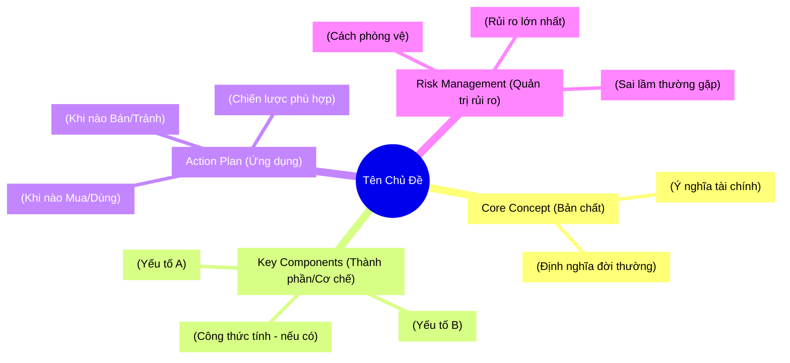

# Create Finance Lecture Skill

Skill hỗ trợ tác giả xây dựng nội dung tài chính đầu tư: Chính xác về chuyên môn - Dễ hiểu về diễn đạt - Thực tế về ứng dụng.

## Quy trình tư duy sư phạm (Pedagogical Flow)

```mermaid
flowchart LR
    A[🎣 Hook (Nỗi đau/Lợi ích)] --> B[🔄 Analogy (Hình ảnh đời thường)]
    B --> C[🔬 Deep Dive (Bản chất tài chính)]
    C --> D[🛠 Practice (Các bước hành động)]
    D --> E[⚠️ Risk & Pitfalls (Cảnh báo rủi ro)]
    E --> F[🧩 MECE Mindmap (Tổng hợp)]
```

### Hook (Thu hút)
Bắt đầu bằng một câu hỏi, một lầm tưởng phổ biến hoặc một con số gây sốc liên quan đến túi tiền của người đọc.

### Analogy (Ẩn dụ)
"Phiên dịch" khái niệm tài chính sang hình ảnh đời sống (Chợ búa, trồng trọt, ăn uống...) TRƯỚC KHI dùng thuật ngữ.

### Deep Dive (Kiến thức nền)
Giải thích cơ chế vận hành, công thức (nếu có), và các yếu tố vĩ mô tác động.

### Practice (Thực hành)
Hướng dẫn từng bước (Step-by-step) để áp dụng kiến thức vào đầu tư thực tế.

### Risk & Pitfalls (Cảnh báo)
Tài chính luôn đi kèm rủi ro. Chỉ ra các "bẫy" thường gặp và cách phòng tránh.

### MECE Mindmap (Tổng hợp)
Sơ đồ tư duy tóm tắt toàn bộ bài học để người đọc dễ ôn tập.

## Phân loại bài viết (Content Types)

Xác định loại bài viết để điều chỉnh cấu trúc phù hợp:

### Concept 101 (Giải mã khái niệm)
- **Mục tiêu:** Hiểu "Nó là gì?" và "Tại sao cần quan tâm?".
- **Ví dụ:** Lạm phát, P/E, Lãi suất kép, Sổ hồng vs Sổ đỏ.

### Strategy/How-to (Hướng dẫn chiến lược)
- **Mục tiêu:** Cầm tay chỉ việc, các bước thực hiện.
- **Ví dụ:** Cách đọc bảng điện, Quy trình mua nhà 5 bước, Phương pháp DCA.

### Comparative (So sánh & Lựa chọn)
- **Mục tiêu:** Phân tích Trade-off (Đánh đổi) để ra quyết định.
- **Ví dụ:** Gửi tiết kiệm hay mua Vàng? Mua Chung cư hay Đất nền?

### Market Analysis (Đọc vị thị trường)
- **Mục tiêu:** Kết nối sự kiện vĩ mô với túi tiền cá nhân.
- **Ví dụ:** FED tăng lãi suất thì mình nên làm gì? Giá dầu tăng ảnh hưởng gì đến cổ phiếu?

## Văn phong bắt buộc

- **Analogy First:** Mọi concept mới PHẢI có ẩn dụ đời sống đi kèm ngay lập tức.
- **No Jargon Left Behind:** Giải thích thuật ngữ chuyên ngành ngay lần đầu xuất hiện.
- **Tone:** Khách quan, bình tĩnh, sư phạm. Không hô hào (FOMO), không dọa dẫm (FUD).
- **Paragraph ngắn:** Tối đa 4-5 dòng/đoạn để dễ đọc trên mobile.
- **Visual Formatting:** Sử dụng danh sách, bôi đậm, và emoji (⚠️, ✅, ❌, 💡, 💰) để điều hướng mắt người đọc.
- **Disclaimer:** Luôn có dòng miễn trừ trách nhiệm (Đây là thông tin tham khảo, không phải lời khuyên đầu tư) ở các bài viết về nhận định.

## Mermaid Diagram Types cho Tài chính

Sử dụng Mermaid để visual hóa dữ liệu tài chính:

- **Flowchart:** Dùng cho quy trình (Quy trình giao dịch, Luồng tiền).
- **Pie Chart:** Dùng cho phân bổ danh mục đầu tư (Asset Allocation).
- **XYChart (Bar/Line):** Dùng để minh họa lãi suất kép, tăng trưởng giá, hoặc so sánh lợi nhuận.
- **QuadrantChart:** Dùng cho ma trận Rủi ro/Lợi nhuận (Risk/Reward Matrix).
- **Lưu ý quan trọng:** Với mọi diagram (đặc biệt là Mindmap), PHẢI đặt nội dung text trong dấu ngoặc kép `""` và gán ID nếu cần thiết để tránh lỗi cú pháp với các ký tự đặc biệt `()`, `[]`, v.v. Ví dụ: `id["Nội dung (có ngoặc)"]`.

## Quy tắc Mindmap (MECE Integration)

Cuối mỗi bài viết, BẮT BUỘC tạo một sơ đồ tư duy bằng Mermaid.
Mindmap phải tuân thủ nguyên tắc MECE với 4 nhánh chính cố định nhưng được điều chỉnh cho ngữ cảnh tài chính:



## Template Yêu cầu (Prompt mẫu để gọi Skill)

Để sử dụng skill này hiệu quả, người dùng nên cung cấp input theo dạng:

- **Chủ đề:** [Ví dụ: Trái phiếu doanh nghiệp]
- **Đối tượng:** [Ví dụ: Người mới đi làm, muốn tiết kiệm an toàn]
- **Mục tiêu:** [Ví dụ: Hiểu trái phiếu khác gì gửi tiết kiệm và rủi ro là gì]

---
> Converted and distributed by [TomeVault](https://tomevault.io/claim/vuanhtu1993) — claim your Tome and manage your conversions.
<!-- tomevault:4.0:skill_md:2026-04-14 -->
