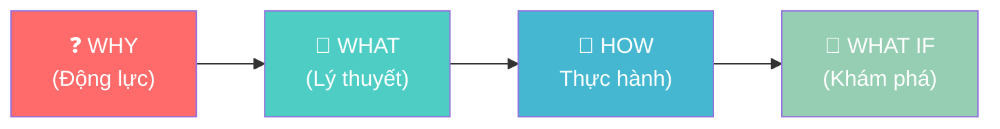
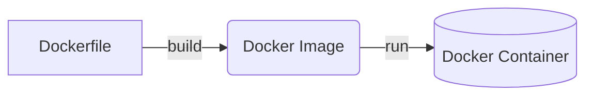
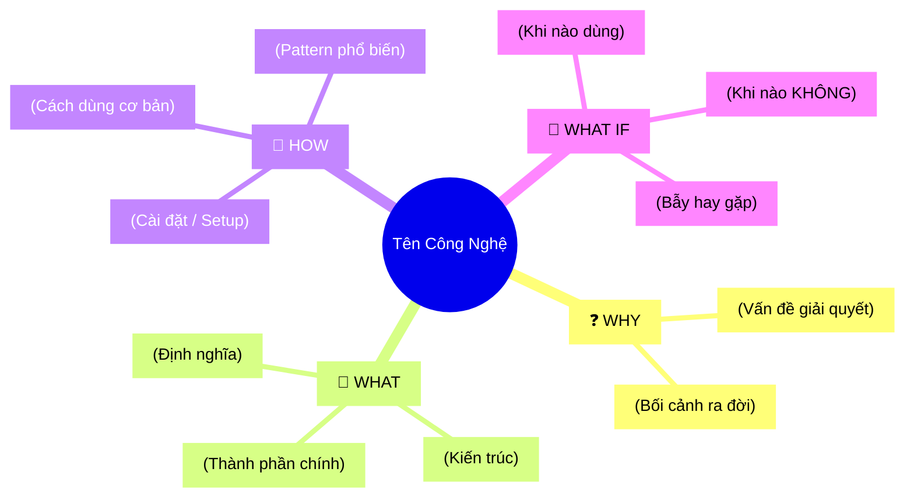

# Create Tech Lecture Skill

Skill hỗ trợ giảng viên CNTT tạo bài viết kỹ thuật đi thẳng vào trọng tâm, tinh gọn và dễ hiểu, áp dụng hệ thống **4MAT** để phục vụ đủ 4 kiểu người học.

## Phần 1: Agenda & Learning Outcomes (BẮT BUỘC)

**Mỗi bài viết PHẢI bắt đầu bằng khối Agenda.** Đây là "hợp đồng học tập" giữa người viết và người đọc, giúp người học biết trước họ sẽ đạt được gì.

### Template Agenda

```markdown
## 📋 Agenda

**Thời gian đọc ước tính:** ~X phút

### Sau bài này, bạn sẽ:
- ✅ **Hiểu** được [khái niệm cốt lõi A] là gì và tại sao nó tồn tại
- ✅ **Giải thích** được [khái niệm B] bằng ngôn ngữ đơn giản cho người khác
- ✅ **Tự tay** làm được [task thực hành C] từ đầu
- ✅ **Phân biệt** được khi nào dùng [X] và khi nào không nên dùng [X]

### Yêu cầu đầu vào (Prerequisites):
- 🔹 Biết cơ bản về [kiến thức A]
- 🔹 Đã từng [hành động B] ít nhất một lần
```

### Quy tắc viết Learning Outcomes
- Dùng **động từ hành động** (theo Bloom's Taxonomy): *hiểu, giải thích, tự tay làm, phân biệt, áp dụng, thiết kế*
- **Tối đa 4-5 outcomes** — nhiều hơn sẽ gây choáng ngợp
- Outcomes phải **đo lường được** — tránh viết mơ hồ như "hiểu sâu về X"

---

## Phần 2: Quy trình 4MAT System

4MAT phục vụ 4 kiểu người học khác nhau trong cùng một bài viết.



### 🔴 WHY — Tại sao tôi phải học cái này?
**Mục tiêu:** Nêu bật vấn đề kỹ thuật cốt lõi và giá trị giải quyết nội tại.

Đi thẳng vào **Problem Statement** (Vấn đề kỹ thuật) và **Solution** (Công nghệ này giải quyết nó như thế nào) một cách ngắn gọn, súc tích.

**Phải bao gồm:**
- **Problem Statement:** Nêu định dạng cấu trúc vấn đề bằng bullet points trực tiếp.
- **Solution:** Giá trị cốt lõi / Cách thức khái niệm/công nghệ này mang lại để xử lý bài toán trên.
- Tránh lối dẫn dắt kể chuyện dài dòng ("Bạn đã bao giờ...").

**Ví dụ:**
```markdown
## ❓ Vấn đề & Giải pháp của Docker

**Vấn đề (Problem Statement):**
- Môi trường phát triển không đồng nhất (chạy trên máy Dev nhưng lỗi khi release Production).
- Xung đột version thư viện khi chạy nhiều project trên cùng một server máy chủ.

**Giải pháp (Solution):**
Docker cung cấp nền tảng **containerization**, giúp định nghĩa và đóng gói ứng dụng cùng mọi dependencies vào một container độc lập. Nhanh gọn và đảm bảo môi trường nhất quán tuyệt đối ở mọi nơi cài đặt.
```

---

### 🟢 WHAT — Nó là cái gì?
**Mục tiêu:** Đưa ra định nghĩa kỹ thuật chính xác và trực quan hóa kiến trúc/luồng hoạt động.

Đi thẳng vào trọng tâm kỹ thuật kết hợp với minh họa sơ đồ. Dành cho người học muốn nắm bắt bản chất cốt lõi ngay lập tức thay vì đọc văn xuôi dài dòng.

**Phải bao gồm:**
1. **Định nghĩa kỹ thuật:** Đưa ra khái niệm chính xác, súc tích ngay từ đầu.
2. **Trực quan hóa (Visual First):** LUÔN sử dụng sơ đồ Mermaid (Architecture/Flow) để minh họa cơ chế hoạt động, thay cho lời văn thuyết minh.
3. **Giải thích thuật ngữ:** Giữ nguyên tiếng Việt/tiếng Anh, giải thích nhanh trong ngoặc đơn hoặc liệt kê gọn gàng.
*(Lưu ý: Hạn chế tối đa việc lạm dụng ẩn dụ. Chỉ dùng 1-2 câu "ví như" nếu concept thực sự quá trừu tượng và khó mường tượng).*

**Ví dụ:**
```markdown
## 📖 Docker hoạt động như thế nào?

**Định nghĩa:** Docker là một nền tảng tạo, chạy và quản lý ứng dụng bên trong các Container (môi trường cô lập) dựa trên nhân Linux.

**Kiến trúc cốt lõi:**

- **Image:** Template hệ thống chứa ứng dụng và thư viện liên quan.
- **Container:** Một instance thực thể đang chạy được sinh ra từ Image.
```

---

### 🔵 HOW — Làm nó như thế nào?
**Mục tiêu:** Người đọc hình dung và thực hành được ngay lập tức với ví dụ tinh gọn.

Tập trung vào core logic kỹ thuật. Triển khai theo module.

**Phải bao gồm:**
- **Code ngắn gọn, trực diện (Concise Examples):** Tinh lược mọi boilerplate không liên quan (như import thừa, cấu hình không trọng tâm), chỉ lấy phần cốt lõi.
- **Code có chú thích WHY** (Tại sao viết thế này) thay vì WHAT (Đoạn này làm gì).
- **Tên file rõ ràng** ở đầu mỗi snippet.
- **Output mong đợi** để người đọc tự kiểm tra.

**Ví dụ:**
```markdown
## 🔨 Tạo Dockerfile đầu tiên

### Bước 1: Tạo file cấu hình

```dockerfile
# filename: Dockerfile

# Dùng Node 20 LTS vì đây là phiên bản ổn định nhất
FROM node:20-alpine

WORKDIR /app

# Copy package.json TRƯỚC khi copy source code
# → Tận dụng Docker cache layer, giúp rebuild siêu nhanh nếu chỉ thay đổi mã nguồn
COPY package*.json ./
RUN npm ci --only=production

COPY . .
EXPOSE 3000

CMD ["node", "server.js"]
```
```

---

### 🟡 WHAT IF — Chuyện gì xảy ra nếu...?
**Mục tiêu:** Mở rộng tư duy, kích thích khám phá và ứng dụng thực tế.

Tương đương bước **Usecase + Pitfalls** trong quy trình cũ. Dành cho người học thích *khám phá và tư duy phản biện*.

**Phải bao gồm:**
- **Khi nào DÙNG vs KHÔNG DÙNG** — Trade-off rõ ràng
- **Common Pitfalls (Bẫy hay gặp)** — Lỗi điển hình mà Junior hay mắc
- **"What if tôi không dùng X?"** — Phương án thay thế
- **Ví dụ thực tế** — Công ty nào dùng, bài toán nào phù hợp

**Ví dụ:**
```markdown
## 🚀 Docker — Khi nào dùng, khi nào không?

| ✅ NÊN dùng | ❌ KHÔNG nên dùng |
|-------------|------------------|
| Team > 2 người, cần môi trường nhất quán | Script chạy 1 lần, không cần isolate |
| Microservices với nhiều services | Ứng dụng cần access trực tiếp phần cứng |
| CI/CD pipeline | Prototype cá nhân đơn giản |

### ⚠️ Pitfalls hay gặp

**1. Chạy process với quyền root trong container**
Đây là lỗ hổng bảo mật nghiêm trọng. Luôn thêm `USER node` trước `CMD`.

**2. Không dùng `.dockerignore`**
Sẽ copy cả `node_modules` (hàng GB) vào image → build chậm kinh khủng.
```

---

## Phần 3: Kết thúc bài — MECE Mindmap (BẮT BUỘC)

Cuối mỗi bài viết, **BẮT BUỘC** tạo sơ đồ tư duy Mermaid tổng hợp kiến thức theo nguyên tắc **MECE** (Mutually Exclusive, Collectively Exhaustive).

4 nhánh chính cố định khớp với 4 pha của 4MAT:



**Lưu ý:**
- Dùng từ khóa ngắn gọn (**Keywords only**), không viết câu dài
- **Sử dụng skill `mermaid-expert`** để kiểm tra cú pháp trước khi xuất ra

---

## Phần 4: Phân loại bài viết

| Loại | Mục tiêu | Khi nào dùng |
|------|----------|--------------|
| **Concept Explained** | Giải thích khái niệm | "Docker là gì?", "OAuth hoạt động thế nào?" |
| **Tutorial / Guide** | Hướng dẫn làm | "Build API với Go", "Setup CI/CD" |
| **Architecture Review** | So sánh/Phân tích | "Microservices vs Monolith", "Chọn database" |

---

## Phần 5: Quy tắc Code & Văn phong

### Quy tắc Code

**File Naming:**
```javascript
// ✅ filename: src/services/auth.service.ts
export class AuthService { ... }
```

**Comment WHY, not WHAT:**
```python
# ❌ Sai: Khai báo biến x
x = 10

# ✅ Đúng: Giới hạn retry để tránh vòng lặp vô tận khi API không phản hồi
MAX_RETRIES = 10
```

**Concise Examples (Tinh gọn tối đa code):**
```go
// ... (các import statements đã được rút gọn lại)
func main() {
    // 👇 Khởi tạo router bằng Gin framework (Trọng tâm)
    router := gin.Default()
    router.GET("/ping", pingHandler)
}
```

### Văn phong bắt buộc

- **Direct & Visual First:** Đi thẳng vào định nghĩa kỹ thuật, tận dụng tối đa sơ đồ (Mermaid) minh họa kiến trúc thay cho văn xuôi giải thích dài dòng.
- **Bullet Points:** Ưu tiên gạch đầu dòng ngắn gọn để trình bày ý tứ thay vì viết đoạn văn (paragraph) quá tràng giang đại hải.
- **Giải thích thuật ngữ:** Giữ nguyên tiếng Anh, giải thích ngay lần đầu xuất hiện ngắn gọn.
- **Dùng emoji** để đánh dấu mục quan trọng (⚠️, ✅, ❌, 💡).
- **Trade-off rõ ràng:** Luôn chỉ ra đánh đổi của giải pháp. Thay vì tốn thời gian chứng minh sự hoàn hảo tuyệt đối công nghệ, hãy đưa góc nhìn đa chiều.

---

## Checklist trước khi xuất bài

- [ ] Bài viết có đi thẳng vào **Problem Statement** & **Solution** (trọng tâm) thay vì kể chuyện dài dòng ở phần **WHY** không?
- [ ] Phần **WHAT** có định nghĩa kỹ thuật chuẩn xác và sơ đồ trực quan (Mermaid) minh họa thay cho văn xuôi dày đặc không?
- [ ] Các đoạn code ví dụ (**HOW**) đã được lược bỏ các boilerplate thừa, giữ mức tinh gọn, đi thẳng vào cốt lõi logic lập trình chưa?
- [ ] Tham số và tính năng đánh đổi trong **WHAT IF** có liệt kê rõ ràng không?
- [ ] Có **MECE Mindmap** nằm ở dưới cùng của bài?
- [ ] Giọng văn có tuân thủ cấu trúc gọn gàng, chia bullet point dễ theo dõi?
- [ ] Mermaid syntax đã có sự kiểm duyệt của skill `mermaid-expert` khi thiết kế?

---
> Converted and distributed by [TomeVault](https://tomevault.io/claim/vuanhtu1993) — claim your Tome and manage your conversions.
<!-- tomevault:4.0:skill_md:2026-04-14 -->
