# Mermaid Expert Skill

Skill này tập hợp các Best Practices để đảm bảo Mermaid diagrams luôn render thành công trên Docusaurus và các nền tảng khác.

## 🛡️ The "Anti-Break" Golden Rules (Quy tắc Vàng)

Để tránh 99% lỗi "Parse error", hãy tuân thủ 3 quy tắc sau:

### Rule #1: ALWAYS Quote Labels (Luôn dùng ngoặc kép)
Không bao giờ viết text trần. Luôn bao quanh label bằng dấu ngoặc kép `""`.
*   ❌ Sai: `A[Hello World]`
*   ✅ Đúng: `A["Hello World"]`

### Rule #2: ALWAYS Use Explicit IDs (Luôn có ID rõ ràng)
Đừng để Mermaid tự sinh ID hoặc dùng text làm ID. Hãy đặt ID ngắn gọn, không dấu, alphanumeric.
*   ❌ Sai: `(Khái niệm)`
*   ✅ Đúng: `concept["(Khái niệm)"]`

### Rule #3: Escape Special Characters (Xử lý ký tự đặc biệt)
Các ký tự `()`, `[]`, `{}`, `"`, `#` rất dễ gây lỗi parser nếu không được xử lý.
*   **Trong Label:** Dùng ngoặc kép bao quanh là đủ an toàn cho `()`, `[]`.
*   **Dấu ngoặc kép trong label:** Dùng HTML entity `#quot;`. Ví dụ: `id["Nói: #quot;Hello#quot;"]`
*   **Icon/Emoji:** Hỗ trợ tốt trong ngoặc kép. `id["🚀 Keep moving"]`

### Rule #4: ALWAYS Use ` ` for Line Breaks (KHÔNG dùng `\n`)
Dùng `\n` trong label **sẽ render ra chữ `\n`** thay vì xuống dòng thật sự, gây mất chữ khi node bị tràn.
*   ❌ Sai: `A["Web Application\nNotebook UI"]` → Hiển thị `\n` như văn bản
*   ✅ Đúng: `A["Web Application Notebook UI"]` → Xuống dòng thật

**Áp dụng cho tất cả diagram types:** flowchart, graph, sequenceDiagram node labels.

### Rule #5: Mindmap — Parser riêng, KHÔNG như Flowchart ⚠️
Mindmap có cú pháp **HOÀN TOÀN KHÁC** so với `graph`/`flowchart`. **3 điều bắt buộc:**

1.  **Root node:** Chỉ dùng `root((Text))` hoặc `root[Text]`. **TUYỆT ĐỐI KHÔNG** dùng `root(["Text"])` — kết hợp `()` và `[]` gây crash ngay.
2.  **Leaf nodes:** Dùng **text trần** (không ngoặc) là an toàn nhất. `["Text"]` cũng được nhưng **không dùng** `id["Text"]` pattern như flowchart.
3.  **Ký tự nguy hiểm trong text trần:** Em dash `—`, dấu phẩy `,`, colon `:` trong text trần có thể gây lỗi. Thay bằng gạch ngang `-` hoặc xóa bỏ.

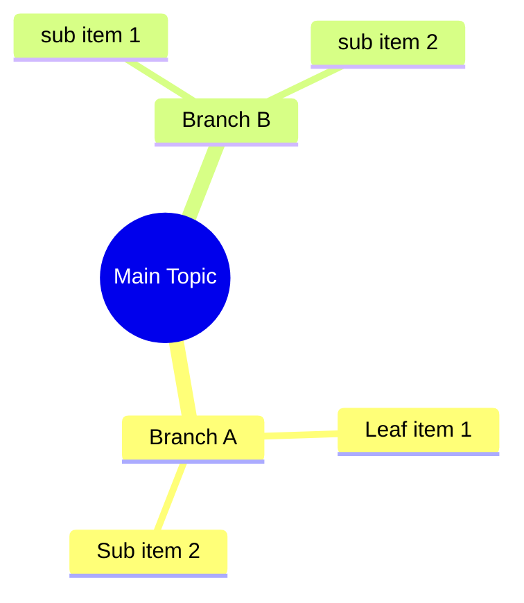
```mermaid
mindmap
  root((Main Topic))
    Branch A
      Leaf item 1
      Sub item 2
    Branch B
      sub item 1
      sub item 2
```

---

## 🏗️ Robust Templates (Mẫu An Toàn)

Copy và điền vào các mẫu này để đảm bảo không lỗi.

### 1. Flowchart (Lưu đồ)
Dùng `graph TD` (trên xuống) hoặc `graph LR` (trái sang).

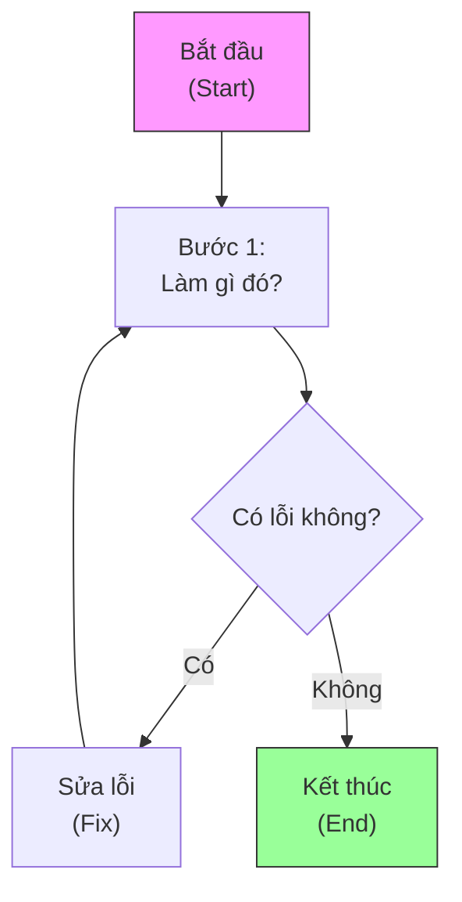
```mermaid
graph TD
    Start["Bắt đầu<br>(Start)"] --> Step1["Bước 1:<br>Làm gì đó?"]
    Step1 --> Decision{"Có lỗi không?"}
    Decision -- "Có" --> Fix["Sửa lỗi<br>(Fix)"]
    Fix --> Step1
    Decision -- "Không" --> End["Kết thúc<br>(End)"]
    
    %% Styling (Optional)
    style Start fill:#f9f,stroke:#333
    style End fill:#9f9,stroke:#333
```

### 2. Sequence Diagram (Biểu đồ tuần tự)
Sử dụng `participant as` để tách biệt ID và Label.

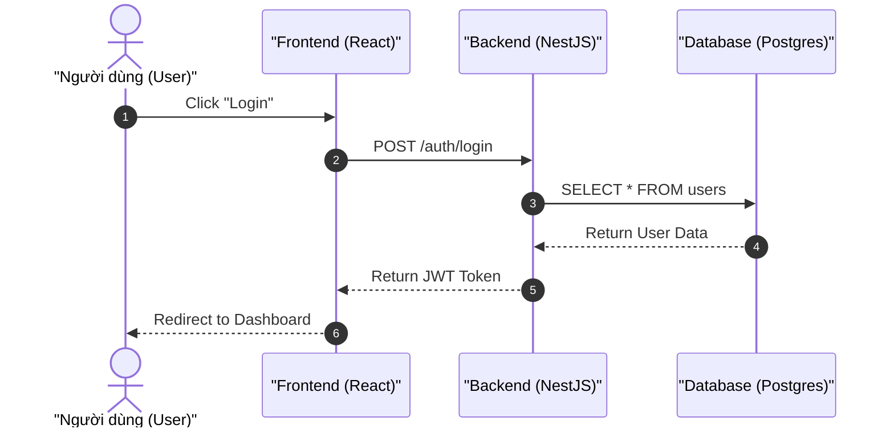
```mermaid
sequenceDiagram
    autonumber
    actor User as "Người dùng (User)"
    participant FE as "Frontend (React)"
    participant BE as "Backend (NestJS)"
    participant DB as "Database (Postgres)"

    User->>FE: Click "Login"
    FE->>BE: POST /auth/login
    BE->>DB: SELECT * FROM users
    DB-->>BE: Return User Data
    BE-->>FE: Return JWT Token
    FE-->>User: Redirect to Dashboard
```

### 3. Class Diagram (Biểu đồ lớp)
Dùng biểu đồ lớp để diễn tả hướng đối tượng, thuộc tính (+), và phương thức (+).

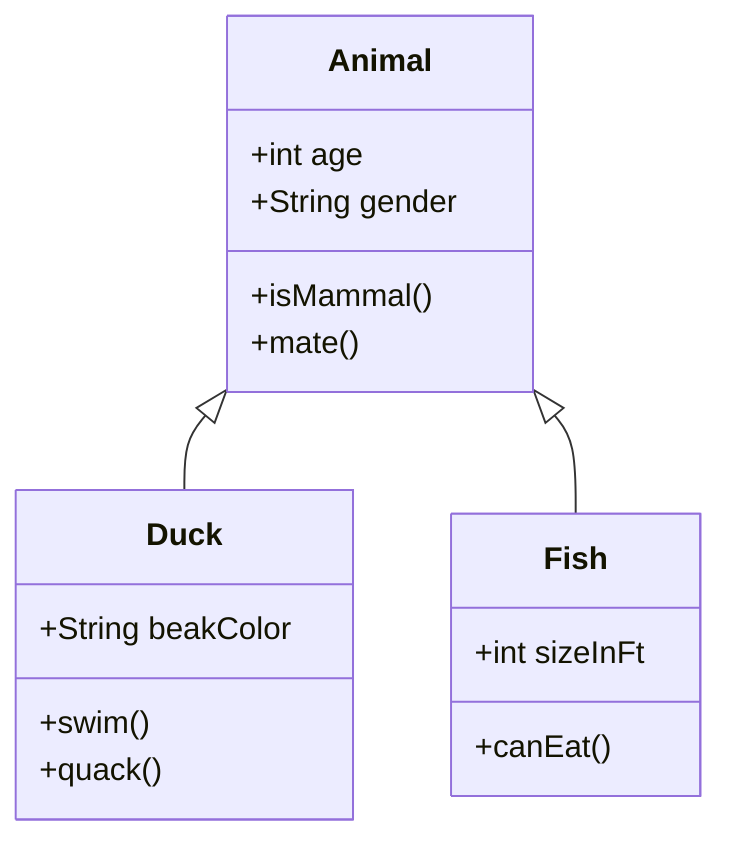
```mermaid
classDiagram
    class Animal {
        +int age
        +String gender
        +isMammal()
        +mate()
    }
    class Duck {
        +String beakColor
        +swim()
        +quack()
    }
    class Fish {
        +int sizeInFt
        +canEat()
    }
    Animal <|-- Duck
    Animal <|-- Fish
```

### 4. State Diagram (Biểu đồ trạng thái)
Sử dụng `stateDiagram-v2` cho syntax mới nhất.

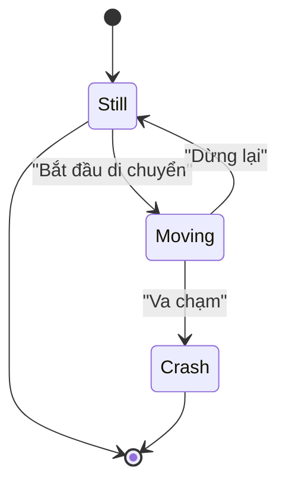
```mermaid
stateDiagram-v2
    [*] --> Still
    Still --> [*]
    Still --> Moving : "Bắt đầu di chuyển"
    Moving --> Still : "Dừng lại"
    Moving --> Crash : "Va chạm"
    Crash --> [*]
```

### 5. Entity Relationship Diagram (ER Diagram)
Dùng `||--o{` cho quan hệ. Text mô tả quan hệ phải có dấu ngoặc kép.

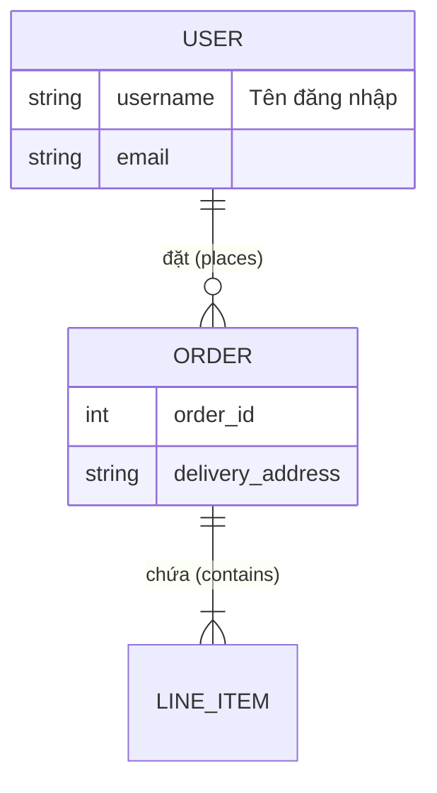
```mermaid
erDiagram
    USER ||--o{ ORDER : "đặt (places)"
    USER {
        string username "Tên đăng nhập"
        string email
    }
    ORDER ||--|{ LINE_ITEM : "chứa (contains)"
    ORDER {
        int order_id
        string delivery_address
    }
```

### 6. User Journey (Hành trình người dùng)
Biểu đồ trải nghiệm/hành trình giúp hiển thị cảm xúc của người dùng.

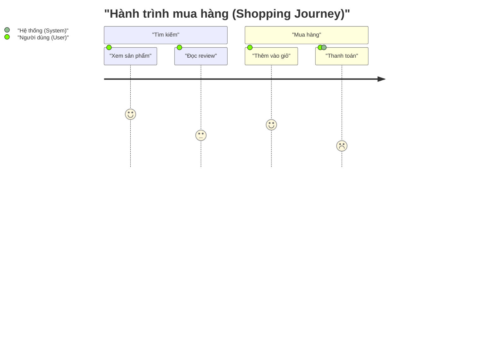
```mermaid
journey
    title "Hành trình mua hàng (Shopping Journey)"
    section "Tìm kiếm"
      "Xem sản phẩm": 5: "Người dùng (User)"
      "Đọc review": 3: "Người dùng (User)"
    section "Mua hàng"
      "Thêm vào giỏ": 4: "Người dùng (User)"
      "Thanh toán": 2: "Người dùng (User)", "Hệ thống (System)"
```

### 7. Gantt (Biểu đồ Gantt)
Hiển thị lịch trình và tiến độ dự án.

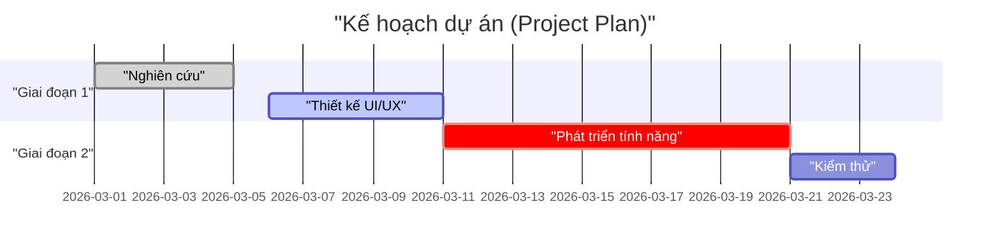
```mermaid
gantt
    title "Kế hoạch dự án (Project Plan)"
    dateFormat  YYYY-MM-DD
    section "Giai đoạn 1"
    "Nghiên cứu": done, des1, 2026-03-01, 2026-03-05
    "Thiết kế UI/UX": active, des2, 2026-03-06, 5d
    section "Giai đoạn 2"
    "Phát triển tính năng": crit, dev1, after des2, 10d
    "Kiểm thử": dev2, after dev1, 3d
```

### 8. Pie Chart (Biểu đồ tròn)

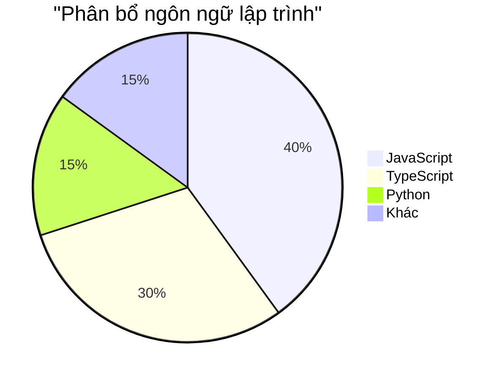
```mermaid
pie title "Phân bổ ngôn ngữ lập trình"
    "JavaScript" : 40
    "TypeScript" : 30
    "Python" : 15
    "Khác" : 15
```

### 9. Quadrant Chart (Biểu đồ 4 góc)
**Cảnh báo:** Quadrant Chart hiện tại **KHÔNG** hỗ trợ tốt dấu ngoặc kép trong text trục (axis labels). Hãy dùng từ đơn giản cho trục.

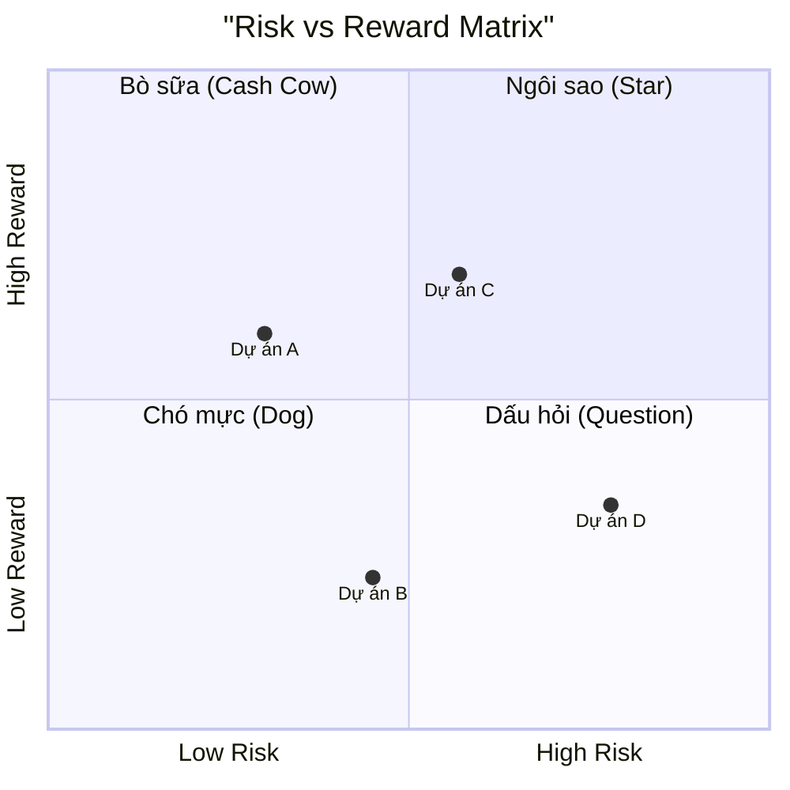
```mermaid
quadrantChart
    title "Risk vs Reward Matrix"
    x-axis Low Risk --> High Risk
    y-axis Low Reward --> High Reward
    
    quadrant-1 "Ngôi sao (Star)"
    quadrant-2 "Bò sữa (Cash Cow)"
    quadrant-3 "Chó mực (Dog)"
    quadrant-4 "Dấu hỏi (Question)"
    
    "Dự án A": [0.3, 0.6]
    "Dự án B": [0.45, 0.23]
    "Dự án C": [0.57, 0.69]
    "Dự án D": [0.78, 0.34]
```

### 10. Requirement Diagram (Biểu đồ yêu cầu)
Dùng để truy xuất nguồn gốc yêu cầu (Requirements Traceability).

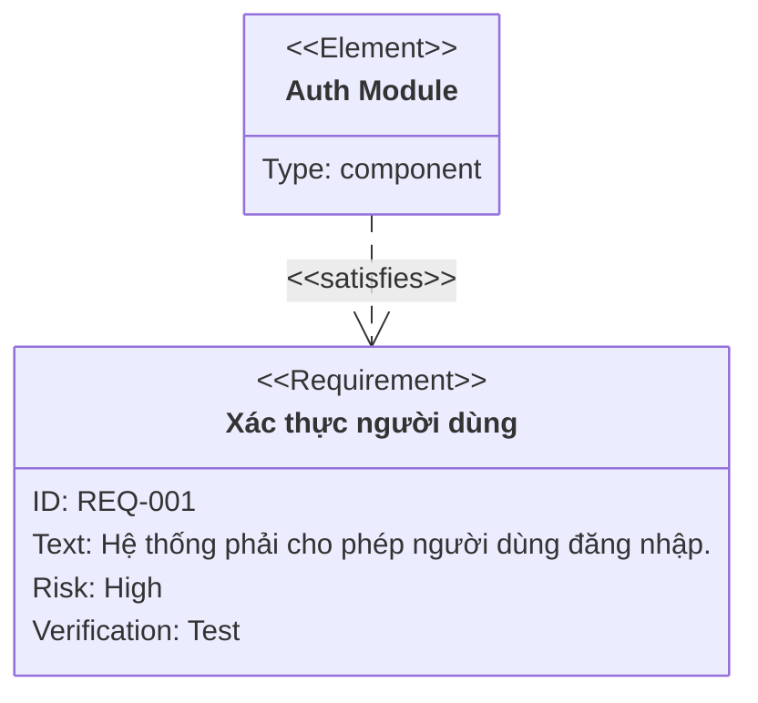
```mermaid
requirementDiagram
    requirement "Xác thực người dùng" {
        id: "REQ-001"
        text: "Hệ thống phải cho phép người dùng đăng nhập."
        risk: high
        verifymethod: test
    }
    element "Auth Module" {
        type: "component"
    }
    "Auth Module" - satisfies -> "Xác thực người dùng"
```

### 11. GitGraph (Git) Diagram
Sơ đồ nhánh Git và luồng commit lịch sử.

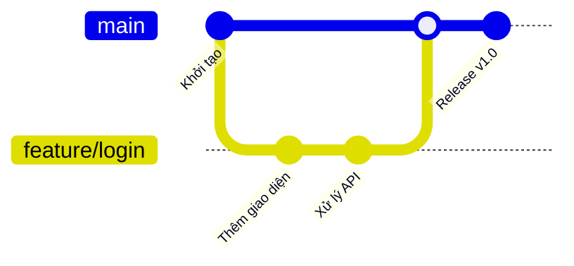
```mermaid
gitGraph
    commit id: "Khởi tạo"
    branch "feature/login"
    checkout "feature/login"
    commit id: "Thêm giao diện"
    commit id: "Xử lý API"
    checkout main
    merge "feature/login"
    commit id: "Release v1.0"
```

### 12. C4 Diagram 🦺⚠️
Biểu đồ kiến trúc phần mềm (C4 Context/Container/Component). *Lưu ý: Dễ gây lỗi nếu đặt tên tham số sai.*

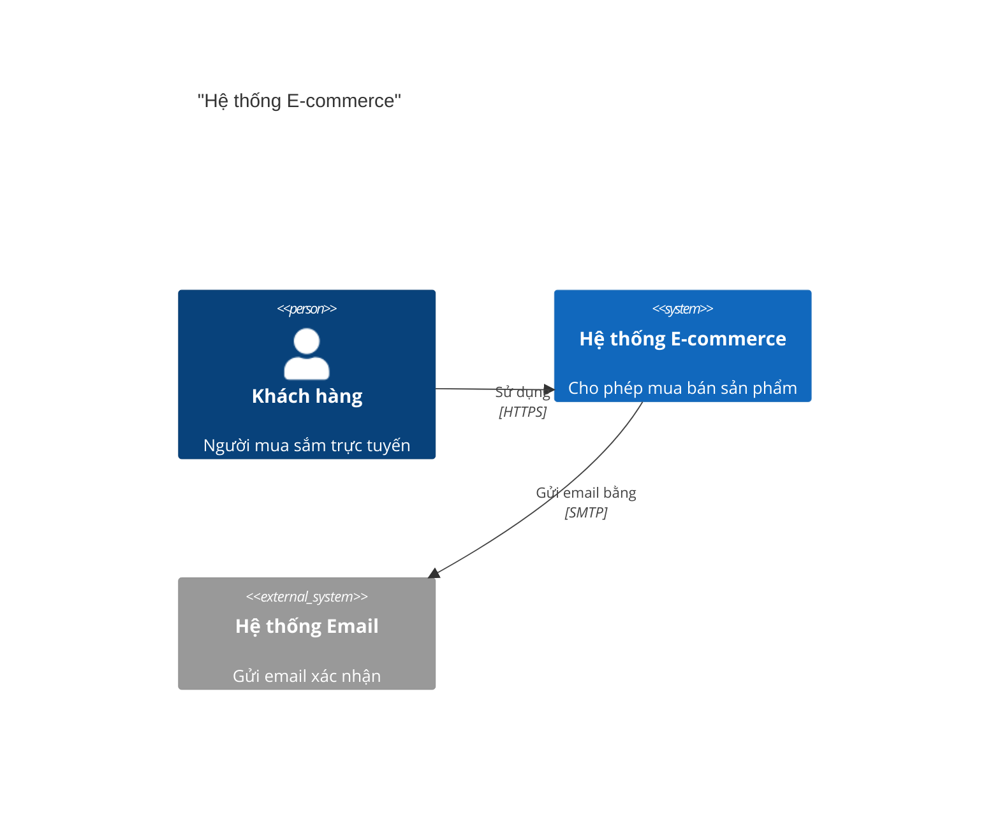
```mermaid
C4Context
    title "Hệ thống E-commerce"
    Person(customer, "Khách hàng", "Người mua sắm trực tuyến")
    System(ecommerce, "Hệ thống E-commerce", "Cho phép mua bán sản phẩm")
    System_Ext(mail, "Hệ thống Email", "Gửi email xác nhận")
    
    Rel(customer, ecommerce, "Sử dụng", "HTTPS")
    Rel(ecommerce, mail, "Gửi email bằng", "SMTP")
```

### 13. Mindmaps (Sơ đồ tư duy)
**Lưu ý:** Mindmap rất nhạy cảm với dấu ngoặc đơn `()`. Bắt buộc dùng `id["Label"]`.

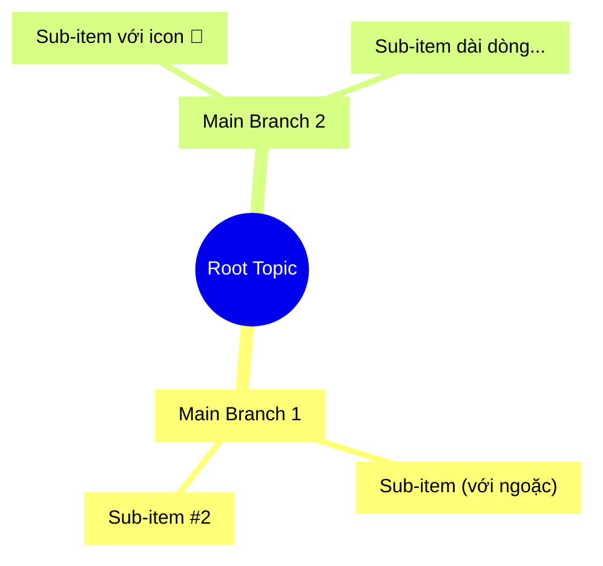
```mermaid
mindmap
  root((Root Topic))
    Branch1["Main Branch 1"]
      Sub1["Sub-item (với ngoặc)"]
      Sub2["Sub-item #2"]
    Branch2["Main Branch 2"]
      Sub3["Sub-item với icon 🚀"]
      Sub4["Sub-item dài dòng..."]
```

### 14. Timeline (Dòng thời gian)
Dùng cho timeline sự kiện lịch sử hoặc roadmap dự án.

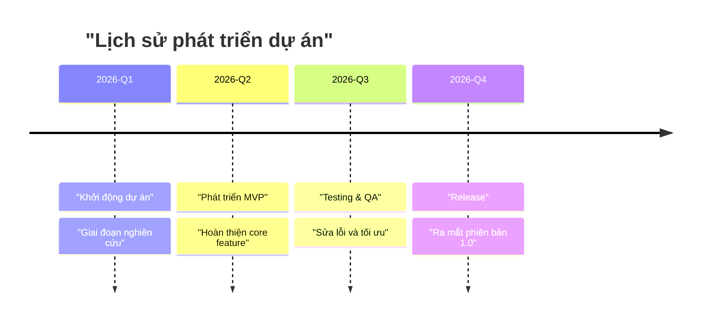
```mermaid
timeline
    title "Lịch sử phát triển dự án"
    2026-Q1 : "Khởi động dự án" : "Giai đoạn nghiên cứu"
    2026-Q2 : "Phát triển MVP" : "Hoàn thiện core feature"
    2026-Q3 : "Testing & QA" : "Sửa lỗi và tối ưu"
    2026-Q4 : "Release" : "Ra mắt phiên bản 1.0"
```

### 15. ZenUML
Viết Sequence Diagram rút gọn bằng ZenUML. *(Lưu ý: Parser nhạy cảm với chuỗi rỗng).*

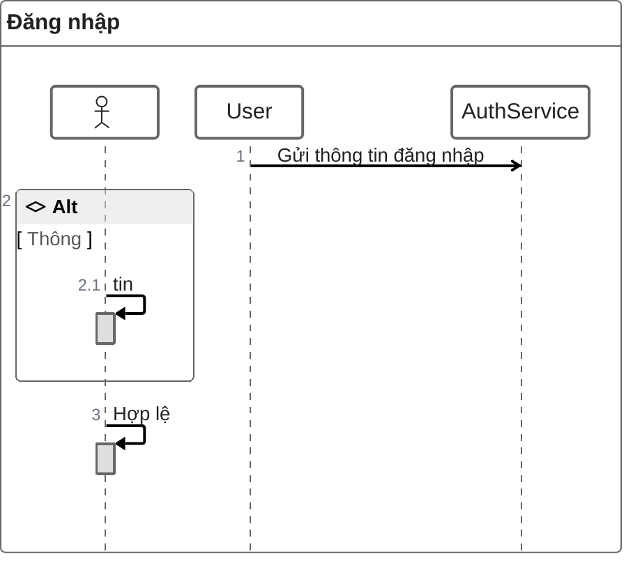
```mermaid
zenuml
    title Đăng nhập
    
    User->AuthService: Gửi thông tin đăng nhập
    if (Thông tin == "Hợp lệ") {
        AuthService->User: Trả về Trang chủ
    } else {
        AuthService->User: Báo lỗi Đăng nhập
    }
```

### 16. Sankey 🔥
Biểu đồ hiển thị luồng dữ liệu (Sankey). Format: `"Nguồn", "Đích", Giá trị`.

```mermaid
sankey-beta
    "Doanh thu tổng","Chi phí hoạt động",40
    "Doanh thu tổng","Lương nhân viên",30
    "Doanh thu tổng","Lợi nhuận",30
    "Chi phí hoạt động","Marketing",15
    "Chi phí hoạt động","Hàng hóa",25
```

### 17. XY Chart 🔥
Tạo biểu đồ Line và Bar kết hợp.

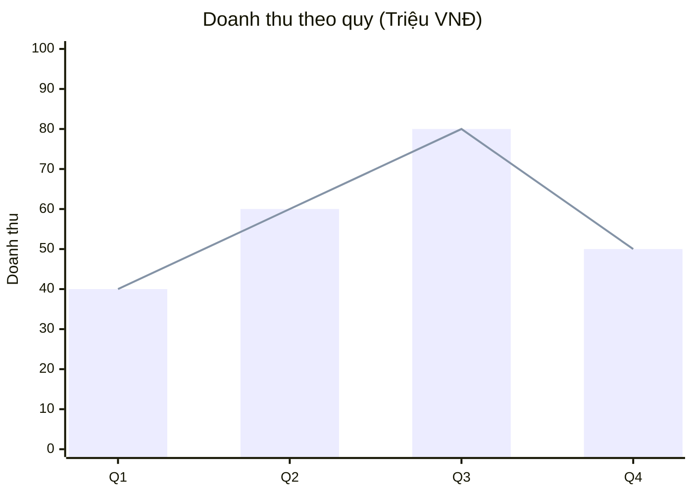
```mermaid
xychart-beta
    title "Doanh thu theo quy (Triệu VNĐ)"
    x-axis ["Q1", "Q2", "Q3", "Q4"]
    y-axis "Doanh thu" 0 --> 100
    bar [40, 60, 80, 50]
    line [40, 60, 80, 50]
```

### 18. Block Diagram 🔥
Sơ đồ khối định tuyến dạng lưới columns/rows.

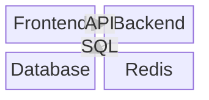
```mermaid
block-beta
    columns 2
    FE["Frontend"] BE["Backend"]
    DB["Database"] Cache["Redis"]
    FE -- "API" --> BE
    BE -- "SQL" --> DB
```

### 19. Packet 🔥
Biểu diễn cấu trúc frame/gói tin mạng.

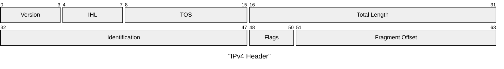
```mermaid
packet-beta
    title "IPv4 Header"
    0-3: "Version"
    4-7: "IHL"
    8-15: "TOS"
    16-31: "Total Length"
    32-47: "Identification"
    48-50: "Flags"
    51-63: "Fragment Offset"
```

### 20. Kanban 🔥
Bảng Kanban experimental quản lý công việc. (Experimental - Cẩn thận lỗi plugin cũ).

```mermaid
kanban
  Todo
    [Tạo dự án mới]
    [Viết tài liệu]
  In Progress
    [Code tính năng A]
  Done
    [Setup CI/CD]
```

### 21. Architecture 🔥
Kiến trúc cloud computing/server (Architecture Beta).

```mermaid
architecture-beta
    group api(cloud)[API]
    
    service db(database)[Database] in api
    service server(server)[Server] in api
    service ui(internet)[Frontend]
    
    ui:R -- L:server
    server:R -- L:db
```

### 22. Radar 🔥
Biểu đồ lục giác/đa giác hiển thị matrix đánh giá.

```mermaid
radar-beta
    title "Đánh giá hiệu suất"
    "Tính năng"
    "Bảo mật"
    "Hiệu năng"
    "UI/UX"
    "Bảo trì"
```

### 23. Treemap 🔥
Tạo biểu đồ dạng khối vuông phân cấp tỉ lệ data.

```mermaid
treemap-beta
    title "Phân bổ phân vùng máy chủ"
    "Disk_1"
        "Database": 50
        "Logs": 30
        "System": 20
    "Disk_2"
        "Storage": 80
        "Archives": 20
```

### 24. Venn 🔥
Biểu diễn tập hợp logic giao nhau.

```mermaid
venn-beta
    title "Ví dụ Biểu đồ Venn"
    set A
    set B
    set C
    union A B
    union B C
```

---

## 🔧 Troubleshooting Guide (Sửa Lỗi)

### Lỗi 1: `Expecting 'SQE', 'DOUBLECIRCLEEND'... got 'PS'`
*   **Nguyên nhân:** Thường do Mindmap hoặc Graph có chứa dấu `(` `)` `[` `]` mà không được bao trong ngoặc kép.
*   **Cách sửa:** Tìm chỗ text bị trần, bọc lại bằng `id["Text"]`.
    *   Sai: `(Khái niệm)`
    *   Đúng: `def["(Khái niệm)"]`

### Lỗi 2: `Parse error on line X` (Chung chung)
*   **Nguyên nhân:**
    1.  Dùng từ khóa trùng (ví dụ `end`, `subgraph` làm ID).
    2.  Thiếu dấu ngoặc đóng/mở.
    3.  Syntax sai (ví dụ `-->` trong Mindmap).
*   **Cách sửa:**
    1.  Kiểm tra dòng X.
    2.  Đổi ID sang tên khác (ví dụ `endNode` thay vì `end`).
    3.  Đảm bảo cú pháp đúng loại diagram (Mindmap không dùng mũi tên).

### Lỗi 3: Text bị cắt hoặc hiển thị sai
*   **Nguyên nhân:** Dùng ký tự lạ hoặc conflict HTML.
*   **Cách sửa:** Dùng HTML Entity hoặc bỏ bớt ký tự đặc biệt.

### Lỗi 4: `\n` hiển thị thành chữ, node bị tràn chữ ra ngoài
*   **Nguyên nhân:** Dùng `\n` để xuống dòng trong Mermaid — **không được hỗ trợ trong hầu hết diagram types**.
*   **Triệu chứng:** Label hiển thị `Web Application\nNotebook UI` thay vì xuống dòng; subgraph title bị cắt.
*   **Cách sửa:** Thay tất cả `\n` bằng ` ` trong node labels.
    *   Sai: `id["Web Application\nNotebook UI"]`
    *   Đúng: `id["Web Application Notebook UI"]`

### Lỗi 5: Mindmap crash ngay lập tức — không render được gì
*   **Nguyên nhân:** Dùng `root(["Text"])` — kết hợp sai `()` và `[]` mà mindmap parser không chấp nhận.
*   **Triệu chứng:** Diagram trắng hoàn toàn hoặc báo lỗi khi render.
*   **Cách sửa:**
    *   Sai: `root(["Next.js Navigation"])`
    *   Đúng: `root((Next.js Navigation))` — hình tròn kép
    *   Hoặc: `root[Next.js Navigation]` — hình vuông

---
> Converted and distributed by [TomeVault](https://tomevault.io/claim/vuanhtu1993) — claim your Tome and manage your conversions.
<!-- tomevault:4.0:skill_md:2026-04-15 -->
