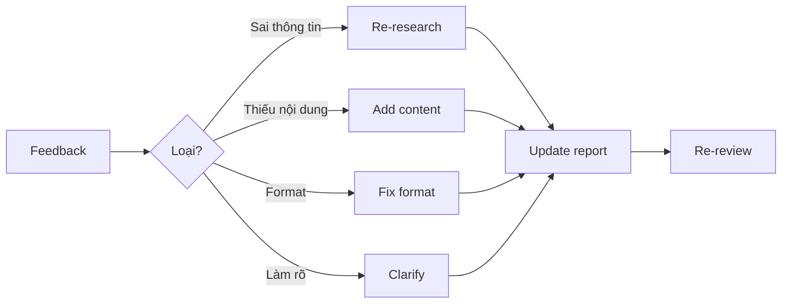

# Review Report Skill

Skill hướng dẫn QA và tinh chỉnh báo cáo.

## Quy trình Review

### Bước 1: Content Review

Xem [references/qa_checklists.md](references/qa_checklists.md) để checklist chi tiết.

**Quick Content Check:**
- [ ] Executive Summary có thể đọc độc lập và hiểu được
- [ ] Thuật ngữ chuyên ngành được giải thích lần đầu xuất hiện
- [ ] Có ít nhất 1 ví dụ minh họa cho mỗi concept chính
- [ ] Phần Kết luận có ít nhất 1 action item cụ thể
- [ ] Tất cả sources được trích dẫn trong References

### Bước 2: Format Review

**Markdown Check:**
- [ ] Heading hierarchy đúng (H1 → H2 → H3, không skip)
- [ ] Code blocks có syntax highlighting (```language)
- [ ] Links hoạt động và format đúng
- [ ] Bảng render đúng

**Mermaid Check:**
- [ ] Diagrams render không lỗi
- [ ] Labels rõ ràng, không quá dài
- [ ] Phù hợp với nội dung mô tả

### Bước 3: Readability Assessment

**Độ dài phù hợp:**
| Loại | Target | Acceptable Range |
|------|--------|-----------------|
| Quick | 500-1000 từ | 400-1200 từ |
| Standard | 1500-2500 từ | 1200-3000 từ |
| Deep Dive | 3000+ từ | 2500+ từ |

**Formatting:**
- [ ] Paragraphs ngắn (max 4-5 dòng)
- [ ] Sử dụng bullet points thay văn xuôi dài
- [ ] Có visual breaks (horizontal rules, headings)
- [ ] Không có wall of text

### Bước 4: Final Polish

- [ ] Đọc lại từ đầu đến cuối một lần
- [ ] Check typos và grammar
- [ ] Đảm bảo tone nhất quán
- [ ] Xác nhận target audience phù hợp

## Iteration Workflow

Khi nhận feedback cần chỉnh sửa:



**Nguyên tắc:**
- Không viết lại từ đầu nếu chỉ cần chỉnh nhỏ
- Ghi chú những gì đã thay đổi
- Chạy lại review checklist sau khi sửa

## Output Format

```markdown
## Review Report

### Summary
- **Status:** ✅ Ready / ⚠️ Needs fixes / ❌ Major issues
- **Issues found:** [Số lượng]

### Content Issues
| # | Issue | Severity | Location | Fix |
|---|-------|----------|----------|-----|
| 1 | [Mô tả] | High/Med/Low | [Section] | [Đề xuất] |

### Format Issues
| # | Issue | Location | Fix |
|---|-------|----------|-----|
| 1 | [Mô tả] | [Line/Section] | [Đề xuất] |

### Readability Score
- Word count: [X] words
- Paragraph avg: [X] lines
- Visual elements: [X] diagrams, [X] tables

### Recommendations
1. [Đề xuất 1]
2. [Đề xuất 2]
```

---
> Converted and distributed by [TomeVault](https://tomevault.io/claim/vuanhtu1993) — claim your Tome and manage your conversions.
<!-- tomevault:4.0:skill_md:2026-04-15 -->
